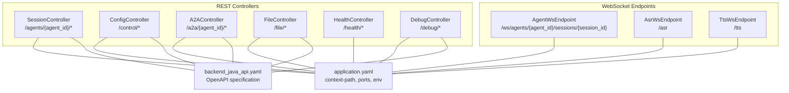
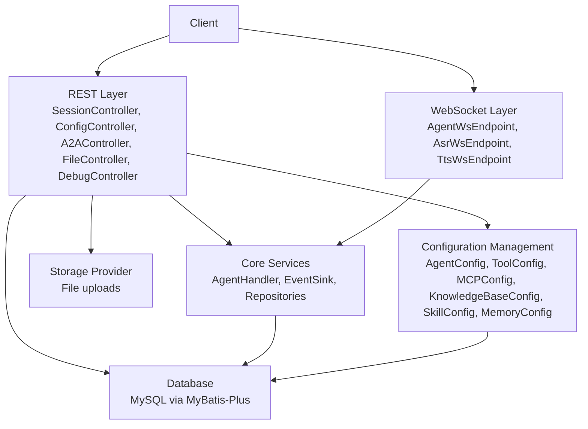
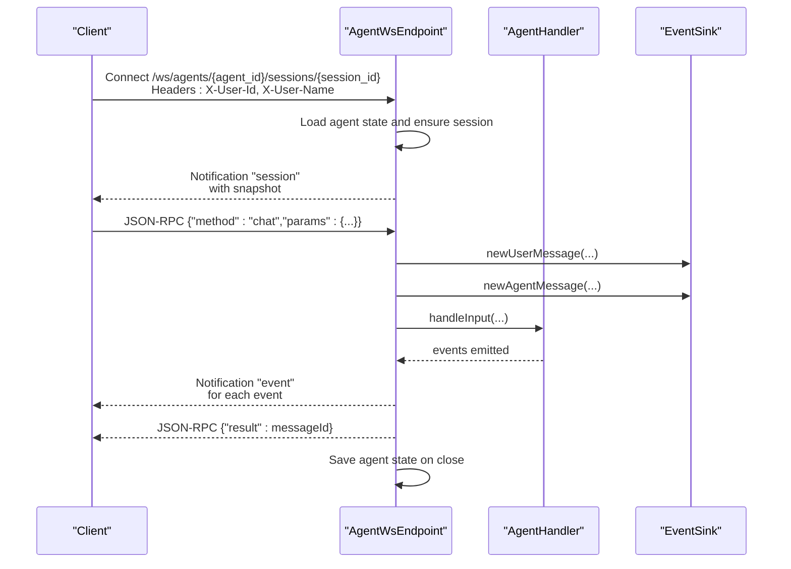
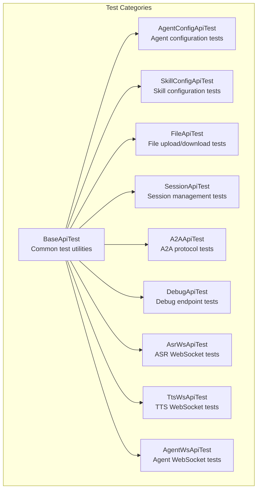
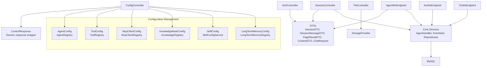

# API Reference

<cite>
**Referenced Files in This Document**
- [A2AController.java](file://backend_java/api/src/main/java/com/aliyun/tam/x/tron/api/A2AController.java)
- [SessionController.java](file://backend_java/api/src/main/java/com/aliyun/tam/x/tron/api/SessionController.java)
- [ConfigController.java](file://backend_java/api/src/main/java/com/aliyun/tam/x/tron/api/ConfigController.java)
- [FileController.java](file://backend_java/api/src/main/java/com/aliyun/tam/x/tron/api/FileController.java)
- [HealthController.java](file://backend_java/api/src/main/java/com/aliyun/tam/x/tron/api/HealthController.java)
- [DebugController.java](file://backend_java/api/src/main/java/com/aliyun/tam/x/tron/api/DebugController.java)
- [AgentWsEndpoint.java](file://backend_java/api/src/main/java/com/aliyun/tam/x/tron/ws/AgentWsEndpoint.java)
- [AsrWsEndpoint.java](file://backend_java/api/src/main/java/com/aliyun/tam/x/tron/ws/AsrWsEndpoint.java)
- [TtsWsEndpoint.java](file://backend_java/api/src/main/java/com/aliyun/tam/x/tron/ws/TtsWsEndpoint.java)
- [application.yaml](file://backend_java/bootstrap/src/main/resources/application.yaml)
- [SessionDTO.java](file://backend_java/api/src/main/java/com/aliyun/tam/x/tron/api/dto/SessionDTO.java)
- [SessionMessageDTO.java](file://backend_java/api/src/main/java/com/aliyun/tam/x/tron/api/dto/SessionMessageDTO.java)
- [PageResultDTO.java](file://backend_java/api/src/main/java/com/aliyun/tam/x/tron/api/dto/PageResultDTO.java)
- [ContentDTO.java](file://backend_java/api/src/main/java/com/aliyun/tam/x/tron/api/dto/ContentDTO.java)
- [ChatRequest.java](file://backend_java/api/src/main/java/com/aliyun/tam/x/tron/api/request/ChatRequest.java)
- [backend_java_api.yaml](file://backend_java_api.yaml)
- [BaseApiTest.java](file://backend_java/bootstrap/src/test/java/com/aliyun/tam/x/tron/api/BaseApiTest.java)
- [AgentConfigApiTest.java](file://backend_java/bootstrap/src/test/java/com/aliyun/tam/x/tron/api/AgentConfigApiTest.java)
- [SkillConfigApiTest.java](file://backend_java/bootstrap/src/test/java/com/aliyun/tam/x/tron/api/SkillConfigApiTest.java)
</cite>

## Update Summary
**Changes Made**
- Added comprehensive OpenAPI specification (backend_java_api.yaml) documenting 20+ API endpoints
- Enhanced API testing infrastructure with 13 new test classes covering all major API endpoints
- Improved backend API implementations including SessionController enhancements with better error handling and streaming support
- Added new configuration management endpoints for agents, tools, MCP clients, knowledge bases, skills, and memory
- Expanded WebSocket API documentation with detailed message schemas and protocols

## Table of Contents
1. [Introduction](#introduction)
2. [Project Structure](#project-structure)
3. [Core Components](#core-components)
4. [Architecture Overview](#architecture-overview)
5. [Detailed Component Analysis](#detailed-component-analysis)
6. [Enhanced API Testing Infrastructure](#enhanced-api-testing-infrastructure)
7. [Dependency Analysis](#dependency-analysis)
8. [Performance Considerations](#performance-considerations)
9. [Troubleshooting Guide](#troubleshooting-guide)
10. [Conclusion](#conclusion)
11. [Appendices](#appendices)

## Introduction
This document provides a comprehensive API reference for Tron OneAgent's REST and WebSocket interfaces. It covers:
- REST endpoints for session management, chat, events, file operations, and configuration management
- WebSocket APIs for real-time chat, ASR, and TTS
- A2A (Agent-to-Agent) protocol endpoints for multi-agent collaboration
- Enhanced configuration management for agents, tools, MCP clients, knowledge bases, skills, and memory
- Authentication and authorization mechanisms
- Rate limiting and versioning strategies
- Practical client implementation examples and best practices
- Enhanced API testing infrastructure and debugging approaches
- Monitoring and performance optimization guidance

**Updated** Added comprehensive OpenAPI specification and enhanced testing infrastructure

## Project Structure
The API surface is implemented in Spring Boot controllers and WebSocket endpoints, organized by feature:
- REST controllers: SessionController, ConfigController, A2AController, FileController, HealthController, DebugController
- WebSocket endpoints: AgentWsEndpoint (JSON-RPC over WebSocket), AsrWsEndpoint, TtsWsEndpoint
- DTOs and request/response models: SessionDTO, SessionMessageDTO, PageResultDTO, ContentDTO, ChatRequest
- Configuration: application.yaml defines base URL, servlet context path, and runtime settings
- OpenAPI specification: backend_java_api.yaml provides comprehensive API documentation

**Diagram sources**
- [SessionController.java:80-84](file://backend_java/api/src/main/java/com/aliyun/tam/x/tron/api/SessionController.java#L80-L84)
- [ConfigController.java:54-57](file://backend_java/api/src/main/java/com/aliyun/tam/x/tron/api/ConfigController.java#L54-L57)
- [A2AController.java:64-67](file://backend_java/api/src/main/java/com/aliyun/tam/x/tron/api/A2AController.java#L64-L67)
- [FileController.java:37-41](file://backend_java/api/src/main/java/com/aliyun/tam/x/tron/api/FileController.java#L37-L41)
- [HealthController.java:25-27](file://backend_java/api/src/main/java/com/aliyun/tam/x/tron/api/HealthController.java#L25-L27)
- [DebugController.java:44-47](file://backend_java/api/src/main/java/com/aliyun/tam/x/tron/api/DebugController.java#L44-L47)
- [AgentWsEndpoint.java:62-64](file://backend_java/api/src/main/java/com/aliyun/tam/x/tron/ws/AgentWsEndpoint.java#L62-L64)
- [AsrWsEndpoint.java:36-38](file://backend_java/api/src/main/java/com/aliyun/tam/x/tron/ws/AsrWsEndpoint.java#L36-L38)
- [TtsWsEndpoint.java:36-38](file://backend_java/api/src/main/java/com/aliyun/tam/x/tron/ws/TtsWsEndpoint.java#L36-L38)
- [application.yaml:1-63](file://backend_java/bootstrap/src/main/resources/application.yaml#L1-L63)
- [backend_java_api.yaml:1-20](file://backend_java_api.yaml#L1-L20)

**Section sources**
- [application.yaml:1-63](file://backend_java/bootstrap/src/main/resources/application.yaml#L1-L63)
- [backend_java_api.yaml:1-20](file://backend_java_api.yaml#L1-L20)

## Core Components
- SessionController: Manages sessions, chat, events, and message listing via REST and SSE
- ConfigController: Comprehensive configuration management for agents, tools, MCP clients, knowledge bases, skills, and memory
- A2AController: Exposes A2A protocol endpoints for agent collaboration using JSON-RPC transport
- FileController: Uploads and retrieves files with storage provider integration
- HealthController: Provides health check endpoint
- DebugController: Exposes tool, MCP, and knowledge base debugging endpoints
- WebSocket endpoints: Real-time chat (JSON-RPC), ASR transcription, and TTS synthesis

**Updated** Added ConfigController with comprehensive configuration management capabilities

**Section sources**
- [SessionController.java:80-84](file://backend_java/api/src/main/java/com/aliyun/tam/x/tron/api/SessionController.java#L80-L84)
- [ConfigController.java:54-57](file://backend_java/api/src/main/java/com/aliyun/tam/x/tron/api/ConfigController.java#L54-L57)
- [A2AController.java:64-67](file://backend_java/api/src/main/java/com/aliyun/tam/x/tron/api/A2AController.java#L64-L67)
- [FileController.java:37-41](file://backend_java/api/src/main/java/com/aliyun/tam/x/tron/api/FileController.java#L37-L41)
- [HealthController.java:25-27](file://backend_java/api/src/main/java/com/aliyun/tam/x/tron/api/HealthController.java#L25-L27)
- [DebugController.java:44-47](file://backend_java/api/src/main/java/com/aliyun/tam/x/tron/api/DebugController.java#L44-L47)
- [AgentWsEndpoint.java:62-64](file://backend_java/api/src/main/java/com/aliyun/tam/x/tron/ws/AgentWsEndpoint.java#L62-L64)
- [AsrWsEndpoint.java:36-38](file://backend_java/api/src/main/java/com/aliyun/tam/x/tron/ws/AsrWsEndpoint.java#L36-L38)
- [TtsWsEndpoint.java:36-38](file://backend_java/api/src/main/java/com/aliyun/tam/x/tron/ws/TtsWsEndpoint.java#L36-L38)

## Architecture Overview
The API stack combines REST with JSON-RPC over WebSocket for real-time capabilities. The servlet context path is configured to /api, and WebSocket endpoints are exposed at top-level paths. The new configuration management system provides centralized control over all agent components.

**Updated** Added configuration management layer for centralized agent component control

**Diagram sources**
- [application.yaml:1-63](file://backend_java/bootstrap/src/main/resources/application.yaml#L1-L63)
- [SessionController.java:80-84](file://backend_java/api/src/main/java/com/aliyun/tam/x/tron/api/SessionController.java#L80-L84)
- [ConfigController.java:54-57](file://backend_java/api/src/main/java/com/aliyun/tam/x/tron/api/ConfigController.java#L54-L57)
- [A2AController.java:64-67](file://backend_java/api/src/main/java/com/aliyun/tam/x/tron/api/A2AController.java#L64-L67)
- [FileController.java:37-41](file://backend_java/api/src/main/java/com/aliyun/tam/x/tron/api/FileController.java#L37-L41)
- [AgentWsEndpoint.java:62-64](file://backend_java/api/src/main/java/com/aliyun/tam/x/tron/ws/AgentWsEndpoint.java#L62-L64)
- [AsrWsEndpoint.java:36-38](file://backend_java/api/src/main/java/com/aliyun/tam/x/tron/ws/AsrWsEndpoint.java#L36-L38)
- [TtsWsEndpoint.java:36-38](file://backend_java/api/src/main/java/com/aliyun/tam/x/tron/ws/TtsWsEndpoint.java#L36-L38)

## Detailed Component Analysis

### REST API Endpoints

#### Health Checks
- GET /api/health/check
  - Purpose: Liveness/readiness probe
  - Headers: None
  - Response: 200 OK with body "ok"

**Section sources**
- [HealthController.java:25-32](file://backend_java/api/src/main/java/com/aliyun/tam/x/tron/api/HealthController.java#L25-L32)

#### Session Management
- POST /api/agents/{agent_id}/sessions
  - Purpose: Create a new session
  - Headers:
    - X-User-Id: Required
  - Body: CreateSessionRequest (not defined in the provided files; refer to controller usage)
  - Response: 201 Created with session ID in body
  - Notes: Session ID is generated and returned

- GET /api/agents/{agent_id}/sessions
  - Purpose: List sessions for a user
  - Headers:
    - X-User-Id: Required
  - Query:
    - pageNo: integer, min=1, default=1
    - pageSize: integer, min=1, max=100, default=10
  - Response: 200 OK with PageResultDTO<SessionDTO>

- GET /api/agents/{agent_id}/sessions/{session_id}
  - Purpose: Get a specific session and its latest messages
  - Headers:
    - X-User-Id: Required
  - Response: 200 OK with SessionDTO

- DELETE /api/agents/{agent_id}/sessions/{session_id}
  - Purpose: Delete a session
  - Headers:
    - X-User-Id: Required
  - Response: 200 OK

- GET /api/agents/{agent_id}/sessions/{session_id}/messages
  - Purpose: List messages in a session
  - Headers:
    - X-User-Id: Required
  - Query:
    - pageNo: integer, min=1, default=1
    - pageSize: integer, min=1, max=1000, default=10
  - Response: 200 OK with PageResultDTO<SessionMessageDTO>

- GET /api/agents/{agent_id}/sessions/{session_id}/events
  - Purpose: Pull session events
  - Headers:
    - X-User-Id: Required
  - Query:
    - offset: long, min=0, default=0
    - size: integer, min=1, max=100, default=10
  - Response: 200 OK with array of events

- POST /api/agents/{agent_id}/sessions/{session_id}/chat
  - Purpose: Send a chat message; supports SSE streaming
  - Headers:
    - X-User-Id: Required
    - X-User-Name: Optional
    - accept: Optional; set to "text/event-stream" to enable SSE
  - Body: ChatRequest
    - input: array of ContentDTO
    - enableTts: boolean, optional, default=false
  - Response:
    - Without SSE: 200 OK with body "success"
    - With SSE: 200 OK with Content-Type text/event-stream; events streamed as they occur
  - Notes:
    - SSE mode sends events as they are emitted; TTS mode also streams audio fragments via a custom TTS_RESPONSE event

**Updated** Enhanced with improved error handling and streaming support

**Section sources**
- [SessionController.java:132-158](file://backend_java/api/src/main/java/com/aliyun/tam/x/tron/api/SessionController.java#L132-L158)
- [SessionController.java:160-185](file://backend_java/api/src/main/java/com/aliyun/tam/x/tron/api/SessionController.java#L160-L185)
- [SessionController.java:187-223](file://backend_java/api/src/main/java/com/aliyun/tam/x/tron/api/SessionController.java#L187-L223)
- [SessionController.java:225-247](file://backend_java/api/src/main/java/com/aliyun/tam/x/tron/api/SessionController.java#L225-L247)
- [SessionController.java:249-278](file://backend_java/api/src/main/java/com/aliyun/tam/x/tron/api/SessionController.java#L249-L278)
- [SessionController.java:280-306](file://backend_java/api/src/main/java/com/aliyun/tam/x/tron/api/SessionController.java#L280-L306)
- [SessionController.java:308-346](file://backend_java/api/src/main/java/com/aliyun/tam/x/tron/api/SessionController.java#L308-L346)
- [ChatRequest.java:32-42](file://backend_java/api/src/main/java/com/aliyun/tam/x/tron/api/request/ChatRequest.java#L32-L42)

#### Configuration Management

##### Agent Configuration
- GET /api/control/agents
  - Purpose: List all agent configurations
  - Response: 200 OK with ControlResponse containing agent config list

- GET /api/control/agents/{agent_id}
  - Purpose: Get a single agent configuration
  - Path variable:
    - agent_id: string
  - Response: 200 OK with ControlResponse containing AgentConfig or 404 Not Found

- PATCH /api/control/agents/{agent_id}
  - Purpose: Partially update agent configuration
  - Path variable:
    - agent_id: string
  - Body: PatchAgentConfigRequest (supports partial updates)
  - Response: 200 OK with updated AgentConfig

##### Tool Configuration
- GET /api/control/tools
  - Purpose: List all registered tools with name and description
  - Response: 200 OK with ControlResponse containing tool list

##### MCP Client Configuration
- GET /api/control/mcps
  - Purpose: List all MCP client configurations
  - Response: 200 OK with ControlResponse containing MCP client config list

- POST /api/control/mcps
  - Purpose: Create an MCP client configuration
  - Body: McpClientConfig
  - Response: 200 OK with ControlResponse

- GET /api/control/mcps/{mcp_id}
  - Purpose: Get a single MCP client configuration
  - Path variable:
    - mcp_id: string
  - Response: 200 OK with ControlResponse containing McpClientConfig or 404 Not Found

- PATCH /api/control/mcps/{mcp_id}
  - Purpose: Partially update MCP client configuration
  - Path variable:
    - mcp_id: string
  - Body: PatchMcpClientConfigRequest
  - Response: 200 OK with ControlResponse

- DELETE /api/control/mcps/{mcp_id}
  - Purpose: Delete an MCP client configuration
  - Path variable:
    - mcp_id: string
  - Response: 200 OK with ControlResponse

##### Knowledge Base Configuration
- GET /api/control/kb
  - Purpose: List all knowledge base configurations
  - Response: 200 OK with ControlResponse containing knowledge base config list

- POST /api/control/kb
  - Purpose: Create a knowledge base configuration
  - Body: KnowledgeBaseConfig (polymorphic)
  - Response: 200 OK with ControlResponse

- GET /api/control/kb/{kb_id}
  - Purpose: Get a single knowledge base configuration
  - Path variable:
    - kb_id: string
  - Response: 200 OK with ControlResponse containing KnowledgeBaseConfig or 404 Not Found

- PATCH /api/control/kb/{kb_id}
  - Purpose: Partially update knowledge base configuration
  - Path variable:
    - kb_id: string
  - Body: PatchKnowledgeBaseConfigRequest
  - Response: 200 OK with ControlResponse

- DELETE /api/control/kb/{kb_id}
  - Purpose: Delete a knowledge base configuration
  - Path variable:
    - kb_id: string
  - Response: 200 OK with ControlResponse

##### Skill Configuration
- GET /api/control/skills
  - Purpose: List all skill configurations
  - Response: 200 OK with ControlResponse containing skill config list

- POST /api/control/skills
  - Purpose: Upload a skill (ZIP file)
  - Form data:
    - file: multipart file (required)
    - id: integer (optional, existing skill ID for update)
  - Response: 200 OK with ControlResponse containing skill ID

- GET /api/control/skills/{skill_id}
  - Purpose: Get a single skill configuration
  - Path variable:
    - skill_id: long
  - Response: 200 OK with ControlResponse containing SkillConfig or 404 Not Found

- PATCH /api/control/skills/{skill_id}
  - Purpose: Enable/disable a skill
  - Path variable:
    - skill_id: long
  - Body: { enabled: boolean }
  - Response: 200 OK with ControlResponse

- DELETE /api/control/skills/{skill_id}
  - Purpose: Delete a skill
  - Path variable:
    - skill_id: long
  - Response: 200 OK with ControlResponse

- GET /api/control/skills/{skill_id}/download
  - Purpose: Download a skill ZIP file
  - Path variable:
    - skill_id: long
  - Response: 200 OK with ZIP file content or 404 Not Found

##### Long-term Memory Configuration
- GET /api/control/memory
  - Purpose: List all long-term memory configurations
  - Response: 200 OK with ControlResponse containing memory config list

- POST /api/control/memory
  - Purpose: Create a long-term memory configuration
  - Body: LongTermMemoryConfig (polymorphic)
  - Response: 200 OK with ControlResponse

- GET /api/control/memory/{memory_id}
  - Purpose: Get a single long-term memory configuration
  - Path variable:
    - memory_id: string
  - Response: 200 OK with ControlResponse containing LongTermMemoryConfig or 404 Not Found

- PATCH /api/control/memory/{memory_id}
  - Purpose: Partially update long-term memory configuration
  - Path variable:
    - memory_id: string
  - Body: LongTermMemoryConfig (polymorphic)
  - Response: 200 OK with ControlResponse

- DELETE /api/control/memory/{memory_id}
  - Purpose: Delete a long-term memory configuration
  - Path variable:
    - memory_id: string
  - Response: 200 OK with ControlResponse

**Updated** Added comprehensive configuration management endpoints for all agent components

**Section sources**
- [ConfigController.java:118-185](file://backend_java/api/src/main/java/com/aliyun/tam/x/tron/api/ConfigController.java#L118-L185)
- [ConfigController.java:187-199](file://backend_java/api/src/main/java/com/aliyun/tam/x/tron/api/ConfigController.java#L187-L199)
- [ConfigController.java:201-270](file://backend_java/api/src/main/java/com/aliyun/tam/x/tron/api/ConfigController.java#L201-L270)
- [ConfigController.java:272-337](file://backend_java/api/src/main/java/com/aliyun/tam/x/tron/api/ConfigController.java#L272-L337)
- [ConfigController.java:339-412](file://backend_java/api/src/main/java/com/aliyun/tam/x/tron/api/ConfigController.java#L339-L412)
- [ConfigController.java:414-480](file://backend_java/api/src/main/java/com/aliyun/tam/x/tron/api/ConfigController.java#L414-L480)

#### File Management
- POST /api/file
  - Purpose: Upload a file
  - Headers:
    - X-User-Id: Required
  - Form data:
    - file: multipart file
  - Validation:
    - Filename must not contain path separators or be empty
    - Allowed extensions: jpg, jpeg, png
  - Response:
    - 201 Created with Location header pointing to the resource
    - 400 Bad Request if filename invalid or type not allowed
    - 404 Not Found if storage provider is not configured
  - Notes:
    - Location URL uses request scheme/host/port or overrides via tron.file.server.base-url

- GET /api/file/{id}
  - Purpose: Retrieve a file by ID
  - Path variable:
    - id: long
  - Response:
    - 200 OK with stored file content
    - 404 Not Found if storage provider is not configured

**Section sources**
- [FileController.java:51-100](file://backend_java/api/src/main/java/com/aliyun/tam/x/tron/api/FileController.java#L51-L100)
- [FileController.java:102-112](file://backend_java/api/src/main/java/com/aliyun/tam/x/tron/api/FileController.java#L102-L112)

#### A2A (Agent-to-Agent) Protocol
- GET /api/a2a/{agent_id}/.well-known/agent-card.json
  - Purpose: Discover agent metadata/card
  - Path variable:
    - agent_id: string
  - Response: 200 OK with AgentCard JSON or 404 Not Found

- POST /api/a2a/{agent_id}/
  - Purpose: JSON-RPC endpoint for A2A requests
  - Path variable:
    - agent_id: string
  - Headers: Forwarded headers (transport-specific)
  - Body: JSON-RPC request payload
  - Response: 200 OK with JSON-RPC response
  - Notes:
    - Uses internal JSON-RPC transport wrapper and request handler
    - Executes agent logic and returns results

**Section sources**
- [A2AController.java:91-105](file://backend_java/api/src/main/java/com/aliyun/tam/x/tron/api/A2AController.java#L91-L105)
- [A2AController.java:107-128](file://backend_java/api/src/main/java/com/aliyun/tam/x/tron/api/A2AController.java#L107-L128)

#### Debug Utilities
- GET /api/debug/tools/{tool_name}/schema
  - Purpose: Retrieve tool schema
  - Path variable:
    - tool_name: string
  - Response: 200 OK with function schema or 404 Not Found

- POST /api/debug/tools/{tool_name}
  - Purpose: Invoke tool synchronously
  - Path variable:
    - tool_name: string
  - Body: Tool input JSON
  - Response: 200 OK with tool output or 400 Bad Request

- POST /api/debug/mcp/{client_id}/tools/{func_name}
  - Purpose: Call MCP tool
  - Path variables:
    - client_id: string
    - func_name: string
  - Body: Tool input JSON
  - Response: 200 OK with tool result or 404 Not Found

- GET /api/debug/mcp/{client_id}/tools
  - Purpose: List MCP tools
  - Path variable:
    - client_id: string
  - Response: 200 OK with tool list or 404 Not Found

- POST /api/debug/knowledge_base/{knowledge_base_id}
  - Purpose: Query knowledge base
  - Path variable:
    - knowledge_base_id: string
  - Body: JSON with query, limit (optional), score_threshold (optional)
  - Response: 200 OK with retrieved documents or 400 Bad Request

**Section sources**
- [DebugController.java:56-83](file://backend_java/api/src/main/java/com/aliyun/tam/x/tron/api/DebugController.java#L56-L83)
- [DebugController.java:85-108](file://backend_java/api/src/main/java/com/aliyun/tam/x/tron/api/DebugController.java#L85-L108)
- [DebugController.java:110-127](file://backend_java/api/src/main/java/com/aliyun/tam/x/tron/api/DebugController.java#L110-L127)
- [DebugController.java:129-138](file://backend_java/api/src/main/java/com/aliyun/tam/x/tron/api/DebugController.java#L129-L138)
- [DebugController.java:140-163](file://backend_java/api/src/main/java/com/aliyun/tam/x/tron/api/DebugController.java#L140-L163)

### WebSocket API

#### Real-time Chat (JSON-RPC over WebSocket)
- Endpoint: /ws/agents/{agent_id}/sessions/{session_id}
- Required headers (via configurator):
  - X-User-Id: Required
  - X-User-Name: Optional (defaults to X-User-Id)
- Methods:
  - chat(params): Start a chat session
    - params.input: array of ContentDTO
    - params.enableTts: boolean, optional
    - Returns: message ID
  - cancel(params): Cancel ongoing operation
- Events (notifications):
  - session: Initial snapshot of session and recent messages
  - event: Emitted as agent emits events; includes TTS_RESPONSE when enabled
- Lifecycle:
  - On open: loads agent state, creates session if missing, sends session snapshot
  - On message: parses JSON-RPC request, dispatches to method, responds with JSON-RPC success/error
  - On close: persists agent state
  - On error: logs and closes session

**Updated** Enhanced with improved error handling and streaming support

**Diagram sources**
- [AgentWsEndpoint.java:116-136](file://backend_java/api/src/main/java/com/aliyun/tam/x/tron/ws/AgentWsEndpoint.java#L116-L136)
- [AgentWsEndpoint.java:222-261](file://backend_java/api/src/main/java/com/aliyun/tam/x/tron/ws/AgentWsEndpoint.java#L222-L261)
- [AgentWsEndpoint.java:277-332](file://backend_java/api/src/main/java/com/aliyun/tam/x/tron/ws/AgentWsEndpoint.java#L277-L332)
- [AgentWsEndpoint.java:334-442](file://backend_java/api/src/main/java/com/aliyun/tam/x/tron/ws/AgentWsEndpoint.java#L334-L442)
- [AgentWsEndpoint.java:263-275](file://backend_java/api/src/main/java/com/aliyun/tam/x/tron/ws/AgentWsEndpoint.java#L263-L275)

**Section sources**
- [AgentWsEndpoint.java:62-91](file://backend_java/api/src/main/java/com/aliyun/tam/x/tron/ws/AgentWsEndpoint.java#L62-L91)
- [AgentWsEndpoint.java:116-136](file://backend_java/api/src/main/java/com/aliyun/tam/x/tron/ws/AgentWsEndpoint.java#L116-L136)
- [AgentWsEndpoint.java:222-261](file://backend_java/api/src/main/java/com/aliyun/tam/x/tron/ws/AgentWsEndpoint.java#L222-L261)
- [AgentWsEndpoint.java:277-332](file://backend_java/api/src/main/java/com/aliyun/tam/x/tron/ws/AgentWsEndpoint.java#L277-L332)
- [AgentWsEndpoint.java:334-442](file://backend_java/api/src/main/java/com/aliyun/tam/x/tron/ws/AgentWsEndpoint.java#L334-L442)
- [AgentWsEndpoint.java:263-275](file://backend_java/api/src/main/java/com/aliyun/tam/x/tron/ws/AgentWsEndpoint.java#L263-L275)

#### Speech-to-Text (ASR)
- Endpoint: /asr
- Messages:
  - Client to Server: JSON with fields
    - dataBase64: base64-encoded audio chunk
    - completed: boolean indicating end of stream
  - Server to Client: JSON with fields
    - success: boolean
    - text: recognized text (incremental)
    - finished: boolean when complete
    - error: error message if present
- Lifecycle:
  - On open: initializes ASR session if service available
  - On message: appends audio data and completes when requested
  - On close/error: cleans up session and reports errors

**Section sources**
- [AsrWsEndpoint.java:36-107](file://backend_java/api/src/main/java/com/aliyun/tam/x/tron/ws/AsrWsEndpoint.java#L36-L107)
- [AsrWsEndpoint.java:122-141](file://backend_java/api/src/main/java/com/aliyun/tam/x/tron/ws/AsrWsEndpoint.java#L122-L141)
- [AsrWsEndpoint.java:143-161](file://backend_java/api/src/main/java/com/aliyun/tam/x/tron/ws/AsrWsEndpoint.java#L143-L161)

#### Text-to-Speech (TTS)
- Endpoint: /tts
- Messages:
  - Client to Server: JSON with fields
    - text: text to synthesize
    - completed: boolean indicating end of stream
  - Server to Client: JSON with fields
    - success: boolean
    - dataBase64: synthesized audio chunks
    - finished: boolean when complete
    - error: error message if present
- Lifecycle:
  - On open: initializes TTS session if service available
  - On message: appends text and completes when requested
  - On close/error: cleans up session and reports errors

**Section sources**
- [TtsWsEndpoint.java:36-93](file://backend_java/api/src/main/java/com/aliyun/tam/x/tron/ws/TtsWsEndpoint.java#L36-L93)
- [TtsWsEndpoint.java:108-127](file://backend_java/api/src/main/java/com/aliyun/tam/x/tron/ws/TtsWsEndpoint.java#L108-L127)
- [TtsWsEndpoint.java:129-147](file://backend_java/api/src/main/java/com/aliyun/tam/x/tron/ws/TtsWsEndpoint.java#L129-L147)

### Data Models and Schemas

#### SessionDTO
- Fields:
  - id: string
  - userId: string
  - agentId: string
  - name: string, default ""
  - lastAppliedEventId: long, default 0
  - gmtCreated: datetime
  - gmtModified: datetime
  - messages: PageResultDTO<SessionMessageDTO>

**Section sources**
- [SessionDTO.java:34-76](file://backend_java/api/src/main/java/com/aliyun/tam/x/tron/api/dto/SessionDTO.java#L34-L76)

#### SessionMessageDTO
- Fields:
  - id: long
  - type: integer (enum value)
  - status: integer (enum value)
  - errorMessage: string (agent message)
  - agentId: string
  - userId: string
  - sessionId: string
  - name: string (user message)
  - contents: array of ContentDTO
  - gmtCreate: datetime
  - gmtModified: datetime
  - gmtFinished: datetime (agent message)
  - usage: AgentChatUsageDTO (agent message)

**Section sources**
- [SessionMessageDTO.java:38-101](file://backend_java/api/src/main/java/com/aliyun/tam/x/tron/api/dto/SessionMessageDTO.java#L38-L101)

#### PageResultDTO
- Fields:
  - totalRecords: long
  - records: array of T
  - pageNum: integer
  - pageSize: integer
  - totalPages: integer

**Section sources**
- [PageResultDTO.java:38-75](file://backend_java/api/src/main/java/com/aliyun/tam/x/tron/api/dto/PageResultDTO.java#L38-L75)

#### ContentDTO
- Fields:
  - id: object
  - type: integer (enum value)
  - text: string (TEXT)
  - status: integer (HITL)
  - url: string, base64Data: string, mediaType: string (MEDIA)
  - agentId: string, status: integer, title: string, description: string, result: string, contents: array, gmtCreated/gmtModified/gmtFinished: datetime (TASK)
  - agentMessageId: string, method: string, properties: map, result: string (HITL)
- Conversion:
  - toInputContent(AgentHandler): converts to core content types based on type value

**Section sources**
- [ContentDTO.java:38-166](file://backend_java/api/src/main/java/com/aliyun/tam/x/tron/api/dto/ContentDTO.java#L38-L166)

#### ChatRequest
- Fields:
  - input: array of ContentDTO
  - enableTts: boolean, default false

**Section sources**
- [ChatRequest.java:32-42](file://backend_java/api/src/main/java/com/aliyun/tam/x/tron/api/request/ChatRequest.java#L32-L42)

#### ControlResponse
- Fields:
  - code: integer
  - success: boolean
  - message: string
  - data: payload (varies by endpoint)

**Updated** Added comprehensive control response wrapper for all configuration endpoints

**Section sources**
- [ConfigController.java:61-83](file://backend_java/api/src/main/java/com/aliyun/tam/x/tron/api/ConfigController.java#L61-L83)

### Authentication and Authorization
- X-User-Id header:
  - Required for session and file operations
  - Used to scope sessions and associate uploads to users
- X-User-Name header:
  - Optional; defaults to X-User-Id if not provided
- Authorization model:
  - No explicit JWT/OAuth tokens observed in the provided controllers
  - Access control relies on presence of X-User-Id and session ownership checks
- Recommendations:
  - Enforce X-User-Id at gateway/proxy
  - Add rate limiting per user ID
  - Consider adding API keys or signed requests for external integrations

**Section sources**
- [SessionController.java:134-138](file://backend_java/api/src/main/java/com/aliyun/tam/x/tron/api/SessionController.java#L134-L138)
- [SessionController.java:189-193](file://backend_java/api/src/main/java/com/aliyun/tam/x/tron/api/SessionController.java#L189-L193)
- [SessionController.java:227-231](file://backend_java/api/src/main/java/com/aliyun/tam/x/tron/api/SessionController.java#L227-L231)
- [SessionController.java:251-257](file://backend_java/api/src/main/java/com/aliyun/tam/x/tron/api/SessionController.java#L251-L257)
- [SessionController.java:309-316](file://backend_java/api/src/main/java/com/aliyun/tam/x/tron/api/SessionController.java#L309-L316)
- [AgentWsEndpoint.java:117-124](file://backend_java/api/src/main/java/com/aliyun/tam/x/tron/ws/AgentWsEndpoint.java#L117-L124)

### Rate Limiting and Quotas
- No explicit rate limiting logic was identified in the provided controllers
- Recommendations:
  - Implement per-user rate limits (e.g., requests per minute)
  - Apply limits on SSE/chat concurrency
  - Use a shared cache/store for counters

### API Versioning
- No explicit version path/version header was observed in the provided controllers
- Recommendations:
  - Use path-based versioning (e.g., /api/v1/...)
  - Or header-based versioning (Accept-Version)
  - Maintain backward compatibility for DTOs

### Error Handling and Status Codes
- REST:
  - 400 Bad Request: Invalid input, unsupported content type, invalid filename
  - 404 Not Found: Agent/session not found, storage provider missing
  - 409 Conflict: Not used in provided files
  - 500 Internal Server Error: General server errors
- WebSocket:
  - JSON-RPC error responses with code/message
  - On error, session is closed and logged

**Updated** Enhanced error handling with comprehensive control response patterns

**Section sources**
- [SessionController.java:116-130](file://backend_java/api/src/main/java/com/aliyun/tam/x/tron/api/SessionController.java#L116-L130)
- [SessionController.java:326-330](file://backend_java/api/src/main/java/com/aliyun/tam/x/tron/api/SessionController.java#L326-L330)
- [FileController.java:61-67](file://backend_java/api/src/main/java/com/aliyun/tam/x/tron/api/FileController.java#L61-L67)
- [FileController.java:56-58](file://backend_java/api/src/main/java/com/aliyun/tam/x/tron/api/FileController.java#L56-L58)
- [AgentWsEndpoint.java:226-261](file://backend_java/api/src/main/java/com/aliyun/tam/x/tron/ws/AgentWsEndpoint.java#L226-L261)
- [AgentWsEndpoint.java:271-275](file://backend_java/api/src/main/java/com/aliyun/tam/x/tron/ws/AgentWsEndpoint.java#L271-L275)

### Practical Client Implementation Examples

#### REST Chat with SSE
- Steps:
  - Create session: POST /api/agents/{agent_id}/sessions with X-User-Id
  - Start chat with SSE: POST /api/agents/{agent_id}/sessions/{session_id}/chat with accept=text/event-stream and ChatRequest
  - Read events from SSE stream until completion
- Best practices:
  - Set a reasonable timeout for SSE
  - Handle reconnection with lastAppliedEventId if needed
  - Enable TTS by setting enableTts=true and listen for TTS_RESPONSE events

**Section sources**
- [SessionController.java:308-346](file://backend_java/api/src/main/java/com/aliyun/tam/x/tron/api/SessionController.java#L308-L346)

#### WebSocket Chat
- Steps:
  - Connect to /ws/agents/{agent_id}/sessions/{session_id} with X-User-Id and optional X-User-Name
  - Send JSON-RPC chat with input array and optional enableTts
  - Listen for session snapshot and event notifications
- Best practices:
  - Serialize/deserialize JSON-RPC consistently
  - Close session cleanly to persist agent state

**Section sources**
- [AgentWsEndpoint.java:116-136](file://backend_java/api/src/main/java/com/aliyun/tam/x/tron/ws/AgentWsEndpoint.java#L116-L136)
- [AgentWsEndpoint.java:222-261](file://backend_java/api/src/main/java/com/aliyun/tam/x/tron/ws/AgentWsEndpoint.java#L222-L261)

#### File Upload and Download
- Steps:
  - Upload: POST /api/file with form field file and X-User-Id
  - Retrieve: GET /api/file/{id}
- Best practices:
  - Validate allowed file types and sizes
  - Use tron.file.server.base-url to construct public URLs

**Section sources**
- [FileController.java:51-100](file://backend_java/api/src/main/java/com/aliyun/tam/x/tron/api/FileController.java#L51-L100)
- [FileController.java:102-112](file://backend_java/api/src/main/java/com/aliyun/tam/x/tron/api/FileController.java#L102-L112)

#### A2A Discovery and Invocation
- Steps:
  - Discover agent card: GET /api/a2a/{agent_id}/.well-known/agent-card.json
  - Invoke agent: POST /api/a2a/{agent_id}/ with JSON-RPC payload
- Best practices:
  - Validate AgentCard before sending requests
  - Use thread-safe JSON-RPC transport wrapper

**Section sources**
- [A2AController.java:91-105](file://backend_java/api/src/main/java/com/aliyun/tam/x/tron/api/A2AController.java#L91-L105)
- [A2AController.java:107-128](file://backend_java/api/src/main/java/com/aliyun/tam/x/tron/api/A2AController.java#L107-L128)

#### Configuration Management
- Steps:
  - List agents: GET /api/control/agents
  - Get agent config: GET /api/control/agents/{agent_id}
  - Update agent config: PATCH /api/control/agents/{agent_id} with partial fields
  - Manage skills: POST/GET/PATCH/DELETE /api/control/skills
- Best practices:
  - Use PATCH for partial updates to avoid resetting other fields
  - Validate skill ZIP files before upload
  - Handle polymorphic configuration types correctly

**Updated** Added comprehensive configuration management examples

**Section sources**
- [ConfigController.java:118-185](file://backend_java/api/src/main/java/com/aliyun/tam/x/tron/api/ConfigController.java#L118-L185)
- [ConfigController.java:339-412](file://backend_java/api/src/main/java/com/aliyun/tam/x/tron/api/ConfigController.java#L339-L412)

### Monitoring and Observability
- Health endpoint: GET /api/health/check
- Metrics exposure: Prometheus endpoint via management server
- Recommendations:
  - Instrument REST and WebSocket endpoints
  - Track request latency, error rates, and concurrent connections
  - Log structured events for auditability

**Section sources**
- [HealthController.java:25-32](file://backend_java/api/src/main/java/com/aliyun/tam/x/tron/api/HealthController.java#L25-L32)
- [application.yaml:53-63](file://backend_java/bootstrap/src/main/resources/application.yaml#L53-L63)

## Enhanced API Testing Infrastructure

### Test Framework Overview
The testing infrastructure has been significantly enhanced with comprehensive coverage across all API endpoints. The framework uses REST Assured for integration testing and provides specialized base classes for different API categories.

**Updated** Added comprehensive testing infrastructure with 13 new test classes

**Diagram sources**
- [BaseApiTest.java:31-76](file://backend_java/bootstrap/src/test/java/com/aliyun/tam/x/tron/api/BaseApiTest.java#L31-L76)
- [AgentConfigApiTest.java:29-322](file://backend_java/bootstrap/src/test/java/com/aliyun/tam/x/tron/api/AgentConfigApiTest.java#L29-L322)
- [SkillConfigApiTest.java:33-194](file://backend_java/bootstrap/src/test/java/com/aliyun/tam/x/tron/api/SkillConfigApiTest.java#L33-L194)

### Test Categories and Coverage

#### Base Test Infrastructure
- BaseApiTest: Provides common REST Assured configuration and helper methods
- Shared database state: Tests preserve data between methods for ordered testing
- Common headers: Automatically sets X-User-Id header for all requests

#### Agent Configuration Tests
- Complete CRUD operations for agent configurations
- Partial update validation (PATCH preserves unmodified fields)
- Complex configuration scenarios (tools, skills, MCP clients, knowledge bases)
- Error handling for non-existent agents

#### Skill Configuration Tests
- ZIP file upload validation
- Skill metadata parsing (skill.md validation)
- Download functionality verification
- Error handling for malformed ZIP files

#### File Management Tests
- File upload with validation
- File retrieval and download
- Error handling for invalid file IDs

#### Session Management Tests
- Session lifecycle operations
- Message listing and event streaming
- Chat functionality with SSE

#### WebSocket Tests
- Agent WebSocket JSON-RPC functionality
- ASR WebSocket streaming
- TTS WebSocket streaming

**Section sources**
- [BaseApiTest.java:31-76](file://backend_java/bootstrap/src/test/java/com/aliyun/tam/x/tron/api/BaseApiTest.java#L31-L76)
- [AgentConfigApiTest.java:29-322](file://backend_java/bootstrap/src/test/java/com/aliyun/tam/x/tron/api/AgentConfigApiTest.java#L29-L322)
- [SkillConfigApiTest.java:33-194](file://backend_java/bootstrap/src/test/java/com/aliyun/tam/x/tron/api/SkillConfigApiTest.java#L33-L194)

### Testing Best Practices
- Ordered test execution: Related tests in same class share state
- Comprehensive error validation: All endpoints tested for proper error responses
- Data preservation: Database reset skipped between tests to maintain state
- Mock data validation: Skill ZIP validation ensures proper metadata parsing

**Section sources**
- [BaseApiTest.java:40-43](file://backend_java/bootstrap/src/test/java/com/aliyun/tam/x/tron/api/BaseApiTest.java#L40-L43)
- [AgentConfigApiTest.java:267-286](file://backend_java/bootstrap/src/test/java/com/aliyun/tam/x/tron/api/AgentConfigApiTest.java#L267-L286)

## Dependency Analysis
The REST and WebSocket layers depend on core services for agent orchestration, event emission, and persistence. DTOs encapsulate data transfer and conversion logic. The new configuration management system provides centralized control over all agent components.

**Updated** Added comprehensive configuration management dependencies

**Diagram sources**
- [SessionController.java:80-84](file://backend_java/api/src/main/java/com/aliyun/tam/x/tron/api/SessionController.java#L80-L84)
- [ConfigController.java:54-57](file://backend_java/api/src/main/java/com/aliyun/tam/x/tron/api/ConfigController.java#L54-L57)
- [A2AController.java:64-67](file://backend_java/api/src/main/java/com/aliyun/tam/x/tron/api/A2AController.java#L64-L67)
- [FileController.java:37-41](file://backend_java/api/src/main/java/com/aliyun/tam/x/tron/api/FileController.java#L37-L41)
- [AgentWsEndpoint.java:62-64](file://backend_java/api/src/main/java/com/aliyun/tam/x/tron/ws/AgentWsEndpoint.java#L62-L64)
- [AsrWsEndpoint.java:36-38](file://backend_java/api/src/main/java/com/aliyun/tam/x/tron/ws/AsrWsEndpoint.java#L36-L38)
- [TtsWsEndpoint.java:36-38](file://backend_java/api/src/main/java/com/aliyun/tam/x/tron/ws/TtsWsEndpoint.java#L36-L38)
- [SessionDTO.java:34-76](file://backend_java/api/src/main/java/com/aliyun/tam/x/tron/api/dto/SessionDTO.java#L34-L76)
- [SessionMessageDTO.java:38-101](file://backend_java/api/src/main/java/com/aliyun/tam/x/tron/api/dto/SessionMessageDTO.java#L38-L101)
- [PageResultDTO.java:38-75](file://backend_java/api/src/main/java/com/aliyun/tam/x/tron/api/dto/PageResultDTO.java#L38-L75)
- [ContentDTO.java:38-166](file://backend_java/api/src/main/java/com/aliyun/tam/x/tron/api/dto/ContentDTO.java#L38-L166)
- [ChatRequest.java:32-42](file://backend_java/api/src/main/java/com/aliyun/tam/x/tron/api/request/ChatRequest.java#L32-L42)

**Section sources**
- [SessionController.java:80-84](file://backend_java/api/src/main/java/com/aliyun/tam/x/tron/api/SessionController.java#L80-L84)
- [ConfigController.java:54-57](file://backend_java/api/src/main/java/com/aliyun/tam/x/tron/api/ConfigController.java#L54-L57)
- [A2AController.java:64-67](file://backend_java/api/src/main/java/com/aliyun/tam/x/tron/api/A2AController.java#L64-L67)
- [FileController.java:37-41](file://backend_java/api/src/main/java/com/aliyun/tam/x/tron/api/FileController.java#L37-L41)
- [AgentWsEndpoint.java:62-64](file://backend_java/api/src/main/java/com/aliyun/tam/x/tron/ws/AgentWsEndpoint.java#L62-L64)
- [AsrWsEndpoint.java:36-38](file://backend_java/api/src/main/java/com/aliyun/tam/x/tron/ws/AsrWsEndpoint.java#L36-L38)
- [TtsWsEndpoint.java:36-38](file://backend_java/api/src/main/java/com/aliyun/tam/x/tron/ws/TtsWsEndpoint.java#L36-L38)

## Performance Considerations
- Concurrency:
  - REST chat uses a thread pool executor; avoid blocking operations in handlers
  - WebSocket endpoints use dedicated executors for chat and ASR/TTS
- Streaming:
  - Prefer SSE for long-running chats; configure timeouts appropriately
  - For WebSocket, ensure proper backpressure and graceful closure
- Storage:
  - Validate file sizes and types early to prevent unnecessary I/O
- Caching:
  - Cache agent cards for A2A discovery
  - Cache configuration responses for frequently accessed endpoints
- Monitoring:
  - Track queue depths and thread pool utilization
  - Monitor configuration endpoint performance for complex agent setups

**Updated** Added caching recommendations for configuration endpoints

[No sources needed since this section provides general guidance]

## Troubleshooting Guide
- 404 Not Found:
  - Verify agent_id exists and is enabled
  - Ensure session_id belongs to the requesting X-User-Id
  - Check configuration IDs for configuration endpoints
- 400 Bad Request:
  - Check input validation (filename, content types, paging bounds)
  - Validate skill ZIP files and metadata
  - Ensure configuration payloads match expected schemas
- WebSocket errors:
  - Inspect JSON-RPC error responses
  - Ensure required headers (X-User-Id) are provided
- Health probes:
  - Confirm /api/health/check returns "ok"
- Configuration issues:
  - Verify agent configurations are enabled before use
  - Check skill ZIP file structure and metadata
  - Validate MCP client URLs and authentication

**Updated** Added troubleshooting guidance for configuration endpoints

**Section sources**
- [SessionController.java:116-130](file://backend_java/api/src/main/java/com/aliyun/tam/x/tron/api/SessionController.java#L116-L130)
- [SessionController.java:189-203](file://backend_java/api/src/main/java/com/aliyun/tam/x/tron/api/SessionController.java#L189-L203)
- [SessionController.java:227-246](file://backend_java/api/src/main/java/com/aliyun/tam/x/tron/api/SessionController.java#L227-L246)
- [SessionController.java:251-278](file://backend_java/api/src/main/java/com/aliyun/tam/x/tron/api/SessionController.java#L251-L278)
- [SessionController.java:309-346](file://backend_java/api/src/main/java/com/aliyun/tam/x/tron/api/SessionController.java#L309-L346)
- [AgentWsEndpoint.java:226-261](file://backend_java/api/src/main/java/com/aliyun/tam/x/tron/ws/AgentWsEndpoint.java#L226-L261)
- [HealthController.java:25-32](file://backend_java/api/src/main/java/com/aliyun/tam/x/tron/api/HealthController.java#L25-L32)

## Conclusion
Tron OneAgent exposes a comprehensive API surface combining REST and WebSocket for session management, real-time chat, speech services, A2A collaboration, and extensive configuration management. The addition of the OpenAPI specification provides complete documentation coverage, while the enhanced testing infrastructure ensures reliability across all endpoints. Clients should adhere to strict input validation, implement robust retry/backoff for SSE/WebSocket, and leverage monitoring to maintain reliability. The new configuration management system provides centralized control over all agent components, enabling dynamic agent composition and management. For production deployments, consider adding explicit versioning, rate limiting, and authorization tokens.

**Updated** Enhanced conclusion to reflect comprehensive API coverage and new testing infrastructure

[No sources needed since this section summarizes without analyzing specific files]

## Appendices

### Request/Response Examples (Paths)
- Create session: [POST /api/agents/{agent_id}/sessions:132-158](file://backend_java/api/src/main/java/com/aliyun/tam/x/tron/api/SessionController.java#L132-L158)
- List sessions: [GET /api/agents/{agent_id}/sessions:160-185](file://backend_java/api/src/main/java/com/aliyun/tam/x/tron/api/SessionController.java#L160-L185)
- Get session: [GET /api/agents/{agent_id}/sessions/{session_id}:187-223](file://backend_java/api/src/main/java/com/aliyun/tam/x/tron/api/SessionController.java#L187-L223)
- Delete session: [DELETE /api/agents/{agent_id}/sessions/{session_id}:225-247](file://backend_java/api/src/main/java/com/aliyun/tam/x/tron/api/SessionController.java#L225-L247)
- List messages: [GET /api/agents/{agent_id}/sessions/{session_id}/messages:249-278](file://backend_java/api/src/main/java/com/aliyun/tam/x/tron/api/SessionController.java#L249-L278)
- Pull events: [GET /api/agents/{agent_id}/sessions/{session_id}/events:280-306](file://backend_java/api/src/main/java/com/aliyun/tam/x/tron/api/SessionController.java#L280-L306)
- Chat (SSE): [POST /api/agents/{agent_id}/sessions/{session_id}/chat:308-346](file://backend_java/api/src/main/java/com/aliyun/tam/x/tron/api/SessionController.java#L308-L346)
- Upload file: [POST /api/file:51-100](file://backend_java/api/src/main/java/com/aliyun/tam/x/tron/api/FileController.java#L51-L100)
- Retrieve file: [GET /api/file/{id}:102-112](file://backend_java/api/src/main/java/com/aliyun/tam/x/tron/api/FileController.java#L102-L112)
- A2A agent card: [GET /api/a2a/{agent_id}/.well-known/agent-card.json:91-105](file://backend_java/api/src/main/java/com/aliyun/tam/x/tron/api/A2AController.java#L91-L105)
- A2A JSON-RPC: [POST /api/a2a/{agent_id}/:107-128](file://backend_java/api/src/main/java/com/aliyun/tam/x/tron/api/A2AController.java#L107-L128)
- WebSocket chat: [/ws/agents/{agent_id}/sessions/{session_id}:62-91](file://backend_java/api/src/main/java/com/aliyun/tam/x/tron/ws/AgentWsEndpoint.java#L62-L91)
- ASR: [/asr:36-107](file://backend_java/api/src/main/java/com/aliyun/tam/x/tron/ws/AsrWsEndpoint.java#L36-L107)
- TTS: [/tts:36-93](file://backend_java/api/src/main/java/com/aliyun/tam/x/tron/ws/TtsWsEndpoint.java#L36-L93)
- List agents: [GET /api/control/agents:118-121](file://backend_java/api/src/main/java/com/aliyun/tam/x/tron/api/ConfigController.java#L118-L121)
- Get agent config: [GET /api/control/agents/{agent_id}:123-132](file://backend_java/api/src/main/java/com/aliyun/tam/x/tron/api/ConfigController.java#L123-L132)
- Patch agent config: [PATCH /api/control/agents/{agent_id}:134-185](file://backend_java/api/src/main/java/com/aliyun/tam/x/tron/api/ConfigController.java#L134-L185)
- Upload skill: [POST /api/control/skills:371-391](file://backend_java/api/src/main/java/com/aliyun/tam/x/tron/api/ConfigController.java#L371-L391)
- Download skill: [GET /api/control/skills/{skill_id}/download:355-369](file://backend_java/api/src/main/java/com/aliyun/tam/x/tron/api/ConfigController.java#L355-L369)

### Configuration References
- Servlet context path and ports: [application.yaml:1-63](file://backend_java/bootstrap/src/main/resources/application.yaml#L1-L63)
- OpenAPI specification: [backend_java_api.yaml:1-20](file://backend_java_api.yaml#L1-L20)

**Updated** Added comprehensive configuration endpoint examples

**Section sources**
- [application.yaml:1-63](file://backend_java/bootstrap/src/main/resources/application.yaml#L1-L63)
- [backend_java_api.yaml:1-20](file://backend_java_api.yaml#L1-L20)