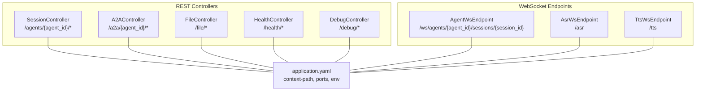
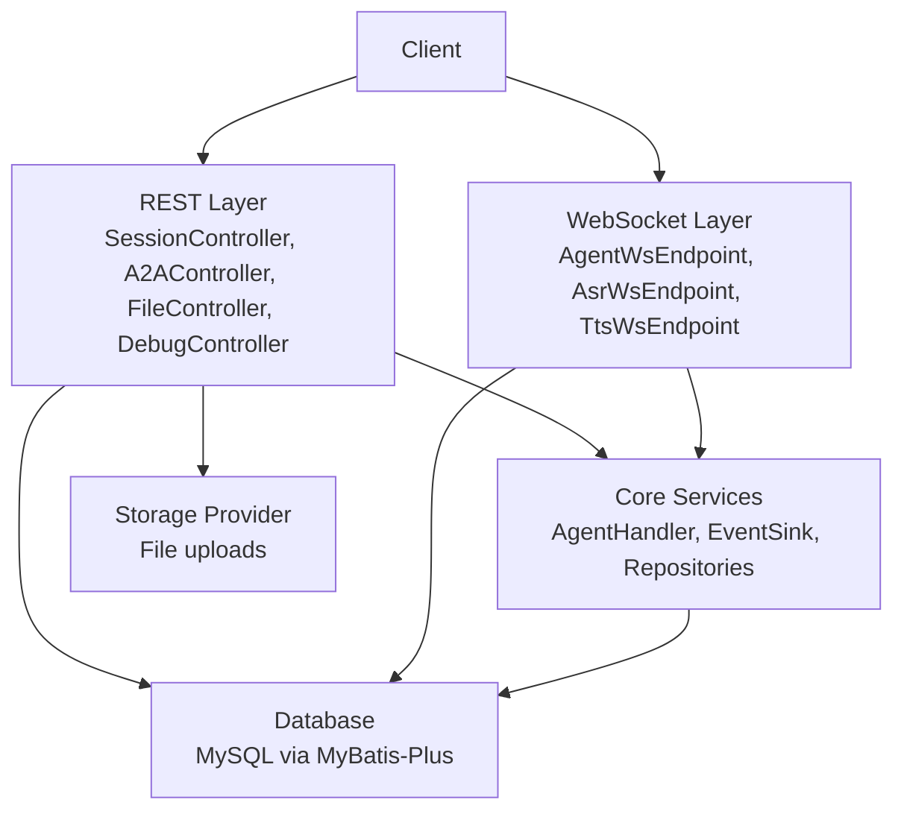
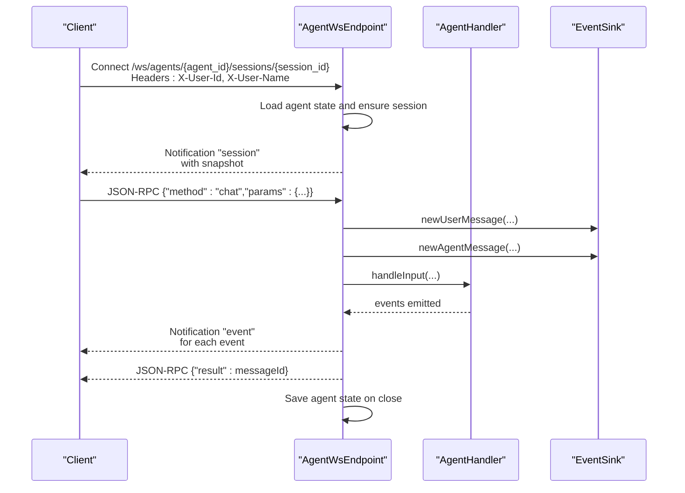
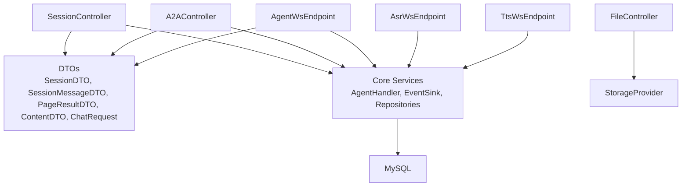

# API Reference

<cite>
**Referenced Files in This Document**
- [A2AController.java](file://backend_java/api/src/main/java/com/aliyun/tam/x/tron/api/A2AController.java)
- [SessionController.java](file://backend_java/api/src/main/java/com/aliyun/tam/x/tron/api/SessionController.java)
- [FileController.java](file://backend_java/api/src/main/java/com/aliyun/tam/x/tron/api/FileController.java)
- [HealthController.java](file://backend_java/api/src/main/java/com/aliyun/tam/x/tron/api/HealthController.java)
- [DebugController.java](file://backend_java/api/src/main/java/com/aliyun/tam/x/tron/api/DebugController.java)
- [AgentWsEndpoint.java](file://backend_java/api/src/main/java/com/aliyun/tam/x/tron/ws/AgentWsEndpoint.java)
- [AsrWsEndpoint.java](file://backend_java/api/src/main/java/com/aliyun/tam/x/tron/ws/AsrWsEndpoint.java)
- [TtsWsEndpoint.java](file://backend_java/api/src/main/java/com/aliyun/tam/x/tron/ws/TtsWsEndpoint.java)
- [application.yaml](file://backend_java/bootstrap/src/main/resources/application.yaml)
- [SessionDTO.java](file://backend_java/api/src/main/java/com/aliyun/tam/x/tron/api/dto/SessionDTO.java)
- [SessionMessageDTO.java](file://backend_java/api/src/main/java/com/aliyun/tam/x/tron/api/dto/SessionMessageDTO.java)
- [PageResultDTO.java](file://backend_java/api/src/main/java/com/aliyun/tam/x/tron/api/dto/PageResultDTO.java)
- [ContentDTO.java](file://backend_java/api/src/main/java/com/aliyun/tam/x/tron/api/dto/ContentDTO.java)
- [ChatRequest.java](file://backend_java/api/src/main/java/com/aliyun/tam/x/tron/api/request/ChatRequest.java)
</cite>

## Table of Contents
1. [Introduction](#introduction)
2. [Project Structure](#project-structure)
3. [Core Components](#core-components)
4. [Architecture Overview](#architecture-overview)
5. [Detailed Component Analysis](#detailed-component-analysis)
6. [Dependency Analysis](#dependency-analysis)
7. [Performance Considerations](#performance-considerations)
8. [Troubleshooting Guide](#troubleshooting-guide)
9. [Conclusion](#conclusion)
10. [Appendices](#appendices)

## Introduction
This document provides a comprehensive API reference for Tron OneAgent’s REST and WebSocket interfaces. It covers:
- REST endpoints for session management, chat, events, and file operations
- WebSocket APIs for real-time chat, ASR, and TTS
- A2A (Agent-to-Agent) protocol endpoints for multi-agent collaboration
- Authentication and authorization mechanisms
- Rate limiting and versioning strategies
- Practical client implementation examples and best practices
- Debugging, monitoring, and performance optimization guidance

## Project Structure
The API surface is implemented in Spring Boot controllers and WebSocket endpoints, organized by feature:
- REST controllers: SessionController, A2AController, FileController, HealthController, DebugController
- WebSocket endpoints: AgentWsEndpoint (JSON-RPC over WebSocket), AsrWsEndpoint, TtsWsEndpoint
- DTOs and request/response models: SessionDTO, SessionMessageDTO, PageResultDTO, ContentDTO, ChatRequest
- Configuration: application.yaml defines base URL, servlet context path, and runtime settings

**Diagram sources**
- [SessionController.java:80-84](file://backend_java/api/src/main/java/com/aliyun/tam/x/tron/api/SessionController.java#L80-L84)
- [A2AController.java:64-67](file://backend_java/api/src/main/java/com/aliyun/tam/x/tron/api/A2AController.java#L64-L67)
- [FileController.java:37-41](file://backend_java/api/src/main/java/com/aliyun/tam/x/tron/api/FileController.java#L37-L41)
- [HealthController.java:25-27](file://backend_java/api/src/main/java/com/aliyun/tam/x/tron/api/HealthController.java#L25-L27)
- [DebugController.java:44-47](file://backend_java/api/src/main/java/com/aliyun/tam/x/tron/api/DebugController.java#L44-L47)
- [AgentWsEndpoint.java:62-64](file://backend_java/api/src/main/java/com/aliyun/tam/x/tron/ws/AgentWsEndpoint.java#L62-L64)
- [AsrWsEndpoint.java:36-38](file://backend_java/api/src/main/java/com/aliyun/tam/x/tron/ws/AsrWsEndpoint.java#L36-L38)
- [TtsWsEndpoint.java:36-38](file://backend_java/api/src/main/java/com/aliyun/tam/x/tron/ws/TtsWsEndpoint.java#L36-L38)
- [application.yaml:1-63](file://backend_java/bootstrap/src/main/resources/application.yaml#L1-L63)

**Section sources**
- [application.yaml:1-63](file://backend_java/bootstrap/src/main/resources/application.yaml#L1-L63)

## Core Components
- SessionController: Manages sessions, chat, events, and message listing via REST and SSE
- A2AController: Exposes A2A protocol endpoints for agent collaboration using JSON-RPC transport
- FileController: Uploads and retrieves files with storage provider integration
- HealthController: Provides health check endpoint
- DebugController: Exposes tool, MCP, and knowledge base debugging endpoints
- WebSocket endpoints: Real-time chat (JSON-RPC), ASR transcription, and TTS synthesis

**Section sources**
- [SessionController.java:80-84](file://backend_java/api/src/main/java/com/aliyun/tam/x/tron/api/SessionController.java#L80-L84)
- [A2AController.java:64-67](file://backend_java/api/src/main/java/com/aliyun/tam/x/tron/api/A2AController.java#L64-L67)
- [FileController.java:37-41](file://backend_java/api/src/main/java/com/aliyun/tam/x/tron/api/FileController.java#L37-L41)
- [HealthController.java:25-27](file://backend_java/api/src/main/java/com/aliyun/tam/x/tron/api/HealthController.java#L25-L27)
- [DebugController.java:44-47](file://backend_java/api/src/main/java/com/aliyun/tam/x/tron/api/DebugController.java#L44-L47)
- [AgentWsEndpoint.java:62-64](file://backend_java/api/src/main/java/com/aliyun/tam/x/tron/ws/AgentWsEndpoint.java#L62-L64)
- [AsrWsEndpoint.java:36-38](file://backend_java/api/src/main/java/com/aliyun/tam/x/tron/ws/AsrWsEndpoint.java#L36-L38)
- [TtsWsEndpoint.java:36-38](file://backend_java/api/src/main/java/com/aliyun/tam/x/tron/ws/TtsWsEndpoint.java#L36-L38)

## Architecture Overview
The API stack combines REST with JSON-RPC over WebSocket for real-time capabilities. The servlet context path is configured to /api, and WebSocket endpoints are exposed at top-level paths.

**Diagram sources**
- [application.yaml:1-63](file://backend_java/bootstrap/src/main/resources/application.yaml#L1-L63)
- [SessionController.java:80-84](file://backend_java/api/src/main/java/com/aliyun/tam/x/tron/api/SessionController.java#L80-L84)
- [A2AController.java:64-67](file://backend_java/api/src/main/java/com/aliyun/tam/x/tron/api/A2AController.java#L64-L67)
- [FileController.java:37-41](file://backend_java/api/src/main/java/com/aliyun/tam/x/tron/api/FileController.java#L37-L41)
- [AgentWsEndpoint.java:62-64](file://backend_java/api/src/main/java/com/aliyun/tam/x/tron/ws/AgentWsEndpoint.java#L62-L64)
- [AsrWsEndpoint.java:36-38](file://backend_java/api/src/main/java/com/aliyun/tam/x/tron/ws/AsrWsEndpoint.java#L36-L38)
- [TtsWsEndpoint.java:36-38](file://backend_java/api/src/main/java/com/aliyun/tam/x/tron/ws/TtsWsEndpoint.java#L36-L38)

## Detailed Component Analysis

### REST API Endpoints

#### Health Checks
- GET /api/health/check
  - Purpose: Liveness/readiness probe
  - Headers: None
  - Response: 200 OK with body "ok"

**Section sources**
- [HealthController.java:25-32](file://backend_java/api/src/main/java/com/aliyun/tam/x/tron/api/HealthController.java#L25-L32)

#### Session Management
- POST /api/agents/{agent_id}/sessions
  - Purpose: Create a new session
  - Headers:
    - X-User-Id: Required
  - Body: CreateSessionRequest (not defined in the provided files; refer to controller usage)
  - Response: 201 Created with session ID in body
  - Notes: Session ID is generated and returned

- GET /api/agents/{agent_id}/sessions
  - Purpose: List sessions for a user
  - Headers:
    - X-User-Id: Required
  - Query:
    - pageNo: integer, min=1, default=1
    - pageSize: integer, min=1, max=100, default=10
  - Response: 200 OK with PageResultDTO<SessionDTO>

- GET /api/agents/{agent_id}/sessions/{session_id}
  - Purpose: Get a specific session and its latest messages
  - Headers:
    - X-User-Id: Required
  - Response: 200 OK with SessionDTO

- DELETE /api/agents/{agent_id}/sessions/{session_id}
  - Purpose: Delete a session
  - Headers:
    - X-User-Id: Required
  - Response: 200 OK

- GET /api/agents/{agent_id}/sessions/{session_id}/messages
  - Purpose: List messages in a session
  - Headers:
    - X-User-Id: Required
  - Query:
    - pageNo: integer, min=1, default=1
    - pageSize: integer, min=1, max=1000, default=10
  - Response: 200 OK with PageResultDTO<SessionMessageDTO>

- GET /api/agents/{agent_id}/sessions/{session_id}/events
  - Purpose: Pull session events
  - Headers:
    - X-User-Id: Required
  - Query:
    - offset: long, min=0, default=0
    - size: integer, min=1, max=100, default=10
  - Response: 200 OK with array of events

- POST /api/agents/{agent_id}/sessions/{session_id}/chat
  - Purpose: Send a chat message; supports SSE streaming
  - Headers:
    - X-User-Id: Required
    - X-User-Name: Optional
    - accept: Optional; set to "text/event-stream" to enable SSE
  - Body: ChatRequest
    - input: array of ContentDTO
    - enableTts: boolean, optional, default=false
  - Response:
    - Without SSE: 200 OK with body "success"
    - With SSE: 200 OK with Content-Type text/event-stream; events streamed as they occur
  - Notes:
    - SSE mode sends events as they are emitted; TTS mode also streams audio fragments via a custom TTS_RESPONSE event

**Section sources**
- [SessionController.java:132-158](file://backend_java/api/src/main/java/com/aliyun/tam/x/tron/api/SessionController.java#L132-L158)
- [SessionController.java:160-185](file://backend_java/api/src/main/java/com/aliyun/tam/x/tron/api/SessionController.java#L160-L185)
- [SessionController.java:187-223](file://backend_java/api/src/main/java/com/aliyun/tam/x/tron/api/SessionController.java#L187-L223)
- [SessionController.java:225-247](file://backend_java/api/src/main/java/com/aliyun/tam/x/tron/api/SessionController.java#L225-L247)
- [SessionController.java:249-278](file://backend_java/api/src/main/java/com/aliyun/tam/x/tron/api/SessionController.java#L249-L278)
- [SessionController.java:280-306](file://backend_java/api/src/main/java/com/aliyun/tam/x/tron/api/SessionController.java#L280-L306)
- [SessionController.java:308-346](file://backend_java/api/src/main/java/com/aliyun/tam/x/tron/api/SessionController.java#L308-L346)
- [ChatRequest.java:32-42](file://backend_java/api/src/main/java/com/aliyun/tam/x/tron/api/request/ChatRequest.java#L32-L42)

#### File Management
- POST /api/file
  - Purpose: Upload a file
  - Headers:
    - X-User-Id: Required
  - Form data:
    - file: multipart file
  - Validation:
    - Filename must not contain path separators or be empty
    - Allowed extensions: jpg, jpeg, png
  - Response:
    - 201 Created with Location header pointing to the resource
    - 400 Bad Request if filename invalid or type not allowed
    - 404 Not Found if storage provider is not configured
  - Notes:
    - Location URL uses request scheme/host/port or overrides via tron.file.server.base-url

- GET /api/file/{id}
  - Purpose: Retrieve a file by ID
  - Path variable:
    - id: long
  - Response:
    - 200 OK with stored file content
    - 404 Not Found if storage provider is not configured

**Section sources**
- [FileController.java:51-100](file://backend_java/api/src/main/java/com/aliyun/tam/x/tron/api/FileController.java#L51-L100)
- [FileController.java:102-112](file://backend_java/api/src/main/java/com/aliyun/tam/x/tron/api/FileController.java#L102-L112)

#### A2A (Agent-to-Agent) Protocol
- GET /api/a2a/{agent_id}/.well-known/agent-card.json
  - Purpose: Discover agent metadata/card
  - Path variable:
    - agent_id: string
  - Response: 200 OK with AgentCard JSON or 404 Not Found

- POST /api/a2a/{agent_id}/
  - Purpose: JSON-RPC endpoint for A2A requests
  - Path variable:
    - agent_id: string
  - Headers: Forwarded headers (transport-specific)
  - Body: JSON-RPC request payload
  - Response: 200 OK with JSON-RPC response
  - Notes:
    - Uses internal JSON-RPC transport wrapper and request handler
    - Executes agent logic and returns results

**Section sources**
- [A2AController.java:91-105](file://backend_java/api/src/main/java/com/aliyun/tam/x/tron/api/A2AController.java#L91-L105)
- [A2AController.java:107-128](file://backend_java/api/src/main/java/com/aliyun/tam/x/tron/api/A2AController.java#L107-L128)

#### Debug Utilities
- GET /api/debug/tools/{tool_name}/schema
  - Purpose: Retrieve tool schema
  - Path variable:
    - tool_name: string
  - Response: 200 OK with function schema or 404 Not Found

- POST /api/debug/tools/{tool_name}
  - Purpose: Invoke tool synchronously
  - Path variable:
    - tool_name: string
  - Body: Tool input JSON
  - Response: 200 OK with tool output or 400 Bad Request

- POST /api/debug/mcp/{client_id}/tools/{func_name}
  - Purpose: Call MCP tool
  - Path variables:
    - client_id: string
    - func_name: string
  - Body: Tool input JSON
  - Response: 200 OK with tool result or 404 Not Found

- GET /api/debug/mcp/{client_id}/tools
  - Purpose: List MCP tools
  - Path variable:
    - client_id: string
  - Response: 200 OK with tool list or 404 Not Found

- POST /api/debug/knowledge_base/{knowledge_base_id}
  - Purpose: Query knowledge base
  - Path variable:
    - knowledge_base_id: string
  - Body: JSON with query, limit (optional), score_threshold (optional)
  - Response: 200 OK with retrieved documents or 400 Bad Request

**Section sources**
- [DebugController.java:56-83](file://backend_java/api/src/main/java/com/aliyun/tam/x/tron/api/DebugController.java#L56-L83)
- [DebugController.java:85-108](file://backend_java/api/src/main/java/com/aliyun/tam/x/tron/api/DebugController.java#L85-L108)
- [DebugController.java:110-127](file://backend_java/api/src/main/java/com/aliyun/tam/x/tron/api/DebugController.java#L110-L127)
- [DebugController.java:129-138](file://backend_java/api/src/main/java/com/aliyun/tam/x/tron/api/DebugController.java#L129-L138)
- [DebugController.java:140-163](file://backend_java/api/src/main/java/com/aliyun/tam/x/tron/api/DebugController.java#L140-L163)

### WebSocket API

#### Real-time Chat (JSON-RPC over WebSocket)
- Endpoint: /ws/agents/{agent_id}/sessions/{session_id}
- Required headers (via configurator):
  - X-User-Id: Required
  - X-User-Name: Optional (defaults to X-User-Id)
- Methods:
  - chat(params): Start a chat session
    - params.input: array of ContentDTO
    - params.enableTts: boolean, optional
    - Returns: message ID
  - cancel(params): Cancel ongoing operation
- Events (notifications):
  - session: Initial snapshot of session and recent messages
  - event: Emitted as agent emits events; includes TTS_RESPONSE when enabled
- Lifecycle:
  - On open: loads agent state, creates session if missing, sends session snapshot
  - On message: parses JSON-RPC request, dispatches to method, responds with JSON-RPC success/error
  - On close: persists agent state
  - On error: logs and closes session

**Diagram sources**
- [AgentWsEndpoint.java:116-136](file://backend_java/api/src/main/java/com/aliyun/tam/x/tron/ws/AgentWsEndpoint.java#L116-L136)
- [AgentWsEndpoint.java:222-261](file://backend_java/api/src/main/java/com/aliyun/tam/x/tron/ws/AgentWsEndpoint.java#L222-L261)
- [AgentWsEndpoint.java:277-332](file://backend_java/api/src/main/java/com/aliyun/tam/x/tron/ws/AgentWsEndpoint.java#L277-L332)
- [AgentWsEndpoint.java:334-442](file://backend_java/api/src/main/java/com/aliyun/tam/x/tron/ws/AgentWsEndpoint.java#L334-L442)
- [AgentWsEndpoint.java:263-275](file://backend_java/api/src/main/java/com/aliyun/tam/x/tron/ws/AgentWsEndpoint.java#L263-L275)

**Section sources**
- [AgentWsEndpoint.java:62-91](file://backend_java/api/src/main/java/com/aliyun/tam/x/tron/ws/AgentWsEndpoint.java#L62-L91)
- [AgentWsEndpoint.java:116-136](file://backend_java/api/src/main/java/com/aliyun/tam/x/tron/ws/AgentWsEndpoint.java#L116-L136)
- [AgentWsEndpoint.java:222-261](file://backend_java/api/src/main/java/com/aliyun/tam/x/tron/ws/AgentWsEndpoint.java#L222-L261)
- [AgentWsEndpoint.java:277-332](file://backend_java/api/src/main/java/com/aliyun/tam/x/tron/ws/AgentWsEndpoint.java#L277-L332)
- [AgentWsEndpoint.java:334-442](file://backend_java/api/src/main/java/com/aliyun/tam/x/tron/ws/AgentWsEndpoint.java#L334-L442)
- [AgentWsEndpoint.java:263-275](file://backend_java/api/src/main/java/com/aliyun/tam/x/tron/ws/AgentWsEndpoint.java#L263-L275)

#### Speech-to-Text (ASR)
- Endpoint: /asr
- Messages:
  - Client to Server: JSON with fields
    - dataBase64: base64-encoded audio chunk
    - completed: boolean indicating end of stream
  - Server to Client: JSON with fields
    - success: boolean
    - text: recognized text (incremental)
    - finished: boolean when complete
    - error: error message if present
- Lifecycle:
  - On open: initializes ASR session if service available
  - On message: appends audio data and completes when requested
  - On close/error: cleans up session and reports errors

**Section sources**
- [AsrWsEndpoint.java:36-107](file://backend_java/api/src/main/java/com/aliyun/tam/x/tron/ws/AsrWsEndpoint.java#L36-L107)
- [AsrWsEndpoint.java:122-141](file://backend_java/api/src/main/java/com/aliyun/tam/x/tron/ws/AsrWsEndpoint.java#L122-L141)
- [AsrWsEndpoint.java:143-161](file://backend_java/api/src/main/java/com/aliyun/tam/x/tron/ws/AsrWsEndpoint.java#L143-L161)

#### Text-to-Speech (TTS)
- Endpoint: /tts
- Messages:
  - Client to Server: JSON with fields
    - text: text to synthesize
    - completed: boolean indicating end of stream
  - Server to Client: JSON with fields
    - success: boolean
    - dataBase64: synthesized audio chunks
    - finished: boolean when complete
    - error: error message if present
- Lifecycle:
  - On open: initializes TTS session if service available
  - On message: appends text and completes when requested
  - On close/error: cleans up session and reports errors

**Section sources**
- [TtsWsEndpoint.java:36-93](file://backend_java/api/src/main/java/com/aliyun/tam/x/tron/ws/TtsWsEndpoint.java#L36-L93)
- [TtsWsEndpoint.java:108-127](file://backend_java/api/src/main/java/com/aliyun/tam/x/tron/ws/TtsWsEndpoint.java#L108-L127)
- [TtsWsEndpoint.java:129-147](file://backend_java/api/src/main/java/com/aliyun/tam/x/tron/ws/TtsWsEndpoint.java#L129-L147)

### Data Models and Schemas

#### SessionDTO
- Fields:
  - id: string
  - userId: string
  - agentId: string
  - name: string, default ""
  - lastAppliedEventId: long, default 0
  - gmtCreated: datetime
  - gmtModified: datetime
  - messages: PageResultDTO<SessionMessageDTO>

**Section sources**
- [SessionDTO.java:34-76](file://backend_java/api/src/main/java/com/aliyun/tam/x/tron/api/dto/SessionDTO.java#L34-L76)

#### SessionMessageDTO
- Fields:
  - id: long
  - type: integer (enum value)
  - status: integer (enum value)
  - errorMessage: string (agent message)
  - agentId: string
  - userId: string
  - sessionId: string
  - name: string (user message)
  - contents: array of ContentDTO
  - gmtCreate: datetime
  - gmtModified: datetime
  - gmtFinished: datetime (agent message)
  - usage: AgentChatUsageDTO (agent message)

**Section sources**
- [SessionMessageDTO.java:38-101](file://backend_java/api/src/main/java/com/aliyun/tam/x/tron/api/dto/SessionMessageDTO.java#L38-L101)

#### PageResultDTO
- Fields:
  - totalRecords: long
  - records: array of T
  - pageNum: integer
  - pageSize: integer
  - totalPages: integer

**Section sources**
- [PageResultDTO.java:38-75](file://backend_java/api/src/main/java/com/aliyun/tam/x/tron/api/dto/PageResultDTO.java#L38-L75)

#### ContentDTO
- Fields:
  - id: object
  - type: integer (enum value)
  - text: string (TEXT)
  - status: integer (HITL)
  - url: string, base64Data: string, mediaType: string (MEDIA)
  - agentId: string, status: integer, title: string, description: string, result: string, contents: array, gmtCreated/gmtModified/gmtFinished: datetime (TASK)
  - agentMessageId: string, method: string, properties: map, result: string (HITL)
- Conversion:
  - toInputContent(AgentHandler): converts to core content types based on type value

**Section sources**
- [ContentDTO.java:38-166](file://backend_java/api/src/main/java/com/aliyun/tam/x/tron/api/dto/ContentDTO.java#L38-L166)

#### ChatRequest
- Fields:
  - input: array of ContentDTO
  - enableTts: boolean, default false

**Section sources**
- [ChatRequest.java:32-42](file://backend_java/api/src/main/java/com/aliyun/tam/x/tron/api/request/ChatRequest.java#L32-L42)

### Authentication and Authorization
- X-User-Id header:
  - Required for session and file operations
  - Used to scope sessions and associate uploads to users
- X-User-Name header:
  - Optional; defaults to X-User-Id if not provided
- Authorization model:
  - No explicit JWT/OAuth tokens observed in the provided controllers
  - Access control relies on presence of X-User-Id and session ownership checks
- Recommendations:
  - Enforce X-User-Id at gateway/proxy
  - Add rate limiting per user ID
  - Consider adding API keys or signed requests for external integrations

**Section sources**
- [SessionController.java:134-138](file://backend_java/api/src/main/java/com/aliyun/tam/x/tron/api/SessionController.java#L134-L138)
- [SessionController.java:189-193](file://backend_java/api/src/main/java/com/aliyun/tam/x/tron/api/SessionController.java#L189-L193)
- [SessionController.java:227-231](file://backend_java/api/src/main/java/com/aliyun/tam/x/tron/api/SessionController.java#L227-L231)
- [SessionController.java:251-257](file://backend_java/api/src/main/java/com/aliyun/tam/x/tron/api/SessionController.java#L251-L257)
- [SessionController.java:309-316](file://backend_java/api/src/main/java/com/aliyun/tam/x/tron/api/SessionController.java#L309-L316)
- [AgentWsEndpoint.java:117-124](file://backend_java/api/src/main/java/com/aliyun/tam/x/tron/ws/AgentWsEndpoint.java#L117-L124)

### Rate Limiting and Quotas
- No explicit rate limiting logic was identified in the provided controllers
- Recommendations:
  - Implement per-user rate limits (e.g., requests per minute)
  - Apply limits on SSE/chat concurrency
  - Use a shared cache/store for counters

[No sources needed since this section provides general guidance]

### API Versioning
- No explicit version path/version header was observed in the provided controllers
- Recommendations:
  - Use path-based versioning (e.g., /api/v1/...)
  - Or header-based versioning (Accept-Version)
  - Maintain backward compatibility for DTOs

[No sources needed since this section provides general guidance]

### Error Handling and Status Codes
- REST:
  - 400 Bad Request: Invalid input, unsupported content type, invalid filename
  - 404 Not Found: Agent/session not found, storage provider missing
  - 409 Conflict: Not used in provided files
  - 500 Internal Server Error: General server errors
- WebSocket:
  - JSON-RPC error responses with code/message
  - On error, session is closed and logged

**Section sources**
- [SessionController.java:116-130](file://backend_java/api/src/main/java/com/aliyun/tam/x/tron/api/SessionController.java#L116-L130)
- [SessionController.java:326-330](file://backend_java/api/src/main/java/com/aliyun/tam/x/tron/api/SessionController.java#L326-L330)
- [FileController.java:61-67](file://backend_java/api/src/main/java/com/aliyun/tam/x/tron/api/FileController.java#L61-L67)
- [FileController.java:56-58](file://backend_java/api/src/main/java/com/aliyun/tam/x/tron/api/FileController.java#L56-L58)
- [AgentWsEndpoint.java:226-261](file://backend_java/api/src/main/java/com/aliyun/tam/x/tron/ws/AgentWsEndpoint.java#L226-L261)
- [AgentWsEndpoint.java:271-275](file://backend_java/api/src/main/java/com/aliyun/tam/x/tron/ws/AgentWsEndpoint.java#L271-L275)

### Practical Client Implementation Examples

#### REST Chat with SSE
- Steps:
  - Create session: POST /api/agents/{agent_id}/sessions with X-User-Id
  - Start chat with SSE: POST /api/agents/{agent_id}/sessions/{session_id}/chat with accept=text/event-stream and ChatRequest
  - Read events from SSE stream until completion
- Best practices:
  - Set a reasonable timeout for SSE
  - Handle reconnection with lastAppliedEventId if needed
  - Enable TTS by setting enableTts=true and listen for TTS_RESPONSE events

**Section sources**
- [SessionController.java:308-346](file://backend_java/api/src/main/java/com/aliyun/tam/x/tron/api/SessionController.java#L308-L346)

#### WebSocket Chat
- Steps:
  - Connect to /ws/agents/{agent_id}/sessions/{session_id} with X-User-Id and optional X-User-Name
  - Send JSON-RPC chat with input array and optional enableTts
  - Listen for session snapshot and event notifications
- Best practices:
  - Serialize/deserialize JSON-RPC consistently
  - Close session cleanly to persist agent state

**Section sources**
- [AgentWsEndpoint.java:116-136](file://backend_java/api/src/main/java/com/aliyun/tam/x/tron/ws/AgentWsEndpoint.java#L116-L136)
- [AgentWsEndpoint.java:222-261](file://backend_java/api/src/main/java/com/aliyun/tam/x/tron/ws/AgentWsEndpoint.java#L222-L261)

#### File Upload and Download
- Steps:
  - Upload: POST /api/file with form field file and X-User-Id
  - Retrieve: GET /api/file/{id}
- Best practices:
  - Validate allowed file types and sizes
  - Use tron.file.server.base-url to construct public URLs

**Section sources**
- [FileController.java:51-100](file://backend_java/api/src/main/java/com/aliyun/tam/x/tron/api/FileController.java#L51-L100)
- [FileController.java:102-112](file://backend_java/api/src/main/java/com/aliyun/tam/x/tron/api/FileController.java#L102-L112)

#### A2A Discovery and Invocation
- Steps:
  - Discover agent card: GET /api/a2a/{agent_id}/.well-known/agent-card.json
  - Invoke agent: POST /api/a2a/{agent_id}/ with JSON-RPC payload
- Best practices:
  - Validate AgentCard before sending requests
  - Use thread-safe JSON-RPC transport wrapper

**Section sources**
- [A2AController.java:91-105](file://backend_java/api/src/main/java/com/aliyun/tam/x/tron/api/A2AController.java#L91-L105)
- [A2AController.java:107-128](file://backend_java/api/src/main/java/com/aliyun/tam/x/tron/api/A2AController.java#L107-L128)

### Monitoring and Observability
- Health endpoint: GET /api/health/check
- Metrics exposure: Prometheus endpoint via management server
- Recommendations:
  - Instrument REST and WebSocket endpoints
  - Track request latency, error rates, and concurrent connections
  - Log structured events for auditability

**Section sources**
- [HealthController.java:25-32](file://backend_java/api/src/main/java/com/aliyun/tam/x/tron/api/HealthController.java#L25-L32)
- [application.yaml:53-63](file://backend_java/bootstrap/src/main/resources/application.yaml#L53-L63)

## Dependency Analysis
The REST and WebSocket layers depend on core services for agent orchestration, event emission, and persistence. DTOs encapsulate data transfer and conversion logic.

**Diagram sources**
- [SessionController.java:80-84](file://backend_java/api/src/main/java/com/aliyun/tam/x/tron/api/SessionController.java#L80-L84)
- [A2AController.java:64-67](file://backend_java/api/src/main/java/com/aliyun/tam/x/tron/api/A2AController.java#L64-L67)
- [FileController.java:37-41](file://backend_java/api/src/main/java/com/aliyun/tam/x/tron/api/FileController.java#L37-L41)
- [AgentWsEndpoint.java:62-64](file://backend_java/api/src/main/java/com/aliyun/tam/x/tron/ws/AgentWsEndpoint.java#L62-L64)
- [AsrWsEndpoint.java:36-38](file://backend_java/api/src/main/java/com/aliyun/tam/x/tron/ws/AsrWsEndpoint.java#L36-L38)
- [TtsWsEndpoint.java:36-38](file://backend_java/api/src/main/java/com/aliyun/tam/x/tron/ws/TtsWsEndpoint.java#L36-L38)
- [SessionDTO.java:34-76](file://backend_java/api/src/main/java/com/aliyun/tam/x/tron/api/dto/SessionDTO.java#L34-L76)
- [SessionMessageDTO.java:38-101](file://backend_java/api/src/main/java/com/aliyun/tam/x/tron/api/dto/SessionMessageDTO.java#L38-L101)
- [PageResultDTO.java:38-75](file://backend_java/api/src/main/java/com/aliyun/tam/x/tron/api/dto/PageResultDTO.java#L38-L75)
- [ContentDTO.java:38-166](file://backend_java/api/src/main/java/com/aliyun/tam/x/tron/api/dto/ContentDTO.java#L38-L166)
- [ChatRequest.java:32-42](file://backend_java/api/src/main/java/com/aliyun/tam/x/tron/api/request/ChatRequest.java#L32-L42)

**Section sources**
- [SessionController.java:80-84](file://backend_java/api/src/main/java/com/aliyun/tam/x/tron/api/SessionController.java#L80-L84)
- [A2AController.java:64-67](file://backend_java/api/src/main/java/com/aliyun/tam/x/tron/api/A2AController.java#L64-L67)
- [FileController.java:37-41](file://backend_java/api/src/main/java/com/aliyun/tam/x/tron/api/FileController.java#L37-L41)
- [AgentWsEndpoint.java:62-64](file://backend_java/api/src/main/java/com/aliyun/tam/x/tron/ws/AgentWsEndpoint.java#L62-L64)
- [AsrWsEndpoint.java:36-38](file://backend_java/api/src/main/java/com/aliyun/tam/x/tron/ws/AsrWsEndpoint.java#L36-L38)
- [TtsWsEndpoint.java:36-38](file://backend_java/api/src/main/java/com/aliyun/tam/x/tron/ws/TtsWsEndpoint.java#L36-L38)

## Performance Considerations
- Concurrency:
  - REST chat uses a thread pool executor; avoid blocking operations in handlers
  - WebSocket endpoints use dedicated executors for chat and ASR/TTS
- Streaming:
  - Prefer SSE for long-running chats; configure timeouts appropriately
  - For WebSocket, ensure proper backpressure and graceful closure
- Storage:
  - Validate file sizes and types early to prevent unnecessary I/O
- Caching:
  - Cache agent cards for A2A discovery
- Monitoring:
  - Track queue depths and thread pool utilization

[No sources needed since this section provides general guidance]

## Troubleshooting Guide
- 404 Not Found:
  - Verify agent_id exists and is enabled
  - Ensure session_id belongs to the requesting X-User-Id
- 400 Bad Request:
  - Check input validation (filename, content types, paging bounds)
- WebSocket errors:
  - Inspect JSON-RPC error responses
  - Ensure required headers (X-User-Id) are provided
- Health probes:
  - Confirm /api/health/check returns "ok"

**Section sources**
- [SessionController.java:116-130](file://backend_java/api/src/main/java/com/aliyun/tam/x/tron/api/SessionController.java#L116-L130)
- [SessionController.java:189-203](file://backend_java/api/src/main/java/com/aliyun/tam/x/tron/api/SessionController.java#L189-L203)
- [SessionController.java:227-246](file://backend_java/api/src/main/java/com/aliyun/tam/x/tron/api/SessionController.java#L227-L246)
- [SessionController.java:251-278](file://backend_java/api/src/main/java/com/aliyun/tam/x/tron/api/SessionController.java#L251-L278)
- [SessionController.java:309-346](file://backend_java/api/src/main/java/com/aliyun/tam/x/tron/api/SessionController.java#L309-L346)
- [AgentWsEndpoint.java:226-261](file://backend_java/api/src/main/java/com/aliyun/tam/x/tron/ws/AgentWsEndpoint.java#L226-L261)
- [HealthController.java:25-32](file://backend_java/api/src/main/java/com/aliyun/tam/x/tron/api/HealthController.java#L25-L32)

## Conclusion
Tron OneAgent exposes a cohesive API surface combining REST and WebSocket for session management, real-time chat, speech services, and A2A collaboration. Clients should adhere to strict input validation, implement robust retry/backoff for SSE/WebSocket, and leverage monitoring to maintain reliability. For production deployments, consider adding explicit versioning, rate limiting, and authorization tokens.

[No sources needed since this section summarizes without analyzing specific files]

## Appendices

### Request/Response Examples (Paths)
- Create session: [POST /api/agents/{agent_id}/sessions:132-158](file://backend_java/api/src/main/java/com/aliyun/tam/x/tron/api/SessionController.java#L132-L158)
- List sessions: [GET /api/agents/{agent_id}/sessions:160-185](file://backend_java/api/src/main/java/com/aliyun/tam/x/tron/api/SessionController.java#L160-L185)
- Get session: [GET /api/agents/{agent_id}/sessions/{session_id}:187-223](file://backend_java/api/src/main/java/com/aliyun/tam/x/tron/api/SessionController.java#L187-L223)
- Delete session: [DELETE /api/agents/{agent_id}/sessions/{session_id}:225-247](file://backend_java/api/src/main/java/com/aliyun/tam/x/tron/api/SessionController.java#L225-L247)
- List messages: [GET /api/agents/{agent_id}/sessions/{session_id}/messages:249-278](file://backend_java/api/src/main/java/com/aliyun/tam/x/tron/api/SessionController.java#L249-L278)
- Pull events: [GET /api/agents/{agent_id}/sessions/{session_id}/events:280-306](file://backend_java/api/src/main/java/com/aliyun/tam/x/tron/api/SessionController.java#L280-L306)
- Chat (SSE): [POST /api/agents/{agent_id}/sessions/{session_id}/chat:308-346](file://backend_java/api/src/main/java/com/aliyun/tam/x/tron/api/SessionController.java#L308-L346)
- Upload file: [POST /api/file:51-100](file://backend_java/api/src/main/java/com/aliyun/tam/x/tron/api/FileController.java#L51-L100)
- Retrieve file: [GET /api/file/{id}:102-112](file://backend_java/api/src/main/java/com/aliyun/tam/x/tron/api/FileController.java#L102-L112)
- A2A agent card: [GET /api/a2a/{agent_id}/.well-known/agent-card.json:91-105](file://backend_java/api/src/main/java/com/aliyun/tam/x/tron/api/A2AController.java#L91-L105)
- A2A JSON-RPC: [POST /api/a2a/{agent_id}/:107-128](file://backend_java/api/src/main/java/com/aliyun/tam/x/tron/api/A2AController.java#L107-L128)
- WebSocket chat: [/ws/agents/{agent_id}/sessions/{session_id}:62-91](file://backend_java/api/src/main/java/com/aliyun/tam/x/tron/ws/AgentWsEndpoint.java#L62-L91)
- ASR: [/asr:36-107](file://backend_java/api/src/main/java/com/aliyun/tam/x/tron/ws/AsrWsEndpoint.java#L36-L107)
- TTS: [/tts:36-93](file://backend_java/api/src/main/java/com/aliyun/tam/x/tron/ws/TtsWsEndpoint.java#L36-L93)

### Configuration References
- Servlet context path and ports: [application.yaml:1-63](file://backend_java/bootstrap/src/main/resources/application.yaml#L1-L63)

**Section sources**
- [application.yaml:1-63](file://backend_java/bootstrap/src/main/resources/application.yaml#L1-L63)