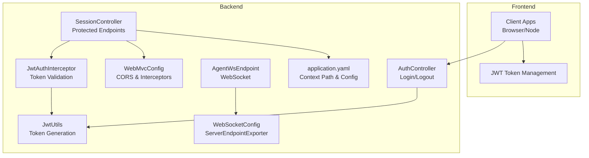
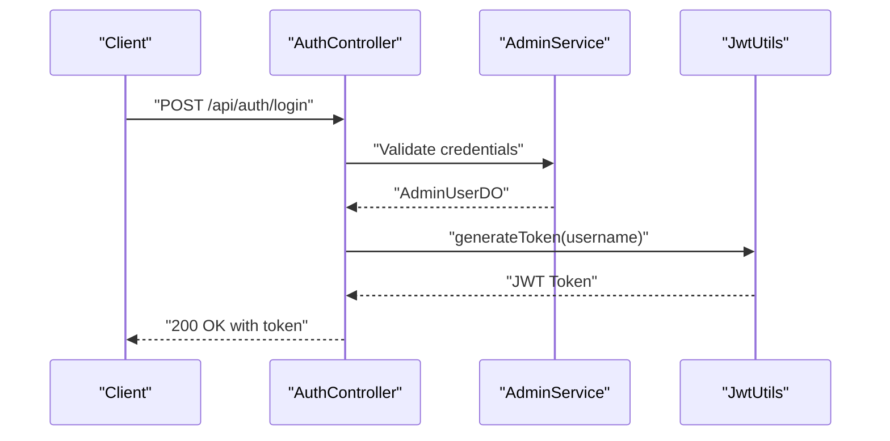
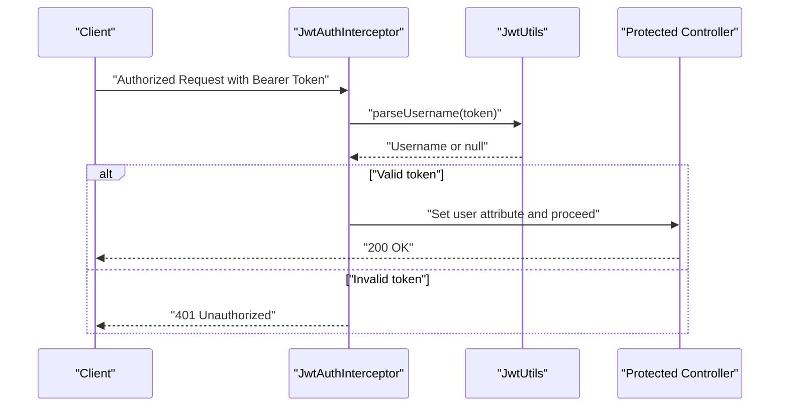
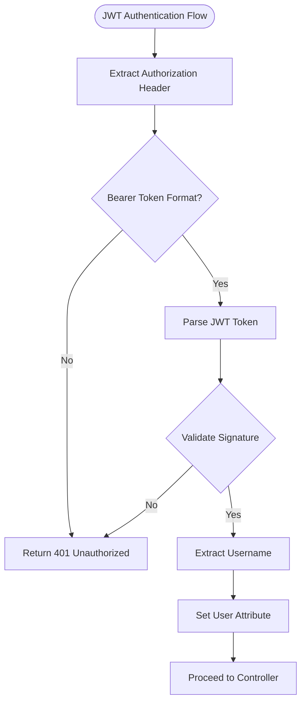
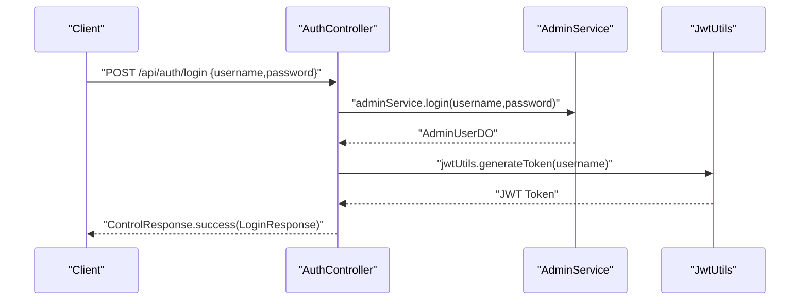
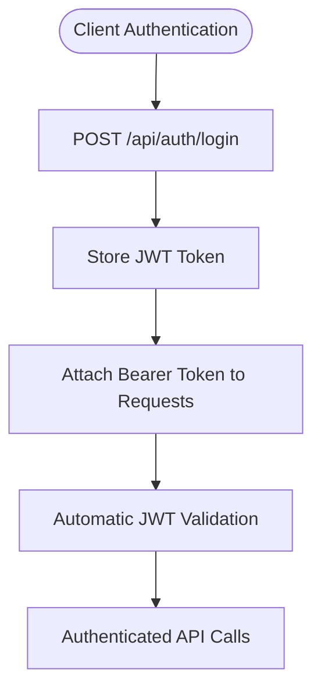
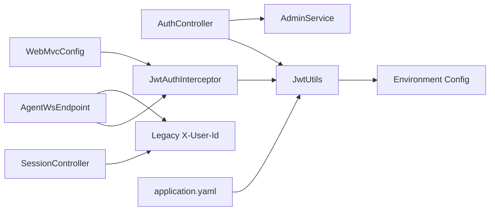

# Authentication and Authorization

<cite>
**Referenced Files in This Document**
- [AuthController.java](file://backend_java/api/src/main/java/com/aliyun/tam/x/tron/api/AuthController.java)
- [JwtAuthInterceptor.java](file://backend_java/api/src/main/java/com/aliyun/tam/x/tron/api/auth/JwtAuthInterceptor.java)
- [JwtUtils.java](file://backend_java/api/src/main/java/com/aliyun/tam/x/tron/api/auth/JwtUtils.java)
- [LoginRequest.java](file://backend_java/api/src/main/java/com/aliyun/tam/x/tron/api/request/LoginRequest.java)
- [WebMvcConfig.java](file://backend_java/bootstrap/src/main/java/com/aliyun/tam/x/tron/config/WebMvcConfig.java)
- [SessionController.java](file://backend_java/api/src/main/java/com/aliyun/tam/x/tron/api/SessionController.java)
- [AgentWsEndpoint.java](file://backend_java/api/src/main/java/com/aliyun/tam/x/tron/ws/AgentWsEndpoint.java)
- [WebSocketConfig.java](file://backend_java/bootstrap/src/main/java/com/aliyun/tam/x/tron/config/WebSocketConfig.java)
- [application.yaml](file://backend_java/bootstrap/src/main/resources/application.yaml)
- [develop_guide.md](file://docs/en/develop_guide.md)
- [FileController.java](file://backend_java/api/src/main/java/com/aliyun/tam/x/tron/api/FileController.java)
</cite>

## Update Summary
**Changes Made**
- Complete replacement of header-based authentication with JWT-based authentication system
- Added new AuthController with login/logout endpoints and user session management
- Implemented JWT utilities for token generation and validation
- Added JWT authentication interceptor for request filtering
- Updated authentication flow to use bearer token authentication
- Maintained backward compatibility for WebSocket endpoints during transition period

## Table of Contents
1. [Introduction](#introduction)
2. [Project Structure](#project-structure)
3. [Core Components](#core-components)
4. [Architecture Overview](#architecture-overview)
5. [Detailed Component Analysis](#detailed-component-analysis)
6. [Dependency Analysis](#dependency-analysis)
7. [Performance Considerations](#performance-considerations)
8. [Troubleshooting Guide](#troubleshooting-guide)
9. [Conclusion](#conclusion)
10. [Appendices](#appendices)

## Introduction
This document describes the authentication and authorization model for Tron OneAgent's API surface. The system has been completely migrated from header-based authentication (X-User-Id, X-User-Name) to a modern JWT-based authentication system. The new architecture provides secure token-based authentication with login/logout endpoints, session management, and comprehensive access control mechanisms. It covers the JWT authentication flow, token lifecycle management, CORS configuration, and outlines integration patterns for client applications.

## Project Structure
The authentication and authorization logic has been restructured around JWT-based authentication:
- New AuthController provides login/logout endpoints and user session management
- JWT utilities handle token generation, validation, and encryption
- JWT authentication interceptor enforces token-based access control
- Legacy header-based systems are maintained for backward compatibility
- CORS is configured globally to allow cross-origin requests
- Frontend integration patterns demonstrate JWT token usage

**Diagram sources**
- [AuthController.java:61-72](file://backend_java/api/src/main/java/com/aliyun/tam/x/tron/api/AuthController.java#L61-L72)
- [JwtAuthInterceptor.java:44-61](file://backend_java/api/src/main/java/com/aliyun/tam/x/tron/api/auth/JwtAuthInterceptor.java#L44-L61)
- [JwtUtils.java:51-74](file://backend_java/api/src/main/java/com/aliyun/tam/x/tron/api/auth/JwtUtils.java#L51-L74)
- [WebMvcConfig.java:52-57](file://backend_java/bootstrap/src/main/java/com/aliyun/tam/x/tron/config/WebMvcConfig.java#L52-L57)

**Section sources**
- [AuthController.java:61-72](file://backend_java/api/src/main/java/com/aliyun/tam/x/tron/api/AuthController.java#L61-L72)
- [JwtAuthInterceptor.java:44-61](file://backend_java/api/src/main/java/com/aliyun/tam/x/tron/api/auth/JwtAuthInterceptor.java#L44-L61)
- [JwtUtils.java:51-74](file://backend_java/api/src/main/java/com/aliyun/tam/x/tron/api/auth/JwtUtils.java#L51-L74)
- [WebMvcConfig.java:52-57](file://backend_java/bootstrap/src/main/java/com/aliyun/tam/x/tron/config/WebMvcConfig.java#L52-L57)

## Core Components
- **JWT-based authentication**:
  - Login endpoint (/auth/login) generates JWT tokens with 24-hour expiration
  - Bearer token authentication via Authorization header
  - Automatic token validation through JwtAuthInterceptor
- **Token lifecycle management**:
  - Token generation with HMAC-SHA256 signing
  - Environment-based secret key configuration
  - Token parsing and username extraction
- **Access control**:
  - Interceptor-based authentication for protected endpoints
  - Exclusion of login endpoint from authentication requirements
  - Attribute-based user context propagation
- **Legacy compatibility**:
  - SessionController maintains X-User-Id header requirement for backward compatibility
  - WebSocket endpoints support both JWT and legacy header-based authentication
- **CORS configuration**:
  - Global CORS allows all origins, headers, and methods with 24-hour cache

**Section sources**
- [AuthController.java:61-72](file://backend_java/api/src/main/java/com/aliyun/tam/x/tron/api/AuthController.java#L61-L72)
- [JwtAuthInterceptor.java:44-61](file://backend_java/api/src/main/java/com/aliyun/tam/x/tron/api/auth/JwtAuthInterceptor.java#L44-L61)
- [JwtUtils.java:37-49](file://backend_java/api/src/main/java/com/aliyun/tam/x/tron/api/auth/JwtUtils.java#L37-L49)
- [WebMvcConfig.java:52-57](file://backend_java/bootstrap/src/main/java/com/aliyun/tam/x/tron/config/WebMvcConfig.java#L52-L57)

## Architecture Overview
The authentication model is now JWT-centric with automatic token validation at the interceptor level. The following sequence diagrams illustrate the new authentication flow.

**Diagram sources**
- [AuthController.java:61-66](file://backend_java/api/src/main/java/com/aliyun/tam/x/tron/api/AuthController.java#L61-L66)
- [JwtUtils.java:51-60](file://backend_java/api/src/main/java/com/aliyun/tam/x/tron/api/auth/JwtUtils.java#L51-L60)

**Diagram sources**
- [JwtAuthInterceptor.java:44-61](file://backend_java/api/src/main/java/com/aliyun/tam/x/tron/api/auth/JwtAuthInterceptor.java#L44-L61)
- [JwtUtils.java:62-74](file://backend_java/api/src/main/java/com/aliyun/tam/x/tron/api/auth/JwtUtils.java#L62-74)

## Detailed Component Analysis

### JWT Authentication System
- **Token Generation**:
  - Uses HMAC-SHA256 with configurable secret key from environment
  - 24-hour expiration time
  - Username as JWT subject claim
- **Token Validation**:
  - Extracts Bearer token from Authorization header
  - Validates signature and extracts username
  - Sets user context attribute for downstream processing
- **Security Configuration**:
  - Default secret key with Base64 encoding
  - Environment variable TRON_ENCRYPT_KEY for customization
  - UTF-8 character encoding for response bodies

**Diagram sources**
- [JwtAuthInterceptor.java:44-61](file://backend_java/api/src/main/java/com/aliyun/tam/x/tron/api/auth/JwtAuthInterceptor.java#L44-L61)
- [JwtUtils.java:62-74](file://backend_java/api/src/main/java/com/aliyun/tam/x/tron/api/auth/JwtUtils.java#L62-74)

**Section sources**
- [JwtAuthInterceptor.java:35-61](file://backend_java/api/src/main/java/com/aliyun/tam/x/tron/api/auth/JwtAuthInterceptor.java#L35-L61)
- [JwtUtils.java:35-74](file://backend_java/api/src/main/java/com/aliyun/tam/x/tron/api/auth/JwtUtils.java#L35-L74)

### AuthController and Login Management
- **Login Endpoint**:
  - POST /api/auth/login accepts username/password
  - Validates credentials through AdminService
  - Generates JWT token with username and expiration
  - Returns structured response with token and username
- **User Information Endpoint**:
  - GET /api/auth/me retrieves authenticated user info
  - Extracts username from request attribute set by interceptor
  - Returns AdminDTO with username field
- **Error Handling**:
  - Handles IllegalArgumentException with 400 status
  - Catches and logs other exceptions with 500 status
  - Returns standardized ControlResponse format

**Diagram sources**
- [AuthController.java:61-66](file://backend_java/api/src/main/java/com/aliyun/tam/x/tron/api/AuthController.java#L61-L66)

**Section sources**
- [AuthController.java:40-73](file://backend_java/api/src/main/java/com/aliyun/tam/x/tron/api/AuthController.java#L40-L73)

### Legacy Header-Based Authentication (Transition Phase)
During the migration period, the system maintains backward compatibility:
- **SessionController** continues to use X-User-Id header for session operations
- **WebSocket endpoints** support both JWT and legacy header-based authentication
- **FileController** maintains X-User-Id header requirement for file operations
- **Gradual migration** allows clients to transition to JWT tokens

**Section sources**
- [SessionController.java:132-346](file://backend_java/api/src/main/java/com/aliyun/tam/x/tron/api/SessionController.java#L132-L346)
- [AgentWsEndpoint.java:116-136](file://backend_java/api/src/main/java/com/aliyun/tam/x/tron/ws/AgentWsEndpoint.java#L116-L136)
- [FileController.java:50-113](file://backend_java/api/src/main/java/com/aliyun/tam/x/tron/api/FileController.java#L50-L113)

### JWT Interceptor Configuration and Path Patterns
- **Interceptor Registration**:
  - Registered in WebMvcConfig with path patterns for protected routes
  - Excludes /auth/login from authentication requirements
  - Applies to /control/**, /debug/**, and /auth/me endpoints
- **Path Pattern Details**:
  - /control/**: Administrative control endpoints
  - /debug/**: Debug and monitoring endpoints  
  - /auth/me: User information endpoint
  - /auth/login: Public login endpoint (excluded)

**Section sources**
- [WebMvcConfig.java:52-57](file://backend_java/bootstrap/src/main/java/com/aliyun/tam/x/tron/config/WebMvcConfig.java#L52-L57)

### Security Headers and CORS Policies
- **CORS Configuration**:
  - Global CORS registry allows all origins, headers, and methods
  - Max age set to 24 hours (86400 seconds)
  - Credentials not enabled by default
  - Applied to all paths under context path
- **Context Path**:
  - Server context path configured to /api
  - Affects all endpoint URLs and authentication flows

**Diagram sources**
- [WebMvcConfig.java:94-101](file://backend_java/bootstrap/src/main/java/com/aliyun/tam/x/tron/config/WebMvcConfig.java#L94-L101)
- [application.yaml:1-6](file://backend_java/bootstrap/src/main/resources/application.yaml#L1-L6)

**Section sources**
- [WebMvcConfig.java:94-101](file://backend_java/bootstrap/src/main/java/com/aliyun/tam/x/tron/config/WebMvcConfig.java#L94-L101)
- [application.yaml:1-6](file://backend_java/bootstrap/src/main/resources/application.yaml#L1-L6)

### Client-Side Authentication Implementation
- **Token Management**:
  - Store JWT token in secure HTTP-only cookies or localStorage
  - Set Authorization: Bearer <token> header for authenticated requests
  - Implement token refresh mechanism before expiration
- **Integration Scenarios**:
  - Single-page applications: Use fetch API with Authorization header
  - Microservices: Configure HTTP clients with bearer token middleware
  - Mobile applications: Store tokens securely and attach to API calls
- **Migration Strategy**:
  - Gradually replace X-User-Id headers with JWT tokens
  - Maintain dual authentication during transition period
  - Update frontend utilities to handle token lifecycle

**Section sources**
- [AuthController.java:61-66](file://backend_java/api/src/main/java/com/aliyun/tam/x/tron/api/AuthController.java#L61-L66)
- [JwtAuthInterceptor.java:44-61](file://backend_java/api/src/main/java/com/aliyun/tam/x/tron/api/auth/JwtAuthInterceptor.java#L44-L61)

### Cross-Origin Resource Sharing (CORS) and File Upload Considerations
- **CORS Configuration**:
  - Broad CORS allowance simplifies integration during development
  - Consider scoping origins in production environments
  - Review browser console for preflight request handling
- **File Upload Security**:
  - FileController maintains X-User-Id header requirement
  - Additional validation ensures safe file names and types
  - Storage provider handles file association with user context

**Section sources**
- [WebMvcConfig.java:94-101](file://backend_java/bootstrap/src/main/java/com/aliyun/tam/x/tron/config/WebMvcConfig.java#L94-L101)
- [FileController.java:50-113](file://backend_java/api/src/main/java/com/aliyun/tam/x/tron/api/FileController.java#L50-L113)

## Dependency Analysis
The JWT authentication system introduces new dependencies while maintaining legacy compatibility:
- **New Components**:
  - AuthController depends on AdminService and JwtUtils
  - JwtAuthInterceptor depends on JwtUtils for token validation
  - JwtUtils depends on environment configuration for secret key
- **Legacy Components**:
  - SessionController maintains X-User-Id header dependency
  - WebSocket endpoints support both JWT and legacy authentication
  - FileController continues header-based user identification
- **Configuration Dependencies**:
  - WebMvcConfig registers JwtAuthInterceptor with path patterns
  - Application.yaml provides encryption key configuration
  - WebSocketConfig manages real-time channel authentication

**Diagram sources**
- [AuthController.java:42-43](file://backend_java/api/src/main/java/com/aliyun/tam/x/tron/api/AuthController.java#L42-L43)
- [JwtAuthInterceptor.java:42](file://backend_java/api/src/main/java/com/aliyun/tam/x/tron/api/auth/JwtAuthInterceptor.java#L42)
- [JwtUtils.java:42-49](file://backend_java/api/src/main/java/com/aliyun/tam/x/tron/api/auth/JwtUtils.java#L42-L49)
- [WebMvcConfig.java:50](file://backend_java/bootstrap/src/main/java/com/aliyun/tam/x/tron/config/WebMvcConfig.java#L50)

**Section sources**
- [AuthController.java:42-43](file://backend_java/api/src/main/java/com/aliyun/tam/x/tron/api/AuthController.java#L42-L43)
- [JwtAuthInterceptor.java:42](file://backend_java/api/src/main/java/com/aliyun/tam/x/tron/api/auth/JwtAuthInterceptor.java#L42)
- [JwtUtils.java:42-49](file://backend_java/api/src/main/java/com/aliyun/tam/x/tron/api/auth/JwtUtils.java#L42-L49)
- [WebMvcConfig.java:50](file://backend_java/bootstrap/src/main/java/com/aliyun/tam/x/tron/config/WebMvcConfig.java#L50)

## Performance Considerations
- **JWT Token Processing**:
  - Minimal overhead for token validation and parsing
  - HMAC-SHA256 signing adds negligible computational cost
  - Cache token validation results where appropriate
- **Interceptor Performance**:
  - Single header extraction and token parsing per request
  - Early exit for unauthenticated requests reduces processing overhead
  - Consider token caching for high-frequency endpoints
- **CORS Optimization**:
  - Wildcard CORS settings simplify development but increase preflight traffic
  - Consider scoping origins and methods in production environments
  - Leverage browser caching of preflight responses

## Troubleshooting Guide
Common issues and resolutions:
- **JWT Authentication Failures**:
  - Verify Authorization header format: "Bearer <token>"
  - Check token expiration (24-hour validity)
  - Validate secret key configuration in environment
  - Review server logs for JWT parsing exceptions
- **Login Endpoint Issues**:
  - Ensure username/password combination is valid
  - Check AdminService credential validation
  - Verify JWT token generation success
- **Legacy Compatibility Issues**:
  - SessionController requires X-User-Id header for backward compatibility
  - WebSocket endpoints support both JWT and legacy authentication
  - FileController maintains header-based user identification
- **CORS Errors**:
  - Ensure client sends appropriate Origin header
  - Verify preflight requests are handled correctly
  - Check browser console for CORS violation details

**Section sources**
- [JwtAuthInterceptor.java:39-40](file://backend_java/api/src/main/java/com/aliyun/tam/x/tron/api/auth/JwtAuthInterceptor.java#L39-L40)
- [JwtUtils.java:70-74](file://backend_java/api/src/main/java/com/aliyun/tam/x/tron/api/auth/JwtUtils.java#L70-74)
- [AuthController.java:52-59](file://backend_java/api/src/main/java/com/aliyun/tam/x/tron/api/AuthController.java#L52-L59)

## Conclusion
Tron OneAgent has successfully migrated from header-based authentication to a robust JWT-based authentication system. The new architecture provides secure token-based authentication with automatic validation, comprehensive error handling, and seamless integration patterns. While maintaining backward compatibility for legacy components, the system offers a clear migration path for clients to adopt modern JWT authentication. The documented patterns provide practical guidance for implementing secure authentication across various integration scenarios.

## Appendices

### API Reference Highlights
- **JWT Authentication Endpoints**:
  - Login: POST /api/auth/login with username/password
  - User Info: GET /api/auth/me with Bearer token
- **Protected Endpoints**:
  - Control endpoints: /api/control/**
  - Debug endpoints: /api/debug/**
  - User info: /api/auth/me
- **Legacy Endpoints** (maintained for compatibility):
  - Session operations: POST/GET/DELETE /api/agents/{agent_id}/sessions with X-User-Id
  - WebSocket: ws://host:port/ws/agents/{agent_id}/sessions/{session_id}
- **Configuration Properties**:
  - TRON_ENCRYPT_KEY: JWT secret key (Base64 encoded)
  - Context path: /api (configured in application.yaml)

**Section sources**
- [AuthController.java:61-72](file://backend_java/api/src/main/java/com/aliyun/tam/x/tron/api/AuthController.java#L61-L72)
- [WebMvcConfig.java:52-57](file://backend_java/bootstrap/src/main/java/com/aliyun/tam/x/tron/config/WebMvcConfig.java#L52-L57)
- [application.yaml:50-51](file://backend_java/bootstrap/src/main/resources/application.yaml#L50-L51)