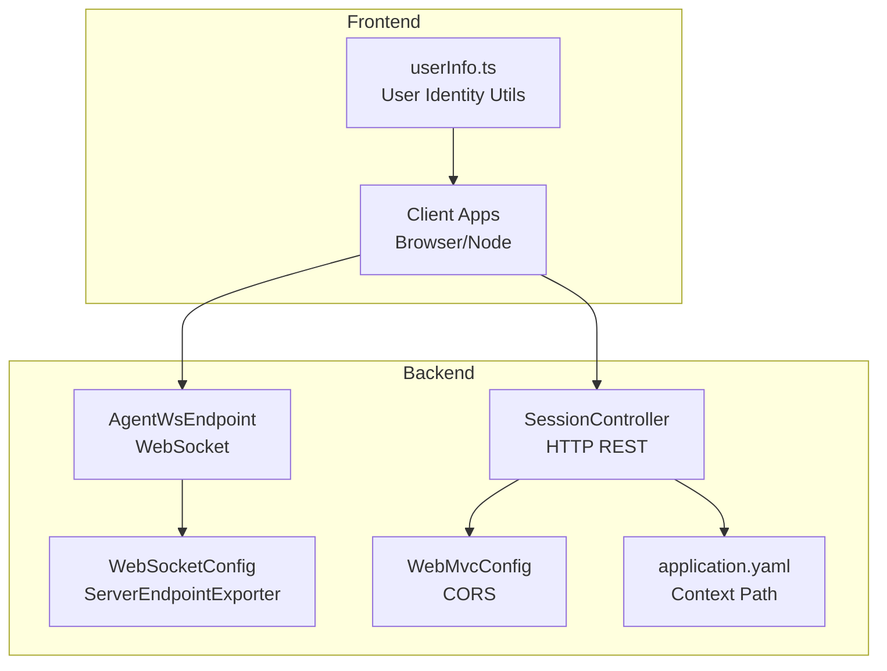
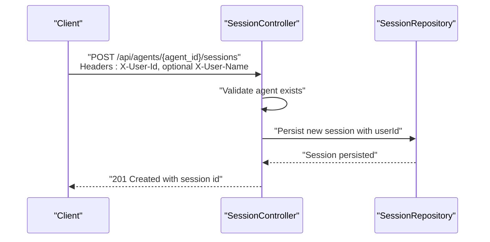
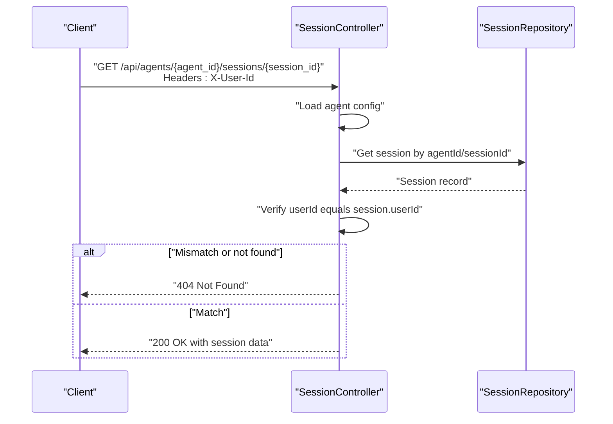
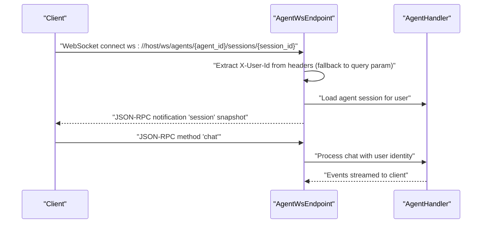
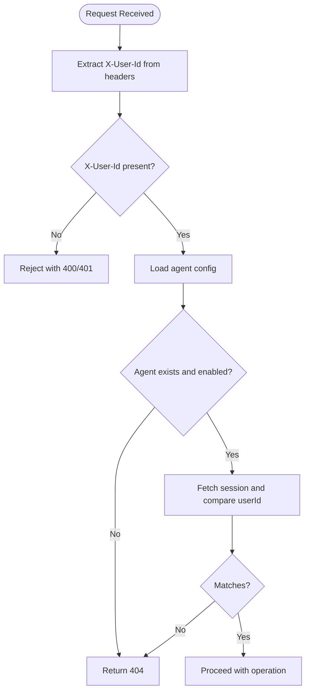
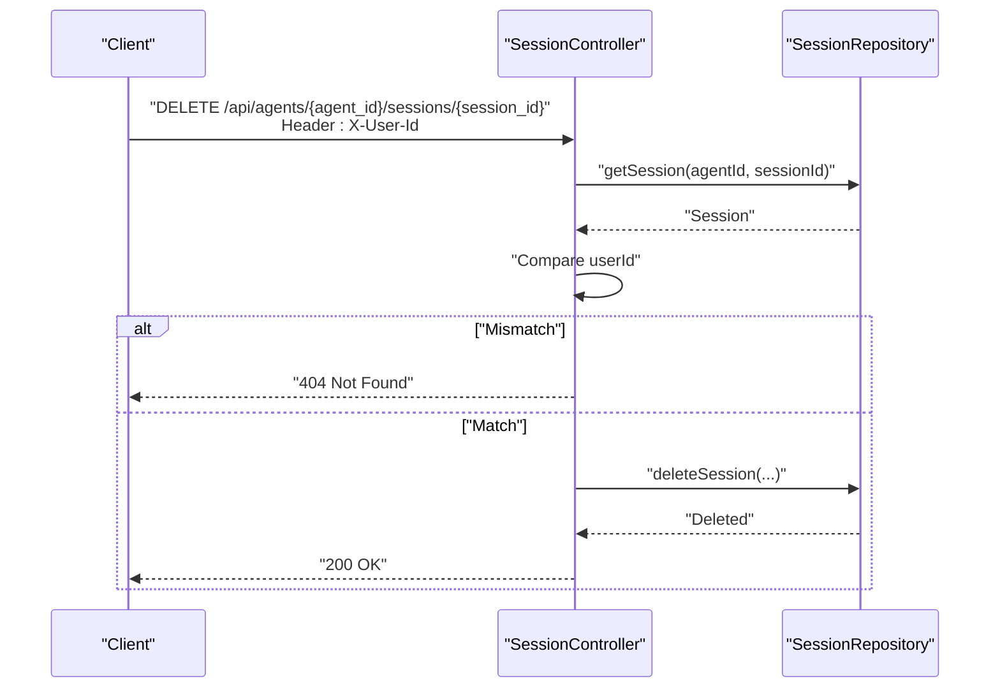
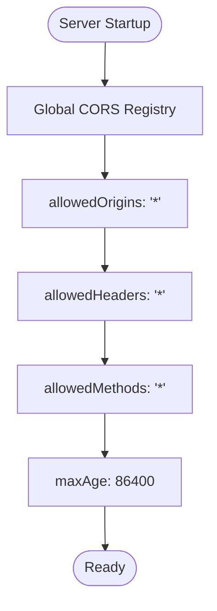
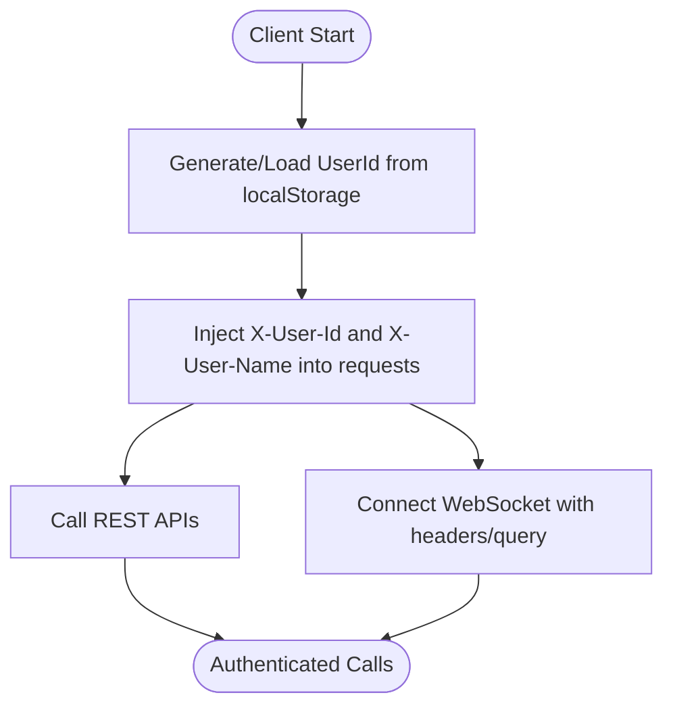
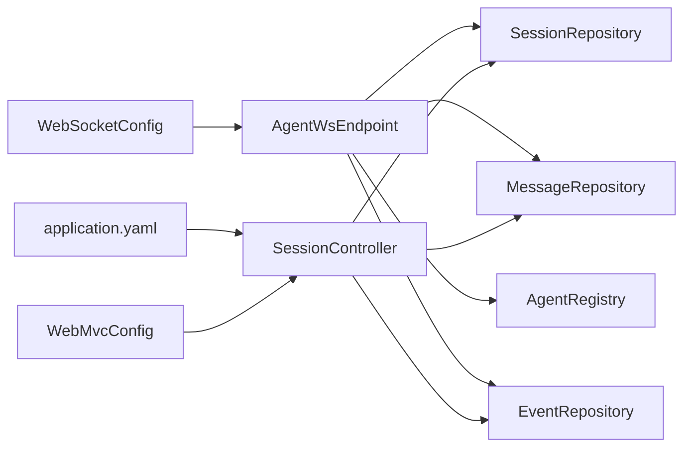

# Authentication and Authorization

<cite>
**Referenced Files in This Document**
- [SessionController.java](file://backend_java/api/src/main/java/com/aliyun/tam/x/tron/api/SessionController.java)
- [AgentWsEndpoint.java](file://backend_java/api/src/main/java/com/aliyun/tam/x/tron/ws/AgentWsEndpoint.java)
- [AgentEndpointConfigurator.java](file://backend_java/api/src/main/java/com/aliyun/tam/x/tron/ws/AgentEndpointConfigurator.java)
- [WebMvcConfig.java](file://backend_java/bootstrap/src/main/java/com/aliyun/tam/x/tron/config/WebMvcConfig.java)
- [WebSocketConfig.java](file://backend_java/bootstrap/src/main/java/com/aliyun/tam/x/tron/config/WebSocketConfig.java)
- [application.yaml](file://backend_java/bootstrap/src/main/resources/application.yaml)
- [develop_guide.md](file://docs/en/develop_guide.md)
- [userInfo.ts](file://frontend/packages/control/src/utils/userInfo.ts)
- [FileController.java](file://backend_java/api/src/main/java/com/aliyun/tam/x/tron/api/FileController.java)
</cite>

## Table of Contents
1. [Introduction](#introduction)
2. [Project Structure](#project-structure)
3. [Core Components](#core-components)
4. [Architecture Overview](#architecture-overview)
5. [Detailed Component Analysis](#detailed-component-analysis)
6. [Dependency Analysis](#dependency-analysis)
7. [Performance Considerations](#performance-considerations)
8. [Troubleshooting Guide](#troubleshooting-guide)
9. [Conclusion](#conclusion)
10. [Appendices](#appendices)

## Introduction
This document describes the authentication and authorization model for Tron OneAgent’s API surface. It focuses on the header-based authentication scheme using X-User-Id and X-User-Name headers, session-based access control, user ownership verification, and permission enforcement. It also documents CORS configuration, cross-origin resource sharing policies, and outlines token-based authentication alternatives, API key management, and OAuth integration patterns. Security best practices, threat mitigation strategies, and compliance considerations are included, along with implementation examples for client-side authentication, secure header injection, and session management across different integration scenarios.

## Project Structure
The authentication and authorization logic spans several layers:
- HTTP REST endpoints enforce header-based authentication and user ownership checks.
- WebSocket endpoints support the same header-based identity and optionally fall back to URL query parameters.
- CORS is configured globally to allow cross-origin requests.
- Frontend utilities demonstrate client-side user identity generation and persistence.

**Diagram sources**
- [SessionController.java:132-346](file://backend_java/api/src/main/java/com/aliyun/tam/x/tron/api/SessionController.java#L132-L346)
- [AgentWsEndpoint.java:116-136](file://backend_java/api/src/main/java/com/aliyun/tam/x/tron/ws/AgentWsEndpoint.java#L116-L136)
- [WebSocketConfig.java:28-35](file://backend_java/bootstrap/src/main/java/com/aliyun/tam/x/tron/config/WebSocketConfig.java#L28-L35)
- [WebMvcConfig.java:80-88](file://backend_java/bootstrap/src/main/java/com/aliyun/tam/x/tron/config/WebMvcConfig.java#L80-L88)
- [application.yaml:1-6](file://backend_java/bootstrap/src/main/resources/application.yaml#L1-L6)

**Section sources**
- [SessionController.java:132-346](file://backend_java/api/src/main/java/com/aliyun/tam/x/tron/api/SessionController.java#L132-L346)
- [AgentWsEndpoint.java:116-136](file://backend_java/api/src/main/java/com/aliyun/tam/x/tron/ws/AgentWsEndpoint.java#L116-L136)
- [WebMvcConfig.java:80-88](file://backend_java/bootstrap/src/main/java/com/aliyun/tam/x/tron/config/WebMvcConfig.java#L80-L88)
- [WebSocketConfig.java:28-35](file://backend_java/bootstrap/src/main/java/com/aliyun/tam/x/tron/config/WebSocketConfig.java#L28-L35)
- [application.yaml:1-6](file://backend_java/bootstrap/src/main/resources/application.yaml#L1-L6)

## Core Components
- Header-based authentication:
  - X-User-Id is mandatory for most endpoints.
  - X-User-Name is optional; defaults to X-User-Id if absent.
- Ownership verification:
  - Endpoints validate that the requested session belongs to the authenticated user.
- Access control:
  - Session CRUD and message retrieval enforce user ownership.
- Real-time channels:
  - WebSocket handshake reads headers and optionally falls back to URL query parameters.
- CORS:
  - Global CORS allows all origins, headers, and methods with a max age.

**Section sources**
- [SessionController.java:132-346](file://backend_java/api/src/main/java/com/aliyun/tam/x/tron/api/SessionController.java#L132-L346)
- [AgentWsEndpoint.java:116-136](file://backend_java/api/src/main/java/com/aliyun/tam/x/tron/ws/AgentWsEndpoint.java#L116-L136)
- [WebMvcConfig.java:80-88](file://backend_java/bootstrap/src/main/java/com/aliyun/tam/x/tron/config/WebMvcConfig.java#L80-L88)

## Architecture Overview
The authentication model is header-driven and enforced at the controller and endpoint boundaries. The following sequence diagrams illustrate typical flows.

**Diagram sources**
- [SessionController.java:132-158](file://backend_java/api/src/main/java/com/aliyun/tam/x/tron/api/SessionController.java#L132-L158)

**Diagram sources**
- [SessionController.java:187-223](file://backend_java/api/src/main/java/com/aliyun/tam/x/tron/api/SessionController.java#L187-L223)

**Diagram sources**
- [AgentWsEndpoint.java:116-136](file://backend_java/api/src/main/java/com/aliyun/tam/x/tron/ws/AgentWsEndpoint.java#L116-L136)
- [AgentEndpointConfigurator.java:33-56](file://backend_java/api/src/main/java/com/aliyun/tam/x/tron/ws/AgentEndpointConfigurator.java#L33-L56)

## Detailed Component Analysis

### Header-Based Authentication and Ownership Verification
- HTTP REST:
  - X-User-Id is extracted from request headers for session creation, listing, retrieval, deletion, and message retrieval.
  - Ownership check compares the authenticated user ID against the stored session user ID.
- WebSocket:
  - On open, the endpoint extracts X-User-Id from headers and optionally falls back to URL query parameters.
  - X-User-Name is optional and defaults to X-User-Id if not provided.

**Diagram sources**
- [SessionController.java:132-346](file://backend_java/api/src/main/java/com/aliyun/tam/x/tron/api/SessionController.java#L132-L346)
- [AgentWsEndpoint.java:116-136](file://backend_java/api/src/main/java/com/aliyun/tam/x/tron/ws/AgentWsEndpoint.java#L116-L136)

**Section sources**
- [SessionController.java:132-346](file://backend_java/api/src/main/java/com/aliyun/tam/x/tron/api/SessionController.java#L132-L346)
- [AgentWsEndpoint.java:116-136](file://backend_java/api/src/main/java/com/aliyun/tam/x/tron/ws/AgentWsEndpoint.java#L116-L136)
- [AgentEndpointConfigurator.java:33-56](file://backend_java/api/src/main/java/com/aliyun/tam/x/tron/ws/AgentEndpointConfigurator.java#L33-L56)

### Session-Based Access Control and Permission Enforcement
- Session creation stores the authenticated user ID with the session.
- All subsequent session and message operations validate that the caller’s user ID matches the session’s user ID.
- Deletion and listing also enforce ownership.

**Diagram sources**
- [SessionController.java:225-247](file://backend_java/api/src/main/java/com/aliyun/tam/x/tron/api/SessionController.java#L225-L247)

**Section sources**
- [SessionController.java:187-247](file://backend_java/api/src/main/java/com/aliyun/tam/x/tron/api/SessionController.java#L187-L247)

### Security Headers and CORS Policies
- CORS:
  - All paths under the configured context path are exposed with broad allowances for origins, headers, and methods.
  - Credentials are not enabled by default.
  - Max age is set to a day.
- Context path:
  - The server context path is configured to /api, affecting all endpoint URLs.

**Diagram sources**
- [WebMvcConfig.java:80-88](file://backend_java/bootstrap/src/main/java/com/aliyun/tam/x/tron/config/WebMvcConfig.java#L80-L88)
- [application.yaml:1-6](file://backend_java/bootstrap/src/main/resources/application.yaml#L1-L6)

**Section sources**
- [WebMvcConfig.java:80-88](file://backend_java/bootstrap/src/main/java/com/aliyun/tam/x/tron/config/WebMvcConfig.java#L80-L88)
- [application.yaml:1-6](file://backend_java/bootstrap/src/main/resources/application.yaml#L1-L6)

### Token-Based Authentication Alternatives, API Keys, and OAuth
- Current implementation:
  - Uses header-based identity (X-User-Id, X-User-Name) without tokens or API keys.
- Recommended alternatives (patterns):
  - Bearer tokens: Introduce a filter to extract Authorization: Bearer <token>, validate against a token store, and populate a security context.
  - API keys: Accept X-API-Key in headers, validate against registered keys, and attach key metadata to the request.
  - OAuth 2.0: Integrate with an OAuth provider using Spring Security OAuth2 Client for authorization code flow; exchange tokens for user identity claims.
- Notes:
  - These are integration patterns; they are not currently implemented in the repository.

[No sources needed since this section provides conceptual guidance]

### Client-Side Authentication and Secure Header Injection
- Frontend utilities:
  - Persist a stable user identifier in local storage and default user name.
  - Use these values to inject X-User-Id and X-User-Name into outbound requests.
- Integration scenarios:
  - Single-page apps: Inject headers before fetch/XHR calls.
  - Microservice clients: Add headers in interceptors or HTTP clients.
  - WebSocket clients: Pass headers during handshake or via URL query parameters as supported by the endpoint.

**Diagram sources**
- [userInfo.ts:18-49](file://frontend/packages/control/src/utils/userInfo.ts#L18-L49)

**Section sources**
- [userInfo.ts:18-49](file://frontend/packages/control/src/utils/userInfo.ts#L18-L49)

### Cross-Origin Resource Sharing (CORS) and File Upload Considerations
- CORS configuration allows all origins and methods, which simplifies integration but requires careful deployment practices.
- File uploads:
  - The file controller reads X-User-Id from headers to associate uploads with users.
  - Additional validation ensures safe file names.

**Section sources**
- [WebMvcConfig.java:80-88](file://backend_java/bootstrap/src/main/java/com/aliyun/tam/x/tron/config/WebMvcConfig.java#L80-L88)
- [FileController.java:52-67](file://backend_java/api/src/main/java/com/aliyun/tam/x/tron/api/FileController.java#L52-L67)

## Dependency Analysis
The authentication and authorization logic depends on:
- Controllers for enforcing headers and ownership.
- Repositories for session and message persistence.
- WebSocket endpoint for real-time channels with header extraction.
- Configuration beans for CORS and WebSocket export.

**Diagram sources**
- [SessionController.java:87-99](file://backend_java/api/src/main/java/com/aliyun/tam/x/tron/api/SessionController.java#L87-L99)
- [AgentWsEndpoint.java:64-80](file://backend_java/api/src/main/java/com/aliyun/tam/x/tron/ws/AgentWsEndpoint.java#L64-L80)
- [WebSocketConfig.java:28-35](file://backend_java/bootstrap/src/main/java/com/aliyun/tam/x/tron/config/WebSocketConfig.java#L28-L35)
- [WebMvcConfig.java:80-88](file://backend_java/bootstrap/src/main/java/com/aliyun/tam/x/tron/config/WebMvcConfig.java#L80-L88)
- [application.yaml:1-6](file://backend_java/bootstrap/src/main/resources/application.yaml#L1-L6)

**Section sources**
- [SessionController.java:87-99](file://backend_java/api/src/main/java/com/aliyun/tam/x/tron/api/SessionController.java#L87-L99)
- [AgentWsEndpoint.java:64-80](file://backend_java/api/src/main/java/com/aliyun/tam/x/tron/ws/AgentWsEndpoint.java#L64-L80)
- [WebSocketConfig.java:28-35](file://backend_java/bootstrap/src/main/java/com/aliyun/tam/x/tron/config/WebSocketConfig.java#L28-L35)
- [WebMvcConfig.java:80-88](file://backend_java/bootstrap/src/main/java/com/aliyun/tam/x/tron/config/WebMvcConfig.java#L80-L88)
- [application.yaml:1-6](file://backend_java/bootstrap/src/main/resources/application.yaml#L1-L6)

## Performance Considerations
- Header extraction overhead is minimal; ensure consistent header casing and avoid redundant parsing.
- WebSocket connections maintain persistent sessions; keep message sizes reasonable and batch events when appropriate.
- CORS wildcard settings simplify development but can increase preflight traffic; consider scoping origins in production.

[No sources needed since this section provides general guidance]

## Troubleshooting Guide
Common issues and resolutions:
- 404 Not Found on session operations:
  - Verify X-User-Id matches the session’s stored user ID.
  - Confirm the agent exists and is enabled.
- CORS errors:
  - Ensure the client sends the same origin/method/header expectations as configured.
  - Review browser console for preflight failures.
- WebSocket authentication failures:
  - Confirm X-User-Id is present in headers or URL query parameters.
  - Check server logs for handshake exceptions.

**Section sources**
- [SessionController.java:187-223](file://backend_java/api/src/main/java/com/aliyun/tam/x/tron/api/SessionController.java#L187-L223)
- [WebMvcConfig.java:80-88](file://backend_java/bootstrap/src/main/java/com/aliyun/tam/x/tron/config/WebMvcConfig.java#L80-L88)
- [AgentWsEndpoint.java:116-136](file://backend_java/api/src/main/java/com/aliyun/tam/x/tron/ws/AgentWsEndpoint.java#L116-L136)

## Conclusion
Tron OneAgent employs a straightforward header-based authentication model using X-User-Id and X-User-Name, enforced at REST and WebSocket boundaries. Ownership verification ensures session isolation per user. The system’s CORS policy enables flexible integration during development, while the documented patterns provide a clear path to adopt tokens, API keys, or OAuth for production-grade security. Client utilities demonstrate practical approaches to injecting headers consistently across integration scenarios.

[No sources needed since this section summarizes without analyzing specific files]

## Appendices

### API Reference Highlights
- REST endpoints:
  - Create session: POST /api/agents/{agent_id}/sessions with X-User-Id.
  - List sessions: GET /api/agents/{agent_id}/sessions with X-User-Id.
  - Get session: GET /api/agents/{agent_id}/sessions/{session_id} with X-User-Id.
  - Delete session: DELETE /api/agents/{agent_id}/sessions/{session_id} with X-User-Id.
  - List messages: GET /api/agents/{agent_id}/sessions/{session_id}/messages with X-User-Id.
  - List events: GET /api/agents/{agent_id}/sessions/{session_id}/events with X-User-Id.
  - Chat: POST /api/agents/{agent_id}/sessions/{session_id}/chat with X-User-Id and optional X-User-Name.
- WebSocket endpoint:
  - ws://host:port/ws/agents/{agent_id}/sessions/{session_id} with X-User-Id and optional X-User-Name.

**Section sources**
- [develop_guide.md:560-759](file://docs/en/develop_guide.md#L560-L759)