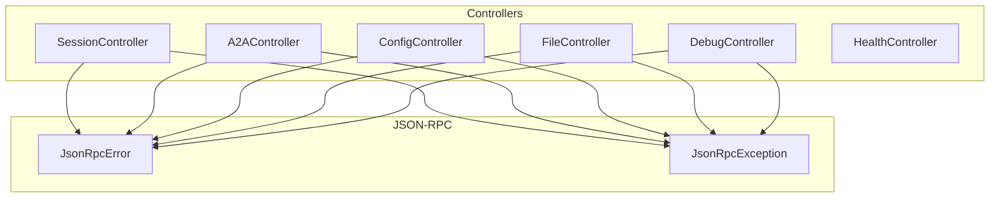
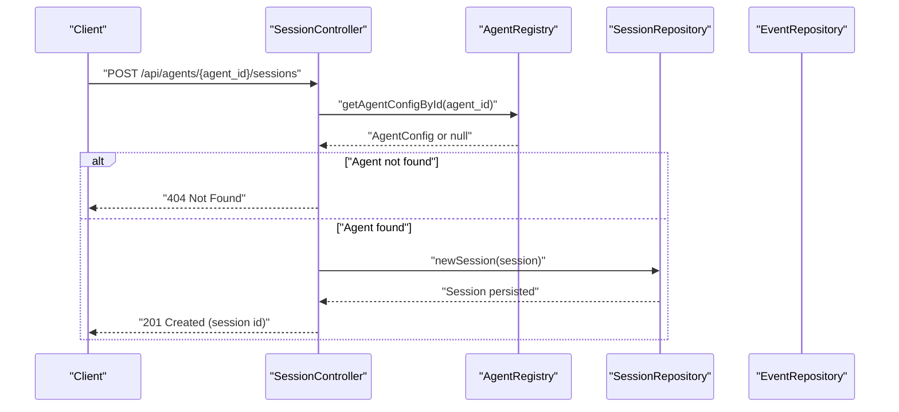
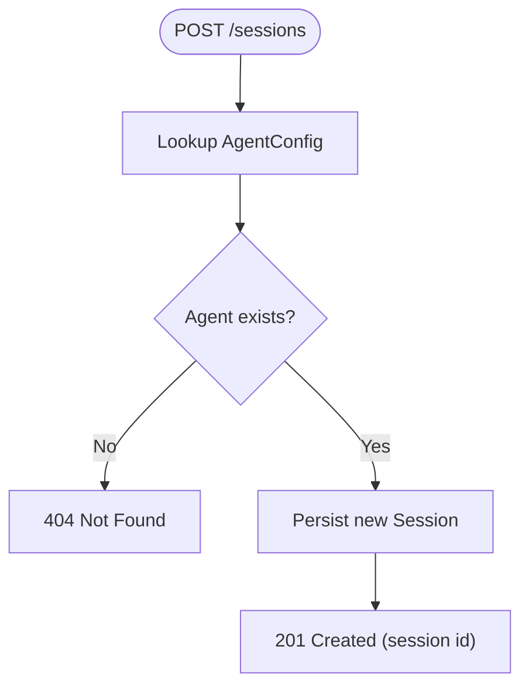
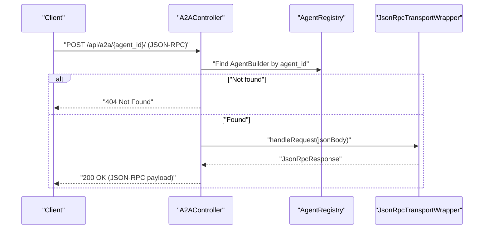
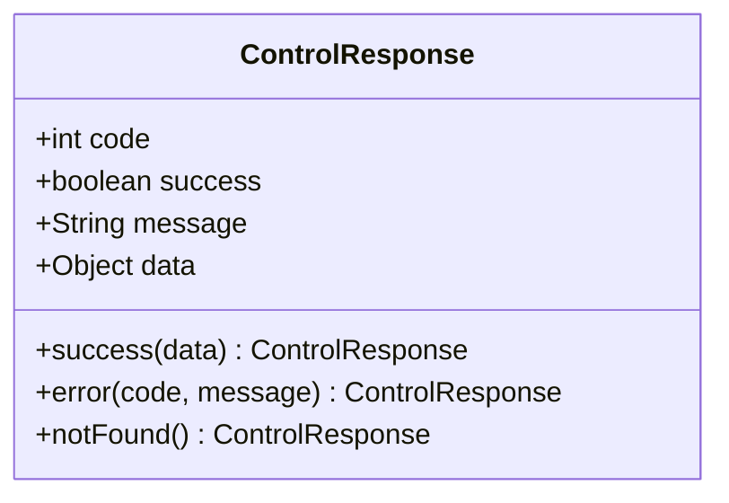
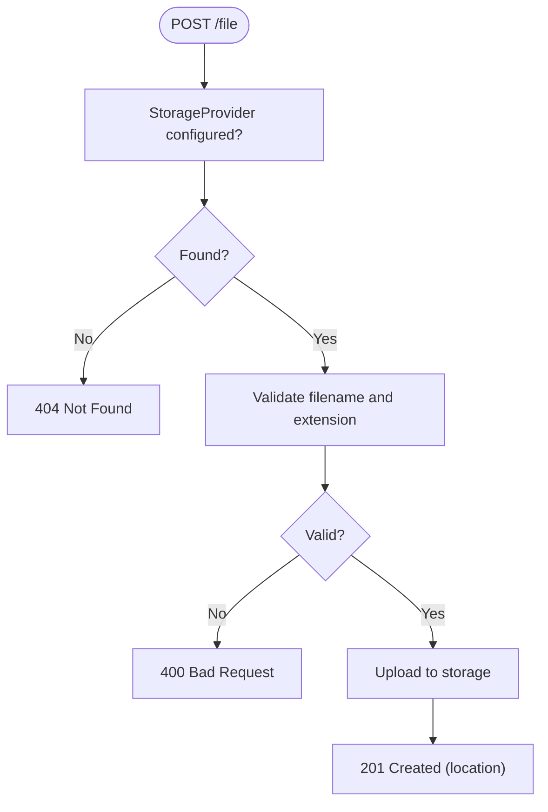
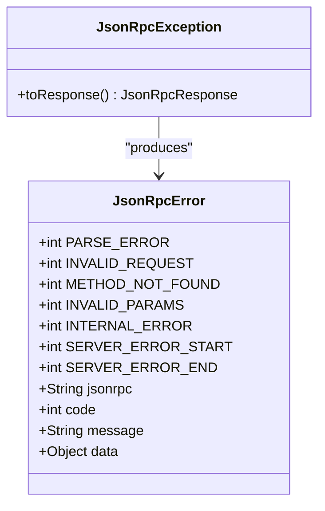
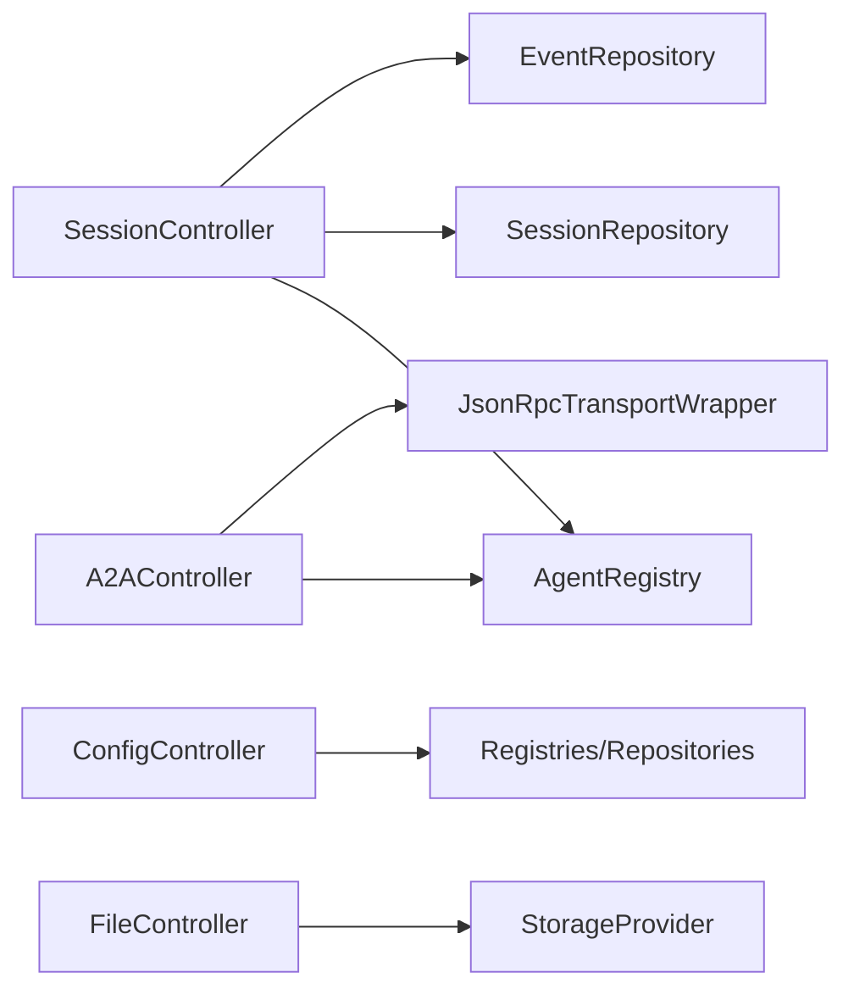

# Error Handling and Status Codes

<cite>
**Referenced Files in This Document**
- [A2AController.java](file://backend_java/api/src/main/java/com/aliyun/tam/x/tron/api/A2AController.java)
- [ConfigController.java](file://backend_java/api/src/main/java/com/aliyun/tam/x/tron/api/ConfigController.java)
- [DebugController.java](file://backend_java/api/src/main/java/com/aliyun/tam/x/tron/api/DebugController.java)
- [SessionController.java](file://backend_java/api/src/main/java/com/aliyun/tam/x/tron/api/SessionController.java)
- [FileController.java](file://backend_java/api/src/main/java/com/aliyun/tam/x/tron/api/FileController.java)
- [HealthController.java](file://backend_java/api/src/main/java/com/aliyun/tam/x/tron/api/HealthController.java)
- [JsonRpcError.java](file://backend_java/api/src/main/java/com/aliyun/tam/x/tron/ws/jsonrpc/JsonRpcError.java)
- [JsonRpcException.java](file://backend_java/api/src/main/java/com/aliyun/tam/x/tron/ws/jsonrpc/JsonRpcException.java)
- [application.yaml](file://backend_java/bootstrap/src/main/resources/application.yaml)
- [logback.xml](file://backend_java/bootstrap/src/main/resources/logback.xml)
</cite>

## Table of Contents
1. [Introduction](#introduction)
2. [Project Structure](#project-structure)
3. [Core Components](#core-components)
4. [Architecture Overview](#architecture-overview)
5. [Detailed Component Analysis](#detailed-component-analysis)
6. [Dependency Analysis](#dependency-analysis)
7. [Performance Considerations](#performance-considerations)
8. [Troubleshooting Guide](#troubleshooting-guide)
9. [Conclusion](#conclusion)
10. [Appendices](#appendices)

## Introduction
This document provides comprehensive error handling and HTTP status code guidance for Tron OneAgent’s API. It covers standard HTTP status codes, custom error response formats, exception handling patterns, logging strategies, rate limiting and retry considerations, and client-side recommendations. It also documents common error scenarios and their resolution approaches.

## Project Structure
The API surface is implemented via Spring MVC controllers grouped by functional domains:
- Session and chat lifecycle: SessionController
- Agent-to-Agent JSON-RPC transport: A2AController
- Configuration management: ConfigController
- File upload and retrieval: FileController
- Debug utilities: DebugController
- Health endpoint: HealthController
- JSON-RPC error model: JsonRpcError, JsonRpcException

**Diagram sources**
- [SessionController.java:80-564](file://backend_java/api/src/main/java/com/aliyun/tam/x/tron/api/SessionController.java#L80-L564)
- [A2AController.java:63-241](file://backend_java/api/src/main/java/com/aliyun/tam/x/tron/api/A2AController.java#L63-L241)
- [ConfigController.java:53-483](file://backend_java/api/src/main/java/com/aliyun/tam/x/tron/api/ConfigController.java#L53-L483)
- [FileController.java:37-113](file://backend_java/api/src/main/java/com/aliyun/tam/x/tron/api/FileController.java#L37-L113)
- [DebugController.java:44-165](file://backend_java/api/src/main/java/com/aliyun/tam/x/tron/api/DebugController.java#L44-L165)
- [HealthController.java:25-33](file://backend_java/api/src/main/java/com/aliyun/tam/x/tron/api/HealthController.java#L25-L33)
- [JsonRpcError.java:23-45](file://backend_java/api/src/main/java/com/aliyun/tam/x/tron/ws/jsonrpc/JsonRpcError.java#L23-L45)
- [JsonRpcException.java:22-62](file://backend_java/api/src/main/java/com/aliyun/tam/x/tron/ws/jsonrpc/JsonRpcException.java#L22-L62)

**Section sources**
- [SessionController.java:80-564](file://backend_java/api/src/main/java/com/aliyun/tam/x/tron/api/SessionController.java#L80-L564)
- [A2AController.java:63-241](file://backend_java/api/src/main/java/com/aliyun/tam/x/tron/api/A2AController.java#L63-L241)
- [ConfigController.java:53-483](file://backend_java/api/src/main/java/com/aliyun/tam/x/tron/api/ConfigController.java#L53-L483)
- [FileController.java:37-113](file://backend_java/api/src/main/java/com/aliyun/tam/x/tron/api/FileController.java#L37-L113)
- [DebugController.java:44-165](file://backend_java/api/src/main/java/com/aliyun/tam/x/tron/api/DebugController.java#L44-L165)
- [HealthController.java:25-33](file://backend_java/api/src/main/java/com/aliyun/tam/x/tron/api/HealthController.java#L25-L33)
- [JsonRpcError.java:23-45](file://backend_java/api/src/main/java/com/aliyun/tam/x/tron/ws/jsonrpc/JsonRpcError.java#L23-L45)
- [JsonRpcException.java:22-62](file://backend_java/api/src/main/java/com/aliyun/tam/x/tron/ws/jsonrpc/JsonRpcException.java#L22-L62)

## Core Components
- SessionController: Implements standard HTTP responses and handles argument validation, session existence checks, SSE streaming, and async timeouts.
- A2AController: Exposes JSON-RPC over HTTP for agent interactions; returns 404 when agent/card not found; delegates execution to a JSON-RPC transport wrapper.
- ConfigController: Provides a unified ControlResponse envelope with success/error semantics and centralized exception handling.
- FileController: Validates filenames and file types; returns 400 for invalid inputs and 404 when storage provider is unavailable.
- DebugController: Returns 404 for missing tools/MCP clients/knowledge bases; returns 400 for bad request parsing and 500 for internal errors.
- HealthController: Returns 200 with “ok” for health checks.
- JSON-RPC Error Model: Defines standard JSON-RPC error codes and a wrapper exception to produce structured error responses.

**Section sources**
- [SessionController.java:116-130](file://backend_java/api/src/main/java/com/aliyun/tam/x/tron/api/SessionController.java#L116-L130)
- [A2AController.java:91-128](file://backend_java/api/src/main/java/com/aliyun/tam/x/tron/api/A2AController.java#L91-L128)
- [ConfigController.java:109-116](file://backend_java/api/src/main/java/com/aliyun/tam/x/tron/api/ConfigController.java#L109-L116)
- [FileController.java:51-100](file://backend_java/api/src/main/java/com/aliyun/tam/x/tron/api/FileController.java#L51-L100)
- [DebugController.java:56-83](file://backend_java/api/src/main/java/com/aliyun/tam/x/tron/api/DebugController.java#L56-L83)
- [HealthController.java:28-31](file://backend_java/api/src/main/java/com/aliyun/tam/x/tron/api/HealthController.java#L28-L31)
- [JsonRpcError.java:26-33](file://backend_java/api/src/main/java/com/aliyun/tam/x/tron/ws/jsonrpc/JsonRpcError.java#L26-L33)
- [JsonRpcException.java:34-60](file://backend_java/api/src/main/java/com/aliyun/tam/x/tron/ws/jsonrpc/JsonRpcException.java#L34-L60)

## Architecture Overview
The API routes map to controllers that return ResponseEntity with appropriate HTTP status codes. Controllers may:
- Return 200/201 for successful operations
- Return 400 for invalid inputs or parsing failures
- Return 401/403 via upstream authorization failures (not shown in code)
- Return 404 for missing resources
- Return 409 for conflicts (not shown in code)
- Return 413 when multipart limits are exceeded (via Spring configuration)
- Return 429 via external rate limiting (not shown in code)
- Return 429/430+ for concurrency/queue rejections (not shown in code)
- Return 500 for unhandled exceptions

**Diagram sources**
- [SessionController.java:132-158](file://backend_java/api/src/main/java/com/aliyun/tam/x/tron/api/SessionController.java#L132-L158)

**Section sources**
- [SessionController.java:132-158](file://backend_java/api/src/main/java/com/aliyun/tam/x/tron/api/SessionController.java#L132-L158)

## Detailed Component Analysis

### SessionController: Chat and Session Lifecycle
- Status codes:
  - 201 Created: Session creation success
  - 200 OK: Non-SSE chat completion acknowledgment
  - 400 Bad Request: Concurrent chat on an executing session
  - 404 Not Found: Agent/session not found or mismatched user
  - 500 Internal Server Error: Unhandled exceptions
  - 408 Request Timeout: Async SSE timeout handling
- Exception handling:
  - Centralized @ExceptionHandler maps IllegalArgumentException to 400 and AsyncRequestTimeoutException to 408
  - Other exceptions logged and mapped to 500
- SSE behavior:
  - Emits events to clients; gracefully handles closed emitters and errors

**Diagram sources**
- [SessionController.java:132-158](file://backend_java/api/src/main/java/com/aliyun/tam/x/tron/api/SessionController.java#L132-L158)

**Section sources**
- [SessionController.java:116-130](file://backend_java/api/src/main/java/com/aliyun/tam/x/tron/api/SessionController.java#L116-L130)
- [SessionController.java:132-158](file://backend_java/api/src/main/java/com/aliyun/tam/x/tron/api/SessionController.java#L132-L158)
- [SessionController.java:308-346](file://backend_java/api/src/main/java/com/aliyun/tam/x/tron/api/SessionController.java#L308-L346)

### A2AController: JSON-RPC Transport
- Status codes:
  - 200 OK: Successful JSON-RPC response
  - 404 Not Found: Unknown agent_id or missing agent card
- Behavior:
  - Validates agent existence; returns 404 if not found
  - Wraps request handling via JSON-RPC transport and returns the response body

**Diagram sources**
- [A2AController.java:107-128](file://backend_java/api/src/main/java/com/aliyun/tam/x/tron/api/A2AController.java#L107-L128)

**Section sources**
- [A2AController.java:91-128](file://backend_java/api/src/main/java/com/aliyun/tam/x/tron/api/A2AController.java#L91-L128)

### ConfigController: Unified ControlResponse Envelope
- Response format:
  - success envelope with code, success flag, message, and data
  - Convenience helpers for success and not-found responses
- Exception handling:
  - @ExceptionHandler maps IllegalArgumentException to 400 with message
  - Logs and returns 500 for other exceptions
- Typical status codes:
  - 200 OK: Successful GET/PUT/PATCH/DELETE operations
  - 404 Not Found: Missing entity
  - 400 Bad Request: Validation errors
  - 500 Internal Server Error: Unexpected failures

**Diagram sources**
- [ConfigController.java:61-83](file://backend_java/api/src/main/java/com/aliyun/tam/x/tron/api/ConfigController.java#L61-L83)

**Section sources**
- [ConfigController.java:109-116](file://backend_java/api/src/main/java/com/aliyun/tam/x/tron/api/ConfigController.java#L109-L116)
- [ConfigController.java:118-132](file://backend_java/api/src/main/java/com/aliyun/tam/x/tron/api/ConfigController.java#L118-L132)

### FileController: Upload and Retrieval
- Status codes:
  - 201 Created: On successful upload
  - 400 Bad Request: Invalid filename or disallowed file type
  - 404 Not Found: Storage provider not configured or resource not found
  - 500 Internal Server Error: Unexpected failures
- Validation:
  - Rejects filenames containing path traversal or disallowed extensions
  - Enforces multipart limits via Spring configuration

**Diagram sources**
- [FileController.java:51-100](file://backend_java/api/src/main/java/com/aliyun/tam/x/tron/api/FileController.java#L51-L100)

**Section sources**
- [FileController.java:51-100](file://backend_java/api/src/main/java/com/aliyun/tam/x/tron/api/FileController.java#L51-L100)

### DebugController: Tool, MCP, and Knowledge Base Debugging
- Status codes:
  - 200 OK: Schema/tool/MCP tool listing or retrieval
  - 404 Not Found: Missing tool/MCP client/knowledge base
  - 400 Bad Request: Parsing errors or invalid inputs
  - 500 Internal Server Error: Unexpected failures
- Notes:
  - Uses ObjectMapper to parse request bodies
  - Returns error messages in response body for debugging

**Section sources**
- [DebugController.java:56-83](file://backend_java/api/src/main/java/com/aliyun/tam/x/tron/api/DebugController.java#L56-L83)
- [DebugController.java:85-108](file://backend_java/api/src/main/java/com/aliyun/tam/x/tron/api/DebugController.java#L85-L108)
- [DebugController.java:110-138](file://backend_java/api/src/main/java/com/aliyun/tam/x/tron/api/DebugController.java#L110-L138)
- [DebugController.java:140-163](file://backend_java/api/src/main/java/com/aliyun/tam/x/tron/api/DebugController.java#L140-L163)

### HealthController: Readiness/Liveness
- Status codes:
  - 200 OK: Health check success

**Section sources**
- [HealthController.java:28-31](file://backend_java/api/src/main/java/com/aliyun/tam/x/tron/api/HealthController.java#L28-L31)

### JSON-RPC Error Model
- Error codes:
  - Standard JSON-RPC codes including parse error, invalid request, method not found, invalid params, internal error
  - Server error range reserved for custom server errors
- Exception:
  - JsonRpcException wraps id, code, message, and optional data
  - Converts to JsonRpcResponse for transport

**Diagram sources**
- [JsonRpcError.java:26-44](file://backend_java/api/src/main/java/com/aliyun/tam/x/tron/ws/jsonrpc/JsonRpcError.java#L26-L44)
- [JsonRpcException.java:54-60](file://backend_java/api/src/main/java/com/aliyun/tam/x/tron/ws/jsonrpc/JsonRpcException.java#L54-L60)

**Section sources**
- [JsonRpcError.java:26-33](file://backend_java/api/src/main/java/com/aliyun/tam/x/tron/ws/jsonrpc/JsonRpcError.java#L26-L33)
- [JsonRpcError.java:35-44](file://backend_java/api/src/main/java/com/aliyun/tam/x/tron/ws/jsonrpc/JsonRpcError.java#L35-L44)
- [JsonRpcException.java:34-60](file://backend_java/api/src/main/java/com/aliyun/tam/x/tron/ws/jsonrpc/JsonRpcException.java#L34-L60)

## Dependency Analysis
- Controllers depend on repositories, registries, and services to validate inputs and persist state.
- A2AController depends on AgentRegistry and JSON-RPC transport wrappers.
- ConfigController centralizes error handling via a dedicated exception handler.
- FileController depends on StorageProvider and respects Spring multipart limits.
- Logging is configured via Logback; controllers log errors and debug info.

**Diagram sources**
- [SessionController.java:84-97](file://backend_java/api/src/main/java/com/aliyun/tam/x/tron/api/SessionController.java#L84-L97)
- [A2AController.java:68-76](file://backend_java/api/src/main/java/com/aliyun/tam/x/tron/api/A2AController.java#L68-L76)
- [ConfigController.java:85-107](file://backend_java/api/src/main/java/com/aliyun/tam/x/tron/api/ConfigController.java#L85-L107)
- [FileController.java:48-49](file://backend_java/api/src/main/java/com/aliyun/tam/x/tron/api/FileController.java#L48-L49)

**Section sources**
- [SessionController.java:84-97](file://backend_java/api/src/main/java/com/aliyun/tam/x/tron/api/SessionController.java#L84-L97)
- [A2AController.java:68-76](file://backend_java/api/src/main/java/com/aliyun/tam/x/tron/api/A2AController.java#L68-L76)
- [ConfigController.java:85-107](file://backend_java/api/src/main/java/com/aliyun/tam/x/tron/api/ConfigController.java#L85-L107)
- [FileController.java:48-49](file://backend_java/api/src/main/java/com/aliyun/tam/x/tron/api/FileController.java#L48-L49)

## Performance Considerations
- Concurrency:
  - SessionController and A2AController use thread pools for async processing; consider tuning pool sizes and queue depths for load characteristics.
- SSE streaming:
  - Ensure clients handle connection drops and reconnections; monitor emitter completion and error paths.
- Multipart limits:
  - Spring multipart max-file-size and max-request-size are set; exceeding these yields 400/413-like behavior at the framework level.

[No sources needed since this section provides general guidance]

## Troubleshooting Guide
- 400 Bad Request
  - SessionController: Occurs when attempting to chat while a session is still executing.
  - FileController: Invalid filename or disallowed file type.
  - DebugController: Malformed request body or invalid parameters.
- 404 Not Found
  - SessionController: Agent or session not found or user mismatch.
  - A2AController: Unknown agent_id or missing agent card.
  - ConfigController: Missing configuration entity.
  - FileController: Storage provider not configured or resource not found.
  - DebugController: Missing tool/MCP client/knowledge base.
- 500 Internal Server Error
  - SessionController: Unhandled exceptions; check logs for stack traces.
  - ConfigController: Unhandled exceptions; see centralized exception handler.
  - DebugController: Unexpected runtime errors; check logs.
- Logging
  - Logback configuration emits INFO-level logs to console and rolling files; adjust levels for diagnostics.
- Health
  - Use /api/health/check for quick liveness/readiness verification.

**Section sources**
- [SessionController.java:326-330](file://backend_java/api/src/main/java/com/aliyun/tam/x/tron/api/SessionController.java#L326-L330)
- [FileController.java:61-81](file://backend_java/api/src/main/java/com/aliyun/tam/x/tron/api/FileController.java#L61-L81)
- [DebugController.java:96-107](file://backend_java/api/src/main/java/com/aliyun/tam/x/tron/api/DebugController.java#L96-L107)
- [SessionController.java:116-130](file://backend_java/api/src/main/java/com/aliyun/tam/x/tron/api/SessionController.java#L116-L130)
- [ConfigController.java:109-116](file://backend_java/api/src/main/java/com/aliyun/tam/x/tron/api/ConfigController.java#L109-L116)
- [DebugController.java:80-82](file://backend_java/api/src/main/java/com/aliyun/tam/x/tron/api/DebugController.java#L80-L82)
- [logback.xml:31-37](file://backend_java/bootstrap/src/main/resources/logback.xml#L31-L37)

## Conclusion
Tron OneAgent’s API employs clear HTTP status code semantics and structured error handling across controllers. Standard codes (200/201/400/404/500) are used consistently, with additional patterns for concurrency (408) and resource validation. JSON-RPC endpoints leverage a formal error model for transport-level error reporting. Centralized exception handling and logging facilitate robust troubleshooting and observability.

[No sources needed since this section summarizes without analyzing specific files]

## Appendices

### HTTP Status Code Reference
- 200 OK: Successful operation (JSON or SSE stream)
- 201 Created: Resource created (session creation, file upload)
- 400 Bad Request: Invalid input, parsing failure, or conflicting state
- 404 Not Found: Missing resource or disabled/unavailable component
- 408 Request Timeout: SSE request timeout
- 500 Internal Server Error: Unhandled exception

**Section sources**
- [SessionController.java:116-130](file://backend_java/api/src/main/java/com/aliyun/tam/x/tron/api/SessionController.java#L116-L130)
- [SessionController.java:132-158](file://backend_java/api/src/main/java/com/aliyun/tam/x/tron/api/SessionController.java#L132-L158)
- [FileController.java:61-81](file://backend_java/api/src/main/java/com/aliyun/tam/x/tron/api/FileController.java#L61-L81)
- [A2AController.java:118-124](file://backend_java/api/src/main/java/com/aliyun/tam/x/tron/api/A2AController.java#L118-L124)
- [ConfigController.java:109-116](file://backend_java/api/src/main/java/com/aliyun/tam/x/tron/api/ConfigController.java#L109-L116)

### Custom Error Response Formats
- ControlResponse envelope (ConfigController): code, success, message, data
- JSON-RPC errors: id, code, message, data

**Section sources**
- [ConfigController.java:61-83](file://backend_java/api/src/main/java/com/aliyun/tam/x/tron/api/ConfigController.java#L61-L83)
- [JsonRpcError.java:35-44](file://backend_java/api/src/main/java/com/aliyun/tam/x/tron/ws/jsonrpc/JsonRpcError.java#L35-L44)
- [JsonRpcException.java:54-60](file://backend_java/api/src/main/java/com/aliyun/tam/x/tron/ws/jsonrpc/JsonRpcException.java#L54-L60)

### Rate Limiting, Retry, and Circuit Breaker
- Rate limiting: Not implemented in code; consider external API gateway or Spring Cloud Circuit Breaker.
- Retry: Not implemented in code; implement client-side retry with exponential backoff for transient 5xx/429/429-style outcomes.
- Circuit breaker: Not implemented in code; integrate Spring Cloud Circuit Breaker to protect downstream dependencies.

[No sources needed since this section provides general guidance]

### Client-Side Recommendations
- Validate inputs before sending requests to avoid 400/404.
- Implement idempotent retries for safe methods and explicit retry logic for SSE.
- Monitor SSE connection drops and reconnect with appropriate backoff.
- Parse ControlResponse envelopes and JSON-RPC error payloads to present actionable messages.

[No sources needed since this section provides general guidance]

### Monitoring Integration Patterns
- Enable Prometheus metrics via Spring Boot Actuator (exposed in application YAML).
- Add tracing spans around critical paths (e.g., agent execution, file uploads).
- Log structured events for auditability and correlation.

**Section sources**
- [application.yaml:53-62](file://backend_java/bootstrap/src/main/resources/application.yaml#L53-L62)