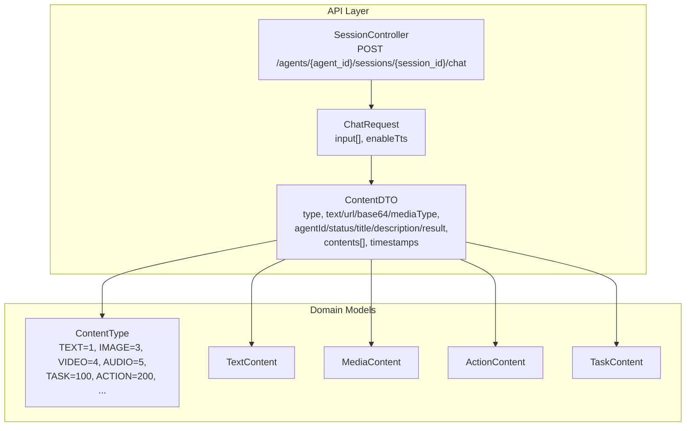
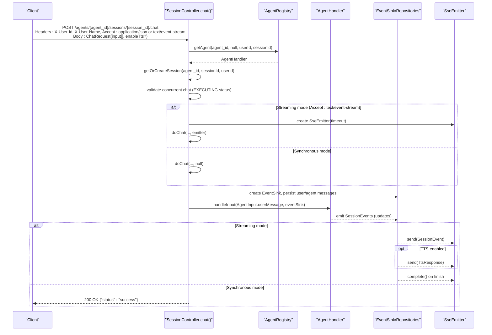
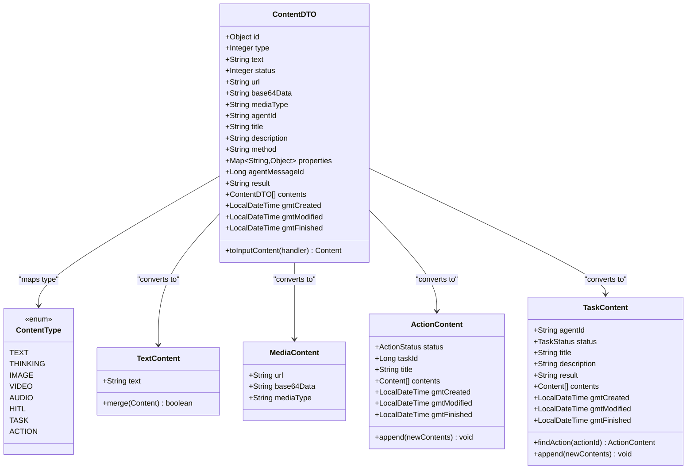
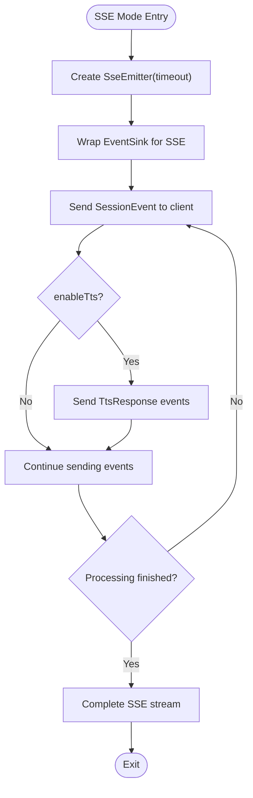
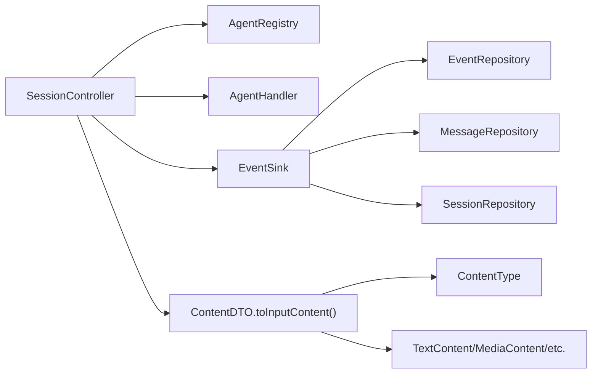

# Chat Endpoint

<cite>
**Referenced Files in This Document**
- [SessionController.java](file://backend_java/api/src/main/java/com/aliyun/tam/x/tron/api/SessionController.java)
- [ChatRequest.java](file://backend_java/api/src/main/java/com/aliyun/tam/x/tron/api/request/ChatRequest.java)
- [ContentDTO.java](file://backend_java/api/src/main/java/com/aliyun/tam/x/tron/api/dto/ContentDTO.java)
- [ContentType.java](file://backend_java/core/src/main/java/com/aliyun/tam/x/tron/core/domain/models/contents/ContentType.java)
- [TextContent.java](file://backend_java/core/src/main/java/com/aliyun/tam/x/tron/core/domain/models/contents/TextContent.java)
- [MediaContent.java](file://backend_java/core/src/main/java/com/aliyun/tam/x/tron/core/domain/models/contents/MediaContent.java)
- [ActionContent.java](file://backend_java/core/src/main/java/com/aliyun/tam/x/tron/core/domain/models/contents/ActionContent.java)
- [TaskContent.java](file://backend_java/core/src/main/java/com/aliyun/tam/x/tron/core/domain/models/contents/TaskContent.java)
- [SessionMessageDTO.java](file://backend_java/api/src/main/java/com/aliyun/tam/x/tron/api/dto/SessionMessageDTO.java)
- [AgentChatUsageDTO.java](file://backend_java/api/src/main/java/com/aliyun/tam/x/tron/api/dto/AgentChatUsageDTO.java)
</cite>

## Table of Contents
1. [Introduction](#introduction)
2. [Project Structure](#project-structure)
3. [Core Components](#core-components)
4. [Architecture Overview](#architecture-overview)
5. [Detailed Component Analysis](#detailed-component-analysis)
6. [Dependency Analysis](#dependency-analysis)
7. [Performance Considerations](#performance-considerations)
8. [Troubleshooting Guide](#troubleshooting-guide)
9. [Conclusion](#conclusion)
10. [Appendices](#appendices)

## Introduction
This document provides comprehensive API documentation for the chat endpoint POST /agents/{agent_id}/sessions/{session_id}/chat. It covers both synchronous and streaming response modes using Server-Sent Events (SSE), details the request body structure for multimodal input, explains authentication headers and their role in session context, and documents response formats and error handling. Practical examples demonstrate chat interactions, multimodal input handling, and client-side streaming event processing.

## Project Structure
The chat endpoint is implemented in the backend Java module. Key components involved in the chat flow include:
- REST controller for session operations
- Request DTO for chat requests
- DTOs for content and session messages
- Domain models for content types and content variants

**Diagram sources**
- [SessionController.java:308-346](file://backend_java/api/src/main/java/com/aliyun/tam/x/tron/api/SessionController.java#L308-L346)
- [ChatRequest.java:36-42](file://backend_java/api/src/main/java/com/aliyun/tam/x/tron/api/request/ChatRequest.java#L36-L42)
- [ContentDTO.java:133-165](file://backend_java/api/src/main/java/com/aliyun/tam/x/tron/api/dto/ContentDTO.java#L133-L165)
- [ContentType.java:26-34](file://backend_java/core/src/main/java/com/aliyun/tam/x/tron/core/domain/models/contents/ContentType.java#L26-L34)
- [TextContent.java:31-35](file://backend_java/core/src/main/java/com/aliyun/tam/x/tron/core/domain/models/contents/TextContent.java#L31-L35)
- [MediaContent.java:34-39](file://backend_java/core/src/main/java/com/aliyun/tam/x/tron/core/domain/models/contents/MediaContent.java#L34-L39)
- [ActionContent.java:39-52](file://backend_java/core/src/main/java/com/aliyun/tam/x/tron/core/domain/models/contents/ActionContent.java#L39-L52)
- [TaskContent.java:38-50](file://backend_java/core/src/main/java/com/aliyun/tam/x/tron/core/domain/models/contents/TaskContent.java#L38-L50)

**Section sources**
- [SessionController.java:308-346](file://backend_java/api/src/main/java/com/aliyun/tam/x/tron/api/SessionController.java#L308-L346)
- [ChatRequest.java:36-42](file://backend_java/api/src/main/java/com/aliyun/tam/x/tron/api/request/ChatRequest.java#L36-L42)
- [ContentDTO.java:133-165](file://backend_java/api/src/main/java/com/aliyun/tam/x/tron/api/dto/ContentDTO.java#L133-L165)
- [ContentType.java:26-34](file://backend_java/core/src/main/java/com/aliyun/tam/x/tron/core/domain/models/contents/ContentType.java#L26-L34)

## Core Components
- Endpoint: POST /agents/{agent_id}/sessions/{session_id}/chat
- Authentication headers:
  - X-User-Id (required): identifies the user context for the session
  - X-User-Name (optional): user-friendly name propagated into session messages
- Accept header:
  - application/json for synchronous mode
  - text/event-stream for SSE streaming mode
- Request body: ChatRequest
  - input: array of ContentDTO entries supporting multiple content types
  - enableTts: boolean flag controlling TTS event inclusion in streaming mode
- Response:
  - Synchronous: 200 OK with a simple success indicator
  - Streaming: 200 OK with Content-Type text/event-stream; events include session updates and optional TTS responses

Key behaviors:
- Session creation and validation: the endpoint ensures the session exists under the given user context or creates it implicitly.
- Concurrency guard: prevents initiating a new chat while an agent message is still executing.
- SSE streaming: wraps events via an EventSink and sends them as Server-Sent Events; supports TTS callbacks in streaming mode.

**Section sources**
- [SessionController.java:308-346](file://backend_java/api/src/main/java/com/aliyun/tam/x/tron/api/SessionController.java#L308-L346)
- [SessionController.java:324-330](file://backend_java/api/src/main/java/com/aliyun/tam/x/tron/api/SessionController.java#L324-L330)
- [SessionController.java:332-345](file://backend_java/api/src/main/java/com/aliyun/tam/x/tron/api/SessionController.java#L332-L345)
- [SessionController.java:537-553](file://backend_java/api/src/main/java/com/aliyun/tam/x/tron/api/SessionController.java#L537-L553)

## Architecture Overview
The chat endpoint orchestrates user input, session persistence, agent execution, and event streaming.

**Diagram sources**
- [SessionController.java:308-346](file://backend_java/api/src/main/java/com/aliyun/tam/x/tron/api/SessionController.java#L308-L346)
- [SessionController.java:348-409](file://backend_java/api/src/main/java/com/aliyun/tam/x/tron/api/SessionController.java#L348-L409)
- [SessionController.java:411-535](file://backend_java/api/src/main/java/com/aliyun/tam/x/tron/api/SessionController.java#L411-L535)

## Detailed Component Analysis

### Endpoint Definition and Behavior
- Path: POST /agents/{agent_id}/sessions/{session_id}/chat
- Headers:
  - X-User-Id: required; binds the request to a user and session
  - X-User-Name: optional; stored with the user message
  - Accept:
    - application/json for synchronous response
    - text/event-stream for streaming response
- Body: ChatRequest
  - input: array of ContentDTO
  - enableTts: boolean (default false); when true in streaming mode, includes TTS audio chunks
- Responses:
  - Synchronous: 200 OK with a success indicator
  - Streaming: 200 OK with text/event-stream; emits SessionEvent objects; completes when processing finishes

Concurrency and session state:
- Prevents starting a new chat if the last agent message is still EXECUTING
- Ensures session exists for the user; creates it if missing

**Section sources**
- [SessionController.java:308-346](file://backend_java/api/src/main/java/com/aliyun/tam/x/tron/api/SessionController.java#L308-L346)
- [SessionController.java:324-330](file://backend_java/api/src/main/java/com/aliyun/tam/x/tron/api/SessionController.java#L324-L330)
- [SessionController.java:537-553](file://backend_java/api/src/main/java/com/aliyun/tam/x/tron/api/SessionController.java#L537-L553)

### Request Body: ChatRequest
- Fields:
  - input: required array of ContentDTO
  - enableTts: optional boolean (default false)

**Section sources**
- [ChatRequest.java:36-42](file://backend_java/api/src/main/java/com/aliyun/tam/x/tron/api/request/ChatRequest.java#L36-L42)

### Content Types: ContentDTO and Domain Models
Supported input content types (ContentDTO.type mapped to ContentType):
- TEXT: text content
- IMAGE, VIDEO, AUDIO: media content with url, base64Data, mediaType
- TASK, ACTION: structured content for task/action workflows
- Additional internal types (e.g., THINKING, HITL) are supported internally

ContentDTO to domain conversion:
- Validates against AgentHandler.supportInputType
- Converts to TextContent, MediaContent, or other content variants

**Diagram sources**
- [ContentDTO.java:133-165](file://backend_java/api/src/main/java/com/aliyun/tam/x/tron/api/dto/ContentDTO.java#L133-L165)
- [ContentType.java:26-34](file://backend_java/core/src/main/java/com/aliyun/tam/x/tron/core/domain/models/contents/ContentType.java#L26-L34)
- [TextContent.java:31-35](file://backend_java/core/src/main/java/com/aliyun/tam/x/tron/core/domain/models/contents/TextContent.java#L31-L35)
- [MediaContent.java:34-39](file://backend_java/core/src/main/java/com/aliyun/tam/x/tron/core/domain/models/contents/MediaContent.java#L34-L39)
- [ActionContent.java:39-52](file://backend_java/core/src/main/java/com/aliyun/tam/x/tron/core/domain/models/contents/ActionContent.java#L39-L52)
- [TaskContent.java:38-50](file://backend_java/core/src/main/java/com/aliyun/tam/x/tron/core/domain/models/contents/TaskContent.java#L38-L50)

**Section sources**
- [ContentDTO.java:133-165](file://backend_java/api/src/main/java/com/aliyun/tam/x/tron/api/dto/ContentDTO.java#L133-L165)
- [ContentType.java:26-34](file://backend_java/core/src/main/java/com/aliyun/tam/x/tron/core/domain/models/contents/ContentType.java#L26-L34)
- [TextContent.java:31-35](file://backend_java/core/src/main/java/com/aliyun/tam/x/tron/core/domain/models/contents/TextContent.java#L31-L35)
- [MediaContent.java:34-39](file://backend_java/core/src/main/java/com/aliyun/tam/x/tron/core/domain/models/contents/MediaContent.java#L34-L39)
- [ActionContent.java:39-52](file://backend_java/core/src/main/java/com/aliyun/tam/x/tron/core/domain/models/contents/ActionContent.java#L39-L52)
- [TaskContent.java:38-50](file://backend_java/core/src/main/java/com/aliyun/tam/x/tron/core/domain/models/contents/TaskContent.java#L38-L50)

### Streaming Mode: Server-Sent Events (SSE)
Behavior:
- When Accept: text/event-stream is set, the endpoint returns a 200 OK with Content-Type text/event-stream
- Events are sent via SseEmitter as SessionEvent objects emitted by the agent
- If enableTts is true, TTS audio chunks are sent as TtsResponse events interleaved with regular SessionEvent objects
- Connection is completed when processing finishes

Connection management:
- Graceful handling of closed emitters and errors
- On emitter closure, the handler is cancelled to prevent orphaned work

**Diagram sources**
- [SessionController.java:332-345](file://backend_java/api/src/main/java/com/aliyun/tam/x/tron/api/SessionController.java#L332-L345)
- [SessionController.java:411-535](file://backend_java/api/src/main/java/com/aliyun/tam/x/tron/api/SessionController.java#L411-L535)

**Section sources**
- [SessionController.java:332-345](file://backend_java/api/src/main/java/com/aliyun/tam/x/tron/api/SessionController.java#L332-L345)
- [SessionController.java:411-535](file://backend_java/api/src/main/java/com/aliyun/tam/x/tron/api/SessionController.java#L411-L535)

### Response Formats
- Synchronous mode:
  - Status: 200 OK
  - Body: success indicator (string)
- Streaming mode:
  - Status: 200 OK
  - Headers: Content-Type: text/event-stream
  - Events:
    - SessionEvent objects representing agent progress and updates
    - Optional TtsResponse events when enableTts is true

Session message representation:
- SessionMessageDTO includes message metadata, contents array (ContentDTO), timestamps, and optional usage metrics

**Section sources**
- [SessionController.java:332-345](file://backend_java/api/src/main/java/com/aliyun/tam/x/tron/api/SessionController.java#L332-L345)
- [SessionMessageDTO.java:39-74](file://backend_java/api/src/main/java/com/aliyun/tam/x/tron/api/dto/SessionMessageDTO.java#L39-L74)
- [AgentChatUsageDTO.java:13-22](file://backend_java/api/src/main/java/com/aliyun/tam/x/tron/api/dto/AgentChatUsageDTO.java#L13-L22)

### Error Handling
- Validation and preconditions:
  - Agent not found: 404 Not Found
  - Concurrent chat operation (agent message EXECUTING): 400 Bad Request
  - Invalid or unsupported content types: 400 Bad Request
- Runtime exceptions:
  - Illegal argument exceptions: 400 Bad Request
  - SSE timeout: 408 Request Timeout
  - Other internal errors: 500 Internal Server Error

Connection management errors:
- Closed SSE emitter: logs warning, cancels handler, marks completion
- SSE send errors: attempts to completeWithError and suppresses secondary errors

**Section sources**
- [SessionController.java:116-130](file://backend_java/api/src/main/java/com/aliyun/tam/x/tron/api/SessionController.java#L116-L130)
- [SessionController.java:317-330](file://backend_java/api/src/main/java/com/aliyun/tam/x/tron/api/SessionController.java#L317-L330)
- [SessionController.java:426-436](file://backend_java/api/src/main/java/com/aliyun/tam/x/tron/api/SessionController.java#L426-L436)
- [SessionController.java:500-510](file://backend_java/api/src/main/java/com/aliyun/tam/x/tron/api/SessionController.java#L500-L510)

## Dependency Analysis
The chat endpoint depends on:
- Agent registry and handler for orchestration
- Repositories for session/message/event persistence
- Event sink wrapper for SSE and optional TTS integration
- Content conversion utilities mapping DTOs to domain models

**Diagram sources**
- [SessionController.java:317-318](file://backend_java/api/src/main/java/com/aliyun/tam/x/tron/api/SessionController.java#L317-L318)
- [SessionController.java:386-392](file://backend_java/api/src/main/java/com/aliyun/tam/x/tron/api/SessionController.java#L386-L392)
- [ContentDTO.java:133-165](file://backend_java/api/src/main/java/com/aliyun/tam/x/tron/api/dto/ContentDTO.java#L133-L165)
- [ContentType.java:26-34](file://backend_java/core/src/main/java/com/aliyun/tam/x/tron/core/domain/models/contents/ContentType.java#L26-L34)

**Section sources**
- [SessionController.java:317-318](file://backend_java/api/src/main/java/com/aliyun/tam/x/tron/api/SessionController.java#L317-L318)
- [SessionController.java:386-392](file://backend_java/api/src/main/java/com/aliyun/tam/x/tron/api/SessionController.java#L386-L392)
- [ContentDTO.java:133-165](file://backend_java/api/src/main/java/com/aliyun/tam/x/tron/api/dto/ContentDTO.java#L133-L165)

## Performance Considerations
- Concurrency control: prevents overlapping chat executions per session, reducing contention and resource conflicts.
- Threading: chat processing runs asynchronously on a dedicated thread pool to avoid blocking the HTTP thread.
- SSE timeouts: configurable emitter timeout to manage long-running streams efficiently.
- TTS overhead: enabling TTS adds extra processing and network overhead; use judiciously.

[No sources needed since this section provides general guidance]

## Troubleshooting Guide
Common issues and resolutions:
- 400 Bad Request: ensure input content types are supported and session is not mid-execution.
- 404 Not Found: verify agent_id and session_id correctness and user ownership via X-User-Id.
- 408 Request Timeout (SSE): increase client-side retry/backoff; check server-side timeout settings.
- Stream stops unexpectedly: confirm SSE emitter is not closed; inspect logs for emitter closure warnings.
- TTS errors in streaming: verify TTS service availability and credentials; check TtsResponse error payloads.

**Section sources**
- [SessionController.java:116-130](file://backend_java/api/src/main/java/com/aliyun/tam/x/tron/api/SessionController.java#L116-L130)
- [SessionController.java:426-436](file://backend_java/api/src/main/java/com/aliyun/tam/x/tron/api/SessionController.java#L426-L436)
- [SessionController.java:471-474](file://backend_java/api/src/main/java/com/aliyun/tam/x/tron/api/SessionController.java#L471-L474)

## Conclusion
The POST /agents/{agent_id}/sessions/{session_id}/chat endpoint supports both synchronous and streaming chat modes with robust multimodal input handling. Authentication via X-User-Id/X-User-Name ties requests to user sessions, while the Accept header controls response delivery. The implementation provides concurrency safeguards, efficient SSE streaming, and clear error signaling for reliable client integrations.

[No sources needed since this section summarizes without analyzing specific files]

## Appendices

### API Definition Summary
- Method: POST
- Path: /agents/{agent_id}/sessions/{session_id}/chat
- Headers:
  - X-User-Id: required
  - X-User-Name: optional
  - Accept: application/json or text/event-stream
- Body: ChatRequest
  - input: array of ContentDTO
  - enableTts: boolean (default false)
- Responses:
  - Synchronous: 200 OK with success indicator
  - Streaming: 200 OK with text/event-stream; events include SessionEvent and optional TtsResponse

**Section sources**
- [SessionController.java:308-346](file://backend_java/api/src/main/java/com/aliyun/tam/x/tron/api/SessionController.java#L308-L346)
- [ChatRequest.java:36-42](file://backend_java/api/src/main/java/com/aliyun/tam/x/tron/api/request/ChatRequest.java#L36-L42)

### Request Body: ContentDTO Reference
- Fields:
  - type: integer (ContentType value)
  - text: string (for TEXT)
  - url/base64Data/mediaType: string (for IMAGE/VIDEO/AUDIO)
  - agentId/status/title/description/result: strings (for TASK)
  - contents: array of nested ContentDTO (recursive)
  - timestamps: gmtCreated/gmtModified/gmtFinished
  - method/properties/result: additional fields for specialized content

Supported ContentType values:
- TEXT=1, THINKING=2, IMAGE=3, VIDEO=4, AUDIO=5, HITL=6, TASK=100, ACTION=200

**Section sources**
- [ContentDTO.java:96-131](file://backend_java/api/src/main/java/com/aliyun/tam/x/tron/api/dto/ContentDTO.java#L96-L131)
- [ContentType.java:26-34](file://backend_java/core/src/main/java/com/aliyun/tam/x/tron/core/domain/models/contents/ContentType.java#L26-L34)

### Practical Examples

- Synchronous chat request:
  - Method: POST
  - URL: /agents/{agent_id}/sessions/{session_id}/chat
  - Headers: X-User-Id: user123, Accept: application/json
  - Body:
    - input: [{ type: 1, text: "Hello" }, { type: 3, url: "https://example.com/image.jpg" }]
    - enableTts: false
  - Response: 200 OK with success indicator

- Streaming chat request with multimodal input:
  - Method: POST
  - URL: /agents/{agent_id}/sessions/{session_id}/chat
  - Headers: X-User-Id: user123, X-User-Name: Alex, Accept: text/event-stream
  - Body:
    - input: [{ type: 1, text: "Describe the image" }, { type: 3, base64Data: "...", mediaType: "image/jpeg" }]
    - enableTts: true
  - Streaming events:
    - SessionEvent updates
    - TtsResponse events with audio chunks

- Client-side streaming event processing:
  - Initialize an EventSource with the endpoint URL
  - Listen for message events; parse SessionEvent payloads
  - When enableTts is true, handle TtsResponse events to render audio

**Section sources**
- [SessionController.java:332-345](file://backend_java/api/src/main/java/com/aliyun/tam/x/tron/api/SessionController.java#L332-L345)
- [ContentDTO.java:133-165](file://backend_java/api/src/main/java/com/aliyun/tam/x/tron/api/dto/ContentDTO.java#L133-L165)