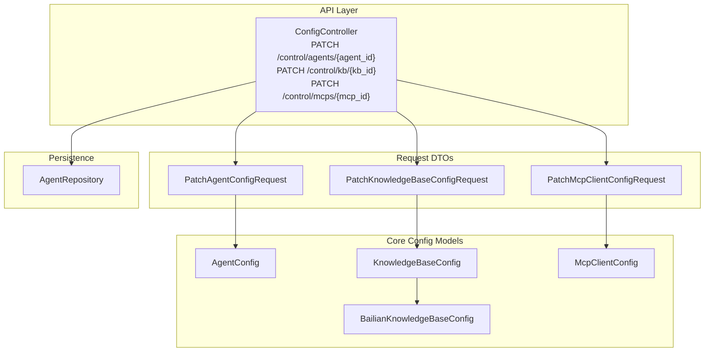
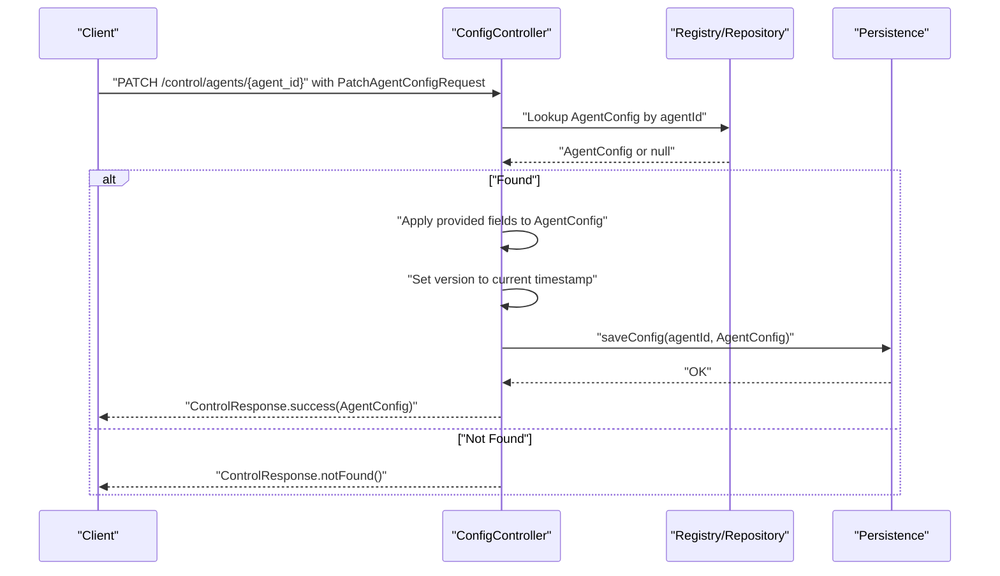
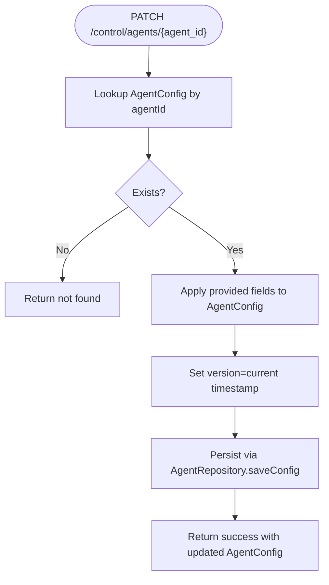
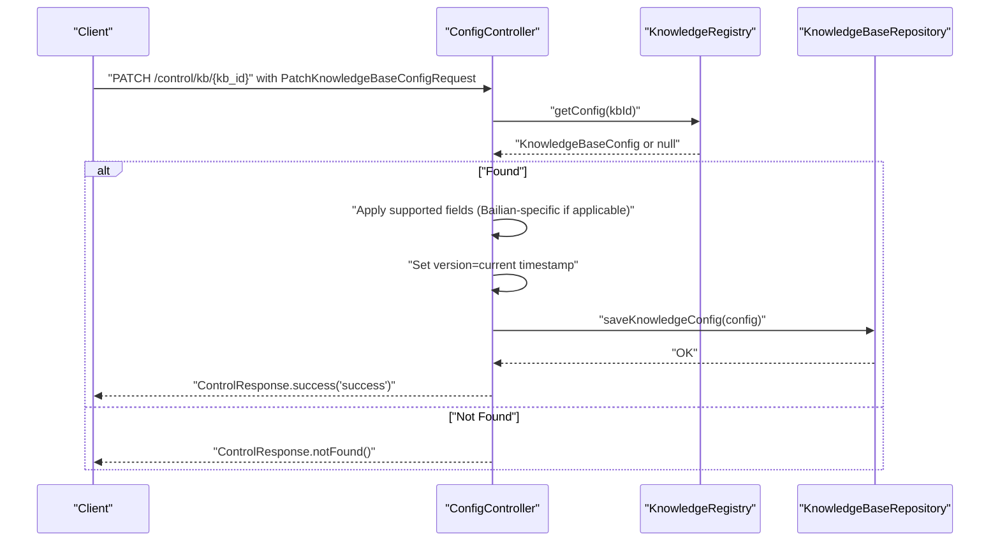
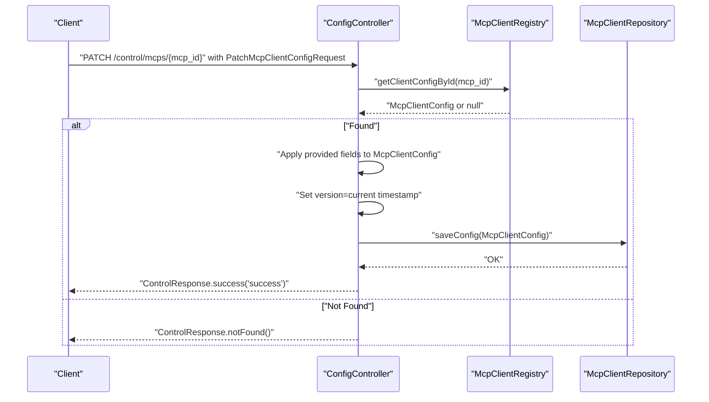
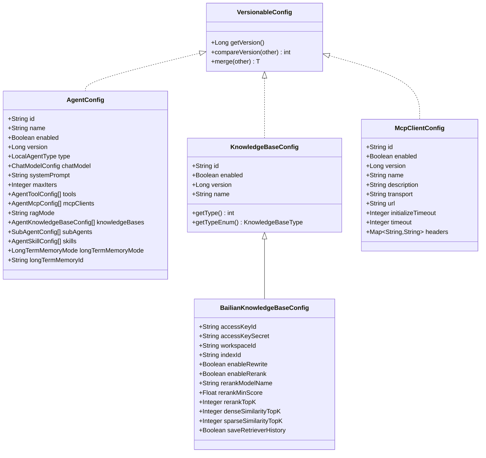
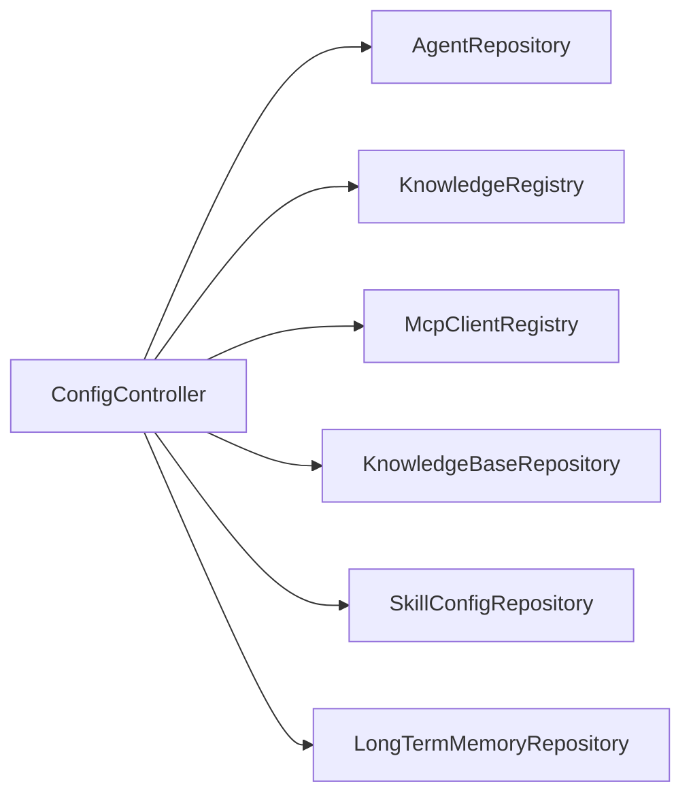

# Configuration Endpoints

<cite>
**Referenced Files in This Document**
- [ConfigController.java](file://backend_java/api/src/main/java/com/aliyun/tam/x/tron/api/ConfigController.java)
- [PatchAgentConfigRequest.java](file://backend_java/api/src/main/java/com/aliyun/tam/x/tron/api/request/PatchAgentConfigRequest.java)
- [PatchKnowledgeBaseConfigRequest.java](file://backend_java/api/src/main/java/com/aliyun/tam/x/tron/api/request/PatchKnowledgeBaseConfigRequest.java)
- [PatchMcpClientConfigRequest.java](file://backend_java/api/src/main/java/com/aliyun/tam/x/tron/api/request/PatchMcpClientConfigRequest.java)
- [AgentConfig.java](file://backend_java/core/src/main/java/com/aliyun/tam/x/tron/core/config/AgentConfig.java)
- [KnowledgeBaseConfig.java](file://backend_java/core/src/main/java/com/aliyun/tam/x/tron/core/config/KnowledgeBaseConfig.java)
- [BailianKnowledgeBaseConfig.java](file://backend_java/core/src/main/java/com/aliyun/tam/x/tron/core/config/BailianKnowledgeBaseConfig.java)
- [McpClientConfig.java](file://backend_java/core/src/main/java/com/aliyun/tam/x/tron/core/config/McpClientConfig.java)
- [VersionableConfig.java](file://backend_java/core/src/main/java/com/aliyun/tam/x/tron/core/config/VersionableConfig.java)
- [AgentRepository.java](file://backend_java/core/src/main/java/com/aliyun/tam/x/tron/core/domain/repository/AgentRepository.java)
- [application.yaml](file://backend_java/bootstrap/src/main/resources/application.yaml)
</cite>

## Table of Contents
1. [Introduction](#introduction)
2. [Project Structure](#project-structure)
3. [Core Components](#core-components)
4. [Architecture Overview](#architecture-overview)
5. [Detailed Component Analysis](#detailed-component-analysis)
6. [Dependency Analysis](#dependency-analysis)
7. [Performance Considerations](#performance-considerations)
8. [Troubleshooting Guide](#troubleshooting-guide)
9. [Conclusion](#conclusion)
10. [Appendices](#appendices)

## Introduction
This document provides comprehensive API documentation for configuration management endpoints focused on PATCH operations for agent configurations, knowledge base settings, and MCP client configurations. It explains request schemas, validation rules, allowed modifications, configuration inheritance and defaults, override mechanisms, real-time update impacts, and operational guidance including administrative access and auditing.

## Project Structure
The configuration management API is implemented in the backend Java module. Key areas:
- API layer: REST controller exposing PATCH endpoints under /api/control
- Request DTOs: Patch requests for agent, knowledge base, and MCP client configurations
- Core configuration models: AgentConfig, KnowledgeBaseConfig, and McpClientConfig
- Versioning and merging: VersionableConfig interface and merge behavior
- Repositories: Persistence contracts for saving configurations

**Diagram sources**
- [ConfigController.java:134-185](file://backend_java/api/src/main/java/com/aliyun/tam/x/tron/api/ConfigController.java#L134-L185)
- [ConfigController.java:297-329](file://backend_java/api/src/main/java/com/aliyun/tam/x/tron/api/ConfigController.java#L297-L329)
- [ConfigController.java:226-262](file://backend_java/api/src/main/java/com/aliyun/tam/x/tron/api/ConfigController.java#L226-L262)
- [PatchAgentConfigRequest.java:34-106](file://backend_java/api/src/main/java/com/aliyun/tam/x/tron/api/request/PatchAgentConfigRequest.java#L34-L106)
- [PatchKnowledgeBaseConfigRequest.java:30-66](file://backend_java/api/src/main/java/com/aliyun/tam/x/tron/api/request/PatchKnowledgeBaseConfigRequest.java#L30-L66)
- [PatchMcpClientConfigRequest.java:32-78](file://backend_java/api/src/main/java/com/aliyun/tam/x/tron/api/request/PatchMcpClientConfigRequest.java#L32-L78)
- [AgentConfig.java:39-132](file://backend_java/core/src/main/java/com/aliyun/tam/x/tron/core/config/AgentConfig.java#L39-L132)
- [KnowledgeBaseConfig.java:41-69](file://backend_java/core/src/main/java/com/aliyun/tam/x/tron/core/config/KnowledgeBaseConfig.java#L41-L69)
- [BailianKnowledgeBaseConfig.java:34-75](file://backend_java/core/src/main/java/com/aliyun/tam/x/tron/core/config/BailianKnowledgeBaseConfig.java#L34-L75)
- [McpClientConfig.java:35-93](file://backend_java/core/src/main/java/com/aliyun/tam/x/tron/core/config/McpClientConfig.java#L35-L93)
- [AgentRepository.java:22-27](file://backend_java/core/src/main/java/com/aliyun/tam/x/tron/core/domain/repository/AgentRepository.java#L22-L27)

**Section sources**
- [ConfigController.java:118-185](file://backend_java/api/src/main/java/com/aliyun/tam/x/tron/api/ConfigController.java#L118-L185)
- [application.yaml:1-63](file://backend_java/bootstrap/src/main/resources/application.yaml#L1-L63)

## Core Components
- ConfigController: Exposes PATCH endpoints for agent, knowledge base, and MCP client configurations. Handles exceptions and returns unified response envelopes.
- Patch requests: DTOs defining optional fields for partial updates.
- Configuration models: Strongly typed configuration objects with defaults and versioning.
- VersionableConfig: Provides version comparison and merge semantics for configurations.

Key behaviors:
- PATCH endpoints accept partial updates; only provided fields are modified.
- After a successful PATCH, the configuration version is bumped and persisted.
- Not-found responses are returned when a configuration does not exist.

**Section sources**
- [ConfigController.java:109-116](file://backend_java/api/src/main/java/com/aliyun/tam/x/tron/api/ConfigController.java#L109-L116)
- [ConfigController.java:134-185](file://backend_java/api/src/main/java/com/aliyun/tam/x/tron/api/ConfigController.java#L134-L185)
- [ConfigController.java:226-262](file://backend_java/api/src/main/java/com/aliyun/tam/x/tron/api/ConfigController.java#L226-L262)
- [ConfigController.java:297-329](file://backend_java/api/src/main/java/com/aliyun/tam/x/tron/api/ConfigController.java#L297-L329)
- [VersionableConfig.java:23-75](file://backend_java/core/src/main/java/com/aliyun/tam/x/tron/core/config/VersionableConfig.java#L23-L75)

## Architecture Overview
The configuration management flow follows a layered pattern:
- HTTP request enters ConfigController
- Controller validates existence and applies selective field updates
- Version is bumped and configuration is saved via repository
- Response envelope wraps success or error

**Diagram sources**
- [ConfigController.java:134-185](file://backend_java/api/src/main/java/com/aliyun/tam/x/tron/api/ConfigController.java#L134-L185)
- [AgentRepository.java:22-27](file://backend_java/core/src/main/java/com/aliyun/tam/x/tron/core/domain/repository/AgentRepository.java#L22-L27)

## Detailed Component Analysis

### Agent Configuration PATCH Endpoint
- Endpoint: PATCH /api/control/agents/{agent_id}
- Purpose: Partially update an agent’s configuration
- Allowed modifications (request fields):
  - name, enabled, type, chatModel, systemPrompt, maxIters
  - tools, mcpClients, ragMode, knowledgeBases, subAgents, skills
  - enableLongTermMemory, longTermMemoryMode, longTermMemoryId
- Validation and behavior:
  - If agentId does not exist, returns not found
  - Only provided fields are applied; others remain unchanged
  - Version is updated to current timestamp and persisted
- Defaults and inheritance:
  - AgentConfig defines defaults for maxIters, lists, modes, and flags
  - Inheritance occurs at runtime via registry resolution; PATCH updates take effect immediately for subsequent operations

**Diagram sources**
- [ConfigController.java:134-185](file://backend_java/api/src/main/java/com/aliyun/tam/x/tron/api/ConfigController.java#L134-L185)
- [AgentConfig.java:83-132](file://backend_java/core/src/main/java/com/aliyun/tam/x/tron/core/config/AgentConfig.java#L83-L132)
- [AgentRepository.java:26-27](file://backend_java/core/src/main/java/com/aliyun/tam/x/tron/core/domain/repository/AgentRepository.java#L26-L27)

**Section sources**
- [ConfigController.java:134-185](file://backend_java/api/src/main/java/com/aliyun/tam/x/tron/api/ConfigController.java#L134-L185)
- [PatchAgentConfigRequest.java:34-106](file://backend_java/api/src/main/java/com/aliyun/tam/x/tron/api/request/PatchAgentConfigRequest.java#L34-L106)
- [AgentConfig.java:83-132](file://backend_java/core/src/main/java/com/aliyun/tam/x/tron/core/config/AgentConfig.java#L83-L132)

### Knowledge Base Configuration PATCH Endpoint
- Endpoint: PATCH /api/control/kb/{kb_id}
- Purpose: Partially update a knowledge base configuration
- Allowed modifications (request fields):
  - id, enabled, name, workspaceId, indexId, enableRewrite, enableRerank
- Behavior:
  - If kbId does not exist, returns not found
  - For BailianKnowledgeBaseConfig, only supported fields are updated
  - Version is updated and persisted
- Defaults and inheritance:
  - KnowledgeBaseConfig has defaults for enabled and type resolution via JSON type info
  - Inheritance and runtime resolution handled by registry; PATCH updates apply immediately

**Diagram sources**
- [ConfigController.java:297-329](file://backend_java/api/src/main/java/com/aliyun/tam/x/tron/api/ConfigController.java#L297-L329)
- [KnowledgeBaseConfig.java:41-69](file://backend_java/core/src/main/java/com/aliyun/tam/x/tron/core/config/KnowledgeBaseConfig.java#L41-L69)
- [BailianKnowledgeBaseConfig.java:34-75](file://backend_java/core/src/main/java/com/aliyun/tam/x/tron/core/config/BailianKnowledgeBaseConfig.java#L34-L75)

**Section sources**
- [ConfigController.java:297-329](file://backend_java/api/src/main/java/com/aliyun/tam/x/tron/api/ConfigController.java#L297-L329)
- [PatchKnowledgeBaseConfigRequest.java:30-66](file://backend_java/api/src/main/java/com/aliyun/tam/x/tron/api/request/PatchKnowledgeBaseConfigRequest.java#L30-L66)
- [KnowledgeBaseConfig.java:41-69](file://backend_java/core/src/main/java/com/aliyun/tam/x/tron/core/config/KnowledgeBaseConfig.java#L41-L69)
- [BailianKnowledgeBaseConfig.java:34-75](file://backend_java/core/src/main/java/com/aliyun/tam/x/tron/core/config/BailianKnowledgeBaseConfig.java#L34-L75)

### MCP Client Configuration PATCH Endpoint
- Endpoint: PATCH /api/control/mcps/{mcp_id}
- Purpose: Partially update an MCP client configuration
- Allowed modifications (request fields):
  - id, enabled, name, description, transport, url, timeout, sseReadTimeout, headers
- Behavior:
  - If mcp_id does not exist, returns not found
  - Only provided fields are updated
  - Version is updated and persisted
- Defaults and inheritance:
  - McpClientConfig defines defaults for enabled, transport, timeouts, and encrypted headers
  - Inheritance and runtime resolution handled by registry; PATCH updates apply immediately

**Diagram sources**
- [ConfigController.java:226-262](file://backend_java/api/src/main/java/com/aliyun/tam/x/tron/api/ConfigController.java#L226-L262)
- [McpClientConfig.java:35-93](file://backend_java/core/src/main/java/com/aliyun/tam/x/tron/core/config/McpClientConfig.java#L35-L93)

**Section sources**
- [ConfigController.java:226-262](file://backend_java/api/src/main/java/com/aliyun/tam/x/tron/api/ConfigController.java#L226-L262)
- [PatchMcpClientConfigRequest.java:32-78](file://backend_java/api/src/main/java/com/aliyun/tam/x/tron/api/request/PatchMcpClientConfigRequest.java#L32-L78)
- [McpClientConfig.java:35-93](file://backend_java/core/src/main/java/com/aliyun/tam/x/tron/core/config/McpClientConfig.java#L35-L93)

### Configuration Models and Defaults
- AgentConfig
  - Defaults: maxIters, empty lists for tools/knowledgeBases/subAgents/skills, RAG mode, memory mode, input types, and feature flags
  - Versionable: supports version comparison and merge
- KnowledgeBaseConfig
  - Type polymorphism via JSON type info; defaults include enabled flag
  - BailianKnowledgeBaseConfig adds provider-specific fields and defaults for rewriting/reranking
- McpClientConfig
  - Defaults: enabled, transport, timeouts, and encrypted headers
  - Supports SSE and HTTP transports

**Diagram sources**
- [VersionableConfig.java:23-75](file://backend_java/core/src/main/java/com/aliyun/tam/x/tron/core/config/VersionableConfig.java#L23-L75)
- [AgentConfig.java:39-132](file://backend_java/core/src/main/java/com/aliyun/tam/x/tron/core/config/AgentConfig.java#L39-L132)
- [KnowledgeBaseConfig.java:41-69](file://backend_java/core/src/main/java/com/aliyun/tam/x/tron/core/config/KnowledgeBaseConfig.java#L41-L69)
- [BailianKnowledgeBaseConfig.java:34-75](file://backend_java/core/src/main/java/com/aliyun/tam/x/tron/core/config/BailianKnowledgeBaseConfig.java#L34-L75)
- [McpClientConfig.java:35-93](file://backend_java/core/src/main/java/com/aliyun/tam/x/tron/core/config/McpClientConfig.java#L35-L93)

**Section sources**
- [AgentConfig.java:83-132](file://backend_java/core/src/main/java/com/aliyun/tam/x/tron/core/config/AgentConfig.java#L83-L132)
- [KnowledgeBaseConfig.java:50-69](file://backend_java/core/src/main/java/com/aliyun/tam/x/tron/core/config/KnowledgeBaseConfig.java#L50-L69)
- [BailianKnowledgeBaseConfig.java:45-75](file://backend_java/core/src/main/java/com/aliyun/tam/x/tron/core/config/BailianKnowledgeBaseConfig.java#L45-L75)
- [McpClientConfig.java:68-93](file://backend_java/core/src/main/java/com/aliyun/tam/x/tron/core/config/McpClientConfig.java#L68-L93)

## Dependency Analysis
- Controller depends on registries and repositories to resolve and persist configurations.
- PATCH endpoints selectively mutate configuration objects and persist them.
- VersionableConfig enables deterministic merges and conflict resolution across concurrent updates.

**Diagram sources**
- [ConfigController.java:85-107](file://backend_java/api/src/main/java/com/aliyun/tam/x/tron/api/ConfigController.java#L85-L107)

**Section sources**
- [ConfigController.java:85-107](file://backend_java/api/src/main/java/com/aliyun/tam/x/tron/api/ConfigController.java#L85-L107)

## Performance Considerations
- Version bump and persistence occur per PATCH; batch updates should be minimized to reduce write overhead.
- Large configuration payloads (e.g., extensive tool or knowledge base lists) increase processing time; prefer incremental updates.
- Encryption of sensitive headers incurs CPU cost; avoid unnecessary re-encryption on unchanged values.

## Troubleshooting Guide
Common issues and resolutions:
- Not found errors:
  - Cause: agent/kb/mcp ID does not exist
  - Resolution: Verify IDs and ensure configurations are created before patching
- Validation errors:
  - Cause: Illegal argument exceptions propagated as BAD_REQUEST
  - Resolution: Review request payload against allowed fields and types
- Internal server errors:
  - Cause: Unexpected exceptions during processing
  - Resolution: Check server logs and retry after correcting the request

Operational guidance:
- Administrative access: Configure appropriate authentication/authorization for /api/control endpoints.
- Auditing: Track PATCH operations by monitoring logs and correlating with version timestamps.

**Section sources**
- [ConfigController.java:109-116](file://backend_java/api/src/main/java/com/aliyun/tam/x/tron/api/ConfigController.java#L109-L116)
- [ConfigController.java:134-185](file://backend_java/api/src/main/java/com/aliyun/tam/x/tron/api/ConfigController.java#L134-L185)
- [ConfigController.java:226-262](file://backend_java/api/src/main/java/com/aliyun/tam/x/tron/api/ConfigController.java#L226-L262)
- [ConfigController.java:297-329](file://backend_java/api/src/main/java/com/aliyun/tam/x/tron/api/ConfigController.java#L297-L329)

## Conclusion
The configuration management endpoints provide safe, incremental updates to agent, knowledge base, and MCP client configurations. They enforce partial updates, maintain versioning, and integrate with registries and repositories for immediate runtime effects. Administrators should validate requests, monitor logs, and leverage versioning for auditing and rollback.

## Appendices

### API Definitions

- PATCH /api/control/agents/{agent_id}
  - Path parameters:
    - agent_id: string, required
  - Request body: PatchAgentConfigRequest
  - Response: ControlResponse with AgentConfig on success
  - Notes: Only provided fields are updated; version is bumped

- PATCH /api/control/kb/{kb_id}
  - Path parameters:
    - kb_id: string, required
  - Request body: PatchKnowledgeBaseConfigRequest
  - Response: ControlResponse with success message on success
  - Notes: Only supported fields are updated; version is bumped

- PATCH /api/control/mcps/{mcp_id}
  - Path parameters:
    - mcp_id: string, required
  - Request body: PatchMcpClientConfigRequest
  - Response: ControlResponse with success message on success
  - Notes: Only provided fields are updated; version is bumped

**Section sources**
- [ConfigController.java:134-185](file://backend_java/api/src/main/java/com/aliyun/tam/x/tron/api/ConfigController.java#L134-L185)
- [ConfigController.java:226-262](file://backend_java/api/src/main/java/com/aliyun/tam/x/tron/api/ConfigController.java#L226-L262)
- [ConfigController.java:297-329](file://backend_java/api/src/main/java/com/aliyun/tam/x/tron/api/ConfigController.java#L297-L329)

### Request Schemas

- PatchAgentConfigRequest
  - Fields: name, enabled, type, chatModel, systemPrompt, maxIters, tools, mcpClients, ragMode, knowledgeBases, subAgents, skills, enableLongTermMemory, longTermMemoryMode, longTermMemoryId

- PatchKnowledgeBaseConfigRequest
  - Fields: id, enabled, name, workspaceId, indexId, enableRewrite, enableRerank

- PatchMcpClientConfigRequest
  - Fields: id, enabled, name, description, transport, url, timeout, sseReadTimeout, headers

**Section sources**
- [PatchAgentConfigRequest.java:34-106](file://backend_java/api/src/main/java/com/aliyun/tam/x/tron/api/request/PatchAgentConfigRequest.java#L34-L106)
- [PatchKnowledgeBaseConfigRequest.java:30-66](file://backend_java/api/src/main/java/com/aliyun/tam/x/tron/api/request/PatchKnowledgeBaseConfigRequest.java#L30-L66)
- [PatchMcpClientConfigRequest.java:32-78](file://backend_java/api/src/main/java/com/aliyun/tam/x/tron/api/request/PatchMcpClientConfigRequest.java#L32-L78)

### Configuration Inheritance, Defaults, and Overrides
- Defaults:
  - AgentConfig: maxIters, list defaults, RAG mode, memory mode, input types, and feature flags
  - KnowledgeBaseConfig: enabled default; type resolved via JSON type info
  - McpClientConfig: enabled, transport, timeouts, encrypted headers
- Override mechanism:
  - PATCH replaces provided fields; unspecified fields retain current values
  - Version bump ensures persistence and subsequent runtime application

**Section sources**
- [AgentConfig.java:83-132](file://backend_java/core/src/main/java/com/aliyun/tam/x/tron/core/config/AgentConfig.java#L83-L132)
- [KnowledgeBaseConfig.java:50-69](file://backend_java/core/src/main/java/com/aliyun/tam/x/tron/core/config/KnowledgeBaseConfig.java#L50-L69)
- [McpClientConfig.java:68-93](file://backend_java/core/src/main/java/com/aliyun/tam/x/tron/core/config/McpClientConfig.java#L68-L93)

### Real-time Updates and Rollback
- Real-time impact:
  - PATCH updates are persisted and reflected in subsequent operations via registries
- Rollback:
  - Use version timestamps to identify previous states; re-apply earlier configuration snapshots via PATCH if needed

**Section sources**
- [VersionableConfig.java:27-57](file://backend_java/core/src/main/java/com/aliyun/tam/x/tron/core/config/VersionableConfig.java#L27-L57)

### Administrative Access and Auditing
- Access requirements:
  - Protect /api/control endpoints with authentication and authorization policies
- Auditing:
  - Log PATCH requests/responses and correlate with version timestamps for compliance tracking

**Section sources**
- [application.yaml:1-63](file://backend_java/bootstrap/src/main/resources/application.yaml#L1-L63)