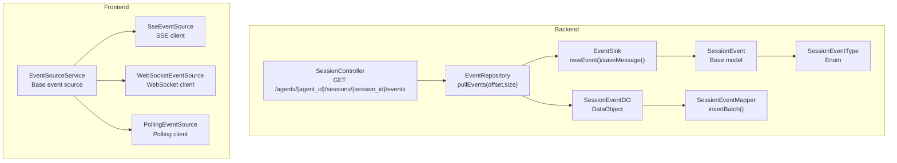
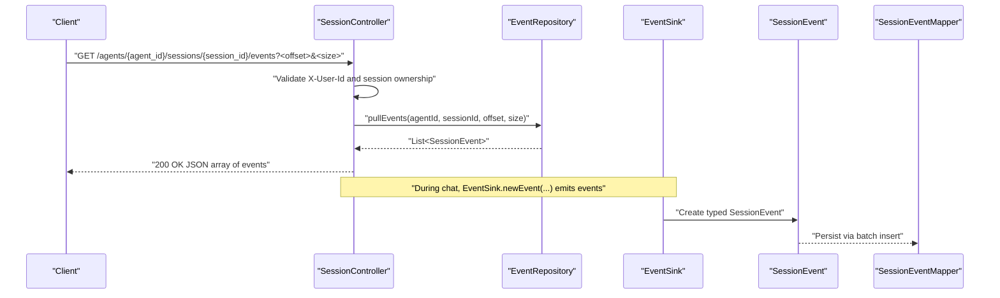
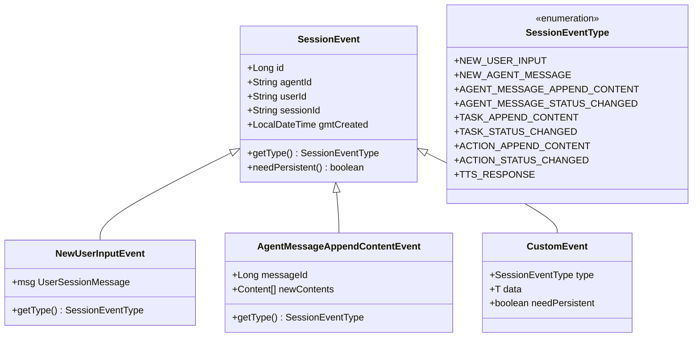
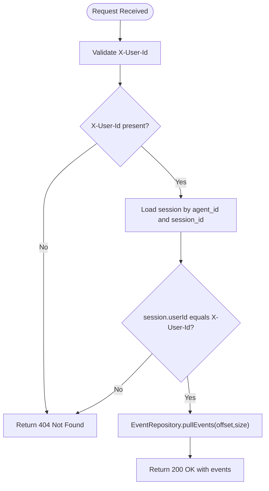
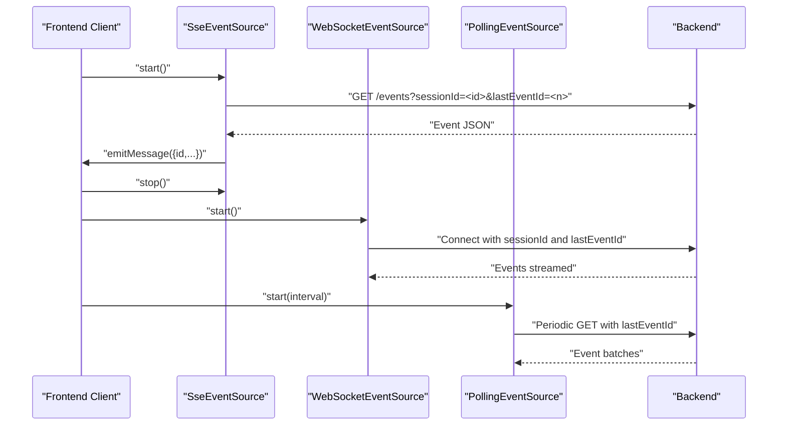
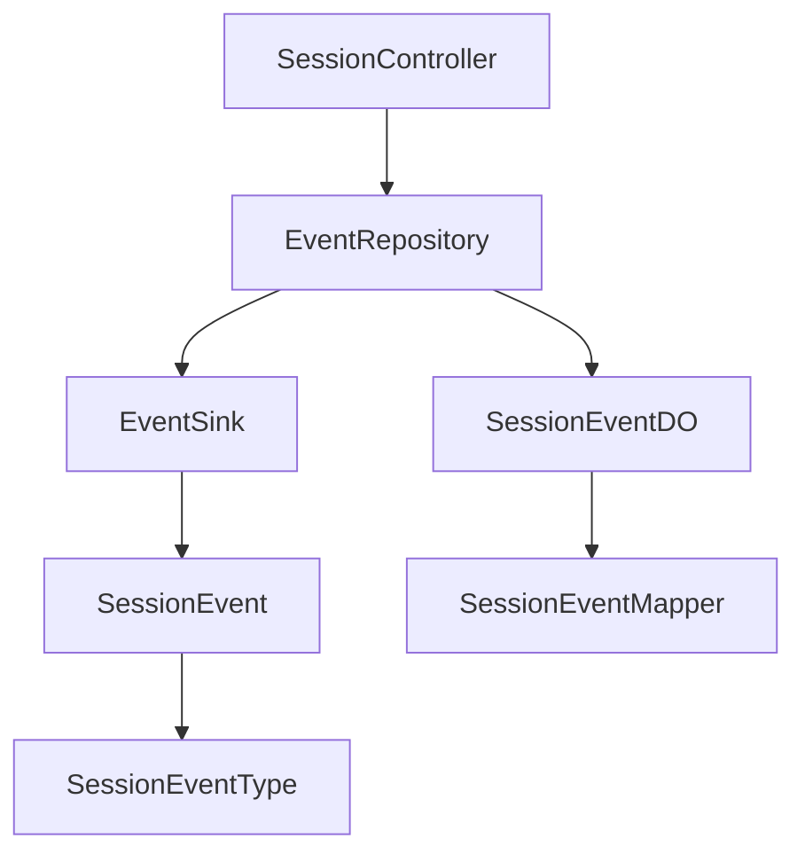

# Event Streaming Endpoints

<cite>
**Referenced Files in This Document**
- [SessionController.java](file://backend_java/api/src/main/java/com/aliyun/tam/x/tron/api/SessionController.java)
- [EventRepository.java](file://backend_java/core/src/main/java/com/aliyun/tam/x/tron/core/domain/repository/EventRepository.java)
- [SessionEvent.java](file://backend_java/core/src/main/java/com/aliyun/tam/x/tron/core/domain/models/events/SessionEvent.java)
- [SessionEventType.java](file://backend_java/core/src/main/java/com/aliyun/tam/x/tron/core/domain/models/events/SessionEventType.java)
- [NewUserInputEvent.java](file://backend_java/core/src/main/java/com/aliyun/tam/x/tron/core/domain/models/events/NewUserInputEvent.java)
- [AgentMessageAppendContentEvent.java](file://backend_java/core/src/main/java/com/aliyun/tam/x/tron/core/domain/models/events/AgentMessageAppendContentEvent.java)
- [CustomEvent.java](file://backend_java/core/src/main/java/com/aliyun/tam/x/tron/core/domain/models/events/CustomEvent.java)
- [EventSink.java](file://backend_java/core/src/main/java/com/aliyun/tam/x/tron/core/domain/models/events/EventSink.java)
- [SessionEventDO.java](file://backend_java/infra/src/main/java/com/aliyun/tam/x/tron/infra/dal/dataobject/SessionEventDO.java)
- [SessionEventMapper.java](file://backend_java/infra/src/main/java/com/aliyun/tam/x/tron/infra/dal/mapper/SessionEventMapper.java)
- [SseEventSource.ts](file://frontend/packages/chatbox/eventSource/SseEventSource.ts)
- [WebSocketEventSource.ts](file://frontend/packages/chatbox/eventSource/WebSocketEventSource.ts)
- [PollingEventSource.ts](file://frontend/packages/chatbox/eventSource/PollingEventSource.ts)
- [EventSource.ts](file://frontend/packages/chatbox/eventSource/EventSource.ts)
</cite>

## Table of Contents
1. [Introduction](#introduction)
2. [Project Structure](#project-structure)
3. [Core Components](#core-components)
4. [Architecture Overview](#architecture-overview)
5. [Detailed Component Analysis](#detailed-component-analysis)
6. [Dependency Analysis](#dependency-analysis)
7. [Performance Considerations](#performance-considerations)
8. [Troubleshooting Guide](#troubleshooting-guide)
9. [Conclusion](#conclusion)

## Introduction
This document provides comprehensive API documentation for the event streaming endpoints, focusing on retrieving session events with offset-based pagination. It explains the event stream structure, event types, timestamps, and payload data. It also covers session ownership filtering, authorization requirements, event consumption patterns, reconnection strategies, and event ID tracking for resuming streams. Practical examples demonstrate event subscription, client-side event processing, and handling of various session events during agent interactions. Finally, it documents error handling for stream interruptions and event retrieval failures.

## Project Structure
The event streaming feature spans backend and frontend components:
- Backend exposes a paginated endpoint to retrieve session events and manages event sinks for real-time updates.
- Frontend provides multiple event source implementations supporting SSE, WebSocket, and polling, with built-in reconnection and event ID tracking.

**Diagram sources**
- [SessionController.java:280-306](file://backend_java/api/src/main/java/com/aliyun/tam/x/tron/api/SessionController.java#L280-L306)
- [EventRepository.java:27-29](file://backend_java/core/src/main/java/com/aliyun/tam/x/tron/core/domain/repository/EventRepository.java#L27-L29)
- [EventSink.java:42-265](file://backend_java/core/src/main/java/com/aliyun/tam/x/tron/core/domain/models/events/EventSink.java#L42-L265)
- [SessionEvent.java:34-50](file://backend_java/core/src/main/java/com/aliyun/tam/x/tron/core/domain/models/events/SessionEvent.java#L34-L50)
- [SessionEventType.java:26-42](file://backend_java/core/src/main/java/com/aliyun/tam/x/tron/core/domain/models/events/SessionEventType.java#L26-L42)
- [SessionEventDO.java:30-91](file://backend_java/infra/src/main/java/com/aliyun/tam/x/tron/infra/dal/dataobject/SessionEventDO.java#L30-L91)
- [SessionEventMapper.java:31-41](file://backend_java/infra/src/main/java/com/aliyun/tam/x/tron/infra/dal/mapper/SessionEventMapper.java#L31-L41)
- [SseEventSource.ts:28-90](file://frontend/packages/chatbox/eventSource/SseEventSource.ts#L28-L90)
- [WebSocketEventSource.ts:29-100](file://frontend/packages/chatbox/eventSource/WebSocketEventSource.ts#L29-L100)
- [PollingEventSource.ts:30-45](file://frontend/packages/chatbox/eventSource/PollingEventSource.ts#L30-L45)
- [EventSource.ts:23-89](file://frontend/packages/chatbox/eventSource/EventSource.ts#L23-L89)

**Section sources**
- [SessionController.java:280-306](file://backend_java/api/src/main/java/com/aliyun/tam/x/tron/api/SessionController.java#L280-L306)
- [EventRepository.java:27-29](file://backend_java/core/src/main/java/com/aliyun/tam/x/tron/core/domain/repository/EventRepository.java#L27-L29)
- [EventSink.java:42-265](file://backend_java/core/src/main/java/com/aliyun/tam/x/tron/core/domain/models/events/EventSink.java#L42-L265)
- [SessionEvent.java:34-50](file://backend_java/core/src/main/java/com/aliyun/tam/x/tron/core/domain/models/events/SessionEvent.java#L34-L50)
- [SessionEventType.java:26-42](file://backend_java/core/src/main/java/com/aliyun/tam/x/tron/core/domain/models/events/SessionEventType.java#L26-L42)
- [SessionEventDO.java:30-91](file://backend_java/infra/src/main/java/com/aliyun/tam/x/tron/infra/dal/dataobject/SessionEventDO.java#L30-L91)
- [SessionEventMapper.java:31-41](file://backend_java/infra/src/main/java/com/aliyun/tam/x/tron/infra/dal/mapper/SessionEventMapper.java#L31-L41)
- [SseEventSource.ts:28-90](file://frontend/packages/chatbox/eventSource/SseEventSource.ts#L28-L90)
- [WebSocketEventSource.ts:29-100](file://frontend/packages/chatbox/eventSource/WebSocketEventSource.ts#L29-L100)
- [PollingEventSource.ts:30-45](file://frontend/packages/chatbox/eventSource/PollingEventSource.ts#L30-L45)
- [EventSource.ts:23-89](file://frontend/packages/chatbox/eventSource/EventSource.ts#L23-L89)

## Core Components
- Endpoint: GET /agents/{agent_id}/sessions/{session_id}/events
  - Path parameters: agent_id, session_id
  - Request headers: X-User-Id (required)
  - Query parameters: offset (default 0), size (default 10, min 1, max 100)
  - Authorization: Session ownership check against X-User-Id
  - Response: JSON array of session events
- Event model: SessionEvent (base) with fields id, agentId, userId, sessionId, gmtCreated, type, needPersistent
- Event types: Enumerated in SessionEventType with values for user input, agent message lifecycle, tasks, actions, and TTS responses
- Event sink: EventSink abstract class orchestrating event creation and persistence during agent interactions
- Persistence: SessionEventDO and SessionEventMapper support batch insertion of events

Key implementation references:
- Endpoint definition and authorization: [SessionController.java:280-306](file://backend_java/api/src/main/java/com/aliyun/tam/x/tron/api/SessionController.java#L280-L306)
- Event retrieval contract: [EventRepository.java:27-29](file://backend_java/core/src/main/java/com/aliyun/tam/x/tron/core/domain/repository/EventRepository.java#L27-L29)
- Event base model: [SessionEvent.java:34-50](file://backend_java/core/src/main/java/com/aliyun/tam/x/tron/core/domain/models/events/SessionEvent.java#L34-L50)
- Event types enumeration: [SessionEventType.java:26-42](file://backend_java/core/src/main/java/com/aliyun/tam/x/tron/core/domain/models/events/SessionEventType.java#L26-L42)
- Event sink operations: [EventSink.java:42-265](file://backend_java/core/src/main/java/com/aliyun/tam/x/tron/core/domain/models/events/EventSink.java#L42-L265)
- Event persistence model: [SessionEventDO.java:30-91](file://backend_java/infra/src/main/java/com/aliyun/tam/x/tron/infra/dal/dataobject/SessionEventDO.java#L30-L91)
- Batch insert mapper: [SessionEventMapper.java:31-41](file://backend_java/infra/src/main/java/com/aliyun/tam/x/tron/infra/dal/mapper/SessionEventMapper.java#L31-L41)

**Section sources**
- [SessionController.java:280-306](file://backend_java/api/src/main/java/com/aliyun/tam/x/tron/api/SessionController.java#L280-L306)
- [EventRepository.java:27-29](file://backend_java/core/src/main/java/com/aliyun/tam/x/tron/core/domain/repository/EventRepository.java#L27-L29)
- [SessionEvent.java:34-50](file://backend_java/core/src/main/java/com/aliyun/tam/x/tron/core/domain/models/events/SessionEvent.java#L34-L50)
- [SessionEventType.java:26-42](file://backend_java/core/src/main/java/com/aliyun/tam/x/tron/core/domain/models/events/SessionEventType.java#L26-L42)
- [EventSink.java:42-265](file://backend_java/core/src/main/java/com/aliyun/tam/x/tron/core/domain/models/events/EventSink.java#L42-L265)
- [SessionEventDO.java:30-91](file://backend_java/infra/src/main/java/com/aliyun/tam/x/tron/infra/dal/dataobject/SessionEventDO.java#L30-L91)
- [SessionEventMapper.java:31-41](file://backend_java/infra/src/main/java/com/aliyun/tam/x/tron/infra/dal/mapper/SessionEventMapper.java#L31-L41)

## Architecture Overview
The event streaming architecture integrates backend controllers, repositories, and models with frontend event sources. The backend validates ownership, retrieves paginated events, and supports real-time streaming via SSE. The frontend provides resilient clients with reconnection and event ID tracking.

**Diagram sources**
- [SessionController.java:280-306](file://backend_java/api/src/main/java/com/aliyun/tam/x/tron/api/SessionController.java#L280-L306)
- [EventRepository.java:27-29](file://backend_java/core/src/main/java/com/aliyun/tam/x/tron/core/domain/repository/EventRepository.java#L27-L29)
- [EventSink.java:42-265](file://backend_java/core/src/main/java/com/aliyun/tam/x/tron/core/domain/models/events/EventSink.java#L42-L265)
- [SessionEvent.java:34-50](file://backend_java/core/src/main/java/com/aliyun/tam/x/tron/core/domain/models/events/SessionEvent.java#L34-L50)
- [SessionEventMapper.java:31-41](file://backend_java/infra/src/main/java/com/aliyun/tam/x/tron/infra/dal/mapper/SessionEventMapper.java#L31-L41)

## Detailed Component Analysis

### API Definition: GET /agents/{agent_id}/sessions/{session_id}/events
- Purpose: Retrieve session events with offset-based pagination.
- Path parameters:
  - agent_id: Agent identifier
  - session_id: Session identifier
- Request headers:
  - X-User-Id: Required; used to verify session ownership
- Query parameters:
  - offset: Starting index for pagination (default 0)
  - size: Number of events to return (default 10, min 1, max 100)
- Authorization:
  - Validates that the session exists and belongs to the requesting user (X-User-Id)
- Response:
  - 200 OK with JSON array of events
  - 404 Not Found if agent or session does not exist or user is unauthorized
- Implementation highlights:
  - Ownership check ensures only the session owner can access events
  - Uses EventRepository.pullEvents for paginated retrieval

**Section sources**
- [SessionController.java:280-306](file://backend_java/api/src/main/java/com/aliyun/tam/x/tron/api/SessionController.java#L280-L306)
- [EventRepository.java:27-29](file://backend_java/core/src/main/java/com/aliyun/tam/x/tron/core/domain/repository/EventRepository.java#L27-L29)

### Event Stream Structure
- Base event model (SessionEvent):
  - Fields: id, agentId, userId, sessionId, gmtCreated, type, needPersistent
  - needPersistent defaults to true for persistence decisions
- Event types (SessionEventType):
  - NEW_USER_INPUT
  - NEW_AGENT_MESSAGE, AGENT_MESSAGE_APPEND_CONTENT, AGENT_MESSAGE_STATUS_CHANGED
  - TASK_APPEND_CONTENT, TASK_STATUS_CHANGED
  - ACTION_APPEND_CONTENT, ACTION_STATUS_CHANGED
  - TTS_RESPONSE
- Concrete event examples:
  - New user input: NewUserInputEvent with embedded UserSessionMessage
  - Agent message content append: AgentMessageAppendContentEvent with newContents list
  - Custom events: CustomEvent<T> with type, data, and needPersistent flag

**Diagram sources**
- [SessionEvent.java:34-50](file://backend_java/core/src/main/java/com/aliyun/tam/x/tron/core/domain/models/events/SessionEvent.java#L34-L50)
- [SessionEventType.java:26-42](file://backend_java/core/src/main/java/com/aliyun/tam/x/tron/core/domain/models/events/SessionEventType.java#L26-L42)
- [NewUserInputEvent.java:35-42](file://backend_java/core/src/main/java/com/aliyun/tam/x/tron/core/domain/models/events/NewUserInputEvent.java#L35-L42)
- [AgentMessageAppendContentEvent.java:38-48](file://backend_java/core/src/main/java/com/aliyun/tam/x/tron/core/domain/models/events/AgentMessageAppendContentEvent.java#L38-L48)
- [CustomEvent.java:28-43](file://backend_java/core/src/main/java/com/aliyun/tam/x/tron/core/domain/models/events/CustomEvent.java#L28-L43)

**Section sources**
- [SessionEvent.java:34-50](file://backend_java/core/src/main/java/com/aliyun/tam/x/tron/core/domain/models/events/SessionEvent.java#L34-L50)
- [SessionEventType.java:26-42](file://backend_java/core/src/main/java/com/aliyun/tam/x/tron/core/domain/models/events/SessionEventType.java#L26-L42)
- [NewUserInputEvent.java:35-42](file://backend_java/core/src/main/java/com/aliyun/tam/x/tron/core/domain/models/events/NewUserInputEvent.java#L35-L42)
- [AgentMessageAppendContentEvent.java:38-48](file://backend_java/core/src/main/java/com/aliyun/tam/x/tron/core/domain/models/events/AgentMessageAppendContentEvent.java#L38-L48)
- [CustomEvent.java:28-43](file://backend_java/core/src/main/java/com/aliyun/tam/x/tron/core/domain/models/events/CustomEvent.java#L28-L43)

### Event Filtering by Session Ownership and Authorization
- Ownership verification:
  - Endpoint checks session existence and compares session.userId with X-User-Id header
  - Unauthorized requests receive 404 Not Found
- Authorization requirements:
  - Requires X-User-Id header
  - Session must belong to the user making the request

**Diagram sources**
- [SessionController.java:280-306](file://backend_java/api/src/main/java/com/aliyun/tam/x/tron/api/SessionController.java#L280-L306)

**Section sources**
- [SessionController.java:280-306](file://backend_java/api/src/main/java/com/aliyun/tam/x/tron/api/SessionController.java#L280-L306)

### Event Consumption Patterns and Resuming Streams
- SSE consumption (frontend):
  - SseEventSource builds URLs with sessionId and lastEventId
  - Parses event.data as JSON and updates lastEventId upon receipt
  - Emits connection state and error events
- WebSocket consumption (frontend):
  - WebSocketEventSource constructs URL with sessionId and lastEventId
  - Tracks connection state and supports reconnect attempts with configurable intervals
- Polling consumption (frontend):
  - PollingEventSource periodically requests events using lastEventId
  - Emits received events and maintains connection state
- Event ID tracking:
  - lastEventId is updated after each event reception
  - Used to resume streams by passing lastEventId in subsequent requests

**Diagram sources**
- [SseEventSource.ts:36-90](file://frontend/packages/chatbox/eventSource/SseEventSource.ts#L36-L90)
- [WebSocketEventSource.ts:39-100](file://frontend/packages/chatbox/eventSource/WebSocketEventSource.ts#L39-L100)
- [PollingEventSource.ts:38-45](file://frontend/packages/chatbox/eventSource/PollingEventSource.ts#L38-L45)
- [EventSource.ts:23-89](file://frontend/packages/chatbox/eventSource/EventSource.ts#L23-L89)

**Section sources**
- [SseEventSource.ts:36-90](file://frontend/packages/chatbox/eventSource/SseEventSource.ts#L36-L90)
- [WebSocketEventSource.ts:39-100](file://frontend/packages/chatbox/eventSource/WebSocketEventSource.ts#L39-L100)
- [PollingEventSource.ts:38-45](file://frontend/packages/chatbox/eventSource/PollingEventSource.ts#L38-L45)
- [EventSource.ts:23-89](file://frontend/packages/chatbox/eventSource/EventSource.ts#L23-L89)

### Practical Examples

- Event subscription with SSE:
  - Build URL with sessionId and lastEventId
  - Subscribe to onmessage to process events
  - Track lastEventId and persist it for resuming later
  - Reference: [SseEventSource.ts:44-82](file://frontend/packages/chatbox/eventSource/SseEventSource.ts#L44-L82)

- Client-side event processing:
  - Parse event.data as JSON
  - Update UI based on event.type and payload
  - Update lastEventId after each event
  - Reference: [SseEventSource.ts:72-81](file://frontend/packages/chatbox/eventSource/SseEventSource.ts#L72-L81)

- Handling session events during agent interactions:
  - User input: NewUserInputEvent
  - Agent message lifecycle: NEW_AGENT_MESSAGE, AGENT_MESSAGE_APPEND_CONTENT, AGENT_MESSAGE_STATUS_CHANGED
  - Tasks and actions: TASK_APPEND_CONTENT, TASK_STATUS_CHANGED, ACTION_APPEND_CONTENT, ACTION_STATUS_CHANGED
  - TTS responses: TTS_RESPONSE
  - Reference: [SessionEventType.java:26-42](file://backend_java/core/src/main/java/com/aliyun/tam/x/tron/core/domain/models/events/SessionEventType.java#L26-L42)

- Resuming streams:
  - On reconnect, pass lastEventId in URL or request body depending on transport
  - SSE/WS: lastEventId in URL
  - Polling: lastEventId passed to request function
  - Reference: [WebSocketEventSource.ts:42-46](file://frontend/packages/chatbox/eventSource/WebSocketEventSource.ts#L42-L46), [PollingEventSource.ts:23-27](file://frontend/packages/chatbox/eventSource/PollingEventSource.ts#L23-L27)

**Section sources**
- [SseEventSource.ts:44-82](file://frontend/packages/chatbox/eventSource/SseEventSource.ts#L44-L82)
- [SessionEventType.java:26-42](file://backend_java/core/src/main/java/com/aliyun/tam/x/tron/core/domain/models/events/SessionEventType.java#L26-L42)
- [WebSocketEventSource.ts:42-46](file://frontend/packages/chatbox/eventSource/WebSocketEventSource.ts#L42-L46)
- [PollingEventSource.ts:23-27](file://frontend/packages/chatbox/eventSource/PollingEventSource.ts#L23-L27)

## Dependency Analysis
Backend dependencies among event-related components:
- SessionController depends on EventRepository for event retrieval
- EventRepository defines pullEvents and createEventSink
- EventSink creates typed events and persists them
- SessionEventDO and SessionEventMapper support persistence

**Diagram sources**
- [SessionController.java:84-93](file://backend_java/api/src/main/java/com/aliyun/tam/x/tron/api/SessionController.java#L84-L93)
- [EventRepository.java:27-29](file://backend_java/core/src/main/java/com/aliyun/tam/x/tron/core/domain/repository/EventRepository.java#L27-L29)
- [EventSink.java:42-265](file://backend_java/core/src/main/java/com/aliyun/tam/x/tron/core/domain/models/events/EventSink.java#L42-L265)
- [SessionEvent.java:34-50](file://backend_java/core/src/main/java/com/aliyun/tam/x/tron/core/domain/models/events/SessionEvent.java#L34-L50)
- [SessionEventType.java:26-42](file://backend_java/core/src/main/java/com/aliyun/tam/x/tron/core/domain/models/events/SessionEventType.java#L26-L42)
- [SessionEventDO.java:30-91](file://backend_java/infra/src/main/java/com/aliyun/tam/x/tron/infra/dal/dataobject/SessionEventDO.java#L30-L91)
- [SessionEventMapper.java:31-41](file://backend_java/infra/src/main/java/com/aliyun/tam/x/tron/infra/dal/mapper/SessionEventMapper.java#L31-L41)

**Section sources**
- [SessionController.java:84-93](file://backend_java/api/src/main/java/com/aliyun/tam/x/tron/api/SessionController.java#L84-L93)
- [EventRepository.java:27-29](file://backend_java/core/src/main/java/com/aliyun/tam/x/tron/core/domain/repository/EventRepository.java#L27-L29)
- [EventSink.java:42-265](file://backend_java/core/src/main/java/com/aliyun/tam/x/tron/core/domain/models/events/EventSink.java#L42-L265)
- [SessionEvent.java:34-50](file://backend_java/core/src/main/java/com/aliyun/tam/x/tron/core/domain/models/events/SessionEvent.java#L34-L50)
- [SessionEventType.java:26-42](file://backend_java/core/src/main/java/com/aliyun/tam/x/tron/core/domain/models/events/SessionEventType.java#L26-L42)
- [SessionEventDO.java:30-91](file://backend_java/infra/src/main/java/com/aliyun/tam/x/tron/infra/dal/dataobject/SessionEventDO.java#L30-L91)
- [SessionEventMapper.java:31-41](file://backend_java/infra/src/main/java/com/aliyun/tam/x/tron/infra/dal/mapper/SessionEventMapper.java#L31-L41)

## Performance Considerations
- Pagination limits: size parameter constrained to 1–100 to prevent oversized responses
- Offset-based pagination: efficient for random access but requires careful indexing on backend
- Event persistence: batch insert via SessionEventMapper reduces database overhead
- Real-time streaming: SSE/WS preferred over polling for latency and bandwidth efficiency
- Concurrency: thread pool executor used for chat operations; ensure adequate sizing for concurrent sessions

[No sources needed since this section provides general guidance]

## Troubleshooting Guide
- Stream interruptions:
  - SSE: SseEventSource handles onerror and disconnects gracefully; lastEventId can be used to resume
  - WebSocket: WebSocketEventSource tracks reconnect attempts and emits connection state changes
  - Polling: PollingEventSource continues polling until stopped; lastEventId ensures continuity
- Event retrieval failures:
  - 404 Not Found indicates missing agent/session or ownership mismatch
  - Backend exception handler returns structured error responses for invalid inputs and timeouts
- Client-side error handling:
  - Listen to onError callbacks and implement retry/backoff strategies
  - Persist lastEventId locally to resume after disconnections

**Section sources**
- [SseEventSource.ts:84-90](file://frontend/packages/chatbox/eventSource/SseEventSource.ts#L84-L90)
- [WebSocketEventSource.ts:59-71](file://frontend/packages/chatbox/eventSource/WebSocketEventSource.ts#L59-L71)
- [PollingEventSource.ts:38-45](file://frontend/packages/chatbox/eventSource/PollingEventSource.ts#L38-L45)
- [SessionController.java:116-130](file://backend_java/api/src/main/java/com/aliyun/tam/x/tron/api/SessionController.java#L116-L130)

## Conclusion
The event streaming endpoints provide a robust mechanism for retrieving session events with offset-based pagination and strong session ownership controls. The backend’s event model and sink abstraction enable diverse event types and real-time delivery, while the frontend offers resilient clients supporting SSE, WebSocket, and polling with automatic reconnection and event ID tracking for seamless resumption.