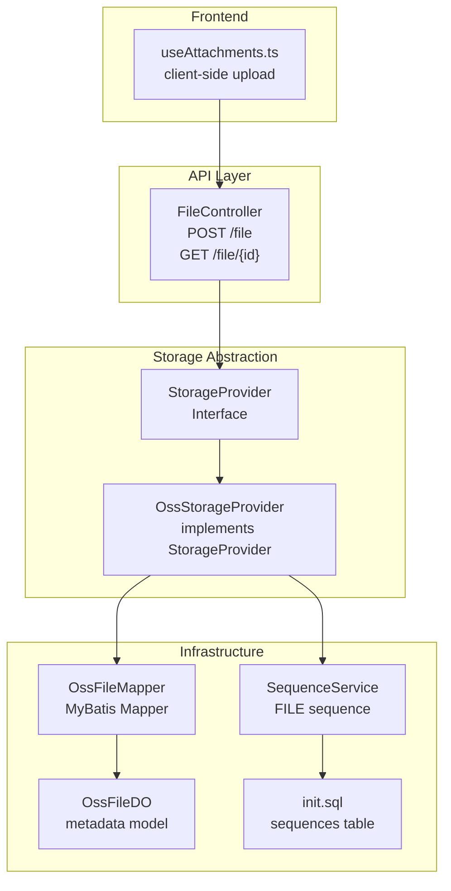
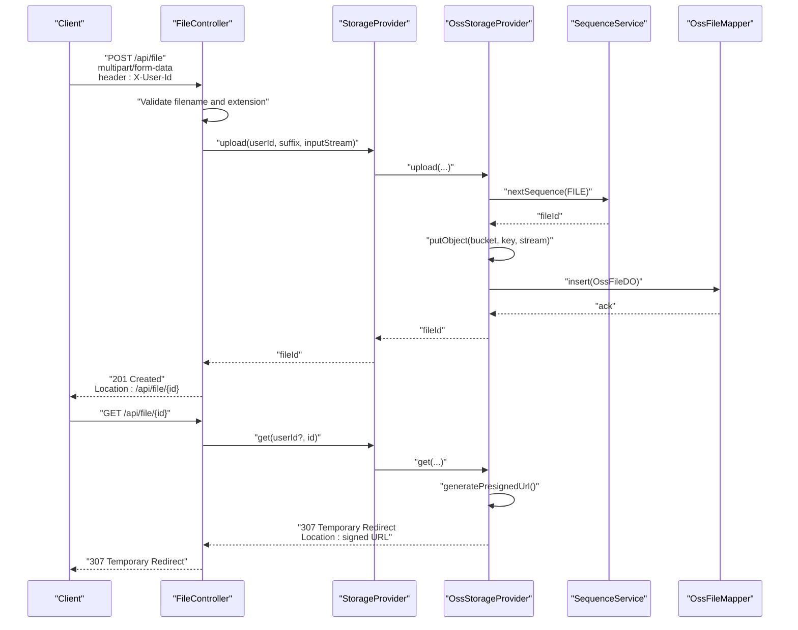
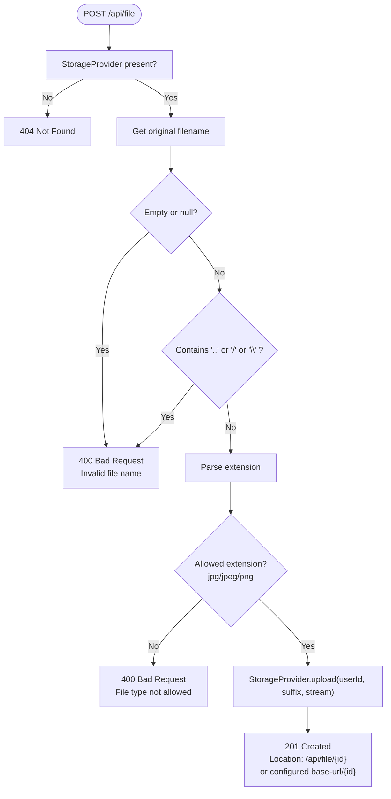
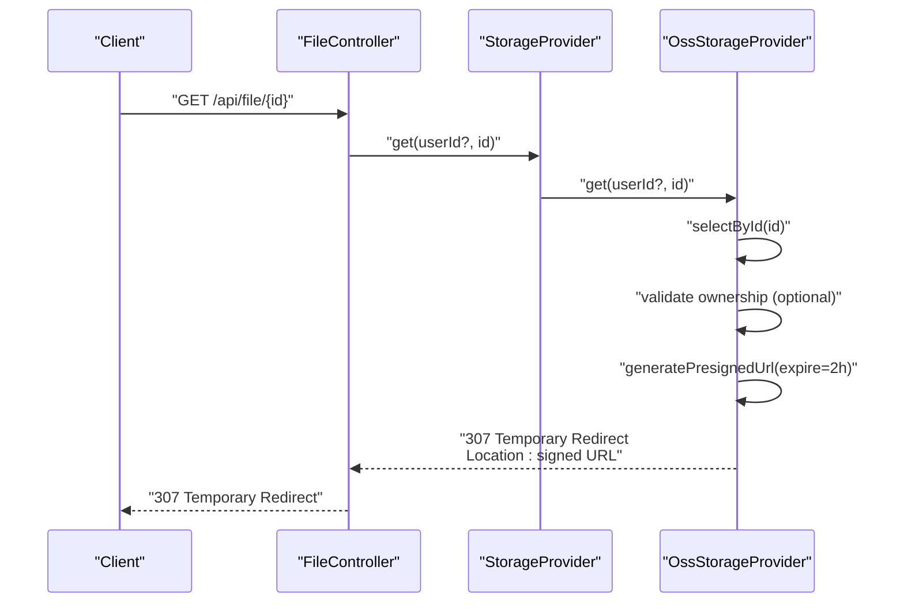
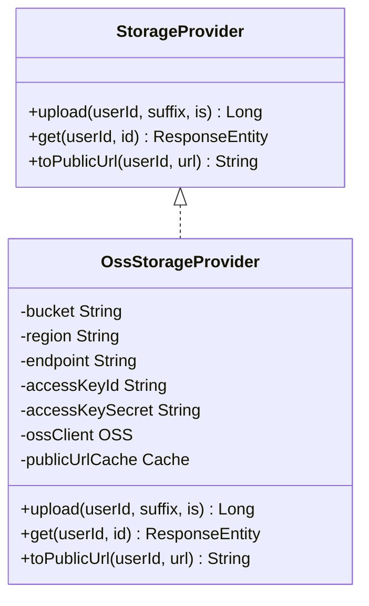
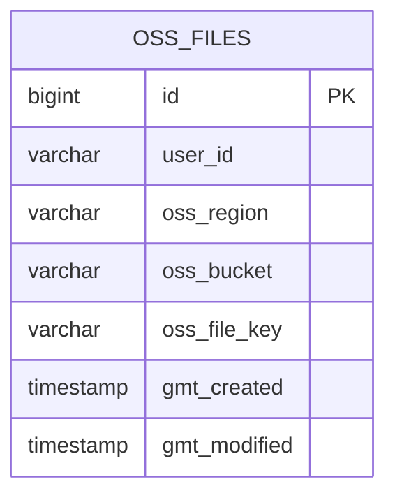
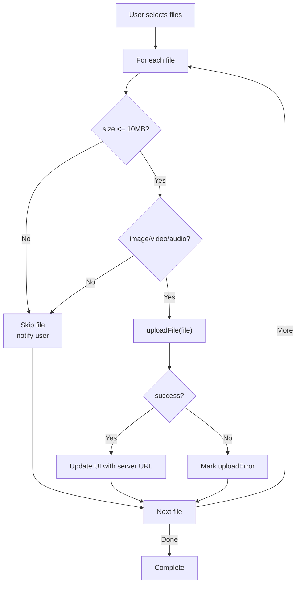
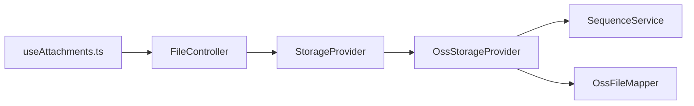

# File Upload Endpoints

<cite>
**Referenced Files in This Document**
- [FileController.java](file://backend_java/api/src/main/java/com/aliyun/tam/x/tron/api/FileController.java)
- [StorageProvider.java](file://backend_java/infra/src/main/java/com/aliyun/tam/x/tron/infra/storage/StorageProvider.java)
- [OssStorageProvider.java](file://backend_java/infra/src/main/java/com/aliyun/tam/x/tron/infra/storage/OssStorageProvider.java)
- [application.yaml](file://backend_java/bootstrap/src/main/resources/application.yaml)
- [SequenceService.java](file://backend_java/infra/src/main/java/com/aliyun/tam/x/tron/infra/sequence/SequenceService.java)
- [OssFileDO.java](file://backend_java/infra/src/main/java/com/aliyun/tam/x/tron/infra/dal/dataobject/OssFileDO.java)
- [OssFileMapper.java](file://backend_java/infra/src/main/java/com/aliyun/tam/x/tron/infra/dal/mapper/OssFileMapper.java)
- [init.sql](file://backend_java/bootstrap/src/main/resources/schema/init.sql)
- [useAttachments.ts](file://frontend/packages/chatbox/extends/ChatBox/MessageInput/hooks/useAttachments.ts)
</cite>

## Table of Contents
1. [Introduction](#introduction)
2. [Project Structure](#project-structure)
3. [Core Components](#core-components)
4. [Architecture Overview](#architecture-overview)
5. [Detailed Component Analysis](#detailed-component-analysis)
6. [Dependency Analysis](#dependency-analysis)
7. [Performance Considerations](#performance-considerations)
8. [Troubleshooting Guide](#troubleshooting-guide)
9. [Conclusion](#conclusion)
10. [Appendices](#appendices)

## Introduction
This document provides comprehensive API documentation for file upload and management endpoints. It covers supported file types, size limits, storage providers (with OSS integration), request formats for multipart file uploads, metadata handling, file naming conventions, retrieval endpoints, download URLs, access control mechanisms, lifecycle management, and security considerations. Practical examples demonstrate client-side upload implementation, progress tracking, and error handling.

## Project Structure
The file upload system spans the API layer, infrastructure storage abstraction, and frontend attachment handling:
- API layer exposes HTTP endpoints for upload and retrieval
- Storage provider abstraction enables pluggable storage backends
- OSS provider implements cloud storage with signed URLs
- Frontend hooks manage client-side selection, validation, and upload flow

**Diagram sources**
- [FileController.java:37-112](file://backend_java/api/src/main/java/com/aliyun/tam/x/tron/api/FileController.java#L37-L112)
- [StorageProvider.java:25-33](file://backend_java/infra/src/main/java/com/aliyun/tam/x/tron/infra/storage/StorageProvider.java#L25-L33)
- [OssStorageProvider.java:58-198](file://backend_java/infra/src/main/java/com/aliyun/tam/x/tron/infra/storage/OssStorageProvider.java#L58-L198)
- [SequenceService.java:40-177](file://backend_java/infra/src/main/java/com/aliyun/tam/x/tron/infra/sequence/SequenceService.java#L40-L177)
- [OssFileDO.java:30-76](file://backend_java/infra/src/main/java/com/aliyun/tam/x/tron/infra/dal/dataobject/OssFileDO.java#L30-L76)
- [OssFileMapper.java:24-30](file://backend_java/infra/src/main/java/com/aliyun/tam/x/tron/infra/dal/mapper/OssFileMapper.java#L24-L30)
- [init.sql:17-28](file://backend_java/bootstrap/src/main/resources/schema/init.sql#L17-L28)
- [useAttachments.ts:23-107](file://frontend/packages/chatbox/extends/ChatBox/MessageInput/hooks/useAttachments.ts#L23-L107)

**Section sources**
- [FileController.java:37-112](file://backend_java/api/src/main/java/com/aliyun/tam/x/tron/api/FileController.java#L37-L112)
- [application.yaml:18-21](file://backend_java/bootstrap/src/main/resources/application.yaml#L18-L21)
- [application.yaml:39-49](file://backend_java/bootstrap/src/main/resources/application.yaml#L39-L49)

## Core Components
- FileController: Exposes upload and retrieval endpoints, validates filenames, restricts file types, and delegates storage to StorageProvider.
- StorageProvider: Interface defining upload and retrieval operations.
- OssStorageProvider: Implements StorageProvider using Alibaba Cloud OSS, generates signed URLs, caches public URLs, and persists metadata.
- SequenceService: Generates monotonic file identifiers and formats them for storage keys.
- OssFileDO/OssFileMapper: Metadata persistence for uploaded files in OSS.
- Frontend useAttachments: Client-side file selection, size/type validation, and upload orchestration.

**Section sources**
- [FileController.java:51-111](file://backend_java/api/src/main/java/com/aliyun/tam/x/tron/api/FileController.java#L51-L111)
- [StorageProvider.java:25-33](file://backend_java/infra/src/main/java/com/aliyun/tam/x/tron/infra/storage/StorageProvider.java#L25-L33)
- [OssStorageProvider.java:90-134](file://backend_java/infra/src/main/java/com/aliyun/tam/x/tron/infra/storage/OssStorageProvider.java#L90-L134)
- [SequenceService.java:48-61](file://backend_java/infra/src/main/java/com/aliyun/tam/x/tron/infra/sequence/SequenceService.java#L48-L61)
- [OssFileDO.java:34-74](file://backend_java/infra/src/main/java/com/aliyun/tam/x/tron/infra/dal/dataobject/OssFileDO.java#L34-L74)
- [OssFileMapper.java:24-30](file://backend_java/infra/src/main/java/com/aliyun/tam/x/tron/infra/dal/mapper/OssFileMapper.java#L24-L30)
- [useAttachments.ts:23-107](file://frontend/packages/chatbox/extends/ChatBox/MessageInput/hooks/useAttachments.ts#L23-L107)

## Architecture Overview
The upload flow integrates HTTP request validation, storage provider invocation, and OSS-backed persistence with signed URL generation for retrieval.

**Diagram sources**
- [FileController.java:51-111](file://backend_java/api/src/main/java/com/aliyun/tam/x/tron/api/FileController.java#L51-L111)
- [StorageProvider.java:25-33](file://backend_java/infra/src/main/java/com/aliyun/tam/x/tron/infra/storage/StorageProvider.java#L25-L33)
- [OssStorageProvider.java:90-134](file://backend_java/infra/src/main/java/com/aliyun/tam/x/tron/infra/storage/OssStorageProvider.java#L90-L134)
- [SequenceService.java:130-132](file://backend_java/infra/src/main/java/com/aliyun/tam/x/tron/infra/sequence/SequenceService.java#L130-L132)
- [OssFileMapper.java:24-30](file://backend_java/infra/src/main/java/com/aliyun/tam/x/tron/infra/dal/mapper/OssFileMapper.java#L24-L30)

## Detailed Component Analysis

### Upload Endpoint
- Endpoint: POST /api/file
- Authentication: Requires header X-User-Id
- Request format: multipart/form-data with field name file
- Validation:
  - Rejects empty or invalid filenames
  - Prohibits path traversal and unsafe characters
  - Restricts allowed extensions to jpg, jpeg, png
- Storage:
  - Delegates to StorageProvider.upload(userId, suffix, inputStream)
  - Returns 201 Created with Location pointing to GET /api/file/{id}
- Base URL override:
  - If tron.file.server.base-url is configured, Location uses that base plus /{id}
  - Otherwise constructs absolute URL from request scheme/host/port/path

**Diagram sources**
- [FileController.java:51-100](file://backend_java/api/src/main/java/com/aliyun/tam/x/tron/api/FileController.java#L51-L100)

**Section sources**
- [FileController.java:51-100](file://backend_java/api/src/main/java/com/aliyun/tam/x/tron/api/FileController.java#L51-L100)
- [application.yaml:42-43](file://backend_java/bootstrap/src/main/resources/application.yaml#L42-L43)

### Retrieval Endpoint
- Endpoint: GET /api/file/{id}
- Access control:
  - If StorageProvider.get(userId?, id) is invoked with a non-null userId, provider checks ownership
  - Returns 403 Forbidden if caller does not own the file
- Retrieval behavior:
  - OssStorageProvider returns 307 Temporary Redirect to a pre-signed OSS URL
  - Signed URL expires in 2 hours and is cached per file ID for 60 minutes
  - On errors, returns 404 Not Found or 500 Internal Server Error

**Diagram sources**
- [FileController.java:102-111](file://backend_java/api/src/main/java/com/aliyun/tam/x/tron/api/FileController.java#L102-L111)
- [OssStorageProvider.java:111-134](file://backend_java/infra/src/main/java/com/aliyun/tam/x/tron/infra/storage/OssStorageProvider.java#L111-L134)

**Section sources**
- [FileController.java:102-111](file://backend_java/api/src/main/java/com/aliyun/tam/x/tron/api/FileController.java#L102-L111)
- [OssStorageProvider.java:111-134](file://backend_java/infra/src/main/java/com/aliyun/tam/x/tron/infra/storage/OssStorageProvider.java#L111-L134)

### Storage Provider Interface and OSS Implementation
- StorageProvider defines:
  - upload(userId, suffix, inputStream): returns file identifier
  - get(userId, id): returns ResponseEntity for retrieval
  - toPublicUrl(userId, url): default passthrough; OSS provider overrides
- OssStorageProvider:
  - Conditional activation via tron.file.provider.type=oss
  - Uses OSS SDK to upload object with key pattern tron/{userId}/{fileId}.{suffix}
  - Persists metadata via OssFileMapper
  - Generates pre-signed GET URLs with 2-hour expiration and caches them
  - Provides toPublicUrl conversion for internal file URLs and existing signed URLs

**Diagram sources**
- [StorageProvider.java:25-33](file://backend_java/infra/src/main/java/com/aliyun/tam/x/tron/infra/storage/StorageProvider.java#L25-L33)
- [OssStorageProvider.java:58-198](file://backend_java/infra/src/main/java/com/aliyun/tam/x/tron/infra/storage/OssStorageProvider.java#L58-L198)

**Section sources**
- [StorageProvider.java:25-33](file://backend_java/infra/src/main/java/com/aliyun/tam/x/tron/infra/storage/StorageProvider.java#L25-L33)
- [OssStorageProvider.java:58-198](file://backend_java/infra/src/main/java/com/aliyun/tam/x/tron/infra/storage/OssStorageProvider.java#L58-L198)

### File Naming Conventions and Metadata
- File naming:
  - OSS key format: tron/{userId}/{fileId}.{suffix}
  - fileId generated by SequenceService with FILE sequence
- Metadata persisted:
  - OssFileDO stores id, user_id, oss_region, oss_bucket, oss_file_key, timestamps
- Sequence allocation:
  - SequenceService manages named sequences and formats values for uniqueness and ordering

**Diagram sources**
- [OssFileDO.java:34-74](file://backend_java/infra/src/main/java/com/aliyun/tam/x/tron/infra/dal/dataobject/OssFileDO.java#L34-L74)
- [SequenceService.java:48-61](file://backend_java/infra/src/main/java/com/aliyun/tam/x/tron/infra/sequence/SequenceService.java#L48-L61)

**Section sources**
- [OssStorageProvider.java:90-109](file://backend_java/infra/src/main/java/com/aliyun/tam/x/tron/infra/storage/OssStorageProvider.java#L90-L109)
- [OssFileDO.java:34-74](file://backend_java/infra/src/main/java/com/aliyun/tam/x/tron/infra/dal/dataobject/OssFileDO.java#L34-L74)
- [SequenceService.java:104-132](file://backend_java/infra/src/main/java/com/aliyun/tam/x/tron/infra/sequence/SequenceService.java#L104-L132)
- [init.sql:17-28](file://backend_java/bootstrap/src/main/resources/schema/init.sql#L17-L28)

### Client-Side Upload Implementation
- Frontend hook useAttachments manages:
  - File selection and preview creation
  - Size limit enforcement (10 MB)
  - MIME-type filtering for image/video/audio
  - Concurrent uploads with per-file state tracking
  - Error handling and UI updates
- Typical flow:
  - Select files via hidden input
  - Validate size and type
  - Trigger immediate upload per file
  - Update UI with server URL on success or mark error on failure

**Diagram sources**
- [useAttachments.ts:33-107](file://frontend/packages/chatbox/extends/ChatBox/MessageInput/hooks/useAttachments.ts#L33-L107)

**Section sources**
- [useAttachments.ts:23-107](file://frontend/packages/chatbox/extends/ChatBox/MessageInput/hooks/useAttachments.ts#L23-L107)

## Dependency Analysis
- API depends on StorageProvider; StorageProvider is implemented by OssStorageProvider when tron.file.provider.type=oss
- OssStorageProvider depends on:
  - SequenceService for monotonic file IDs
  - OssFileMapper for metadata persistence
  - OSS client configured via tron.oss.* properties
- Frontend depends on FileController endpoints for upload and retrieval

**Diagram sources**
- [FileController.java:48-49](file://backend_java/api/src/main/java/com/aliyun/tam/x/tron/api/FileController.java#L48-L49)
- [OssStorageProvider.java:81-83](file://backend_java/infra/src/main/java/com/aliyun/tam/x/tron/infra/storage/OssStorageProvider.java#L81-L83)
- [SequenceService.java:89-90](file://backend_java/infra/src/main/java/com/aliyun/tam/x/tron/infra/sequence/SequenceService.java#L89-L90)
- [OssFileMapper.java:24-30](file://backend_java/infra/src/main/java/com/aliyun/tam/x/tron/infra/dal/mapper/OssFileMapper.java#L24-L30)
- [useAttachments.ts](file://frontend/packages/chatbox/extends/ChatBox/MessageInput/hooks/useAttachments.ts#L21)

**Section sources**
- [application.yaml:40-49](file://backend_java/bootstrap/src/main/resources/application.yaml#L40-L49)

## Performance Considerations
- Signed URL caching: OssStorageProvider caches pre-signed URLs for 60 minutes to reduce OSS API calls and latency.
- Pre-signed URL expiry: 2-hour expiry strikes a balance between usability and security.
- Sequence allocation: Batched allocation reduces database round-trips for file IDs.
- Frontend upload concurrency: Parallel uploads improve throughput; consider backpressure if needed.

[No sources needed since this section provides general guidance]

## Troubleshooting Guide
Common issues and resolutions:
- 404 Not Found on upload: Verify StorageProvider bean is present and tron.file.provider.type=oss is configured.
- 400 Bad Request on upload:
  - Invalid filename: Ensure filename is non-empty and does not contain "..", "/", or "\\"
  - Disallowed file type: Only jpg, jpeg, png are accepted
- 403 Forbidden on retrieval: Caller must own the file; ensure X-User-Id matches the file owner
- 500 Internal Server Error on retrieval: Check OSS credentials and bucket configuration
- Frontend upload failures:
  - Oversized files: Enforced at 10 MB; notify user and trim oversized items
  - Network errors: Retry logic should be implemented in uploadFile

**Section sources**
- [FileController.java:56-81](file://backend_java/api/src/main/java/com/aliyun/tam/x/tron/api/FileController.java#L56-L81)
- [OssStorageProvider.java:111-134](file://backend_java/infra/src/main/java/com/aliyun/tam/x/tron/infra/storage/OssStorageProvider.java#L111-L134)
- [useAttachments.ts:44-75](file://frontend/packages/chatbox/extends/ChatBox/MessageInput/hooks/useAttachments.ts#L44-L75)

## Conclusion
The file upload system provides a secure, scalable mechanism for storing and retrieving files via OSS. It enforces strict filename and type validation, supports configurable base URLs for download locations, and offers signed URLs for controlled access. The frontend integration demonstrates robust client-side validation and upload handling. Future enhancements could include configurable size limits, broader file type support, and explicit deletion endpoints.

[No sources needed since this section summarizes without analyzing specific files]

## Appendices

### API Definitions
- Upload
  - Method: POST
  - Path: /api/file
  - Headers:
    - X-User-Id: string (required)
    - Content-Type: multipart/form-data
  - Form Fields:
    - file: binary (required)
  - Responses:
    - 201 Created: Location: /api/file/{id}
    - 400 Bad Request: Invalid filename or disallowed type
    - 404 Not Found: StorageProvider not available
- Retrieve
  - Method: GET
  - Path: /api/file/{id}
  - Responses:
    - 307 Temporary Redirect: Location: pre-signed OSS URL
    - 403 Forbidden: Ownership check failed
    - 404 Not Found: File not found
    - 500 Internal Server Error: Provider error

**Section sources**
- [FileController.java:51-111](file://backend_java/api/src/main/java/com/aliyun/tam/x/tron/api/FileController.java#L51-L111)
- [OssStorageProvider.java:111-134](file://backend_java/infra/src/main/java/com/aliyun/tam/x/tron/infra/storage/OssStorageProvider.java#L111-L134)

### Configuration Reference
- tron.file.provider.type: oss (enables OSS provider)
- tron.file.server.base-url: optional base URL for Location header
- tron.oss.*: bucket, region, endpoint, access-key-id, access-key-secret
- spring.servlet.multipart.max-file-size/max-request-size: 10MB

**Section sources**
- [application.yaml:39-49](file://backend_java/bootstrap/src/main/resources/application.yaml#L39-L49)
- [application.yaml:19-21](file://backend_java/bootstrap/src/main/resources/application.yaml#L19-L21)