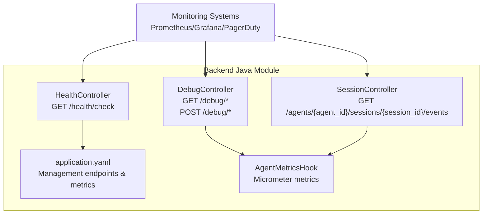
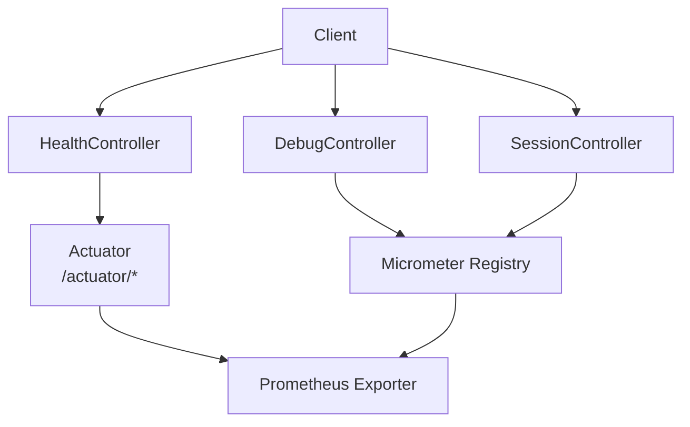
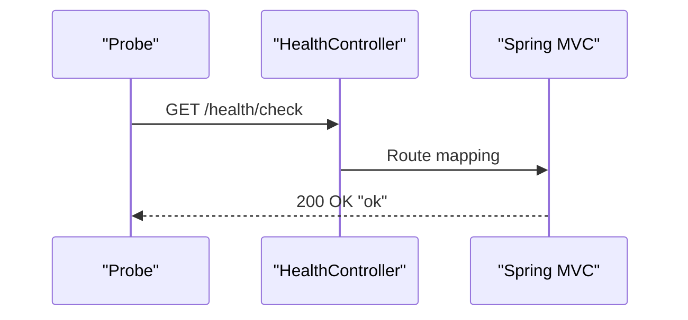
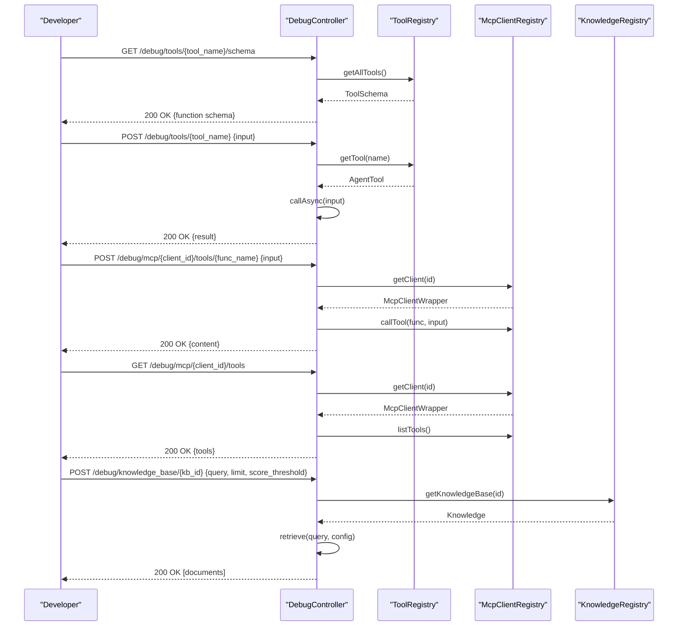
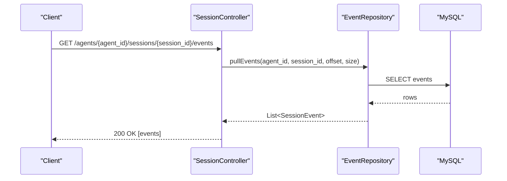
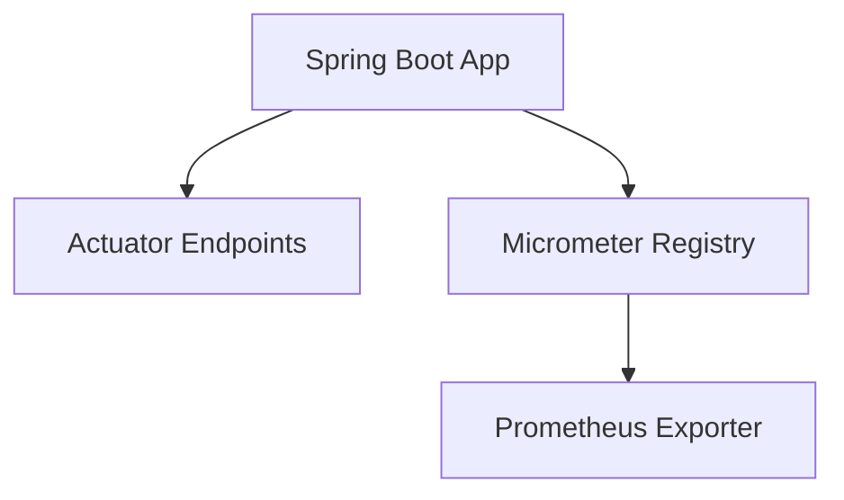
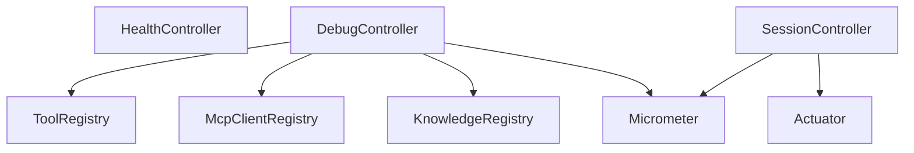

# Health and Monitoring Endpoints

<cite>
**Referenced Files in This Document**
- [HealthController.java](file://backend_java/api/src/main/java/com/aliyun/tam/x/tron/api/HealthController.java)
- [DebugController.java](file://backend_java/api/src/main/java/com/aliyun/tam/x/tron/api/DebugController.java)
- [application.yaml](file://backend_java/bootstrap/src/main/resources/application.yaml)
- [AgentMetricsHook.java](file://backend_java/core/src/main/java/com/aliyun/tam/x/tron/core/utils/AgentMetricsHook.java)
- [SessionController.java](file://backend_java/api/src/main/java/com/aliyun/tam/x/tron/api/SessionController.java)
- [develop_guide.md (en)](file://docs/en/develop_guide.md)
- [develop_guide.md (zh)](file://docs/zh/develop_guide.md)
- [README.MD](file://backend_java/README.MD)
</cite>

## Table of Contents
1. [Introduction](#introduction)
2. [Project Structure](#project-structure)
3. [Core Components](#core-components)
4. [Architecture Overview](#architecture-overview)
5. [Detailed Component Analysis](#detailed-component-analysis)
6. [Dependency Analysis](#dependency-analysis)
7. [Performance Considerations](#performance-considerations)
8. [Troubleshooting Guide](#troubleshooting-guide)
9. [Conclusion](#conclusion)
10. [Appendices](#appendices)

## Introduction
This document provides detailed API documentation for health check and debugging endpoints in the backend Java module. It covers:
- GET /health/check for system health monitoring and service availability checks
- Debug endpoints for development and troubleshooting, including agent state inspection, memory usage reporting, and performance metrics
- Health check criteria, response formats, and monitoring integration patterns
- Practical examples for health monitoring setup, alerting integration, and troubleshooting workflows
- Security considerations for debug endpoints and production deployment recommendations

## Project Structure
The health and monitoring endpoints reside in the backend Java module under the api package. The application exposes REST endpoints via Spring MVC, with management and metrics exposed via Spring Boot Actuator on a separate port.

**Diagram sources**
- [HealthController.java:25-32](file://backend_java/api/src/main/java/com/aliyun/tam/x/tron/api/HealthController.java#L25-L32)
- [DebugController.java:44-165](file://backend_java/api/src/main/java/com/aliyun/tam/x/tron/api/DebugController.java#L44-L165)
- [SessionController.java:280-306](file://backend_java/api/src/main/java/com/aliyun/tam/x/tron/api/SessionController.java#L280-L306)
- [application.yaml:53-63](file://backend_java/bootstrap/src/main/resources/application.yaml#L53-L63)
- [AgentMetricsHook.java:34-115](file://backend_java/core/src/main/java/com/aliyun/tam/x/tron/core/utils/AgentMetricsHook.java#L34-L115)

**Section sources**
- [HealthController.java:25-32](file://backend_java/api/src/main/java/com/aliyun/tam/x/tron/api/HealthController.java#L25-L32)
- [DebugController.java:44-165](file://backend_java/api/src/main/java/com/aliyun/tam/x/tron/api/DebugController.java#L44-L165)
- [SessionController.java:280-306](file://backend_java/api/src/main/java/com/aliyun/tam/x/tron/api/SessionController.java#L280-L306)
- [application.yaml:53-63](file://backend_java/bootstrap/src/main/resources/application.yaml#L53-L63)
- [AgentMetricsHook.java:34-115](file://backend_java/core/src/main/java/com/aliyun/tam/x/tron/core/utils/AgentMetricsHook.java#L34-L115)

## Core Components
- HealthController: Provides a lightweight health check endpoint returning a simple OK response.
- DebugController: Offers debugging endpoints for tools, MCP clients, and knowledge bases, enabling isolated testing and inspection.
- Management Endpoints: Expose health, metrics, and Prometheus scraping via Spring Boot Actuator.
- Metrics Hooks: Micrometer-based metrics for reasoning, acting, tool invocation, and model usage.

**Section sources**
- [HealthController.java:25-32](file://backend_java/api/src/main/java/com/aliyun/tam/x/tron/api/HealthController.java#L25-L32)
- [DebugController.java:44-165](file://backend_java/api/src/main/java/com/aliyun/tam/x/tron/api/DebugController.java#L44-L165)
- [application.yaml:53-63](file://backend_java/bootstrap/src/main/resources/application.yaml#L53-L63)
- [AgentMetricsHook.java:34-115](file://backend_java/core/src/main/java/com/aliyun/tam/x/tron/core/utils/AgentMetricsHook.java#L34-L115)

## Architecture Overview
The health and monitoring architecture integrates REST endpoints with management and metrics subsystems.

**Diagram sources**
- [HealthController.java:25-32](file://backend_java/api/src/main/java/com/aliyun/tam/x/tron/api/HealthController.java#L25-L32)
- [DebugController.java:44-165](file://backend_java/api/src/main/java/com/aliyun/tam/x/tron/api/DebugController.java#L44-L165)
- [SessionController.java:280-306](file://backend_java/api/src/main/java/com/aliyun/tam/x/tron/api/SessionController.java#L280-L306)
- [application.yaml:53-63](file://backend_java/bootstrap/src/main/resources/application.yaml#L53-L63)
- [AgentMetricsHook.java:34-115](file://backend_java/core/src/main/java/com/aliyun/tam/x/tron/core/utils/AgentMetricsHook.java#L34-L115)

## Detailed Component Analysis

### Health Check Endpoint
- Endpoint: GET /health/check
- Path: /health/check under the base path configured by the application
- Response: Plain text "ok" with HTTP 200 on success
- Purpose: Basic service availability check for load balancers, orchestrators, and health probes

**Diagram sources**
- [HealthController.java:25-32](file://backend_java/api/src/main/java/com/aliyun/tam/x/tron/api/HealthController.java#L25-L32)

**Section sources**
- [HealthController.java:25-32](file://backend_java/api/src/main/java/com/aliyun/tam/x/tron/api/HealthController.java#L25-L32)
- [application.yaml:1-6](file://backend_java/bootstrap/src/main/resources/application.yaml#L1-L6)

### Debug Endpoints
- Base Path: /api/debug
- Tools
  - GET /debug/tools/{tool_name}/schema: Returns the JSON schema of a registered tool
  - POST /debug/tools/{tool_name}: Executes a tool with a JSON payload and returns the result
- MCP Clients
  - POST /debug/mcp/{client_id}/tools/{func_name}: Calls an MCP tool function with a JSON payload
  - GET /debug/mcp/{client_id}/tools: Lists available MCP tools for a client
- Knowledge Base
  - POST /debug/knowledge_base/{knowledge_base_id}: Performs retrieval with optional query, limit, and score threshold

**Diagram sources**
- [DebugController.java:56-163](file://backend_java/api/src/main/java/com/aliyun/tam/x/tron/api/DebugController.java#L56-L163)

**Section sources**
- [DebugController.java:56-163](file://backend_java/api/src/main/java/com/aliyun/tam/x/tron/api/DebugController.java#L56-L163)

### Event Streaming for Diagnostics
- Endpoint: GET /agents/{agent_id}/sessions/{session_id}/events
- Purpose: Retrieve event stream for a session to inspect agent execution and event processing
- Use Cases:
  - Real-time diagnostics during development
  - Replay and audit of agent actions
  - Verifying tool and knowledge base interactions

**Diagram sources**
- [SessionController.java:280-306](file://backend_java/api/src/main/java/com/aliyun/tam/x/tron/api/SessionController.java#L280-L306)

**Section sources**
- [SessionController.java:280-306](file://backend_java/api/src/main/java/com/aliyun/tam/x/tron/api/SessionController.java#L280-L306)

### Metrics and Observability
- Management Endpoints:
  - /actuator/health: Application health status
  - /actuator/metrics: List of metric names
  - /actuator/prometheus: Metrics in Prometheus format
- Micrometer Metrics (extended):
  - one.agent.e2el, one.agent.ttft, one.agent.response.ttft
  - one.agent.times.reasoning, one.agent.times.acting, one.agent.times.summary, one.agent.times.error
  - one.agent.tool.time, one.agent.model.input, one.agent.model.output, one.agent.model.time

**Diagram sources**
- [application.yaml:53-63](file://backend_java/bootstrap/src/main/resources/application.yaml#L53-L63)
- [AgentMetricsHook.java:34-115](file://backend_java/core/src/main/java/com/aliyun/tam/x/tron/core/utils/AgentMetricsHook.java#L34-L115)

**Section sources**
- [application.yaml:53-63](file://backend_java/bootstrap/src/main/resources/application.yaml#L53-L63)
- [AgentMetricsHook.java:34-115](file://backend_java/core/src/main/java/com/aliyun/tam/x/tron/core/utils/AgentMetricsHook.java#L34-L115)
- [develop_guide.md (en):2600-2621](file://docs/en/develop_guide.md#L2600-L2621)
- [develop_guide.md (zh):2598-2626](file://docs/zh/develop_guide.md#L2598-L2626)

## Dependency Analysis
- HealthController depends on Spring MVC for routing and response building.
- DebugController depends on ToolRegistry, McpClientRegistry, KnowledgeRegistry, and Jackson for JSON processing.
- SessionController depends on repositories and event sinks for streaming diagnostics.
- Management endpoints depend on Spring Boot Actuator configuration.
- Metrics rely on Micrometer hooks attached to the Agent system.

**Diagram sources**
- [HealthController.java:25-32](file://backend_java/api/src/main/java/com/aliyun/tam/x/tron/api/HealthController.java#L25-L32)
- [DebugController.java:44-165](file://backend_java/api/src/main/java/com/aliyun/tam/x/tron/api/DebugController.java#L44-L165)
- [SessionController.java:280-306](file://backend_java/api/src/main/java/com/aliyun/tam/x/tron/api/SessionController.java#L280-L306)
- [application.yaml:53-63](file://backend_java/bootstrap/src/main/resources/application.yaml#L53-L63)
- [AgentMetricsHook.java:34-115](file://backend_java/core/src/main/java/com/aliyun/tam/x/tron/core/utils/AgentMetricsHook.java#L34-L115)

**Section sources**
- [HealthController.java:25-32](file://backend_java/api/src/main/java/com/aliyun/tam/x/tron/api/HealthController.java#L25-L32)
- [DebugController.java:44-165](file://backend_java/api/src/main/java/com/aliyun/tam/x/tron/api/DebugController.java#L44-L165)
- [SessionController.java:280-306](file://backend_java/api/src/main/java/com/aliyun/tam/x/tron/api/SessionController.java#L280-L306)
- [application.yaml:53-63](file://backend_java/bootstrap/src/main/resources/application.yaml#L53-L63)
- [AgentMetricsHook.java:34-115](file://backend_java/core/src/main/java/com/aliyun/tam/x/tron/core/utils/AgentMetricsHook.java#L34-L115)

## Performance Considerations
- Health check: Minimal CPU and memory footprint; suitable for frequent probing.
- Debug endpoints: Tool and MCP calls are synchronous blocking; avoid heavy computations in debug mode.
- Event streaming: SSE streaming can be resource-intensive; tune offsets and sizes appropriately.
- Metrics: Micrometer histograms and summaries are efficient; ensure label cardinality remains bounded.

[No sources needed since this section provides general guidance]

## Troubleshooting Guide
- Health probe failures:
  - Verify the base path and context path configuration.
  - Confirm the service is reachable on the configured port.
- Debug endpoint errors:
  - Tool not found: Ensure the tool is registered and named correctly.
  - MCP client not found: Verify client ID exists and is initialized.
  - Knowledge base not found: Confirm knowledge base ID is valid.
- Event stream anomalies:
  - Check offset and size parameters; ensure they align with session state.
  - Validate user ID header matches session ownership.
- Metrics not appearing:
  - Confirm Actuator exposure settings and Prometheus exporter connectivity.
  - Review metric names and labels for correctness.

**Section sources**
- [HealthController.java:25-32](file://backend_java/api/src/main/java/com/aliyun/tam/x/tron/api/HealthController.java#L25-L32)
- [DebugController.java:56-163](file://backend_java/api/src/main/java/com/aliyun/tam/x/tron/api/DebugController.java#L56-L163)
- [SessionController.java:280-306](file://backend_java/api/src/main/java/com/aliyun/tam/x/tron/api/SessionController.java#L280-L306)
- [application.yaml:53-63](file://backend_java/bootstrap/src/main/resources/application.yaml#L53-L63)
- [develop_guide.md (en):2600-2621](file://docs/en/develop_guide.md#L2600-L2621)

## Conclusion
The health and monitoring endpoints provide essential capabilities for runtime observability and development-time debugging. Health checks offer a simple availability signal, while debug endpoints enable targeted testing of tools, MCP clients, and knowledge bases. Combined with Actuator-managed metrics and Micrometer-based telemetry, operators can monitor service health, diagnose issues, and optimize performance effectively.

[No sources needed since this section summarizes without analyzing specific files]

## Appendices

### API Definitions and Examples

- Health Check
  - Method: GET
  - Path: /health/check
  - Response: 200 OK "ok"
  - Example curl:
    - curl http://<host>:<port>/health/check

- Debug Tool Schema
  - Method: GET
  - Path: /api/debug/tools/{tool_name}/schema
  - Response: 200 OK {function schema} or 404 Not Found
  - Example curl:
    - curl http://<host>:<port>/api/debug/tools/my_tool/schema

- Debug Tool Execution
  - Method: POST
  - Path: /api/debug/tools/{tool_name}
  - Body: JSON input parameters
  - Response: 200 OK {result} or 400 Bad Request
  - Example curl:
    - curl -X POST http://<host>:<port>/api/debug/tools/my_tool -H "Content-Type: application/json" -d '{}'

- Debug MCP Tool
  - Method: POST
  - Path: /api/debug/mcp/{client_id}/tools/{func_name}
  - Body: JSON input parameters
  - Response: 200 OK {content} or 404 Not Found
  - Example curl:
    - curl -X POST http://<host>:<port>/api/debug/mcp/client1/tools/search -H "Content-Type: application/json" -d '{}'

- List MCP Tools
  - Method: GET
  - Path: /api/debug/mcp/{client_id}/tools
  - Response: 200 OK {tools} or 404 Not Found
  - Example curl:
    - curl http://<host>:<port>/api/debug/mcp/client1/tools

- Debug Knowledge Base Retrieval
  - Method: POST
  - Path: /api/debug/knowledge_base/{knowledge_base_id}
  - Body: { query, limit?, score_threshold? }
  - Response: 200 OK [documents] or 400 Bad Request
  - Example curl:
    - curl -X POST http://<host>:<port>/api/debug/knowledge_base/kb1 -H "Content-Type: application/json" -d '{"query":"climate","limit":5,"score_threshold":0.2}'

- Event Stream for Diagnostics
  - Method: GET
  - Path: /api/agents/{agent_id}/sessions/{session_id}/events?offset=...&size=...
  - Response: 200 OK [events]
  - Example curl:
    - curl "http://<host>:<port>/api/agents/simple_agent/sessions/{session_id}/events?offset=0&size=10"

- Management and Metrics
  - Health: http://<host>:8091/actuator/health
  - Metrics Names: http://<host>:8091/actuator/metrics
  - Prometheus: http://<host>:8091/actuator/prometheus

**Section sources**
- [HealthController.java:25-32](file://backend_java/api/src/main/java/com/aliyun/tam/x/tron/api/HealthController.java#L25-L32)
- [DebugController.java:56-163](file://backend_java/api/src/main/java/com/aliyun/tam/x/tron/api/DebugController.java#L56-L163)
- [SessionController.java:280-306](file://backend_java/api/src/main/java/com/aliyun/tam/x/tron/api/SessionController.java#L280-L306)
- [application.yaml:53-63](file://backend_java/bootstrap/src/main/resources/application.yaml#L53-L63)
- [README.MD:720-751](file://backend_java/README.MD#L720-L751)

### Security and Production Recommendations
- Restrict access to debug endpoints (/api/debug/*) to trusted networks or require authentication/authorization.
- Disable or gate management endpoints (/actuator/*) in production; expose only necessary endpoints and protect with network policies or API gateways.
- Monitor and alert on error counters (e.g., one.agent.times.error) and latency histograms (e.g., one.agent.ttft).
- Use secure headers and HTTPS termination at the ingress level.
- Limit label cardinality for metrics to prevent high-cardinality series.

**Section sources**
- [develop_guide.md (en):2600-2621](file://docs/en/develop_guide.md#L2600-L2621)
- [develop_guide.md (zh):2598-2626](file://docs/zh/develop_guide.md#L2598-L2626)