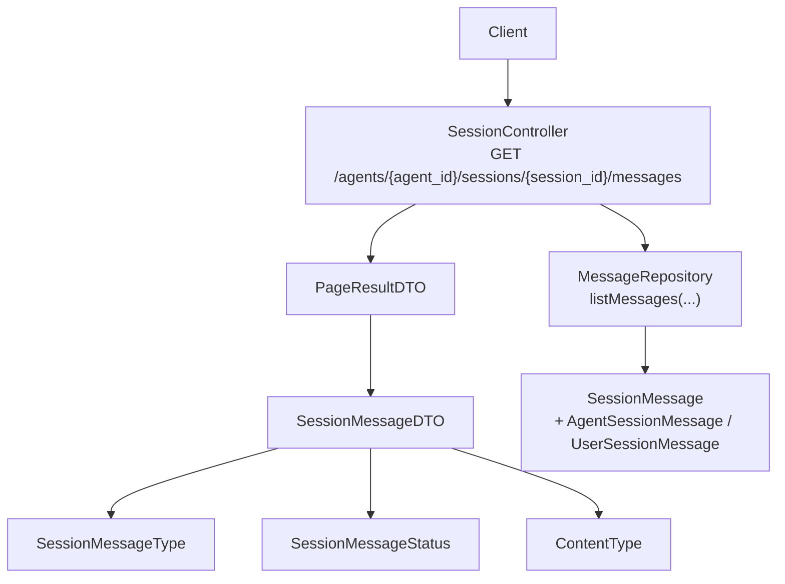
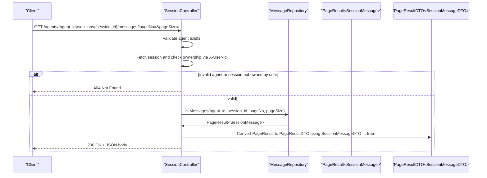
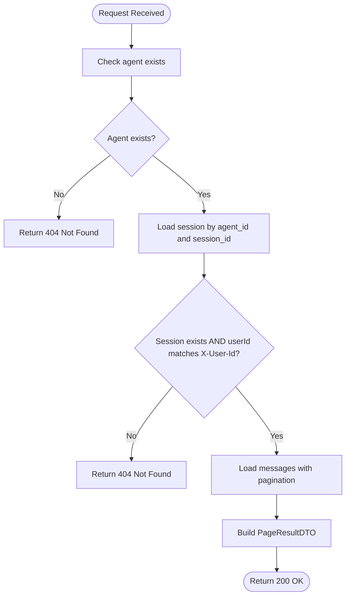
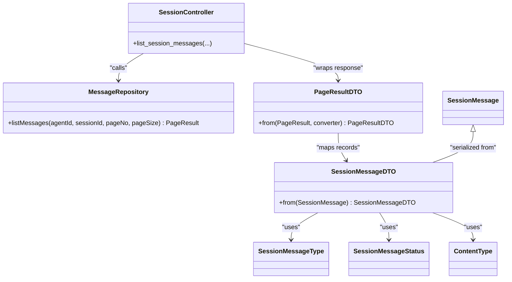

# Message History Endpoints

<cite>
**Referenced Files in This Document**
- [SessionController.java](file://backend_java/api/src/main/java/com/aliyun/tam/x/tron/api/SessionController.java)
- [PageResultDTO.java](file://backend_java/api/src/main/java/com/aliyun/tam/x/tron/api/dto/PageResultDTO.java)
- [SessionMessageDTO.java](file://backend_java/api/src/main/java/com/aliyun/tam/x/tron/api/dto/SessionMessageDTO.java)
- [ContentDTO.java](file://backend_java/api/src/main/java/com/aliyun/tam/x/tron/api/dto/ContentDTO.java)
- [MessageRepository.java](file://backend_java/core/src/main/java/com/aliyun/tam/x/tron/core/domain/repository/MessageRepository.java)
- [SessionMessage.java](file://backend_java/core/src/main/java/com/aliyun/tam/x/tron/core/domain/models/messages/SessionMessage.java)
- [SessionMessageType.java](file://backend_java/core/src/main/java/com/aliyun/tam/x/tron/core/domain/models/messages/SessionMessageType.java)
- [SessionMessageStatus.java](file://backend_java/core/src/main/java/com/aliyun/tam/x/tron/core/domain/models/messages/SessionMessageStatus.java)
- [ContentType.java](file://backend_java/core/src/main/java/com/aliyun/tam/x/tron/core/domain/models/contents/ContentType.java)
- [ActionStatus.java](file://backend_java/core/src/main/java/com/aliyun/tam/x/tron/core/domain/models/contents/ActionStatus.java)
</cite>

## Table of Contents
1. [Introduction](#introduction)
2. [Project Structure](#project-structure)
3. [Core Components](#core-components)
4. [Architecture Overview](#architecture-overview)
5. [Detailed Component Analysis](#detailed-component-analysis)
6. [Dependency Analysis](#dependency-analysis)
7. [Performance Considerations](#performance-considerations)
8. [Troubleshooting Guide](#troubleshooting-guide)
9. [Conclusion](#conclusion)

## Introduction
This document provides detailed API documentation for the message history endpoint that retrieves conversation message history for a given session. It covers the endpoint specification, request and response formats, pagination behavior, authorization and ownership validation, message types and content structures, timestamps and status indicators, and practical examples for client-side pagination. It also documents error scenarios such as invalid session IDs, unauthorized access attempts, and pagination parameter validation.

## Project Structure
The message history endpoint is implemented in the API layer and integrates with the core domain models and repositories. The key components involved are:
- REST controller exposing the endpoint
- DTOs for paginated results and message representation
- Domain models for messages, message types, statuses, and content types
- Repository interface for querying messages

**Diagram sources**
- [SessionController.java:249-278](file://backend_java/api/src/main/java/com/aliyun/tam/x/tron/api/SessionController.java#L249-L278)
- [MessageRepository.java](file://backend_java/core/src/main/java/com/aliyun/tam/x/tron/core/domain/repository/MessageRepository.java#L31)
- [PageResultDTO.java:34-75](file://backend_java/api/src/main/java/com/aliyun/tam/x/tron/api/dto/PageResultDTO.java#L34-L75)
- [SessionMessageDTO.java:34-101](file://backend_java/api/src/main/java/com/aliyun/tam/x/tron/api/dto/SessionMessageDTO.java#L34-L101)
- [SessionMessage.java:30-60](file://backend_java/core/src/main/java/com/aliyun/tam/x/tron/core/domain/models/messages/SessionMessage.java#L30-L60)
- [SessionMessageType.java:23-50](file://backend_java/core/src/main/java/com/aliyun/tam/x/tron/core/domain/models/messages/SessionMessageType.java#L23-L50)
- [SessionMessageStatus.java:23-53](file://backend_java/core/src/main/java/com/aliyun/tam/x/tron/core/domain/models/messages/SessionMessageStatus.java#L23-L53)
- [ContentType.java:23-56](file://backend_java/core/src/main/java/com/aliyun/tam/x/tron/core/domain/models/contents/ContentType.java#L23-L56)

**Section sources**
- [SessionController.java:249-278](file://backend_java/api/src/main/java/com/aliyun/tam/x/tron/api/SessionController.java#L249-L278)
- [MessageRepository.java](file://backend_java/core/src/main/java/com/aliyun/tam/x/tron/core/domain/repository/MessageRepository.java#L31)
- [PageResultDTO.java:34-75](file://backend_java/api/src/main/java/com/aliyun/tam/x/tron/api/dto/PageResultDTO.java#L34-L75)
- [SessionMessageDTO.java:34-101](file://backend_java/api/src/main/java/com/aliyun/tam/x/tron/api/dto/SessionMessageDTO.java#L34-L101)
- [SessionMessage.java:30-60](file://backend_java/core/src/main/java/com/aliyun/tam/x/tron/core/domain/models/messages/SessionMessage.java#L30-L60)
- [SessionMessageType.java:23-50](file://backend_java/core/src/main/java/com/aliyun/tam/x/tron/core/domain/models/messages/SessionMessageType.java#L23-L50)
- [SessionMessageStatus.java:23-53](file://backend_java/core/src/main/java/com/aliyun/tam/x/tron/core/domain/models/messages/SessionMessageStatus.java#L23-L53)
- [ContentType.java:23-56](file://backend_java/core/src/main/java/com/aliyun/tam/x/tron/core/domain/models/contents/ContentType.java#L23-L56)

## Core Components
- Endpoint: GET /agents/{agent_id}/sessions/{session_id}/messages
- Purpose: Retrieve paginated message history for a session owned by the authenticated user
- Authentication and Authorization:
  - Requires X-User-Id header
  - Validates that the session belongs to the user identified by X-User-Id
- Pagination:
  - pageNo: integer, minimum 1, default 1
  - pageSize: integer, minimum 1, maximum 1000, default 10
- Response: PageResultDTO wrapper containing records (List of SessionMessageDTO) and pagination metadata

Key validations and behaviors:
- Returns 404 Not Found if agent does not exist
- Returns 404 Not Found if session does not exist or user is not the session owner
- Returns 200 OK with PageResultDTO on success

**Section sources**
- [SessionController.java:249-278](file://backend_java/api/src/main/java/com/aliyun/tam/x/tron/api/SessionController.java#L249-L278)
- [PageResultDTO.java:34-75](file://backend_java/api/src/main/java/com/aliyun/tam/x/tron/api/dto/PageResultDTO.java#L34-L75)

## Architecture Overview
The endpoint follows a layered architecture:
- Presentation layer: SessionController handles HTTP requests and responses
- Application/service layer: Delegates to repositories for data access
- Domain layer: Uses SessionMessage and related enums for type and status
- DTO layer: Converts domain objects to API-friendly structures

**Diagram sources**
- [SessionController.java:249-278](file://backend_java/api/src/main/java/com/aliyun/tam/x/tron/api/SessionController.java#L249-L278)
- [MessageRepository.java](file://backend_java/core/src/main/java/com/aliyun/tam/x/tron/core/domain/repository/MessageRepository.java#L31)
- [PageResultDTO.java:34-48](file://backend_java/api/src/main/java/com/aliyun/tam/x/tron/api/dto/PageResultDTO.java#L34-L48)
- [SessionMessageDTO.java:34-74](file://backend_java/api/src/main/java/com/aliyun/tam/x/tron/api/dto/SessionMessageDTO.java#L34-L74)

## Detailed Component Analysis

### Endpoint Definition
- Method: GET
- Path: /agents/{agent_id}/sessions/{session_id}/messages
- Headers:
  - X-User-Id: string, required
- Query parameters:
  - pageNo: integer, optional, default 1, minimum 1
  - pageSize: integer, optional, default 10, minimum 1, maximum 1000

Behavior:
- Validates agent existence
- Loads session and checks ownership against X-User-Id
- Retrieves paginated messages from MessageRepository
- Wraps result in PageResultDTO

Response structure:
- totalRecords: long
- records: array of SessionMessageDTO
- pageNum: integer
- pageSize: integer
- totalPages: integer

**Section sources**
- [SessionController.java:249-278](file://backend_java/api/src/main/java/com/aliyun/tam/x/tron/api/SessionController.java#L249-L278)
- [PageResultDTO.java:34-75](file://backend_java/api/src/main/java/com/aliyun/tam/x/tron/api/dto/PageResultDTO.java#L34-L75)

### Response Data Model: PageResultDTO
- totalRecords: total number of messages matching the query
- records: list of SessionMessageDTO for the current page
- pageNum: current page index (starting from 1)
- pageSize: number of items per page
- totalPages: total number of pages computed from totalRecords and pageSize

Conversion:
- The controller uses PageResultDTO.from(...) to convert a PageResult<SessionMessage> into PageResultDTO<SessionMessageDTO>, applying SessionMessageDTO::from to each record.

**Section sources**
- [PageResultDTO.java:34-75](file://backend_java/api/src/main/java/com/aliyun/tam/x/tron/api/dto/PageResultDTO.java#L34-L75)
- [SessionController.java:270-273](file://backend_java/api/src/main/java/com/aliyun/tam/x/tron/api/SessionController.java#L270-L273)

### Message Data Model: SessionMessageDTO
Fields:
- id: numeric identifier
- type: integer enum value (USER=1, AGENT=2)
- status: integer enum value (EXECUTING=2, SUCCEED=3, FAILED=4, CANCELLED=5)
- errorMessage: present for AGENT messages when failed
- agentId: agent identifier
- userId: user identifier
- sessionId: session identifier
- name: present for USER messages (user-provided name)
- contents: array of ContentDTO
- gmtCreate: creation timestamp
- gmtModified: last modified timestamp
- gmtFinished: completion timestamp for AGENT messages
- usage: metrics for AGENT messages (optional)

Notes:
- The controller sets userId and agentId from the message object; ownership validation occurs at the controller level using X-User-Id header.

**Section sources**
- [SessionMessageDTO.java:34-101](file://backend_java/api/src/main/java/com/aliyun/tam/x/tron/api/dto/SessionMessageDTO.java#L34-L101)
- [SessionController.java:264-268](file://backend_java/api/src/main/java/com/aliyun/tam/x/tron/api/SessionController.java#L264-L268)

### Content Types: ContentDTO
Supported content types (ContentType):
- TEXT (1): text field
- THINKING (2): internal reasoning content
- IMAGE (3), VIDEO (4), AUDIO (5): media with url/base64Data/mediaType
- HITL (6): human-in-the-loop with id, agentMessageId, status, method, properties, result
- TASK (100): task with title, description, status, contents, timestamps
- ACTION (200): action with title, status, contents, timestamps

Common fields:
- type: integer enum value
- contents: nested ContentDTO list (for TASK and ACTION)
- timestamps: gmtCreated, gmtModified, gmtFinished (when applicable)

**Section sources**
- [ContentDTO.java:34-166](file://backend_java/api/src/main/java/com/aliyun/tam/x/tron/api/dto/ContentDTO.java#L34-L166)
- [ContentType.java:23-56](file://backend_java/core/src/main/java/com/aliyun/tam/x/tron/core/domain/models/contents/ContentType.java#L23-L56)

### Message Types and Status Indicators
- SessionMessageType:
  - USER: 1
  - AGENT: 2
- SessionMessageStatus:
  - EXECUTING: 2
  - SUCCEED: 3
  - FAILED: 4
  - CANCELLED: 5
- ActionStatus (for ACTION content):
  - EXECUTING: 2
  - SUCCEED: 3
  - FAILED: 4

These enums are serialized as integer values in the API.

**Section sources**
- [SessionMessageType.java:23-50](file://backend_java/core/src/main/java/com/aliyun/tam/x/tron/core/domain/models/messages/SessionMessageType.java#L23-L50)
- [SessionMessageStatus.java:23-53](file://backend_java/core/src/main/java/com/aliyun/tam/x/tron/core/domain/models/messages/SessionMessageStatus.java#L23-L53)
- [ActionStatus.java:23-51](file://backend_java/core/src/main/java/com/aliyun/tam/x/tron/core/domain/models/contents/ActionStatus.java#L23-L51)

### Authorization and Ownership Validation
- The endpoint requires X-User-Id header.
- Session ownership is validated by comparing X-User-Id with the stored userId associated with the session.
- If the agent does not exist or the session does not exist or is not owned by the user, the endpoint returns 404 Not Found.

**Diagram sources**
- [SessionController.java:258-268](file://backend_java/api/src/main/java/com/aliyun/tam/x/tron/api/SessionController.java#L258-L268)

**Section sources**
- [SessionController.java:258-268](file://backend_java/api/src/main/java/com/aliyun/tam/x/tron/api/SessionController.java#L258-L268)

### Pagination Behavior
- Default values:
  - pageNo: 1
  - pageSize: 10 (with maximum 1000 enforced)
- Ordering:
  - Messages are returned in ascending order by creation time (oldest first), as evidenced by the underlying repository method signature and typical database ordering defaults.
- Client-side pagination:
  - Use pageNum and totalPages to determine navigation.
  - Use totalRecords to compute whether more pages exist.
  - Adjust pageNo and pageSize to fetch subsequent pages.

Practical patterns:
- Initial load: pageNo=1, pageSize=20
- Subsequent pages: increment pageNo by 1 until totalPages is reached
- Respect pageSize limit (<= 1000)

**Section sources**
- [SessionController.java:255-256](file://backend_java/api/src/main/java/com/aliyun/tam/x/tron/api/SessionController.java#L255-L256)
- [MessageRepository.java](file://backend_java/core/src/main/java/com/aliyun/tam/x/tron/core/domain/repository/MessageRepository.java#L31)

### Error Scenarios
- Invalid agent_id:
  - 404 Not Found with message indicating agent not found
- Invalid session_id or session not owned by user:
  - 404 Not Found with message indicating session not found
- Invalid pagination parameters:
  - pageNo < 1: handled by @Min(1) constraint; Spring MVC would reject with 400
  - pageSize < 1 or pageSize > 1000: handled by @Min(1) and @Max(1000); Spring MVC would reject with 400
- Internal errors:
  - Unhandled exceptions result in 500 Internal Server Error with a generic message

Note: The controller’s global exception handler converts IllegalArgumentException to 400 and AsyncRequestTimeoutException to 408; other exceptions yield 500.

**Section sources**
- [SessionController.java:116-130](file://backend_java/api/src/main/java/com/aliyun/tam/x/tron/api/SessionController.java#L116-L130)
- [SessionController.java:255-256](file://backend_java/api/src/main/java/com/aliyun/tam/x/tron/api/SessionController.java#L255-L256)

## Dependency Analysis
The endpoint depends on:
- SessionController for routing and validation
- MessageRepository for data retrieval
- PageResultDTO for response wrapping
- SessionMessageDTO for message serialization
- Domain enums for type/status encoding

**Diagram sources**
- [SessionController.java:249-278](file://backend_java/api/src/main/java/com/aliyun/tam/x/tron/api/SessionController.java#L249-L278)
- [MessageRepository.java](file://backend_java/core/src/main/java/com/aliyun/tam/x/tron/core/domain/repository/MessageRepository.java#L31)
- [PageResultDTO.java:34-48](file://backend_java/api/src/main/java/com/aliyun/tam/x/tron/api/dto/PageResultDTO.java#L34-L48)
- [SessionMessageDTO.java:34-74](file://backend_java/api/src/main/java/com/aliyun/tam/x/tron/api/dto/SessionMessageDTO.java#L34-L74)
- [SessionMessage.java:30-60](file://backend_java/core/src/main/java/com/aliyun/tam/x/tron/core/domain/models/messages/SessionMessage.java#L30-L60)
- [SessionMessageType.java:23-50](file://backend_java/core/src/main/java/com/aliyun/tam/x/tron/core/domain/models/messages/SessionMessageType.java#L23-L50)
- [SessionMessageStatus.java:23-53](file://backend_java/core/src/main/java/com/aliyun/tam/x/tron/core/domain/models/messages/SessionMessageStatus.java#L23-L53)
- [ContentType.java:23-56](file://backend_java/core/src/main/java/com/aliyun/tam/x/tron/core/domain/models/contents/ContentType.java#L23-L56)

**Section sources**
- [SessionController.java:249-278](file://backend_java/api/src/main/java/com/aliyun/tam/x/tron/api/SessionController.java#L249-L278)
- [MessageRepository.java](file://backend_java/core/src/main/java/com/aliyun/tam/x/tron/core/domain/repository/MessageRepository.java#L31)
- [PageResultDTO.java:34-48](file://backend_java/api/src/main/java/com/aliyun/tam/x/tron/api/dto/PageResultDTO.java#L34-L48)
- [SessionMessageDTO.java:34-74](file://backend_java/api/src/main/java/com/aliyun/tam/x/tron/api/dto/SessionMessageDTO.java#L34-L74)
- [SessionMessage.java:30-60](file://backend_java/core/src/main/java/com/aliyun/tam/x/tron/core/domain/models/messages/SessionMessage.java#L30-L60)
- [SessionMessageType.java:23-50](file://backend_java/core/src/main/java/com/aliyun/tam/x/tron/core/domain/models/messages/SessionMessageType.java#L23-L50)
- [SessionMessageStatus.java:23-53](file://backend_java/core/src/main/java/com/aliyun/tam/x/tron/core/domain/models/messages/SessionMessageStatus.java#L23-L53)
- [ContentType.java:23-56](file://backend_java/core/src/main/java/com/aliyun/tam/x/tron/core/domain/models/contents/ContentType.java#L23-L56)

## Performance Considerations
- Pagination limits:
  - pageSize maximum of 1000 prevents excessive payload sizes
  - Consider client-side caching of recent pages to reduce repeated requests
- Sorting:
  - Messages are ordered by creation time; ensure database indexes on relevant columns for efficient paging
- DTO conversion:
  - Batch conversion via PageResultDTO.from(...) minimizes overhead
- Concurrency:
  - Endpoint is read-only and uses transactional read-only mode

## Troubleshooting Guide
Common issues and resolutions:
- 400 Bad Request:
  - Cause: Invalid pageNo or pageSize values
  - Resolution: Ensure pageNo >= 1 and 1 <= pageSize <= 1000
- 404 Not Found:
  - Cause: agent_id not found or session not owned by X-User-Id
  - Resolution: Verify agent exists and session belongs to the authenticated user
- 500 Internal Server Error:
  - Cause: Unexpected server-side exception
  - Resolution: Check server logs; retry after verifying request correctness

Validation references:
- Parameter constraints and error handling are enforced by Spring MVC and the controller’s exception handler.

**Section sources**
- [SessionController.java:116-130](file://backend_java/api/src/main/java/com/aliyun/tam/x/tron/api/SessionController.java#L116-L130)
- [SessionController.java:255-256](file://backend_java/api/src/main/java/com/aliyun/tam/x/tron/api/SessionController.java#L255-L256)

## Conclusion
The GET /agents/{agent_id}/sessions/{session_id}/messages endpoint provides a robust, paginated view of conversation history with strong authorization guarantees and a well-defined response schema. Clients should adhere to the documented pagination limits and use the provided metadata to implement smooth client-side pagination. The endpoint’s design ensures predictable ordering and clear status reporting for both user and agent messages, along with rich content structures for diverse interaction types.