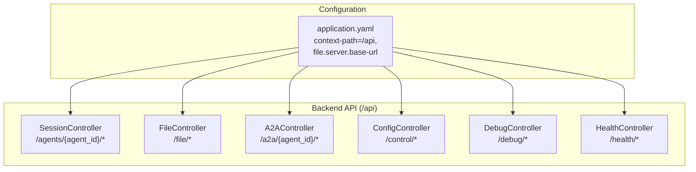
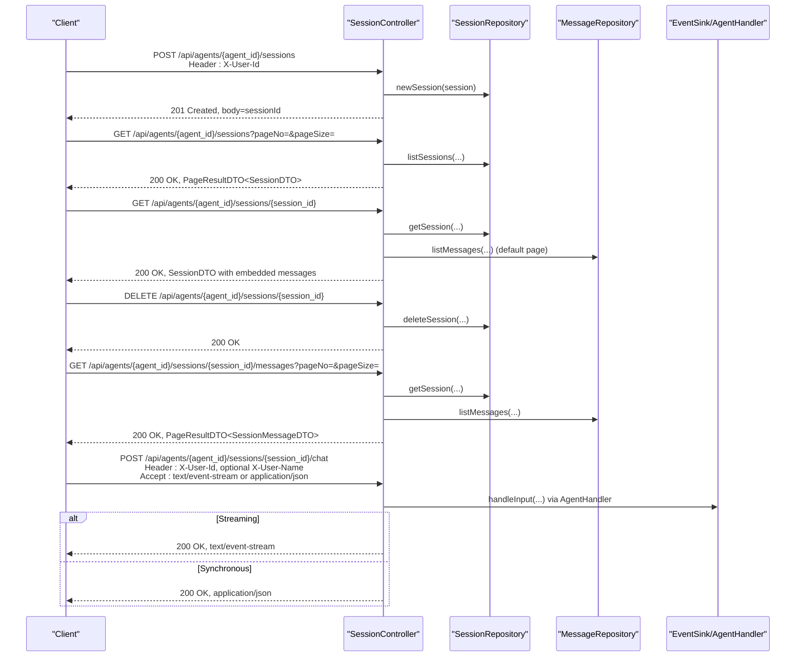
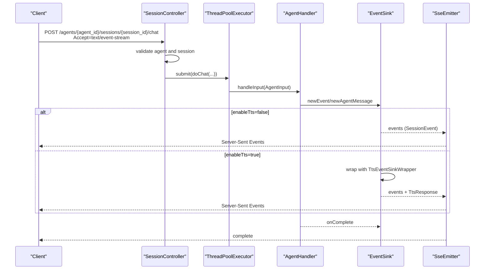
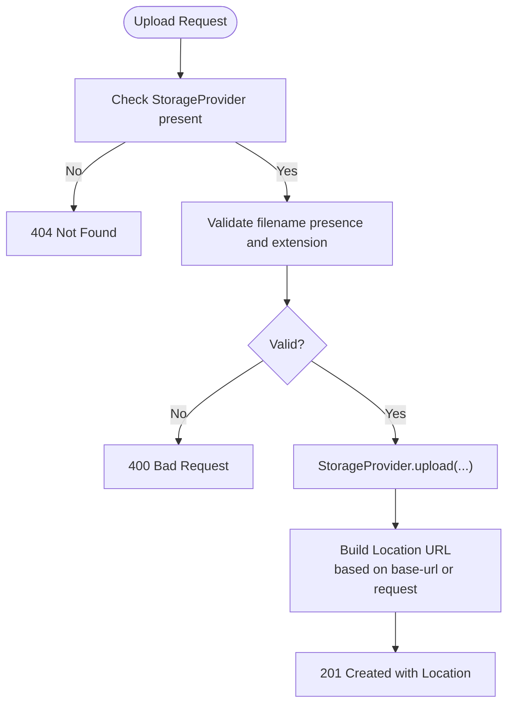
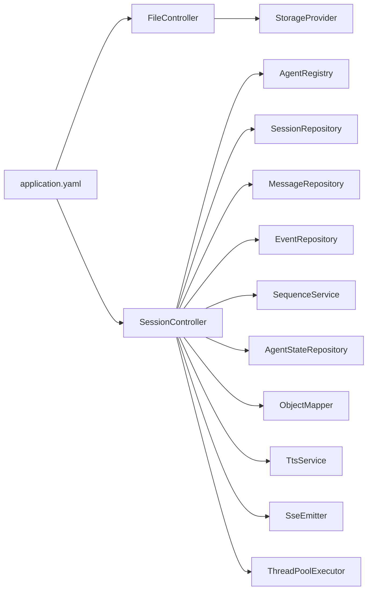

# REST API Endpoints

<cite>
**Referenced Files in This Document**
- [SessionController.java](file://backend_java/api/src/main/java/com/aliyun/tam/x/tron/api/SessionController.java)
- [FileController.java](file://backend_java/api/src/main/java/com/aliyun/tam/x/tron/api/FileController.java)
- [A2AController.java](file://backend_java/api/src/main/java/com/aliyun/tam/x/tron/api/A2AController.java)
- [ConfigController.java](file://backend_java/api/src/main/java/com/aliyun/tam/x/tron/api/ConfigController.java)
- [DebugController.java](file://backend_java/api/src/main/java/com/aliyun/tam/x/tron/api/DebugController.java)
- [HealthController.java](file://backend_java/api/src/main/java/com/aliyun/tam/x/tron/api/HealthController.java)
- [SessionDTO.java](file://backend_java/api/src/main/java/com/aliyun/tam/x/tron/api/dto/SessionDTO.java)
- [SessionMessageDTO.java](file://backend_java/api/src/main/java/com/aliyun/tam/x/tron/api/dto/SessionMessageDTO.java)
- [PageResultDTO.java](file://backend_java/api/src/main/java/com/aliyun/tam/x/tron/api/dto/PageResultDTO.java)
- [CreateSessionRequest.java](file://backend_java/api/src/main/java/com/aliyun/tam/x/tron/api/request/CreateSessionRequest.java)
- [ChatRequest.java](file://backend_java/api/src/main/java/com/aliyun/tam/x/tron/api/request/ChatRequest.java)
- [ContentDTO.java](file://backend_java/api/src/main/java/com/aliyun/tam/x/tron/api/dto/ContentDTO.java)
- [TtsResponse.java](file://backend_java/api/src/main/java/com/aliyun/tam/x/tron/api/response/TtsResponse.java)
- [application.yaml](file://backend_java/bootstrap/src/main/resources/application.yaml)
- [README.md](file://README.md)
- [README_en.md](file://README_en.md)
</cite>

## Table of Contents
1. [Introduction](#introduction)
2. [Project Structure](#project-structure)
3. [Core Components](#core-components)
4. [Architecture Overview](#architecture-overview)
5. [Detailed Component Analysis](#detailed-component-analysis)
6. [Dependency Analysis](#dependency-analysis)
7. [Performance Considerations](#performance-considerations)
8. [Troubleshooting Guide](#troubleshooting-guide)
9. [Conclusion](#conclusion)
10. [Appendices](#appendices)

## Introduction
This document provides comprehensive REST API documentation for Tron OneAgent’s HTTP endpoints. It covers session management, chat interactions (including streaming via Server-Sent Events), and file upload/retrieval operations. It also documents request/response schemas, authentication headers, query parameters, pagination controls, error handling, HTTP status codes, and practical curl examples.

The backend service runs on port 8080 with a base context path of /api. File retrieval endpoints are served from the configured file server base URL.

## Project Structure
The API surface relevant to this document resides primarily in the backend_java module under the api package. Controllers expose endpoints grouped by responsibility:
- SessionController: session lifecycle and chat
- FileController: file upload and retrieval
- A2AController: agent-to-agent JSON-RPC
- ConfigController: dynamic configuration management
- DebugController: tool and knowledge base debugging
- HealthController: health check endpoint

**Diagram sources**
- [SessionController.java:1-564](file://backend_java/api/src/main/java/com/aliyun/tam/x/tron/api/SessionController.java#L1-L564)
- [FileController.java:1-113](file://backend_java/api/src/main/java/com/aliyun/tam/x/tron/api/FileController.java#L1-L113)
- [A2AController.java:1-241](file://backend_java/api/src/main/java/com/aliyun/tam/x/tron/api/A2AController.java#L1-L241)
- [ConfigController.java:1-483](file://backend_java/api/src/main/java/com/aliyun/tam/x/tron/api/ConfigController.java#L1-L483)
- [DebugController.java:1-165](file://backend_java/api/src/main/java/com/aliyun/tam/x/tron/api/DebugController.java#L1-L165)
- [HealthController.java:1-33](file://backend_java/api/src/main/java/com/aliyun/tam/x/tron/api/HealthController.java#L1-L33)
- [application.yaml:1-63](file://backend_java/bootstrap/src/main/resources/application.yaml#L1-L63)

**Section sources**
- [application.yaml:1-63](file://backend_java/bootstrap/src/main/resources/application.yaml#L1-L63)
- [README.md:109-142](file://README.md#L109-L142)
- [README_en.md:110-142](file://README_en.md#L110-L142)

## Core Components
- SessionController: Implements session CRUD, message listing, and chat (sync and streaming).
- FileController: Handles file uploads (multipart) and downloads by ID.
- Supporting DTOs and requests define the schemas for session, messages, pagination, and chat input.

Key responsibilities:
- Authentication via X-User-Id header; optional X-User-Name for chat.
- Pagination via pageNo/pageSize for session/message listings.
- Streaming chat via Accept: text/event-stream returning Server-Sent Events.
- File server base URL configurable via tron.file.server.base-url.

**Section sources**
- [SessionController.java:132-346](file://backend_java/api/src/main/java/com/aliyun/tam/x/tron/api/SessionController.java#L132-L346)
- [FileController.java:51-111](file://backend_java/api/src/main/java/com/aliyun/tam/x/tron/api/FileController.java#L51-L111)
- [SessionDTO.java:1-77](file://backend_java/api/src/main/java/com/aliyun/tam/x/tron/api/dto/SessionDTO.java#L1-L77)
- [SessionMessageDTO.java:1-102](file://backend_java/api/src/main/java/com/aliyun/tam/x/tron/api/dto/SessionMessageDTO.java#L1-L102)
- [PageResultDTO.java:1-76](file://backend_java/api/src/main/java/com/aliyun/tam/x/tron/api/dto/PageResultDTO.java#L1-L76)
- [CreateSessionRequest.java:1-36](file://backend_java/api/src/main/java/com/aliyun/tam/x/tron/api/request/CreateSessionRequest.java#L1-L36)
- [ChatRequest.java:1-43](file://backend_java/api/src/main/java/com/aliyun/tam/x/tron/api/request/ChatRequest.java#L1-L43)
- [ContentDTO.java:1-167](file://backend_java/api/src/main/java/com/aliyun/tam/x/tron/api/dto/ContentDTO.java#L1-L167)
- [application.yaml:32-49](file://backend_java/bootstrap/src/main/resources/application.yaml#L32-L49)

## Architecture Overview
The API follows a layered Spring MVC pattern with controllers delegating to repositories and agent handlers. Chat requests are processed asynchronously with SSE streaming when requested.

**Diagram sources**
- [SessionController.java:132-346](file://backend_java/api/src/main/java/com/aliyun/tam/x/tron/api/SessionController.java#L132-L346)
- [SessionDTO.java:1-77](file://backend_java/api/src/main/java/com/aliyun/tam/x/tron/api/dto/SessionDTO.java#L1-L77)
- [SessionMessageDTO.java:1-102](file://backend_java/api/src/main/java/com/aliyun/tam/x/tron/api/dto/SessionMessageDTO.java#L1-L102)
- [PageResultDTO.java:1-76](file://backend_java/api/src/main/java/com/aliyun/tam/x/tron/api/dto/PageResultDTO.java#L1-L76)

## Detailed Component Analysis

### Session Management Endpoints
- Base path: /api/agents/{agent_id}
- Authentication: X-User-Id required on most endpoints; X-User-Name optional for chat
- Pagination: pageNo (default 1, min 1), pageSize (defaults vary by endpoint; see below)

Endpoints:
- POST /agents/{agent_id}/sessions
  - Purpose: Create a new session
  - Headers: X-User-Id
  - Body: CreateSessionRequest (name)
  - Responses:
    - 201 Created, body: sessionId (string)
    - 404 Not Found: agent not found
  - Notes: Returns newly created session ID as plain text

- GET /agents/{agent_id}/sessions
  - Purpose: List sessions for the agent and user
  - Headers: X-User-Id
  - Query: pageNo (default 1), pageSize (default 10, max 100)
  - Responses:
    - 200 OK, application/json: PageResultDTO<SessionDTO>
    - 404 Not Found: agent not found
  - Schema: SessionDTO includes id, userId, agentId, name, lastAppliedEventId, timestamps, and embedded messages page

- GET /agents/{agent_id}/sessions/{session_id}
  - Purpose: Retrieve a session and its latest messages
  - Headers: X-User-Id
  - Responses:
    - 200 OK, application/json: SessionDTO (messages page defaulted to pageSize=10)
    - 404 Not Found: agent or session not found (or session does not belong to user)
  - Schema: SessionDTO with embedded PageResultDTO<SessionMessageDTO>

- DELETE /agents/{agent_id}/sessions/{session_id}
  - Purpose: Delete a session
  - Headers: X-User-Id
  - Responses:
    - 200 OK
    - 404 Not Found: agent or session not found (or session does not belong to user)

- GET /agents/{agent_id}/sessions/{session_id}/messages
  - Purpose: List messages for a session
  - Headers: X-User-Id
  - Query: pageNo (default 1), pageSize (default 10, max 1000)
  - Responses:
    - 200 OK, application/json: PageResultDTO<SessionMessageDTO>
    - 404 Not Found: agent or session not found (or session does not belong to user)
  - Schema: PageResultDTO with totalRecords, records, pageNum, pageSize, totalPages

Request/Response Schemas:
- CreateSessionRequest
  - Fields: name (string)
- SessionDTO
  - Fields: id, userId, agentId, name, lastAppliedEventId, gmtCreated, gmtModified, messages (PageResultDTO<SessionMessageDTO>)
- SessionMessageDTO
  - Fields: id, type, status, agentId, userId, sessionId, name, contents (list of ContentDTO), gmtCreate, gmtModified, gmtFinished, errorMessage, usage (AgentChatUsageDTO)
- PageResultDTO<T>
  - Fields: totalRecords, records, pageNum, pageSize, totalPages

Practical curl examples:
- Create session
  - curl -X POST "$BASE_URL/agents/{agent_id}/sessions" \
    -H "X-User-Id: user123" \
    -H "Content-Type: application/json" \
    -d '{"name":"My Session"}'
- List sessions
  - curl "$BASE_URL/agents/{agent_id}/sessions?pageNo=1&pageSize=10" \
    -H "X-User-Id: user123"
- Get session details
  - curl "$BASE_URL/agents/{agent_id}/sessions/{session_id}" \
    -H "X-User-Id: user123"
- Delete session
  - curl -X DELETE "$BASE_URL/agents/{agent_id}/sessions/{session_id}" \
    -H "X-User-Id: user123"
- List messages
  - curl "$BASE_URL/agents/{agent_id}/sessions/{session_id}/messages?pageNo=1&pageSize=20" \
    -H "X-User-Id: user123"

**Section sources**
- [SessionController.java:132-278](file://backend_java/api/src/main/java/com/aliyun/tam/x/tron/api/SessionController.java#L132-L278)
- [CreateSessionRequest.java:1-36](file://backend_java/api/src/main/java/com/aliyun/tam/x/tron/api/request/CreateSessionRequest.java#L1-L36)
- [SessionDTO.java:1-77](file://backend_java/api/src/main/java/com/aliyun/tam/x/tron/api/dto/SessionDTO.java#L1-L77)
- [SessionMessageDTO.java:1-102](file://backend_java/api/src/main/java/com/aliyun/tam/x/tron/api/dto/SessionMessageDTO.java#L1-L102)
- [PageResultDTO.java:1-76](file://backend_java/api/src/main/java/com/aliyun/tam/x/tron/api/dto/PageResultDTO.java#L1-L76)

### Chat Endpoint: POST /agents/{agent_id}/sessions/{session_id}/chat
- Purpose: Send a chat message to an agent and receive a response
- Headers:
  - X-User-Id (required)
  - X-User-Name (optional)
  - Accept: text/event-stream for streaming, application/json for synchronous
- Body: ChatRequest
  - input: array of ContentDTO
  - enableTts: boolean (default false)
- Responses:
  - Streaming (text/event-stream): emits events until completion; may include TtsResponse events when enableTts is true
  - Synchronous (application/json): returns immediately after enqueueing the request
- Behavior:
  - Validates agent existence and session ownership
  - Prevents concurrent EXECUTING agent messages in the same session
  - Uses an internal thread pool to process chat requests
  - Emits events via EventSink; SSE stream completes on finish

Request/Response Schemas:
- ChatRequest
  - Fields: input (array of ContentDTO), enableTts (boolean)
- ContentDTO
  - Fields: id, type, text, status, url, base64Data, mediaType, agentId, title, description, method, properties, agentMessageId, result, contents, gmtCreated, gmtModified, gmtFinished
  - Supported types depend on agent input support
- TtsResponse (when enableTts=true)
  - Fields: success (boolean), dataBase64 (string), finished (boolean), error (string)

Practical curl examples:
- Synchronous chat
  - curl -X POST "$BASE_URL/agents/{agent_id}/sessions/{session_id}/chat" \
    -H "X-User-Id: user123" \
    -H "Content-Type: application/json" \
    -d '{"input":[{"type":1,"text":"Hello"}],"enableTts":false}'
- Streaming chat
  - curl -N "$BASE_URL/agents/{agent_id}/sessions/{session_id}/chat" \
    -H "X-User-Id: user123" \
    -H "Accept: text/event-stream" \
    -H "Content-Type: application/json" \
    -d '{"input":[{"type":1,"text":"Hello"}],"enableTts":false}'

**Diagram sources**
- [SessionController.java:308-535](file://backend_java/api/src/main/java/com/aliyun/tam/x/tron/api/SessionController.java#L308-L535)
- [ChatRequest.java:1-43](file://backend_java/api/src/main/java/com/aliyun/tam/x/tron/api/request/ChatRequest.java#L1-L43)
- [ContentDTO.java:1-167](file://backend_java/api/src/main/java/com/aliyun/tam/x/tron/api/dto/ContentDTO.java#L1-L167)
- [TtsResponse.java:1-34](file://backend_java/api/src/main/java/com/aliyun/tam/x/tron/api/response/TtsResponse.java#L1-L34)

**Section sources**
- [SessionController.java:308-535](file://backend_java/api/src/main/java/com/aliyun/tam/x/tron/api/SessionController.java#L308-L535)
- [ChatRequest.java:1-43](file://backend_java/api/src/main/java/com/aliyun/tam/x/tron/api/request/ChatRequest.java#L1-L43)
- [ContentDTO.java:1-167](file://backend_java/api/src/main/java/com/aliyun/tam/x/tron/api/dto/ContentDTO.java#L1-L167)
- [TtsResponse.java:1-34](file://backend_java/api/src/main/java/com/aliyun/tam/x/tron/api/response/TtsResponse.java#L1-L34)

### File Management Endpoints
- Base path: /api/file
- Configuration: tron.file.server.base-url controls the base URL for file retrieval links

Endpoints:
- POST /file (multipart/form-data)
  - Purpose: Upload a file
  - Headers: X-User-Id
  - Form params: file (MultipartFile)
  - Validation:
    - Rejects empty or invalid filenames
    - Allows only jpg, jpeg, png
  - Responses:
    - 201 Created: Location header points to the file URL
    - 404 Not Found: storage provider not configured
    - 400 Bad Request: invalid filename or unsupported type
  - Notes: If tron.file.server.base-url is set, the Location uses that base; otherwise, it constructs a URL from the incoming request’s scheme/host/port/path

- GET /file/{id}
  - Purpose: Download a file by numeric ID
  - Responses:
    - 200 OK with file content (stream)
    - 404 Not Found: storage provider not configured or file not found

Practical curl examples:
- Upload file
  - curl -X POST "$BASE_URL/file" \
    -H "X-User-Id: user123" \
    -F "file=@/path/to/image.jpg"
- Download file
  - curl "$BASE_URL/file/{id}" -o downloaded.jpg

**Diagram sources**
- [FileController.java:51-100](file://backend_java/api/src/main/java/com/aliyun/tam/x/tron/api/FileController.java#L51-L100)
- [application.yaml:42-43](file://backend_java/bootstrap/src/main/resources/application.yaml#L42-L43)

**Section sources**
- [FileController.java:51-111](file://backend_java/api/src/main/java/com/aliyun/tam/x/tron/api/FileController.java#L51-L111)
- [application.yaml:42-43](file://backend_java/bootstrap/src/main/resources/application.yaml#L42-L43)

### Additional Endpoints (Context)
- A2AController: JSON-RPC endpoint for agent-to-agent communication under /a2a/{agent_id}/
- ConfigController: Dynamic configuration management under /control/*
- DebugController: Tool and knowledge base debugging under /debug/*
- HealthController: Health check under /health/*

These endpoints are outside the scope of the documented session/chat/file operations but are part of the API surface.

**Section sources**
- [A2AController.java:91-241](file://backend_java/api/src/main/java/com/aliyun/tam/x/tron/api/A2AController.java#L91-L241)
- [ConfigController.java:118-483](file://backend_java/api/src/main/java/com/aliyun/tam/x/tron/api/ConfigController.java#L118-L483)
- [DebugController.java:44-165](file://backend_java/api/src/main/java/com/aliyun/tam/x/tron/api/DebugController.java#L44-L165)
- [HealthController.java:26-33](file://backend_java/api/src/main/java/com/aliyun/tam/x/tron/api/HealthController.java#L26-L33)

## Dependency Analysis
- SessionController depends on:
  - AgentRegistry (agent lookup)
  - SessionRepository, MessageRepository, EventRepository (persistence)
  - SequenceService (message IDs)
  - AgentStateRepository (agent session persistence)
  - ObjectMapper, TtsService (serialization and TTS)
  - SseEmitter and ThreadPoolExecutor (streaming and async)
- FileController depends on:
  - StorageProvider (upload/download)
  - application.yaml for tron.file.server.base-url

**Diagram sources**
- [SessionController.java:85-114](file://backend_java/api/src/main/java/com/aliyun/tam/x/tron/api/SessionController.java#L85-L114)
- [FileController.java:45-49](file://backend_java/api/src/main/java/com/aliyun/tam/x/tron/api/FileController.java#L45-L49)
- [application.yaml:32-49](file://backend_java/bootstrap/src/main/resources/application.yaml#L32-L49)

**Section sources**
- [SessionController.java:85-114](file://backend_java/api/src/main/java/com/aliyun/tam/x/tron/api/SessionController.java#L85-L114)
- [FileController.java:45-49](file://backend_java/api/src/main/java/com/aliyun/tam/x/tron/api/FileController.java#L45-L49)
- [application.yaml:32-49](file://backend_java/bootstrap/src/main/resources/application.yaml#L32-L49)

## Performance Considerations
- Streaming chat uses SseEmitter with a bounded thread pool. Ensure clients consume events promptly to avoid timeouts.
- Pagination defaults:
  - Sessions listing: pageSize default 10, max 100
  - Messages listing: pageSize default 10, max 1000
- File uploads are limited by spring.servlet.multipart.max-file-size and max-request-size (10MB each).
- Consider tuning ThreadPoolExecutor core/max sizes and queue capacity for high concurrency chat workloads.

[No sources needed since this section provides general guidance]

## Troubleshooting Guide
Common errors and resolutions:
- 404 Not Found
  - Agent not found or disabled
  - Session not found or does not belong to the user
- 400 Bad Request
  - Invalid input (e.g., unsupported content type, invalid filename, unsupported file type)
- 401 Unauthorized
  - Missing or invalid X-User-Id header
- 409 Conflict
  - Attempting to chat while a previous agent message is still EXECUTING
- 500 Internal Server Error
  - Unexpected exceptions; check server logs

Error handling behavior:
- Exceptions are caught centrally and mapped to appropriate HTTP status codes
- SSE timeouts return 408 Request Timeout

**Section sources**
- [SessionController.java:116-130](file://backend_java/api/src/main/java/com/aliyun/tam/x/tron/api/SessionController.java#L116-L130)
- [SessionController.java:317-330](file://backend_java/api/src/main/java/com/aliyun/tam/x/tron/api/SessionController.java#L317-L330)
- [FileController.java:56-81](file://backend_java/api/src/main/java/com/aliyun/tam/x/tron/api/FileController.java#L56-L81)

## Conclusion
This document outlined Tron OneAgent’s REST API for session management, chat interactions (including streaming), and file operations. It provided endpoint specifications, authentication headers, request/response schemas, pagination controls, error handling, and practical curl examples. Clients should use X-User-Id for identity, optionally X-User-Name for chat, and Accept: text/event-stream for streaming responses.

[No sources needed since this section summarizes without analyzing specific files]

## Appendices

### HTTP Status Codes Reference
- 200 OK: Successful operation
- 201 Created: Resource created (upload)
- 400 Bad Request: Invalid input or unsupported file type
- 404 Not Found: Agent/session not found or storage provider missing
- 408 Request Timeout: SSE timeout
- 409 Conflict: Concurrent chat execution detected
- 500 Internal Server Error: Unexpected server error

**Section sources**
- [SessionController.java:116-130](file://backend_java/api/src/main/java/com/aliyun/tam/x/tron/api/SessionController.java#L116-L130)
- [FileController.java:56-81](file://backend_java/api/src/main/java/com/aliyun/tam/x/tron/api/FileController.java#L56-L81)