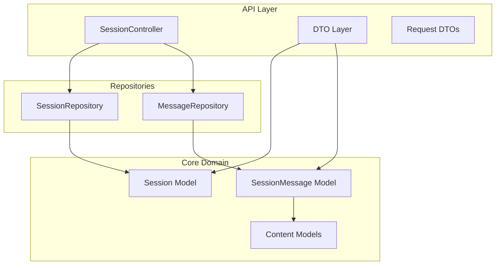
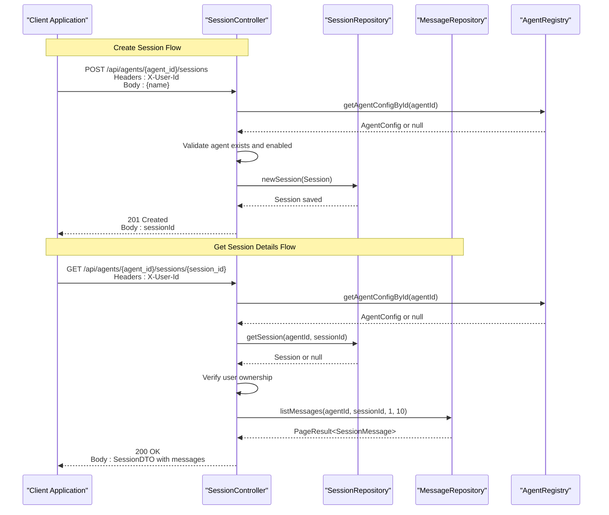
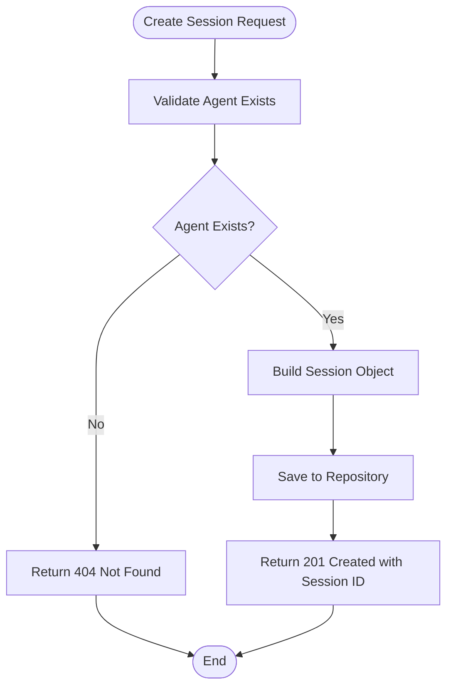
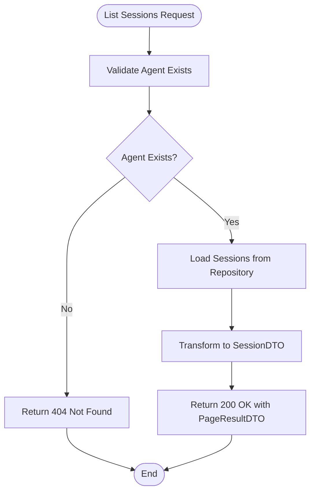
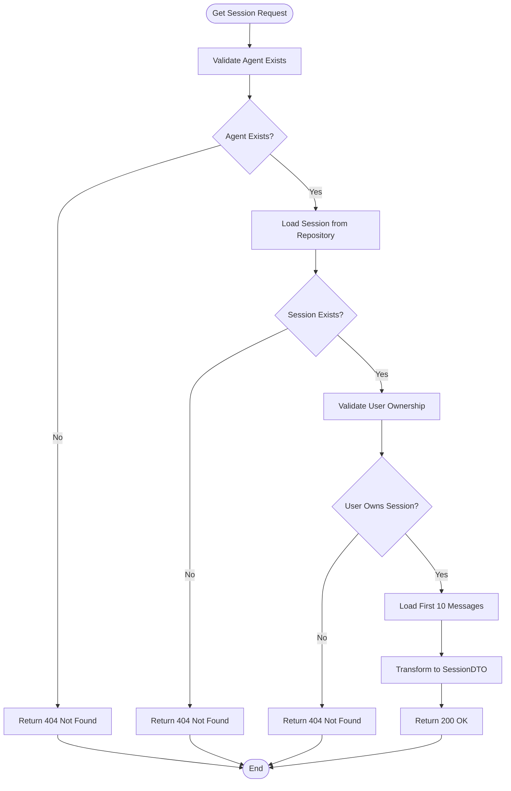
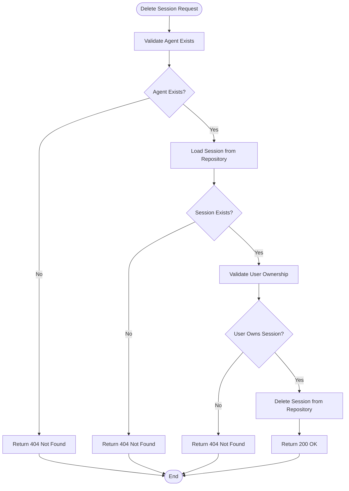
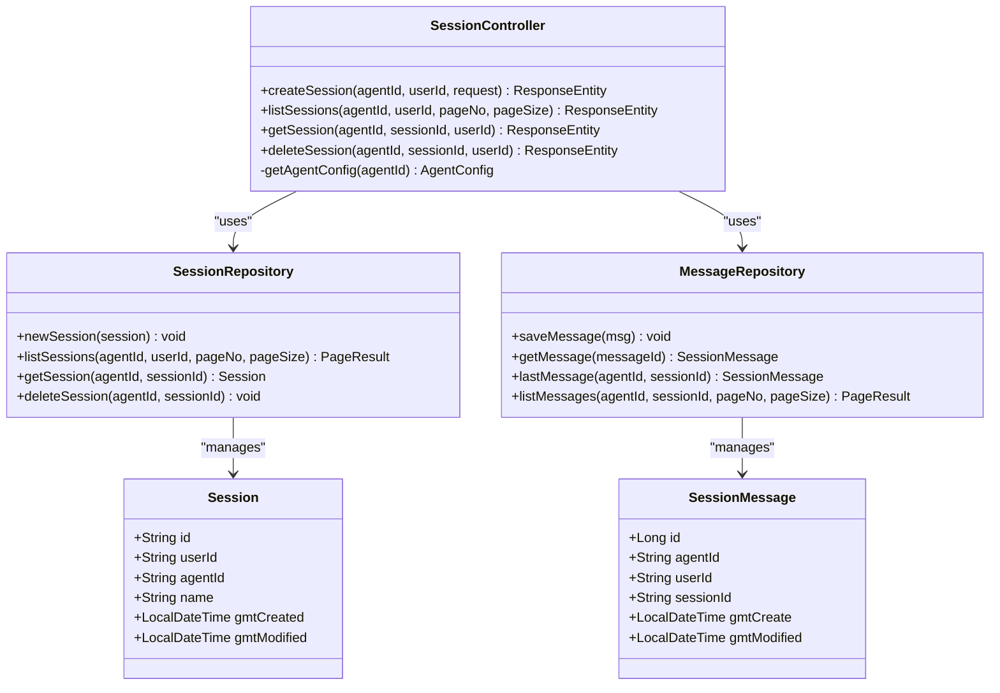

# Session Management Endpoints

<cite>
**Referenced Files in This Document**
- [SessionController.java](file://backend_java/api/src/main/java/com/aliyun/tam/x/tron/api/SessionController.java)
- [SessionDTO.java](file://backend_java/api/src/main/java/com/aliyun/tam/x/tron/api/dto/SessionDTO.java)
- [SessionMessageDTO.java](file://backend_java/api/src/main/java/com/aliyun/tam/x/tron/api/dto/SessionMessageDTO.java)
- [CreateSessionRequest.java](file://backend_java/api/src/main/java/com/aliyun/tam/x/tron/api/request/CreateSessionRequest.java)
- [PageResultDTO.java](file://backend_java/api/src/main/java/com/aliyun/tam/x/tron/api/dto/PageResultDTO.java)
- [ContentDTO.java](file://backend_java/api/src/main/java/com/aliyun/tam/x/tron/api/dto/ContentDTO.java)
- [AgentChatUsageDTO.java](file://backend_java/api/src/main/java/com/aliyun/tam/x/tron/api/dto/AgentChatUsageDTO.java)
- [Session.java](file://backend_java/core/src/main/java/com/aliyun/tam/x/tron/core/domain/models/Session.java)
- [SessionMessage.java](file://backend_java/core/src/main/java/com/aliyun/tam/x/tron/core/domain/models/messages/SessionMessage.java)
- [SessionRepository.java](file://backend_java/core/src/main/java/com/aliyun/tam/x/tron/core/domain/repository/SessionRepository.java)
- [MessageRepository.java](file://backend_java/core/src/main/java/com/aliyun/tam/x/tron/core/domain/repository/MessageRepository.java)
- [application.yaml](file://backend_java/bootstrap/src/main/resources/application.yaml)
</cite>

## Table of Contents
1. [Introduction](#introduction)
2. [Project Structure](#project-structure)
3. [Core Components](#core-components)
4. [Architecture Overview](#architecture-overview)
5. [Detailed Component Analysis](#detailed-component-analysis)
6. [Dependency Analysis](#dependency-analysis)
7. [Performance Considerations](#performance-considerations)
8. [Troubleshooting Guide](#troubleshooting-guide)
9. [Conclusion](#conclusion)

## Introduction
This document provides comprehensive API documentation for session management endpoints in the One Agent system. The endpoints enable creation, listing, retrieval, and deletion of conversation sessions between users and AI agents, with proper authentication and authorization controls.

## Project Structure
The session management functionality is implemented in the backend Java module with clear separation between API controllers, DTOs, and core domain models.



**Diagram sources**
- [SessionController.java:84-564](file://backend_java/api/src/main/java/com/aliyun/tam/x/tron/api/SessionController.java#L84-L564)
- [Session.java:35-78](file://backend_java/core/src/main/java/com/aliyun/tam/x/tron/core/domain/models/Session.java#L35-L78)

**Section sources**
- [SessionController.java:84-564](file://backend_java/api/src/main/java/com/aliyun/tam/x/tron/api/SessionController.java#L84-L564)
- [application.yaml:1-63](file://backend_java/bootstrap/src/main/resources/application.yaml#L1-L63)

## Core Components
The session management system consists of four primary endpoints with comprehensive request/response schemas and validation rules.

### Authentication and Authorization
- **X-User-Id Header**: Required for all session operations
- **Authorization Check**: Endpoints verify that the requesting user owns the session
- **Agent Validation**: All endpoints validate agent existence and enabled status

### Request/Response Schemas

#### Create Session Request
- **Endpoint**: POST `/api/agents/{agent_id}/sessions`
- **Authentication**: X-User-Id header required
- **Request Body**: CreateSessionRequest
  - `name`: String - Session name (required)

#### Session Response Schema
- **Response Body**: SessionDTO
  - `id`: String - Unique session identifier
  - `userId`: String - User who owns the session
  - `agentId`: String - Agent associated with session
  - `name`: String - Session name
  - `lastAppliedEventId`: Long - Last processed event identifier
  - `gmtCreated`: DateTime - Creation timestamp
  - `gmtModified`: DateTime - Last modification timestamp
  - `messages`: PageResultDTO<SessionMessageDTO> - Associated messages

#### Session Message Response Schema
- **Response Body**: SessionMessageDTO
  - `id`: Long - Message identifier
  - `type`: Integer - Message type enumeration value
  - `status`: Integer - Message status enumeration value
  - `agentId`: String - Agent identifier
  - `userId`: String - User identifier
  - `contents`: List<ContentDTO> - Message content
  - `sessionId`: String - Session identifier
  - `gmtCreate`: DateTime - Creation timestamp
  - `gmtModified`: DateTime - Last modification timestamp
  - `errorMessage`: String - Error message (Agent messages only)
  - `gmtFinished`: DateTime - Completion timestamp (Agent messages only)
  - `usage`: AgentChatUsageDTO - Usage statistics (Agent messages only)

#### Pagination Response Schema
- **Response Body**: PageResultDTO<T>
  - `totalRecords`: Long - Total record count
  - `records`: List<T> - Current page records
  - `pageNum`: Integer - Current page number
  - `pageSize`: Integer - Records per page
  - `totalPages`: Integer - Total pages calculated

**Section sources**
- [CreateSessionRequest.java:32-35](file://backend_java/api/src/main/java/com/aliyun/tam/x/tron/api/request/CreateSessionRequest.java#L32-L35)
- [SessionDTO.java:34-76](file://backend_java/api/src/main/java/com/aliyun/tam/x/tron/api/dto/SessionDTO.java#L34-L76)
- [SessionMessageDTO.java:38-101](file://backend_java/api/src/main/java/com/aliyun/tam/x/tron/api/dto/SessionMessageDTO.java#L38-L101)
- [PageResultDTO.java:38-75](file://backend_java/api/src/main/java/com/aliyun/tam/x/tron/api/dto/PageResultDTO.java#L38-L75)

## Architecture Overview



**Diagram sources**
- [SessionController.java:132-223](file://backend_java/api/src/main/java/com/aliyun/tam/x/tron/api/SessionController.java#L132-L223)
- [SessionRepository.java:23-36](file://backend_java/core/src/main/java/com/aliyun/tam/x/tron/core/domain/repository/SessionRepository.java#L23-L36)
- [MessageRepository.java:23-32](file://backend_java/core/src/main/java/com/aliyun/tam/x/tron/core/domain/repository/MessageRepository.java#L23-L32)

## Detailed Component Analysis

### POST /agents/{agent_id}/sessions - Create Session

#### Endpoint Specification
- **Method**: POST
- **Path**: `/api/agents/{agent_id}/sessions`
- **Authentication**: X-User-Id header required
- **Response Codes**: 201 Created, 404 Not Found, 400 Bad Request

#### Request Parameters
- **Path Parameters**:
  - `agent_id`: String - Agent identifier (required)
- **Headers**:
  - `X-User-Id`: String - User identifier (required)
- **Request Body**:
  - `name`: String - Session name (required)

#### Response Body
- **Success (201)**: String - Session identifier
- **Agent Not Found (404)**: String - Error message indicating agent not found

#### Processing Logic


**Diagram sources**
- [SessionController.java:132-158](file://backend_java/api/src/main/java/com/aliyun/tam/x/tron/api/SessionController.java#L132-L158)

#### Implementation Details
- Generates UUID for session identifier
- Sets user ID from X-User-Id header
- Uses agent ID from path parameter
- Initializes timestamps and event ID
- Persists session to database

**Section sources**
- [SessionController.java:132-158](file://backend_java/api/src/main/java/com/aliyun/tam/x/tron/api/SessionController.java#L132-L158)
- [CreateSessionRequest.java:32-35](file://backend_java/api/src/main/java/com/aliyun/tam/x/tron/api/request/CreateSessionRequest.java#L32-L35)

### GET /agents/{agent_id}/sessions - List Sessions

#### Endpoint Specification
- **Method**: GET
- **Path**: `/api/agents/{agent_id}/sessions`
- **Authentication**: X-User-Id header required
- **Response Codes**: 200 OK, 404 Not Found

#### Request Parameters
- **Path Parameters**:
  - `agent_id`: String - Agent identifier (required)
- **Headers**:
  - `X-User-Id`: String - User identifier (required)
- **Query Parameters**:
  - `pageNo`: Integer - Page number (optional, default: 1, min: 1)
  - `pageSize`: Integer - Page size (optional, default: 10, min: 1, max: 100)

#### Response Body
- **Success (200)**: PageResultDTO<SessionDTO> - Paginated session list

#### Processing Logic


**Diagram sources**
- [SessionController.java:160-185](file://backend_java/api/src/main/java/com/aliyun/tam/x/tron/api/SessionController.java#L160-L185)

#### Implementation Details
- Validates agent existence and enabled status
- Applies pagination with configurable page size limit
- Transforms repository results to DTO format
- Returns paginated response with metadata

**Section sources**
- [SessionController.java:160-185](file://backend_java/api/src/main/java/com/aliyun/tam/x/tron/api/SessionController.java#L160-L185)
- [SessionRepository.java:27](file://backend_java/core/src/main/java/com/aliyun/tam/x/tron/core/domain/repository/SessionRepository.java#L27)

### GET /agents/{agent_id}/sessions/{session_id} - Get Session Details

#### Endpoint Specification
- **Method**: GET
- **Path**: `/api/agents/{agent_id}/sessions/{session_id}`
- **Authentication**: X-User-Id header required
- **Response Codes**: 200 OK, 404 Not Found

#### Request Parameters
- **Path Parameters**:
  - `agent_id`: String - Agent identifier (required)
  - `session_id`: String - Session identifier (required)
- **Headers**:
  - `X-User-Id`: String - User identifier (required)

#### Response Body
- **Success (200)**: SessionDTO - Complete session details including first 10 messages
- **Not Found (404)**: String - Error message indicating session not found

#### Processing Logic


**Diagram sources**
- [SessionController.java:187-223](file://backend_java/api/src/main/java/com/aliyun/tam/x/tron/api/SessionController.java#L187-L223)

#### Implementation Details
- Validates agent existence and enabled status
- Loads session with ownership verification
- Retrieves first page of associated messages (default 10)
- Transforms to comprehensive DTO with message pagination

**Section sources**
- [SessionController.java:187-223](file://backend_java/api/src/main/java/com/aliyun/tam/x/tron/api/SessionController.java#L187-L223)
- [SessionMessageDTO.java:38-74](file://backend_java/api/src/main/java/com/aliyun/tam/x/tron/api/dto/SessionMessageDTO.java#L38-L74)

### DELETE /agents/{agent_id}/sessions/{session_id} - Delete Session

#### Endpoint Specification
- **Method**: DELETE
- **Path**: `/api/agents/{agent_id}/sessions/{session_id}`
- **Authentication**: X-User-Id header required
- **Response Codes**: 200 OK, 404 Not Found

#### Request Parameters
- **Path Parameters**:
  - `agent_id`: String - Agent identifier (required)
  - `session_id`: String - Session identifier (required)
- **Headers**:
  - `X-User-Id`: String - User identifier (required)

#### Response Body
- **Success (200)**: Empty response body
- **Not Found (404)**: String - Error message indicating session not found

#### Processing Logic


**Diagram sources**
- [SessionController.java:225-247](file://backend_java/api/src/main/java/com/aliyun/tam/x/tron/api/SessionController.java#L225-L247)

#### Implementation Details
- Validates agent existence and enabled status
- Loads session with strict ownership verification
- Deletes session from database
- Returns empty success response

**Section sources**
- [SessionController.java:225-247](file://backend_java/api/src/main/java/com/aliyun/tam/x/tron/api/SessionController.java#L225-L247)
- [SessionRepository.java:31](file://backend_java/core/src/main/java/com/aliyun/tam/x/tron/core/domain/repository/SessionRepository.java#L31)

### Practical Usage Examples

#### Create Session
```bash
curl -X POST "http://localhost:8080/api/agents/agent-123/sessions" \
  -H "X-User-Id: user-456" \
  -H "Content-Type: application/json" \
  -d '{"name":"My Conversation"}'
```

#### List Sessions
```bash
curl -X GET "http://localhost:8080/api/agents/agent-123/sessions?pageNo=1&pageSize=10" \
  -H "X-User-Id: user-456"
```

#### Get Session Details
```bash
curl -X GET "http://localhost:8080/api/agents/agent-123/sessions/session-789" \
  -H "X-User-Id: user-456"
```

#### Delete Session
```bash
curl -X DELETE "http://localhost:8080/api/agents/agent-123/sessions/session-789" \
  -H "X-User-Id: user-456"
```

## Dependency Analysis



**Diagram sources**
- [SessionController.java:84-564](file://backend_java/api/src/main/java/com/aliyun/tam/x/tron/api/SessionController.java#L84-L564)
- [SessionRepository.java:23-36](file://backend_java/core/src/main/java/com/aliyun/tam/x/tron/core/domain/repository/SessionRepository.java#L23-L36)
- [MessageRepository.java:23-32](file://backend_java/core/src/main/java/com/aliyun/tam/x/tron/core/domain/repository/MessageRepository.java#L23-L32)

**Section sources**
- [SessionController.java:84-564](file://backend_java/api/src/main/java/com/aliyun/tam/x/tron/api/SessionController.java#L84-L564)
- [SessionRepository.java:23-36](file://backend_java/core/src/main/java/com/aliyun/tam/x/tron/core/domain/repository/SessionRepository.java#L23-L36)
- [MessageRepository.java:23-32](file://backend_java/core/src/main/java/com/aliyun/tam/x/tron/core/domain/repository/MessageRepository.java#L23-L32)

## Performance Considerations
- **Pagination Limits**: Maximum page size of 100 for session listing, 1000 for message listing
- **Async Operations**: Chat endpoints support streaming responses for long-running operations
- **Connection Pooling**: Built-in thread pool executor for concurrent chat operations
- **Caching**: No explicit caching implemented; consider adding Redis cache for frequently accessed sessions

## Troubleshooting Guide

### Common Error Scenarios
- **404 Not Found**: Agent not found or disabled, or session not found
- **400 Bad Request**: Invalid request parameters or unsupported content types
- **401 Unauthorized**: Missing or invalid X-User-Id header
- **403 Forbidden**: User attempting to access another user's session

### Error Response Formats
- **Agent/Session Not Found**: Plain text error message
- **Validation Errors**: HTTP 400 with error details
- **Server Errors**: HTTP 500 with generic error message

### Debugging Tips
- Verify agent configuration is enabled in the system
- Check X-User-Id header matches session owner
- Ensure session identifiers are valid UUID format
- Monitor database connectivity for repository operations

**Section sources**
- [SessionController.java:116-130](file://backend_java/api/src/main/java/com/aliyun/tam/x/tron/api/SessionController.java#L116-L130)
- [SessionController.java:139-143](file://backend_java/api/src/main/java/com/aliyun/tam/x/tron/api/SessionController.java#L139-L143)
- [SessionController.java:199-203](file://backend_java/api/src/main/java/com/aliyun/tam/x/tron/api/SessionController.java#L199-L203)

## Conclusion
The session management endpoints provide a robust foundation for conversation session handling with proper authentication, authorization, and pagination support. The implementation follows RESTful principles with clear request/response schemas and comprehensive error handling. The system supports both synchronous and asynchronous operations for different use cases while maintaining data consistency through transactional operations.