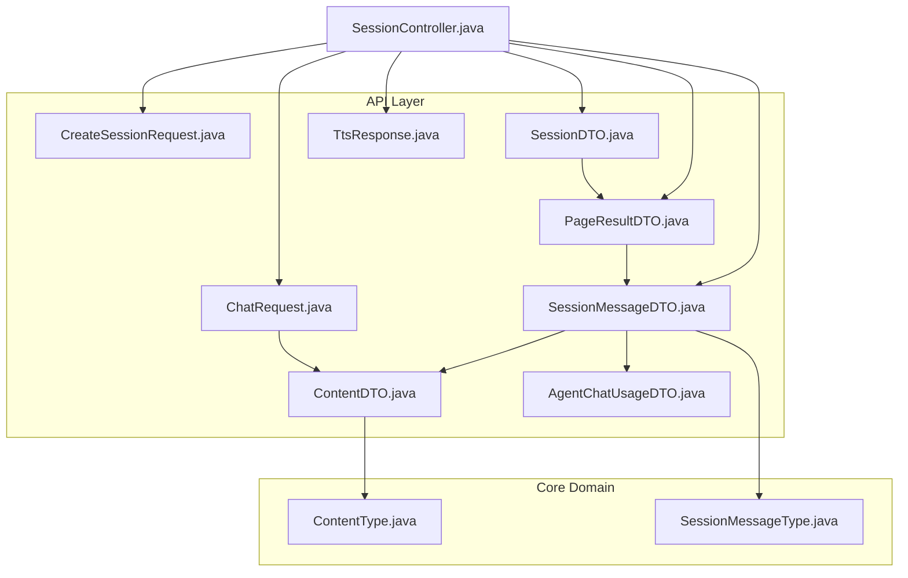
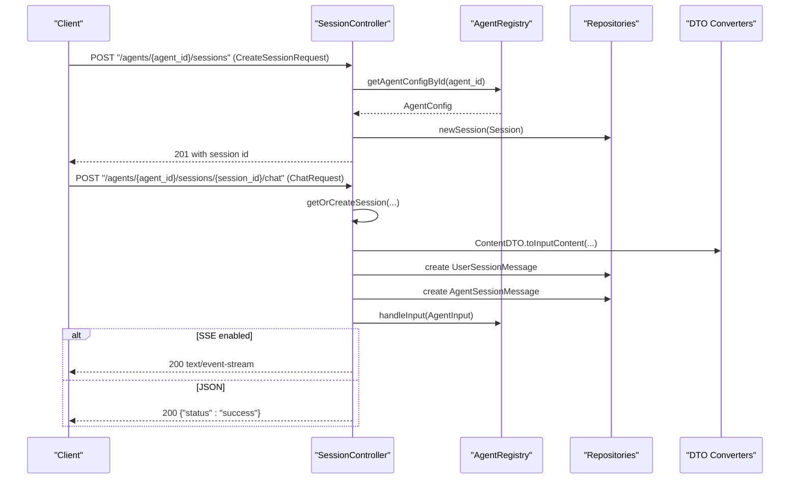
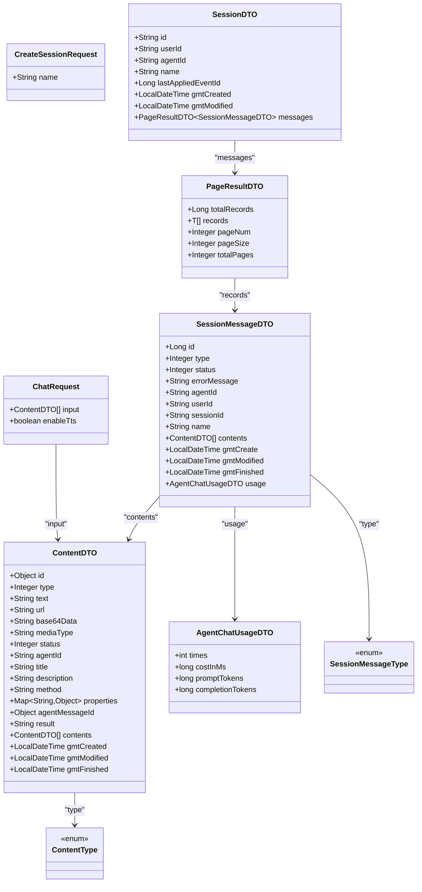

# Request and Response Schemas

<cite>
**Referenced Files in This Document**
- [ChatRequest.java](file://backend_java/api/src/main/java/com/aliyun/tam/x/tron/api/request/ChatRequest.java)
- [CreateSessionRequest.java](file://backend_java/api/src/main/java/com/aliyun/tam/x/tron/api/request/CreateSessionRequest.java)
- [ContentDTO.java](file://backend_java/api/src/main/java/com/aliyun/tam/x/tron/api/dto/ContentDTO.java)
- [SessionDTO.java](file://backend_java/api/src/main/java/com/aliyun/tam/x/tron/api/dto/SessionDTO.java)
- [SessionMessageDTO.java](file://backend_java/api/src/main/java/com/aliyun/tam/x/tron/api/dto/SessionMessageDTO.java)
- [PageResultDTO.java](file://backend_java/api/src/main/java/com/aliyun/tam/x/tron/api/dto/PageResultDTO.java)
- [AgentChatUsageDTO.java](file://backend_java/api/src/main/java/com/aliyun/tam/x/tron/api/dto/AgentChatUsageDTO.java)
- [ContentType.java](file://backend_java/core/src/main/java/com/aliyun/tam/x/tron/core/domain/models/contents/ContentType.java)
- [SessionMessageType.java](file://backend_java/core/src/main/java/com/aliyun/tam/x/tron/core/domain/models/messages/SessionMessageType.java)
- [SessionController.java](file://backend_java/api/src/main/java/com/aliyun/tam/x/tron/api/SessionController.java)
- [TtsResponse.java](file://backend_java/api/src/main/java/com/aliyun/tam/x/tron/api/response/TtsResponse.java)
</cite>

## Table of Contents
1. [Introduction](#introduction)
2. [Project Structure](#project-structure)
3. [Core Components](#core-components)
4. [Architecture Overview](#architecture-overview)
5. [Detailed Component Analysis](#detailed-component-analysis)
6. [Dependency Analysis](#dependency-analysis)
7. [Performance Considerations](#performance-considerations)
8. [Troubleshooting Guide](#troubleshooting-guide)
9. [Conclusion](#conclusion)
10. [Appendices](#appendices)

## Introduction
This document defines the API request and response data schemas used by Tron OneAgent. It covers:
- ChatRequest for multimodal chat inputs
- CreateSessionRequest for session creation
- SessionDTO and SessionMessageDTO for session and message responses
- PageResultDTO as a generic pagination wrapper
- Supporting enums and DTOs for content types and message types
- JSON schema definitions, validation rules, and example payloads
- Schema evolution, backward compatibility, and versioning strategies
- Data validation, sanitization, and security considerations

## Project Structure
The schemas are primarily defined in the API module’s DTOs and requests, with supporting enums in the core domain models. Controllers orchestrate request parsing, validation, and response construction.

**Diagram sources**
- [ChatRequest.java:1-43](file://backend_java/api/src/main/java/com/aliyun/tam/x/tron/api/request/ChatRequest.java#L1-L43)
- [CreateSessionRequest.java:1-36](file://backend_java/api/src/main/java/com/aliyun/tam/x/tron/api/request/CreateSessionRequest.java#L1-L36)
- [ContentDTO.java:1-167](file://backend_java/api/src/main/java/com/aliyun/tam/x/tron/api/dto/ContentDTO.java#L1-L167)
- [SessionDTO.java:1-77](file://backend_java/api/src/main/java/com/aliyun/tam/x/tron/api/dto/SessionDTO.java#L1-L77)
- [SessionMessageDTO.java:1-102](file://backend_java/api/src/main/java/com/aliyun/tam/x/tron/api/dto/SessionMessageDTO.java#L1-L102)
- [PageResultDTO.java:1-76](file://backend_java/api/src/main/java/com/aliyun/tam/x/tron/api/dto/PageResultDTO.java#L1-L76)
- [AgentChatUsageDTO.java:1-23](file://backend_java/api/src/main/java/com/aliyun/tam/x/tron/api/dto/AgentChatUsageDTO.java#L1-L23)
- [ContentType.java:1-57](file://backend_java/core/src/main/java/com/aliyun/tam/x/tron/core/domain/models/contents/ContentType.java#L1-L57)
- [SessionMessageType.java:1-51](file://backend_java/core/src/main/java/com/aliyun/tam/x/tron/core/domain/models/messages/SessionMessageType.java#L1-L51)
- [SessionController.java:1-564](file://backend_java/api/src/main/java/com/aliyun/tam/x/tron/api/SessionController.java#L1-L564)
- [TtsResponse.java:1-34](file://backend_java/api/src/main/java/com/aliyun/tam/x/tron/api/response/TtsResponse.java#L1-L34)

**Section sources**
- [SessionController.java:132-158](file://backend_java/api/src/main/java/com/aliyun/tam/x/tron/api/SessionController.java#L132-L158)
- [SessionController.java:160-185](file://backend_java/api/src/main/java/com/aliyun/tam/x/tron/api/SessionController.java#L160-L185)
- [SessionController.java:187-223](file://backend_java/api/src/main/java/com/aliyun/tam/x/tron/api/SessionController.java#L187-L223)
- [SessionController.java:249-278](file://backend_java/api/src/main/java/com/aliyun/tam/x/tron/api/SessionController.java#L249-L278)
- [SessionController.java:308-346](file://backend_java/api/src/main/java/com/aliyun/tam/x/tron/api/SessionController.java#L308-L346)

## Core Components
This section documents the primary request and response DTOs and their relationships.

- ChatRequest
  - Purpose: Encapsulates a single chat request payload.
  - Fields:
    - input: array of ContentDTO (required)
    - enableTts: boolean (optional, default false)
  - Validation: input is required; pageSize bounds enforced via controller parameters.

- CreateSessionRequest
  - Purpose: Encapsulates session creation metadata.
  - Fields:
    - name: string (optional)

- ContentDTO
  - Purpose: Multimodal content container for inputs.
  - Fields:
    - id: object (nullable)
    - type: integer (required; maps to ContentType)
    - text: string (present for TEXT)
    - status: integer (present for TASK/ACTION/HITL)
    - url: string (present for IMAGE/VIDEO/AUDIO)
    - base64Data: string (present for IMAGE/VIDEO/AUDIO)
    - mediaType: string (present for IMAGE/VIDEO/AUDIO)
    - agentId: string (present for TASK)
    - title: string (present for TASK/ACTION)
    - description: string (present for TASK)
    - method: string (present for HITL)
    - properties: object (present for HITL)
    - agentMessageId: object (present for HITL)
    - result: string (present for HITL/TASK)
    - contents: array of ContentDTO (nested multimodal content)
    - gmtCreated/gmtModified/gmtFinished: timestamps (present for TASK/ACTION/HITL)
  - Validation: type must be a known ContentType; unsupported types rejected during conversion.

- SessionDTO
  - Purpose: Session representation returned by APIs.
  - Fields:
    - id: string
    - userId: string
    - agentId: string
    - name: string (default empty)
    - lastAppliedEventId: long (default 0)
    - gmtCreated/gmtModified: timestamps
    - messages: PageResultDTO<SessionMessageDTO>

- SessionMessageDTO
  - Purpose: Message representation within a session.
  - Fields:
    - id: long
    - type: integer (maps to SessionMessageType)
    - status: integer
    - errorMessage: string (present for AGENT messages)
    - agentId: string
    - userId: string
    - sessionId: string
    - name: string (present for USER messages)
    - contents: array of ContentDTO
    - gmtCreate/gmtModified/gmtFinished: timestamps
    - usage: AgentChatUsageDTO (present for AGENT messages)

- PageResultDTO<T>
  - Purpose: Generic pagination wrapper.
  - Fields:
    - totalRecords: long
    - records: array of T
    - pageNum: integer
    - pageSize: integer
    - totalPages: integer

- AgentChatUsageDTO
  - Purpose: Tracks agent chat usage metrics.
  - Fields:
    - times: integer
    - costInMs: long
    - promptTokens: long
    - completionTokens: long

- Enums
  - ContentType: TEXT, THINKING, IMAGE, VIDEO, AUDIO, HITL, TASK, ACTION
  - SessionMessageType: USER, AGENT

**Section sources**
- [ChatRequest.java:36-42](file://backend_java/api/src/main/java/com/aliyun/tam/x/tron/api/request/ChatRequest.java#L36-L42)
- [CreateSessionRequest.java:32-35](file://backend_java/api/src/main/java/com/aliyun/tam/x/tron/api/request/CreateSessionRequest.java#L32-L35)
- [ContentDTO.java:38-93](file://backend_java/api/src/main/java/com/aliyun/tam/x/tron/api/dto/ContentDTO.java#L38-L93)
- [SessionDTO.java:34-76](file://backend_java/api/src/main/java/com/aliyun/tam/x/tron/api/dto/SessionDTO.java#L34-L76)
- [SessionMessageDTO.java:38-101](file://backend_java/api/src/main/java/com/aliyun/tam/x/tron/api/dto/SessionMessageDTO.java#L38-L101)
- [PageResultDTO.java:38-75](file://backend_java/api/src/main/java/com/aliyun/tam/x/tron/api/dto/PageResultDTO.java#L38-L75)
- [AgentChatUsageDTO.java:13-22](file://backend_java/api/src/main/java/com/aliyun/tam/x/tron/api/dto/AgentChatUsageDTO.java#L13-L22)
- [ContentType.java:26-34](file://backend_java/core/src/main/java/com/aliyun/tam/x/tron/core/domain/models/contents/ContentType.java#L26-L34)
- [SessionMessageType.java:26-28](file://backend_java/core/src/main/java/com/aliyun/tam/x/tron/core/domain/models/messages/SessionMessageType.java#L26-L28)

## Architecture Overview
The API layer exposes endpoints that accept request DTOs, validate them, convert to internal models, and produce response DTOs. Pagination is standardized via PageResultDTO.

**Diagram sources**
- [SessionController.java:132-158](file://backend_java/api/src/main/java/com/aliyun/tam/x/tron/api/SessionController.java#L132-L158)
- [SessionController.java:308-346](file://backend_java/api/src/main/java/com/aliyun/tam/x/tron/api/SessionController.java#L308-L346)
- [ContentDTO.java:133-165](file://backend_java/api/src/main/java/com/aliyun/tam/x/tron/api/dto/ContentDTO.java#L133-L165)

## Detailed Component Analysis

### ChatRequest Schema
- Purpose: Accepts multimodal input for a chat session.
- Required fields:
  - input: array of ContentDTO (min length 1)
- Optional fields:
  - enableTts: boolean (default false)
- Validation rules:
  - input is required; controller enforces non-null request body.
  - pageSize bounds enforced in list endpoints (not part of ChatRequest).
- Content types:
  - TEXT: requires text
  - IMAGE/VIDEO/AUDIO: requires url or base64Data and mediaType
  - TASK/ACTION/HITL: include nested contents and status fields
- Security considerations:
  - Reject unknown ContentType values during conversion.
  - Validate media URLs and sanitize base64 data if used externally.
- Example payloads:
  - Single text input: see [ChatRequest.java:36-42](file://backend_java/api/src/main/java/com/aliyun/tam/x/tron/api/request/ChatRequest.java#L36-L42)
  - Multimodal mixed input: see [ContentDTO.java:38-93](file://backend_java/api/src/main/java/com/aliyun/tam/x/tron/api/dto/ContentDTO.java#L38-L93)

**Section sources**
- [ChatRequest.java:36-42](file://backend_java/api/src/main/java/com/aliyun/tam/x/tron/api/request/ChatRequest.java#L36-L42)
- [ContentDTO.java:38-93](file://backend_java/api/src/main/java/com/aliyun/tam/x/tron/api/dto/ContentDTO.java#L38-L93)
- [SessionController.java:308-346](file://backend_java/api/src/main/java/com/aliyun/tam/x/tron/api/SessionController.java#L308-L346)

### CreateSessionRequest Schema
- Purpose: Creates a new session with optional metadata.
- Fields:
  - name: string (optional)
- Validation rules:
  - No explicit validation on name; controller persists as-is.
- Example payloads:
  - Empty name: see [CreateSessionRequest.java:32-35](file://backend_java/api/src/main/java/com/aliyun/tam/x/tron/api/request/CreateSessionRequest.java#L32-L35)

**Section sources**
- [CreateSessionRequest.java:32-35](file://backend_java/api/src/main/java/com/aliyun/tam/x/tron/api/request/CreateSessionRequest.java#L32-L35)
- [SessionController.java:132-158](file://backend_java/api/src/main/java/com/aliyun/tam/x/tron/api/SessionController.java#L132-L158)

### SessionDTO Schema
- Purpose: Represents a session in responses.
- Fields:
  - id, userId, agentId: strings
  - name: string (default empty)
  - lastAppliedEventId: long (default 0)
  - gmtCreated, gmtModified: timestamps
  - messages: PageResultDTO<SessionMessageDTO>
- Notes:
  - messages is populated on GET /sessions/{session_id}.

**Section sources**
- [SessionDTO.java:34-76](file://backend_java/api/src/main/java/com/aliyun/tam/x/tron/api/dto/SessionDTO.java#L34-L76)
- [SessionController.java:187-223](file://backend_java/api/src/main/java/com/aliyun/tam/x/tron/api/SessionController.java#L187-L223)

### SessionMessageDTO Schema
- Purpose: Represents a message within a session.
- Fields:
  - id: long
  - type: integer (USER=1, AGENT=2)
  - status: integer
  - errorMessage: string (AGENT messages)
  - agentId, userId, sessionId: strings
  - name: string (USER messages)
  - contents: array of ContentDTO
  - gmtCreate, gmtModified, gmtFinished: timestamps
  - usage: AgentChatUsageDTO (AGENT messages)
- Conversion:
  - from(SessionMessage): maps internal message to DTO with type/status mapping and optional fields.

**Section sources**
- [SessionMessageDTO.java:38-101](file://backend_java/api/src/main/java/com/aliyun/tam/x/tron/api/dto/SessionMessageDTO.java#L38-L101)
- [SessionMessageType.java:26-28](file://backend_java/core/src/main/java/com/aliyun/tam/x/tron/core/domain/models/messages/SessionMessageType.java#L26-L28)

### PageResultDTO Schema
- Purpose: Standard pagination wrapper for lists.
- Fields:
  - totalRecords, pageNum, pageSize, totalPages: integers
  - records: array of T (items in current page)
- Usage patterns:
  - Used for sessions and messages lists.
  - Converter supports mapping from core PageResult to DTO.

**Section sources**
- [PageResultDTO.java:38-75](file://backend_java/api/src/main/java/com/aliyun/tam/x/tron/api/dto/PageResultDTO.java#L38-L75)
- [SessionController.java:160-185](file://backend_java/api/src/main/java/com/aliyun/tam/x/tron/api/SessionController.java#L160-L185)
- [SessionController.java:249-278](file://backend_java/api/src/main/java/com/aliyun/tam/x/tron/api/SessionController.java#L249-L278)

### Supporting DTOs and Enums
- ContentType
  - Values: TEXT=1, THINKING=2, IMAGE=3, VIDEO=4, AUDIO=5, HITL=6, TASK=100, ACTION=200
- SessionMessageType
  - Values: USER=1, AGENT=2
- AgentChatUsageDTO
  - Metrics: times, costInMs, promptTokens, completionTokens

**Section sources**
- [ContentType.java:26-34](file://backend_java/core/src/main/java/com/aliyun/tam/x/tron/core/domain/models/contents/ContentType.java#L26-L34)
- [SessionMessageType.java:26-28](file://backend_java/core/src/main/java/com/aliyun/tam/x/tron/core/domain/models/messages/SessionMessageType.java#L26-L28)
- [AgentChatUsageDTO.java:13-22](file://backend_java/api/src/main/java/com/aliyun/tam/x/tron/api/dto/AgentChatUsageDTO.java#L13-L22)

## Dependency Analysis
The following diagram shows how request/response DTOs depend on core enums and converters.

**Diagram sources**
- [ChatRequest.java:36-42](file://backend_java/api/src/main/java/com/aliyun/tam/x/tron/api/request/ChatRequest.java#L36-L42)
- [CreateSessionRequest.java:32-35](file://backend_java/api/src/main/java/com/aliyun/tam/x/tron/api/request/CreateSessionRequest.java#L32-L35)
- [ContentDTO.java:38-93](file://backend_java/api/src/main/java/com/aliyun/tam/x/tron/api/dto/ContentDTO.java#L38-L93)
- [SessionDTO.java:34-76](file://backend_java/api/src/main/java/com/aliyun/tam/x/tron/api/dto/SessionDTO.java#L34-L76)
- [SessionMessageDTO.java:38-101](file://backend_java/api/src/main/java/com/aliyun/tam/x/tron/api/dto/SessionMessageDTO.java#L38-L101)
- [PageResultDTO.java:38-75](file://backend_java/api/src/main/java/com/aliyun/tam/x/tron/api/dto/PageResultDTO.java#L38-L75)
- [AgentChatUsageDTO.java:13-22](file://backend_java/api/src/main/java/com/aliyun/tam/x/tron/api/dto/AgentChatUsageDTO.java#L13-L22)
- [ContentType.java:26-34](file://backend_java/core/src/main/java/com/aliyun/tam/x/tron/core/domain/models/contents/ContentType.java#L26-L34)
- [SessionMessageType.java:26-28](file://backend_java/core/src/main/java/com/aliyun/tam/x/tron/core/domain/models/messages/SessionMessageType.java#L26-L28)

## Performance Considerations
- Pagination limits:
  - listSessions: pageSize min 1, max 100
  - listSessionMessages: pageSize min 1, max 1000
  - listSessionEvents: size min 1, max 100
- Streaming:
  - SSE is supported for chat; ensure clients handle timeouts and reconnection.
- Concurrency:
  - Chat processing runs in a bounded thread pool; avoid excessive concurrent requests.

**Section sources**
- [SessionController.java:160-185](file://backend_java/api/src/main/java/com/aliyun/tam/x/tron/api/SessionController.java#L160-L185)
- [SessionController.java:249-278](file://backend_java/api/src/main/java/com/aliyun/tam/x/tron/api/SessionController.java#L249-L278)
- [SessionController.java:280-306](file://backend_java/api/src/main/java/com/aliyun/tam/x/tron/api/SessionController.java#L280-L306)
- [SessionController.java:103-114](file://backend_java/api/src/main/java/com/aliyun/tam/x/tron/api/SessionController.java#L103-L114)

## Troubleshooting Guide
- Validation errors:
  - Bad Request responses for illegal arguments or unsupported content types.
- Timeouts:
  - SSE chat requests may time out; adjust client retry/backoff.
- Not found:
  - Agent or session not found returns 404 with message.
- Usage of enableTts:
  - When true, TTS events are streamed via SSE; ensure client handles TtsResponse notifications.

**Section sources**
- [SessionController.java:116-130](file://backend_java/api/src/main/java/com/aliyun/tam/x/tron/api/SessionController.java#L116-L130)
- [SessionController.java:308-346](file://backend_java/api/src/main/java/com/aliyun/tam/x/tron/api/SessionController.java#L308-L346)
- [TtsResponse.java:24-34](file://backend_java/api/src/main/java/com/aliyun/tam/x/tron/api/response/TtsResponse.java#L24-L34)

## Conclusion
The Tron OneAgent API uses a clear set of request and response DTOs with strong typing via enums. ContentDTO enables robust multimodal inputs, while PageResultDTO standardizes pagination. Controllers enforce validation and provide streaming capabilities for real-time chat experiences.

## Appendices

### JSON Schema Definitions
Below are JSON schema outlines derived from the DTOs. These schemas capture field presence, types, and constraints inferred from the Java definitions.

- ChatRequest
  - type: object
  - required: ["input"]
  - properties:
    - input: type array, items: $ref "#/definitions/ContentDTO"
    - enableTts: type boolean, default false
  - definitions:
    - ContentDTO: see below

- CreateSessionRequest
  - type: object
  - properties:
    - name: type string

- ContentDTO
  - type: object
  - required: ["type"]
  - properties:
    - id: type object
    - type: type integer (enum values from ContentType)
    - text: type string
    - status: type integer
    - url: type string
    - base64Data: type string
    - mediaType: type string
    - agentId: type string
    - title: type string
    - description: type string
    - method: type string
    - properties: type object
    - agentMessageId: type object
    - result: type string
    - contents: type array, items: $ref "#/definitions/ContentDTO"
    - gmtCreated: type string (ISO datetime)
    - gmtModified: type string (ISO datetime)
    - gmtFinished: type string (ISO datetime)

- SessionDTO
  - type: object
  - properties:
    - id: type string
    - userId: type string
    - agentId: type string
    - name: type string, default ""
    - lastAppliedEventId: type integer, default 0
    - gmtCreated: type string (ISO datetime)
    - gmtModified: type string (ISO datetime)
    - messages: $ref "#/definitions/PageResultDTO_SessionMessageDTO"

- SessionMessageDTO
  - type: object
  - properties:
    - id: type integer
    - type: type integer (enum values from SessionMessageType)
    - status: type integer
    - errorMessage: type string
    - agentId: type string
    - userId: type string
    - sessionId: type string
    - name: type string
    - contents: type array, items: $ref "#/definitions/ContentDTO"
    - gmtCreate: type string (ISO datetime)
    - gmtModified: type string (ISO datetime)
    - gmtFinished: type string (ISO datetime)
    - usage: $ref "#/definitions/AgentChatUsageDTO"

- PageResultDTO<T>
  - type: object
  - properties:
    - totalRecords: type integer
    - records: type array, items: $ref "#/definitions/T"
    - pageNum: type integer
    - pageSize: type integer
    - totalPages: type integer

- AgentChatUsageDTO
  - type: object
  - properties:
    - times: type integer
    - costInMs: type integer
    - promptTokens: type integer
    - completionTokens: type integer

- Enums
  - ContentType: enum [1,2,3,4,5,6,100,200]
  - SessionMessageType: enum [1,2]

### Validation Rules and Examples
- Validation rules
  - ChatRequest.input is required; each ContentDTO.type must be a known ContentType.
  - listSessions: pageNo >= 1; pageSize from 1 to 100.
  - listSessionMessages: pageNo >= 1; pageSize from 1 to 1000.
  - listSessionEvents: size from 1 to 100.
- Example payloads
  - ChatRequest with text input: see [ChatRequest.java:36-42](file://backend_java/api/src/main/java/com/aliyun/tam/x/tron/api/request/ChatRequest.java#L36-L42)
  - ChatRequest with image/audio input: see [ContentDTO.java:56-60](file://backend_java/api/src/main/java/com/aliyun/tam/x/tron/api/dto/ContentDTO.java#L56-L60)
  - CreateSessionRequest: see [CreateSessionRequest.java:32-35](file://backend_java/api/src/main/java/com/aliyun/tam/x/tron/api/request/CreateSessionRequest.java#L32-L35)
  - SessionDTO with messages: see [SessionController.java:187-223](file://backend_java/api/src/main/java/com/aliyun/tam/x/tron/api/SessionController.java#L187-L223)

### Schema Evolution, Backward Compatibility, and Versioning
- Guidelines
  - Add new fields as optional with defaults to maintain backward compatibility.
  - Avoid changing existing field types or removing fields.
  - Introduce new enum values carefully; reject unknown values on the server.
  - Use semantic versioning for API versions; keep current version stable.
- Migration strategy
  - Server-side: map unknown enum values to errors; clients should handle gracefully.
  - Client-side: ignore unknown fields; prefer tolerant deserialization.

### Security Considerations
- Input validation
  - Reject unknown ContentType values; validate media URLs and sanitize base64 data.
- Output sanitization
  - Escape HTML/text in responses; avoid reflecting untrusted data.
- Access control
  - Enforce X-User-Id header checks per request; deny cross-user access.
- Streaming safety
  - Close SSE connections on client disconnect; cancel long-running tasks.