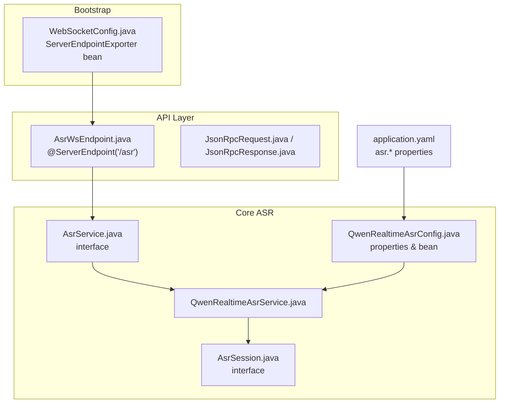
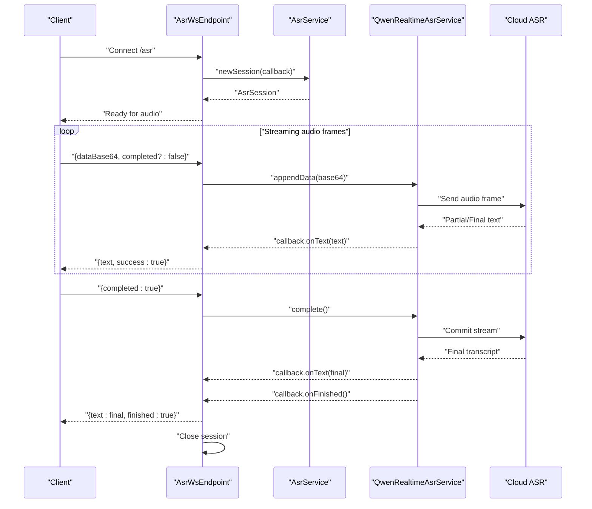
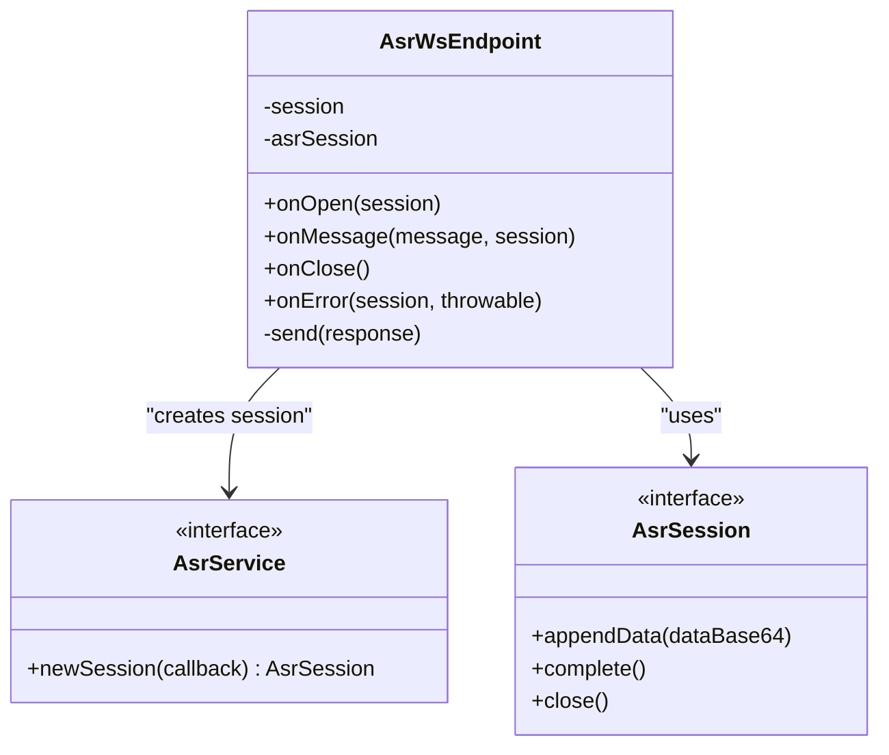
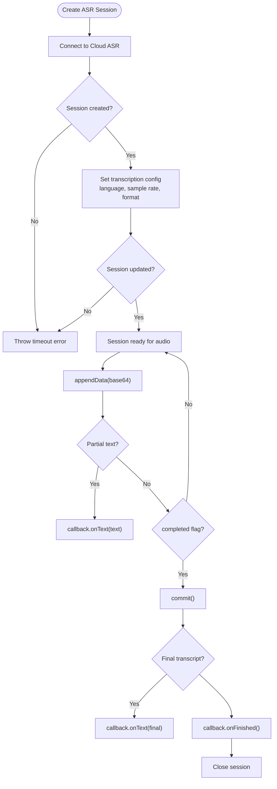
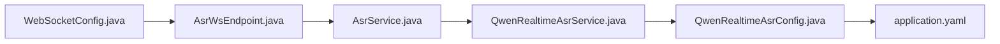
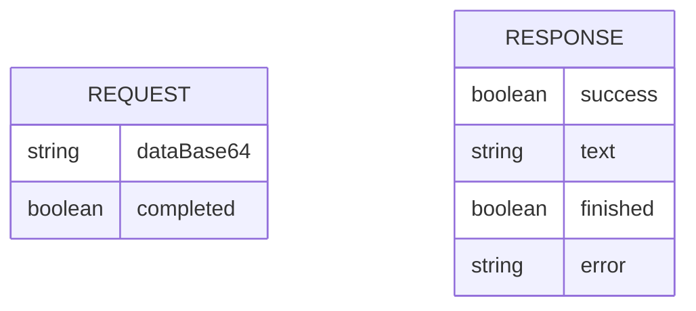

# ASR WebSocket Endpoint

<cite>
**Referenced Files in This Document**
- [AsrWsEndpoint.java](file://backend_java/api/src/main/java/com/aliyun/tam/x/tron/ws/AsrWsEndpoint.java)
- [AsrService.java](file://backend_java/core/src/main/java/com/aliyun/tam/x/tron/core/asr/AsrService.java)
- [AsrSession.java](file://backend_java/core/src/main/java/com/aliyun/tam/x/tron/core/asr/AsrSession.java)
- [QwenRealtimeAsrService.java](file://backend_java/core/src/main/java/com/aliyun/tam/x/tron/core/asr/QwenRealtimeAsrService.java)
- [QwenRealtimeAsrConfig.java](file://backend_java/core/src/main/java/com/aliyun/tam/x/tron/core/asr/QwenRealtimeAsrConfig.java)
- [WebSocketConfig.java](file://backend_java/bootstrap/src/main/java/com/aliyun/tam/x/tron/config/WebSocketConfig.java)
- [application.yaml](file://backend_java/bootstrap/src/main/resources/application.yaml)
- [JsonRpcRequest.java](file://backend_java/api/src/main/java/com/aliyun/tam/x/tron/ws/jsonrpc/JsonRpcRequest.java)
- [JsonRpcResponse.java](file://backend_java/api/src/main/java/com/aliyun/tam/x/tron/ws/jsonrpc/JsonRpcResponse.java)
</cite>

## Table of Contents
1. [Introduction](#introduction)
2. [Project Structure](#project-structure)
3. [Core Components](#core-components)
4. [Architecture Overview](#architecture-overview)
5. [Detailed Component Analysis](#detailed-component-analysis)
6. [Dependency Analysis](#dependency-analysis)
7. [Performance Considerations](#performance-considerations)
8. [Troubleshooting Guide](#troubleshooting-guide)
9. [Conclusion](#conclusion)
10. [Appendices](#appendices)

## Introduction
This document describes the Automatic Speech Recognition (ASR) WebSocket endpoint that enables real-time audio streaming and transcription. It covers connection setup, audio data formats, streaming transcription semantics, latency optimization, and client implementation guidance. It also documents error handling for audio processing failures, connection interruptions, and audio quality issues.

## Project Structure
The ASR WebSocket endpoint is implemented as a Jakarta WebSocket server endpoint mounted at "/asr". It delegates audio processing to an ASR service abstraction backed by a cloud provider’s real-time ASR engine. Configuration is provided via Spring Boot properties and the WebSocket infrastructure is enabled through a dedicated configuration bean.

**Diagram sources**
- [WebSocketConfig.java:24-36](file://backend_java/bootstrap/src/main/java/com/aliyun/tam/x/tron/config/WebSocketConfig.java#L24-L36)
- [AsrWsEndpoint.java:35-38](file://backend_java/api/src/main/java/com/aliyun/tam/x/tron/ws/AsrWsEndpoint.java#L35-L38)
- [AsrService.java:20-31](file://backend_java/core/src/main/java/com/aliyun/tam/x/tron/core/asr/AsrService.java#L20-L31)
- [AsrSession.java:20-27](file://backend_java/core/src/main/java/com/aliyun/tam/x/tron/core/asr/AsrSession.java#L20-L27)
- [QwenRealtimeAsrService.java:36-149](file://backend_java/core/src/main/java/com/aliyun/tam/x/tron/core/asr/QwenRealtimeAsrService.java#L36-L149)
- [QwenRealtimeAsrConfig.java:27-55](file://backend_java/core/src/main/java/com/aliyun/tam/x/tron/core/asr/QwenRealtimeAsrConfig.java#L27-L55)
- [application.yaml](file://backend_java/bootstrap/src/main/resources/application.yaml)

**Section sources**
- [AsrWsEndpoint.java:35-38](file://backend_java/api/src/main/java/com/aliyun/tam/x/tron/ws/AsrWsEndpoint.java#L35-L38)
- [WebSocketConfig.java:24-36](file://backend_java/bootstrap/src/main/java/com/aliyun/tam/x/tron/config/WebSocketConfig.java#L24-L36)
- [QwenRealtimeAsrConfig.java:27-55](file://backend_java/core/src/main/java/com/aliyun/tam/x/tron/core/asr/QwenRealtimeAsrConfig.java#L27-L55)

## Core Components
- ASR WebSocket Endpoint: Accepts WebSocket connections at "/asr", validates service availability, and streams transcription results back to clients.
- ASR Service Abstraction: Defines a session-based contract for appending audio data and completing a stream.
- Real-time ASR Implementation: Bridges to a cloud provider’s real-time ASR service, emitting partial and final transcripts.
- Configuration: Provides model, endpoint, credentials, language, sampling rate, audio format, and timeouts.

Key responsibilities:
- Connection lifecycle management (open, message, close, error).
- Audio data ingestion via base64-encoded PCM frames.
- Streaming transcription delivery with partial and final results.
- Graceful session termination and error propagation.

**Section sources**
- [AsrWsEndpoint.java:70-107](file://backend_java/api/src/main/java/com/aliyun/tam/x/tron/ws/AsrWsEndpoint.java#L70-L107)
- [AsrService.java:20-31](file://backend_java/core/src/main/java/com/aliyun/tam/x/tron/core/asr/AsrService.java#L20-L31)
- [QwenRealtimeAsrService.java:39-147](file://backend_java/core/src/main/java/com/aliyun/tam/x/tron/core/asr/QwenRealtimeAsrService.java#L39-L147)
- [QwenRealtimeAsrConfig.java:32-48](file://backend_java/core/src/main/java/com/aliyun/tam/x/tron/core/asr/QwenRealtimeAsrConfig.java#L32-L48)

## Architecture Overview
The ASR WebSocket endpoint acts as a thin transport layer over a session-based ASR service. Clients send base64-encoded audio frames with optional completion markers; the endpoint forwards audio to the ASR service and streams back text updates.

**Diagram sources**
- [AsrWsEndpoint.java:70-107](file://backend_java/api/src/main/java/com/aliyun/tam/x/tron/ws/AsrWsEndpoint.java#L70-L107)
- [AsrWsEndpoint.java:122-141](file://backend_java/api/src/main/java/com/aliyun/tam/x/tron/ws/AsrWsEndpoint.java#L122-L141)
- [AsrService.java:30](file://backend_java/core/src/main/java/com/aliyun/tam/x/tron/core/asr/AsrService.java#L30)
- [QwenRealtimeAsrService.java:39-147](file://backend_java/core/src/main/java/com/aliyun/tam/x/tron/core/asr/QwenRealtimeAsrService.java#L39-L147)

## Detailed Component Analysis

### ASR WebSocket Endpoint
- Path: "/asr"
- Lifecycle:
  - On open: Creates an ASR session via the injected service and registers callbacks for text, finish, and error.
  - On message: Parses incoming JSON, appends base64 audio data to the session, and optionally completes the stream.
  - On close: Ensures the underlying ASR session is closed.
  - On error: Sends an error response and closes the session.
- Request/Response:
  - Request: JSON object containing base64-encoded audio and an optional completion flag.
  - Response: JSON object indicating success, interim or final text, and completion status; errors include a message field.

**Diagram sources**
- [AsrWsEndpoint.java:38-172](file://backend_java/api/src/main/java/com/aliyun/tam/x/tron/ws/AsrWsEndpoint.java#L38-L172)
- [AsrService.java:20-31](file://backend_java/core/src/main/java/com/aliyun/tam/x/tron/core/asr/AsrService.java#L20-L31)
- [AsrSession.java:20-27](file://backend_java/core/src/main/java/com/aliyun/tam/x/tron/core/asr/AsrSession.java#L20-L27)

**Section sources**
- [AsrWsEndpoint.java:70-107](file://backend_java/api/src/main/java/com/aliyun/tam/x/tron/ws/AsrWsEndpoint.java#L70-L107)
- [AsrWsEndpoint.java:122-141](file://backend_java/api/src/main/java/com/aliyun/tam/x/tron/ws/AsrWsEndpoint.java#L122-L141)
- [AsrWsEndpoint.java:143-161](file://backend_java/api/src/main/java/com/aliyun/tam/x/tron/ws/AsrWsEndpoint.java#L143-L161)

### ASR Service Abstraction and Implementation
- AsrService defines a session factory with a callback interface for text updates, completion, and error.
- QwenRealtimeAsrService:
  - Establishes a real-time conversation with the cloud ASR.
  - Handles session lifecycle events and forwards partial and final transcripts to the callback.
  - Exposes an AsrSession that appends base64 audio and commits the stream.
  - Applies configuration for model, endpoint, API key, language, sample rate, and audio format.

**Diagram sources**
- [QwenRealtimeAsrService.java:39-147](file://backend_java/core/src/main/java/com/aliyun/tam/x/tron/core/asr/QwenRealtimeAsrService.java#L39-L147)

**Section sources**
- [AsrService.java:20-31](file://backend_java/core/src/main/java/com/aliyun/tam/x/tron/core/asr/AsrService.java#L20-L31)
- [QwenRealtimeAsrService.java:39-147](file://backend_java/core/src/main/java/com/aliyun/tam/x/tron/core/asr/QwenRealtimeAsrService.java#L39-L147)

### Configuration and Properties
- Provider selection: Enabled by default for "qwen" type.
- Key properties:
  - Model identifier
  - WebSocket endpoint URL
  - API key (from environment)
  - Language
  - Input sample rate
  - Input audio format
  - Session creation timeout

These properties are bound to the ASR service bean and influence the real-time conversation behavior.

**Section sources**
- [QwenRealtimeAsrConfig.java:27-55](file://backend_java/core/src/main/java/com/aliyun/tam/x/tron/core/asr/QwenRealtimeAsrConfig.java#L27-L55)
- [application.yaml](file://backend_java/bootstrap/src/main/resources/application.yaml)

## Dependency Analysis
- WebSocket infrastructure depends on a ServerEndpointExporter bean for servlet-based environments.
- The ASR endpoint requires an AsrService implementation to be available; otherwise it responds with an error.
- The real-time ASR service depends on external configuration (model, URL, API key) and network connectivity.

**Diagram sources**
- [WebSocketConfig.java:24-36](file://backend_java/bootstrap/src/main/java/com/aliyun/tam/x/tron/config/WebSocketConfig.java#L24-L36)
- [AsrWsEndpoint.java:38-172](file://backend_java/api/src/main/java/com/aliyun/tam/x/tron/ws/AsrWsEndpoint.java#L38-L172)
- [AsrService.java:20-31](file://backend_java/core/src/main/java/com/aliyun/tam/x/tron/core/asr/AsrService.java#L20-L31)
- [QwenRealtimeAsrService.java:36-149](file://backend_java/core/src/main/java/com/aliyun/tam/x/tron/core/asr/QwenRealtimeAsrService.java#L36-L149)
- [QwenRealtimeAsrConfig.java:27-55](file://backend_java/core/src/main/java/com/aliyun/tam/x/tron/core/asr/QwenRealtimeAsrConfig.java#L27-L55)

**Section sources**
- [WebSocketConfig.java:24-36](file://backend_java/bootstrap/src/main/java/com/aliyun/tam/x/tron/config/WebSocketConfig.java#L24-L36)
- [AsrWsEndpoint.java:74-77](file://backend_java/api/src/main/java/com/aliyun/tam/x/tron/ws/AsrWsEndpoint.java#L74-L77)

## Performance Considerations
- Latency-sensitive streaming:
  - Keep audio frames small and frequent to reduce end-to-end latency.
  - Ensure the client sends base64 audio continuously while maintaining a steady bitrate aligned with the configured input sample rate.
- Network reliability:
  - The endpoint closes the session after finalization; reconnect if continuous streaming is desired.
  - Monitor for timeouts during session creation/update and retry with backoff.
- Audio quality:
  - Match the client’s audio sample rate and format to the configured values to avoid re-sampling or conversion overhead.
  - Avoid excessive silence padding; send only active speech segments for optimal responsiveness.

[No sources needed since this section provides general guidance]

## Troubleshooting Guide
Common issues and resolutions:
- Service unavailable:
  - Symptom: Immediate error response upon connect.
  - Cause: AsrService not initialized.
  - Resolution: Verify the ASR service bean is present and properly configured.
- Timeout during session creation/update:
  - Symptom: Error response indicating timeout.
  - Cause: Network delay or misconfiguration.
  - Resolution: Increase session creation timeout; verify endpoint URL and API key.
- Audio format mismatch:
  - Symptom: Poor recognition accuracy or errors.
  - Cause: Mismatch between client audio format and configured input format.
  - Resolution: Align client audio to the configured sample rate and format.
- Connection interruption:
  - Symptom: Session closed unexpectedly.
  - Cause: Client-side disconnect or server-side error handler closing the session.
  - Resolution: Implement reconnection logic and handle the "finished" marker to finalize processing.
- Error events from ASR:
  - Symptom: Error response with a message.
  - Cause: Provider-side error (e.g., invalid API key, unsupported format).
  - Resolution: Inspect the error message and adjust configuration accordingly.

**Section sources**
- [AsrWsEndpoint.java:74-77](file://backend_java/api/src/main/java/com/aliyun/tam/x/tron/ws/AsrWsEndpoint.java#L74-L77)
- [QwenRealtimeAsrService.java:107-126](file://backend_java/core/src/main/java/com/aliyun/tam/x/tron/core/asr/QwenRealtimeAsrService.java#L107-L126)
- [QwenRealtimeAsrService.java:85-93](file://backend_java/core/src/main/java/com/aliyun/tam/x/tron/core/asr/QwenRealtimeAsrService.java#L85-L93)
- [AsrWsEndpoint.java:152-161](file://backend_java/api/src/main/java/com/aliyun/tam/x/tron/ws/AsrWsEndpoint.java#L152-L161)

## Conclusion
The ASR WebSocket endpoint provides a straightforward, real-time transcription pipeline. Clients stream base64-encoded PCM audio frames and receive incremental text updates until the final transcript, after which the session is closed. Proper configuration of audio format and sample rate, combined with robust client-side reconnection and error handling, ensures reliable and low-latency speech recognition.

[No sources needed since this section summarizes without analyzing specific files]

## Appendices

### Protocol Specification

- Endpoint: ws://<host>/asr
- Transport: WebSocket
- Encoding: JSON

Request object:
- dataBase64: Base64-encoded audio bytes (PCM)
- completed: Optional boolean; true indicates the end of the current audio segment

Response object:
- success: Boolean indicating operation success
- text: Interim or final transcription text
- finished: Boolean indicating the session has finished
- error: Error message if present

**Diagram sources**
- [AsrWsEndpoint.java:44-64](file://backend_java/api/src/main/java/com/aliyun/tam/x/tron/ws/AsrWsEndpoint.java#L44-L64)

**Section sources**
- [AsrWsEndpoint.java:44-64](file://backend_java/api/src/main/java/com/aliyun/tam/x/tron/ws/AsrWsEndpoint.java#L44-L64)

### Audio Encoding Requirements
- Sample rate: Matches configured input sample rate
- Format: PCM (matches configured input audio format)
- Bit depth: Typically 16-bit for PCM
- Channel: Mono recommended for optimal performance

**Section sources**
- [QwenRealtimeAsrConfig.java:41-45](file://backend_java/core/src/main/java/com/aliyun/tam/x/tron/core/asr/QwenRealtimeAsrConfig.java#L41-L45)

### Client Implementation Guidance
- Capture microphone audio at the configured sample rate and format.
- Encode captured frames to base64 and send as requests with dataBase64.
- Send completed: true when the current segment ends (e.g., after a pause or buffer flush).
- Display interim text immediately as it arrives; finalize when finished: true is received.
- Implement reconnection on close and handle error responses gracefully.

[No sources needed since this section provides general guidance]