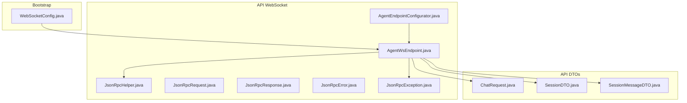
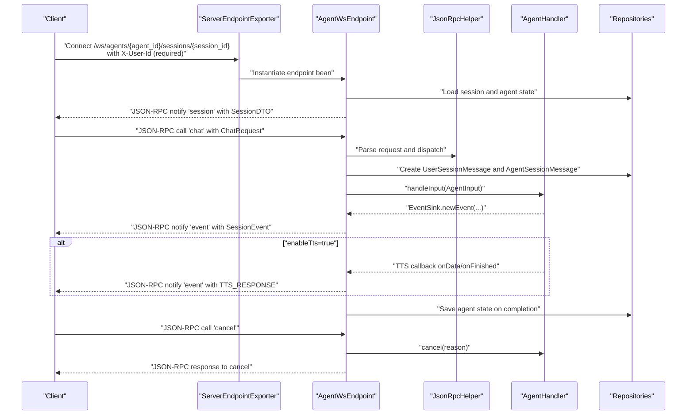
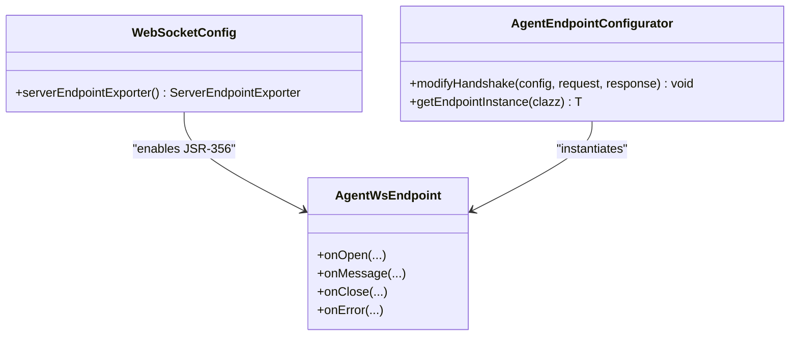
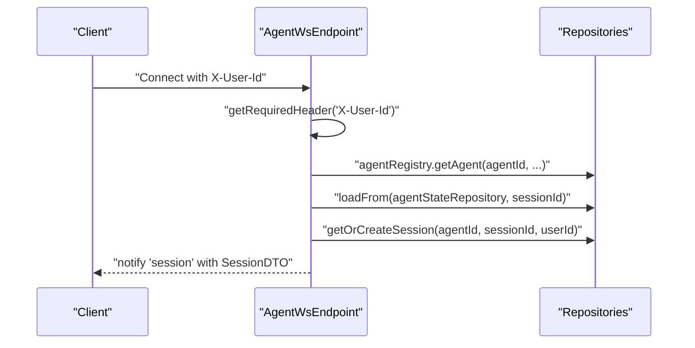
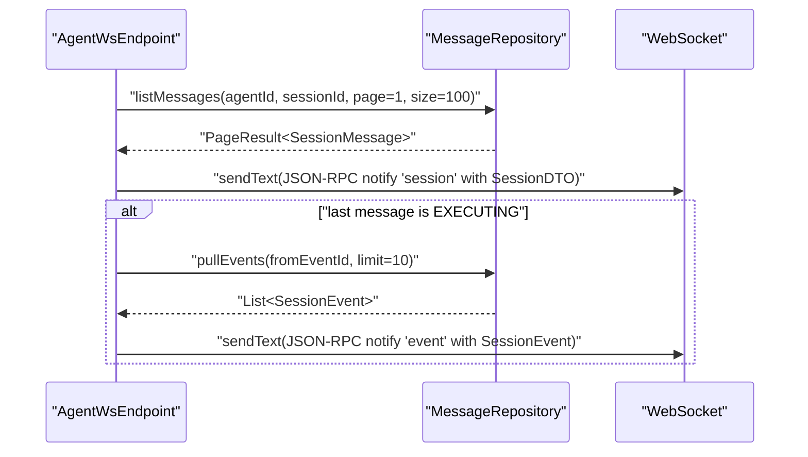
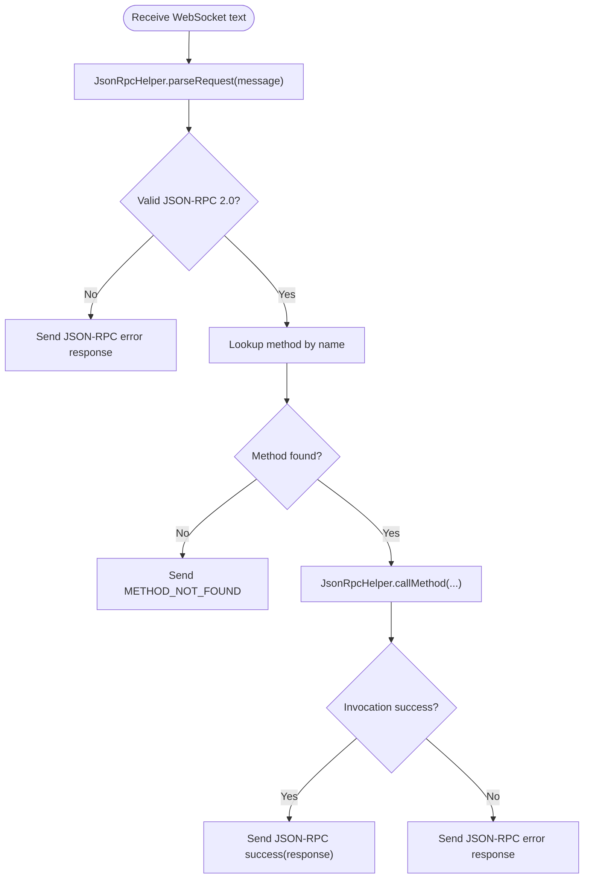
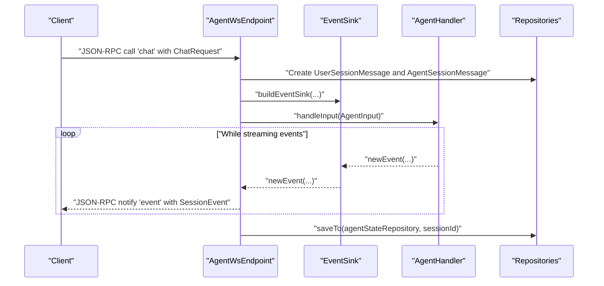
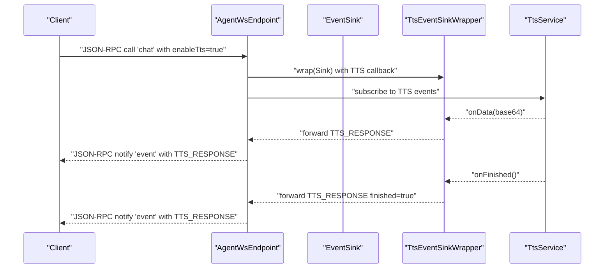
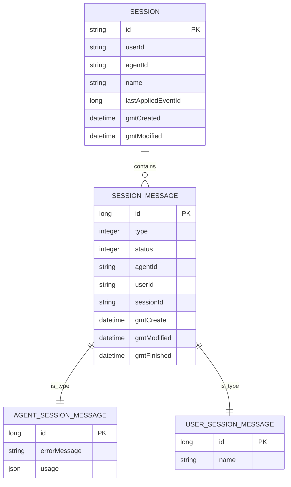
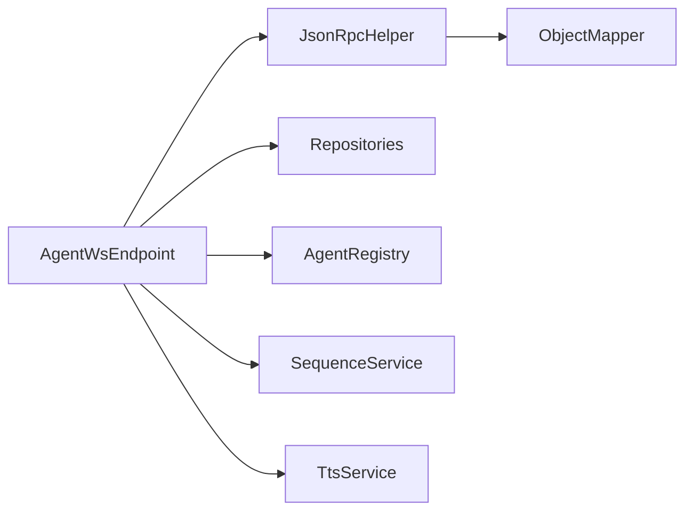

# Agent WebSocket Endpoint

<cite>
**Referenced Files in This Document**
- [WebSocketConfig.java](file://backend_java/bootstrap/src/main/java/com/aliyun/tam/x/tron/config/WebSocketConfig.java)
- [AgentEndpointConfigurator.java](file://backend_java/api/src/main/java/com/aliyun/tam/x/tron/ws/AgentEndpointConfigurator.java)
- [AgentWsEndpoint.java](file://backend_java/api/src/main/java/com/aliyun/tam/x/tron/ws/AgentWsEndpoint.java)
- [JsonRpcHelper.java](file://backend_java/api/src/main/java/com/aliyun/tam/x/tron/ws/jsonrpc/JsonRpcHelper.java)
- [JsonRpcRequest.java](file://backend_java/api/src/main/java/com/aliyun/tam/x/tron/ws/jsonrpc/JsonRpcRequest.java)
- [JsonRpcResponse.java](file://backend_java/api/src/main/java/com/aliyun/tam/x/tron/ws/jsonrpc/JsonRpcResponse.java)
- [JsonRpcError.java](file://backend_java/api/src/main/java/com/aliyun/tam/x/tron/ws/jsonrpc/JsonRpcError.java)
- [JsonRpcException.java](file://backend_java/api/src/main/java/com/aliyun/tam/x/tron/ws/jsonrpc/JsonRpcException.java)
- [ChatRequest.java](file://backend_java/api/src/main/java/com/aliyun/tam/x/tron/api/request/ChatRequest.java)
- [SessionDTO.java](file://backend_java/api/src/main/java/com/aliyun/tam/x/tron/api/dto/SessionDTO.java)
- [SessionMessageDTO.java](file://backend_java/api/src/main/java/com/aliyun/tam/x/tron/api/dto/SessionMessageDTO.java)
</cite>

## Table of Contents
1. [Introduction](#introduction)
2. [Project Structure](#project-structure)
3. [Core Components](#core-components)
4. [Architecture Overview](#architecture-overview)
5. [Detailed Component Analysis](#detailed-component-analysis)
6. [Dependency Analysis](#dependency-analysis)
7. [Performance Considerations](#performance-considerations)
8. [Troubleshooting Guide](#troubleshooting-guide)
9. [Conclusion](#conclusion)
10. [Appendices](#appendices)

## Introduction
This document describes the Agent WebSocket endpoint that enables bidirectional, real-time communication between clients and the AI agent system. It covers connection establishment, authentication, session management, message formats, streaming and event-driven updates, and lifecycle management. It also documents the AgentEndpointConfigurator setup and WebSocket configuration options, along with practical guidance for client implementation, error handling, and reconnection strategies.

## Project Structure
The WebSocket subsystem is implemented in the Java backend module. Key elements include:
- WebSocket configuration enabling JSR-356 endpoints
- A WebSocket endpoint mapped to a path with path parameters for agent and session identifiers
- A JSON-RPC helper for parsing requests, serializing responses, and invoking endpoint methods
- DTOs for session snapshots and messages
- Request DTO for chat inputs

**Diagram sources**
- [WebSocketConfig.java:24-36](file://backend_java/bootstrap/src/main/java/com/aliyun/tam/x/tron/config/WebSocketConfig.java#L24-L36)
- [AgentEndpointConfigurator.java:31-56](file://backend_java/api/src/main/java/com/aliyun/tam/x/tron/ws/AgentEndpointConfigurator.java#L31-L56)
- [AgentWsEndpoint.java:62-64](file://backend_java/api/src/main/java/com/aliyun/tam/x/tron/ws/AgentWsEndpoint.java#L62-L64)
- [JsonRpcHelper.java:38-162](file://backend_java/api/src/main/java/com/aliyun/tam/x/tron/ws/jsonrpc/JsonRpcHelper.java#L38-L162)
- [JsonRpcRequest.java:25-35](file://backend_java/api/src/main/java/com/aliyun/tam/x/tron/ws/jsonrpc/JsonRpcRequest.java#L25-L35)
- [JsonRpcResponse.java:25-42](file://backend_java/api/src/main/java/com/aliyun/tam/x/tron/ws/jsonrpc/JsonRpcResponse.java#L25-L42)
- [JsonRpcError.java:25-44](file://backend_java/api/src/main/java/com/aliyun/tam/x/tron/ws/jsonrpc/JsonRpcError.java#L25-L44)
- [JsonRpcException.java:22-61](file://backend_java/api/src/main/java/com/aliyun/tam/x/tron/ws/jsonrpc/JsonRpcException.java#L22-L61)
- [ChatRequest.java:36-42](file://backend_java/api/src/main/java/com/aliyun/tam/x/tron/api/request/ChatRequest.java#L36-L42)
- [SessionDTO.java:34-76](file://backend_java/api/src/main/java/com/aliyun/tam/x/tron/api/dto/SessionDTO.java#L34-L76)
- [SessionMessageDTO.java:38-101](file://backend_java/api/src/main/java/com/aliyun/tam/x/tron/api/dto/SessionMessageDTO.java#L38-L101)

**Section sources**
- [WebSocketConfig.java:24-36](file://backend_java/bootstrap/src/main/java/com/aliyun/tam/x/tron/config/WebSocketConfig.java#L24-L36)
- [AgentEndpointConfigurator.java:31-56](file://backend_java/api/src/main/java/com/aliyun/tam/x/tron/ws/AgentEndpointConfigurator.java#L31-L56)
- [AgentWsEndpoint.java:62-64](file://backend_java/api/src/main/java/com/aliyun/tam/x/tron/ws/AgentWsEndpoint.java#L62-L64)
- [JsonRpcHelper.java:38-162](file://backend_java/api/src/main/java/com/aliyun/tam/x/tron/ws/jsonrpc/JsonRpcHelper.java#L38-L162)
- [JsonRpcRequest.java:25-35](file://backend_java/api/src/main/java/com/aliyun/tam/x/tron/ws/jsonrpc/JsonRpcRequest.java#L25-L35)
- [JsonRpcResponse.java:25-42](file://backend_java/api/src/main/java/com/aliyun/tam/x/tron/ws/jsonrpc/JsonRpcResponse.java#L25-L42)
- [JsonRpcError.java:25-44](file://backend_java/api/src/main/java/com/aliyun/tam/x/tron/ws/jsonrpc/JsonRpcError.java#L25-L44)
- [JsonRpcException.java:22-61](file://backend_java/api/src/main/java/com/aliyun/tam/x/tron/ws/jsonrpc/JsonRpcException.java#L22-L61)
- [ChatRequest.java:36-42](file://backend_java/api/src/main/java/com/aliyun/tam/x/tron/api/request/ChatRequest.java#L36-L42)
- [SessionDTO.java:34-76](file://backend_java/api/src/main/java/com/aliyun/tam/x/tron/api/dto/SessionDTO.java#L34-L76)
- [SessionMessageDTO.java:38-101](file://backend_java/api/src/main/java/com/aliyun/tam/x/tron/api/dto/SessionMessageDTO.java#L38-L101)

## Core Components
- WebSocket configuration: Enables JSR-356 endpoints via a servlet container exporter.
- Endpoint configurator: Extracts headers and parameters from handshake and delegates endpoint instantiation to Spring’s application context.
- Agent WebSocket endpoint: Implements the WebSocket lifecycle, JSON-RPC method dispatch, session snapshot delivery, event streaming, and optional TTS streaming.
- JSON-RPC helper: Parses incoming requests, serializes responses, and resolves method parameters from context and payload.
- DTOs and requests: Define the shape of session snapshots, messages, and chat inputs.

Key responsibilities:
- Connection establishment and authentication via headers/parameters
- Session snapshot delivery on connect
- Real-time event streaming for agent actions
- Optional TTS audio chunks streamed as notifications
- Lifecycle hooks for open/close/error

**Section sources**
- [WebSocketConfig.java:24-36](file://backend_java/bootstrap/src/main/java/com/aliyun/tam/x/tron/config/WebSocketConfig.java#L24-L36)
- [AgentEndpointConfigurator.java:31-56](file://backend_java/api/src/main/java/com/aliyun/tam/x/tron/ws/AgentEndpointConfigurator.java#L31-L56)
- [AgentWsEndpoint.java:62-64](file://backend_java/api/src/main/java/com/aliyun/tam/x/tron/ws/AgentWsEndpoint.java#L62-L64)
- [JsonRpcHelper.java:38-162](file://backend_java/api/src/main/java/com/aliyun/tam/x/tron/ws/jsonrpc/JsonRpcHelper.java#L38-L162)
- [ChatRequest.java:36-42](file://backend_java/api/src/main/java/com/aliyun/tam/x/tron/api/request/ChatRequest.java#L36-L42)
- [SessionDTO.java:34-76](file://backend_java/api/src/main/java/com/aliyun/tam/x/tron/api/dto/SessionDTO.java#L34-L76)
- [SessionMessageDTO.java:38-101](file://backend_java/api/src/main/java/com/aliyun/tam/x/tron/api/dto/SessionMessageDTO.java#L38-L101)

## Architecture Overview
The Agent WebSocket endpoint follows a JSON-RPC over WebSocket pattern. Clients connect with authentication headers/parameters, receive a session snapshot, and then receive event notifications as the agent processes user input. Optional TTS responses stream audio data as base64-encoded chunks.

**Diagram sources**
- [AgentWsEndpoint.java:116-136](file://backend_java/api/src/main/java/com/aliyun/tam/x/tron/ws/AgentWsEndpoint.java#L116-L136)
- [AgentWsEndpoint.java:156-176](file://backend_java/api/src/main/java/com/aliyun/tam/x/tron/ws/AgentWsEndpoint.java#L156-L176)
- [AgentWsEndpoint.java:222-261](file://backend_java/api/src/main/java/com/aliyun/tam/x/tron/ws/AgentWsEndpoint.java#L222-L261)
- [AgentWsEndpoint.java:277-332](file://backend_java/api/src/main/java/com/aliyun/tam/x/tron/ws/AgentWsEndpoint.java#L277-L332)
- [AgentWsEndpoint.java:334-442](file://backend_java/api/src/main/java/com/aliyun/tam/x/tron/ws/AgentWsEndpoint.java#L334-L442)
- [JsonRpcHelper.java:45-80](file://backend_java/api/src/main/java/com/aliyun/tam/x/tron/ws/jsonrpc/JsonRpcHelper.java#L45-L80)

## Detailed Component Analysis

### WebSocket Configuration and Endpoint Setup
- WebSocketConfig registers a ServerEndpointExporter for servlet environments, enabling annotated endpoints.
- AgentEndpointConfigurator extracts handshake headers and parameters into user properties and delegates endpoint instantiation to Spring’s ApplicationContext.

**Diagram sources**
- [WebSocketConfig.java:24-36](file://backend_java/bootstrap/src/main/java/com/aliyun/tam/x/tron/config/WebSocketConfig.java#L24-L36)
- [AgentEndpointConfigurator.java:31-56](file://backend_java/api/src/main/java/com/aliyun/tam/x/tron/ws/AgentEndpointConfigurator.java#L31-L56)
- [AgentWsEndpoint.java:62-64](file://backend_java/api/src/main/java/com/aliyun/tam/x/tron/ws/AgentWsEndpoint.java#L62-L64)

**Section sources**
- [WebSocketConfig.java:24-36](file://backend_java/bootstrap/src/main/java/com/aliyun/tam/x/tron/config/WebSocketConfig.java#L24-L36)
- [AgentEndpointConfigurator.java:31-56](file://backend_java/api/src/main/java/com/aliyun/tam/x/tron/ws/AgentEndpointConfigurator.java#L31-L56)
- [AgentWsEndpoint.java:62-64](file://backend_java/api/src/main/java/com/aliyun/tam/x/tron/ws/AgentWsEndpoint.java#L62-L64)

### Connection Establishment and Authentication
- Path parameters: agent_id and session_id define the endpoint route.
- Authentication: X-User-Id header is required; X-User-Name is optional and falls back to user ID if absent.
- On open: The endpoint loads the agent handler and session, sends a session snapshot, and starts streaming pending events if an EXECUTING agent message exists.

**Diagram sources**
- [AgentWsEndpoint.java:116-136](file://backend_java/api/src/main/java/com/aliyun/tam/x/tron/ws/AgentWsEndpoint.java#L116-L136)
- [AgentWsEndpoint.java:458-505](file://backend_java/api/src/main/java/com/aliyun/tam/x/tron/ws/AgentWsEndpoint.java#L458-L505)
- [AgentWsEndpoint.java:507-522](file://backend_java/api/src/main/java/com/aliyun/tam/x/tron/ws/AgentWsEndpoint.java#L507-L522)

**Section sources**
- [AgentWsEndpoint.java:116-136](file://backend_java/api/src/main/java/com/aliyun/tam/x/tron/ws/AgentWsEndpoint.java#L116-L136)
- [AgentWsEndpoint.java:458-505](file://backend_java/api/src/main/java/com/aliyun/tam/x/tron/ws/AgentWsEndpoint.java#L458-L505)
- [AgentWsEndpoint.java:507-522](file://backend_java/api/src/main/java/com/aliyun/tam/x/tron/ws/AgentWsEndpoint.java#L507-L522)

### Session Snapshot Delivery
- On connect, the endpoint fetches recent messages and sends a JSON-RPC notification named "session" containing a SessionDTO.
- If the last message is EXECUTING, the endpoint streams subsequent events until the agent message status changes.

**Diagram sources**
- [AgentWsEndpoint.java:138-176](file://backend_java/api/src/main/java/com/aliyun/tam/x/tron/ws/AgentWsEndpoint.java#L138-L176)
- [SessionDTO.java:34-76](file://backend_java/api/src/main/java/com/aliyun/tam/x/tron/api/dto/SessionDTO.java#L34-L76)

**Section sources**
- [AgentWsEndpoint.java:138-176](file://backend_java/api/src/main/java/com/aliyun/tam/x/tron/ws/AgentWsEndpoint.java#L138-L176)
- [SessionDTO.java:34-76](file://backend_java/api/src/main/java/com/aliyun/tam/x/tron/api/dto/SessionDTO.java#L34-L76)

### JSON-RPC Protocol and Method Dispatch
- Requests: JSON-RPC 2.0 with id, method, and params.
- Responses: JSON-RPC 2.0 with id, result, or error.
- Methods: Registered methods include "chat" and "cancel".
- Dispatch: JsonRpcHelper parses requests, resolves parameters from context and payload, and invokes the corresponding endpoint method.

**Diagram sources**
- [JsonRpcHelper.java:45-80](file://backend_java/api/src/main/java/com/aliyun/tam/x/tron/ws/jsonrpc/JsonRpcHelper.java#L45-L80)
- [JsonRpcHelper.java:103-136](file://backend_java/api/src/main/java/com/aliyun/tam/x/tron/ws/jsonrpc/JsonRpcHelper.java#L103-L136)
- [JsonRpcRequest.java:25-35](file://backend_java/api/src/main/java/com/aliyun/tam/x/tron/ws/jsonrpc/JsonRpcRequest.java#L25-L35)
- [JsonRpcResponse.java:25-42](file://backend_java/api/src/main/java/com/aliyun/tam/x/tron/ws/jsonrpc/JsonRpcResponse.java#L25-L42)
- [JsonRpcError.java:25-44](file://backend_java/api/src/main/java/com/aliyun/tam/x/tron/ws/jsonrpc/JsonRpcError.java#L25-L44)

**Section sources**
- [JsonRpcHelper.java:45-80](file://backend_java/api/src/main/java/com/aliyun/tam/x/tron/ws/jsonrpc/JsonRpcHelper.java#L45-L80)
- [JsonRpcHelper.java:103-136](file://backend_java/api/src/main/java/com/aliyun/tam/x/tron/ws/jsonrpc/JsonRpcHelper.java#L103-L136)
- [JsonRpcRequest.java:25-35](file://backend_java/api/src/main/java/com/aliyun/tam/x/tron/ws/jsonrpc/JsonRpcRequest.java#L25-L35)
- [JsonRpcResponse.java:25-42](file://backend_java/api/src/main/java/com/aliyun/tam/x/tron/ws/jsonrpc/JsonRpcResponse.java#L25-L42)
- [JsonRpcError.java:25-44](file://backend_java/api/src/main/java/com/aliyun/tam/x/tron/ws/jsonrpc/JsonRpcError.java#L25-L44)

### Chat Workflow and Event Streaming
- Method "chat": Accepts a ChatRequest with input contents and optional enableTts flag.
- Behavior: Creates user and agent session messages, builds an EventSink, and delegates to AgentHandler. Events are streamed back to the client as JSON-RPC notifications named "event".
- Concurrency: Uses a thread pool to process chat requests and stream events.
- Completion: Saves agent state after processing completes.

**Diagram sources**
- [AgentWsEndpoint.java:277-332](file://backend_java/api/src/main/java/com/aliyun/tam/x/tron/ws/AgentWsEndpoint.java#L277-L332)
- [AgentWsEndpoint.java:334-442](file://backend_java/api/src/main/java/com/aliyun/tam/x/tron/ws/AgentWsEndpoint.java#L334-L442)
- [ChatRequest.java:36-42](file://backend_java/api/src/main/java/com/aliyun/tam/x/tron/api/request/ChatRequest.java#L36-L42)

**Section sources**
- [AgentWsEndpoint.java:277-332](file://backend_java/api/src/main/java/com/aliyun/tam/x/tron/ws/AgentWsEndpoint.java#L277-L332)
- [AgentWsEndpoint.java:334-442](file://backend_java/api/src/main/java/com/aliyun/tam/x/tron/ws/AgentWsEndpoint.java#L334-L442)
- [ChatRequest.java:36-42](file://backend_java/api/src/main/java/com/aliyun/tam/x/tron/api/request/ChatRequest.java#L36-L42)

### TTS Streaming
- When ChatRequest.enableTts is true, the EventSink is wrapped with a TTS wrapper.
- The TTS callback emits base64 audio chunks and completion/failure notifications as JSON-RPC notifications named "event" with a custom event type for TTS_RESPONSE.

**Diagram sources**
- [AgentWsEndpoint.java:386-442](file://backend_java/api/src/main/java/com/aliyun/tam/x/tron/ws/AgentWsEndpoint.java#L386-L442)

**Section sources**
- [AgentWsEndpoint.java:386-442](file://backend_java/api/src/main/java/com/aliyun/tam/x/tron/ws/AgentWsEndpoint.java#L386-L442)

### Cancel Operation
- Method "cancel": Cancels the current agent operation with a reason message and logs the cancellation.

**Section sources**
- [AgentWsEndpoint.java:444-447](file://backend_java/api/src/main/java/com/aliyun/tam/x/tron/ws/AgentWsEndpoint.java#L444-L447)

### Message Formats

- JSON-RPC 2.0 request envelope:
  - Fields: jsonrpc, id, method, params
  - Validation: id must be string/number; method must be present; params must be object or array/list

- JSON-RPC 2.0 response envelope:
  - Success: id, result
  - Error: id, error with code/message/data

- Session snapshot (notification "session"):
  - Contains session metadata and a paginated list of messages as SessionMessageDTO

- Event notifications (notification "event"):
  - Contains a SessionEvent; when TTS is enabled, a special TTS_RESPONSE event carries audio data or completion status

- Chat request (call "chat"):
  - input: array of ContentDTO-like structures
  - enableTts: boolean

**Diagram sources**
- [SessionDTO.java:34-76](file://backend_java/api/src/main/java/com/aliyun/tam/x/tron/api/dto/SessionDTO.java#L34-L76)
- [SessionMessageDTO.java:38-101](file://backend_java/api/src/main/java/com/aliyun/tam/x/tron/api/dto/SessionMessageDTO.java#L38-L101)

**Section sources**
- [JsonRpcRequest.java:25-35](file://backend_java/api/src/main/java/com/aliyun/tam/x/tron/ws/jsonrpc/JsonRpcRequest.java#L25-L35)
- [JsonRpcResponse.java:25-42](file://backend_java/api/src/main/java/com/aliyun/tam/x/tron/ws/jsonrpc/JsonRpcResponse.java#L25-L42)
- [JsonRpcError.java:25-44](file://backend_java/api/src/main/java/com/aliyun/tam/x/tron/ws/jsonrpc/JsonRpcError.java#L25-L44)
- [SessionDTO.java:34-76](file://backend_java/api/src/main/java/com/aliyun/tam/x/tron/api/dto/SessionDTO.java#L34-L76)
- [SessionMessageDTO.java:38-101](file://backend_java/api/src/main/java/com/aliyun/tam/x/tron/api/dto/SessionMessageDTO.java#L38-L101)
- [ChatRequest.java:36-42](file://backend_java/api/src/main/java/com/aliyun/tam/x/tron/api/request/ChatRequest.java#L36-L42)

## Dependency Analysis
- Endpoint depends on Spring-managed services for repositories, agent registry, sequence generation, and TTS.
- JSON-RPC helper depends on Jackson ObjectMapper for serialization/deserialization.
- Event streaming relies on EventRepository for pulling incremental events and persistence for saving agent state.

**Diagram sources**
- [AgentWsEndpoint.java:66-80](file://backend_java/api/src/main/java/com/aliyun/tam/x/tron/ws/AgentWsEndpoint.java#L66-L80)
- [JsonRpcHelper.java:43](file://backend_java/api/src/main/java/com/aliyun/tam/x/tron/ws/jsonrpc/JsonRpcHelper.java#L43)

**Section sources**
- [AgentWsEndpoint.java:66-80](file://backend_java/api/src/main/java/com/aliyun/tam/x/tron/ws/AgentWsEndpoint.java#L66-L80)
- [JsonRpcHelper.java:43](file://backend_java/api/src/main/java/com/aliyun/tam/x/tron/ws/jsonrpc/JsonRpcHelper.java#L43)

## Performance Considerations
- Concurrency: A bounded thread pool processes chat requests and event streaming to avoid resource exhaustion.
- Backpressure: Event polling uses a small fixed-size batch and a short sleep interval to balance latency and CPU usage.
- Serialization: JSON-RPC serialization errors are handled gracefully by emitting fallback error responses.
- Locking: A per-endpoint send lock ensures serialized writes to the WebSocket.

Recommendations:
- Tune thread pool sizes and queue capacity based on expected concurrent sessions.
- Monitor event pull intervals and adjust batch size for high-throughput scenarios.
- Consider compression for large payloads and frequent TTS chunks.

**Section sources**
- [AgentWsEndpoint.java:93-104](file://backend_java/api/src/main/java/com/aliyun/tam/x/tron/ws/AgentWsEndpoint.java#L93-L104)
- [AgentWsEndpoint.java:184-219](file://backend_java/api/src/main/java/com/aliyun/tam/x/tron/ws/AgentWsEndpoint.java#L184-L219)
- [JsonRpcHelper.java:82-101](file://backend_java/api/src/main/java/com/aliyun/tam/x/tron/ws/jsonrpc/JsonRpcHelper.java#L82-L101)

## Troubleshooting Guide
Common issues and resolutions:
- Missing authentication header: The endpoint requires X-User-Id; missing or duplicated values cause immediate failure during handshake.
- Method not found: Sending an unknown method yields a JSON-RPC METHOD_NOT_FOUND error.
- Internal errors: Exceptions during request processing emit JSON-RPC INTERNAL_ERROR responses.
- Serialization failures: JSON-RPC serialization errors are caught and converted to error responses.
- Connection errors: On error, the endpoint logs and closes the session.

Operational tips:
- Validate JSON-RPC envelopes before sending.
- Implement client-side retry with exponential backoff for transient failures.
- Close connections cleanly on the client to trigger state saves on the server.

**Section sources**
- [AgentWsEndpoint.java:458-505](file://backend_java/api/src/main/java/com/aliyun/tam/x/tron/ws/AgentWsEndpoint.java#L458-L505)
- [AgentWsEndpoint.java:222-261](file://backend_java/api/src/main/java/com/aliyun/tam/x/tron/ws/AgentWsEndpoint.java#L222-L261)
- [JsonRpcError.java:25-44](file://backend_java/api/src/main/java/com/aliyun/tam/x/tron/ws/jsonrpc/JsonRpcError.java#L25-L44)
- [JsonRpcException.java:54-60](file://backend_java/api/src/main/java/com/aliyun/tam/x/tron/ws/jsonrpc/JsonRpcException.java#L54-L60)
- [AgentWsEndpoint.java:271-275](file://backend_java/api/src/main/java/com/aliyun/tam/x/tron/ws/AgentWsEndpoint.java#L271-L275)

## Conclusion
The Agent WebSocket endpoint provides a robust, JSON-RPC-based bidirectional channel for real-time interaction with the AI agent system. It supports session snapshots, event-driven updates, optional TTS streaming, and structured error handling. Proper client-side reconnection and retry logic, combined with careful tuning of concurrency and event streaming, will yield a responsive and resilient user experience.

## Appendices

### WebSocket Configuration Options
- Endpoint path: /ws/agents/{agent_id}/sessions/{session_id}
- Required headers: X-User-Id
- Optional headers: X-User-Name (fallback to X-User-Id if omitted)
- Authentication mechanism: Header-based; no token exchange is implemented in the endpoint

**Section sources**
- [AgentWsEndpoint.java:116-136](file://backend_java/api/src/main/java/com/aliyun/tam/x/tron/ws/AgentWsEndpoint.java#L116-L136)
- [AgentEndpointConfigurator.java:36-45](file://backend_java/api/src/main/java/com/aliyun/tam/x/tron/ws/AgentEndpointConfigurator.java#L36-L45)

### Practical Client Implementation Notes
- Connect to the endpoint with the required headers and path parameters.
- On connect, expect a "session" notification with the latest messages.
- Send "chat" requests with input contents; optionally set enableTts to receive TTS_RESPONSE events.
- Subscribe to "event" notifications for agent actions and state changes.
- Implement reconnection with backoff; persist local state to resume after reconnect.

[No sources needed since this section provides general guidance]