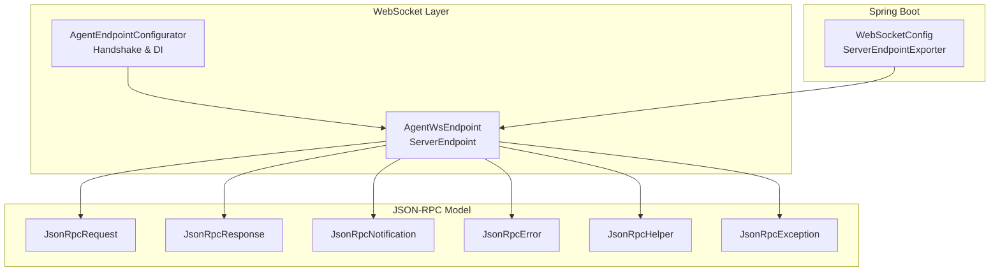
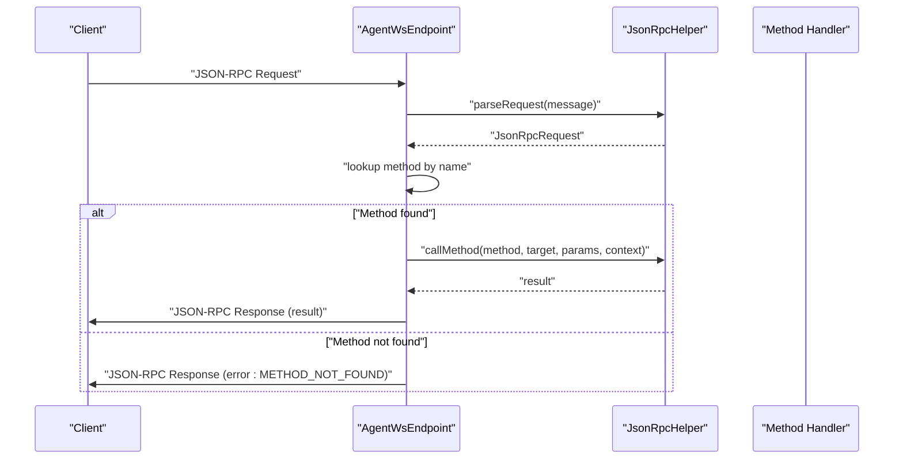
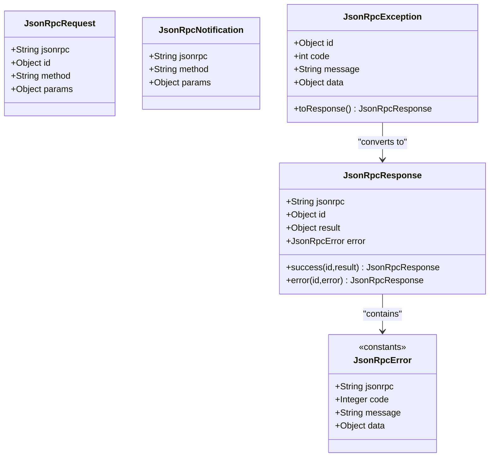
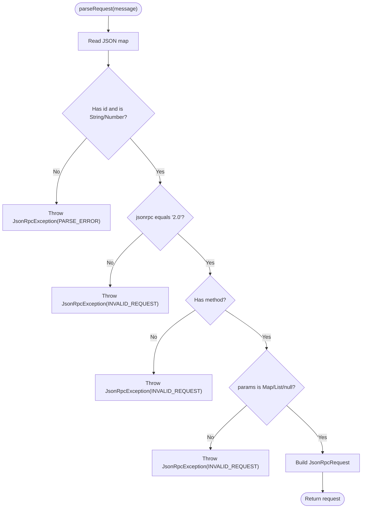
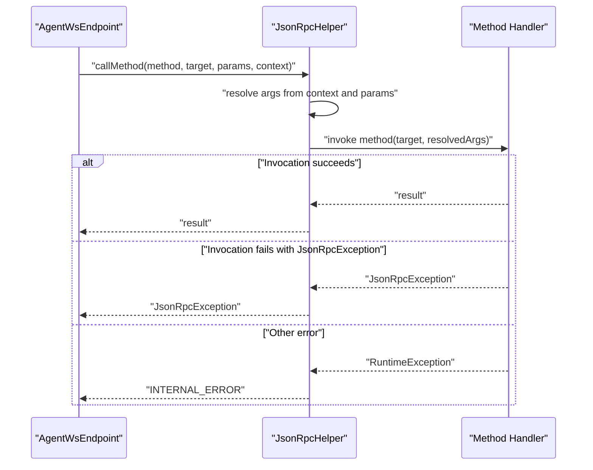
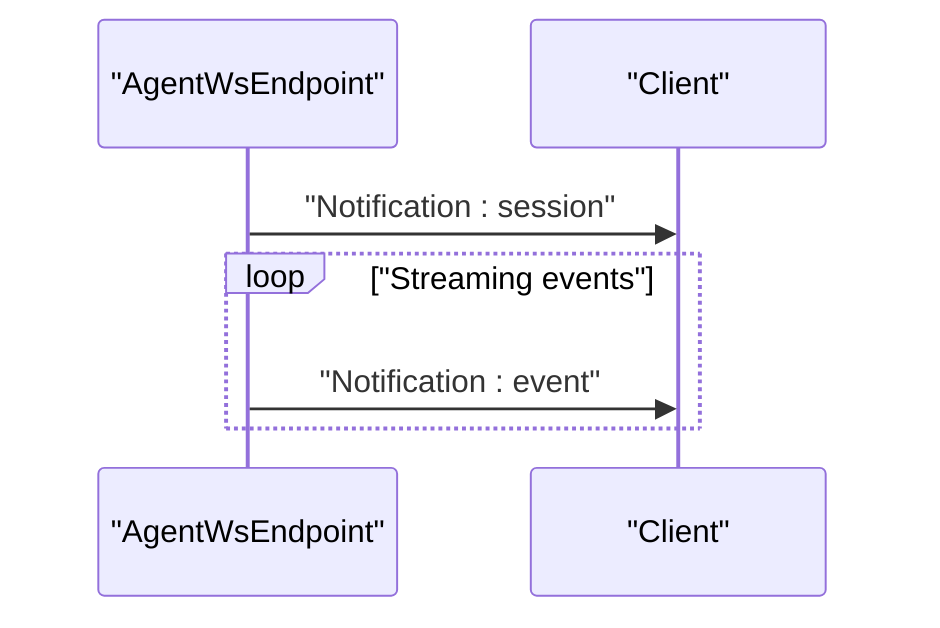
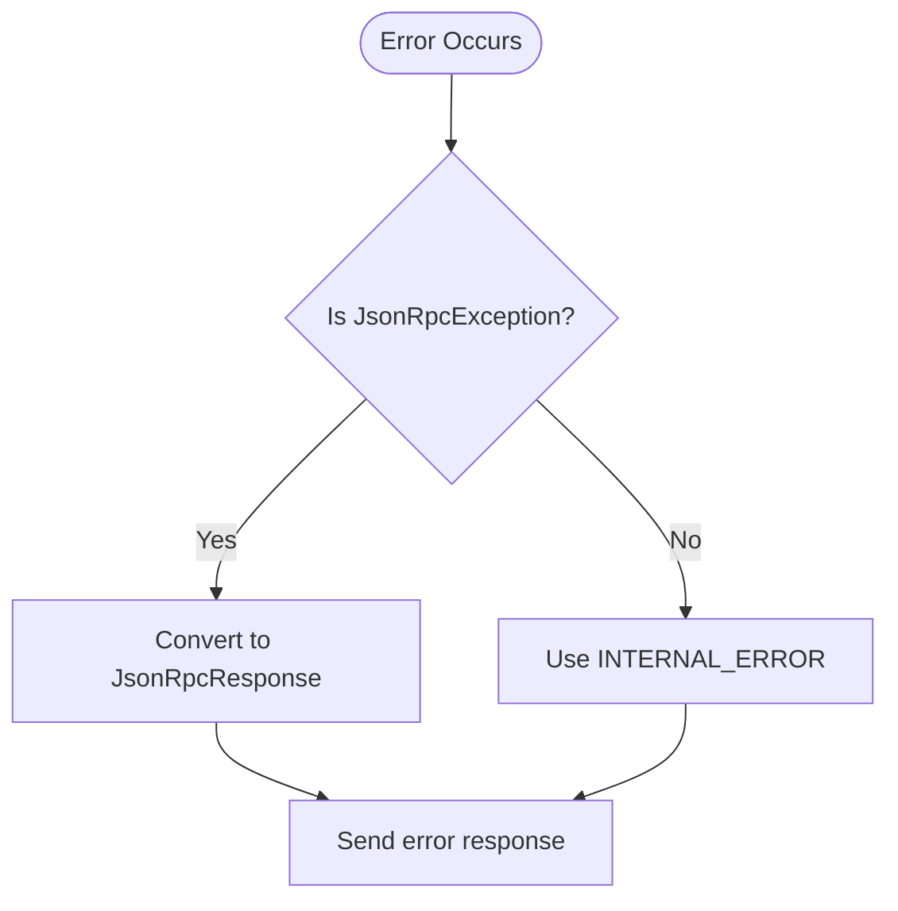
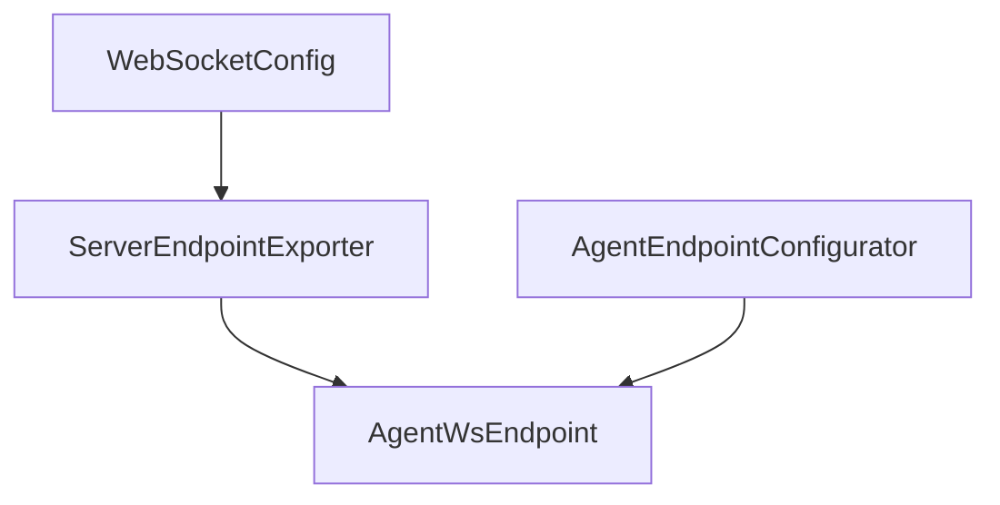
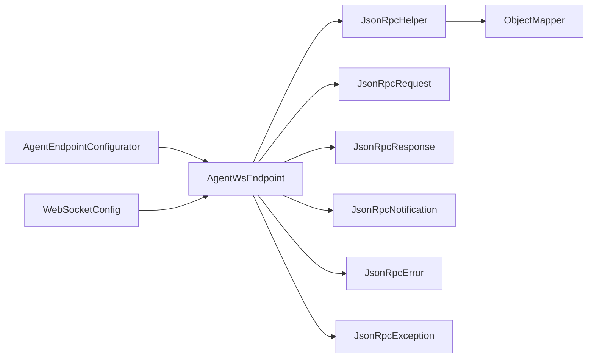

# JSON-RPC Protocol

<cite>
**Referenced Files in This Document**
- [JsonRpc.java](file://backend_java/api/src/main/java/com/aliyun/tam/x/tron/ws/jsonrpc/JsonRpc.java)
- [JsonRpcRequest.java](file://backend_java/api/src/main/java/com/aliyun/tam/x/tron/ws/jsonrpc/JsonRpcRequest.java)
- [JsonRpcResponse.java](file://backend_java/api/src/main/java/com/aliyun/tam/x/tron/ws/jsonrpc/JsonRpcResponse.java)
- [JsonRpcNotification.java](file://backend_java/api/src/main/java/com/aliyun/tam/x/tron/ws/jsonrpc/JsonRpcNotification.java)
- [JsonRpcError.java](file://backend_java/api/src/main/java/com/aliyun/tam/x/tron/ws/jsonrpc/JsonRpcError.java)
- [JsonRpcException.java](file://backend_java/api/src/main/java/com/aliyun/tam/x/tron/ws/jsonrpc/JsonRpcException.java)
- [JsonRpcHelper.java](file://backend_java/api/src/main/java/com/aliyun/tam/x/tron/ws/jsonrpc/JsonRpcHelper.java)
- [AgentWsEndpoint.java](file://backend_java/api/src/main/java/com/aliyun/tam/x/tron/ws/AgentWsEndpoint.java)
- [AgentEndpointConfigurator.java](file://backend_java/api/src/main/java/com/aliyun/tam/x/tron/ws/AgentEndpointConfigurator.java)
- [WebSocketConfig.java](file://backend_java/bootstrap/src/main/java/com/aliyun/tam/x/tron/config/WebSocketConfig.java)
</cite>

## Table of Contents
1. [Introduction](#introduction)
2. [Project Structure](#project-structure)
3. [Core Components](#core-components)
4. [Architecture Overview](#architecture-overview)
5. [Detailed Component Analysis](#detailed-component-analysis)
6. [Dependency Analysis](#dependency-analysis)
7. [Performance Considerations](#performance-considerations)
8. [Troubleshooting Guide](#troubleshooting-guide)
9. [Conclusion](#conclusion)

## Introduction
This document specifies the JSON-RPC 2.0-based WebSocket protocol used by the Agent WebSocket endpoint. It defines request and response formats, method definitions, error handling, notification-based messaging, and method invocation patterns. It also documents the JsonRpcHelper utility functions, error code definitions, and protocol versioning considerations. Practical examples are provided via code snippet paths to guide request construction, response parsing, and error handling strategies.

## Project Structure
The JSON-RPC WebSocket stack is implemented in the Java backend module under the ws and ws.jsonrpc packages. The Agent WebSocket endpoint registers JSON-RPC methods and handles requests and notifications over a WebSocket transport. The configuration enables ServerEndpoint registration for servlet environments.

**Diagram sources**
- [AgentWsEndpoint.java:62-136](file://backend_java/api/src/main/java/com/aliyun/tam/x/tron/ws/AgentWsEndpoint.java#L62-L136)
- [AgentEndpointConfigurator.java:31-55](file://backend_java/api/src/main/java/com/aliyun/tam/x/tron/ws/AgentEndpointConfigurator.java#L31-L55)
- [WebSocketConfig.java:24-36](file://backend_java/bootstrap/src/main/java/com/aliyun/tam/x/tron/config/WebSocketConfig.java#L24-L36)
- [JsonRpcRequest.java:23-35](file://backend_java/api/src/main/java/com/aliyun/tam/x/tron/ws/jsonrpc/JsonRpcRequest.java#L23-L35)
- [JsonRpcResponse.java:23-42](file://backend_java/api/src/main/java/com/aliyun/tam/x/tron/ws/jsonrpc/JsonRpcResponse.java#L23-L42)
- [JsonRpcNotification.java:23-32](file://backend_java/api/src/main/java/com/aliyun/tam/x/tron/ws/jsonrpc/JsonRpcNotification.java#L23-L32)
- [JsonRpcError.java:23-44](file://backend_java/api/src/main/java/com/aliyun/tam/x/tron/ws/jsonrpc/JsonRpcError.java#L23-L44)
- [JsonRpcHelper.java:38-161](file://backend_java/api/src/main/java/com/aliyun/tam/x/tron/ws/jsonrpc/JsonRpcHelper.java#L38-L161)
- [JsonRpcException.java:22-61](file://backend_java/api/src/main/java/com/aliyun/tam/x/tron/ws/jsonrpc/JsonRpcException.java#L22-L61)

**Section sources**
- [AgentWsEndpoint.java:62-136](file://backend_java/api/src/main/java/com/aliyun/tam/x/tron/ws/AgentWsEndpoint.java#L62-L136)
- [AgentEndpointConfigurator.java:31-55](file://backend_java/api/src/main/java/com/aliyun/tam/x/tron/ws/AgentEndpointConfigurator.java#L31-L55)
- [WebSocketConfig.java:24-36](file://backend_java/bootstrap/src/main/java/com/aliyun/tam/x/tron/config/WebSocketConfig.java#L24-L36)

## Core Components
- JsonRpc: Marker interface for JSON-RPC payload types.
- JsonRpcRequest: Request envelope with jsonrpc, id, method, and optional params.
- JsonRpcResponse: Response envelope with jsonrpc, id, and either result or error.
- JsonRpcNotification: Notification envelope with jsonrpc, method, and optional params.
- JsonRpcError: Error envelope with jsonrpc, code, message, and optional data.
- JsonRpcException: Exception bridging runtime errors to JSON-RPC responses.
- JsonRpcHelper: Utility for parsing requests, serializing responses, and invoking methods with parameter resolution.

Key behaviors:
- All envelopes carry the JSON-RPC version field set to "2.0".
- Requests require a non-null id of type string or number; otherwise a parse error is raised.
- Responses always include the id from the matching request.
- Notifications are sent without an id and do not expect a response.

**Section sources**
- [JsonRpc.java:19-20](file://backend_java/api/src/main/java/com/aliyun/tam/x/tron/ws/jsonrpc/JsonRpc.java#L19-L20)
- [JsonRpcRequest.java:23-35](file://backend_java/api/src/main/java/com/aliyun/tam/x/tron/ws/jsonrpc/JsonRpcRequest.java#L23-L35)
- [JsonRpcResponse.java:23-42](file://backend_java/api/src/main/java/com/aliyun/tam/x/tron/ws/jsonrpc/JsonRpcResponse.java#L23-L42)
- [JsonRpcNotification.java:23-32](file://backend_java/api/src/main/java/com/aliyun/tam/x/tron/ws/jsonrpc/JsonRpcNotification.java#L23-L32)
- [JsonRpcError.java:23-44](file://backend_java/api/src/main/java/com/aliyun/tam/x/tron/ws/jsonrpc/JsonRpcError.java#L23-L44)
- [JsonRpcException.java:22-61](file://backend_java/api/src/main/java/com/aliyun/tam/x/tron/ws/jsonrpc/JsonRpcException.java#L22-L61)
- [JsonRpcHelper.java:38-161](file://backend_java/api/src/main/java/com/aliyun/tam/x/tron/ws/jsonrpc/JsonRpcHelper.java#L38-L161)

## Architecture Overview
The Agent WebSocket endpoint exposes a JSON-RPC 2.0 interface over a WebSocket. The server parses incoming JSON messages, resolves methods by name, invokes handlers, and sends either responses or notifications. The helper centralizes parsing, serialization, and parameter binding.

**Diagram sources**
- [AgentWsEndpoint.java:222-261](file://backend_java/api/src/main/java/com/aliyun/tam/x/tron/ws/AgentWsEndpoint.java#L222-L261)
- [JsonRpcHelper.java:45-80](file://backend_java/api/src/main/java/com/aliyun/tam/x/tron/ws/jsonrpc/JsonRpcHelper.java#L45-L80)
- [JsonRpcHelper.java:103-136](file://backend_java/api/src/main/java/com/aliyun/tam/x/tron/ws/jsonrpc/JsonRpcHelper.java#L103-L136)
- [JsonRpcError.java:26-33](file://backend_java/api/src/main/java/com/aliyun/tam/x/tron/ws/jsonrpc/JsonRpcError.java#L26-L33)

## Detailed Component Analysis

### JSON-RPC Envelope Types
- JsonRpcRequest: Defines the request envelope with mandatory fields and optional params.
- JsonRpcResponse: Factory methods produce success or error responses; always includes id.
- JsonRpcNotification: Defines fire-and-forget notifications with method and params.
- JsonRpcError: Standardized error codes and structure for RPC errors.
- JsonRpcException: Bridges exceptions to JSON-RPC error responses.

**Diagram sources**
- [JsonRpcRequest.java:23-35](file://backend_java/api/src/main/java/com/aliyun/tam/x/tron/ws/jsonrpc/JsonRpcRequest.java#L23-L35)
- [JsonRpcResponse.java:23-42](file://backend_java/api/src/main/java/com/aliyun/tam/x/tron/ws/jsonrpc/JsonRpcResponse.java#L23-L42)
- [JsonRpcNotification.java:23-32](file://backend_java/api/src/main/java/com/aliyun/tam/x/tron/ws/jsonrpc/JsonRpcNotification.java#L23-L32)
- [JsonRpcError.java:23-44](file://backend_java/api/src/main/java/com/aliyun/tam/x/tron/ws/jsonrpc/JsonRpcError.java#L23-L44)
- [JsonRpcException.java:22-61](file://backend_java/api/src/main/java/com/aliyun/tam/x/tron/ws/jsonrpc/JsonRpcException.java#L22-L61)

**Section sources**
- [JsonRpcRequest.java:23-35](file://backend_java/api/src/main/java/com/aliyun/tam/x/tron/ws/jsonrpc/JsonRpcRequest.java#L23-L35)
- [JsonRpcResponse.java:23-42](file://backend_java/api/src/main/java/com/aliyun/tam/x/tron/ws/jsonrpc/JsonRpcResponse.java#L23-L42)
- [JsonRpcNotification.java:23-32](file://backend_java/api/src/main/java/com/aliyun/tam/x/tron/ws/jsonrpc/JsonRpcNotification.java#L23-L32)
- [JsonRpcError.java:23-44](file://backend_java/api/src/main/java/com/aliyun/tam/x/tron/ws/jsonrpc/JsonRpcError.java#L23-L44)
- [JsonRpcException.java:22-61](file://backend_java/api/src/main/java/com/aliyun/tam/x/tron/ws/jsonrpc/JsonRpcException.java#L22-L61)

### JsonRpcHelper: Parsing, Serialization, and Invocation
- parseRequest(message): Validates jsonrpc version, id type, method presence, and params shape; throws JsonRpcException on parse errors.
- serialize(jsonRpc): Serializes envelopes; on serialization failure during response building, returns an internal error response.
- callMethod(method, target, args, context): Resolves arguments from a context map and/or positional/keyword params; converts types using Jackson.

**Diagram sources**
- [JsonRpcHelper.java:45-80](file://backend_java/api/src/main/java/com/aliyun/tam/x/tron/ws/jsonrpc/JsonRpcHelper.java#L45-L80)
- [JsonRpcError.java:26-33](file://backend_java/api/src/main/java/com/aliyun/tam/x/tron/ws/jsonrpc/JsonRpcError.java#L26-L33)

**Section sources**
- [JsonRpcHelper.java:45-101](file://backend_java/api/src/main/java/com/aliyun/tam/x/tron/ws/jsonrpc/JsonRpcHelper.java#L45-L101)
- [JsonRpcHelper.java:103-161](file://backend_java/api/src/main/java/com/aliyun/tam/x/tron/ws/jsonrpc/JsonRpcHelper.java#L103-L161)

### Method Registration and Invocation
- Methods are registered by name-to-method-name mapping and invoked reflectively.
- Parameters are resolved from a context map and/or from positional/keyword params in the request.
- Exceptions thrown by handlers are caught and converted to JSON-RPC error responses.

**Diagram sources**
- [AgentWsEndpoint.java:222-261](file://backend_java/api/src/main/java/com/aliyun/tam/x/tron/ws/AgentWsEndpoint.java#L222-L261)
- [JsonRpcHelper.java:103-136](file://backend_java/api/src/main/java/com/aliyun/tam/x/tron/ws/jsonrpc/JsonRpcHelper.java#L103-L136)
- [JsonRpcException.java:54-60](file://backend_java/api/src/main/java/com/aliyun/tam/x/tron/ws/jsonrpc/JsonRpcException.java#L54-L60)

**Section sources**
- [AgentWsEndpoint.java:82-91](file://backend_java/api/src/main/java/com/aliyun/tam/x/tron/ws/AgentWsEndpoint.java#L82-L91)
- [AgentWsEndpoint.java:222-261](file://backend_java/api/src/main/java/com/aliyun/tam/x/tron/ws/AgentWsEndpoint.java#L222-L261)
- [JsonRpcHelper.java:103-136](file://backend_java/api/src/main/java/com/aliyun/tam/x/tron/ws/jsonrpc/JsonRpcHelper.java#L103-L136)

### Notifications and Event Streaming
- The endpoint sends notifications for session snapshots and streaming events.
- Notifications are sent without expecting a response; clients should treat them as advisory updates.

**Diagram sources**
- [AgentWsEndpoint.java:138-176](file://backend_java/api/src/main/java/com/aliyun/tam/x/tron/ws/AgentWsEndpoint.java#L138-L176)
- [AgentWsEndpoint.java:178-220](file://backend_java/api/src/main/java/com/aliyun/tam/x/tron/ws/AgentWsEndpoint.java#L178-L220)

**Section sources**
- [AgentWsEndpoint.java:138-176](file://backend_java/api/src/main/java/com/aliyun/tam/x/tron/ws/AgentWsEndpoint.java#L138-L176)
- [AgentWsEndpoint.java:178-220](file://backend_java/api/src/main/java/com/aliyun/tam/x/tron/ws/AgentWsEndpoint.java#L178-L220)

### Error Handling and Codes
- Standard JSON-RPC 2.0 error codes are defined for parse errors, invalid requests, method not found, invalid params, and internal errors.
- Server-specific error range is defined for application-level errors.
- JsonRpcException carries id, code, message, and optional data; can be converted to a JsonRpcResponse.

**Diagram sources**
- [JsonRpcError.java:26-33](file://backend_java/api/src/main/java/com/aliyun/tam/x/tron/ws/jsonrpc/JsonRpcError.java#L26-L33)
- [JsonRpcException.java:54-60](file://backend_java/api/src/main/java/com/aliyun/tam/x/tron/ws/jsonrpc/JsonRpcException.java#L54-L60)
- [AgentWsEndpoint.java:246-260](file://backend_java/api/src/main/java/com/aliyun/tam/x/tron/ws/AgentWsEndpoint.java#L246-L260)

**Section sources**
- [JsonRpcError.java:26-33](file://backend_java/api/src/main/java/com/aliyun/tam/x/tron/ws/jsonrpc/JsonRpcError.java#L26-L33)
- [JsonRpcException.java:54-60](file://backend_java/api/src/main/java/com/aliyun/tam/x/tron/ws/jsonrpc/JsonRpcException.java#L54-L60)
- [AgentWsEndpoint.java:246-260](file://backend_java/api/src/main/java/com/aliyun/tam/x/tron/ws/AgentWsEndpoint.java#L246-L260)

### WebSocket Transport and Configuration
- The endpoint is a ServerEndpoint with a custom configurator that captures headers and parameters for downstream use.
- Spring configuration exposes a ServerEndpointExporter for servlet environments.

**Diagram sources**
- [WebSocketConfig.java:24-36](file://backend_java/bootstrap/src/main/java/com/aliyun/tam/x/tron/config/WebSocketConfig.java#L24-L36)
- [AgentEndpointConfigurator.java:31-55](file://backend_java/api/src/main/java/com/aliyun/tam/x/tron/ws/AgentEndpointConfigurator.java#L31-L55)
- [AgentWsEndpoint.java:62-136](file://backend_java/api/src/main/java/com/aliyun/tam/x/tron/ws/AgentWsEndpoint.java#L62-L136)

**Section sources**
- [WebSocketConfig.java:24-36](file://backend_java/bootstrap/src/main/java/com/aliyun/tam/x/tron/config/WebSocketConfig.java#L24-L36)
- [AgentEndpointConfigurator.java:31-55](file://backend_java/api/src/main/java/com/aliyun/tam/x/tron/ws/AgentEndpointConfigurator.java#L31-L55)
- [AgentWsEndpoint.java:62-136](file://backend_java/api/src/main/java/com/aliyun/tam/x/tron/ws/AgentWsEndpoint.java#L62-L136)

## Dependency Analysis
- AgentWsEndpoint depends on JsonRpcHelper for parsing, serialization, and method invocation.
- JsonRpcHelper depends on Jackson ObjectMapper for JSON conversion.
- JsonRpcError and JsonRpcException define the error contract used across the endpoint.
- AgentEndpointConfigurator integrates with Spring’s WebSocket infrastructure to inject dependencies and pass handshake metadata.

**Diagram sources**
- [AgentWsEndpoint.java:74-74](file://backend_java/api/src/main/java/com/aliyun/tam/x/tron/ws/AgentWsEndpoint.java#L74-L74)
- [JsonRpcHelper.java:43-43](file://backend_java/api/src/main/java/com/aliyun/tam/x/tron/ws/jsonrpc/JsonRpcHelper.java#L43-L43)
- [AgentEndpointConfigurator.java:48-50](file://backend_java/api/src/main/java/com/aliyun/tam/x/tron/ws/AgentEndpointConfigurator.java#L48-L50)
- [WebSocketConfig.java:33-34](file://backend_java/bootstrap/src/main/java/com/aliyun/tam/x/tron/config/WebSocketConfig.java#L33-L34)

**Section sources**
- [AgentWsEndpoint.java:74-74](file://backend_java/api/src/main/java/com/aliyun/tam/x/tron/ws/AgentWsEndpoint.java#L74-L74)
- [JsonRpcHelper.java:43-43](file://backend_java/api/src/main/java/com/aliyun/tam/x/tron/ws/jsonrpc/JsonRpcHelper.java#L43-L43)
- [AgentEndpointConfigurator.java:48-50](file://backend_java/api/src/main/java/com/aliyun/tam/x/tron/ws/AgentEndpointConfigurator.java#L48-L50)
- [WebSocketConfig.java:33-34](file://backend_java/bootstrap/src/main/java/com/aliyun/tam/x/tron/config/WebSocketConfig.java#L33-L34)

## Performance Considerations
- Request parsing and serialization use Jackson; ensure minimal allocations by reusing ObjectMapper instances.
- Method invocation supports both named and positional parameters; prefer structured params for clarity and maintainability.
- Notifications are fire-and-forget; avoid sending excessive notifications to reduce bandwidth and client processing overhead.
- The endpoint uses a thread pool for background tasks; monitor queue sizes and thread counts to prevent backpressure.

## Troubleshooting Guide
Common issues and resolutions:
- Parse errors: Verify the message is valid JSON and includes a numeric or string id and a method name.
- Invalid request: Ensure the jsonrpc field equals "2.0" and params is an object or array if present.
- Method not found: Confirm the method name is registered and matches the request.
- Internal errors: Inspect handler exceptions; JsonRpcException is converted to an error response automatically.
- Serialization failures: On serialization errors, the helper attempts to return an internal error response; check logs for details.

**Section sources**
- [JsonRpcHelper.java:45-101](file://backend_java/api/src/main/java/com/aliyun/tam/x/tron/ws/jsonrpc/JsonRpcHelper.java#L45-L101)
- [AgentWsEndpoint.java:222-261](file://backend_java/api/src/main/java/com/aliyun/tam/x/tron/ws/AgentWsEndpoint.java#L222-L261)
- [JsonRpcException.java:54-60](file://backend_java/api/src/main/java/com/aliyun/tam/x/tron/ws/jsonrpc/JsonRpcException.java#L54-L60)

## Conclusion
The Agent WebSocket endpoint implements a robust JSON-RPC 2.0 over WebSocket, with strict request validation, standardized error handling, and efficient method invocation. Notifications enable real-time updates, while the helper simplifies parsing, serialization, and parameter binding. The design supports extensibility by adding new methods and notifications without changing the transport or envelope structure.