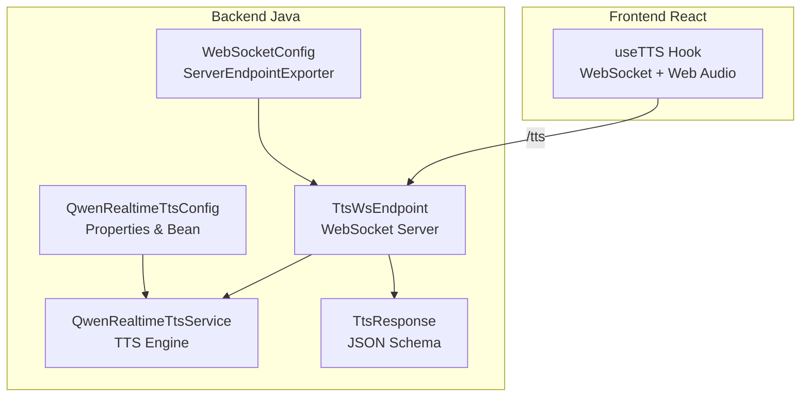
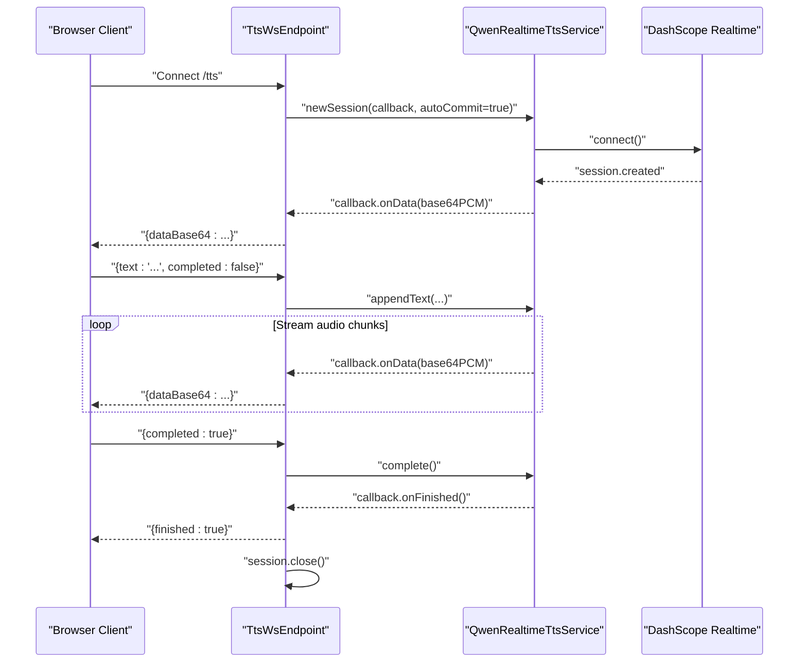
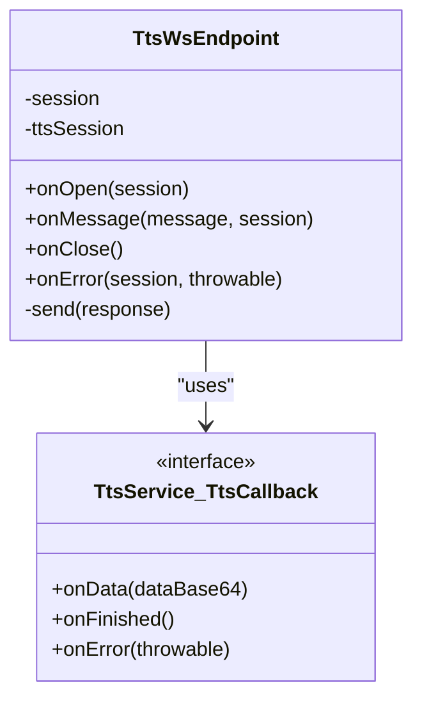
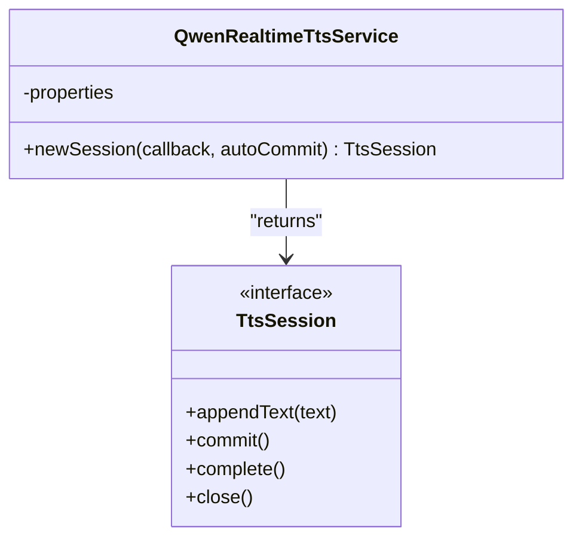
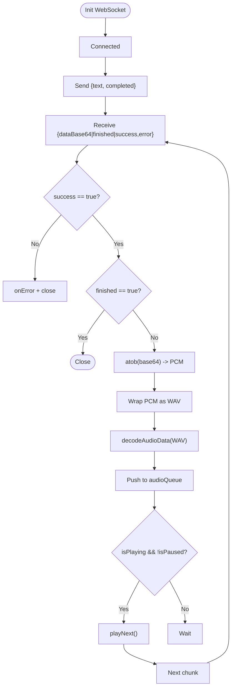
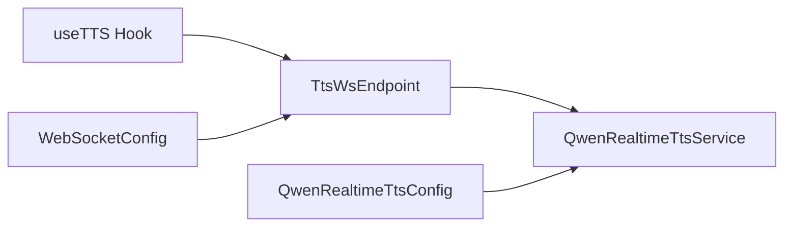

# TTS WebSocket Endpoint

<cite>
**Referenced Files in This Document**
- [TtsWsEndpoint.java](file://backend_java/api/src/main/java/com/aliyun/tam/x/tron/ws/TtsWsEndpoint.java)
- [QwenRealtimeTtsService.java](file://backend_java/core/src/main/java/com/aliyun/tam/x/tron/core/tts/QwenRealtimeTtsService.java)
- [TtsService.java](file://backend_java/core/src/main/java/com/aliyun/tam/x/tron/core/tts/TtsService.java)
- [TtsSession.java](file://backend_java/core/src/main/java/com/aliyun/tam/x/tron/core/tts/TtsSession.java)
- [QwenRealtimeTtsConfig.java](file://backend_java/core/src/main/java/com/aliyun/tam/x/tron/core/tts/QwenRealtimeTtsConfig.java)
- [WebSocketConfig.java](file://backend_java/bootstrap/src/main/java/com/aliyun/tam/x/tron/config/WebSocketConfig.java)
- [application.yaml](file://backend_java/bootstrap/src/main/resources/application.yaml)
- [TtsResponse.java](file://backend_java/api/src/main/java/com/aliyun/tam/x/tron/api/response/TtsResponse.java)
- [useTTS.ts](file://frontend/packages/chatbox/hooks/useTTS.ts)
</cite>

## Table of Contents
1. [Introduction](#introduction)
2. [Project Structure](#project-structure)
3. [Core Components](#core-components)
4. [Architecture Overview](#architecture-overview)
5. [Detailed Component Analysis](#detailed-component-analysis)
6. [Dependency Analysis](#dependency-analysis)
7. [Performance Considerations](#performance-considerations)
8. [Troubleshooting Guide](#troubleshooting-guide)
9. [Conclusion](#conclusion)

## Introduction
This document describes the Text-to-Speech (TTS) WebSocket endpoint that streams synthesized speech audio in real time. It explains how clients connect, send text for synthesis, receive audio chunks, and synchronize playback. It also documents configuration options, streaming behavior, and client-side integration patterns for browsers using Web Audio APIs.

## Project Structure
The TTS WebSocket endpoint is implemented in the backend Java module and consumed by the React-based frontend. The key elements are:
- WebSocket server endpoint for TTS
- Real-time TTS service backed by Alibaba DashScope
- Configuration for voice and audio format
- Frontend hook for WebSocket audio streaming and playback

**Diagram sources**
- [TtsWsEndpoint.java:36-93](file://backend_java/api/src/main/java/com/aliyun/tam/x/tron/ws/TtsWsEndpoint.java#L36-L93)
- [QwenRealtimeTtsService.java:36-165](file://backend_java/core/src/main/java/com/aliyun/tam/x/tron/core/tts/QwenRealtimeTtsService.java#L36-L165)
- [QwenRealtimeTtsConfig.java:28-62](file://backend_java/core/src/main/java/com/aliyun/tam/x/tron/core/tts/QwenRealtimeTtsConfig.java#L28-L62)
- [WebSocketConfig.java:24-36](file://backend_java/bootstrap/src/main/java/com/aliyun/tam/x/tron/config/WebSocketConfig.java#L24-L36)
- [TtsResponse.java:24-34](file://backend_java/api/src/main/java/com/aliyun/tam/x/tron/api/response/TtsResponse.java#L24-L34)
- [useTTS.ts:106-380](file://frontend/packages/chatbox/hooks/useTTS.ts#L106-L380)

**Section sources**
- [TtsWsEndpoint.java:36-93](file://backend_java/api/src/main/java/com/aliyun/tam/x/tron/ws/TtsWsEndpoint.java#L36-L93)
- [QwenRealtimeTtsService.java:36-165](file://backend_java/core/src/main/java/com/aliyun/tam/x/tron/core/tts/QwenRealtimeTtsService.java#L36-L165)
- [QwenRealtimeTtsConfig.java:28-62](file://backend_java/core/src/main/java/com/aliyun/tam/x/tron/core/tts/QwenRealtimeTtsConfig.java#L28-L62)
- [WebSocketConfig.java:24-36](file://backend_java/bootstrap/src/main/java/com/aliyun/tam/x/tron/config/WebSocketConfig.java#L24-L36)
- [TtsResponse.java:24-34](file://backend_java/api/src/main/java/com/aliyun/tam/x/tron/api/response/TtsResponse.java#L24-L34)
- [useTTS.ts:106-380](file://frontend/packages/chatbox/hooks/useTTS.ts#L106-L380)

## Core Components
- WebSocket endpoint "/tts": Accepts client connections, manages a per-session TTS engine, and streams audio chunks as base64-encoded PCM frames.
- TTS service: Creates a real-time TTS session, appends text in chunks, and emits audio deltas.
- Configuration: Controls model, voice, audio format, and chunking behavior.
- Frontend hook: Establishes WebSocket, decodes audio, converts PCM to WAV, queues decoded buffers, and plays via Web Audio.

Key responsibilities:
- Connection lifecycle: open, message, close, error
- Streaming protocol: JSON messages with fields for text and completion flag
- Audio delivery: base64-encoded PCM frames wrapped in a response envelope
- Playback synchronization: queue-based scheduling with pause/resume/stop semantics

**Section sources**
- [TtsWsEndpoint.java:36-159](file://backend_java/api/src/main/java/com/aliyun/tam/x/tron/ws/TtsWsEndpoint.java#L36-L159)
- [QwenRealtimeTtsService.java:36-165](file://backend_java/core/src/main/java/com/aliyun/tam/x/tron/core/tts/QwenRealtimeTtsService.java#L36-L165)
- [QwenRealtimeTtsConfig.java:32-62](file://backend_java/core/src/main/java/com/aliyun/tam/x/tron/core/tts/QwenRealtimeTtsConfig.java#L32-L62)
- [TtsResponse.java:24-34](file://backend_java/api/src/main/java/com/aliyun/tam/x/tron/api/response/TtsResponse.java#L24-L34)
- [useTTS.ts:106-380](file://frontend/packages/chatbox/hooks/useTTS.ts#L106-L380)

## Architecture Overview
The TTS WebSocket endpoint follows a request-response streaming pattern over WebSocket:
- Client opens "/tts" WebSocket
- Server creates a TTS session and starts streaming audio chunks
- Client receives JSON messages containing base64-encoded PCM audio
- Client decodes PCM, wraps as WAV, and plays via Web Audio API
- Client signals completion to finalize synthesis

**Diagram sources**
- [TtsWsEndpoint.java:56-136](file://backend_java/api/src/main/java/com/aliyun/tam/x/tron/ws/TtsWsEndpoint.java#L56-L136)
- [QwenRealtimeTtsService.java:40-145](file://backend_java/core/src/main/java/com/aliyun/tam/x/tron/core/tts/QwenRealtimeTtsService.java#L40-L145)

## Detailed Component Analysis

### WebSocket Endpoint: TtsWsEndpoint
- Path: "/tts"
- Lifecycle:
  - On open: validates service availability, creates a TTS session with a callback, and logs session creation
  - On message: parses JSON request with fields "text" and "completed"; forwards to TTS session
  - On close: closes the underlying TTS session and releases resources
  - On error: sends an error response and closes the session
- Streaming:
  - Audio chunks are sent as base64-encoded PCM frames inside a response envelope
  - Completion is signaled by a "finished" flag in the response envelope

**Diagram sources**
- [TtsWsEndpoint.java:38-159](file://backend_java/api/src/main/java/com/aliyun/tam/x/tron/ws/TtsWsEndpoint.java#L38-L159)
- [TtsService.java:20-31](file://backend_java/core/src/main/java/com/aliyun/tam/x/tron/core/tts/TtsService.java#L20-L31)

**Section sources**
- [TtsWsEndpoint.java:36-159](file://backend_java/api/src/main/java/com/aliyun/tam/x/tron/ws/TtsWsEndpoint.java#L36-L159)
- [TtsResponse.java:24-34](file://backend_java/api/src/main/java/com/aliyun/tam/x/tron/api/response/TtsResponse.java#L24-L34)

### TTS Service: QwenRealtimeTtsService
- Creates a real-time TTS session with a DashScope WebSocket client
- Emits callbacks for session lifecycle and audio deltas
- Implements chunked text appending with configurable interval and size
- Supports server-commit mode for automatic synthesis commits

**Diagram sources**
- [QwenRealtimeTtsService.java:36-165](file://backend_java/core/src/main/java/com/aliyun/tam/x/tron/core/tts/QwenRealtimeTtsService.java#L36-L165)
- [TtsSession.java:19-29](file://backend_java/core/src/main/java/com/aliyun/tam/x/tron/core/tts/TtsSession.java#L19-L29)

**Section sources**
- [QwenRealtimeTtsService.java:36-165](file://backend_java/core/src/main/java/com/aliyun/tam/x/tron/core/tts/QwenRealtimeTtsService.java#L36-L165)
- [TtsSession.java:19-29](file://backend_java/core/src/main/java/com/aliyun/tam/x/tron/core/tts/TtsSession.java#L19-L29)

### Configuration: QwenRealtimeTtsConfig
- Exposes properties for model, URL, API key, voice, audio format, instructions, and chunking behavior
- Provides a Spring bean for TTS service
- Uses environment variable for API key if not explicitly configured

Key properties:
- Model: defaults to a real-time TTS model
- Voice: defaults to a named voice
- Audio format: PCM at 24 kHz mono, 16-bit
- Chunk size and interval: controls streaming cadence
- Session timeouts: guards session creation/update

**Section sources**
- [QwenRealtimeTtsConfig.java:32-62](file://backend_java/core/src/main/java/com/aliyun/tam/x/tron/core/tts/QwenRealtimeTtsConfig.java#L32-L62)
- [application.yaml:34-34](file://backend_java/bootstrap/src/main/resources/application.yaml#L34-L34)

### Frontend Integration: useTTS Hook
- Initializes WebSocket to the "/tts" endpoint
- Receives base64 PCM audio, decodes to binary, wraps as WAV, and decodes via Web Audio API
- Queues decoded buffers and plays them sequentially
- Supports pause/resume/stop and completion signaling

**Diagram sources**
- [useTTS.ts:187-380](file://frontend/packages/chatbox/hooks/useTTS.ts#L187-L380)

**Section sources**
- [useTTS.ts:106-380](file://frontend/packages/chatbox/hooks/useTTS.ts#L106-L380)

## Dependency Analysis
- TtsWsEndpoint depends on TtsService for session management and audio delta emission
- TtsService depends on DashScope real-time client and configuration properties
- WebSocketConfig registers the "/tts" endpoint with the container
- Frontend useTTS depends on browser Web Audio APIs and WebSocket

**Diagram sources**
- [TtsWsEndpoint.java:38-159](file://backend_java/api/src/main/java/com/aliyun/tam/x/tron/ws/TtsWsEndpoint.java#L38-L159)
- [QwenRealtimeTtsService.java:36-165](file://backend_java/core/src/main/java/com/aliyun/tam/x/tron/core/tts/QwenRealtimeTtsService.java#L36-L165)
- [QwenRealtimeTtsConfig.java:28-62](file://backend_java/core/src/main/java/com/aliyun/tam/x/tron/core/tts/QwenRealtimeTtsConfig.java#L28-L62)
- [WebSocketConfig.java:24-36](file://backend_java/bootstrap/src/main/java/com/aliyun/tam/x/tron/config/WebSocketConfig.java#L24-L36)
- [useTTS.ts:106-380](file://frontend/packages/chatbox/hooks/useTTS.ts#L106-L380)

**Section sources**
- [TtsWsEndpoint.java:38-159](file://backend_java/api/src/main/java/com/aliyun/tam/x/tron/ws/TtsWsEndpoint.java#L38-L159)
- [QwenRealtimeTtsService.java:36-165](file://backend_java/core/src/main/java/com/aliyun/tam/x/tron/core/tts/QwenRealtimeTtsService.java#L36-L165)
- [QwenRealtimeTtsConfig.java:28-62](file://backend_java/core/src/main/java/com/aliyun/tam/x/tron/core/tts/QwenRealtimeTtsConfig.java#L28-L62)
- [WebSocketConfig.java:24-36](file://backend_java/bootstrap/src/main/java/com/aliyun/tam/x/tron/config/WebSocketConfig.java#L24-L36)
- [useTTS.ts:106-380](file://frontend/packages/chatbox/hooks/useTTS.ts#L106-L380)

## Performance Considerations
- Chunk sizing and intervals: Tune max chunk size and inter-chunk delay to balance latency and throughput
- Audio format: PCM at 24 kHz mono, 16-bit is efficient for real-time streaming; ensure client decoding overhead remains low
- Queue management: Maintain a bounded audio queue to avoid unbounded memory growth during long syntheses
- Network conditions: Implement retry/backoff on client disconnects; consider re-sending partial text on reconnect
- Server timeouts: Monitor session creation/update timeouts and handle slow upstream connections gracefully

[No sources needed since this section provides general guidance]

## Troubleshooting Guide
Common issues and resolutions:
- Service unavailable:
  - Symptom: Immediate error response after connecting
  - Cause: TTS service not initialized
  - Resolution: Verify service wiring and configuration
- WebSocket errors:
  - Symptom: Error notification and closure
  - Cause: Parsing failure or runtime exception
  - Resolution: Validate request payload and handle exceptions
- Audio playback failures:
  - Symptom: Silent playback or decode errors
  - Cause: Incorrect PCM format or malformed base64
  - Resolution: Confirm audio format matches configuration and client conversion
- Connection drops:
  - Symptom: Unexpected close
  - Cause: Network instability or server shutdown
  - Resolution: Implement reconnection logic and resend partial text if resuming

**Section sources**
- [TtsWsEndpoint.java:82-91](file://backend_java/api/src/main/java/com/aliyun/tam/x/tron/ws/TtsWsEndpoint.java#L82-L91)
- [useTTS.ts:254-257](file://frontend/packages/chatbox/hooks/useTTS.ts#L254-L257)

## Conclusion
The TTS WebSocket endpoint provides a robust, real-time audio streaming pipeline from text to playable audio. Clients connect to "/tts", stream text fragments, receive base64 PCM chunks, and synchronize playback using a queue-based Web Audio approach. Configuration enables tuning voice, audio format, and streaming cadence, while the frontend hook offers pause/resume/stop controls and completion signaling.