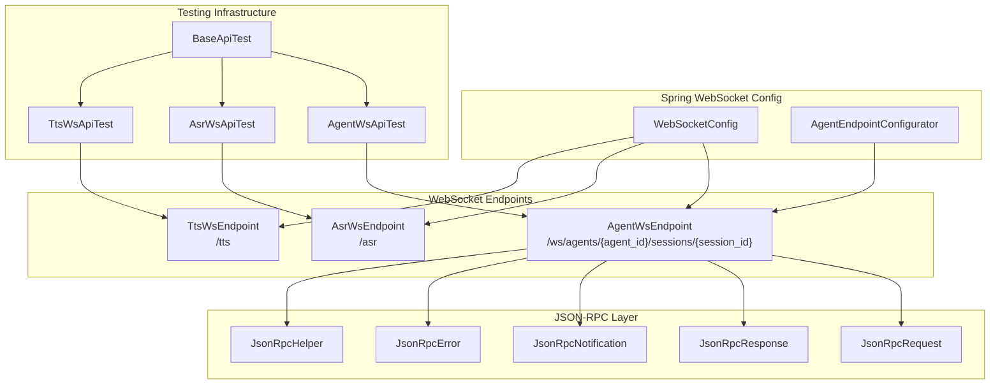
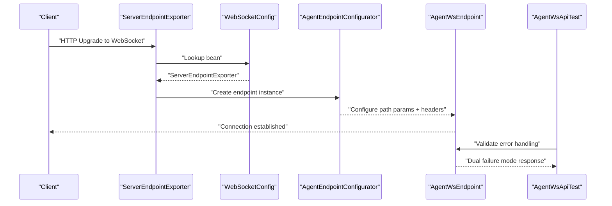
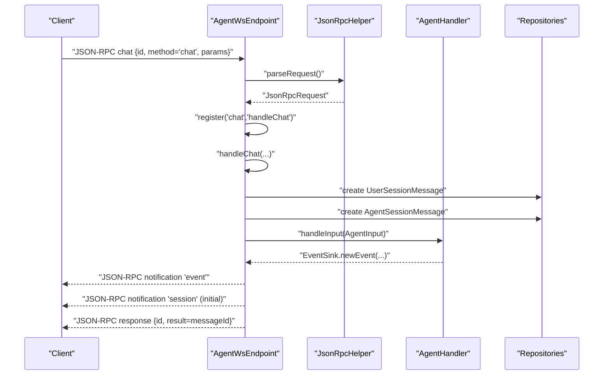
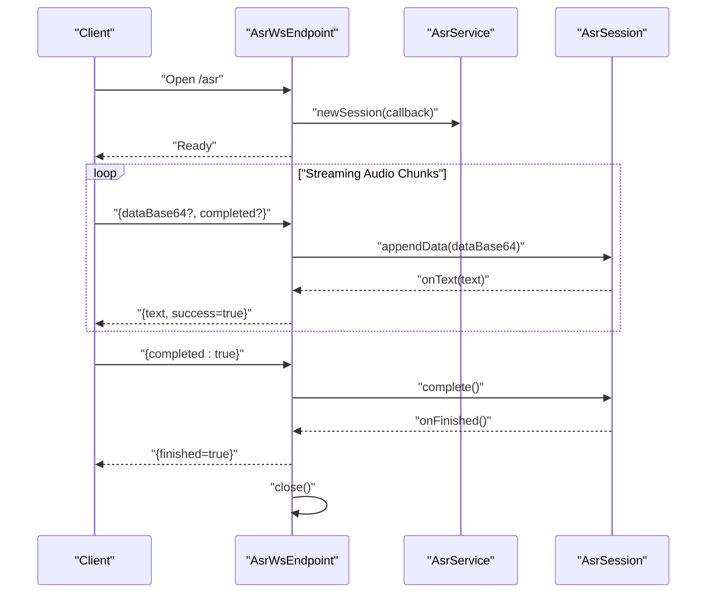
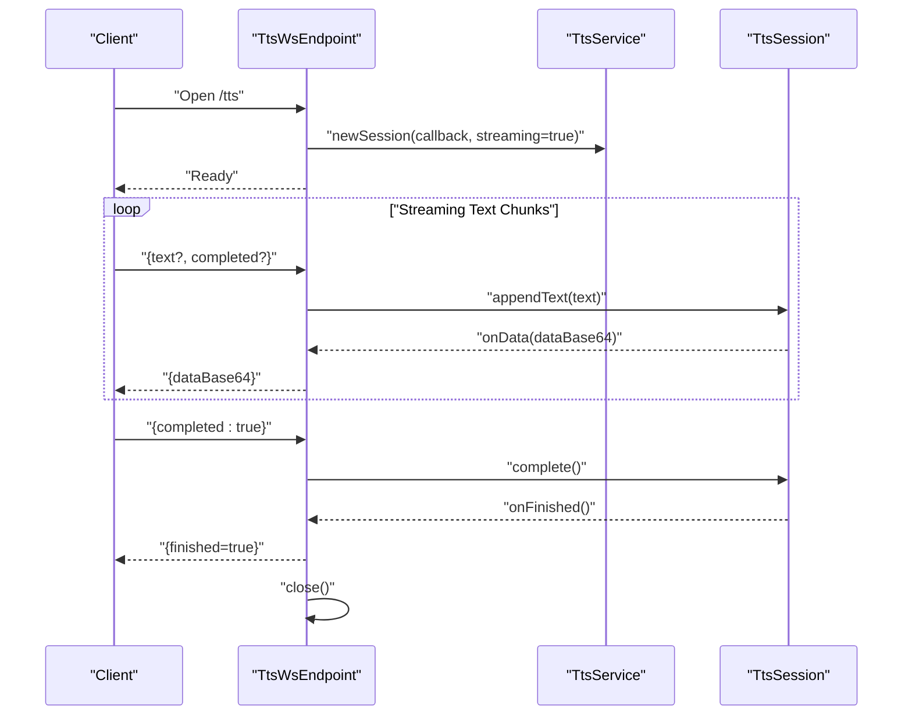
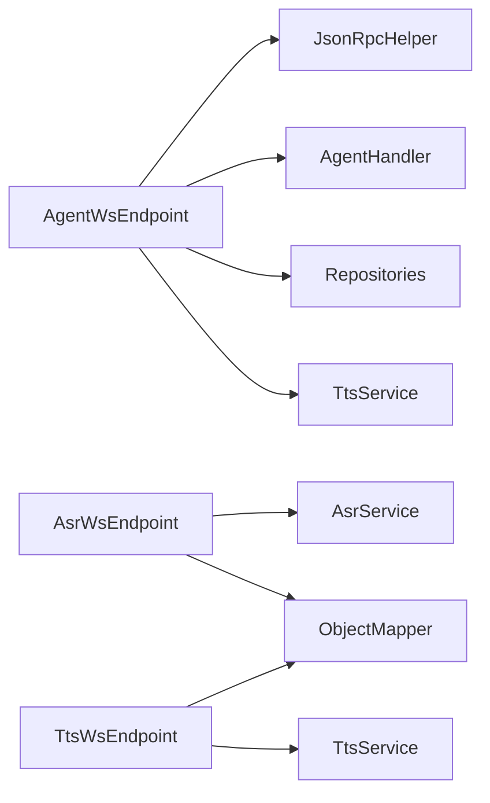
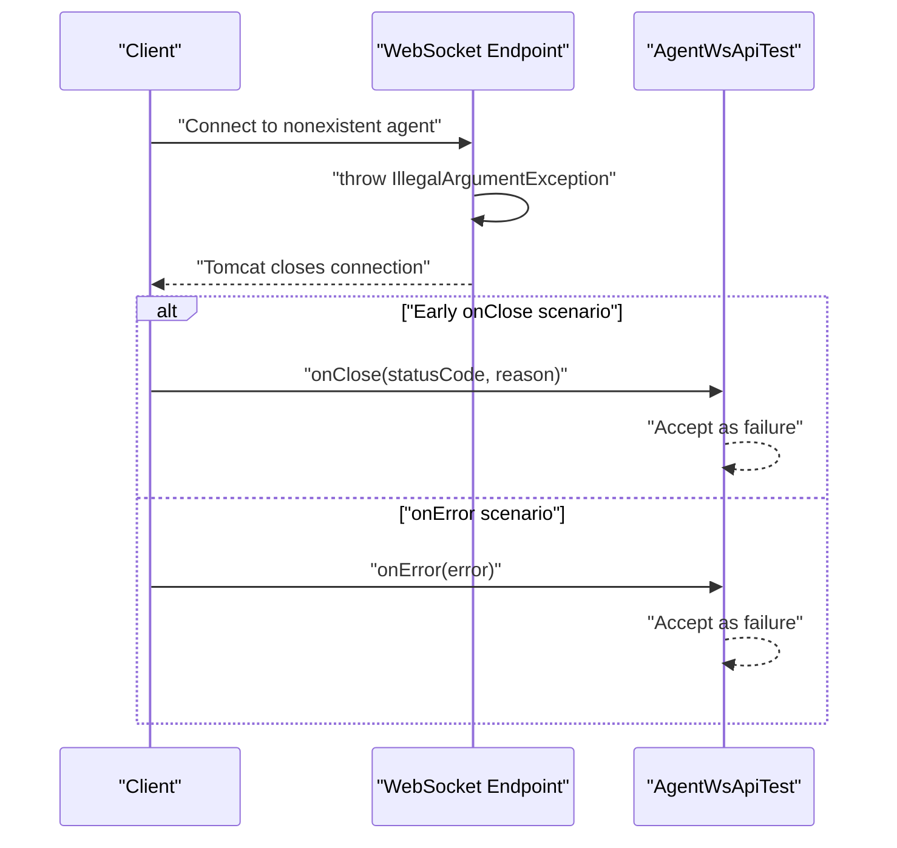

# WebSocket API

<cite>
**Referenced Files in This Document**
- [AgentWsEndpoint.java](file://backend_java/api/src/main/java/com/aliyun/tam/x/tron/ws/AgentWsEndpoint.java)
- [AsrWsEndpoint.java](file://backend_java/api/src/main/java/com/aliyun/tam/x/tron/ws/AsrWsEndpoint.java)
- [TtsWsEndpoint.java](file://backend_java/api/src/main/java/com/aliyun/tam/x/tron/ws/TtsWsEndpoint.java)
- [JsonRpc.java](file://backend_java/api/src/main/java/com/aliyun/tam/x/tron/ws/jsonrpc/JsonRpc.java)
- [JsonRpcRequest.java](file://backend_java/api/src/main/java/com/aliyun/tam/x/tron/ws/jsonrpc/JsonRpcRequest.java)
- [JsonRpcResponse.java](file://backend_java/api/src/main/java/com/aliyun/tam/x/tron/ws/jsonrpc/JsonRpcResponse.java)
- [JsonRpcNotification.java](file://backend_java/api/src/main/java/com/aliyun/tam/x/tron/ws/jsonrpc/JsonRpcNotification.java)
- [JsonRpcError.java](file://backend_java/api/src/main/java/com/aliyun/tam/x/tron/ws/jsonrpc/JsonRpcError.java)
- [JsonRpcHelper.java](file://backend_java/api/src/main/java/com/aliyun/tam/x/tron/ws/jsonrpc/JsonRpcHelper.java)
- [AgentEndpointConfigurator.java](file://backend_java/api/src/main/java/com/aliyun/tam/x/tron/ws/AgentEndpointConfigurator.java)
- [WebSocketConfig.java](file://backend_java/bootstrap/src/main/java/com/aliyun/tam/x/tron/config/WebSocketConfig.java)
- [AgentWsApiTest.java](file://backend_java/bootstrap/src/test/java/com/aliyun/tam/x/tron/api/AgentWsApiTest.java)
- [AsrWsApiTest.java](file://backend_java/bootstrap/src/test/java/com/aliyun/tam/x/tron/api/AsrWsApiTest.java)
- [TtsWsApiTest.java](file://backend_java/bootstrap/src/test/java/com/aliyun/tam/x/tron/api/TtsWsApiTest.java)
- [BaseApiTest.java](file://backend_java/bootstrap/src/test/java/com/aliyun/tam/x/tron/api/BaseApiTest.java)
</cite>

## Update Summary
**Changes Made**
- Enhanced WebSocket API testing infrastructure documentation with improved error handling patterns
- Added comprehensive coverage of dual failure mode support (onError/onClose) for invalid endpoints
- Documented better parameter binding consistency for JSON-RPC method invocation
- Updated troubleshooting section with specific error handling scenarios

## Table of Contents
1. [Introduction](#introduction)
2. [Project Structure](#project-structure)
3. [Core Components](#core-components)
4. [Architecture Overview](#architecture-overview)
5. [Detailed Component Analysis](#detailed-component-analysis)
6. [Dependency Analysis](#dependency-analysis)
7. [Performance Considerations](#performance-considerations)
8. [Testing Infrastructure and Error Handling](#testing-infrastructure-and-error-handling)
9. [Troubleshooting Guide](#troubleshooting-guide)
10. [Conclusion](#conclusion)
11. [Appendices](#appendices)

## Introduction
This document specifies the WebSocket APIs exposed by Tron OneAgent for real-time communication. It covers:
- Agent WebSocket for bidirectional agent interaction and event streaming
- ASR WebSocket for real-time speech recognition streaming
- TTS WebSocket for text-to-speech streaming
It also documents the JSON-RPC protocol used by the Agent WebSocket, including request/response formats, method definitions, error handling, and the handshake/authentication mechanism via HTTP headers. Connection lifecycle, message framing, and streaming patterns are explained, along with reconnection and error recovery strategies.

**Updated** Enhanced with comprehensive testing infrastructure documentation and improved error handling patterns for invalid endpoints and dual failure modes.

## Project Structure
The WebSocket endpoints are implemented in Java using Jakarta WebSocket (JSR 356) with Spring-managed beans. The Agent WebSocket integrates JSON-RPC and event streaming, while ASR and TTS expose simple request/response JSON frames. The testing infrastructure provides robust validation of error handling scenarios.

**Diagram sources**
- [AgentWsEndpoint.java:62](file://backend_java/api/src/main/java/com/aliyun/tam/x/tron/ws/AgentWsEndpoint.java#L62)
- [AsrWsEndpoint.java:36](file://backend_java/api/src/main/java/com/aliyun/tam/x/tron/ws/AsrWsEndpoint.java#L36)
- [TtsWsEndpoint.java:36](file://backend_java/api/src/main/java/com/aliyun/tam/x/tron/ws/TtsWsEndpoint.java#L36)
- [JsonRpcRequest.java:25](file://backend_java/api/src/main/java/com/aliyun/tam/x/tron/ws/jsonrpc/JsonRpcRequest.java#L25)
- [JsonRpcResponse.java:25](file://backend_java/api/src/main/java/com/aliyun/tam/x/tron/ws/jsonrpc/JsonRpcResponse.java#L25)
- [JsonRpcNotification.java:25](file://backend_java/api/src/main/java/com/aliyun/tam/x/tron/ws/jsonrpc/JsonRpcNotification.java#L25)
- [JsonRpcError.java:25](file://backend_java/api/src/main/java/com/aliyun/tam/x/tron/ws/jsonrpc/JsonRpcError.java#L25)
- [JsonRpcHelper.java:38](file://backend_java/api/src/main/java/com/aliyun/tam/x/tron/ws/jsonrpc/JsonRpcHelper.java#L38)
- [WebSocketConfig.java:26](file://backend_java/bootstrap/src/main/java/com/aliyun/tam/x/tron/config/WebSocketConfig.java#L26)
- [AgentEndpointConfigurator.java:31](file://backend_java/api/src/main/java/com/aliyun/tam/x/tron/ws/AgentEndpointConfigurator.java#L31)
- [AgentWsApiTest.java:42](file://backend_java/bootstrap/src/test/java/com/aliyun/tam/x/tron/api/AgentWsApiTest.java#L42)
- [AsrWsApiTest.java:45](file://backend_java/bootstrap/src/test/java/com/aliyun/tam/x/tron/api/AsrWsApiTest.java#L45)
- [TtsWsApiTest.java:44](file://backend_java/bootstrap/src/test/java/com/aliyun/tam/x/tron/api/TtsWsApiTest.java#L44)
- [BaseApiTest.java:31](file://backend_java/bootstrap/src/test/java/com/aliyun/tam/x/tron/api/BaseApiTest.java#L31)

**Section sources**
- [AgentWsEndpoint.java:62](file://backend_java/api/src/main/java/com/aliyun/tam/x/tron/ws/AgentWsEndpoint.java#L62)
- [AsrWsEndpoint.java:36](file://backend_java/api/src/main/java/com/aliyun/tam/x/tron/ws/AsrWsEndpoint.java#L36)
- [TtsWsEndpoint.java:36](file://backend_java/api/src/main/java/com/aliyun/tam/x/tron/ws/TtsWsEndpoint.java#L36)
- [WebSocketConfig.java:26](file://backend_java/bootstrap/src/main/java/com/aliyun/tam/x/tron/config/WebSocketConfig.java#L26)
- [AgentEndpointConfigurator.java:31](file://backend_java/api/src/main/java/com/aliyun/tam/x/tron/ws/AgentEndpointConfigurator.java#L31)
- [AgentWsApiTest.java:42](file://backend_java/bootstrap/src/test/java/com/aliyun/tam/x/tron/api/AgentWsApiTest.java#L42)
- [AsrWsApiTest.java:45](file://backend_java/bootstrap/src/test/java/com/aliyun/tam/x/tron/api/AsrWsApiTest.java#L45)
- [TtsWsApiTest.java:44](file://backend_java/bootstrap/src/test/java/com/aliyun/tam/x/tron/api/TtsWsApiTest.java#L44)
- [BaseApiTest.java:31](file://backend_java/bootstrap/src/test/java/com/aliyun/tam/x/tron/api/BaseApiTest.java#L31)

## Core Components
- Agent WebSocket endpoint: Bidirectional agent communication with JSON-RPC requests and event notifications. Authentication via HTTP headers during handshake. Streams session snapshots and live events.
- ASR WebSocket endpoint: Real-time speech recognition streaming. Receives base64 audio fragments and emits partial/final text results.
- TTS WebSocket endpoint: Real-time text-to-speech streaming. Receives text fragments and emits base64 audio chunks until completion.

Key protocol and framing:
- Agent WebSocket uses JSON-RPC 2.0 for requests/responses and custom notifications for events.
- ASR and TTS use simple JSON frames for request/response.

**Updated** Enhanced error handling capabilities with comprehensive testing infrastructure validating dual failure modes and parameter binding consistency.

**Section sources**
- [AgentWsEndpoint.java:116](file://backend_java/api/src/main/java/com/aliyun/tam/x/tron/ws/AgentWsEndpoint.java#L116)
- [AsrWsEndpoint.java:122](file://backend_java/api/src/main/java/com/aliyun/tam/x/tron/ws/AsrWsEndpoint.java#L122)
- [TtsWsEndpoint.java:108](file://backend_java/api/src/main/java/com/aliyun/tam/x/tron/ws/TtsWsEndpoint.java#L108)

## Architecture Overview
The WebSocket endpoints are registered by Spring's ServerEndpointExporter. The Agent endpoint supports dynamic path parameters and extracts authentication from the handshake. JSON-RPC is handled centrally by JsonRpcHelper. The testing infrastructure validates error handling scenarios across all endpoints.

**Diagram sources**
- [WebSocketConfig.java:33](file://backend_java/bootstrap/src/main/java/com/aliyun/tam/x/tron/config/WebSocketConfig.java#L33)
- [AgentEndpointConfigurator.java:48](file://backend_java/api/src/main/java/com/aliyun/tam/x/tron/ws/AgentEndpointConfigurator.java#L48)
- [AgentWsEndpoint.java:62](file://backend_java/api/src/main/java/com/aliyun/tam/x/tron/ws/AgentWsEndpoint.java#L62)
- [AgentWsApiTest.java:109](file://backend_java/bootstrap/src/test/java/com/aliyun/tam/x/tron/api/AgentWsApiTest.java#L109)

## Detailed Component Analysis

### Agent WebSocket API
- Endpoint: /ws/agents/{agent_id}/sessions/{session_id}
- Authentication: During handshake, the server reads required headers from the HTTP upgrade request and stores them in the endpoint configuration. The endpoint requires X-User-Id and optionally accepts X-User-Name.
- Methods:
  - chat: Initiates agent interaction with structured input content. Returns a message ID for subsequent event correlation.
  - cancel: Cancels current operation with a message.
- JSON-RPC protocol:
  - Requests: id, method, params, jsonrpc=2.0
  - Responses: id, result or error, jsonrpc=2.0
  - Notifications: method, params, jsonrpc=2.0
- Events:
  - session: Initial snapshot of session metadata and recent messages.
  - event: Live stream of session events (e.g., agent message status changes, TTS updates).
- TTS integration:
  - When enabled via chat request, the endpoint streams TTS_RESPONSE events containing base64 audio chunks and completion markers.

**Diagram sources**
- [AgentWsEndpoint.java:222](file://backend_java/api/src/main/java/com/aliyun/tam/x/tron/ws/AgentWsEndpoint.java#L222)
- [AgentWsEndpoint.java:277](file://backend_java/api/src/main/java/com/aliyun/tam/x/tron/ws/AgentWsEndpoint.java#L277)
- [JsonRpcHelper.java:45](file://backend_java/api/src/main/java/com/aliyun/tam/x/tron/ws/jsonrpc/JsonRpcHelper.java#L45)
- [JsonRpcRequest.java:25](file://backend_java/api/src/main/java/com/aliyun/tam/x/tron/ws/jsonrpc/JsonRpcRequest.java#L25)
- [JsonRpcResponse.java:25](file://backend_java/api/src/main/java/com/aliyun/tam/x/tron/ws/jsonrpc/JsonRpcResponse.java#L25)
- [JsonRpcNotification.java:25](file://backend_java/api/src/main/java/com/aliyun/tam/x/tron/ws/jsonrpc/JsonRpcNotification.java#L25)

**Section sources**
- [AgentWsEndpoint.java:116](file://backend_java/api/src/main/java/com/aliyun/tam/x/tron/ws/AgentWsEndpoint.java#L116)
- [AgentWsEndpoint.java:222](file://backend_java/api/src/main/java/com/aliyun/tam/x/tron/ws/AgentWsEndpoint.java#L222)
- [AgentWsEndpoint.java:277](file://backend_java/api/src/main/java/com/aliyun/tam/x/tron/ws/AgentWsEndpoint.java#L277)
- [AgentWsEndpoint.java:334](file://backend_java/api/src/main/java/com/aliyun/tam/x/tron/ws/AgentWsEndpoint.java#L334)
- [JsonRpcRequest.java:25](file://backend_java/api/src/main/java/com/aliyun/tam/x/tron/ws/jsonrpc/JsonRpcRequest.java#L25)
- [JsonRpcResponse.java:25](file://backend_java/api/src/main/java/com/aliyun/tam/x/tron/ws/jsonrpc/JsonRpcResponse.java#L25)
- [JsonRpcNotification.java:25](file://backend_java/api/src/main/java/com/aliyun/tam/x/tron/ws/jsonrpc/JsonRpcNotification.java#L25)
- [JsonRpcError.java:25](file://backend_java/api/src/main/java/com/aliyun/tam/x/tron/ws/jsonrpc/JsonRpcError.java#L25)
- [JsonRpcHelper.java:45](file://backend_java/api/src/main/java/com/aliyun/tam/x/tron/ws/jsonrpc/JsonRpcHelper.java#L45)

### ASR WebSocket API
- Endpoint: /asr
- Protocol: JSON frames
- Request frame:
  - dataBase64: Base64-encoded audio chunk
  - completed: Indicates end of input
- Response frames:
  - success: Operation status
  - text: Partial or final transcription text
  - finished: True when recognition completes
  - error: Error message on failure
- Lifecycle:
  - On open, the server initializes an ASR session and starts listening for audio chunks.
  - On each message, appends received audio and may trigger completion.
  - Emits text frames as hypotheses become available; closes after completion or on error.

**Diagram sources**
- [AsrWsEndpoint.java:70](file://backend_java/api/src/main/java/com/aliyun/tam/x/tron/ws/AsrWsEndpoint.java#L70)
- [AsrWsEndpoint.java:122](file://backend_java/api/src/main/java/com/aliyun/tam/x/tron/ws/AsrWsEndpoint.java#L122)
- [AsrWsEndpoint.java:143](file://backend_java/api/src/main/java/com/aliyun/tam/x/tron/ws/AsrWsEndpoint.java#L143)

**Section sources**
- [AsrWsEndpoint.java:44](file://backend_java/api/src/main/java/com/aliyun/tam/x/tron/ws/AsrWsEndpoint.java#L44)
- [AsrWsEndpoint.java:52](file://backend_java/api/src/main/java/com/aliyun/tam/x/tron/ws/AsrWsEndpoint.java#L52)
- [AsrWsEndpoint.java:122](file://backend_java/api/src/main/java/com/aliyun/tam/x/tron/ws/AsrWsEndpoint.java#L122)
- [AsrWsEndpoint.java:143](file://backend_java/api/src/main/java/com/aliyun/tam/x/tron/ws/AsrWsEndpoint.java#L143)

### TTS WebSocket API
- Endpoint: /tts
- Protocol: JSON frames
- Request frame:
  - text: Text to synthesize
  - completed: Indicates end of input
- Response frames:
  - dataBase64: Base64-encoded audio chunk
  - finished: True when synthesis completes
  - success/error: Status and error message
- Lifecycle:
  - On open, the server initializes a TTS session and starts accepting text.
  - Emits audio chunks as they become available; closes after completion or on error.

**Diagram sources**
- [TtsWsEndpoint.java:56](file://backend_java/api/src/main/java/com/aliyun/tam/x/tron/ws/TtsWsEndpoint.java#L56)
- [TtsWsEndpoint.java:108](file://backend_java/api/src/main/java/com/aliyun/tam/x/tron/ws/TtsWsEndpoint.java#L108)
- [TtsWsEndpoint.java:129](file://backend_java/api/src/main/java/com/aliyun/tam/x/tron/ws/TtsWsEndpoint.java#L129)

**Section sources**
- [TtsWsEndpoint.java:44](file://backend_java/api/src/main/java/com/aliyun/tam/x/tron/ws/TtsWsEndpoint.java#L44)
- [TtsWsEndpoint.java:108](file://backend_java/api/src/main/java/com/aliyun/tam/x/tron/ws/TtsWsEndpoint.java#L108)
- [TtsWsEndpoint.java:129](file://backend_java/api/src/main/java/com/aliyun/tam/x/tron/ws/TtsWsEndpoint.java#L129)

## Dependency Analysis
- Agent WebSocket depends on:
  - JsonRpcHelper for parsing/serializing JSON-RPC and dispatching methods
  - AgentHandler for processing user input and generating agent messages
  - Repositories for session/message/event persistence
  - TtsService for optional TTS streaming
- ASR and TTS endpoints depend on their respective services and ObjectMapper for JSON serialization.

**Diagram sources**
- [AgentWsEndpoint.java:74](file://backend_java/api/src/main/java/com/aliyun/tam/x/tron/ws/AgentWsEndpoint.java#L74)
- [JsonRpcHelper.java:38](file://backend_java/api/src/main/java/com/aliyun/tam/x/tron/ws/jsonrpc/JsonRpcHelper.java#L38)
- [AsrWsEndpoint.java:40](file://backend_java/api/src/main/java/com/aliyun/tam/x/tron/ws/AsrWsEndpoint.java#L40)
- [TtsWsEndpoint.java:40](file://backend_java/api/src/main/java/com/aliyun/tam/x/tron/ws/TtsWsEndpoint.java#L40)

**Section sources**
- [AgentWsEndpoint.java:74](file://backend_java/api/src/main/java/com/aliyun/tam/x/tron/ws/AgentWsEndpoint.java#L74)
- [JsonRpcHelper.java:38](file://backend_java/api/src/main/java/com/aliyun/tam/x/tron/ws/jsonrpc/JsonRpcHelper.java#L38)
- [AsrWsEndpoint.java:40](file://backend_java/api/src/main/java/com/aliyun/tam/x/tron/ws/AsrWsEndpoint.java#L40)
- [TtsWsEndpoint.java:40](file://backend_java/api/src/main/java/com/aliyun/tam/x/tron/ws/TtsWsEndpoint.java#L40)

## Performance Considerations
- Threading:
  - Agent WebSocket uses a bounded thread pool for chat processing to avoid overload.
  - Event streaming is serialized per socket using a lock to prevent interleaved writes.
- Backpressure:
  - ASR/TTS endpoints rely on client-side pacing of messages; ensure clients emit chunks at a rate matching server processing.
- Serialization:
  - JSON-RPC and endpoint responses use Jackson; keep payload sizes reasonable to minimize serialization overhead.
- Connection reuse:
  - Prefer long-lived connections for streaming scenarios; avoid frequent reconnects.

## Testing Infrastructure and Error Handling

### Enhanced WebSocket API Testing Infrastructure
The testing infrastructure provides comprehensive validation of WebSocket API behavior, including error handling scenarios and dual failure mode support.

#### Dual Failure Mode Support
The testing framework validates that WebSocket connections handle failures through both `onError` and `onClose` callbacks, ensuring robust error handling across different failure scenarios.

**Diagram sources**
- [AgentWsApiTest.java:109](file://backend_java/bootstrap/src/test/java/com/aliyun/tam/x/tron/api/AgentWsApiTest.java#L109)
- [AgentWsApiTest.java:118](file://backend_java/bootstrap/src/test/java/com/aliyun/tam/x/tron/api/AgentWsApiTest.java#L118)

#### Invalid Endpoint Error Handling
Tests validate that connections to invalid endpoints (nonexistent agents, missing authentication) fail appropriately through either error callbacks or immediate connection closure.

#### Parameter Binding Consistency
The testing infrastructure demonstrates proper parameter binding for JSON-RPC method invocation, particularly for the `cancel` method which requires list-form parameters for proper positional argument binding.

**Section sources**
- [AgentWsApiTest.java:109](file://backend_java/bootstrap/src/test/java/com/aliyun/tam/x/tron/api/AgentWsApiTest.java#L109)
- [AgentWsApiTest.java:146](file://backend_java/bootstrap/src/test/java/com/aliyun/tam/x/tron/api/AgentWsApiTest.java#L146)
- [AgentWsApiTest.java:368](file://backend_java/bootstrap/src/test/java/com/aliyun/tam/x/tron/api/AgentWsApiTest.java#L368)
- [AsrWsApiTest.java:54](file://backend_java/bootstrap/src/test/java/com/aliyun/tam/x/tron/api/AsrWsApiTest.java#L54)
- [TtsWsApiTest.java:53](file://backend_java/bootstrap/src/test/java/com/aliyun/tam/x/tron/api/TtsWsApiTest.java#L53)

## Troubleshooting Guide
Common issues and resolutions:
- Missing authentication headers on Agent WebSocket:
  - Ensure X-User-Id is present during handshake; X-User-Name is optional.
  - The testing infrastructure validates that missing headers cause connection failure through onError or onClose callbacks.
- JSON-RPC errors:
  - Parse errors, invalid request, method not found, internal errors are returned with standardized error codes.
  - The JsonRpcHelper provides comprehensive error handling with proper error code mapping.
- ASR/TTS unavailability:
  - Endpoints respond with success=false and an error message when services are not initialized.
  - The testing infrastructure validates graceful degradation when upstream services are unavailable.
- Connection closure:
  - Endpoints close the socket upon completion or unrecoverable errors; clients should implement reconnection.
  - Both onError and onClose failure modes are handled consistently in the testing framework.
- Invalid endpoint handling:
  - Connections to nonexistent agents fail immediately with appropriate error signaling.
  - The testing infrastructure validates dual failure mode support for robust client-side error handling.

**Updated** Enhanced troubleshooting guidance with specific error handling scenarios validated by the testing infrastructure.

**Section sources**
- [AgentWsEndpoint.java:458](file://backend_java/api/src/main/java/com/aliyun/tam/x/tron/ws/AgentWsEndpoint.java#L458)
- [JsonRpcError.java:25](file://backend_java/api/src/main/java/com/aliyun/tam/x/tron/ws/jsonrpc/JsonRpcError.java#L25)
- [AsrWsEndpoint.java:74](file://backend_java/api/src/main/java/com/aliyun/tam/x/tron/ws/AsrWsEndpoint.java#L74)
- [TtsWsEndpoint.java:60](file://backend_java/api/src/main/java/com/aliyun/tam/x/tron/ws/TtsWsEndpoint.java#L60)
- [AgentWsEndpoint.java:271](file://backend_java/api/src/main/java/com/aliyun/tam/x/tron/ws/AgentWsEndpoint.java#L271)
- [AsrWsEndpoint.java:152](file://backend_java/api/src/main/java/com/aliyun/tam/x/tron/ws/AsrWsEndpoint.java#L152)
- [TtsWsEndpoint.java:138](file://backend_java/api/src/main/java/com/aliyun/tam/x/tron/ws/TtsWsEndpoint.java#L138)
- [AgentWsApiTest.java:109](file://backend_java/bootstrap/src/test/java/com/aliyun/tam/x/tron/api/AgentWsApiTest.java#L109)
- [AsrWsApiTest.java:54](file://backend_java/bootstrap/src/test/java/com/aliyun/tam/x/tron/api/AsrWsApiTest.java#L54)
- [TtsWsApiTest.java:53](file://backend_java/bootstrap/src/test/java/com/aliyun/tam/x/tron/api/TtsWsApiTest.java#L53)

## Conclusion
The Tron OneAgent exposes three WebSocket APIs:
- Agent WebSocket for bidirectional agent interaction with JSON-RPC and event streaming
- ASR WebSocket for real-time speech recognition
- TTS WebSocket for real-time text-to-speech
They share a consistent pattern of handshake-based authentication, JSON framing, and lifecycle management. The enhanced testing infrastructure validates robust error handling across all endpoints, including dual failure mode support and parameter binding consistency. Clients should implement robust reconnection and backpressure handling for reliable real-time experiences.

**Updated** Enhanced conclusion reflecting the improved testing infrastructure and error handling capabilities.

## Appendices

### JSON-RPC Protocol Specification (Agent WebSocket)
- Request envelope:
  - jsonrpc: "2.0"
  - id: number/string
  - method: string
  - params: object or array
- Response envelope:
  - jsonrpc: "2.0"
  - id: matches request id
  - result: object/array/null
  - error: object with code/message/data
- Error codes:
  - Parse error, invalid request, method not found, invalid params, internal error, and server error range

**Section sources**
- [JsonRpcRequest.java:25](file://backend_java/api/src/main/java/com/aliyun/tam/x/tron/ws/jsonrpc/JsonRpcRequest.java#L25)
- [JsonRpcResponse.java:25](file://backend_java/api/src/main/java/com/aliyun/tam/x/tron/ws/jsonrpc/JsonRpcResponse.java#L25)
- [JsonRpcError.java:25](file://backend_java/api/src/main/java/com/aliyun/tam/x/tron/ws/jsonrpc/JsonRpcError.java#L25)

### Connection Establishment and Authentication
- Agent WebSocket path parameters:
  - agent_id
  - session_id
- Required headers:
  - X-User-Id
  - Optional: X-User-Name
- Handshake:
  - Spring registers endpoints; AgentEndpointConfigurator captures headers and enables DI.

**Section sources**
- [AgentWsEndpoint.java:62](file://backend_java/api/src/main/java/com/aliyun/tam/x/tron/ws/AgentWsEndpoint.java#L62)
- [AgentWsEndpoint.java:116](file://backend_java/api/src/main/java/com/aliyun/tam/x/tron/ws/AgentWsEndpoint.java#L116)
- [AgentEndpointConfigurator.java:35](file://backend_java/api/src/main/java/com/aliyun/tam/x/tron/ws/AgentEndpointConfigurator.java#L35)
- [WebSocketConfig.java:33](file://backend_java/bootstrap/src/main/java/com/aliyun/tam/x/tron/config/WebSocketConfig.java#L33)

### Message Framing and Streaming Patterns
- Agent WebSocket:
  - JSON-RPC requests/responses
  - Notifications for session snapshot and live events
  - Optional TTS_RESPONSE events for audio streaming
- ASR/TTS:
  - JSON frames for request/response
  - Streaming until finished flag is set

**Section sources**
- [AgentWsEndpoint.java:156](file://backend_java/api/src/main/java/com/aliyun/tam/x/tron/ws/AgentWsEndpoint.java#L156)
- [AgentWsEndpoint.java:222](file://backend_java/api/src/main/java/com/aliyun/tam/x/tron/ws/AgentWsEndpoint.java#L222)
- [AsrWsEndpoint.java:122](file://backend_java/api/src/main/java/com/aliyun/tam/x/tron/ws/AsrWsEndpoint.java#L122)
- [TtsWsEndpoint.java:108](file://backend_java/api/src/main/java/com/aliyun/tam/x/tron/ws/TtsWsEndpoint.java#L108)

### Heartbeat and Reconnection Strategies
- Heartbeats:
  - Not implemented in the referenced endpoints; clients should implement application-level ping/pong outside the scope of these files.
- Reconnection:
  - Clients should persist last applied event id and message id to resume sessions after reconnect.
  - On close, clients should reopen the appropriate endpoint and re-establish state.

**Section sources**
- [AgentWsEndpoint.java:138](file://backend_java/api/src/main/java/com/aliyun/tam/x/tron/ws/AgentWsEndpoint.java#L138)
- [AgentWsEndpoint.java:524](file://backend_java/api/src/main/java/com/aliyun/tam/x/tron/ws/AgentWsEndpoint.java#L524)

### Enhanced Testing Infrastructure
The testing infrastructure provides comprehensive validation of WebSocket API behavior:

#### Test Categories
- Connection validation: Ensures proper session establishment and teardown
- Authentication validation: Verifies header-based authentication requirements
- JSON-RPC protocol validation: Tests request/response handling and error scenarios
- Error handling validation: Validates dual failure mode support (onError/onClose)
- Parameter binding validation: Tests proper method parameter resolution

#### Key Testing Patterns
- **Dual Failure Mode Handling**: Tests validate that invalid connections fail through either onError or onClose callbacks
- **Parameter Binding Consistency**: Demonstrates proper JSON-RPC parameter binding for method invocation
- **Graceful Degradation**: Validates proper error responses when upstream services are unavailable
- **State Persistence**: Tests ensure session state is properly maintained across connections

**Section sources**
- [AgentWsApiTest.java:42](file://backend_java/bootstrap/src/test/java/com/aliyun/tam/x/tron/api/AgentWsApiTest.java#L42)
- [AsrWsApiTest.java:45](file://backend_java/bootstrap/src/test/java/com/aliyun/tam/x/tron/api/AsrWsApiTest.java#L45)
- [TtsWsApiTest.java:44](file://backend_java/bootstrap/src/test/java/com/aliyun/tam/x/tron/api/TtsWsApiTest.java#L44)
- [BaseApiTest.java:31](file://backend_java/bootstrap/src/test/java/com/aliyun/tam/x/tron/api/BaseApiTest.java#L31)

### Client Implementation Guidance
- General patterns:
  - Establish WebSocket connection with required headers for Agent WebSocket
  - Send JSON-RPC requests for chat/cancel
  - Subscribe to notifications for session and event streams
  - For ASR/TTS, send JSON frames incrementally and handle streaming responses
- Libraries:
  - Use standard WebSocket libraries for your language/runtime
  - Ensure proper JSON serialization/deserialization
  - Implement retry/backoff and idempotent message handling
- Error handling:
  - Implement dual failure mode support (handle both onError and onClose)
  - Validate error responses and implement appropriate retry logic
  - Handle parameter binding requirements for JSON-RPC methods

**Updated** Enhanced client implementation guidance with specific error handling patterns validated by the testing infrastructure.