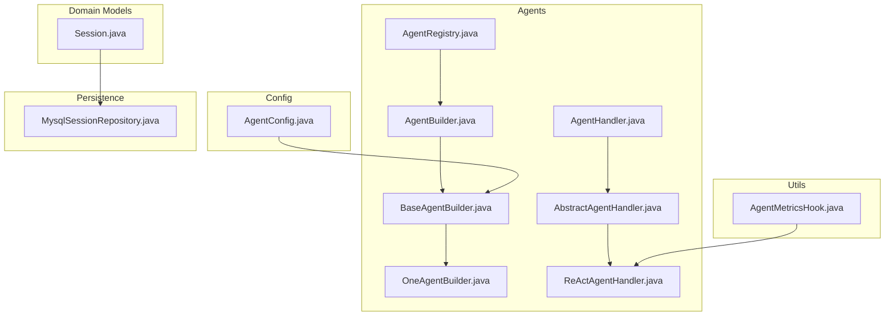
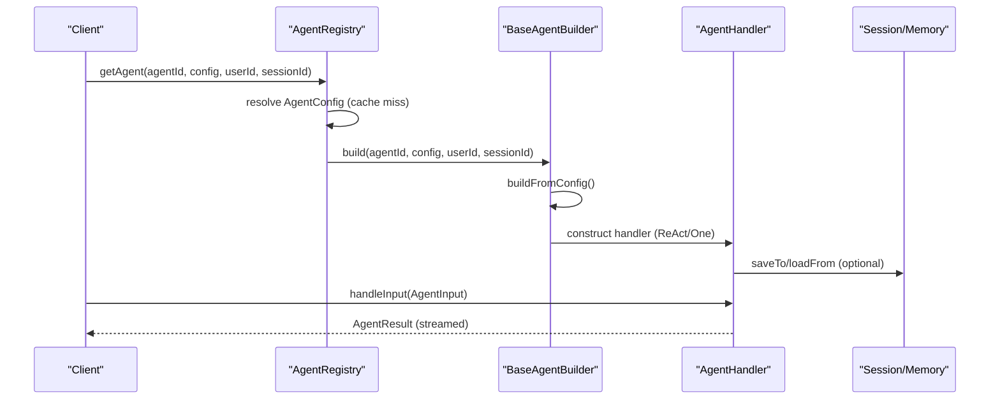
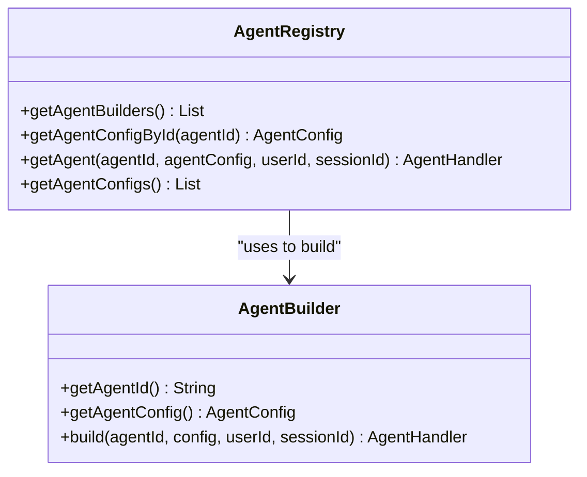
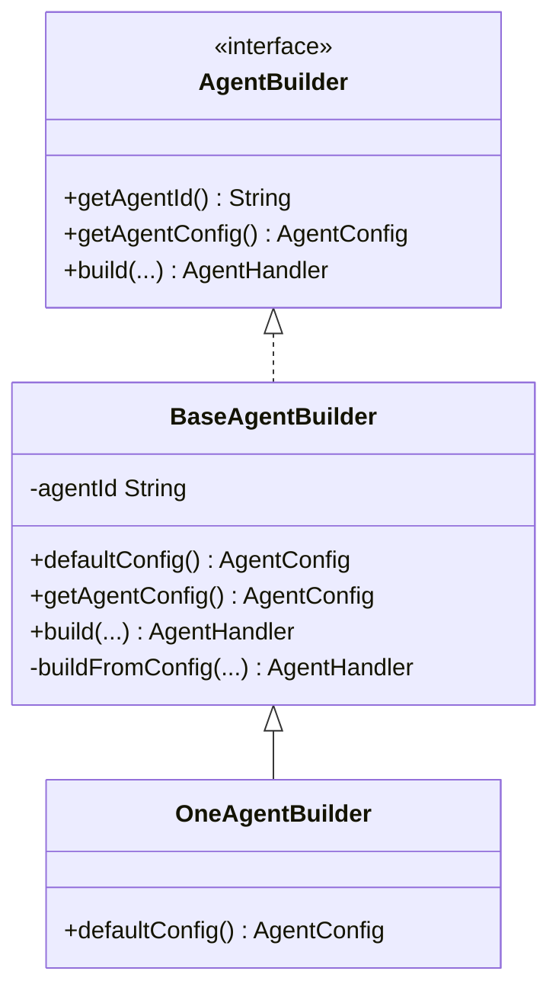
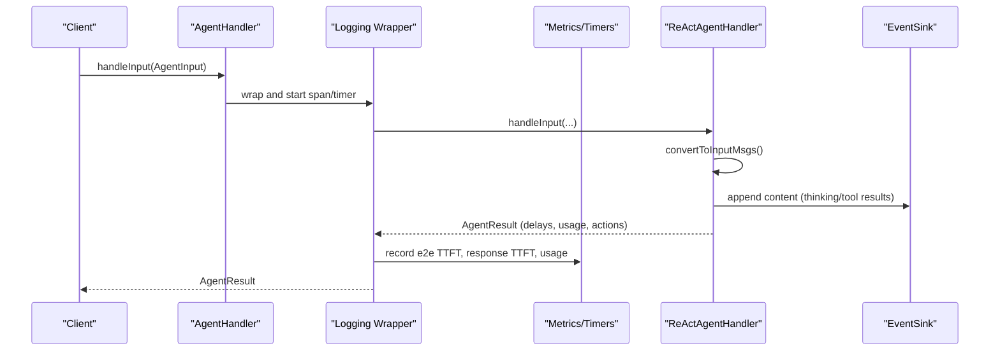
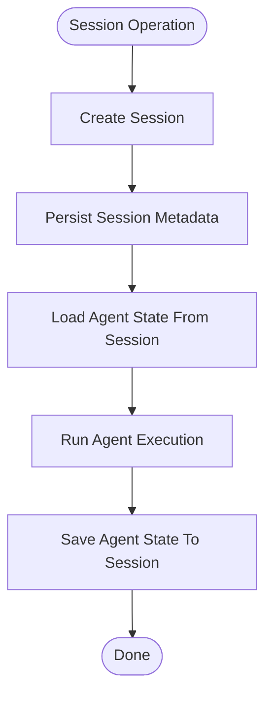
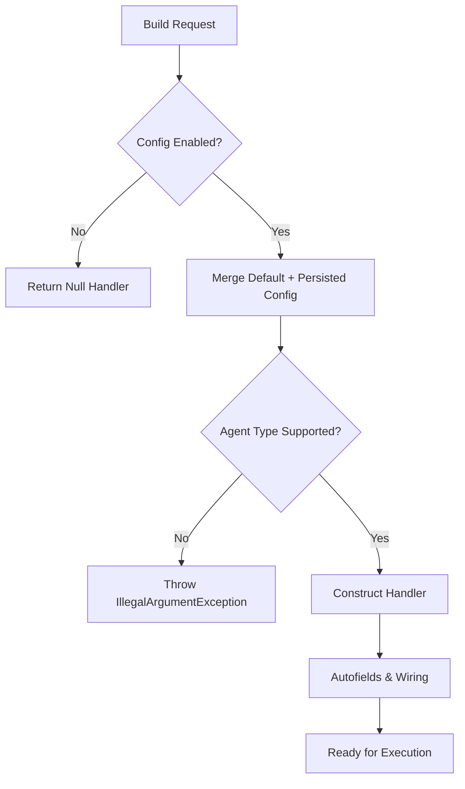
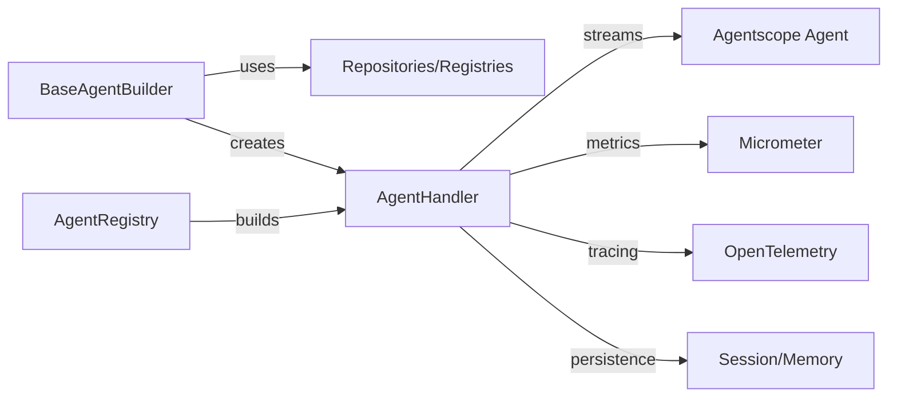

# Agent Lifecycle Management

<cite>
**Referenced Files in This Document**
- [AgentRegistry.java](file://backend_java/core/src/main/java/com/aliyun/tam/x/tron/core/agents/AgentRegistry.java)
- [AgentBuilder.java](file://backend_java/core/src/main/java/com/aliyun/tam/x/tron/core/agents/AgentBuilder.java)
- [BaseAgentBuilder.java](file://backend_java/core/src/main/java/com/aliyun/tam/x/tron/core/agents/BaseAgentBuilder.java)
- [OneAgentBuilder.java](file://backend_java/core/src/main/java/com/aliyun/tam/x/tron/core/agents/examples/OneAgentBuilder.java)
- [AgentHandler.java](file://backend_java/core/src/main/java/com/aliyun/tam/x/tron/core/agents/AgentHandler.java)
- [AbstractAgentHandler.java](file://backend_java/core/src/main/java/com/aliyun/tam/x/tron/core/agents/AbstractAgentHandler.java)
- [ReActAgentHandler.java](file://backend_java/core/src/main/java/com/aliyun/tam/x/tron/core/agents/ReActAgentHandler.java)
- [AgentInput.java](file://backend_java/core/src/main/java/com/aliyun/tam/x/tron/core/agents/AgentInput.java)
- [AgentResult.java](file://backend_java/core/src/main/java/com/aliyun/tam/x/tron/core/agents/AgentResult.java)
- [Session.java](file://backend_java/core/src/main/java/com/aliyun/tam/x/tron/core/domain/models/Session.java)
- [MysqlSessionRepository.java](file://backend_java/core/src/main/java/com/aliyun/tam/x/tron/core/domain/repository/mysql/MysqlSessionRepository.java)
- [AgentConfig.java](file://backend_java/core/src/main/java/com/aliyun/tam/x/tron/core/config/AgentConfig.java)
- [AgentMetricsHook.java](file://backend_java/core/src/main/java/com/aliyun/tam/x/tron/core/utils/AgentMetricsHook.java)
- [OneAgentTest.java](file://backend_java/bootstrap/src/test/java/com/aliyun/tam/x/tron/core/OneAgentTest.java)
</cite>

## Table of Contents
1. [Introduction](#introduction)
2. [Project Structure](#project-structure)
3. [Core Components](#core-components)
4. [Architecture Overview](#architecture-overview)
5. [Detailed Component Analysis](#detailed-component-analysis)
6. [Dependency Analysis](#dependency-analysis)
7. [Performance Considerations](#performance-considerations)
8. [Troubleshooting Guide](#troubleshooting-guide)
9. [Conclusion](#conclusion)
10. [Appendices](#appendices)

## Introduction
This document explains the agent lifecycle management in the Tron One Agent system, focusing on creation, initialization, execution, and cleanup phases. It documents the AgentRegistry for agent discovery and management, the Builder pattern via AgentBuilder and BaseAgentBuilder, and a practical OneAgentBuilder example. It also covers session-based agent state management, memory persistence across sessions, graceful shutdown procedures, configuration validation, error handling during lifecycle transitions, thread-safety considerations, resource cleanup, and monitoring agent health and performance metrics.

## Project Structure
The agent lifecycle spans several packages:
- agents: interfaces and handlers for agent lifecycle and execution
- config: agent configuration models and typed configs
- domain.models: session and message models
- domain.repository.mysql: persistence for sessions and related entities
- utils: system hooks for metrics collection
- examples: concrete builders implementing the Builder pattern

**Diagram sources**
- [AgentBuilder.java:1-34](file://backend_java/core/src/main/java/com/aliyun/tam/x/tron/core/agents/AgentBuilder.java#L1-L34)
- [BaseAgentBuilder.java:1-414](file://backend_java/core/src/main/java/com/aliyun/tam/x/tron/core/agents/BaseAgentBuilder.java#L1-L414)
- [OneAgentBuilder.java:1-79](file://backend_java/core/src/main/java/com/aliyun/tam/x/tron/core/agents/examples/OneAgentBuilder.java#L1-L79)
- [AgentHandler.java:1-149](file://backend_java/core/src/main/java/com/aliyun/tam/x/tron/core/agents/AgentHandler.java#L1-L149)
- [AbstractAgentHandler.java:1-431](file://backend_java/core/src/main/java/com/aliyun/tam/x/tron/core/agents/AbstractAgentHandler.java#L1-L431)
- [ReActAgentHandler.java:1-256](file://backend_java/core/src/main/java/com/aliyun/tam/x/tron/core/agents/ReActAgentHandler.java#L1-L256)
- [AgentRegistry.java:1-99](file://backend_java/core/src/main/java/com/aliyun/tam/x/tron/core/agents/AgentRegistry.java#L1-L99)
- [AgentConfig.java:1-133](file://backend_java/core/src/main/java/com/aliyun/tam/x/tron/core/config/AgentConfig.java#L1-L133)
- [Session.java:1-78](file://backend_java/core/src/main/java/com/aliyun/tam/x/tron/core/domain/models/Session.java#L1-L78)
- [MysqlSessionRepository.java:1-173](file://backend_java/core/src/main/java/com/aliyun/tam/x/tron/core/domain/repository/mysql/MysqlSessionRepository.java#L1-L173)
- [AgentMetricsHook.java:1-116](file://backend_java/core/src/main/java/com/aliyun/tam/x/tron/core/utils/AgentMetricsHook.java#L1-L116)

**Section sources**
- [AgentRegistry.java:1-99](file://backend_java/core/src/main/java/com/aliyun/tam/x/tron/core/agents/AgentRegistry.java#L1-L99)
- [AgentBuilder.java:1-34](file://backend_java/core/src/main/java/com/aliyun/tam/x/tron/core/agents/AgentBuilder.java#L1-L34)
- [BaseAgentBuilder.java:1-414](file://backend_java/core/src/main/java/com/aliyun/tam/x/tron/core/agents/BaseAgentBuilder.java#L1-L414)
- [OneAgentBuilder.java:1-79](file://backend_java/core/src/main/java/com/aliyun/tam/x/tron/core/agents/examples/OneAgentBuilder.java#L1-L79)
- [AgentHandler.java:1-149](file://backend_java/core/src/main/java/com/aliyun/tam/x/tron/core/agents/AgentHandler.java#L1-L149)
- [AbstractAgentHandler.java:1-431](file://backend_java/core/src/main/java/com/aliyun/tam/x/tron/core/agents/AbstractAgentHandler.java#L1-L431)
- [ReActAgentHandler.java:1-256](file://backend_java/core/src/main/java/com/aliyun/tam/x/tron/core/agents/ReActAgentHandler.java#L1-L256)
- [AgentConfig.java:1-133](file://backend_java/core/src/main/java/com/aliyun/tam/x/tron/core/config/AgentConfig.java#L1-L133)
- [Session.java:1-78](file://backend_java/core/src/main/java/com/aliyun/tam/x/tron/core/domain/models/Session.java#L1-L78)
- [MysqlSessionRepository.java:1-173](file://backend_java/core/src/main/java/com/aliyun/tam/x/tron/core/domain/repository/mysql/MysqlSessionRepository.java#L1-L173)
- [AgentMetricsHook.java:1-116](file://backend_java/core/src/main/java/com/aliyun/tam/x/tron/core/utils/AgentMetricsHook.java#L1-L116)

## Core Components
- AgentRegistry: Central registry for discovering and building agents per user/session, with caching and logging wrapper.
- AgentBuilder and BaseAgentBuilder: Builder contract and shared implementation for constructing agents from configuration, including model, tools, skills, knowledge bases, and optional long-term memory.
- OneAgentBuilder: Practical example of a composite agent builder (ONE type) that wires sub-agents and tools.
- AgentHandler and AbstractAgentHandler: Handler interface and base logic for input processing, media handling, runtime context, and streaming execution.
- ReActAgentHandler: Concrete handler for ReAct agents, streaming tokens, tool usage accounting, and cancellation.
- Session and MysqlSessionRepository: Session model and persistence operations for session lifecycle and state.
- AgentConfig: Typed configuration for agent identity, model, skills, tools, knowledge, sub-agents, and capabilities.
- AgentMetricsHook: System-wide hook for collecting reasoning/acting/model usage metrics.

**Section sources**
- [AgentRegistry.java:37-98](file://backend_java/core/src/main/java/com/aliyun/tam/x/tron/core/agents/AgentRegistry.java#L37-L98)
- [AgentBuilder.java:23-33](file://backend_java/core/src/main/java/com/aliyun/tam/x/tron/core/agents/AgentBuilder.java#L23-L33)
- [BaseAgentBuilder.java:74-302](file://backend_java/core/src/main/java/com/aliyun/tam/x/tron/core/agents/BaseAgentBuilder.java#L74-L302)
- [OneAgentBuilder.java:27-79](file://backend_java/core/src/main/java/com/aliyun/tam/x/tron/core/agents/examples/OneAgentBuilder.java#L27-L79)
- [AgentHandler.java:35-149](file://backend_java/core/src/main/java/com/aliyun/tam/x/tron/core/agents/AgentHandler.java#L35-L149)
- [AbstractAgentHandler.java:54-431](file://backend_java/core/src/main/java/com/aliyun/tam/x/tron/core/agents/AbstractAgentHandler.java#L54-L431)
- [ReActAgentHandler.java:41-256](file://backend_java/core/src/main/java/com/aliyun/tam/x/tron/core/agents/ReActAgentHandler.java#L41-L256)
- [Session.java:35-78](file://backend_java/core/src/main/java/com/aliyun/tam/x/tron/core/domain/models/Session.java#L35-L78)
- [MysqlSessionRepository.java:45-173](file://backend_java/core/src/main/java/com/aliyun/tam/x/tron/core/domain/repository/mysql/MysqlSessionRepository.java#L45-L173)
- [AgentConfig.java:39-133](file://backend_java/core/src/main/java/com/aliyun/tam/x/tron/core/config/AgentConfig.java#L39-L133)
- [AgentMetricsHook.java:34-116](file://backend_java/core/src/main/java/com/aliyun/tam/x/tron/core/utils/AgentMetricsHook.java#L34-L116)

## Architecture Overview
The lifecycle orchestrates registry-driven agent discovery, builder-based construction, and handler-based execution with session-aware persistence and metrics.

**Diagram sources**
- [AgentRegistry.java:74-93](file://backend_java/core/src/main/java/com/aliyun/tam/x/tron/core/agents/AgentRegistry.java#L74-L93)
- [BaseAgentBuilder.java:194-302](file://backend_java/core/src/main/java/com/aliyun/tam/x/tron/core/agents/BaseAgentBuilder.java#L194-L302)
- [AgentHandler.java:35-149](file://backend_java/core/src/main/java/com/aliyun/tam/x/tron/core/agents/AgentHandler.java#L35-L149)
- [ReActAgentHandler.java:64-239](file://backend_java/core/src/main/java/com/aliyun/tam/x/tron/core/agents/ReActAgentHandler.java#L64-L239)

## Detailed Component Analysis

### AgentRegistry: Discovery and Management
- Responsibilities:
  - Discover AgentConfig by agentId
  - Build AgentHandler via registered AgentBuilder instances
  - Cache handlers keyed by AgentConfig + userId + sessionId
  - Wrap handlers with logging and tracing
- Thread-safety:
  - Uses a LoadingCache with a CacheLoader; cache operations are thread-safe
- Operations:
  - getAgentConfigById(agentId)
  - getAgent(agentId, agentConfig, userId, sessionId)
  - getAgentConfigs()

**Diagram sources**
- [AgentRegistry.java:39-98](file://backend_java/core/src/main/java/com/aliyun/tam/x/tron/core/agents/AgentRegistry.java#L39-L98)
- [AgentBuilder.java:23-33](file://backend_java/core/src/main/java/com/aliyun/tam/x/tron/core/agents/AgentBuilder.java#L23-L33)

**Section sources**
- [AgentRegistry.java:49-98](file://backend_java/core/src/main/java/com/aliyun/tam/x/tron/core/agents/AgentRegistry.java#L49-L98)

### Builder Pattern: AgentBuilder and BaseAgentBuilder
- AgentBuilder defines the contract for agent construction and publishing.
- BaseAgentBuilder provides:
  - Default config merging with persisted config
  - Chat model construction (DashScope/OpenAI-compatible)
  - Toolkit and MCP client registration
  - Knowledge base assembly
  - Skill box creation with workspace isolation and checksum hashing
  - ReAct and ONE agent construction paths
  - Long-term memory integration when configured
- OneAgentBuilder demonstrates:
  - Composite agent with sub-agents (local and A2A)
  - Prompt loading from resources
  - Model configuration and supported input types

**Diagram sources**
- [AgentBuilder.java:23-33](file://backend_java/core/src/main/java/com/aliyun/tam/x/tron/core/agents/AgentBuilder.java#L23-L33)
- [BaseAgentBuilder.java:74-302](file://backend_java/core/src/main/java/com/aliyun/tam/x/tron/core/agents/BaseAgentBuilder.java#L74-L302)
- [OneAgentBuilder.java:27-79](file://backend_java/core/src/main/java/com/aliyun/tam/x/tron/core/agents/examples/OneAgentBuilder.java#L27-L79)

**Section sources**
- [BaseAgentBuilder.java:183-302](file://backend_java/core/src/main/java/com/aliyun/tam/x/tron/core/agents/BaseAgentBuilder.java#L183-L302)
- [OneAgentBuilder.java:38-76](file://backend_java/core/src/main/java/com/aliyun/tam/x/tron/core/agents/examples/OneAgentBuilder.java#L38-L76)

### Handler Execution: AgentHandler, AbstractAgentHandler, ReActAgentHandler
- AgentHandler interface:
  - getId(), handleInput(AgentInput), supportInputType(), cancel(message)
  - Logging wrapper adds tracing, timers, and metrics
- AbstractAgentHandler:
  - Validates input types against AgentConfig
  - Converts UserSessionMessage to internal Msg with media handling and runtime context
  - Registers question tool when enabled
  - Provides fast chat model accessor
- ReActAgentHandler:
  - Streams ReActAgent events
  - Tracks first-token and first-response delays
  - Formats tool usage and results, updates actions and usage counters
  - Handles HITL (human-in-the-loop) approvals/rejections
  - Supports cancellation and cleanup of pending tool calls
  - Emits follow-up suggestions when appropriate

**Diagram sources**
- [AgentHandler.java:48-149](file://backend_java/core/src/main/java/com/aliyun/tam/x/tron/core/agents/AgentHandler.java#L48-L149)
- [AbstractAgentHandler.java:151-431](file://backend_java/core/src/main/java/com/aliyun/tam/x/tron/core/agents/AbstractAgentHandler.java#L151-L431)
- [ReActAgentHandler.java:64-239](file://backend_java/core/src/main/java/com/aliyun/tam/x/tron/core/agents/ReActAgentHandler.java#L64-L239)

**Section sources**
- [AgentHandler.java:35-149](file://backend_java/core/src/main/java/com/aliyun/tam/x/tron/core/agents/AgentHandler.java#L35-L149)
- [AbstractAgentHandler.java:151-431](file://backend_java/core/src/main/java/com/aliyun/tam/x/tron/core/agents/AbstractAgentHandler.java#L151-L431)
- [ReActAgentHandler.java:41-256](file://backend_java/core/src/main/java/com/aliyun/tam/x/tron/core/agents/ReActAgentHandler.java#L41-L256)

### Session-Based State Management and Persistence
- Session model captures agentId, userId, name, last applied event id, and timestamps.
- MysqlSessionRepository provides:
  - Create new session
  - List sessions with pagination
  - Retrieve session by agentId and sessionId
  - Delete session and associated messages/events/state
  - Update session name and last applied event id
- State persistence:
  - Handlers implement StateModule and delegate saveTo/loadFrom to underlying agent/memory/session
  - AgentRegistry wraps handlers to ensure consistent logging and tracing around state operations

**Diagram sources**
- [Session.java:35-78](file://backend_java/core/src/main/java/com/aliyun/tam/x/tron/core/domain/models/Session.java#L35-L78)
- [MysqlSessionRepository.java:60-159](file://backend_java/core/src/main/java/com/aliyun/tam/x/tron/core/domain/repository/mysql/MysqlSessionRepository.java#L60-L159)
- [AgentHandler.java:66-73](file://backend_java/core/src/main/java/com/aliyun/tam/x/tron/core/agents/AgentHandler.java#L66-L73)

**Section sources**
- [Session.java:35-78](file://backend_java/core/src/main/java/com/aliyun/tam/x/tron/core/domain/models/Session.java#L35-L78)
- [MysqlSessionRepository.java:45-173](file://backend_java/core/src/main/java/com/aliyun/tam/x/tron/core/domain/repository/mysql/MysqlSessionRepository.java#L45-L173)
- [AgentHandler.java:66-73](file://backend_java/core/src/main/java/com/aliyun/tam/x/tron/core/agents/AgentHandler.java#L66-L73)

### Configuration Validation and Error Handling
- Configuration validation:
  - AgentConfig merges persisted and default configs; versioning is maintained
  - Unsupported agent types throw IllegalArgumentException during build
  - Skills are synced and validated; missing/built-in skills are handled gracefully
- Error handling:
  - Logging wrapper records exceptions, sets span status, and rethrows
  - ReActAgentHandler marks session message status as FAILED on error
  - Cancellation interrupts agent execution and cleans pending tool calls

**Diagram sources**
- [BaseAgentBuilder.java:202-302](file://backend_java/core/src/main/java/com/aliyun/tam/x/tron/core/agents/BaseAgentBuilder.java#L202-L302)
- [AgentHandler.java:128-140](file://backend_java/core/src/main/java/com/aliyun/tam/x/tron/core/agents/AgentHandler.java#L128-L140)
- [ReActAgentHandler.java:224-228](file://backend_java/core/src/main/java/com/aliyun/tam/x/tron/core/agents/ReActAgentHandler.java#L224-L228)

**Section sources**
- [BaseAgentBuilder.java:202-302](file://backend_java/core/src/main/java/com/aliyun/tam/x/tron/core/agents/BaseAgentBuilder.java#L202-L302)
- [AgentHandler.java:128-140](file://backend_java/core/src/main/java/com/aliyun/tam/x/tron/core/agents/AgentHandler.java#L128-L140)
- [ReActAgentHandler.java:224-228](file://backend_java/core/src/main/java/com/aliyun/tam/x/tron/core/agents/ReActAgentHandler.java#L224-L228)

### Graceful Shutdown and Cleanup
- Cancellation:
  - ReActAgentHandler supports cancellation with optional interrupt message
  - Pending tool calls are cleaned up and session message marked as cancelled
- Resource cleanup:
  - SkillBox work directories are managed per agentId and checksum
  - Handler wrappers ensure metrics and tracing are finalized
- Session cleanup:
  - MysqlSessionRepository supports deletion of session and related entities

**Section sources**
- [ReActAgentHandler.java:241-254](file://backend_java/core/src/main/java/com/aliyun/tam/x/tron/core/agents/ReActAgentHandler.java#L241-L254)
- [BaseAgentBuilder.java:389-401](file://backend_java/core/src/main/java/com/aliyun/tam/x/tron/core/agents/BaseAgentBuilder.java#L389-L401)
- [MysqlSessionRepository.java:114-136](file://backend_java/core/src/main/java/com/aliyun/tam/x/tron/core/domain/repository/mysql/MysqlSessionRepository.java#L114-L136)

### Monitoring Agent Health and Performance
- Metrics:
  - End-to-end latency histogram (e2e)
  - First-token delay histograms (TTFT, response TTFT)
  - Token usage and model time summaries
  - Reasoning/acting/error counters
- Hooks:
  - AgentMetricsHook registers as a system hook to capture pre/post reasoning/acting/summary and error events

**Section sources**
- [AgentHandler.java:92-127](file://backend_java/core/src/main/java/com/aliyun/tam/x/tron/core/agents/AgentHandler.java#L92-L127)
- [AgentHandler.java:108-124](file://backend_java/core/src/main/java/com/aliyun/tam/x/tron/core/agents/AgentHandler.java#L108-L124)
- [AgentMetricsHook.java:44-114](file://backend_java/core/src/main/java/com/aliyun/tam/x/tron/core/utils/AgentMetricsHook.java#L44-L114)

## Dependency Analysis
- Coupling:
  - BaseAgentBuilder depends on repositories, registries, and tool/mcp/knowledge systems
  - AgentRegistry depends on AgentBuilder implementations and Guava cache
  - Handlers depend on session/memory and event sinks
- Cohesion:
  - Builders encapsulate construction logic; handlers encapsulate execution logic
- External dependencies:
  - Agentscope core for ReAct agent, memory, and session APIs
  - Micrometer for metrics
  - OpenTelemetry for tracing
  - Spring for DI and transactional persistence

**Diagram sources**
- [BaseAgentBuilder.java:146-177](file://backend_java/core/src/main/java/com/aliyun/tam/x/tron/core/agents/BaseAgentBuilder.java#L146-L177)
- [AgentRegistry.java:53-59](file://backend_java/core/src/main/java/com/aliyun/tam/x/tron/core/agents/AgentRegistry.java#L53-L59)
- [AgentHandler.java:85-142](file://backend_java/core/src/main/java/com/aliyun/tam/x/tron/core/agents/AgentHandler.java#L85-L142)

**Section sources**
- [BaseAgentBuilder.java:146-177](file://backend_java/core/src/main/java/com/aliyun/tam/x/tron/core/agents/BaseAgentBuilder.java#L146-L177)
- [AgentRegistry.java:53-59](file://backend_java/core/src/main/java/com/aliyun/tam/x/tron/core/agents/AgentRegistry.java#L53-L59)
- [AgentHandler.java:85-142](file://backend_java/core/src/main/java/com/aliyun/tam/x/tron/core/agents/AgentHandler.java#L85-L142)

## Performance Considerations
- Caching:
  - AgentRegistry caches handlers per user/session to avoid repeated construction
- Streaming:
  - ReActAgentHandler streams tokens and tool results to reduce latency
- Metrics:
  - Histograms and summaries enable SLA monitoring and bottleneck detection
- Concurrency:
  - Concurrent maps for tool usage and metrics; atomic flags for cancellation

[No sources needed since this section provides general guidance]

## Troubleshooting Guide
- Agent not found:
  - Verify agentId resolution via AgentRegistry and that a matching AgentBuilder exists
- Unsupported agent type:
  - Ensure AgentConfig.type matches supported types (REACT/ONE)
- Skill sync failures:
  - Check logs for IOException during skill synchronization; verify skill availability
- Cancellation not working:
  - Confirm ReActAgentHandler.cancel is invoked and pending tool calls are cleared
- Metrics missing:
  - Ensure AgentMetricsHook is initialized and system hooks are registered

**Section sources**
- [AgentRegistry.java:74-93](file://backend_java/core/src/main/java/com/aliyun/tam/x/tron/core/agents/AgentRegistry.java#L74-L93)
- [BaseAgentBuilder.java:301](file://backend_java/core/src/main/java/com/aliyun/tam/x/tron/core/agents/BaseAgentBuilder.java#L301)
- [BaseAgentBuilder.java:372-375](file://backend_java/core/src/main/java/com/aliyun/tam/x/tron/core/agents/BaseAgentBuilder.java#L372-L375)
- [ReActAgentHandler.java:241-254](file://backend_java/core/src/main/java/com/aliyun/tam/x/tron/core/agents/ReActAgentHandler.java#L241-L254)
- [AgentMetricsHook.java:37-40](file://backend_java/core/src/main/java/com/aliyun/tam/x/tron/core/utils/AgentMetricsHook.java#L37-L40)

## Conclusion
The Tron One Agent system provides a robust lifecycle framework centered on a registry-driven discovery, builder-based construction, and handler-based streaming execution. Session-aware state persistence, comprehensive metrics, and cancellation mechanisms ensure reliable operation. The modular design enables easy extension and testing, as demonstrated by the OneAgentBuilder example and evaluation tests.

[No sources needed since this section summarizes without analyzing specific files]

## Appendices

### Agent Instantiation Workflow Example
- Obtain AgentConfig via AgentRegistry.getAgentConfigById
- Call AgentRegistry.getAgent with agentId, optional config override, userId, sessionId
- Receive AgentHandler wrapper with tracing and metrics
- Execute AgentResult via handleInput and stream results

**Section sources**
- [OneAgentTest.java:51-62](file://backend_java/bootstrap/src/test/java/com/aliyun/tam/x/tron/core/OneAgentTest.java#L51-L62)
- [AgentRegistry.java:74-83](file://backend_java/core/src/main/java/com/aliyun/tam/x/tron/core/agents/AgentRegistry.java#L74-L83)

### Configuration Validation Checklist
- AgentConfig.enabled is true
- ChatModelConfig type is supported
- Tools and MCP clients are registered
- Knowledge bases are built successfully
- Skills are enabled and synced

**Section sources**
- [BaseAgentBuilder.java:205-211](file://backend_java/core/src/main/java/com/aliyun/tam/x/tron/core/agents/BaseAgentBuilder.java#L205-L211)
- [BaseAgentBuilder.java:322-331](file://backend_java/core/src/main/java/com/aliyun/tam/x/tron/core/agents/BaseAgentBuilder.java#L322-L331)
- [BaseAgentBuilder.java:368-383](file://backend_java/core/src/main/java/com/aliyun/tam/x/tron/core/agents/BaseAgentBuilder.java#L368-L383)