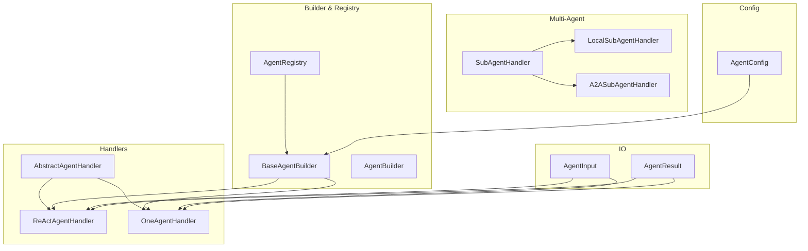
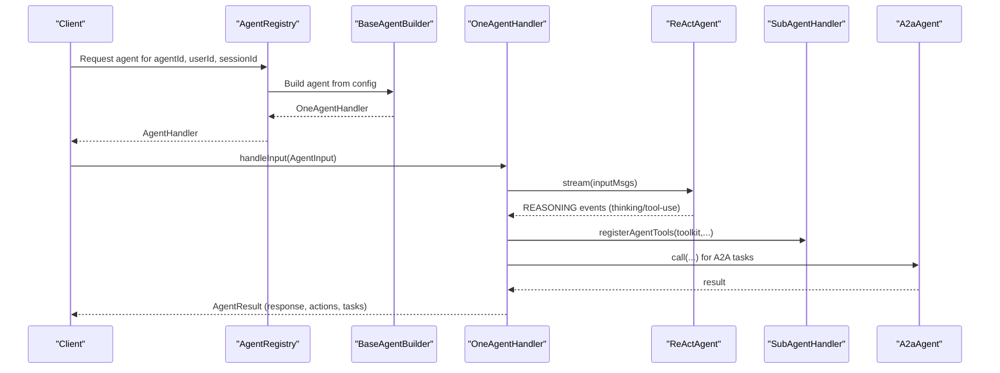
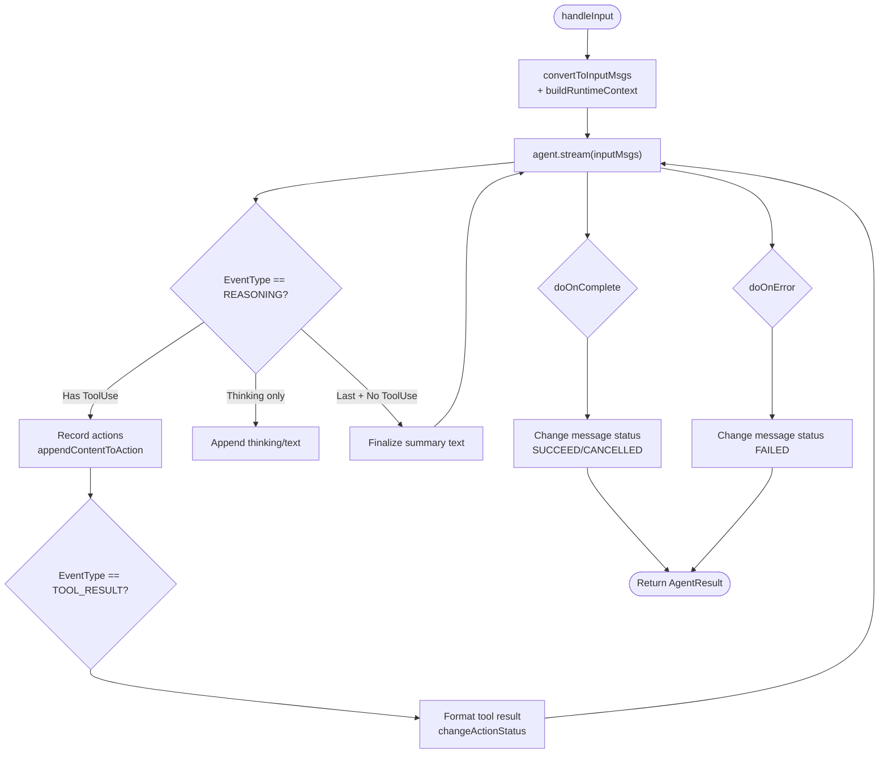
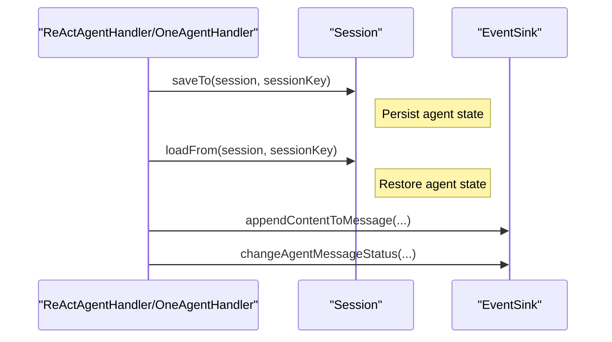
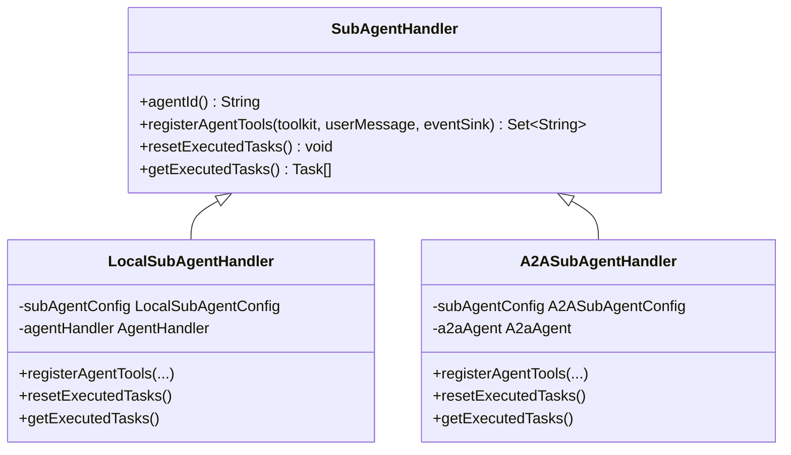
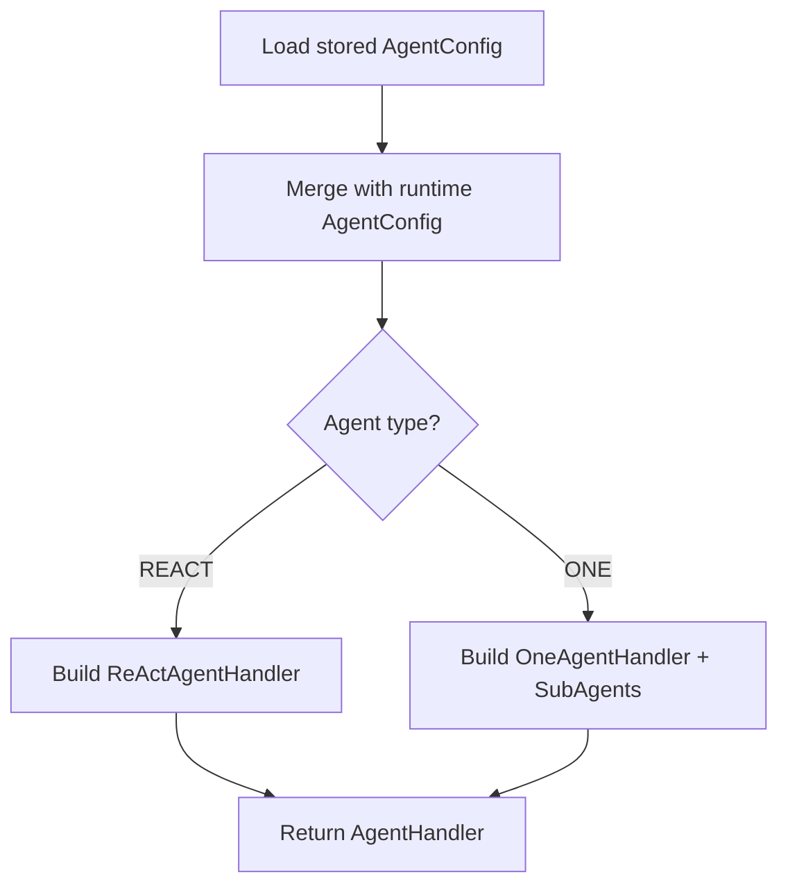
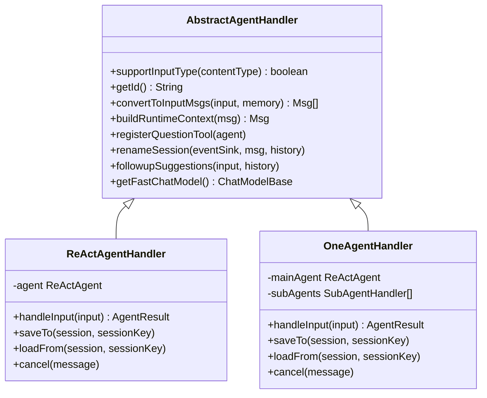
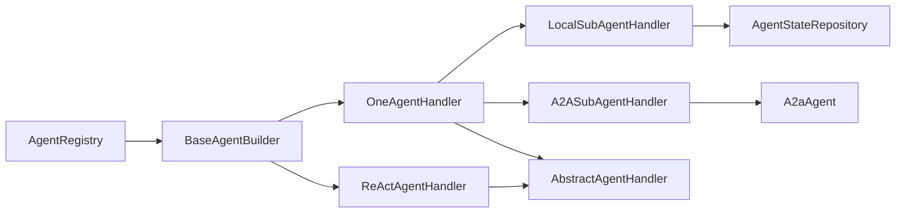

# Agent System

<cite>
**Referenced Files in This Document**
- [AbstractAgentHandler.java](file://backend_java/core/src/main/java/com/aliyun/tam/x/tron/core/agents/AbstractAgentHandler.java)
- [ReActAgentHandler.java](file://backend_java/core/src/main/java/com/aliyun/tam/x/tron/core/agents/ReActAgentHandler.java)
- [OneAgentHandler.java](file://backend_java/core/src/main/java/com/aliyun/tam/x/tron/core/agents/one/OneAgentHandler.java)
- [A2ASubAgentHandler.java](file://backend_java/core/src/main/java/com/aliyun/tam/x/tron/core/agents/one/A2ASubAgentHandler.java)
- [LocalSubAgentHandler.java](file://backend_java/core/src/main/java/com/aliyun/tam/x/tron/core/agents/one/LocalSubAgentHandler.java)
- [SubAgentHandler.java](file://backend_java/core/src/main/java/com/aliyun/tam/x/tron/core/agents/one/SubAgentHandler.java)
- [BaseAgentBuilder.java](file://backend_java/core/src/main/java/com/aliyun/tam/x/tron/core/agents/BaseAgentBuilder.java)
- [AgentBuilder.java](file://backend_java/core/src/main/java/com/aliyun/tam/x/tron/core/agents/AgentBuilder.java)
- [AgentRegistry.java](file://backend_java/core/src/main/java/com/aliyun/tam/x/tron/core/agents/AgentRegistry.java)
- [AgentHandler.java](file://backend_java/core/src/main/java/com/aliyun/tam/x/tron/core/agents/AgentHandler.java)
- [AgentInput.java](file://backend_java/core/src/main/java/com/aliyun/tam/x/tron/core/agents/AgentInput.java)
- [AgentResult.java](file://backend_java/core/src/main/java/com/aliyun/tam/x/tron/core/agents/AgentResult.java)
- [AgentConfig.java](file://backend_java/core/src/main/java/com/aliyun/tam/x/tron/core/config/AgentConfig.java)
- [one_agent_system_prompt.md](file://backend_java/core/src/main/resources/prompts/one_agent_system_prompt.md)
- [SimpleAgentBuilder.java](file://backend_java/core/src/main/java/com/aliyun/tam/x/tron/core/agents/examples/SimpleAgentBuilder.java)
- [OneAgentBuilder.java](file://backend_java/core/src/main/java/com/aliyun/tam/x/tron/core/agents/examples/OneAgentBuilder.java)
</cite>

## Table of Contents
1. [Introduction](#introduction)
2. [Project Structure](#project-structure)
3. [Core Components](#core-components)
4. [Architecture Overview](#architecture-overview)
5. [Detailed Component Analysis](#detailed-component-analysis)
6. [Dependency Analysis](#dependency-analysis)
7. [Performance Considerations](#performance-considerations)
8. [Troubleshooting Guide](#troubleshooting-guide)
9. [Conclusion](#conclusion)
10. [Appendices](#appendices)

## Introduction
This document explains the Tron OneAgent system’s core agent architecture with a focus on the ReAct (Reasoning-Act) pattern, agent lifecycle management, multi-agent orchestration, configuration and hot-reload mechanisms, and integration with external services. It covers how agents perform reasoning loops followed by action execution, how sessions and memory are managed, and how the OneAgent orchestrates local and remote sub-agents via the A2A protocol. Practical examples and diagrams illustrate agent behavior, tool usage, and debugging techniques.

## Project Structure
The agent system resides primarily under backend_java/core/src/main/java/com/aliyun/tam/x/tron/core/agents and related subpackages. Key areas:
- Handler hierarchy: AbstractAgentHandler, ReActAgentHandler, OneAgentHandler
- Multi-agent support: SubAgentHandler, LocalSubAgentHandler, A2ASubAgentHandler
- Builder and registry: BaseAgentBuilder, AgentBuilder, AgentRegistry
- Configuration: AgentConfig and related config classes
- Inputs/outputs: AgentInput, AgentResult
- Prompts: one_agent_system_prompt.md

**Diagram sources**
- [AbstractAgentHandler.java:1-431](file://backend_java/core/src/main/java/com/aliyun/tam/x/tron/core/agents/AbstractAgentHandler.java#L1-L431)
- [ReActAgentHandler.java:1-256](file://backend_java/core/src/main/java/com/aliyun/tam/x/tron/core/agents/ReActAgentHandler.java#L1-L256)
- [OneAgentHandler.java:1-289](file://backend_java/core/src/main/java/com/aliyun/tam/x/tron/core/agents/one/OneAgentHandler.java#L1-L289)
- [SubAgentHandler.java:1-46](file://backend_java/core/src/main/java/com/aliyun/tam/x/tron/core/agents/one/SubAgentHandler.java#L1-L46)
- [LocalSubAgentHandler.java:1-236](file://backend_java/core/src/main/java/com/aliyun/tam/x/tron/core/agents/one/LocalSubAgentHandler.java#L1-L236)
- [A2ASubAgentHandler.java:1-199](file://backend_java/core/src/main/java/com/aliyun/tam/x/tron/core/agents/one/A2ASubAgentHandler.java#L1-L199)
- [BaseAgentBuilder.java:1-414](file://backend_java/core/src/main/java/com/aliyun/tam/x/tron/core/agents/BaseAgentBuilder.java#L1-L414)
- [AgentBuilder.java:1-34](file://backend_java/core/src/main/java/com/aliyun/tam/x/tron/core/agents/AgentBuilder.java#L1-L34)
- [AgentRegistry.java:1-99](file://backend_java/core/src/main/java/com/aliyun/tam/x/tron/core/agents/AgentRegistry.java#L1-L99)
- [AgentConfig.java:1-133](file://backend_java/core/src/main/java/com/aliyun/tam/x/tron/core/config/AgentConfig.java#L1-L133)
- [AgentInput.java:1-30](file://backend_java/core/src/main/java/com/aliyun/tam/x/tron/core/agents/AgentInput.java#L1-L30)
- [AgentResult.java:1-84](file://backend_java/core/src/main/java/com/aliyun/tam/x/tron/core/agents/AgentResult.java#L1-L84)

**Section sources**
- [AbstractAgentHandler.java:1-431](file://backend_java/core/src/main/java/com/aliyun/tam/x/tron/core/agents/AbstractAgentHandler.java#L1-L431)
- [BaseAgentBuilder.java:1-414](file://backend_java/core/src/main/java/com/aliyun/tam/x/tron/core/agents/BaseAgentBuilder.java#L1-L414)
- [AgentRegistry.java:1-99](file://backend_java/core/src/main/java/com/aliyun/tam/x/tron/core/agents/AgentRegistry.java#L1-L99)
- [AgentConfig.java:1-133](file://backend_java/core/src/main/java/com/aliyun/tam/x/tron/core/config/AgentConfig.java#L1-L133)
- [AgentInput.java:1-30](file://backend_java/core/src/main/java/com/aliyun/tam/x/tron/core/agents/AgentInput.java#L1-L30)
- [AgentResult.java:1-84](file://backend_java/core/src/main/java/com/aliyun/tam/x/tron/core/agents/AgentResult.java#L1-L84)

## Core Components
- AbstractAgentHandler: Shared logic for input conversion, media processing, runtime context injection, question tool registration, session renaming, follow-up suggestions, and fast chat model access.
- ReActAgentHandler: Implements ReAct reasoning loop streaming, captures thinking and reasoning events, translates tool use blocks into actions, handles tool results, cancellation, and status updates.
- OneAgentHandler: Orchestrates a main ReAct agent plus sub-agents (local and A2A), aggregates tasks, manages tool distribution, and mirrors ReAct-style streaming behavior.
- SubAgentHandler family: LocalSubAgentHandler and A2ASubAgentHandler register sub-agent tools into the main toolkit and execute tasks within isolated sessions.
- BaseAgentBuilder: Builds ReAct or One agent stacks from configuration, wires tools, skills, knowledge bases, RAG mode, long-term memory, and A2A/local sub-agents.
- AgentRegistry: Resolves and caches agent handlers per agentId/userId/sessionId, with logging wrapper instrumentation.
- AgentInput/AgentResult: Typed inputs and outputs for agent processing, including actions and tasks.

**Section sources**
- [AbstractAgentHandler.java:1-431](file://backend_java/core/src/main/java/com/aliyun/tam/x/tron/core/agents/AbstractAgentHandler.java#L1-L431)
- [ReActAgentHandler.java:1-256](file://backend_java/core/src/main/java/com/aliyun/tam/x/tron/core/agents/ReActAgentHandler.java#L1-L256)
- [OneAgentHandler.java:1-289](file://backend_java/core/src/main/java/com/aliyun/tam/x/tron/core/agents/one/OneAgentHandler.java#L1-L289)
- [LocalSubAgentHandler.java:1-236](file://backend_java/core/src/main/java/com/aliyun/tam/x/tron/core/agents/one/LocalSubAgentHandler.java#L1-L236)
- [A2ASubAgentHandler.java:1-199](file://backend_java/core/src/main/java/com/aliyun/tam/x/tron/core/agents/one/A2ASubAgentHandler.java#L1-L199)
- [BaseAgentBuilder.java:1-414](file://backend_java/core/src/main/java/com/aliyun/tam/x/tron/core/agents/BaseAgentBuilder.java#L1-L414)
- [AgentRegistry.java:1-99](file://backend_java/core/src/main/java/com/aliyun/tam/x/tron/core/agents/AgentRegistry.java#L1-L99)
- [AgentInput.java:1-30](file://backend_java/core/src/main/java/com/aliyun/tam/x/tron/core/agents/AgentInput.java#L1-L30)
- [AgentResult.java:1-84](file://backend_java/core/src/main/java/com/aliyun/tam/x/tron/core/agents/AgentResult.java#L1-L84)

## Architecture Overview
The system centers on ReAct reasoning with streaming events. AbstractAgentHandler normalizes inputs and enriches runtime context. ReActAgentHandler streams reasoning and tool-use events, translating them into actionable steps and updating message/action/task statuses. OneAgentHandler augments this with sub-agents: LocalSubAgentHandler executes tasks by delegating to another AgentHandler, while A2ASubAgentHandler invokes remote A2A agents via A2aAgent. BaseAgentBuilder constructs the agent stack from configuration, wiring tools, skills, knowledge, and memory. AgentRegistry resolves and caches handlers per session.

**Diagram sources**
- [AgentRegistry.java:74-93](file://backend_java/core/src/main/java/com/aliyun/tam/x/tron/core/agents/AgentRegistry.java#L74-L93)
- [BaseAgentBuilder.java:202-302](file://backend_java/core/src/main/java/com/aliyun/tam/x/tron/core/agents/BaseAgentBuilder.java#L202-L302)
- [OneAgentHandler.java:74-272](file://backend_java/core/src/main/java/com/aliyun/tam/x/tron/core/agents/one/OneAgentHandler.java#L74-L272)
- [A2ASubAgentHandler.java:118-180](file://backend_java/core/src/main/java/com/aliyun/tam/x/tron/core/agents/one/A2ASubAgentHandler.java#L118-L180)
- [LocalSubAgentHandler.java:122-220](file://backend_java/core/src/main/java/com/aliyun/tam/x/tron/core/agents/one/LocalSubAgentHandler.java#L122-L220)

## Detailed Component Analysis

### ReAct Pattern Implementation
The ReAct pattern is implemented via streaming events from the underlying ReActAgent. The handler:
- Converts user input into normalized messages and injects runtime context.
- Streams REASONING events containing thinking and tool-use blocks.
- Translates tool-use blocks into actions, recording arguments and results.
- Emits SUMMARY events as final responses.
- Updates message status upon completion or cancellation.
- Supports HITL (Human-in-the-Loop) via a dedicated question tool, pausing for user approval.

**Diagram sources**
- [ReActAgentHandler.java:64-239](file://backend_java/core/src/main/java/com/aliyun/tam/x/tron/core/agents/ReActAgentHandler.java#L64-L239)
- [AbstractAgentHandler.java:191-278](file://backend_java/core/src/main/java/com/aliyun/tam/x/tron/core/agents/AbstractAgentHandler.java#L191-L278)

**Section sources**
- [ReActAgentHandler.java:64-239](file://backend_java/core/src/main/java/com/aliyun/tam/x/tron/core/agents/ReActAgentHandler.java#L64-L239)
- [AbstractAgentHandler.java:191-278](file://backend_java/core/src/main/java/com/aliyun/tam/x/tron/core/agents/AbstractAgentHandler.java#L191-L278)

### Agent Lifecycle Management
- Session creation and persistence: Both ReActAgentHandler and OneAgentHandler implement saveTo/loadFrom to persist agent state into a Session keyed by agentId and sessionId. This enables resuming conversations across requests.
- Memory integration: Agents use in-memory or long-term memory depending on configuration. AbstractAgentHandler injects runtime context into the first text block to aid grounding.
- Event-driven status updates: Handlers update message status (SUCCEED, FAILED, CANCELLED) and append content incrementally via EventSink.

**Diagram sources**
- [ReActAgentHandler.java:53-61](file://backend_java/core/src/main/java/com/aliyun/tam/x/tron/core/agents/ReActAgentHandler.java#L53-L61)
- [OneAgentHandler.java:63-71](file://backend_java/core/src/main/java/com/aliyun/tam/x/tron/core/agents/one/OneAgentHandler.java#L63-L71)
- [AbstractAgentHandler.java:389-421](file://backend_java/core/src/main/java/com/aliyun/tam/x/tron/core/agents/AbstractAgentHandler.java#L389-L421)

**Section sources**
- [ReActAgentHandler.java:53-61](file://backend_java/core/src/main/java/com/aliyun/tam/x/tron/core/agents/ReActAgentHandler.java#L53-L61)
- [OneAgentHandler.java:63-71](file://backend_java/core/src/main/java/com/aliyun/tam/x/tron/core/agents/one/OneAgentHandler.java#L63-L71)
- [AbstractAgentHandler.java:389-421](file://backend_java/core/src/main/java/com/aliyun/tam/x/tron/core/agents/AbstractAgentHandler.java#L389-L421)

### Multi-Agent Orchestration (Local and Remote)
- Local sub-agents: LocalSubAgentHandler registers a tool named after the sub-agent, which constructs a UserSessionMessage and delegates to another AgentHandler. It persists and restores sub-session state and reports task outcomes.
- Remote sub-agents (A2A): A2ASubAgentHandler registers AgentTool wrappers around AgentCard skills. Calls are routed to A2aAgent, which loads/stores sub-session state and returns results. Tasks are tracked and reported.

**Diagram sources**
- [SubAgentHandler.java:29-45](file://backend_java/core/src/main/java/com/aliyun/tam/x/tron/core/agents/one/SubAgentHandler.java#L29-L45)
- [LocalSubAgentHandler.java:52-236](file://backend_java/core/src/main/java/com/aliyun/tam/x/tron/core/agents/one/LocalSubAgentHandler.java#L52-L236)
- [A2ASubAgentHandler.java:52-199](file://backend_java/core/src/main/java/com/aliyun/tam/x/tron/core/agents/one/A2ASubAgentHandler.java#L52-L199)

**Section sources**
- [LocalSubAgentHandler.java:103-224](file://backend_java/core/src/main/java/com/aliyun/tam/x/tron/core/agents/one/LocalSubAgentHandler.java#L103-L224)
- [A2ASubAgentHandler.java:90-187](file://backend_java/core/src/main/java/com/aliyun/tam/x/tron/core/agents/one/A2ASubAgentHandler.java#L90-L187)

### Configuration Management and Hot-Reloading
- AgentConfig encapsulates agent identity, type, model, tools, MCP clients, knowledge bases, skills, RAG mode, long-term memory, and input-type support.
- BaseAgentBuilder merges runtime-provided config with stored config, enabling hot-reload-like behavior by overriding fields at runtime.
- AgentRegistry caches handlers per agentId/userId/sessionId and wraps them with a logging wrapper for observability.

**Diagram sources**
- [AgentConfig.java:39-132](file://backend_java/core/src/main/java/com/aliyun/tam/x/tron/core/config/AgentConfig.java#L39-L132)
- [BaseAgentBuilder.java:202-302](file://backend_java/core/src/main/java/com/aliyun/tam/x/tron/core/agents/BaseAgentBuilder.java#L202-L302)
- [AgentRegistry.java:74-93](file://backend_java/core/src/main/java/com/aliyun/tam/x/tron/core/agents/AgentRegistry.java#L74-L93)

**Section sources**
- [AgentConfig.java:39-132](file://backend_java/core/src/main/java/com/aliyun/tam/x/tron/core/config/AgentConfig.java#L39-L132)
- [BaseAgentBuilder.java:202-302](file://backend_java/core/src/main/java/com/aliyun/tam/x/tron/core/agents/BaseAgentBuilder.java#L202-L302)
- [AgentRegistry.java:74-93](file://backend_java/core/src/main/java/com/aliyun/tam/x/tron/core/agents/AgentRegistry.java#L74-L93)

### Relationship Between AbstractAgentHandler, ReActAgentHandler, and OneAgentHandler
- AbstractAgentHandler provides shared utilities: input normalization, media processing, runtime context, question tool, renaming, suggestions, and fast model access.
- ReActAgentHandler specializes AbstractAgentHandler to implement ReAct streaming, action tracking, and cancellation.
- OneAgentHandler extends AbstractAgentHandler to orchestrate a main ReAct agent and sub-agents, aggregating tasks and mirroring ReAct behavior.

**Diagram sources**
- [AbstractAgentHandler.java:54-431](file://backend_java/core/src/main/java/com/aliyun/tam/x/tron/core/agents/AbstractAgentHandler.java#L54-L431)
- [ReActAgentHandler.java:41-256](file://backend_java/core/src/main/java/com/aliyun/tam/x/tron/core/agents/ReActAgentHandler.java#L41-L256)
- [OneAgentHandler.java:47-289](file://backend_java/core/src/main/java/com/aliyun/tam/x/tron/core/agents/one/OneAgentHandler.java#L47-L289)

**Section sources**
- [AbstractAgentHandler.java:54-431](file://backend_java/core/src/main/java/com/aliyun/tam/x/tron/core/agents/AbstractAgentHandler.java#L54-L431)
- [ReActAgentHandler.java:41-256](file://backend_java/core/src/main/java/com/aliyun/tam/x/tron/core/agents/ReActAgentHandler.java#L41-L256)
- [OneAgentHandler.java:47-289](file://backend_java/core/src/main/java/com/aliyun/tam/x/tron/core/agents/one/OneAgentHandler.java#L47-L289)

### Practical Examples and Tool Utilization
- Example agents:
  - SimpleAgentBuilder builds a REACT agent with calculator tool and web search MCP client.
  - OneAgentBuilder builds a ONE agent with sub-agents: a remote A2A agent and a local travel agent.
- Prompting: one_agent_system_prompt.md sets a concise assistant prompt suitable for TTS output.
- Tool usage patterns:
  - Tools are registered via BaseAgentBuilder using ToolRegistry and McpClientRegistry.
  - Actions are recorded with formatted arguments/results and durations.
  - Sub-agent tools are dynamically registered into the main toolkit and executed synchronously or remotely.

**Section sources**
- [SimpleAgentBuilder.java:68-108](file://backend_java/core/src/main/java/com/aliyun/tam/x/tron/core/agents/examples/SimpleAgentBuilder.java#L68-L108)
- [OneAgentBuilder.java:38-76](file://backend_java/core/src/main/java/com/aliyun/tam/x/tron/core/agents/examples/OneAgentBuilder.java#L38-L76)
- [one_agent_system_prompt.md:1-3](file://backend_java/core/src/main/resources/prompts/one_agent_system_prompt.md#L1-L3)
- [BaseAgentBuilder.java:322-327](file://backend_java/core/src/main/java/com/aliyun/tam/x/tron/core/agents/BaseAgentBuilder.java#L322-L327)

## Dependency Analysis
- Handler-to-Builder: OneAgentHandler and ReActAgentHandler depend on BaseAgentBuilder for construction and configuration merging.
- Registry-to-Builders: AgentRegistry selects the appropriate AgentBuilder by agentId and caches the resulting AgentHandler.
- Sub-agent orchestration: OneAgentHandler collects tool names from sub-agents and filters out sub-agent tools from main-agent action recording.
- External integrations: A2ASubAgentHandler integrates with A2aAgent; LocalSubAgentHandler integrates with AgentStateRepository for sub-session persistence.

**Diagram sources**
- [AgentRegistry.java:85-93](file://backend_java/core/src/main/java/com/aliyun/tam/x/tron/core/agents/AgentRegistry.java#L85-L93)
- [BaseAgentBuilder.java:278-299](file://backend_java/core/src/main/java/com/aliyun/tam/x/tron/core/agents/BaseAgentBuilder.java#L278-L299)
- [OneAgentHandler.java:82-88](file://backend_java/core/src/main/java/com/aliyun/tam/x/tron/core/agents/one/OneAgentHandler.java#L82-L88)
- [A2ASubAgentHandler.java:84-87](file://backend_java/core/src/main/java/com/aliyun/tam/x/tron/core/agents/one/A2ASubAgentHandler.java#L84-L87)
- [LocalSubAgentHandler.java:97-101](file://backend_java/core/src/main/java/com/aliyun/tam/x/tron/core/agents/one/LocalSubAgentHandler.java#L97-L101)

**Section sources**
- [AgentRegistry.java:85-93](file://backend_java/core/src/main/java/com/aliyun/tam/x/tron/core/agents/AgentRegistry.java#L85-L93)
- [BaseAgentBuilder.java:278-299](file://backend_java/core/src/main/java/com/aliyun/tam/x/tron/core/agents/BaseAgentBuilder.java#L278-L299)
- [OneAgentHandler.java:82-88](file://backend_java/core/src/main/java/com/aliyun/tam/x/tron/core/agents/one/OneAgentHandler.java#L82-L88)
- [A2ASubAgentHandler.java:84-87](file://backend_java/core/src/main/java/com/aliyun/tam/x/tron/core/agents/one/A2ASubAgentHandler.java#L84-L87)
- [LocalSubAgentHandler.java:97-101](file://backend_java/core/src/main/java/com/aliyun/tam/x/tron/core/agents/one/LocalSubAgentHandler.java#L97-L101)

## Performance Considerations
- Streaming latency metrics: The logging wrapper records end-to-end latency and first-token-first-response delays, enabling performance monitoring.
- Memory and long-term memory: Configure long-term memory mode and RAG mode to balance recall quality and latency.
- Tool execution: Actions include duration tracking; monitor tool result formatting overhead.
- Cancellation: Early interruption cleans up pending tool-use messages to avoid stale artifacts.

[No sources needed since this section provides general guidance]

## Troubleshooting Guide
- Observability: Use the logging wrapper spans and metrics to trace agent execution and errors.
- Error handling: Handlers set FAILED status and attach error messages; inspect EventSink state transitions.
- Cancellation: Call cancel to interrupt the agent; pending tool-use messages are pruned and status becomes CANCELLED.
- Media content: If media URLs are not publicly accessible, ensure storage provider transforms them to public URLs before sending to the model.
- Question tool: When enabled, the question tool pauses execution for user approval; verify HITL content propagation.

**Section sources**
- [AgentHandler.java:85-142](file://backend_java/core/src/main/java/com/aliyun/tam/x/tron/core/agents/AgentHandler.java#L85-L142)
- [ReActAgentHandler.java:224-234](file://backend_java/core/src/main/java/com/aliyun/tam/x/tron/core/agents/ReActAgentHandler.java#L224-L234)
- [AbstractAgentHandler.java:304-387](file://backend_java/core/src/main/java/com/aliyun/tam/x/tron/core/agents/AbstractAgentHandler.java#L304-L387)

## Conclusion
The Tron OneAgent system implements a robust ReAct-based agent architecture with strong lifecycle management, multi-agent orchestration, and extensible configuration. AbstractAgentHandler centralizes cross-cutting concerns, while ReActAgentHandler and OneAgentHandler deliver precise streaming behavior and task aggregation. Builders and registries enable flexible deployment and hot-reload-like configuration updates. The system supports both local and remote sub-agents via A2A, integrates tools and skills, and provides comprehensive observability and error handling for production-grade agent development.

[No sources needed since this section summarizes without analyzing specific files]

## Appendices
- Example configurations:
  - SimpleAgentBuilder demonstrates a REACT agent with tools and MCP clients.
  - OneAgentBuilder demonstrates a ONE agent with A2A and local sub-agents.
- Prompting: one_agent_system_prompt.md provides a concise assistant prompt optimized for TTS.

**Section sources**
- [SimpleAgentBuilder.java:68-108](file://backend_java/core/src/main/java/com/aliyun/tam/x/tron/core/agents/examples/SimpleAgentBuilder.java#L68-L108)
- [OneAgentBuilder.java:38-76](file://backend_java/core/src/main/java/com/aliyun/tam/x/tron/core/agents/examples/OneAgentBuilder.java#L38-L76)
- [one_agent_system_prompt.md:1-3](file://backend_java/core/src/main/resources/prompts/one_agent_system_prompt.md#L1-L3)