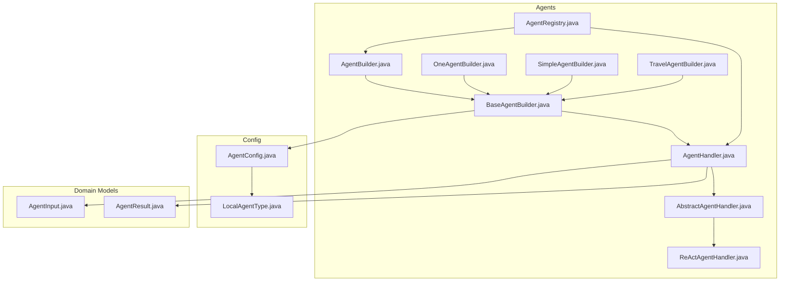
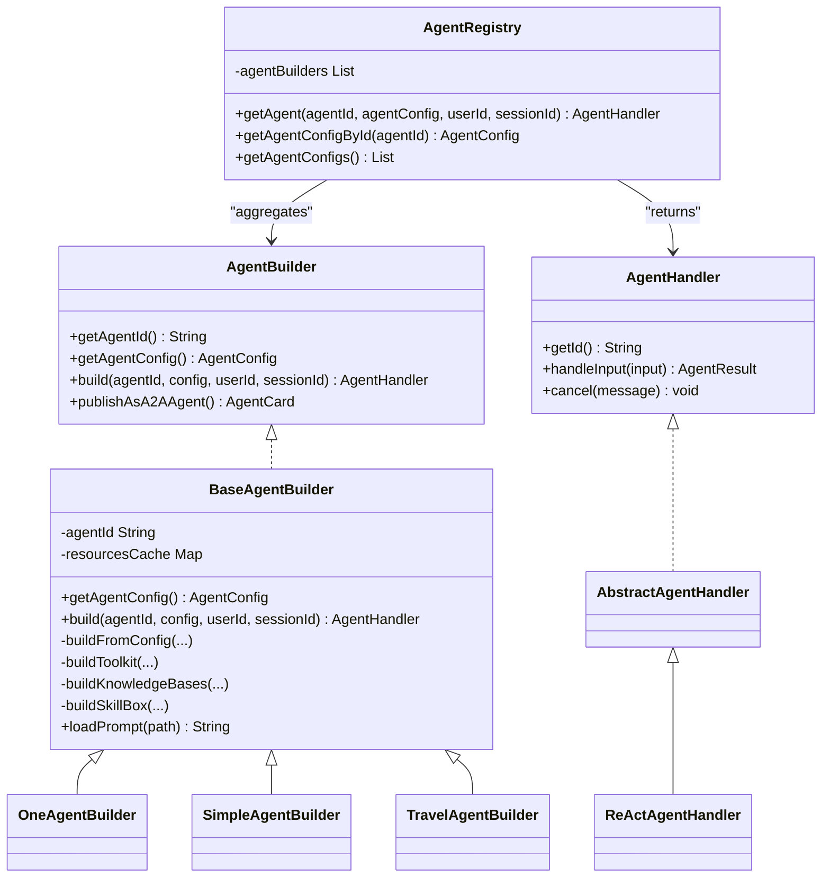
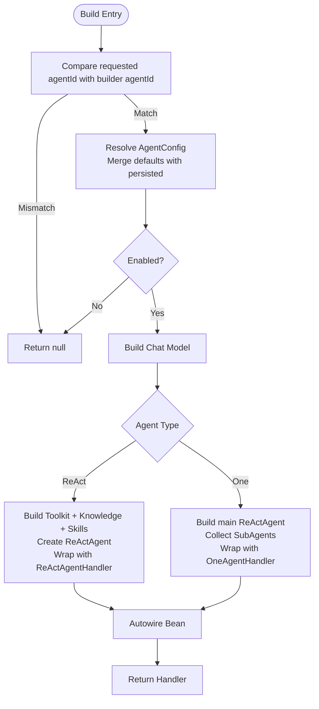
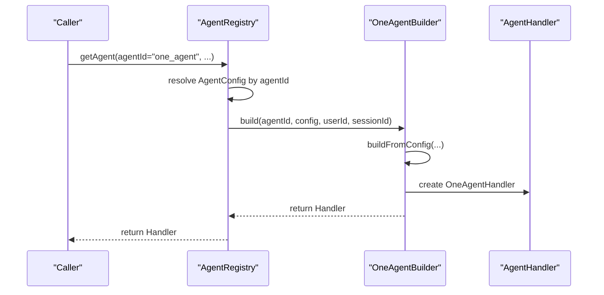
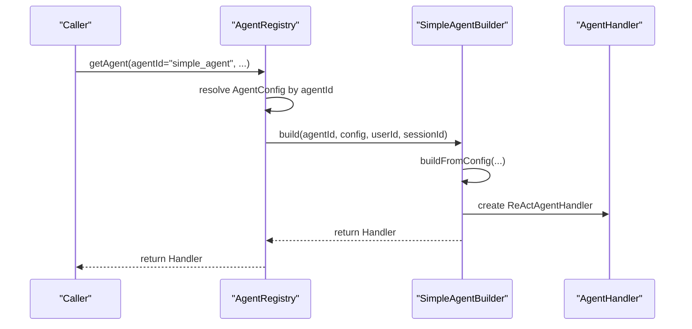
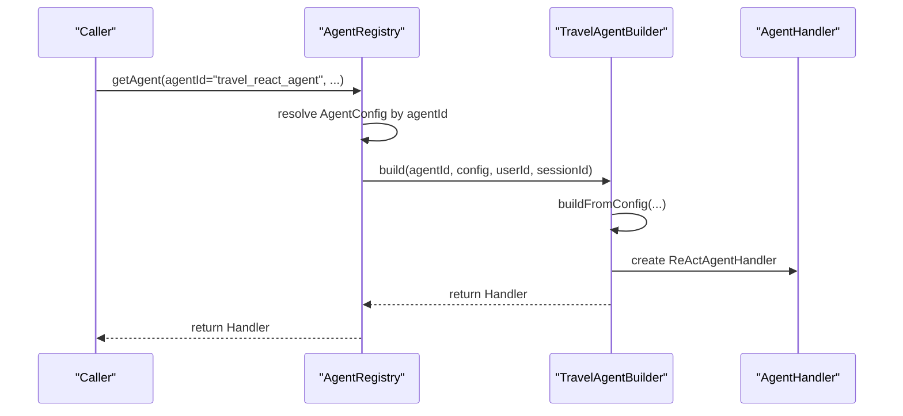
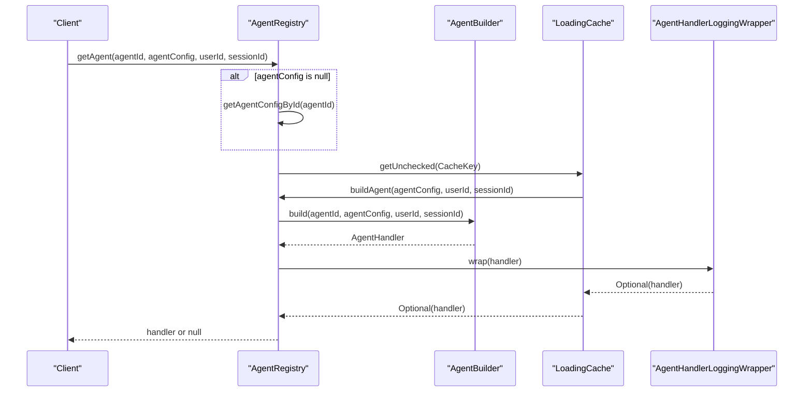
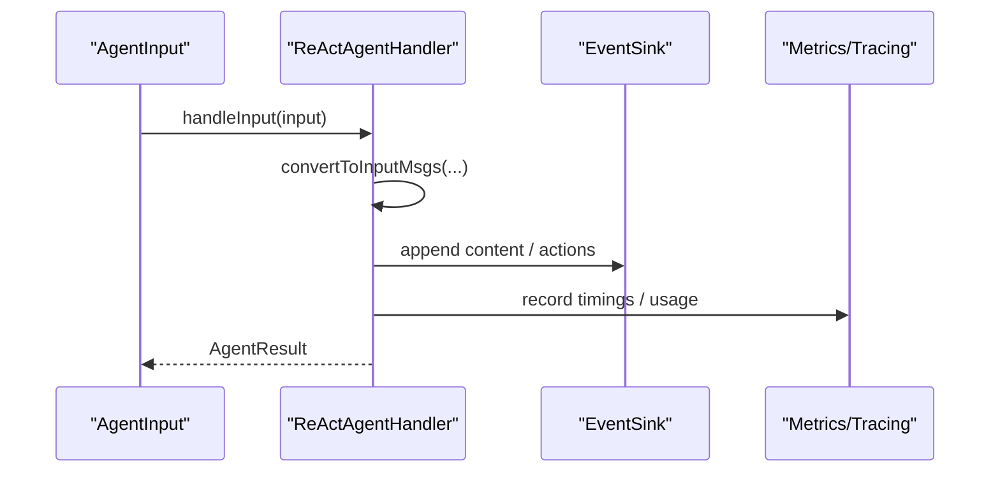
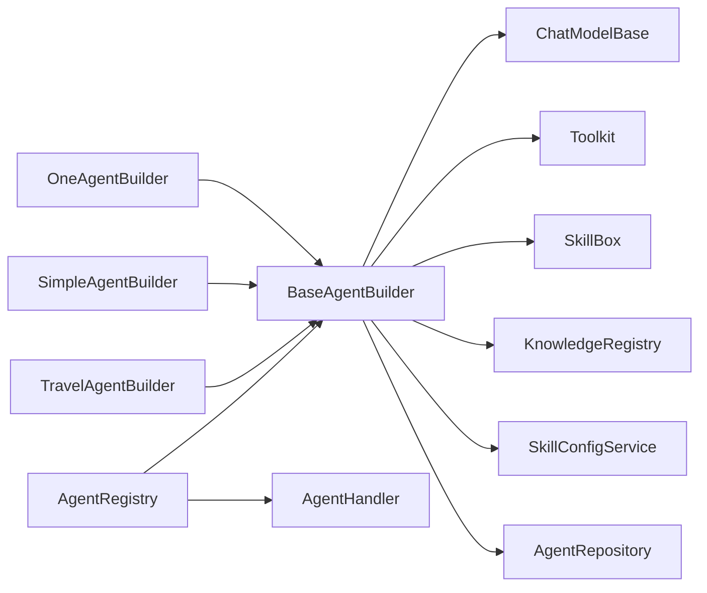

# Agent Builder and Factory Patterns

<cite>
**Referenced Files in This Document**
- [AgentBuilder.java](file://backend_java/core/src/main/java/com/aliyun/tam/x/tron/core/agents/AgentBuilder.java)
- [BaseAgentBuilder.java](file://backend_java/core/src/main/java/com/aliyun/tam/x/tron/core/agents/BaseAgentBuilder.java)
- [OneAgentBuilder.java](file://backend_java/core/src/main/java/com/aliyun/tam/x/tron/core/agents/examples/OneAgentBuilder.java)
- [SimpleAgentBuilder.java](file://backend_java/core/src/main/java/com/aliyun/tam/x/tron/core/agents/examples/SimpleAgentBuilder.java)
- [TravelAgentBuilder.java](file://backend_java/core/src/main/java/com/aliyun/tam/x/tron/core/agents/examples/TravelAgentBuilder.java)
- [AgentRegistry.java](file://backend_java/core/src/main/java/com/aliyun/tam/x/tron/core/agents/AgentRegistry.java)
- [AgentHandler.java](file://backend_java/core/src/main/java/com/aliyun/tam/x/tron/core/agents/AgentHandler.java)
- [AbstractAgentHandler.java](file://backend_java/core/src/main/java/com/aliyun/tam/x/tron/core/agents/AbstractAgentHandler.java)
- [ReActAgentHandler.java](file://backend_java/core/src/main/java/com/aliyun/tam/x/tron/core/agents/ReActAgentHandler.java)
- [AgentConfig.java](file://backend_java/core/src/main/java/com/aliyun/tam/x/tron/core/config/AgentConfig.java)
- [LocalAgentType.java](file://backend_java/core/src/main/java/com/aliyun/tam/x/tron/core/config/LocalAgentType.java)
- [AgentInput.java](file://backend_java/core/src/main/java/com/aliyun/tam/x/tron/core/agents/AgentInput.java)
- [AgentResult.java](file://backend_java/core/src/main/java/com/aliyun/tam/x/tron/core/agents/AgentResult.java)
</cite>

## Table of Contents
1. [Introduction](#introduction)
2. [Project Structure](#project-structure)
3. [Core Components](#core-components)
4. [Architecture Overview](#architecture-overview)
5. [Detailed Component Analysis](#detailed-component-analysis)
6. [Dependency Analysis](#dependency-analysis)
7. [Performance Considerations](#performance-considerations)
8. [Troubleshooting Guide](#troubleshooting-guide)
9. [Conclusion](#conclusion)

## Introduction
This document explains the agent builder and factory pattern implementations used to construct and manage conversational agents. It covers the AgentBuilder interface, the BaseAgentBuilder abstract class that centralizes shared construction logic, and specialized builders for different agent types. It also documents the fluent configuration patterns, factory-style agent creation via AgentRegistry, parameter validation, error handling, and extension strategies. Examples demonstrate building ReAct agents and OneAgent setups with sub-agents, along with customization options for tools, skills, knowledge bases, and model configurations.

## Project Structure
The agent construction and lifecycle logic resides primarily under the core agents package, with configuration models and specialized builders under examples. The factory registry aggregates builders and caches constructed handlers.

**Diagram sources**
- [AgentBuilder.java:23-33](file://backend_java/core/src/main/java/com/aliyun/tam/x/tron/core/agents/AgentBuilder.java#L23-L33)
- [BaseAgentBuilder.java:74-302](file://backend_java/core/src/main/java/com/aliyun/tam/x/tron/core/agents/BaseAgentBuilder.java#L74-L302)
- [OneAgentBuilder.java:28-78](file://backend_java/core/src/main/java/com/aliyun/tam/x/tron/core/agents/examples/OneAgentBuilder.java#L28-L78)
- [SimpleAgentBuilder.java:31-108](file://backend_java/core/src/main/java/com/aliyun/tam/x/tron/core/agents/examples/SimpleAgentBuilder.java#L31-L108)
- [TravelAgentBuilder.java:27-59](file://backend_java/core/src/main/java/com/aliyun/tam/x/tron/core/agents/examples/TravelAgentBuilder.java#L27-L59)
- [AgentRegistry.java:39-98](file://backend_java/core/src/main/java/com/aliyun/tam/x/tron/core/agents/AgentRegistry.java#L39-L98)
- [AgentHandler.java:35-149](file://backend_java/core/src/main/java/com/aliyun/tam/x/tron/core/agents/AgentHandler.java#L35-L149)
- [AbstractAgentHandler.java:54-430](file://backend_java/core/src/main/java/com/aliyun/tam/x/tron/core/agents/AbstractAgentHandler.java#L54-L430)
- [ReActAgentHandler.java:41-255](file://backend_java/core/src/main/java/com/aliyun/tam/x/tron/core/agents/ReActAgentHandler.java#L41-L255)
- [AgentConfig.java:39-132](file://backend_java/core/src/main/java/com/aliyun/tam/x/tron/core/config/AgentConfig.java#L39-L132)
- [LocalAgentType.java:27-60](file://backend_java/core/src/main/java/com/aliyun/tam/x/tron/core/config/LocalAgentType.java#L27-L60)
- [AgentInput.java:16-29](file://backend_java/core/src/main/java/com/aliyun/tam/x/tron/core/agents/AgentInput.java#L16-L29)
- [AgentResult.java:36-83](file://backend_java/core/src/main/java/com/aliyun/tam/x/tron/core/agents/AgentResult.java#L36-L83)

**Section sources**
- [AgentBuilder.java:23-33](file://backend_java/core/src/main/java/com/aliyun/tam/x/tron/core/agents/AgentBuilder.java#L23-L33)
- [BaseAgentBuilder.java:74-302](file://backend_java/core/src/main/java/com/aliyun/tam/x/tron/core/agents/BaseAgentBuilder.java#L74-L302)
- [AgentRegistry.java:39-98](file://backend_java/core/src/main/java/com/aliyun/tam/x/tron/core/agents/AgentRegistry.java#L39-L98)

## Core Components
- AgentBuilder: Defines the contract for agent construction, exposing agent ID, merged configuration retrieval, and build method for creating an AgentHandler given agentId, AgentConfig, userId, and sessionId. Includes a default method to publish an A2A agent card.
- BaseAgentBuilder: Implements AgentBuilder and encapsulates shared construction logic. It merges persisted configuration with defaults, builds chat models, toolkits, knowledge bases, and skill boxes, and constructs either a ReAct agent handler or a OneAgent handler with sub-agents. It also handles dependency injection via Spring’s AutowireCapableBeanFactory and caches prompt resources.
- Specialized Builders:
  - OneAgentBuilder: Creates a OneAgent with a main ReAct agent and configured sub-agents (local and A2A).
  - SimpleAgentBuilder: Creates a ReAct agent with tools and MCP clients, and publishes an A2A agent card.
  - TravelAgentBuilder: Creates a ReAct agent specialized for travel-related tasks with a weather skill.
- AgentRegistry: Acts as a factory and cache. It aggregates all AgentBuilder beans, resolves AgentConfig by agentId, and returns cached AgentHandler instances keyed by agentConfig, userId, and sessionId. It wraps handlers with logging and tracing.
- AgentHandler and Handlers:
  - AgentHandler: The runtime interface for handling inputs, cancellation, and state persistence.
  - AbstractAgentHandler: Provides shared input conversion, media processing, runtime context augmentation, question tool registration, session renaming, and follow-up suggestions.
  - ReActAgentHandler: Streams ReAct agent events, records metrics, formats tool use/results, and manages HITL (Human-in-the-loop) flows.

**Section sources**
- [AgentBuilder.java:23-33](file://backend_java/core/src/main/java/com/aliyun/tam/x/tron/core/agents/AgentBuilder.java#L23-L33)
- [BaseAgentBuilder.java:74-302](file://backend_java/core/src/main/java/com/aliyun/tam/x/tron/core/agents/BaseAgentBuilder.java#L74-L302)
- [OneAgentBuilder.java:28-78](file://backend_java/core/src/main/java/com/aliyun/tam/x/tron/core/agents/examples/OneAgentBuilder.java#L28-L78)
- [SimpleAgentBuilder.java:31-108](file://backend_java/core/src/main/java/com/aliyun/tam/x/tron/core/agents/examples/SimpleAgentBuilder.java#L31-L108)
- [TravelAgentBuilder.java:27-59](file://backend_java/core/src/main/java/com/aliyun/tam/x/tron/core/agents/examples/TravelAgentBuilder.java#L27-L59)
- [AgentRegistry.java:39-98](file://backend_java/core/src/main/java/com/aliyun/tam/x/tron/core/agents/AgentRegistry.java#L39-L98)
- [AgentHandler.java:35-149](file://backend_java/core/src/main/java/com/aliyun/tam/x/tron/core/agents/AgentHandler.java#L35-L149)
- [AbstractAgentHandler.java:54-430](file://backend_java/core/src/main/java/com/aliyun/tam/x/tron/core/agents/AbstractAgentHandler.java#L54-L430)
- [ReActAgentHandler.java:41-255](file://backend_java/core/src/main/java/com/aliyun/tam/x/tron/core/agents/ReActAgentHandler.java#L41-L255)

## Architecture Overview
The system uses a factory-and-builder hybrid pattern:
- Builders define default configurations and produce AgentHandlers.
- AgentRegistry acts as the primary entrypoint to resolve and instantiate agents per session.
- BaseAgentBuilder centralizes model creation, tool/knowledge/skill assembly, and handler construction.
- Specialized builders override defaults to tailor agent behavior.

**Diagram sources**
- [AgentBuilder.java:23-33](file://backend_java/core/src/main/java/com/aliyun/tam/x/tron/core/agents/AgentBuilder.java#L23-L33)
- [BaseAgentBuilder.java:74-302](file://backend_java/core/src/main/java/com/aliyun/tam/x/tron/core/agents/BaseAgentBuilder.java#L74-L302)
- [OneAgentBuilder.java:28-78](file://backend_java/core/src/main/java/com/aliyun/tam/x/tron/core/agents/examples/OneAgentBuilder.java#L28-L78)
- [SimpleAgentBuilder.java:31-108](file://backend_java/core/src/main/java/com/aliyun/tam/x/tron/core/agents/examples/SimpleAgentBuilder.java#L31-L108)
- [TravelAgentBuilder.java:27-59](file://backend_java/core/src/main/java/com/aliyun/tam/x/tron/core/agents/examples/TravelAgentBuilder.java#L27-L59)
- [AgentRegistry.java:39-98](file://backend_java/core/src/main/java/com/aliyun/tam/x/tron/core/agents/AgentRegistry.java#L39-L98)
- [AgentHandler.java:35-149](file://backend_java/core/src/main/java/com/aliyun/tam/x/tron/core/agents/AgentHandler.java#L35-L149)
- [AbstractAgentHandler.java:54-430](file://backend_java/core/src/main/java/com/aliyun/tam/x/tron/core/agents/AbstractAgentHandler.java#L54-L430)
- [ReActAgentHandler.java:41-255](file://backend_java/core/src/main/java/com/aliyun/tam/x/tron/core/agents/ReActAgentHandler.java#L41-L255)

## Detailed Component Analysis

### AgentBuilder and BaseAgentBuilder
- Contract and responsibilities:
  - AgentBuilder defines the agent identity, configuration retrieval, and handler construction.
  - BaseAgentBuilder centralizes model creation, tool/knowledge/skill assembly, and handler instantiation. It merges persisted configs with defaults, validates enabled state, and supports both ReAct and OneAgent types.
- Fluent configuration and merging:
  - getAgentConfig merges persisted AgentConfig with defaultConfig() from the concrete builder, ensuring id propagation and versioning.
  - merge_config demonstrates deep-merging of configuration maps using Jackson.
- Model and generation options:
  - newChatModel selects and configures either DashScope or OpenAI-compatible models, translating generate kwargs into GenerateOptions.
- Dependency injection and composition:
  - Autowired registries/services are used to assemble toolkits, knowledge bases, and skill boxes.
  - Sub-agents are resolved via AgentRegistry and injected into OneAgentHandler.
- Error handling:
  - Unsupported agent type throws an IllegalArgumentException.
  - Skill synchronization failures are logged and skipped.
  - Unknown chat model type throws an IllegalArgumentException.

**Diagram sources**
- [BaseAgentBuilder.java:194-302](file://backend_java/core/src/main/java/com/aliyun/tam/x/tron/core/agents/BaseAgentBuilder.java#L194-L302)

**Section sources**
- [AgentBuilder.java:23-33](file://backend_java/core/src/main/java/com/aliyun/tam/x/tron/core/agents/AgentBuilder.java#L23-L33)
- [BaseAgentBuilder.java:74-302](file://backend_java/core/src/main/java/com/aliyun/tam/x/tron/core/agents/BaseAgentBuilder.java#L74-L302)

### Specialized Builders

#### OneAgentBuilder
- Purpose: Compose a OneAgent with a main ReAct agent and sub-agents (local and A2A).
- Default configuration highlights:
  - Name, enabled flag, system prompt loaded from a resource.
  - Two chat models: a larger model for reasoning and a smaller/fast model for follow-ups.
  - Sub-agents list includes an A2A agent and a local travel agent.
  - Tools and capabilities tailored for a multi-agent orchestration.
- Customization options:
  - Override defaultConfig() to change models, prompts, sub-agents, and supported input types.

**Diagram sources**
- [AgentRegistry.java:74-93](file://backend_java/core/src/main/java/com/aliyun/tam/x/tron/core/agents/AgentRegistry.java#L74-L93)
- [OneAgentBuilder.java:28-78](file://backend_java/core/src/main/java/com/aliyun/tam/x/tron/core/agents/examples/OneAgentBuilder.java#L28-L78)
- [BaseAgentBuilder.java:247-299](file://backend_java/core/src/main/java/com/aliyun/tam/x/tron/core/agents/BaseAgentBuilder.java#L247-L299)

**Section sources**
- [OneAgentBuilder.java:28-78](file://backend_java/core/src/main/java/com/aliyun/tam/x/tron/core/agents/examples/OneAgentBuilder.java#L28-L78)

#### SimpleAgentBuilder
- Purpose: Create a standalone ReAct agent with tools and MCP clients, and expose an A2A agent card.
- Default configuration highlights:
  - Fast chat model for responsiveness.
  - Calculator tool and WebSearch MCP client.
  - Publishes an AgentCard with capabilities and skills for A2A distribution.
- Customization options:
  - Adjust tools, MCP clients, and skills in defaultConfig().
  - Override publishAsA2AAgent() to customize the published card.

**Diagram sources**
- [AgentRegistry.java:74-93](file://backend_java/core/src/main/java/com/aliyun/tam/x/tron/core/agents/AgentRegistry.java#L74-L93)
- [SimpleAgentBuilder.java:31-108](file://backend_java/core/src/main/java/com/aliyun/tam/x/tron/core/agents/examples/SimpleAgentBuilder.java#L31-L108)
- [BaseAgentBuilder.java:214-246](file://backend_java/core/src/main/java/com/aliyun/tam/x/tron/core/agents/BaseAgentBuilder.java#L214-L246)

**Section sources**
- [SimpleAgentBuilder.java:31-108](file://backend_java/core/src/main/java/com/aliyun/tam/x/tron/core/agents/examples/SimpleAgentBuilder.java#L31-L108)

#### TravelAgentBuilder
- Purpose: Create a ReAct agent specialized for travel tasks with a weather skill.
- Default configuration highlights:
  - DashScope model for strong reasoning.
  - Weather skill enabled.
  - System prompt guiding travel-related behavior.
- Customization options:
  - Add or remove skills, adjust model parameters, and refine system prompt.

**Diagram sources**
- [AgentRegistry.java:74-93](file://backend_java/core/src/main/java/com/aliyun/tam/x/tron/core/agents/AgentRegistry.java#L74-L93)
- [TravelAgentBuilder.java:27-59](file://backend_java/core/src/main/java/com/aliyun/tam/x/tron/core/agents/examples/TravelAgentBuilder.java#L27-L59)
- [BaseAgentBuilder.java:214-246](file://backend_java/core/src/main/java/com/aliyun/tam/x/tron/core/agents/BaseAgentBuilder.java#L214-L246)

**Section sources**
- [TravelAgentBuilder.java:27-59](file://backend_java/core/src/main/java/com/aliyun/tam/x/tron/core/agents/examples/TravelAgentBuilder.java#L27-L59)

### Factory Methods and Agent Creation
- AgentRegistry.getAgent:
  - Resolves AgentConfig by agentId if not provided.
  - Uses a cache keyed by AgentConfig + userId + sessionId to avoid repeated construction.
  - Delegates to AgentBuilder.build and wraps the result with a logging/tracing wrapper.
- Parameter validation and error handling:
  - If agentId does not match the builder, returns null.
  - If config is disabled, returns null.
  - Unsupported agent type throws an exception.
  - Skill sync errors are logged and skipped.
- Extension strategies:
  - Add new AgentBuilder beans to participate in the registry.
  - Override defaultConfig() in specialized builders to tailor behavior.
  - Use sub-agents to compose complex orchestration patterns (OneAgent).

**Diagram sources**
- [AgentRegistry.java:74-93](file://backend_java/core/src/main/java/com/aliyun/tam/x/tron/core/agents/AgentRegistry.java#L74-L93)
- [AgentHandler.java:48-149](file://backend_java/core/src/main/java/com/aliyun/tam/x/tron/core/agents/AgentHandler.java#L48-L149)

**Section sources**
- [AgentRegistry.java:39-98](file://backend_java/core/src/main/java/com/aliyun/tam/x/tron/core/agents/AgentRegistry.java#L39-L98)
- [AgentHandler.java:48-149](file://backend_java/core/src/main/java/com/aliyun/tam/x/tron/core/agents/AgentHandler.java#L48-L149)

### Configuration Chaining and Customization Options
- AgentConfig fields:
  - Identity and enablement, agent type, chat models (primary and fast), system prompt, iteration limits, tools, MCP clients, RAG mode, knowledge bases, sub-agents, skills, supported input types, long-term memory settings, and toggles for session renaming, suggestions, and question tool.
- Fluent customization:
  - Specialized builders supply defaultConfig() with chained builder calls for models, tools, skills, and sub-agents.
  - BaseAgentBuilder merges persisted overrides onto defaults, enabling dynamic tuning per tenant/session.
- Model options:
  - newChatModel translates generate kwargs into GenerateOptions, supporting temperature, max tokens, top-p, top-k, thinking budget, penalties, seed, and additional body params.

**Section sources**
- [AgentConfig.java:39-132](file://backend_java/core/src/main/java/com/aliyun/tam/x/tron/core/config/AgentConfig.java#L39-L132)
- [BaseAgentBuilder.java:79-144](file://backend_java/core/src/main/java/com/aliyun/tam/x/tron/core/agents/BaseAgentBuilder.java#L79-L144)

### Runtime Handling and Metrics
- ReActAgentHandler streams agent events, records first-token and first-response delays, formats tool use/results, and manages HITL content.
- AbstractAgentHandler enriches inputs with runtime context, processes media content via storage provider, registers a question tool when enabled, and supports session renaming and follow-up suggestions.
- AgentHandlerLoggingWrapper adds tracing, metrics (end-to-end latency, TTFT distributions), and structured logging around handler invocations.

**Diagram sources**
- [ReActAgentHandler.java:64-239](file://backend_java/core/src/main/java/com/aliyun/tam/x/tron/core/agents/ReActAgentHandler.java#L64-L239)
- [AbstractAgentHandler.java:191-430](file://backend_java/core/src/main/java/com/aliyun/tam/x/tron/core/agents/AbstractAgentHandler.java#L191-L430)
- [AgentHandler.java:48-149](file://backend_java/core/src/main/java/com/aliyun/tam/x/tron/core/agents/AgentHandler.java#L48-L149)

**Section sources**
- [ReActAgentHandler.java:41-255](file://backend_java/core/src/main/java/com/aliyun/tam/x/tron/core/agents/ReActAgentHandler.java#L41-L255)
- [AbstractAgentHandler.java:54-430](file://backend_java/core/src/main/java/com/aliyun/tam/x/tron/core/agents/AbstractAgentHandler.java#L54-L430)
- [AgentHandler.java:48-149](file://backend_java/core/src/main/java/com/aliyun/tam/x/tron/core/agents/AgentHandler.java#L48-L149)

## Dependency Analysis
- Coupling and cohesion:
  - BaseAgentBuilder depends on Spring-managed registries/services for tools, knowledge, skills, and memory. This promotes loose coupling while centralizing construction logic.
  - Specialized builders depend only on BaseAgentBuilder and configuration models, keeping customization localized.
- External dependencies:
  - Chat models (DashScope/OpenAI-compatible), ReAct agent core, toolkits, skill boxes, and RAG knowledge bases.
- Potential circular dependencies:
  - None observed among builders and registry; AgentRegistry holds a list of AgentBuilder beans and delegates construction.
- Interface contracts:
  - AgentBuilder defines the minimal contract; AgentHandler defines runtime behavior and state persistence.

**Diagram sources**
- [BaseAgentBuilder.java:20-177](file://backend_java/core/src/main/java/com/aliyun/tam/x/tron/core/agents/BaseAgentBuilder.java#L20-L177)
- [AgentRegistry.java:49-93](file://backend_java/core/src/main/java/com/aliyun/tam/x/tron/core/agents/AgentRegistry.java#L49-L93)

**Section sources**
- [BaseAgentBuilder.java:20-177](file://backend_java/core/src/main/java/com/aliyun/tam/x/tron/core/agents/BaseAgentBuilder.java#L20-L177)
- [AgentRegistry.java:49-93](file://backend_java/core/src/main/java/com/aliyun/tam/x/tron/core/agents/AgentRegistry.java#L49-L93)

## Performance Considerations
- Caching:
  - AgentRegistry caches handlers per agentConfig + userId + sessionId to reduce construction overhead.
  - Prompt resources are cached to avoid repeated IO.
- Streaming and metrics:
  - ReActAgentHandler streams tokens and records first-token and first-response delays for observability.
  - Metrics are tagged by agentId for targeted monitoring.
- Model selection:
  - Separate fastChatModel enables lower-latency responses for follow-ups while reserving heavier models for complex reasoning.

[No sources needed since this section provides general guidance]

## Troubleshooting Guide
- Unsupported agent type:
  - Symptom: IllegalArgumentException indicating unsupported agent type.
  - Resolution: Ensure config.type matches supported LocalAgentType values.
- Unknown chat model type:
  - Symptom: IllegalArgumentException for unknown chat model type.
  - Resolution: Use supported types and verify ChatModelConfig fields.
- Disabled agent:
  - Symptom: Null returned from build/getAgent.
  - Resolution: Enable the agent in persisted config or defaultConfig().
- Skill sync failure:
  - Symptom: Warning logs for missing/broken skill sync; skill not registered.
  - Resolution: Verify skill availability and network/storage access.
- A2A publishing:
  - Symptom: publishAsA2AAgent returns null.
  - Resolution: Ensure the builder overrides publishAsA2AAgent() and returns a valid AgentCard.

**Section sources**
- [BaseAgentBuilder.java:104-107](file://backend_java/core/src/main/java/com/aliyun/tam/x/tron/core/agents/BaseAgentBuilder.java#L104-L107)
- [BaseAgentBuilder.java:301](file://backend_java/core/src/main/java/com/aliyun/tam/x/tron/core/agents/BaseAgentBuilder.java#L301)
- [BaseAgentBuilder.java:372-375](file://backend_java/core/src/main/java/com/aliyun/tam/x/tron/core/agents/BaseAgentBuilder.java#L372-L375)
- [SimpleAgentBuilder.java:105-107](file://backend_java/core/src/main/java/com/aliyun/tam/x/tron/core/agents/examples/SimpleAgentBuilder.java#L105-L107)

## Conclusion
The agent builder and factory pattern implementation provides a robust, extensible framework for constructing and managing conversational agents. BaseAgentBuilder consolidates complex construction logic while specialized builders tailor behavior through fluent configuration. AgentRegistry offers a centralized factory with caching and tracing. The design supports modular composition (tools, skills, knowledge, sub-agents), dynamic configuration merging, and clear error handling, enabling rapid customization and deployment of diverse agent types.