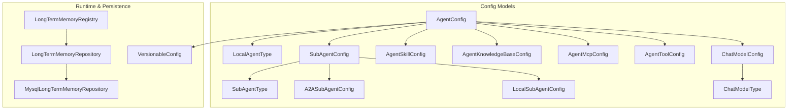
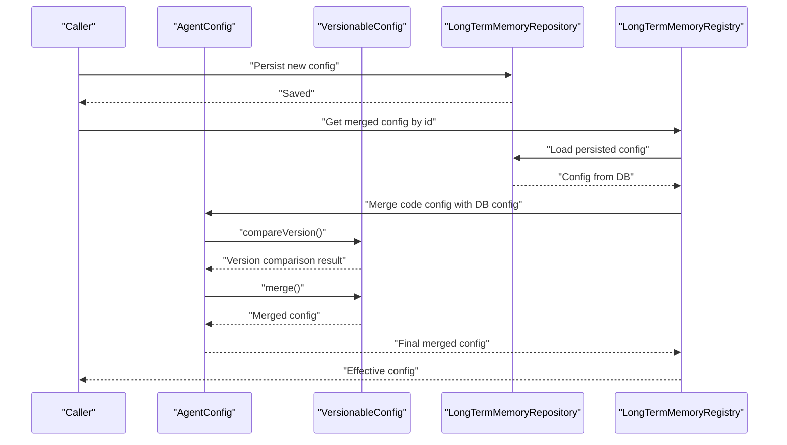
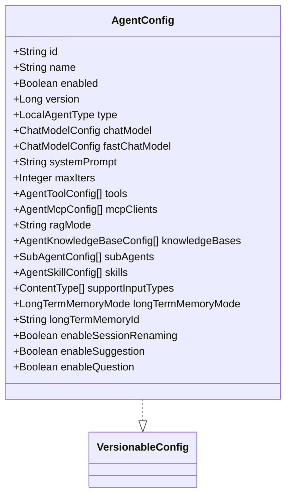
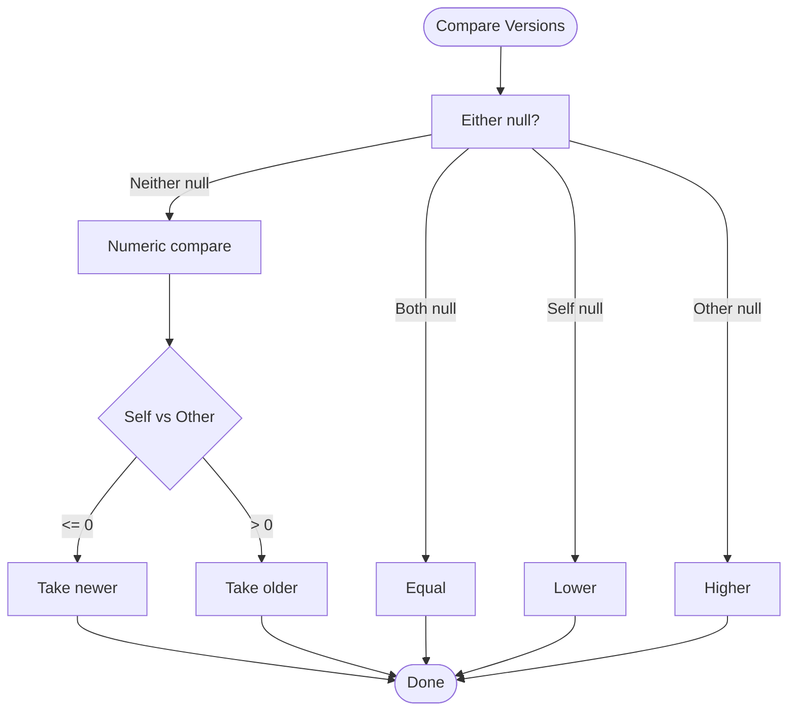
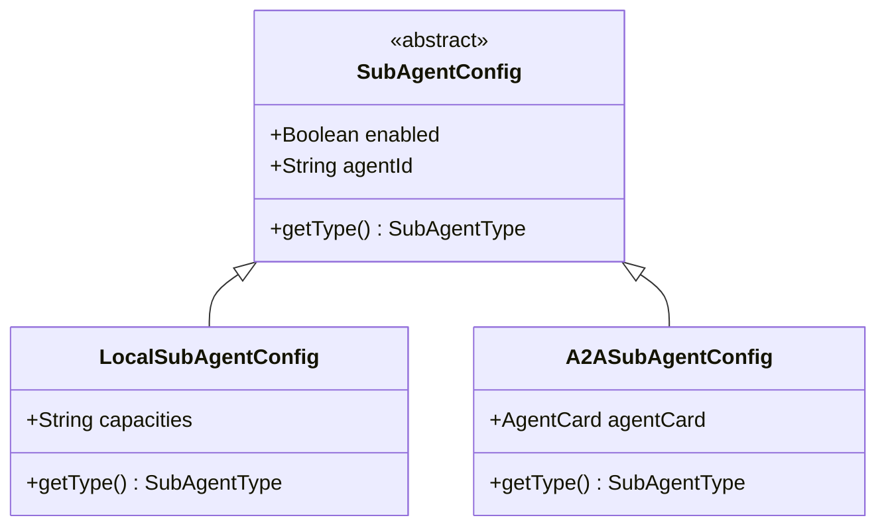
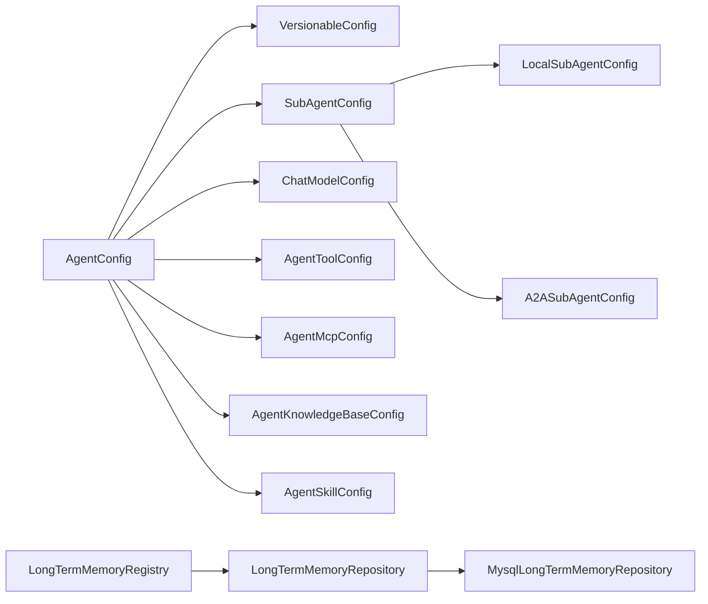

# Agent Configuration Management

<cite>
**Referenced Files in This Document**
- [AgentConfig.java](file://backend_java/core/src/main/java/com/aliyun/tam/x/tron/core/config/AgentConfig.java)
- [VersionableConfig.java](file://backend_java/core/src/main/java/com/aliyun/tam/x/tron/core/config/VersionableConfig.java)
- [SubAgentConfig.java](file://backend_java/core/src/main/java/com/aliyun/tam/x/tron/core/config/SubAgentConfig.java)
- [LocalSubAgentConfig.java](file://backend_java/core/src/main/java/com/aliyun/tam/x/tron/core/config/LocalSubAgentConfig.java)
- [A2ASubAgentConfig.java](file://backend_java/core/src/main/java/com/aliyun/tam/x/tron/core/config/A2ASubAgentConfig.java)
- [LocalAgentType.java](file://backend_java/core/src/main/java/com/aliyun/tam/x/tron/core/config/LocalAgentType.java)
- [SubAgentType.java](file://backend_java/core/src/main/java/com/aliyun/tam/x/tron/core/config/SubAgentType.java)
- [ChatModelConfig.java](file://backend_java/core/src/main/java/com/aliyun/tam/x/tron/core/config/ChatModelConfig.java)
- [AgentToolConfig.java](file://backend_java/core/src/main/java/com/aliyun/tam/x/tron/core/config/AgentToolConfig.java)
- [AgentMcpConfig.java](file://backend_java/core/src/main/java/com/aliyun/tam/x/tron/core/config/AgentMcpConfig.java)
- [AgentKnowledgeBaseConfig.java](file://backend_java/core/src/main/java/com/aliyun/tam/x/tron/core/config/AgentKnowledgeBaseConfig.java)
- [AgentSkillConfig.java](file://backend_java/core/src/main/java/com/aliyun/tam/x/tron/core/config/AgentSkillConfig.java)
- [ChatModelType.java](file://backend_java/core/src/main/java/com/aliyun/tam/x/tron/core/config/ChatModelType.java)
- [LongTermMemoryRegistry.java](file://backend_java/core/src/main/java/com/aliyun/tam/x/tron/core/mem/LongTermMemoryRegistry.java)
- [LongTermMemoryRepository.java](file://backend_java/core/src/main/java/com/aliyun/tam/x/tron/core/domain/repository/LongTermMemoryRepository.java)
- [MysqlLongTermMemoryRepository.java](file://backend_java/core/src/main/java/com/aliyun/tam/x/tron/core/domain/repository/mysql/MysqlLongTermMemoryRepository.java)
</cite>

## Table of Contents
1. [Introduction](#introduction)
2. [Project Structure](#project-structure)
3. [Core Components](#core-components)
4. [Architecture Overview](#architecture-overview)
5. [Detailed Component Analysis](#detailed-component-analysis)
6. [Dependency Analysis](#dependency-analysis)
7. [Performance Considerations](#performance-considerations)
8. [Troubleshooting Guide](#troubleshooting-guide)
9. [Conclusion](#conclusion)
10. [Appendices](#appendices)

## Introduction
This document explains the agent configuration management system in the Tron One Agent backend. It focuses on the AgentConfig structure, agent types, behavior settings, runtime parameters, and the VersionableConfig base class enabling configuration versioning and hot-reloading. It documents LocalSubAgentConfig and SubAgentConfig for sub-agent coordination, outlines configuration inheritance patterns, default values, and validation rules. It also covers configuration templates, dynamic updates, persistence, migration strategies, and troubleshooting.

## Project Structure
The configuration model resides in the core configuration package and integrates with repositories and registries for persistence and runtime merging.

**Diagram sources**
- [AgentConfig.java:39-132](file://backend_java/core/src/main/java/com/aliyun/tam/x/tron/core/config/AgentConfig.java#L39-L132)
- [SubAgentConfig.java:40-54](file://backend_java/core/src/main/java/com/aliyun/tam/x/tron/core/config/SubAgentConfig.java#L40-L54)
- [LocalSubAgentConfig.java:36-46](file://backend_java/core/src/main/java/com/aliyun/tam/x/tron/core/config/LocalSubAgentConfig.java#L36-L46)
- [A2ASubAgentConfig.java:37-47](file://backend_java/core/src/main/java/com/aliyun/tam/x/tron/core/config/A2ASubAgentConfig.java#L37-L47)
- [ChatModelConfig.java:35-54](file://backend_java/core/src/main/java/com/aliyun/tam/x/tron/core/config/ChatModelConfig.java#L35-L54)
- [AgentToolConfig.java:32-43](file://backend_java/core/src/main/java/com/aliyun/tam/x/tron/core/config/AgentToolConfig.java#L32-L43)
- [AgentMcpConfig.java:34-55](file://backend_java/core/src/main/java/com/aliyun/tam/x/tron/core/config/AgentMcpConfig.java#L34-L55)
- [AgentKnowledgeBaseConfig.java:32-70](file://backend_java/core/src/main/java/com/aliyun/tam/x/tron/core/config/AgentKnowledgeBaseConfig.java#L32-L70)
- [AgentSkillConfig.java:32-43](file://backend_java/core/src/main/java/com/aliyun/tam/x/tron/core/config/AgentSkillConfig.java#L32-L43)
- [LocalAgentType.java:27-60](file://backend_java/core/src/main/java/com/aliyun/tam/x/tron/core/config/LocalAgentType.java#L27-L60)
- [SubAgentType.java:26-57](file://backend_java/core/src/main/java/com/aliyun/tam/x/tron/core/config/SubAgentType.java#L26-L57)
- [ChatModelType.java:26-58](file://backend_java/core/src/main/java/com/aliyun/tam/x/tron/core/config/ChatModelType.java#L26-L58)
- [VersionableConfig.java:23-75](file://backend_java/core/src/main/java/com/aliyun/tam/x/tron/core/config/VersionableConfig.java#L23-L75)
- [LongTermMemoryRegistry.java:59-126](file://backend_java/core/src/main/java/com/aliyun/tam/x/tron/core/mem/LongTermMemoryRegistry.java#L59-L126)
- [LongTermMemoryRepository.java:24-33](file://backend_java/core/src/main/java/com/aliyun/tam/x/tron/core/domain/repository/LongTermMemoryRepository.java#L24-L33)
- [MysqlLongTermMemoryRepository.java:42-70](file://backend_java/core/src/main/java/com/aliyun/tam/x/tron/core/domain/repository/mysql/MysqlLongTermMemoryRepository.java#L42-L70)

**Section sources**
- [AgentConfig.java:39-132](file://backend_java/core/src/main/java/com/aliyun/tam/x/tron/core/config/AgentConfig.java#L39-L132)
- [VersionableConfig.java:23-75](file://backend_java/core/src/main/java/com/aliyun/tam/x/tron/core/config/VersionableConfig.java#L23-L75)

## Core Components
- AgentConfig: Top-level configuration for an agent, including identity, type, model settings, capabilities, and sub-agent composition. It implements VersionableConfig to support versioning and merging.
- SubAgentConfig: Abstract base for sub-agent configurations with polymorphic support for LocalSubAgentConfig and A2ASubAgentConfig.
- LocalSubAgentConfig: Local sub-agent specialization with capacity hints.
- A2ASubAgentConfig: Remote A2A sub-agent specialization with agent card metadata.
- VersionableConfig: Interface defining version comparison and merge semantics using JSON-based field propagation.
- Supporting configs: ChatModelConfig, AgentToolConfig, AgentMcpConfig, AgentKnowledgeBaseConfig, AgentSkillConfig, plus enums LocalAgentType, SubAgentType, ChatModelType.

Key defaults and behaviors:
- AgentConfig sets sensible defaults for iteration limits, input types, memory modes, and feature toggles.
- SubAgentConfig enables sub-agents by default.
- ChatModelConfig defaults streaming and thinking behaviors.
- Knowledge base defaults include mode selection and retrieval thresholds.

**Section sources**
- [AgentConfig.java:39-132](file://backend_java/core/src/main/java/com/aliyun/tam/x/tron/core/config/AgentConfig.java#L39-L132)
- [SubAgentConfig.java:40-54](file://backend_java/core/src/main/java/com/aliyun/tam/x/tron/core/config/SubAgentConfig.java#L40-L54)
- [LocalSubAgentConfig.java:36-46](file://backend_java/core/src/main/java/com/aliyun/tam/x/tron/core/config/LocalSubAgentConfig.java#L36-L46)
- [A2ASubAgentConfig.java:37-47](file://backend_java/core/src/main/java/com/aliyun/tam/x/tron/core/config/A2ASubAgentConfig.java#L37-L47)
- [VersionableConfig.java:23-75](file://backend_java/core/src/main/java/com/aliyun/tam/x/tron/core/config/VersionableConfig.java#L23-L75)
- [ChatModelConfig.java:35-54](file://backend_java/core/src/main/java/com/aliyun/tam/x/tron/core/config/ChatModelConfig.java#L35-L54)
- [AgentToolConfig.java:32-43](file://backend_java/core/src/main/java/com/aliyun/tam/x/tron/core/config/AgentToolConfig.java#L32-L43)
- [AgentMcpConfig.java:34-55](file://backend_java/core/src/main/java/com/aliyun/tam/x/tron/core/config/AgentMcpConfig.java#L34-L55)
- [AgentKnowledgeBaseConfig.java:32-70](file://backend_java/core/src/main/java/com/aliyun/tam/x/tron/core/config/AgentKnowledgeBaseConfig.java#L32-L70)
- [AgentSkillConfig.java:32-43](file://backend_java/core/src/main/java/com/aliyun/tam/x/tron/core/config/AgentSkillConfig.java#L32-L43)
- [LocalAgentType.java:27-60](file://backend_java/core/src/main/java/com/aliyun/tam/x/tron/core/config/LocalAgentType.java#L27-L60)
- [SubAgentType.java:26-57](file://backend_java/core/src/main/java/com/aliyun/tam/x/tron/core/config/SubAgentType.java#L26-L57)
- [ChatModelType.java:26-58](file://backend_java/core/src/main/java/com/aliyun/tam/x/tron/core/config/ChatModelType.java#L26-L58)

## Architecture Overview
The configuration system centers on AgentConfig and its composition of sub-configurations. VersionableConfig enables safe hot-reloading by comparing versions and merging fields. Long-term memory configuration demonstrates a practical pattern of merging code-defined and persisted configurations.

**Diagram sources**
- [VersionableConfig.java:27-57](file://backend_java/core/src/main/java/com/aliyun/tam/x/tron/core/config/VersionableConfig.java#L27-L57)
- [LongTermMemoryRegistry.java:78-90](file://backend_java/core/src/main/java/com/aliyun/tam/x/tron/core/mem/LongTermMemoryRegistry.java#L78-L90)
- [LongTermMemoryRepository.java:24-33](file://backend_java/core/src/main/java/com/aliyun/tam/x/tron/core/domain/repository/LongTermMemoryRepository.java#L24-L33)
- [MysqlLongTermMemoryRepository.java:42-70](file://backend_java/core/src/main/java/com/aliyun/tam/x/tron/core/domain/repository/mysql/MysqlLongTermMemoryRepository.java#L42-L70)

## Detailed Component Analysis

### AgentConfig
AgentConfig aggregates all agent-level settings and implements VersionableConfig. It includes:
- Identity: id, name, enabled flag, version.
- Type: LocalAgentType to select agent behavior.
- Model: primary and optional fast chat model configurations.
- Behavior: system prompt, max iterations, RAG mode, long-term memory mode and id, session renaming, suggestions, and question toggles.
- Composition: tools, MCP clients, knowledge bases, skills, sub-agents, supported input types.

Defaults and validation:
- Defaults are applied via Lombok builders for collections and booleans.
- Validation rules are implicit via enums and required fields; explicit validation can be added at load/update boundaries.

**Diagram sources**
- [AgentConfig.java:39-132](file://backend_java/core/src/main/java/com/aliyun/tam/x/tron/core/config/AgentConfig.java#L39-L132)
- [VersionableConfig.java:23-75](file://backend_java/core/src/main/java/com/aliyun/tam/x/tron/core/config/VersionableConfig.java#L23-L75)

**Section sources**
- [AgentConfig.java:39-132](file://backend_java/core/src/main/java/com/aliyun/tam/x/tron/core/config/AgentConfig.java#L39-L132)

### VersionableConfig
VersionableConfig defines:
- Version retrieval and comparison.
- Merge semantics that propagate non-null fields from newer to older configuration via JSON serialization/deserialization.

Hot-reload behavior:
- compareVersion determines precedence.
- merge applies selective field replacement, preserving existing non-null values when present.

**Diagram sources**
- [VersionableConfig.java:27-57](file://backend_java/core/src/main/java/com/aliyun/tam/x/tron/core/config/VersionableConfig.java#L27-L57)

**Section sources**
- [VersionableConfig.java:23-75](file://backend_java/core/src/main/java/com/aliyun/tam/x/tron/core/config/VersionableConfig.java#L23-L75)

### SubAgentConfig Family
SubAgentConfig is an abstract base with polymorphic subtypes:
- LocalSubAgentConfig: Local agent subtype with capacity hints and explicit type marker.
- A2ASubAgentConfig: Remote A2A agent subtype with agent card metadata and explicit type marker.

Inheritance and defaults:
- Both override getType() to return their respective SubAgentType values.
- SubAgentConfig defaults to enabled=true.

**Diagram sources**
- [SubAgentConfig.java:40-54](file://backend_java/core/src/main/java/com/aliyun/tam/x/tron/core/config/SubAgentConfig.java#L40-L54)
- [LocalSubAgentConfig.java:36-46](file://backend_java/core/src/main/java/com/aliyun/tam/x/tron/core/config/LocalSubAgentConfig.java#L36-L46)
- [A2ASubAgentConfig.java:37-47](file://backend_java/core/src/main/java/com/aliyun/tam/x/tron/core/config/A2ASubAgentConfig.java#L37-L47)

**Section sources**
- [SubAgentConfig.java:40-54](file://backend_java/core/src/main/java/com/aliyun/tam/x/tron/core/config/SubAgentConfig.java#L40-L54)
- [LocalSubAgentConfig.java:36-46](file://backend_java/core/src/main/java/com/aliyun/tam/x/tron/core/config/LocalSubAgentConfig.java#L36-L46)
- [A2ASubAgentConfig.java:37-47](file://backend_java/core/src/main/java/com/aliyun/tam/x/tron/core/config/A2ASubAgentConfig.java#L37-L47)

### Supporting Configuration Types
- ChatModelConfig: Model provider, type, endpoint, streaming, thinking, and generation arguments; sensitive keys marked for encryption.
- AgentToolConfig: Tool name with enabled flag.
- AgentMcpConfig: MCP client id and function enable/disable lists.
- AgentKnowledgeBaseConfig: Knowledge base id, mode, tool description, and retrieval parameters.
- AgentSkillConfig: Skill name with enabled flag.
- Enums: LocalAgentType, SubAgentType, ChatModelType define allowed values and JSON serialization.

Validation and defaults:
- Defaults are set via builder annotations.
- Enum-based fields enforce value constraints.
- Sensitive fields are annotated for encryption.

**Section sources**
- [ChatModelConfig.java:35-54](file://backend_java/core/src/main/java/com/aliyun/tam/x/tron/core/config/ChatModelConfig.java#L35-L54)
- [AgentToolConfig.java:32-43](file://backend_java/core/src/main/java/com/aliyun/tam/x/tron/core/config/AgentToolConfig.java#L32-L43)
- [AgentMcpConfig.java:34-55](file://backend_java/core/src/main/java/com/aliyun/tam/x/tron/core/config/AgentMcpConfig.java#L34-L55)
- [AgentKnowledgeBaseConfig.java:32-70](file://backend_java/core/src/main/java/com/aliyun/tam/x/tron/core/config/AgentKnowledgeBaseConfig.java#L32-L70)
- [AgentSkillConfig.java:32-43](file://backend_java/core/src/main/java/com/aliyun/tam/x/tron/core/config/AgentSkillConfig.java#L32-L43)
- [LocalAgentType.java:27-60](file://backend_java/core/src/main/java/com/aliyun/tam/x/tron/core/config/LocalAgentType.java#L27-L60)
- [SubAgentType.java:26-57](file://backend_java/core/src/main/java/com/aliyun/tam/x/tron/core/config/SubAgentType.java#L26-L57)
- [ChatModelType.java:26-58](file://backend_java/core/src/main/java/com/aliyun/tam/x/tron/core/config/ChatModelType.java#L26-L58)

## Dependency Analysis
- AgentConfig depends on VersionableConfig for versioning and merging.
- SubAgentConfig polymorphism enables heterogeneous sub-agent lists.
- Long-term memory registry demonstrates a real-world merge pattern combining code and persisted configurations.

**Diagram sources**
- [AgentConfig.java:39-132](file://backend_java/core/src/main/java/com/aliyun/tam/x/tron/core/config/AgentConfig.java#L39-L132)
- [VersionableConfig.java:23-75](file://backend_java/core/src/main/java/com/aliyun/tam/x/tron/core/config/VersionableConfig.java#L23-L75)
- [SubAgentConfig.java:40-54](file://backend_java/core/src/main/java/com/aliyun/tam/x/tron/core/config/SubAgentConfig.java#L40-L54)
- [LocalSubAgentConfig.java:36-46](file://backend_java/core/src/main/java/com/aliyun/tam/x/tron/core/config/LocalSubAgentConfig.java#L36-L46)
- [A2ASubAgentConfig.java:37-47](file://backend_java/core/src/main/java/com/aliyun/tam/x/tron/core/config/A2ASubAgentConfig.java#L37-L47)
- [ChatModelConfig.java:35-54](file://backend_java/core/src/main/java/com/aliyun/tam/x/tron/core/config/ChatModelConfig.java#L35-L54)
- [AgentToolConfig.java:32-43](file://backend_java/core/src/main/java/com/aliyun/tam/x/tron/core/config/AgentToolConfig.java#L32-L43)
- [AgentMcpConfig.java:34-55](file://backend_java/core/src/main/java/com/aliyun/tam/x/tron/core/config/AgentMcpConfig.java#L34-L55)
- [AgentKnowledgeBaseConfig.java:32-70](file://backend_java/core/src/main/java/com/aliyun/tam/x/tron/core/config/AgentKnowledgeBaseConfig.java#L32-L70)
- [AgentSkillConfig.java:32-43](file://backend_java/core/src/main/java/com/aliyun/tam/x/tron/core/config/AgentSkillConfig.java#L32-L43)
- [LongTermMemoryRegistry.java:59-126](file://backend_java/core/src/main/java/com/aliyun/tam/x/tron/core/mem/LongTermMemoryRegistry.java#L59-L126)
- [LongTermMemoryRepository.java:24-33](file://backend_java/core/src/main/java/com/aliyun/tam/x/tron/core/domain/repository/LongTermMemoryRepository.java#L24-L33)
- [MysqlLongTermMemoryRepository.java:42-70](file://backend_java/core/src/main/java/com/aliyun/tam/x/tron/core/domain/repository/mysql/MysqlLongTermMemoryRepository.java#L42-L70)

**Section sources**
- [AgentConfig.java:39-132](file://backend_java/core/src/main/java/com/aliyun/tam/x/tron/core/config/AgentConfig.java#L39-L132)
- [VersionableConfig.java:23-75](file://backend_java/core/src/main/java/com/aliyun/tam/x/tron/core/config/VersionableConfig.java#L23-L75)
- [SubAgentConfig.java:40-54](file://backend_java/core/src/main/java/com/aliyun/tam/x/tron/core/config/SubAgentConfig.java#L40-L54)
- [LocalSubAgentConfig.java:36-46](file://backend_java/core/src/main/java/com/aliyun/tam/x/tron/core/config/LocalSubAgentConfig.java#L36-L46)
- [A2ASubAgentConfig.java:37-47](file://backend_java/core/src/main/java/com/aliyun/tam/x/tron/core/config/A2ASubAgentConfig.java#L37-L47)
- [LongTermMemoryRegistry.java:59-126](file://backend_java/core/src/main/java/com/aliyun/tam/x/tron/core/mem/LongTermMemoryRegistry.java#L59-L126)
- [LongTermMemoryRepository.java:24-33](file://backend_java/core/src/main/java/com/aliyun/tam/x/tron/core/domain/repository/LongTermMemoryRepository.java#L24-L33)
- [MysqlLongTermMemoryRepository.java:42-70](file://backend_java/core/src/main/java/com/aliyun/tam/x/tron/core/domain/repository/mysql/MysqlLongTermMemoryRepository.java#L42-L70)

## Performance Considerations
- Version comparison is O(1); merging relies on JSON conversion and recursive field traversal, which is proportional to the number of fields.
- Prefer incremental updates with higher version numbers to minimize unnecessary merges.
- Avoid frequent deep merges for large nested structures; batch updates when possible.
- Encryption annotations on sensitive fields add overhead during serialization; cache decrypted values at runtime if feasible.

## Troubleshooting Guide
Common issues and resolutions:
- Version conflicts during hot-reload:
  - Ensure version fields are properly set and monotonic.
  - Use compareVersion to confirm precedence before applying changes.
- Merge anomalies:
  - Verify that null fields in the incoming configuration are intentional; merge propagates only non-null values.
  - Confirm JSON serialization compatibility for complex nested structures.
- Sub-agent misconfiguration:
  - Validate SubAgentType values and ensure subtype-specific fields are present for the chosen type.
- Long-term memory not taking effect:
  - Confirm persisted configuration exists and is enabled.
  - Check registry merge order: code config merged with DB config; verify effective config after merge.

**Section sources**
- [VersionableConfig.java:27-57](file://backend_java/core/src/main/java/com/aliyun/tam/x/tron/core/config/VersionableConfig.java#L27-L57)
- [LongTermMemoryRegistry.java:78-90](file://backend_java/core/src/main/java/com/aliyun/tam/x/tron/core/mem/LongTermMemoryRegistry.java#L78-L90)
- [MysqlLongTermMemoryRepository.java:42-70](file://backend_java/core/src/main/java/com/aliyun/tam/x/tron/core/domain/repository/mysql/MysqlLongTermMemoryRepository.java#L42-L70)

## Conclusion
The agent configuration system provides a robust, extensible foundation for modeling agents, sub-agents, and runtime behavior. VersionableConfig enables safe, versioned updates suitable for hot-reloading. The design supports clear defaults, strong typing via enums, and a practical merge pattern demonstrated by long-term memory configuration. By following the patterns outlined here, teams can implement reliable configuration templates, dynamic updates, and resilient persistence strategies.

## Appendices

### Configuration Templates
- Minimal AgentConfig template:
  - Set id, name, enabled, version.
  - Choose LocalAgentType.
  - Provide ChatModelConfig with type, model name, and base URL.
  - Add tools, MCP clients, knowledge bases, and skills as needed.
  - Define subAgents with appropriate subtype and fields.
- LocalSubAgentConfig template:
  - Set agentId and capacities.
  - Keep enabled true by default.
- A2ASubAgentConfig template:
  - Set agentId and agentCard metadata.
  - Keep enabled true by default.

### Dynamic Configuration Updates
- Increment version on change.
- Apply compareVersion to determine precedence.
- Use merge to propagate non-null fields from the newer configuration.
- Persist merged configuration to the repository for durability.

### Persistence and Migration Strategies
- Persist configurations using repositories; ensure idempotent upserts.
- Merge code-defined and persisted configurations at runtime.
- Maintain backward compatibility by adding new fields with sensible defaults.
- Validate and normalize migrated configurations before activation.