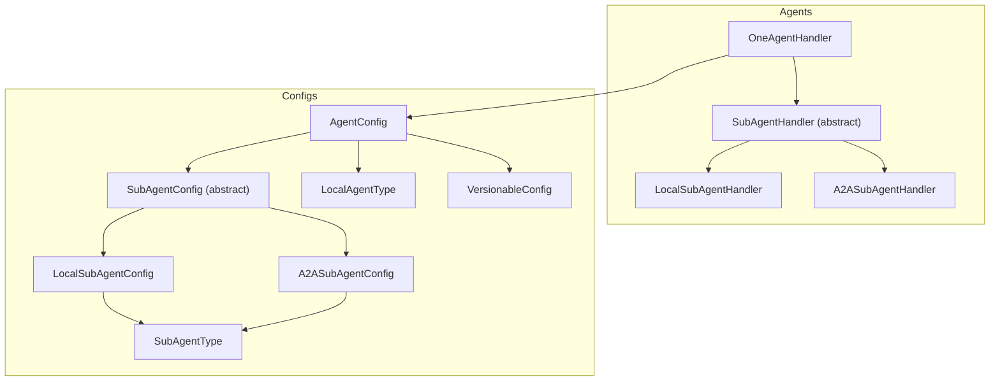
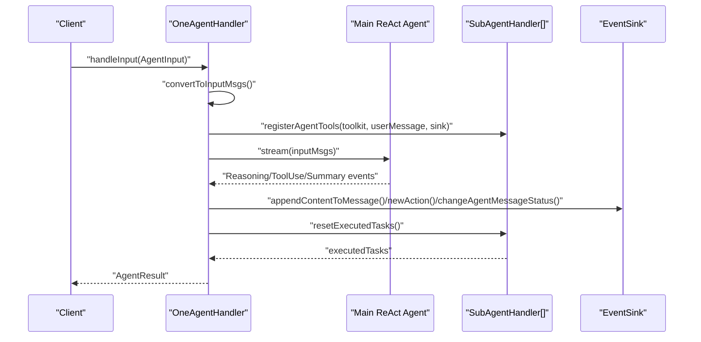
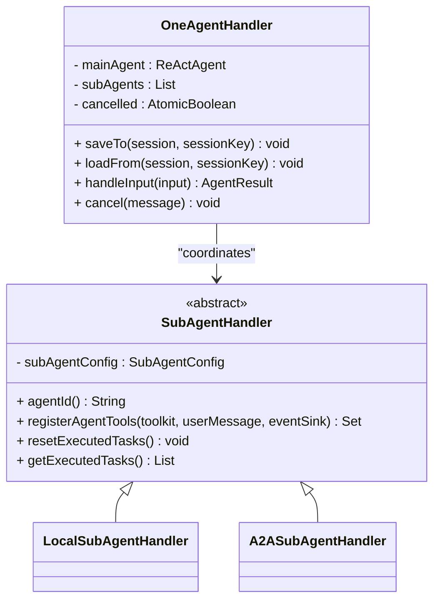
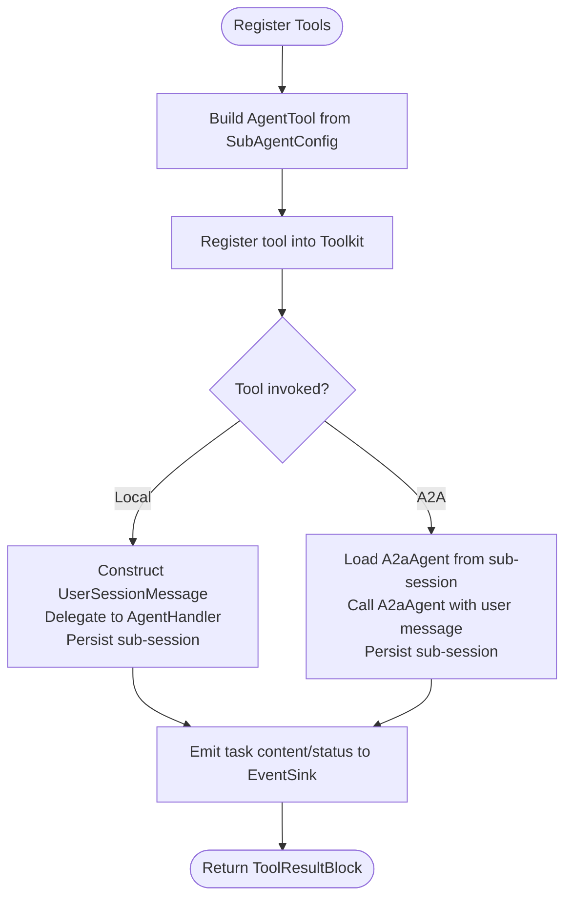
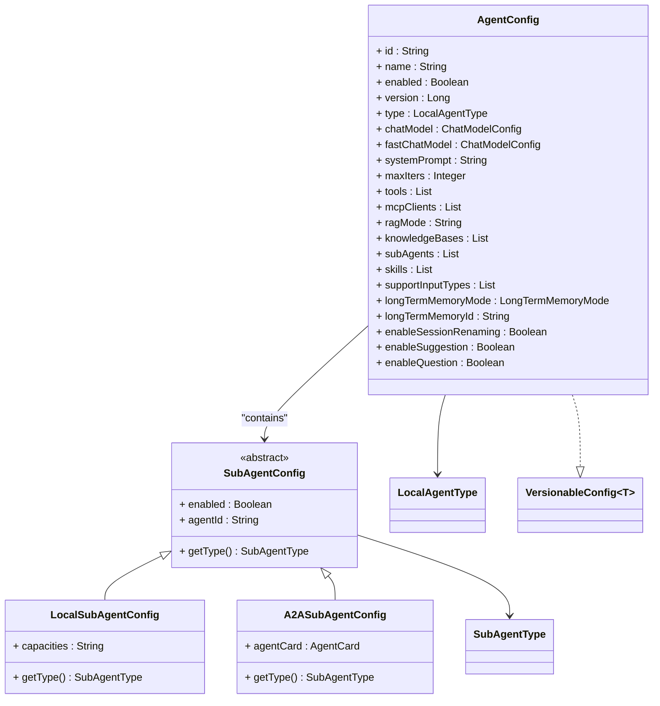
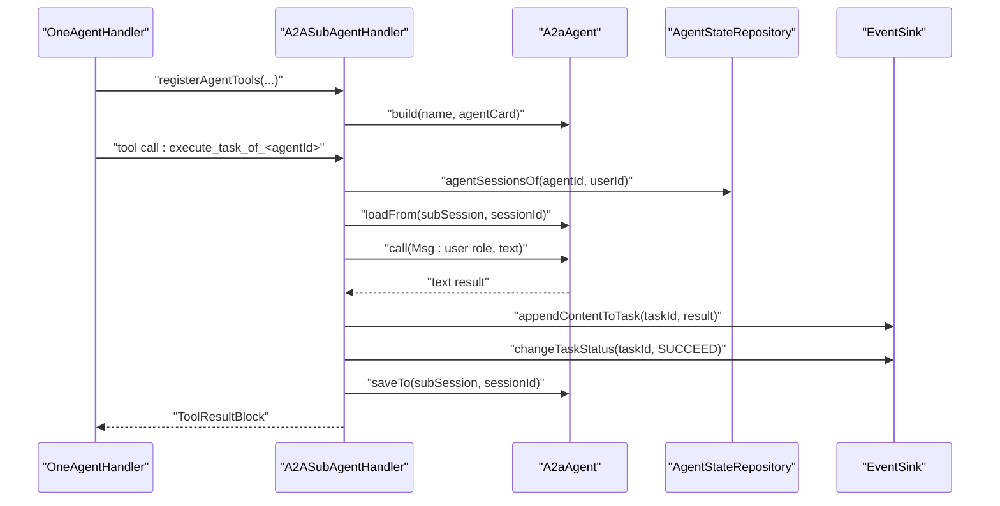
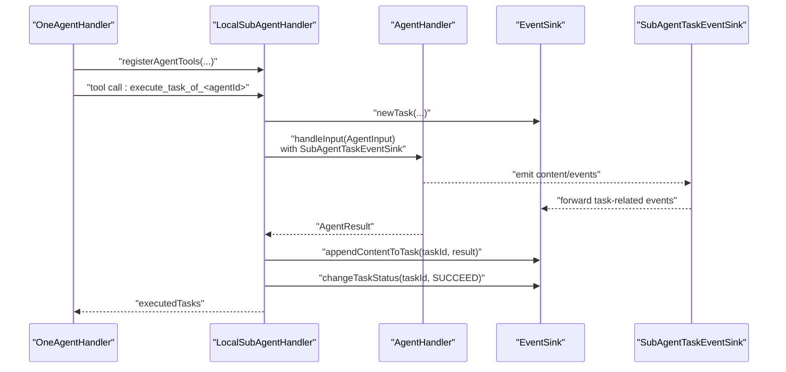
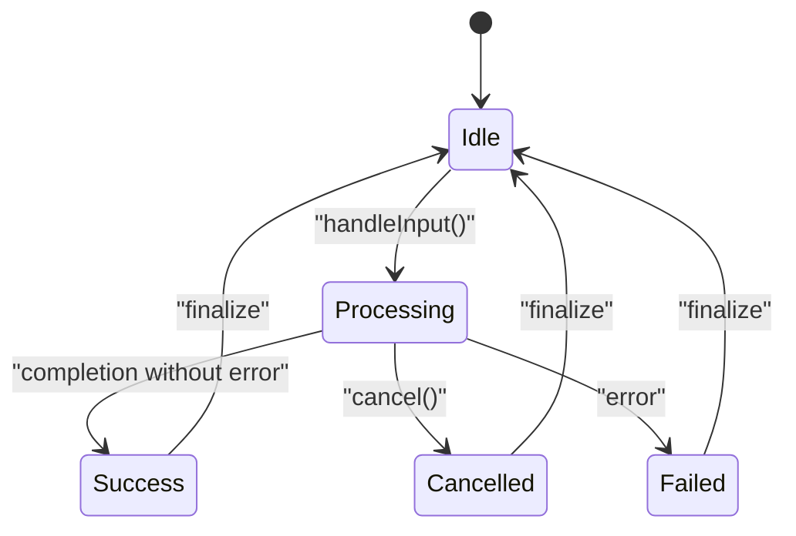
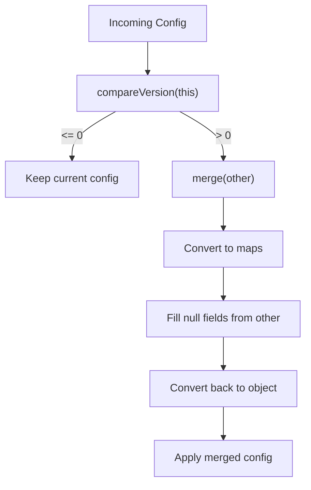
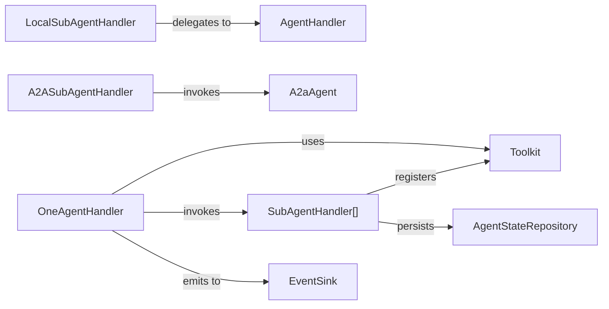

# Agent Types and Configurations

<cite>
**Referenced Files in This Document**
- [OneAgentHandler.java](file://backend_java/core/src/main/java/com/aliyun/tam/x/tron/core/agents/one/OneAgentHandler.java)
- [SubAgentHandler.java](file://backend_java/core/src/main/java/com/aliyun/tam/x/tron/core/agents/one/SubAgentHandler.java)
- [LocalSubAgentHandler.java](file://backend_java/core/src/main/java/com/aliyun/tam/x/tron/core/agents/one/LocalSubAgentHandler.java)
- [A2ASubAgentHandler.java](file://backend_java/core/src/main/java/com/aliyun/tam/x/tron/core/agents/one/A2ASubAgentHandler.java)
- [SubAgentTaskEventSink.java](file://backend_java/core/src/main/java/com/aliyun/tam/x/tron/core/agents/one/SubAgentTaskEventSink.java)
- [AgentConfig.java](file://backend_java/core/src/main/java/com/aliyun/tam/x/tron/core/config/AgentConfig.java)
- [SubAgentConfig.java](file://backend_java/core/src/main/java/com/aliyun/tam/x/tron/core/config/SubAgentConfig.java)
- [LocalSubAgentConfig.java](file://backend_java/core/src/main/java/com/aliyun/tam/x/tron/core/config/LocalSubAgentConfig.java)
- [A2ASubAgentConfig.java](file://backend_java/core/src/main/java/com/aliyun/tam/x/tron/core/config/A2ASubAgentConfig.java)
- [LocalAgentType.java](file://backend_java/core/src/main/java/com/aliyun/tam/x/tron/core/config/LocalAgentType.java)
- [SubAgentType.java](file://backend_java/core/src/main/java/com/aliyun/tam/x/tron/core/config/SubAgentType.java)
- [VersionableConfig.java](file://backend_java/core/src/main/java/com/aliyun/tam/x/tron/core/config/VersionableConfig.java)
- [ReActAgentHandler.java](file://backend_java/core/src/main/java/com/aliyun/tam/x/tron/core/agents/ReActAgentHandler.java)
</cite>

## Table of Contents
1. [Introduction](#introduction)
2. [Project Structure](#project-structure)
3. [Core Components](#core-components)
4. [Architecture Overview](#architecture-overview)
5. [Detailed Component Analysis](#detailed-component-analysis)
6. [Dependency Analysis](#dependency-analysis)
7. [Performance Considerations](#performance-considerations)
8. [Troubleshooting Guide](#troubleshooting-guide)
9. [Conclusion](#conclusion)
10. [Appendices](#appendices)

## Introduction
This document explains the agent types and configuration management in the Tron OneAgent system. It focuses on:
- OneAgentHandler for orchestrating the main agent and coordinating child agents
- SubAgentHandler and its concrete implementations for managing local and A2A (Agent-to-Agent) sub-agents
- AgentConfig and related configuration structures for agent types, behavior, and runtime parameters
- LocalSubAgentConfig and A2ASubAgentConfig for local and remote sub-agent coordination
- A2A communication protocol via A2ASubAgentHandler
- Agent lifecycle states, configuration hot-reloading, and dynamic agent creation/destruction
- Multi-agent collaboration patterns, configuration inheritance, isolation, and scaling considerations

## Project Structure
The agent system resides primarily under the core module’s agents and config packages. The main orchestration is handled by OneAgentHandler, which composes a main ReAct agent and a list of SubAgentHandler instances. Configuration is modeled via AgentConfig and SubAgentConfig hierarchies, with specialized subclasses for local and A2A sub-agents.

**Diagram sources**
- [OneAgentHandler.java:47-289](file://backend_java/core/src/main/java/com/aliyun/tam/x/tron/core/agents/one/OneAgentHandler.java#L47-L289)
- [SubAgentHandler.java:29-46](file://backend_java/core/src/main/java/com/aliyun/tam/x/tron/core/agents/one/SubAgentHandler.java#L29-L46)
- [LocalSubAgentHandler.java:52-236](file://backend_java/core/src/main/java/com/aliyun/tam/x/tron/core/agents/one/LocalSubAgentHandler.java#L52-L236)
- [A2ASubAgentHandler.java:52-199](file://backend_java/core/src/main/java/com/aliyun/tam/x/tron/core/agents/one/A2ASubAgentHandler.java#L52-L199)
- [AgentConfig.java:39-133](file://backend_java/core/src/main/java/com/aliyun/tam/x/tron/core/config/AgentConfig.java#L39-L133)
- [SubAgentConfig.java:40-55](file://backend_java/core/src/main/java/com/aliyun/tam/x/tron/core/config/SubAgentConfig.java#L40-L55)
- [LocalSubAgentConfig.java:36-47](file://backend_java/core/src/main/java/com/aliyun/tam/x/tron/core/config/LocalSubAgentConfig.java#L36-L47)
- [A2ASubAgentConfig.java:36-48](file://backend_java/core/src/main/java/com/aliyun/tam/x/tron/core/config/A2ASubAgentConfig.java#L36-L48)
- [LocalAgentType.java:27-61](file://backend_java/core/src/main/java/com/aliyun/tam/x/tron/core/config/LocalAgentType.java#L27-L61)
- [SubAgentType.java:26-58](file://backend_java/core/src/main/java/com/aliyun/tam/x/tron/core/config/SubAgentType.java#L26-L58)
- [VersionableConfig.java:23-76](file://backend_java/core/src/main/java/com/aliyun/tam/x/tron/core/config/VersionableConfig.java#L23-L76)

**Section sources**
- [OneAgentHandler.java:47-289](file://backend_java/core/src/main/java/com/aliyun/tam/x/tron/core/agents/one/OneAgentHandler.java#L47-L289)
- [AgentConfig.java:39-133](file://backend_java/core/src/main/java/com/aliyun/tam/x/tron/core/config/AgentConfig.java#L39-L133)

## Core Components
- OneAgentHandler: Orchestrates the main ReAct agent and coordinates sub-agents. It registers tools from sub-agents into the main agent’s toolkit, streams reasoning and tool execution, and aggregates results and tasks.
- SubAgentHandler: Abstract base for sub-agent handlers. Defines agentId, tool registration, task execution lifecycle, and task retrieval.
- LocalSubAgentHandler: Manages local sub-agents by invoking another AgentHandler with a constructed UserSessionMessage and a SubAgentTaskEventSink to isolate task events.
- A2ASubAgentHandler: Manages A2A sub-agents by registering AgentSkills as tools and invoking an A2aAgent with a dedicated session per user/agent pair.
- AgentConfig: Central configuration for an agent, including type, model settings, tools, MCP clients, RAG mode, knowledge bases, sub-agents, and behavior toggles.
- SubAgentConfig hierarchy: Abstract base with JSON polymorphism; LocalSubAgentConfig and A2ASubAgentConfig represent local and A2A sub-agents respectively.
- VersionableConfig: Provides version-aware merging semantics for configuration updates.

**Section sources**
- [OneAgentHandler.java:47-289](file://backend_java/core/src/main/java/com/aliyun/tam/x/tron/core/agents/one/OneAgentHandler.java#L47-L289)
- [SubAgentHandler.java:29-46](file://backend_java/core/src/main/java/com/aliyun/tam/x/tron/core/agents/one/SubAgentHandler.java#L29-L46)
- [LocalSubAgentHandler.java:52-236](file://backend_java/core/src/main/java/com/aliyun/tam/x/tron/core/agents/one/LocalSubAgentHandler.java#L52-L236)
- [A2ASubAgentHandler.java:52-199](file://backend_java/core/src/main/java/com/aliyun/tam/x/tron/core/agents/one/A2ASubAgentHandler.java#L52-L199)
- [AgentConfig.java:39-133](file://backend_java/core/src/main/java/com/aliyun/tam/x/tron/core/config/AgentConfig.java#L39-L133)
- [SubAgentConfig.java:40-55](file://backend_java/core/src/main/java/com/aliyun/tam/x/tron/core/config/SubAgentConfig.java#L40-L55)
- [LocalSubAgentConfig.java:36-47](file://backend_java/core/src/main/java/com/aliyun/tam/x/tron/core/config/LocalSubAgentConfig.java#L36-L47)
- [A2ASubAgentConfig.java:36-48](file://backend_java/core/src/main/java/com/aliyun/tam/x/tron/core/config/A2ASubAgentConfig.java#L36-L48)
- [VersionableConfig.java:23-76](file://backend_java/core/src/main/java/com/aliyun/tam/x/tron/core/config/VersionableConfig.java#L23-L76)

## Architecture Overview
The OneAgentHandler composes a main ReAct agent and a list of sub-agents. On each input, it:
- Converts input into messages and registers sub-agent tools into the main agent’s toolkit
- Streams the main agent’s reasoning and tool-use events
- Emits content to the EventSink and tracks actions and tool results
- Aggregates tasks from sub-agents and cleans up state after completion

**Diagram sources**
- [OneAgentHandler.java:74-272](file://backend_java/core/src/main/java/com/aliyun/tam/x/tron/core/agents/one/OneAgentHandler.java#L74-L272)

**Section sources**
- [OneAgentHandler.java:74-272](file://backend_java/core/src/main/java/com/aliyun/tam/x/tron/core/agents/one/OneAgentHandler.java#L74-L272)

## Detailed Component Analysis

### OneAgentHandler
- Responsibilities:
  - Build and manage a main ReAct agent
  - Register sub-agent tools into the main agent’s toolkit
  - Stream the main agent, capture reasoning and tool-use events, and forward content to the EventSink
  - Aggregate tool actions and sub-agent tasks, compute timings, and finalize message status
  - Support cancellation by interrupting the main agent and trimming assistant messages
- Lifecycle:
  - Initialization sets up the main agent and sub-agents
  - handleInput converts input, registers tools, streams, and finalizes
  - cancel interrupts the main agent and marks the message as cancelled
- Collaboration:
  - Works with SubAgentHandler implementations to extend tool capabilities
  - Uses EventSink to emit content and track actions/tasks

**Diagram sources**
- [OneAgentHandler.java:47-289](file://backend_java/core/src/main/java/com/aliyun/tam/x/tron/core/agents/one/OneAgentHandler.java#L47-L289)
- [SubAgentHandler.java:29-46](file://backend_java/core/src/main/java/com/aliyun/tam/x/tron/core/agents/one/SubAgentHandler.java#L29-L46)
- [LocalSubAgentHandler.java:52-236](file://backend_java/core/src/main/java/com/aliyun/tam/x/tron/core/agents/one/LocalSubAgentHandler.java#L52-L236)
- [A2ASubAgentHandler.java:52-199](file://backend_java/core/src/main/java/com/aliyun/tam/x/tron/core/agents/one/A2ASubAgentHandler.java#L52-L199)

**Section sources**
- [OneAgentHandler.java:55-289](file://backend_java/core/src/main/java/com/aliyun/tam/x/tron/core/agents/one/OneAgentHandler.java#L55-L289)

### SubAgentHandler and Implementations
- SubAgentHandler:
  - Exposes agentId derived from SubAgentConfig
  - Defines abstract methods for tool registration, task reset, and task retrieval
- LocalSubAgentHandler:
  - Registers a single tool named after the sub-agent’s agentId
  - Constructs a UserSessionMessage with text and optional media content
  - Delegates to an AgentHandler with a SubAgentTaskEventSink to isolate task events
  - Persists sub-session state before/after delegation
- A2ASubAgentHandler:
  - Registers AgentSkills from AgentCard as tools
  - Builds an A2aAgent with the configured AgentCard
  - Invokes the A2aAgent within a sub-session keyed by user and agent
  - Persists sub-session state before/after invocation

**Diagram sources**
- [LocalSubAgentHandler.java:103-224](file://backend_java/core/src/main/java/com/aliyun/tam/x/tron/core/agents/one/LocalSubAgentHandler.java#L103-L224)
- [A2ASubAgentHandler.java:90-187](file://backend_java/core/src/main/java/com/aliyun/tam/x/tron/core/agents/one/A2ASubAgentHandler.java#L90-L187)

**Section sources**
- [SubAgentHandler.java:29-46](file://backend_java/core/src/main/java/com/aliyun/tam/x/tron/core/agents/one/SubAgentHandler.java#L29-L46)
- [LocalSubAgentHandler.java:97-236](file://backend_java/core/src/main/java/com/aliyun/tam/x/tron/core/agents/one/LocalSubAgentHandler.java#L97-L236)
- [A2ASubAgentHandler.java:81-199](file://backend_java/core/src/main/java/com/aliyun/tam/x/tron/core/agents/one/A2ASubAgentHandler.java#L81-L199)

### AgentConfig and Configuration Structures
- AgentConfig:
  - Identifies agent (id, name, enabled)
  - Holds version for hot-reload
  - Defines type (LocalAgentType), chat/fast models, system prompt, max iterations
  - Controls tools, MCP clients, RAG mode, knowledge bases, sub-agents, skills
  - Behavior toggles: input types, long-term memory mode/id, session renaming, suggestions, question tool
- SubAgentConfig hierarchy:
  - Abstract with JSON polymorphism for LocalSubAgentConfig and A2ASubAgentConfig
  - Both override getType() to indicate LOCAL or A2A
- LocalSubAgentConfig:
  - Adds capacities string describing agent capabilities
- A2ASubAgentConfig:
  - Holds an AgentCard for remote agent capabilities
- VersionableConfig:
  - Provides compareVersion and merge semantics for configuration updates

**Diagram sources**
- [AgentConfig.java:39-133](file://backend_java/core/src/main/java/com/aliyun/tam/x/tron/core/config/AgentConfig.java#L39-L133)
- [SubAgentConfig.java:40-55](file://backend_java/core/src/main/java/com/aliyun/tam/x/tron/core/config/SubAgentConfig.java#L40-L55)
- [LocalSubAgentConfig.java:36-47](file://backend_java/core/src/main/java/com/aliyun/tam/x/tron/core/config/LocalSubAgentConfig.java#L36-L47)
- [A2ASubAgentConfig.java:36-48](file://backend_java/core/src/main/java/com/aliyun/tam/x/tron/core/config/A2ASubAgentConfig.java#L36-L48)
- [LocalAgentType.java:27-61](file://backend_java/core/src/main/java/com/aliyun/tam/x/tron/core/config/LocalAgentType.java#L27-L61)
- [SubAgentType.java:26-58](file://backend_java/core/src/main/java/com/aliyun/tam/x/tron/core/config/SubAgentType.java#L26-L58)
- [VersionableConfig.java:23-76](file://backend_java/core/src/main/java/com/aliyun/tam/x/tron/core/config/VersionableConfig.java#L23-L76)

**Section sources**
- [AgentConfig.java:39-133](file://backend_java/core/src/main/java/com/aliyun/tam/x/tron/core/config/AgentConfig.java#L39-L133)
- [SubAgentConfig.java:40-55](file://backend_java/core/src/main/java/com/aliyun/tam/x/tron/core/config/SubAgentConfig.java#L40-L55)
- [LocalSubAgentConfig.java:36-47](file://backend_java/core/src/main/java/com/aliyun/tam/x/tron/core/config/LocalSubAgentConfig.java#L36-L47)
- [A2ASubAgentConfig.java:36-48](file://backend_java/core/src/main/java/com/aliyun/tam/x/tron/core/config/A2ASubAgentConfig.java#L36-L48)
- [VersionableConfig.java:23-76](file://backend_java/core/src/main/java/com/aliyun/tam/x/tron/core/config/VersionableConfig.java#L23-L76)

### A2A Communication Protocol
- A2ASubAgentHandler registers tools from AgentCard.skills()
- Each tool invocation:
  - Creates a task in the EventSink
  - Loads the A2aAgent from a sub-session keyed by agentId and userId
  - Calls the A2aAgent with a user role message containing the task detail
  - Saves the A2aAgent state back to the sub-session
  - Emits task content and status to the EventSink

**Diagram sources**
- [A2ASubAgentHandler.java:118-180](file://backend_java/core/src/main/java/com/aliyun/tam/x/tron/core/agents/one/A2ASubAgentHandler.java#L118-L180)

**Section sources**
- [A2ASubAgentHandler.java:81-199](file://backend_java/core/src/main/java/com/aliyun/tam/x/tron/core/agents/one/A2ASubAgentHandler.java#L81-L199)

### Local Sub-Agent Coordination
- LocalSubAgentHandler constructs a UserSessionMessage with text and optional media content
- Delegates to an AgentHandler with a SubAgentTaskEventSink to route task events back to the parent’s EventSink
- Persists sub-session state around the delegation to maintain continuity

**Diagram sources**
- [LocalSubAgentHandler.java:170-218](file://backend_java/core/src/main/java/com/aliyun/tam/x/tron/core/agents/one/LocalSubAgentHandler.java#L170-L218)
- [SubAgentTaskEventSink.java:31-96](file://backend_java/core/src/main/java/com/aliyun/tam/x/tron/core/agents/one/SubAgentTaskEventSink.java#L31-L96)

**Section sources**
- [LocalSubAgentHandler.java:103-236](file://backend_java/core/src/main/java/com/aliyun/tam/x/tron/core/agents/one/LocalSubAgentHandler.java#L103-L236)
- [SubAgentTaskEventSink.java:31-96](file://backend_java/core/src/main/java/com/aliyun/tam/x/tron/core/agents/one/SubAgentTaskEventSink.java#L31-L96)

### Agent Lifecycle States and Cancellation
- Message status transitions:
  - On completion: SUCCESS or CANCELLED depending on cancellation flag
  - On error: FAILED with error message
- Cancellation:
  - OneAgentHandler.cancel interrupts the main agent and trims assistant messages that resulted from tool use
- Task lifecycle:
  - Tasks are created via EventSink.newTask and finalized with changeTaskStatus

**Diagram sources**
- [OneAgentHandler.java:227-264](file://backend_java/core/src/main/java/com/aliyun/tam/x/tron/core/agents/one/OneAgentHandler.java#L227-L264)

**Section sources**
- [OneAgentHandler.java:227-289](file://backend_java/core/src/main/java/com/aliyun/tam/x/tron/core/agents/one/OneAgentHandler.java#L227-L289)

### Configuration Hot-Reloading and Dynamic Management
- VersionableConfig.compareVersion and merge:
  - compareVersion compares two configurations by version
  - merge merges fields from another configuration map-wise, preserving non-null values from the current configuration while filling nulls from the incoming configuration
- Practical implications:
  - When a new configuration arrives, compareVersion determines whether to accept the incoming config
  - merge reconstructs a merged configuration object, enabling incremental updates without full restarts

**Diagram sources**
- [VersionableConfig.java:27-76](file://backend_java/core/src/main/java/com/aliyun/tam/x/tron/core/config/VersionableConfig.java#L27-L76)

**Section sources**
- [VersionableConfig.java:23-76](file://backend_java/core/src/main/java/com/aliyun/tam/x/tron/core/config/VersionableConfig.java#L23-L76)

### Multi-Agent Scenarios and Collaboration Patterns
- Scenario: Main agent delegates tasks to local sub-agents
  - OneAgentHandler registers LocalSubAgentHandler tools
  - Each tool call triggers LocalSubAgentHandler to construct a message and delegate to an AgentHandler
- Scenario: Main agent collaborates with A2A sub-agents
  - OneAgentHandler registers A2ASubAgentHandler tools
  - Each tool call invokes an A2aAgent with a user role message and persists session state
- Collaboration pattern:
  - SubAgentTaskEventSink ensures task-related events are forwarded to the parent’s EventSink, maintaining a unified event stream

**Section sources**
- [LocalSubAgentHandler.java:103-236](file://backend_java/core/src/main/java/com/aliyun/tam/x/tron/core/agents/one/LocalSubAgentHandler.java#L103-L236)
- [A2ASubAgentHandler.java:90-187](file://backend_java/core/src/main/java/com/aliyun/tam/x/tron/core/agents/one/A2ASubAgentHandler.java#L90-L187)
- [SubAgentTaskEventSink.java:42-80](file://backend_java/core/src/main/java/com/aliyun/tam/x/tron/core/agents/one/SubAgentTaskEventSink.java#L42-L80)

### Configuration Inheritance and Defaults
- AgentConfig provides sensible defaults:
  - maxIters, tools, mcpClients, knowledgeBases, skills, supportInputTypes, longTermMemoryMode, and behavior toggles
- SubAgentConfig defaults:
  - enabled defaults to true
- Inheritance:
  - SubAgentConfig instances are embedded in AgentConfig.subAgents and inherit behavior from the parent configuration where applicable

**Section sources**
- [AgentConfig.java:83-132](file://backend_java/core/src/main/java/com/aliyun/tam/x/tron/core/config/AgentConfig.java#L83-L132)
- [SubAgentConfig.java:45-53](file://backend_java/core/src/main/java/com/aliyun/tam/x/tron/core/config/SubAgentConfig.java#L45-L53)

### Agent Isolation and Resource Management
- Local sub-agent isolation:
  - SubAgentTaskEventSink filters out non-task events and forwards task-related content/status to the parent’s EventSink
  - Each sub-agent uses a separate session keyed by user and agent to avoid cross-contamination
- A2A sub-agent isolation:
  - A2ASubAgentHandler loads and saves the A2aAgent state per sub-session, ensuring persistence boundaries
- Resource management:
  - Tool registration is scoped to the main agent’s toolkit
  - Actions and tasks are tracked separately to measure cost and performance

**Section sources**
- [SubAgentTaskEventSink.java:42-80](file://backend_java/core/src/main/java/com/aliyun/tam/x/tron/core/agents/one/SubAgentTaskEventSink.java#L42-L80)
- [LocalSubAgentHandler.java:167-187](file://backend_java/core/src/main/java/com/aliyun/tam/x/tron/core/agents/one/LocalSubAgentHandler.java#L167-L187)
- [A2ASubAgentHandler.java:137-163](file://backend_java/core/src/main/java/com/aliyun/tam/x/tron/core/agents/one/A2ASubAgentHandler.java#L137-L163)

### Scaling Considerations for Distributed Systems
- Horizontal scaling:
  - A2A sub-agents enable distribution across agents/cards, allowing workload partitioning
- Session scoping:
  - Sub-sessions per user/agent reduce contention and improve scalability
- Concurrency:
  - SubAgentHandler implementations use concurrent maps for tracking ongoing tool uses and actions
- Observability:
  - First-token and first-response delays, usage aggregation, and task/action cost tracking support monitoring and optimization

**Section sources**
- [LocalSubAgentHandler.java:170-218](file://backend_java/core/src/main/java/com/aliyun/tam/x/tron/core/agents/one/LocalSubAgentHandler.java#L170-L218)
- [A2ASubAgentHandler.java:118-180](file://backend_java/core/src/main/java/com/aliyun/tam/x/tron/core/agents/one/A2ASubAgentHandler.java#L118-L180)
- [OneAgentHandler.java:94-264](file://backend_java/core/src/main/java/com/aliyun/tam/x/tron/core/agents/one/OneAgentHandler.java#L94-L264)

## Dependency Analysis
- Cohesion:
  - OneAgentHandler tightly couples orchestration and event emission
  - SubAgentHandler abstracts sub-agent specifics, improving cohesion within implementations
- Coupling:
  - OneAgentHandler depends on SubAgentHandler implementations and EventSink
  - SubAgentHandlers depend on repositories for session persistence and on AgentHandler/A2aAgent for execution
- Polymorphism:
  - SubAgentConfig supports LocalSubAgentConfig and A2ASubAgentConfig via JSON type info
- External dependencies:
  - A2aAgent and AgentCard define the A2A protocol boundary
  - Toolkit and AgentTool define the tool registration and invocation contract

**Diagram sources**
- [OneAgentHandler.java:82-88](file://backend_java/core/src/main/java/com/aliyun/tam/x/tron/core/agents/one/OneAgentHandler.java#L82-L88)
- [LocalSubAgentHandler.java:167-187](file://backend_java/core/src/main/java/com/aliyun/tam/x/tron/core/agents/one/LocalSubAgentHandler.java#L167-L187)
- [A2ASubAgentHandler.java:137-163](file://backend_java/core/src/main/java/com/aliyun/tam/x/tron/core/agents/one/A2ASubAgentHandler.java#L137-L163)

**Section sources**
- [OneAgentHandler.java:82-88](file://backend_java/core/src/main/java/com/aliyun/tam/x/tron/core/agents/one/OneAgentHandler.java#L82-L88)
- [LocalSubAgentHandler.java:167-187](file://backend_java/core/src/main/java/com/aliyun/tam/x/tron/core/agents/one/LocalSubAgentHandler.java#L167-L187)
- [A2ASubAgentHandler.java:137-163](file://backend_java/core/src/main/java/com/aliyun/tam/x/tron/core/agents/one/A2ASubAgentHandler.java#L137-L163)

## Performance Considerations
- Streaming and event-driven processing minimize latency and memory footprint
- First-token and first-response delay metrics enable performance profiling
- Concurrent maps for ongoing tool uses and actions improve throughput under load
- Session persistence minimizes repeated initialization overhead for sub-agents

[No sources needed since this section provides general guidance]

## Troubleshooting Guide
- Cancellation behavior:
  - If a message is cancelled, assistant tool-use messages are trimmed and the status is set to CANCELLED
- Error handling:
  - On error, the agent message status is set to FAILED with an error message
- Task failures:
  - Local and A2A sub-agent tools mark tasks as FAILED with stack traces when exceptions occur
- Recommendations:
  - Monitor first-token and first-response delays to detect slow models or tools
  - Track usage aggregation to identify heavy operations
  - Verify session persistence keys for correctness to prevent cross-talk between users

**Section sources**
- [OneAgentHandler.java:227-264](file://backend_java/core/src/main/java/com/aliyun/tam/x/tron/core/agents/one/OneAgentHandler.java#L227-L264)
- [LocalSubAgentHandler.java:202-215](file://backend_java/core/src/main/java/com/aliyun/tam/x/tron/core/agents/one/LocalSubAgentHandler.java#L202-L215)
- [A2ASubAgentHandler.java:164-176](file://backend_java/core/src/main/java/com/aliyun/tam/x/tron/core/agents/one/A2ASubAgentHandler.java#L164-L176)

## Conclusion
The Tron OneAgent system provides a flexible, extensible framework for orchestrating main and sub-agents. OneAgentHandler coordinates a main ReAct agent with local and A2A sub-agents, enabling collaborative multi-agent workflows. AgentConfig and the SubAgentConfig hierarchy offer rich configuration options with version-aware hot-reloading. SubAgentTaskEventSink and session-scoped persistence ensure isolation and reliable task tracking. These components collectively support scalable, observable, and maintainable agent deployments.

[No sources needed since this section summarizes without analyzing specific files]

## Appendices
- Related handler for standalone ReAct agents exists for comparison and reuse patterns.

**Section sources**
- [ReActAgentHandler.java:41-256](file://backend_java/core/src/main/java/com/aliyun/tam/x/tron/core/agents/ReActAgentHandler.java#L41-L256)