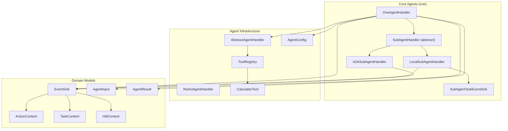
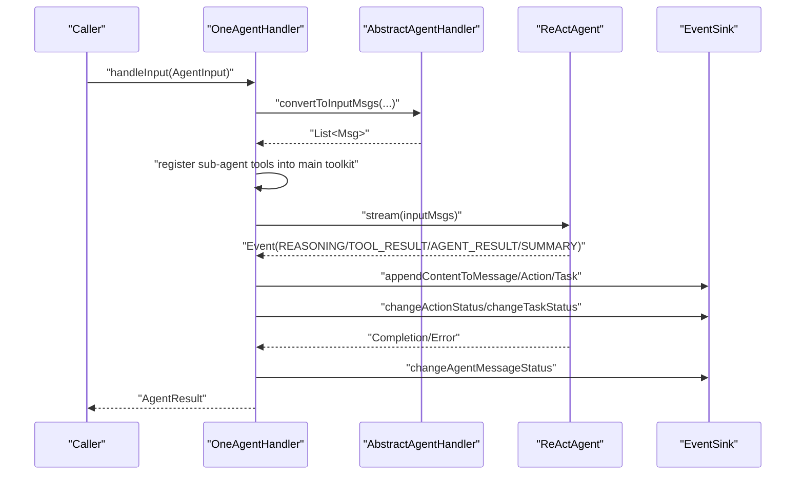
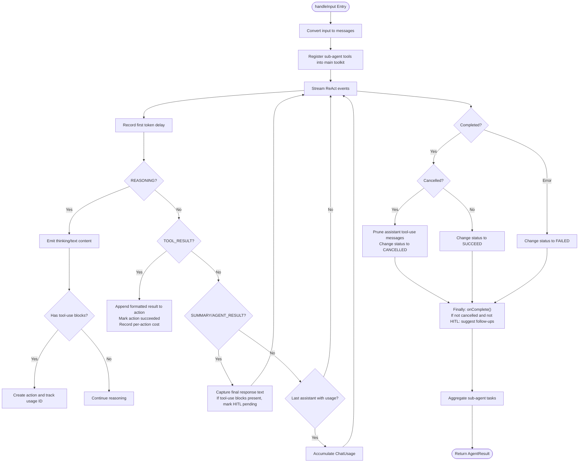
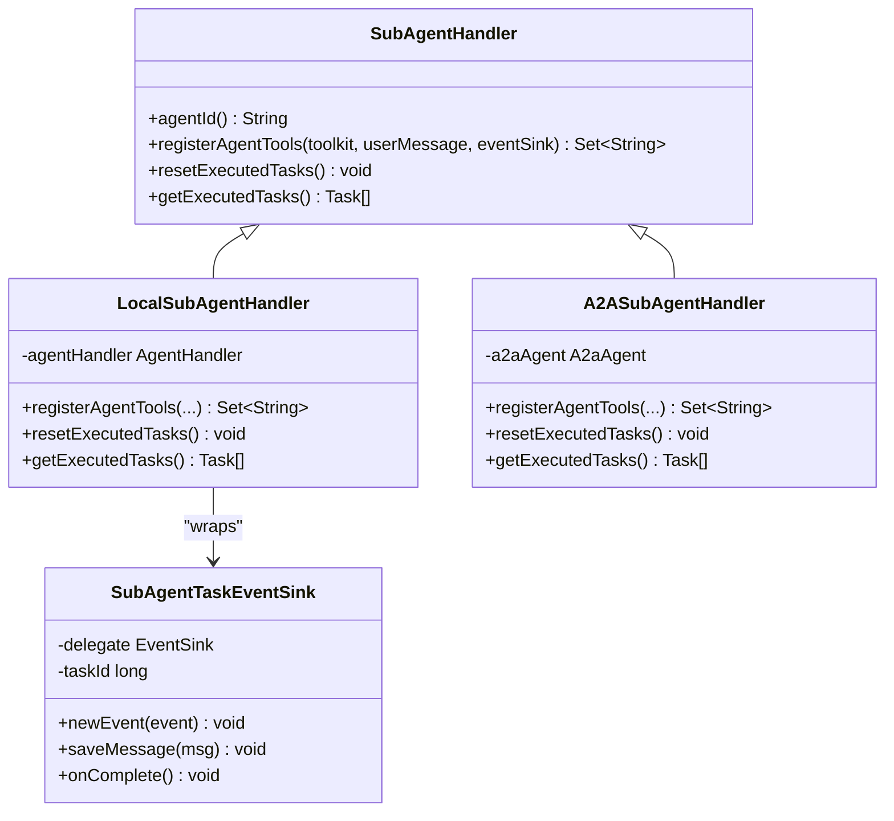
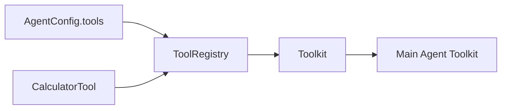
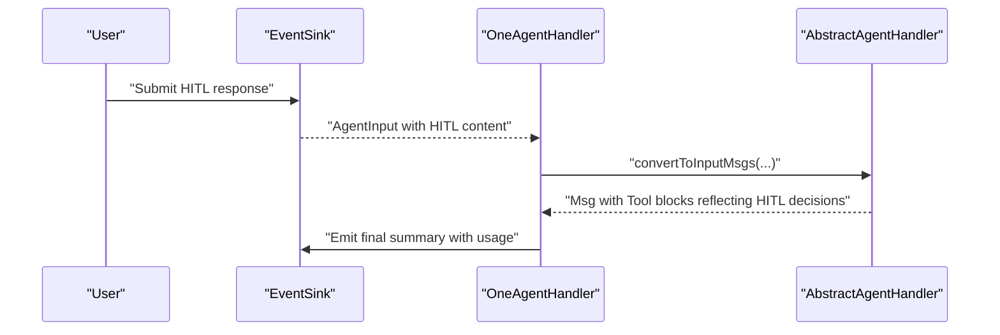
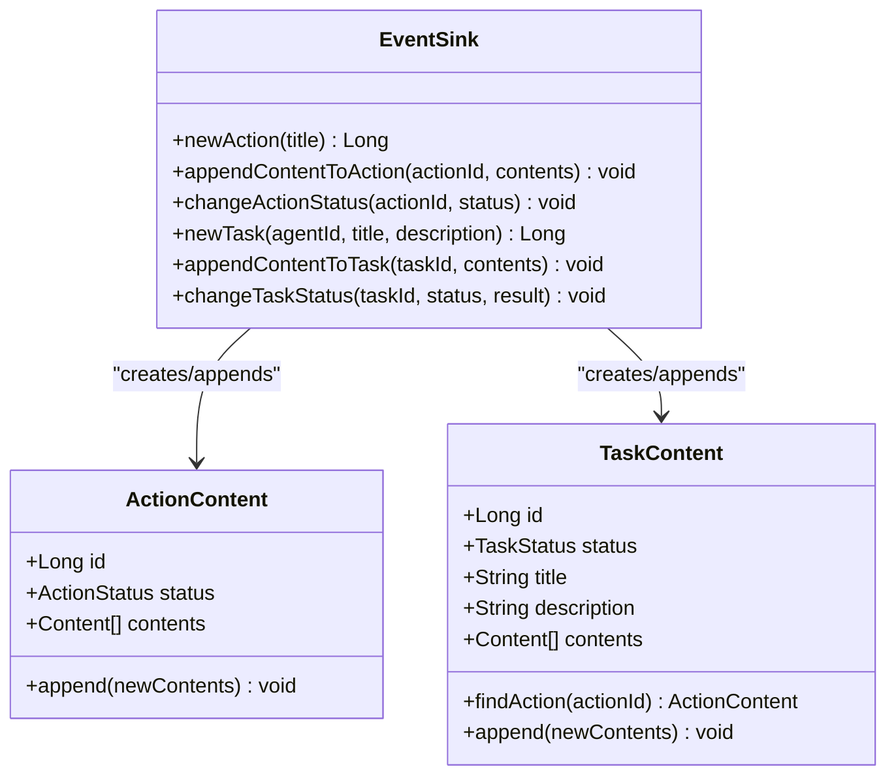
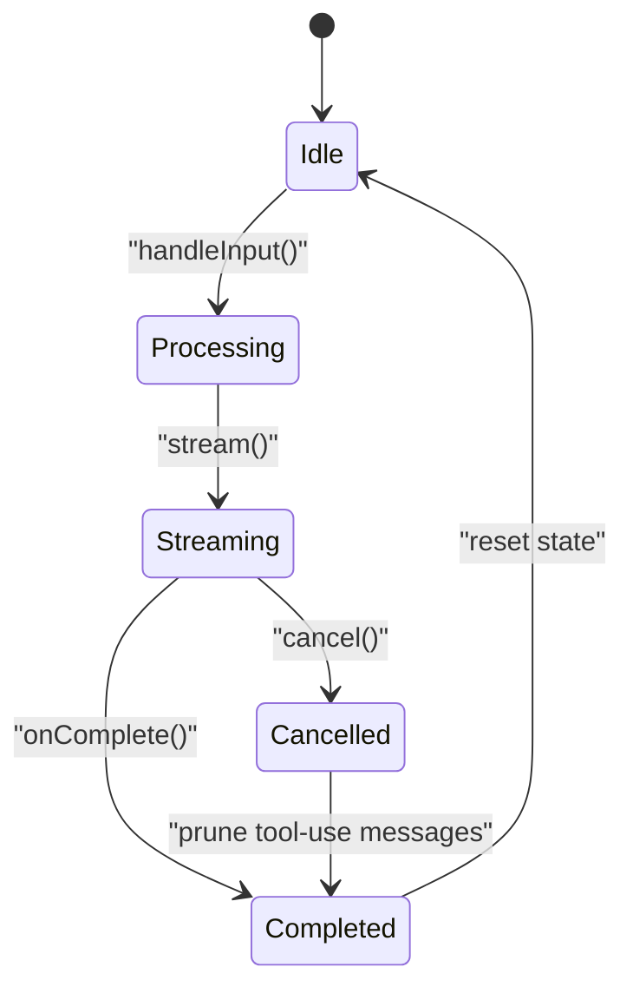
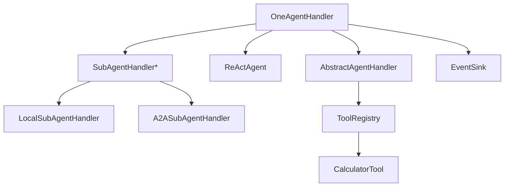

# Main Agent Handler (OneAgentHandler)

<cite>
**Referenced Files in This Document**
- [OneAgentHandler.java](file://backend_java/core/src/main/java/com/aliyun/tam/x/tron/core/agents/one/OneAgentHandler.java)
- [SubAgentHandler.java](file://backend_java/core/src/main/java/com/aliyun/tam/x/tron/core/agents/one/SubAgentHandler.java)
- [LocalSubAgentHandler.java](file://backend_java/core/src/main/java/com/aliyun/tam/x/tron/core/agents/one/LocalSubAgentHandler.java)
- [A2ASubAgentHandler.java](file://backend_java/core/src/main/java/com/aliyun/tam/x/tron/core/agents/one/A2ASubAgentHandler.java)
- [SubAgentTaskEventSink.java](file://backend_java/core/src/main/java/com/aliyun/tam/x/tron/core/agents/one/SubAgentTaskEventSink.java)
- [AbstractAgentHandler.java](file://backend_java/core/src/main/java/com/aliyun/tam/x/tron/core/agents/AbstractAgentHandler.java)
- [ReActAgentHandler.java](file://backend_java/core/src/main/java/com/aliyun/tam/x/tron/core/agents/ReActAgentHandler.java)
- [AgentInput.java](file://backend_java/core/src/main/java/com/aliyun/tam/x/tron/core/agents/AgentInput.java)
- [AgentResult.java](file://backend_java/core/src/main/java/com/aliyun/tam/x/tron/core/agents/AgentResult.java)
- [EventSink.java](file://backend_java/core/src/main/java/com/aliyun/tam/x/tron/core/domain/models/events/EventSink.java)
- [ActionContent.java](file://backend_java/core/src/main/java/com/aliyun/tam/x/tron/core/domain/models/contents/ActionContent.java)
- [TaskContent.java](file://backend_java/core/src/main/java/com/aliyun/tam/x/tron/core/domain/models/contents/TaskContent.java)
- [HitlContent.java](file://backend_java/core/src/main/java/com/aliyun/tam/x/tron/core/domain/models/contents/HitlContent.java)
- [ToolRegistry.java](file://backend_java/core/src/main/java/com/aliyun/tam/x/tron/core/tools/ToolRegistry.java)
- [CalculatorTool.java](file://backend_java/core/src/main/java/com/aliyun/tam/x/tron/core/tools/CalculatorTool.java)
- [AgentConfig.java](file://backend_java/core/src/main/java/com/aliyun/tam/x/tron/core/config/AgentConfig.java)
</cite>

## Table of Contents
1. [Introduction](#introduction)
2. [Project Structure](#project-structure)
3. [Core Components](#core-components)
4. [Architecture Overview](#architecture-overview)
5. [Detailed Component Analysis](#detailed-component-analysis)
6. [Dependency Analysis](#dependency-analysis)
7. [Performance Considerations](#performance-considerations)
8. [Troubleshooting Guide](#troubleshooting-guide)
9. [Conclusion](#conclusion)

## Introduction
This document explains the Main Agent Handler component, focusing on the OneAgentHandler implementation that orchestrates the primary ReAct agent with sub-agent coordination. It details the handleInput workflow, including input conversion, streaming processing, and event handling. It also covers integration with AgentScope ReActAgent for reasoning-action loops, tool registration mechanisms, Human-in-the-Loop (HITL) support, action tracking, sub-agent lifecycle, cancellation handling, and performance metrics collection.

## Project Structure
The Main Agent Handler resides in the Java backend core module under the agents.one package. It coordinates a top-level ReAct agent with optional sub-agents that can be local or external (A2A). The handler integrates with AgentScope’s ReActAgent and streams events to an EventSink for real-time updates.

**Diagram sources**
- [OneAgentHandler.java:47-61](file://backend_java/core/src/main/java/com/aliyun/tam/x/tron/core/agents/one/OneAgentHandler.java#L47-L61)
- [SubAgentHandler.java:29-45](file://backend_java/core/src/main/java/com/aliyun/tam/x/tron/core/agents/one/SubAgentHandler.java#L29-L45)
- [LocalSubAgentHandler.java:52-101](file://backend_java/core/src/main/java/com/aliyun/tam/x/tron/core/agents/one/LocalSubAgentHandler.java#L52-L101)
- [A2ASubAgentHandler.java:52-88](file://backend_java/core/src/main/java/com/aliyun/tam/x/tron/core/agents/one/A2ASubAgentHandler.java#L52-L88)
- [SubAgentTaskEventSink.java:31-40](file://backend_java/core/src/main/java/com/aliyun/tam/x/tron/core/agents/one/SubAgentTaskEventSink.java#L31-L40)
- [AbstractAgentHandler.java:54-149](file://backend_java/core/src/main/java/com/aliyun/tam/x/tron/core/agents/AbstractAgentHandler.java#L54-L149)
- [ReActAgentHandler.java:41-51](file://backend_java/core/src/main/java/com/aliyun/tam/x/tron/core/agents/ReActAgentHandler.java#L41-L51)
- [AgentConfig.java:39-132](file://backend_java/core/src/main/java/com/aliyun/tam/x/tron/core/config/AgentConfig.java#L39-L132)
- [ToolRegistry.java:35-76](file://backend_java/core/src/main/java/com/aliyun/tam/x/tron/core/tools/ToolRegistry.java#L35-L76)
- [CalculatorTool.java:29-49](file://backend_java/core/src/main/java/com/aliyun/tam/x/tron/core/tools/CalculatorTool.java#L29-L49)
- [EventSink.java:42-265](file://backend_java/core/src/main/java/com/aliyun/tam/x/tron/core/domain/models/events/EventSink.java#L42-L265)
- [ActionContent.java:39-77](file://backend_java/core/src/main/java/com/aliyun/tam/x/tron/core/domain/models/contents/ActionContent.java#L39-L77)
- [TaskContent.java:39-90](file://backend_java/core/src/main/java/com/aliyun/tam/x/tron/core/domain/models/contents/TaskContent.java#L39-L90)
- [HitlContent.java:21-37](file://backend_java/core/src/main/java/com/aliyun/tam/x/tron/core/domain/models/contents/HitlContent.java#L21-L37)
- [AgentInput.java:16-29](file://backend_java/core/src/main/java/com/aliyun/tam/x/tron/core/agents/AgentInput.java#L16-L29)
- [AgentResult.java:36-83](file://backend_java/core/src/main/java/com/aliyun/tam/x/tron/core/agents/AgentResult.java#L36-L83)

**Section sources**
- [OneAgentHandler.java:47-61](file://backend_java/core/src/main/java/com/aliyun/tam/x/tron/core/agents/one/OneAgentHandler.java#L47-L61)
- [AgentConfig.java:108-111](file://backend_java/core/src/main/java/com/aliyun/tam/x/tron/core/config/AgentConfig.java#L108-L111)

## Core Components
- OneAgentHandler: Orchestrates the main ReAct agent, registers tools, streams events, tracks actions/tasks, supports HITL, and aggregates sub-agent outcomes.
- SubAgentHandler (abstract): Defines the contract for sub-agents (local and A2A), including tool registration, task execution tracking, and task reset.
- LocalSubAgentHandler: Registers a tool that delegates task execution to another AgentHandler, forwarding content and capturing results.
- A2ASubAgentHandler: Registers AgentTool wrappers around A2A AgentCard skills, invoking external agents and emitting task events.
- SubAgentTaskEventSink: Wraps an EventSink to tag task-related content with a task ID and forward only relevant events upstream.
- AbstractAgentHandler: Provides shared utilities for input conversion, media processing, runtime context injection, question tool registration, and follow-up suggestions.
- ReActAgentHandler: Standalone ReAct handler for comparison; shares similar streaming and event handling patterns.
- EventSink and content models: ActionContent, TaskContent, HitlContent define structured content types for actions, tasks, and human-in-the-loop interactions.
- ToolRegistry and CalculatorTool: Centralized tool registration and a sample calculator tool demonstrating tool annotation and registration.

**Section sources**
- [OneAgentHandler.java:47-61](file://backend_java/core/src/main/java/com/aliyun/tam/x/tron/core/agents/one/OneAgentHandler.java#L47-L61)
- [SubAgentHandler.java:29-45](file://backend_java/core/src/main/java/com/aliyun/tam/x/tron/core/agents/one/SubAgentHandler.java#L29-L45)
- [LocalSubAgentHandler.java:52-101](file://backend_java/core/src/main/java/com/aliyun/tam/x/tron/core/agents/one/LocalSubAgentHandler.java#L52-L101)
- [A2ASubAgentHandler.java:52-88](file://backend_java/core/src/main/java/com/aliyun/tam/x/tron/core/agents/one/A2ASubAgentHandler.java#L52-L88)
- [SubAgentTaskEventSink.java:31-40](file://backend_java/core/src/main/java/com/aliyun/tam/x/tron/core/agents/one/SubAgentTaskEventSink.java#L31-L40)
- [AbstractAgentHandler.java:54-149](file://backend_java/core/src/main/java/com/aliyun/tam/x/tron/core/agents/AbstractAgentHandler.java#L54-L149)
- [ReActAgentHandler.java:41-51](file://backend_java/core/src/main/java/com/aliyun/tam/x/tron/core/agents/ReActAgentHandler.java#L41-L51)
- [EventSink.java:42-265](file://backend_java/core/src/main/java/com/aliyun/tam/x/tron/core/domain/models/events/EventSink.java#L42-L265)
- [ActionContent.java:39-77](file://backend_java/core/src/main/java/com/aliyun/tam/x/tron/core/domain/models/contents/ActionContent.java#L39-L77)
- [TaskContent.java:39-90](file://backend_java/core/src/main/java/com/aliyun/tam/x/tron/core/domain/models/contents/TaskContent.java#L39-L90)
- [HitlContent.java:21-37](file://backend_java/core/src/main/java/com/aliyun/tam/x/tron/core/domain/models/contents/HitlContent.java#L21-L37)
- [ToolRegistry.java:35-76](file://backend_java/core/src/main/java/com/aliyun/tam/x/tron/core/tools/ToolRegistry.java#L35-L76)
- [CalculatorTool.java:29-49](file://backend_java/core/src/main/java/com/aliyun/tam/x/tron/core/tools/CalculatorTool.java#L29-L49)

## Architecture Overview
The OneAgentHandler composes a main ReAct agent and a list of sub-agent handlers. On each input:
- Converts user message to AgentScope messages with runtime context and media processing.
- Registers sub-agent tools into the main agent’s toolkit.
- Streams ReAct events, updating the EventSink with thinking, reasoning, tool usage, tool results, and final summary.
- Tracks actions and tasks, supports HITL prompts, and collects usage metrics.
- Aggregates sub-agent tasks into the final result.

**Diagram sources**
- [OneAgentHandler.java:74-272](file://backend_java/core/src/main/java/com/aliyun/tam/x/tron/core/agents/one/OneAgentHandler.java#L74-L272)
- [AbstractAgentHandler.java:191-278](file://backend_java/core/src/main/java/com/aliyun/tam/x/tron/core/agents/AbstractAgentHandler.java#L191-L278)
- [EventSink.java:101-256](file://backend_java/core/src/main/java/com/aliyun/tam/x/tron/core/domain/models/events/EventSink.java#L101-L256)

## Detailed Component Analysis

### OneAgentHandler: Orchestration and Streaming
- Construction: Builds the main ReAct agent from a builder and registers the question tool if enabled.
- handleInput:
  - Converts input to messages, registers sub-agent tools into the main toolkit, resets sub-agent executed tasks, and starts streaming.
  - Observes events:
    - First token delay recorded on first event.
    - REASONING events: emits thinking and text content; for tool-use blocks, creates actions and tracks ongoing tool usage IDs.
    - TOOL_RESULT events: appends formatted tool results to actions, marks actions succeeded, records per-action cost.
    - SUMMARY/AGENT_RESULT events: captures final response text; if tool-use blocks present, marks HITL pending.
    - Last assistant message with usage: accumulates ChatUsage into AgentResult.
  - Completion/error hooks:
    - On completion: if cancelled, prunes assistant tool-use messages and marks message as CANCELLED; otherwise SUCCEED.
    - On error: marks message as FAILED with error message.
    - Finally: completes EventSink; if not cancelled and not HITL, emits follow-up suggestions.
  - Post-stream: aggregates sub-agent tasks and resets their counters.
- Cancellation: interrupts the main agent and sets a flag; on completion, prunes assistant tool-use messages and marks the message as CANCELLED.

**Diagram sources**
- [OneAgentHandler.java:74-272](file://backend_java/core/src/main/java/com/aliyun/tam/x/tron/core/agents/one/OneAgentHandler.java#L74-L272)

**Section sources**
- [OneAgentHandler.java:55-61](file://backend_java/core/src/main/java/com/aliyun/tam/x/tron/core/agents/one/OneAgentHandler.java#L55-L61)
- [OneAgentHandler.java:74-272](file://backend_java/core/src/main/java/com/aliyun/tam/x/tron/core/agents/one/OneAgentHandler.java#L74-L272)
- [OneAgentHandler.java:274-287](file://backend_java/core/src/main/java/com/aliyun/tam/x/tron/core/agents/one/OneAgentHandler.java#L274-L287)

### Sub-Agent Coordination
- SubAgentHandler contract:
  - registerAgentTools(toolkit, userMessage, eventSink): registers tools into the main agent’s toolkit and returns tool names.
  - resetExecutedTasks(): clears executed tasks after aggregation.
  - getExecutedTasks(): returns tasks executed by the sub-agent.
- LocalSubAgentHandler:
  - Registers a single tool named after the sub-agent ID.
  - Delegates execution to another AgentHandler with a dedicated UserSessionMessage containing task content and media.
  - Uses SubAgentTaskEventSink to attach task IDs to content and forward only relevant events upstream.
  - Persists sub-session state before/after delegation.
- A2ASubAgentHandler:
  - Registers AgentTool wrappers for each skill in the configured AgentCard.
  - Invokes A2aAgent with user-provided task detail; emits task content and status changes.
  - Persists A2A agent session state.

**Diagram sources**
- [SubAgentHandler.java:29-45](file://backend_java/core/src/main/java/com/aliyun/tam/x/tron/core/agents/one/SubAgentHandler.java#L29-L45)
- [LocalSubAgentHandler.java:52-101](file://backend_java/core/src/main/java/com/aliyun/tam/x/tron/core/agents/one/LocalSubAgentHandler.java#L52-L101)
- [A2ASubAgentHandler.java:52-88](file://backend_java/core/src/main/java/com/aliyun/tam/x/tron/core/agents/one/A2ASubAgentHandler.java#L52-L88)
- [SubAgentTaskEventSink.java:31-40](file://backend_java/core/src/main/java/com/aliyun/tam/x/tron/core/agents/one/SubAgentTaskEventSink.java#L31-L40)

**Section sources**
- [SubAgentHandler.java:29-45](file://backend_java/core/src/main/java/com/aliyun/tam/x/tron/core/agents/one/SubAgentHandler.java#L29-L45)
- [LocalSubAgentHandler.java:103-224](file://backend_java/core/src/main/java/com/aliyun/tam/x/tron/core/agents/one/LocalSubAgentHandler.java#L103-L224)
- [A2ASubAgentHandler.java:90-187](file://backend_java/core/src/main/java/com/aliyun/tam/x/tron/core/agents/one/A2ASubAgentHandler.java#L90-L187)
- [SubAgentTaskEventSink.java:31-96](file://backend_java/core/src/main/java/com/aliyun/tam/x/tron/core/agents/one/SubAgentTaskEventSink.java#L31-L96)

### Tool Registration Mechanism
- Question tool: Registered by AbstractAgentHandler if enabled and not already present.
- ToolRegistry: Scans Spring beans for @Tool annotations and registers them into a Toolkit; can register tools per agent configuration.
- CalculatorTool: Demonstrates a tool annotated with @Tool and registered via ToolRegistry.

**Diagram sources**
- [AbstractAgentHandler.java:167-172](file://backend_java/core/src/main/java/com/aliyun/tam/x/tron/core/agents/AbstractAgentHandler.java#L167-L172)
- [ToolRegistry.java:35-76](file://backend_java/core/src/main/java/com/aliyun/tam/x/tron/core/tools/ToolRegistry.java#L35-L76)
- [CalculatorTool.java:29-49](file://backend_java/core/src/main/java/com/aliyun/tam/x/tron/core/tools/CalculatorTool.java#L29-L49)
- [AgentConfig.java:88-90](file://backend_java/core/src/main/java/com/aliyun/tam/x/tron/core/config/AgentConfig.java#L88-L90)

**Section sources**
- [AbstractAgentHandler.java:167-172](file://backend_java/core/src/main/java/com/aliyun/tam/x/tron/core/agents/AbstractAgentHandler.java#L167-L172)
- [ToolRegistry.java:52-67](file://backend_java/core/src/main/java/com/aliyun/tam/x/tron/core/tools/ToolRegistry.java#L52-L67)
- [CalculatorTool.java:29-49](file://backend_java/core/src/main/java/com/aliyun/tam/x/tron/core/tools/CalculatorTool.java#L29-L49)
- [AgentConfig.java:88-90](file://backend_java/core/src/main/java/com/aliyun/tam/x/tron/core/config/AgentConfig.java#L88-L90)

### Human-in-the-Loop (HITL) Support
- Question tool schema is registered when enabled.
- During input conversion, if the user message contains HITL content, the handler builds a tool result message reflecting user approvals/rejections/cancellations.
- During streaming, if a reasoning event contains tool-use blocks, the handler emits a HITL content item and marks the overall result as requiring HITL.
- EventSink supports appending HITL content and changing message status accordingly.

**Diagram sources**
- [AbstractAgentHandler.java:219-278](file://backend_java/core/src/main/java/com/aliyun/tam/x/tron/core/agents/AbstractAgentHandler.java#L219-L278)
- [OneAgentHandler.java:106-123](file://backend_java/core/src/main/java/com/aliyun/tam/x/tron/core/agents/one/OneAgentHandler.java#L106-L123)
- [HitlContent.java:21-37](file://backend_java/core/src/main/java/com/aliyun/tam/x/tron/core/domain/models/contents/HitlContent.java#L21-L37)
- [EventSink.java:101-130](file://backend_java/core/src/main/java/com/aliyun/tam/x/tron/core/domain/models/events/EventSink.java#L101-L130)

**Section sources**
- [AbstractAgentHandler.java:61-128](file://backend_java/core/src/main/java/com/aliyun/tam/x/tron/core/agents/AbstractAgentHandler.java#L61-L128)
- [AbstractAgentHandler.java:219-278](file://backend_java/core/src/main/java/com/aliyun/tam/x/tron/core/agents/AbstractAgentHandler.java#L219-L278)
- [OneAgentHandler.java:106-123](file://backend_java/core/src/main/java/com/aliyun/tam/x/tron/core/agents/one/OneAgentHandler.java#L106-L123)
- [HitlContent.java:21-37](file://backend_java/core/src/main/java/com/aliyun/tam/x/tron/core/domain/models/contents/HitlContent.java#L21-L37)

### Action Tracking and Task Aggregation
- Actions:
  - Created when tool-use blocks appear in reasoning events.
  - Arguments and results are appended to the action via EventSink.
  - Status transitions from EXECUTING to SUCCEED with timing recorded.
- Tasks:
  - Created by sub-agents via EventSink.newTask.
  - Content appended and status changed upon completion.
  - Aggregated into AgentResult.tasks by OneAgentHandler after stream completion.
- Content models:
  - ActionContent and TaskContent encapsulate structured content and merging behavior.

**Diagram sources**
- [EventSink.java:202-256](file://backend_java/core/src/main/java/com/aliyun/tam/x/tron/core/domain/models/events/EventSink.java#L202-L256)
- [ActionContent.java:39-77](file://backend_java/core/src/main/java/com/aliyun/tam/x/tron/core/domain/models/contents/ActionContent.java#L39-L77)
- [TaskContent.java:39-90](file://backend_java/core/src/main/java/com/aliyun/tam/x/tron/core/domain/models/contents/TaskContent.java#L39-L90)

**Section sources**
- [EventSink.java:137-256](file://backend_java/core/src/main/java/com/aliyun/tam/x/tron/core/domain/models/events/EventSink.java#L137-L256)
- [ActionContent.java:55-71](file://backend_java/core/src/main/java/com/aliyun/tam/x/tron/core/domain/models/contents/ActionContent.java#L55-L71)
- [TaskContent.java:55-84](file://backend_java/core/src/main/java/com/aliyun/tam/x/tron/core/domain/models/contents/TaskContent.java#L55-L84)
- [OneAgentHandler.java:170-225](file://backend_java/core/src/main/java/com/aliyun/tam/x/tron/core/agents/one/OneAgentHandler.java#L170-L225)

### Main Agent Lifecycle and Cancellation Handling
- Lifecycle:
  - Initialization: Build main ReAct agent and register question tool.
  - Input handling: Convert input, register sub-agent tools, stream, update metrics, and emit follow-ups.
  - Completion: Persist usage, finalize statuses, and aggregate sub-agent tasks.
- Cancellation:
  - cancel(message): Interrupts the main agent and sets cancelled flag.
  - On completion: if cancelled, prune assistant tool-use messages and mark the agent message as CANCELLED.

**Diagram sources**
- [OneAgentHandler.java:274-287](file://backend_java/core/src/main/java/com/aliyun/tam/x/tron/core/agents/one/OneAgentHandler.java#L274-L287)
- [OneAgentHandler.java:227-264](file://backend_java/core/src/main/java/com/aliyun/tam/x/tron/core/agents/one/OneAgentHandler.java#L227-L264)

**Section sources**
- [OneAgentHandler.java:55-61](file://backend_java/core/src/main/java/com/aliyun/tam/x/tron/core/agents/one/OneAgentHandler.java#L55-L61)
- [OneAgentHandler.java:274-287](file://backend_java/core/src/main/java/com/aliyun/tam/x/tron/core/agents/one/OneAgentHandler.java#L274-L287)

### Performance Metrics Collection
- Timing:
  - First token delay: captured on first event.
  - First response token delay: captured when text content appears in reasoning or summary.
  - Total cost: measured from start to completion.
- Usage:
  - ChatUsage accumulated from the last assistant message carrying usage.
- Actions:
  - Per-action cost computed as elapsed milliseconds since action creation.

**Section sources**
- [OneAgentHandler.java:78-128](file://backend_java/core/src/main/java/com/aliyun/tam/x/tron/core/agents/one/OneAgentHandler.java#L78-L128)
- [OneAgentHandler.java:154-225](file://backend_java/core/src/main/java/com/aliyun/tam/x/tron/core/agents/one/OneAgentHandler.java#L154-L225)
- [AgentResult.java:67-83](file://backend_java/core/src/main/java/com/aliyun/tam/x/tron/core/agents/AgentResult.java#L67-L83)

## Dependency Analysis
- OneAgentHandler depends on:
  - AbstractAgentHandler for input conversion and question tool registration.
  - ReActAgent for reasoning-action loop and streaming.
  - SubAgentHandler implementations for tool registration and task execution.
  - EventSink for real-time updates and structured content emission.
  - ToolRegistry for centralized tool registration.
- Sub-agent handlers depend on:
  - EventSink for task/action creation and status changes.
  - AgentStateRepository for session persistence (via base classes).
  - LocalSubAgentHandler additionally depends on another AgentHandler for delegated execution.

**Diagram sources**
- [OneAgentHandler.java:47-61](file://backend_java/core/src/main/java/com/aliyun/tam/x/tron/core/agents/one/OneAgentHandler.java#L47-L61)
- [AbstractAgentHandler.java:130-143](file://backend_java/core/src/main/java/com/aliyun/tam/x/tron/core/agents/AbstractAgentHandler.java#L130-L143)
- [ToolRegistry.java:35-76](file://backend_java/core/src/main/java/com/aliyun/tam/x/tron/core/tools/ToolRegistry.java#L35-L76)
- [CalculatorTool.java:29-49](file://backend_java/core/src/main/java/com/aliyun/tam/x/tron/core/tools/CalculatorTool.java#L29-L49)
- [LocalSubAgentHandler.java:97-101](file://backend_java/core/src/main/java/com/aliyun/tam/x/tron/core/agents/one/LocalSubAgentHandler.java#L97-L101)
- [A2ASubAgentHandler.java:81-88](file://backend_java/core/src/main/java/com/aliyun/tam/x/tron/core/agents/one/A2ASubAgentHandler.java#L81-L88)

**Section sources**
- [OneAgentHandler.java:47-61](file://backend_java/core/src/main/java/com/aliyun/tam/x/tron/core/agents/one/OneAgentHandler.java#L47-L61)
- [AbstractAgentHandler.java:130-143](file://backend_java/core/src/main/java/com/aliyun/tam/x/tron/core/agents/AbstractAgentHandler.java#L130-L143)
- [ToolRegistry.java:35-76](file://backend_java/core/src/main/java/com/aliyun/tam/x/tron/core/tools/ToolRegistry.java#L35-L76)

## Performance Considerations
- Streaming processing ensures low latency for first-token and first-response-token delays.
- Concurrent maps track ongoing tool usage and actions to avoid contention.
- Minimizing memory copies by reusing content lists and merging adjacent content blocks.
- Using separate fast chat model for renaming and follow-up suggestion generation to reduce overhead on the main agent.

## Troubleshooting Guide
- No tool results observed:
  - Verify sub-agent tools are registered into the main toolkit and tool names match the schema.
  - Confirm tool formatter produces valid tool names and arguments.
- HITL not triggering:
  - Ensure question tool is enabled in configuration and the reasoning event contains tool-use blocks.
  - Check that EventSink receives and emits HITL content.
- Cancellation not taking effect:
  - Ensure cancel(message) is invoked and the main agent is interrupted.
  - Verify completion hook prunes assistant tool-use messages and updates status to CANCELLED.
- Task status stuck:
  - Confirm SubAgentTaskEventSink forwards TaskAppendContentEvent and TaskStatusChangeEvent.
  - Ensure AgentStateRepository persists sub-sessions correctly around delegated execution.

**Section sources**
- [AbstractAgentHandler.java:167-172](file://backend_java/core/src/main/java/com/aliyun/tam/x/tron/core/agents/AbstractAgentHandler.java#L167-L172)
- [OneAgentHandler.java:274-287](file://backend_java/core/src/main/java/com/aliyun/tam/x/tron/core/agents/one/OneAgentHandler.java#L274-L287)
- [SubAgentTaskEventSink.java:42-80](file://backend_java/core/src/main/java/com/aliyun/tam/x/tron/core/agents/one/SubAgentTaskEventSink.java#L42-L80)
- [LocalSubAgentHandler.java:167-187](file://backend_java/core/src/main/java/com/aliyun/tam/x/tron/core/agents/one/LocalSubAgentHandler.java#L167-L187)

## Conclusion
The OneAgentHandler orchestrates a powerful ReAct agent with integrated sub-agent coordination, robust streaming event handling, HITL support, and comprehensive action/task tracking. Its modular design leverages SubAgentHandler abstractions for both local and external agents, while centralized tool registration and EventSink-driven content models ensure consistent observability and extensibility.