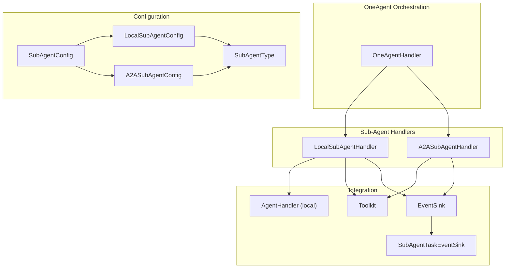
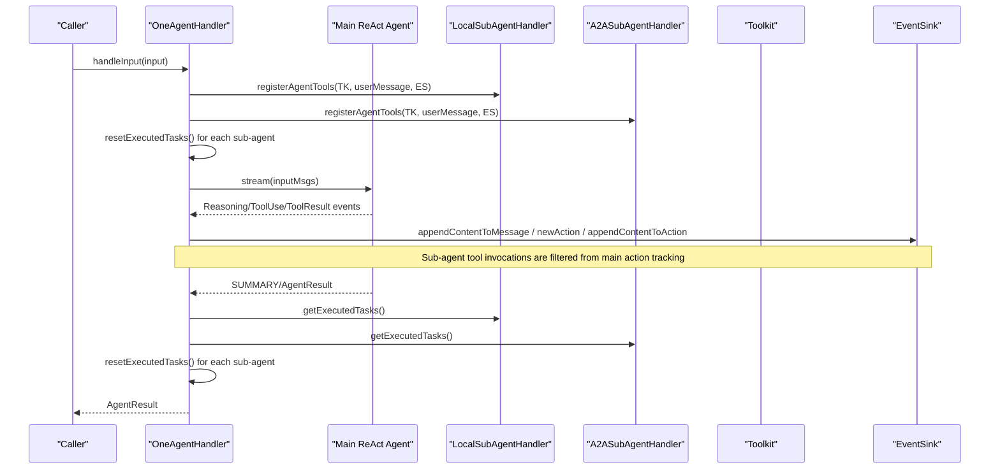
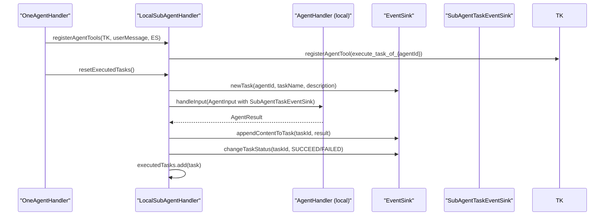
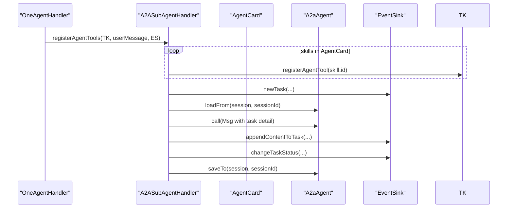
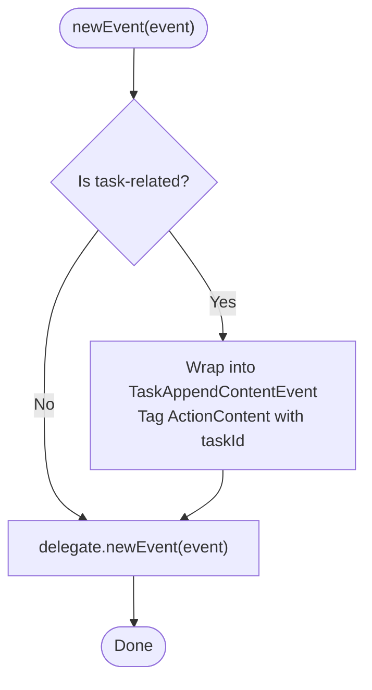
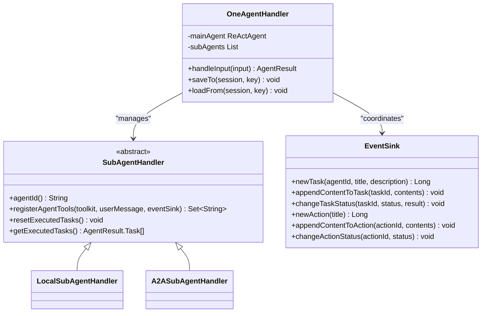
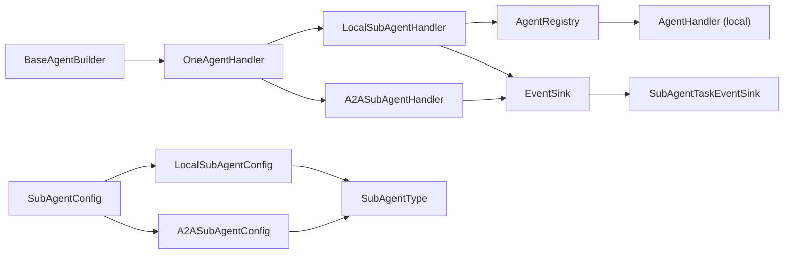

# Sub-Agent Handler (SubAgentHandler)

<cite>
**Referenced Files in This Document**
- [SubAgentHandler.java](file://backend_java/core/src/main/java/com/aliyun/tam/x/tron/core/agents/one/SubAgentHandler.java)
- [LocalSubAgentHandler.java](file://backend_java/core/src/main/java/com/aliyun/tam/x/tron/core/agents/one/LocalSubAgentHandler.java)
- [A2ASubAgentHandler.java](file://backend_java/core/src/main/java/com/aliyun/tam/x/tron/core/agents/one/A2ASubAgentHandler.java)
- [SubAgentTaskEventSink.java](file://backend_java/core/src/main/java/com/aliyun/tam/x/tron/core/agents/one/SubAgentTaskEventSink.java)
- [OneAgentHandler.java](file://backend_java/core/src/main/java/com/aliyun/tam/x/tron/core/agents/one/OneAgentHandler.java)
- [SubAgentConfig.java](file://backend_java/core/src/main/java/com/aliyun/tam/x/tron/core/config/SubAgentConfig.java)
- [LocalSubAgentConfig.java](file://backend_java/core/src/main/java/com/aliyun/tam/x/tron/core/config/LocalSubAgentConfig.java)
- [A2ASubAgentConfig.java](file://backend_java/core/src/main/java/com/aliyun/tam/x/tron/core/config/A2ASubAgentConfig.java)
- [SubAgentType.java](file://backend_java/core/src/main/java/com/aliyun/tam/x/tron/core/config/SubAgentType.java)
- [BaseAgentBuilder.java](file://backend_java/core/src/main/java/com/aliyun/tam/x/tron/core/agents/BaseAgentBuilder.java)
- [OneAgentBuilder.java](file://backend_java/core/src/main/java/com/aliyun/tam/x/tron/core/agents/examples/OneAgentBuilder.java)
- [EventSink.java](file://backend_java/core/src/main/java/com/aliyun/tam/x/tron/core/domain/models/events/EventSink.java)
- [AbstractAgentHandler.java](file://backend_java/core/src/main/java/com/aliyun/tam/x/tron/core/agents/AbstractAgentHandler.java)
</cite>

## Table of Contents
1. [Introduction](#introduction)
2. [Project Structure](#project-structure)
3. [Core Components](#core-components)
4. [Architecture Overview](#architecture-overview)
5. [Detailed Component Analysis](#detailed-component-analysis)
6. [Dependency Analysis](#dependency-analysis)
7. [Performance Considerations](#performance-considerations)
8. [Troubleshooting Guide](#troubleshooting-guide)
9. [Conclusion](#conclusion)
10. [Appendices](#appendices)

## Introduction
This document describes the Sub-Agent Handler component in the OneAgent system. It explains how SubAgentHandler manages child agents, registers tools into the main agent’s toolkit, tracks executed tasks, integrates with the event sink, coordinates with the main agent, and resets state. It also covers lifecycle management, collaboration patterns, tool sharing strategies, and event handling workflows.

## Project Structure
The Sub-Agent Handler resides in the OneAgent subsystem alongside configuration classes and the main orchestrator. The relevant files are organized as follows:
- SubAgentHandler: abstract base for sub-agent handlers
- LocalSubAgentHandler: local sub-agent handler delegating to another AgentHandler
- A2ASubAgentHandler: A2A sub-agent handler wrapping an external A2A agent
- SubAgentTaskEventSink: task-scoped event sink decorator
- OneAgentHandler: main orchestrator integrating sub-agents into the ReAct agent
- SubAgentConfig hierarchy: configuration for local and A2A sub-agents
- BaseAgentBuilder and OneAgentBuilder: wiring and example configuration

**Diagram sources**
- [OneAgentHandler.java:55-61](file://backend_java/core/src/main/java/com/aliyun/tam/x/tron/core/agents/one/OneAgentHandler.java#L55-L61)
- [LocalSubAgentHandler.java:97-101](file://backend_java/core/src/main/java/com/aliyun/tam/x/tron/core/agents/one/LocalSubAgentHandler.java#L97-L101)
- [A2ASubAgentHandler.java:81-88](file://backend_java/core/src/main/java/com/aliyun/tam/x/tron/core/agents/one/A2ASubAgentHandler.java#L81-L88)
- [SubAgentTaskEventSink.java:31-40](file://backend_java/core/src/main/java/com/aliyun/tam/x/tron/core/agents/one/SubAgentTaskEventSink.java#L31-L40)
- [SubAgentConfig.java:40-54](file://backend_java/core/src/main/java/com/aliyun/tam/x/tron/core/config/SubAgentConfig.java#L40-L54)
- [LocalSubAgentConfig.java:30-46](file://backend_java/core/src/main/java/com/aliyun/tam/x/tron/core/config/LocalSubAgentConfig.java#L30-L46)
- [A2ASubAgentConfig.java:28-47](file://backend_java/core/src/main/java/com/aliyun/tam/x/tron/core/config/A2ASubAgentConfig.java#L28-L47)

**Section sources**
- [SubAgentHandler.java:29-45](file://backend_java/core/src/main/java/com/aliyun/tam/x/tron/core/agents/one/SubAgentHandler.java#L29-L45)
- [OneAgentHandler.java:55-61](file://backend_java/core/src/main/java/com/aliyun/tam/x/tron/core/agents/one/OneAgentHandler.java#L55-L61)

## Core Components
- SubAgentHandler: abstract base defining the contract for sub-agent handlers, including agentId, tool registration, executed task management, and reset semantics.
- LocalSubAgentHandler: registers a single tool that delegates execution to a local AgentHandler, creates tasks, appends content, updates statuses, and records execution metrics.
- A2ASubAgentHandler: registers tools derived from an AgentCard, invokes an external A2A agent, and mirrors task lifecycle into the event sink.
- SubAgentTaskEventSink: wraps the main EventSink to filter and forward only task-related events to the parent, while tagging ActionContent with the sub-agent task ID.
- OneAgentHandler: integrates sub-agents by registering their tools into the main ReAct agent’s toolkit, resetting per-run executed tasks, and aggregating sub-agent tasks into the final result.

**Section sources**
- [SubAgentHandler.java:29-45](file://backend_java/core/src/main/java/com/aliyun/tam/x/tron/core/agents/one/SubAgentHandler.java#L29-L45)
- [LocalSubAgentHandler.java:103-224](file://backend_java/core/src/main/java/com/aliyun/tam/x/tron/core/agents/one/LocalSubAgentHandler.java#L103-L224)
- [A2ASubAgentHandler.java:90-187](file://backend_java/core/src/main/java/com/aliyun/tam/x/tron/core/agents/one/A2ASubAgentHandler.java#L90-L187)
- [SubAgentTaskEventSink.java:31-95](file://backend_java/core/src/main/java/com/aliyun/tam/x/tron/core/agents/one/SubAgentTaskEventSink.java#L31-L95)
- [OneAgentHandler.java:82-88](file://backend_java/core/src/main/java/com/aliyun/tam/x/tron/core/agents/one/OneAgentHandler.java#L82-L88)

## Architecture Overview
The Sub-Agent Handler architecture centers on the main OneAgentHandler, which:
- Builds the main ReAct agent
- Iterates over configured sub-agents
- Registers sub-agent tools into the main toolkit
- Resets executed tasks per run
- Streams ReAct events, filtering out sub-agent tool invocations from the main agent’s action tracking
- Aggregates sub-agent tasks into the final AgentResult and resets per-run state

**Diagram sources**
- [OneAgentHandler.java:74-272](file://backend_java/core/src/main/java/com/aliyun/tam/x/tron/core/agents/one/OneAgentHandler.java#L74-L272)
- [LocalSubAgentHandler.java:103-224](file://backend_java/core/src/main/java/com/aliyun/tam/x/tron/core/agents/one/LocalSubAgentHandler.java#L103-L224)
- [A2ASubAgentHandler.java:90-187](file://backend_java/core/src/main/java/com/aliyun/tam/x/tron/core/agents/one/A2ASubAgentHandler.java#L90-L187)

## Detailed Component Analysis

### SubAgentHandler (abstract)
- Responsibilities:
  - Expose agentId for identification
  - Register sub-agent tools into the main toolkit
  - Track executed tasks and reset state per run
- Contract:
  - registerAgentTools(toolkit, userMessage, eventSink): returns tool names registered
  - resetExecutedTasks(): clears executed tasks
  - getExecutedTasks(): returns immutable list of executed tasks

**Section sources**
- [SubAgentHandler.java:29-45](file://backend_java/core/src/main/java/com/aliyun/tam/x/tron/core/agents/one/SubAgentHandler.java#L29-L45)

### LocalSubAgentHandler
- Role: wraps a local AgentHandler and exposes a single tool named after the sub-agent ID.
- Tool registration:
  - Creates an AgentTool with a fixed parameter schema including task_name, task_detail, optional images/videos
  - Registers the tool into the main toolkit
- Execution flow:
  - Generates a task ID via eventSink.newTask
  - Builds a UserSessionMessage with text and optional media content
  - Loads sub-agent state from AgentStateRepository
  - Delegates to the local AgentHandler with a SubAgentTaskEventSink wrapper
  - Saves sub-agent state after execution
  - Appends result text to the task and marks task success/failure
  - Records execution cost and adds to executedTasks
- Task sharing:
  - Uses a SubAgentTaskEventSink to tag ActionContent with the task ID and forward only relevant events to the parent

**Diagram sources**
- [LocalSubAgentHandler.java:103-224](file://backend_java/core/src/main/java/com/aliyun/tam/x/tron/core/agents/one/LocalSubAgentHandler.java#L103-L224)
- [SubAgentTaskEventSink.java:31-95](file://backend_java/core/src/main/java/com/aliyun/tam/x/tron/core/agents/one/SubAgentTaskEventSink.java#L31-L95)

**Section sources**
- [LocalSubAgentHandler.java:103-224](file://backend_java/core/src/main/java/com/aliyun/tam/x/tron/core/agents/one/LocalSubAgentHandler.java#L103-L224)
- [SubAgentTaskEventSink.java:31-95](file://backend_java/core/src/main/java/com/aliyun/tam/x/tron/core/agents/one/SubAgentTaskEventSink.java#L31-L95)

### A2ASubAgentHandler
- Role: adapts an external A2A agent described by an AgentCard into a sub-agent.
- Tool registration:
  - Iterates skills in AgentCard and creates an AgentTool per skill
  - Tool schema defines task_name and task_detail parameters
  - Registers tools into the main toolkit
- Execution flow:
  - Creates a task via eventSink.newTask
  - Loads sub-agent session from AgentStateRepository
  - Invokes A2aAgent.call with a text message containing the task detail
  - Saves sub-agent session after invocation
  - Appends result text to the task and updates status
  - Handles exceptions by marking task as failed and recording cost

**Diagram sources**
- [A2ASubAgentHandler.java:90-187](file://backend_java/core/src/main/java/com/aliyun/tam/x/tron/core/agents/one/A2ASubAgentHandler.java#L90-L187)

**Section sources**
- [A2ASubAgentHandler.java:90-187](file://backend_java/core/src/main/java/com/aliyun/tam/x/tron/core/agents/one/A2ASubAgentHandler.java#L90-L187)

### SubAgentTaskEventSink
- Purpose: decorate the main EventSink to:
  - Filter out non-task events (e.g., user input, agent message)
  - Wrap AgentMessageAppendContentEvent into TaskAppendContentEvent for the sub-agent task
  - Tag ActionContent with the associated task ID
  - Delegate other events to the parent EventSink

**Diagram sources**
- [SubAgentTaskEventSink.java:42-80](file://backend_java/core/src/main/java/com/aliyun/tam/x/tron/core/agents/one/SubAgentTaskEventSink.java#L42-L80)

**Section sources**
- [SubAgentTaskEventSink.java:31-95](file://backend_java/core/src/main/java/com/aliyun/tam/x/tron/core/agents/one/SubAgentTaskEventSink.java#L31-L95)

### OneAgentHandler Integration
- Integrates sub-agents during input handling:
  - Registers sub-agent tools into the main toolkit
  - Resets executed tasks for each sub-agent
  - Streams ReAct events, filtering sub-agent tool use from main action tracking
  - Aggregates sub-agent tasks into the final AgentResult and resets per-run state
- Cancellation and completion:
  - Supports cancellation and updates message status accordingly
  - Emits completion hooks and suggestions when appropriate

**Diagram sources**
- [OneAgentHandler.java:55-61](file://backend_java/core/src/main/java/com/aliyun/tam/x/tron/core/agents/one/OneAgentHandler.java#L55-L61)
- [SubAgentHandler.java:29-45](file://backend_java/core/src/main/java/com/aliyun/tam/x/tron/core/agents/one/SubAgentHandler.java#L29-L45)
- [EventSink.java:42-265](file://backend_java/core/src/main/java/com/aliyun/tam/x/tron/core/domain/models/events/EventSink.java#L42-L265)

**Section sources**
- [OneAgentHandler.java:74-272](file://backend_java/core/src/main/java/com/aliyun/tam/x/tron/core/agents/one/OneAgentHandler.java#L74-L272)

## Dependency Analysis
- Wiring:
  - BaseAgentBuilder constructs OneAgentHandler and instantiates sub-agents based on SubAgentConfig type
  - LocalSubAgentHandler requires an AgentHandler resolved from AgentRegistry
- Configuration:
  - SubAgentConfig is polymorphic with LocalSubAgentConfig and A2ASubAgentConfig
  - SubAgentType enumerates supported sub-agent kinds
- Eventing:
  - EventSink provides unified APIs for tasks, actions, and messages
  - SubAgentTaskEventSink ensures task-scoped visibility and proper tagging

**Diagram sources**
- [BaseAgentBuilder.java:278-299](file://backend_java/core/src/main/java/com/aliyun/tam/x/tron/core/agents/BaseAgentBuilder.java#L278-L299)
- [OneAgentHandler.java:55-61](file://backend_java/core/src/main/java/com/aliyun/tam/x/tron/core/agents/one/OneAgentHandler.java#L55-L61)
- [LocalSubAgentHandler.java:97-101](file://backend_java/core/src/main/java/com/aliyun/tam/x/tron/core/agents/one/LocalSubAgentHandler.java#L97-L101)
- [SubAgentConfig.java:40-54](file://backend_java/core/src/main/java/com/aliyun/tam/x/tron/core/config/SubAgentConfig.java#L40-L54)
- [LocalSubAgentConfig.java:30-46](file://backend_java/core/src/main/java/com/aliyun/tam/x/tron/core/config/LocalSubAgentConfig.java#L30-L46)
- [A2ASubAgentConfig.java:28-47](file://backend_java/core/src/main/java/com/aliyun/tam/x/tron/core/config/A2ASubAgentConfig.java#L28-L47)

**Section sources**
- [BaseAgentBuilder.java:278-299](file://backend_java/core/src/main/java/com/aliyun/tam/x/tron/core/agents/BaseAgentBuilder.java#L278-L299)
- [SubAgentConfig.java:40-54](file://backend_java/core/src/main/java/com/aliyun/tam/x/tron/core/config/SubAgentConfig.java#L40-L54)

## Performance Considerations
- Tool registration overhead: Each sub-agent registers tools into the main toolkit; keep the number of sub-agents and skills reasonable to avoid schema bloat.
- Task tracking: Executed tasks are stored in memory lists; ensure periodic resets to prevent unbounded growth.
- Session persistence: Loading/saving sessions for sub-agents introduces IO; batch operations and reuse sessions where possible.
- Event filtering: SubAgentTaskEventSink reduces noise by filtering non-task events; maintain this pattern to minimize downstream processing.

[No sources needed since this section provides general guidance]

## Troubleshooting Guide
- Tools not appearing:
  - Verify sub-agent is enabled and registered by OneAgentHandler
  - Confirm registerAgentTools returns non-empty tool names
- Task status stuck:
  - Check SubAgentTaskEventSink forwarding of TaskStatusChangeEvent
  - Ensure eventSink.changeTaskStatus is invoked after execution
- Execution failures:
  - Inspect exception handling paths in LocalSubAgentHandler and A2ASubAgentHandler
  - Verify task failure status and error messages are recorded
- State corruption:
  - Ensure agentStateRepository.loadFrom/saveTo pairs are symmetric around execution
  - Validate session IDs constructed from user/session IDs and agent IDs

**Section sources**
- [LocalSubAgentHandler.java:202-218](file://backend_java/core/src/main/java/com/aliyun/tam/x/tron/core/agents/one/LocalSubAgentHandler.java#L202-L218)
- [A2ASubAgentHandler.java:164-180](file://backend_java/core/src/main/java/com/aliyun/tam/x/tron/core/agents/one/A2ASubAgentHandler.java#L164-L180)
- [SubAgentTaskEventSink.java:42-80](file://backend_java/core/src/main/java/com/aliyun/tam/x/tron/core/agents/one/SubAgentTaskEventSink.java#L42-L80)

## Conclusion
The Sub-Agent Handler component enables the OneAgent system to coordinate child agents seamlessly. It centralizes tool registration, task execution tracking, and event integration while preserving clear separation of concerns. Through LocalSubAgentHandler and A2ASubAgentHandler, the system supports both local delegation and external A2A agents. Proper lifecycle management, reset mechanisms, and event scoping ensure reliable orchestration in multi-agent scenarios.

[No sources needed since this section summarizes without analyzing specific files]

## Appendices

### Collaboration Patterns
- Local delegation pattern:
  - A sub-agent tool triggers a local AgentHandler with a task-scoped EventSink wrapper
  - The wrapper ensures task visibility and proper tagging
- A2A pattern:
  - Skills from an AgentCard become tools; each tool invokes an external A2A agent
  - Results are appended to the task and status updated

**Section sources**
- [LocalSubAgentHandler.java:103-224](file://backend_java/core/src/main/java/com/aliyun/tam/x/tron/core/agents/one/LocalSubAgentHandler.java#L103-L224)
- [A2ASubAgentHandler.java:90-187](file://backend_java/core/src/main/java/com/aliyun/tam/x/tron/core/agents/one/A2ASubAgentHandler.java#L90-L187)

### Tool Sharing Strategies
- Centralized toolkit: Tools are registered into the main ReAct agent’s toolkit, enabling cross-agent discovery
- Per-run isolation: Tools are registered per input handling; resets occur after each run to avoid cross-run contamination
- Task-scoped events: SubAgentTaskEventSink ensures only task-related events propagate to the parent

**Section sources**
- [OneAgentHandler.java:82-88](file://backend_java/core/src/main/java/com/aliyun/tam/x/tron/core/agents/one/OneAgentHandler.java#L82-L88)
- [SubAgentTaskEventSink.java:31-95](file://backend_java/core/src/main/java/com/aliyun/tam/x/tron/core/agents/one/SubAgentTaskEventSink.java#L31-L95)

### Event Handling Workflows
- Task creation: newTask generates a task with EXECUTING status and attaches initial content
- Content append: appendContentToTask adds results; TaskAppendContentEvent is emitted
- Status change: changeTaskStatus transitions to SUCCEED/FAILED and sets completion timestamps
- Action tracking: newAction/appended content/changeActionStatus manage action lifecycles in the parent

**Section sources**
- [EventSink.java:137-195](file://backend_java/core/src/main/java/com/aliyun/tam/x/tron/core/domain/models/events/EventSink.java#L137-L195)

### Lifecycle Management and Resource Coordination
- Construction:
  - BaseAgentBuilder resolves sub-agent configurations and constructs handlers
- Initialization:
  - OneAgentHandler registers tools and resets executed tasks
- Execution:
  - Sub-agent tools are invoked; sessions are loaded/saved; tasks are tracked
- Finalization:
  - Executed tasks aggregated into AgentResult; per-run resets performed

**Section sources**
- [BaseAgentBuilder.java:278-299](file://backend_java/core/src/main/java/com/aliyun/tam/x/tron/core/agents/BaseAgentBuilder.java#L278-L299)
- [OneAgentHandler.java:74-272](file://backend_java/core/src/main/java/com/aliyun/tam/x/tron/core/agents/one/OneAgentHandler.java#L74-L272)