# Memory and State Management

<cite>
**Referenced Files in This Document**
- [AgentChatUsage.java](file://backend_java/core/src/main/java/com/aliyun/tam/x/tron/core/agents/AgentChatUsage.java)
- [AgentResult.java](file://backend_java/core/src/main/java/com/aliyun/tam/x/tron/core/agents/AgentResult.java)
- [AgentHelper.java](file://backend_java/core/src/main/java/com/aliyun/tam/x/tron/core/utils/AgentHelper.java)
- [AgentMetricsHook.java](file://backend_java/core/src/main/java/com/aliyun/tam/x/tron/core/utils/AgentMetricsHook.java)
- [LongTermMemoryRegistry.java](file://backend_java/core/src/main/java/com/aliyun/tam/x/tron/core/mem/LongTermMemoryRegistry.java)
- [LongTermMemoryConfigBuilder.java](file://backend_java/core/src/main/java/com/aliyun/tam/x/tron/core/mem/LongTermMemoryConfigBuilder.java)
- [BailianLongTermMemoryConfig.java](file://backend_java/core/src/main/java/com/aliyun/tam/x/tron/core/config/BailianLongTermMemoryConfig.java)
- [AgentStateRepository.java](file://backend_java/core/src/main/java/com/aliyun/tam/x/tron/core/domain/repository/AgentStateRepository.java)
- [SessionRepository.java](file://backend_java/core/src/main/java/com/aliyun/tam/x/tron/core/domain/repository/SessionRepository.java)
- [MysqlAgentStateRepository.java](file://backend_java/core/src/main/java/com/aliyun/tam/x/tron/core/domain/repository/mysql/MysqlAgentStateRepository.java)
- [MysqlSessionRepository.java](file://backend_java/core/src/main/java/com/aliyun/tam/x/tron/core/domain/repository/mysql/MysqlSessionRepository.java)
- [Content.java](file://backend_java/core/src/main/java/com/aliyun/tam/x/tron/core/domain/models/contents/Content.java)
- [ActionContent.java](file://backend_java/core/src/main/java/com/aliyun/tam/x/tron/core/domain/models/contents/ActionContent.java)
- [TaskContent.java](file://backend_java/core/src/main/java/com/aliyun/tam/x/tron/core/domain/models/contents/TaskContent.java)
- [Session.java](file://backend_java/core/src/main/java/com/aliyun/tam/x/tron/core/domain/models/Session.java)
</cite>

## Table of Contents
1. [Introduction](#introduction)
2. [Project Structure](#project-structure)
3. [Core Components](#core-components)
4. [Architecture Overview](#architecture-overview)
5. [Detailed Component Analysis](#detailed-component-analysis)
6. [Dependency Analysis](#dependency-analysis)
7. [Performance Considerations](#performance-considerations)
8. [Troubleshooting Guide](#troubleshooting-guide)
9. [Conclusion](#conclusion)
10. [Appendices](#appendices)

## Introduction
This document explains the agent memory and state management systems in the backend Java module. It covers:
- AgentChatUsage tracking for cost monitoring, token counting, and usage analytics
- AgentResult structure including action/task tracking, performance metrics, and completion status
- AgentHelper utility functions for converting between internal content models and external message blocks
- AgentMetricsHook for performance monitoring via Micrometer metrics
- Memory persistence strategies, state serialization/deserialization, and session continuity across agent restarts
- Examples of memory optimization, state checkpointing, and recovery mechanisms
- Concurrent access patterns, memory leak prevention, and debugging tools for state inspection
- Guidelines for implementing custom memory providers and extending state management capabilities

## Project Structure
The memory and state management features are primarily located under:
- Agents: AgentChatUsage, AgentResult, AgentHelper, AgentMetricsHook
- Memory: LongTermMemoryRegistry, LongTermMemoryConfigBuilder, BailianLongTermMemoryConfig
- Domain models: Content, ActionContent, TaskContent, Session
- Repositories: AgentStateRepository, SessionRepository, MySQL implementations

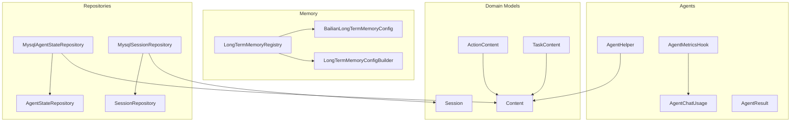

**Diagram sources**
- [AgentChatUsage.java:1-33](file://backend_java/core/src/main/java/com/aliyun/tam/x/tron/core/agents/AgentChatUsage.java#L1-L33)
- [AgentResult.java:1-84](file://backend_java/core/src/main/java/com/aliyun/tam/x/tron/core/agents/AgentResult.java#L1-L84)
- [AgentHelper.java:1-143](file://backend_java/core/src/main/java/com/aliyun/tam/x/tron/core/utils/AgentHelper.java#L1-L143)
- [AgentMetricsHook.java:1-116](file://backend_java/core/src/main/java/com/aliyun/tam/x/tron/core/utils/AgentMetricsHook.java#L1-L116)
- [LongTermMemoryRegistry.java:1-227](file://backend_java/core/src/main/java/com/aliyun/tam/x/tron/core/mem/LongTermMemoryRegistry.java#L1-L227)
- [LongTermMemoryConfigBuilder.java:1-27](file://backend_java/core/src/main/java/com/aliyun/tam/x/tron/core/mem/LongTermMemoryConfigBuilder.java#L1-L27)
- [BailianLongTermMemoryConfig.java:1-47](file://backend_java/core/src/main/java/com/aliyun/tam/x/tron/core/config/BailianLongTermMemoryConfig.java#L1-L47)
- [AgentStateRepository.java:1-38](file://backend_java/core/src/main/java/com/aliyun/tam/x/tron/core/domain/repository/AgentStateRepository.java#L1-L38)
- [SessionRepository.java:1-37](file://backend_java/core/src/main/java/com/aliyun/tam/x/tron/core/domain/repository/SessionRepository.java#L1-L37)
- [MysqlAgentStateRepository.java:1-206](file://backend_java/core/src/main/java/com/aliyun/tam/x/tron/core/domain/repository/mysql/MysqlAgentStateRepository.java#L1-L206)
- [MysqlSessionRepository.java:1-173](file://backend_java/core/src/main/java/com/aliyun/tam/x/tron/core/domain/repository/mysql/MysqlSessionRepository.java#L1-L173)
- [Content.java:1-148](file://backend_java/core/src/main/java/com/aliyun/tam/x/tron/core/domain/models/contents/Content.java#L1-L148)
- [ActionContent.java:1-78](file://backend_java/core/src/main/java/com/aliyun/tam/x/tron/core/domain/models/contents/ActionContent.java#L1-L78)
- [TaskContent.java:1-91](file://backend_java/core/src/main/java/com/aliyun/tam/x/tron/core/domain/models/contents/TaskContent.java#L1-L91)
- [Session.java:1-78](file://backend_java/core/src/main/java/com/aliyun/tam/x/tron/core/domain/models/Session.java#L1-L78)

**Section sources**
- [AgentChatUsage.java:1-33](file://backend_java/core/src/main/java/com/aliyun/tam/x/tron/core/agents/AgentChatUsage.java#L1-L33)
- [AgentResult.java:1-84](file://backend_java/core/src/main/java/com/aliyun/tam/x/tron/core/agents/AgentResult.java#L1-L84)
- [AgentHelper.java:1-143](file://backend_java/core/src/main/java/com/aliyun/tam/x/tron/core/utils/AgentHelper.java#L1-L143)
- [AgentMetricsHook.java:1-116](file://backend_java/core/src/main/java/com/aliyun/tam/x/tron/core/utils/AgentMetricsHook.java#L1-L116)
- [LongTermMemoryRegistry.java:1-227](file://backend_java/core/src/main/java/com/aliyun/tam/x/tron/core/mem/LongTermMemoryRegistry.java#L1-L227)
- [LongTermMemoryConfigBuilder.java:1-27](file://backend_java/core/src/main/java/com/aliyun/tam/x/tron/core/mem/LongTermMemoryConfigBuilder.java#L1-L27)
- [BailianLongTermMemoryConfig.java:1-47](file://backend_java/core/src/main/java/com/aliyun/tam/x/tron/core/config/BailianLongTermMemoryConfig.java#L1-L47)
- [AgentStateRepository.java:1-38](file://backend_java/core/src/main/java/com/aliyun/tam/x/tron/core/domain/repository/AgentStateRepository.java#L1-L38)
- [SessionRepository.java:1-37](file://backend_java/core/src/main/java/com/aliyun/tam/x/tron/core/domain/repository/SessionRepository.java#L1-L37)
- [MysqlAgentStateRepository.java:1-206](file://backend_java/core/src/main/java/com/aliyun/tam/x/tron/core/domain/repository/mysql/MysqlAgentStateRepository.java#L1-L206)
- [MysqlSessionRepository.java:1-173](file://backend_java/core/src/main/java/com/aliyun/tam/x/tron/core/domain/repository/mysql/MysqlSessionRepository.java#L1-L173)
- [Content.java:1-148](file://backend_java/core/src/main/java/com/aliyun/tam/x/tron/core/domain/models/contents/Content.java#L1-L148)
- [ActionContent.java:1-78](file://backend_java/core/src/main/java/com/aliyun/tam/x/tron/core/domain/models/contents/ActionContent.java#L1-L78)
- [TaskContent.java:1-91](file://backend_java/core/src/main/java/com/aliyun/tam/x/tron/core/domain/models/contents/TaskContent.java#L1-L91)
- [Session.java:1-78](file://backend_java/core/src/main/java/com/aliyun/tam/x/tron/core/domain/models/Session.java#L1-L78)

## Core Components
- AgentChatUsage: Aggregates invocation counts, latency in milliseconds, and token usage for cost monitoring and analytics.
- AgentResult: Captures response metadata, timing metrics, total cost, usage aggregation, and lists of actions/tasks performed during an agent run.
- AgentHelper: Converts between internal content models and external message blocks for interoperability.
- AgentMetricsHook: Publishes Micrometer metrics for reasoning, acting, summarization, errors, and token/time usage.
- LongTermMemoryRegistry: Resolves and constructs long-term memory providers (e.g., Bailian) with configuration merging and runtime selection.
- AgentStateRepository and MySQL implementations: Persist and retrieve agent state per session, enabling continuity across restarts.
- SessionRepository and MySQL implementations: Manage session lifecycle, pagination, updates, and cleanup.
- Content hierarchy: Defines polymorphic content types (text, media, task, action) with JSON serialization/deserialization support and content merging.

**Section sources**
- [AgentChatUsage.java:14-31](file://backend_java/core/src/main/java/com/aliyun/tam/x/tron/core/agents/AgentChatUsage.java#L14-L31)
- [AgentResult.java:36-82](file://backend_java/core/src/main/java/com/aliyun/tam/x/tron/core/agents/AgentResult.java#L36-L82)
- [AgentHelper.java:46-141](file://backend_java/core/src/main/java/com/aliyun/tam/x/tron/core/utils/AgentHelper.java#L46-L141)
- [AgentMetricsHook.java:44-114](file://backend_java/core/src/main/java/com/aliyun/tam/x/tron/core/utils/AgentMetricsHook.java#L44-L114)
- [LongTermMemoryRegistry.java:59-126](file://backend_java/core/src/main/java/com/aliyun/tam/x/tron/core/mem/LongTermMemoryRegistry.java#L59-L126)
- [AgentStateRepository.java:26-37](file://backend_java/core/src/main/java/com/aliyun/tam/x/tron/core/domain/repository/AgentStateRepository.java#L26-L37)
- [MysqlAgentStateRepository.java:127-203](file://backend_java/core/src/main/java/com/aliyun/tam/x/tron/core/domain/repository/mysql/MysqlAgentStateRepository.java#L127-L203)
- [SessionRepository.java:23-36](file://backend_java/core/src/main/java/com/aliyun/tam/x/tron/core/domain/repository/SessionRepository.java#L23-L36)
- [MysqlSessionRepository.java:59-159](file://backend_java/core/src/main/java/com/aliyun/tam/x/tron/core/domain/repository/mysql/MysqlSessionRepository.java#L59-L159)
- [Content.java:45-146](file://backend_java/core/src/main/java/com/aliyun/tam/x/tron/core/domain/models/contents/Content.java#L45-L146)
- [ActionContent.java:39-77](file://backend_java/core/src/main/java/com/aliyun/tam/x/tron/core/domain/models/contents/ActionContent.java#L39-L77)
- [TaskContent.java:34-90](file://backend_java/core/src/main/java/com/aliyun/tam/x/tron/core/domain/models/contents/TaskContent.java#L34-L90)

## Architecture Overview
The system integrates three primary subsystems:
- Metrics and usage tracking: AgentMetricsHook publishes usage and timing metrics; AgentChatUsage aggregates usage across runs.
- Content and memory: AgentHelper converts content for messaging; LongTermMemoryRegistry resolves provider configurations and performs remote record/retrieve operations.
- Persistence and sessions: AgentStateRepository persists structured state per session; SessionRepository manages session lifecycle and cleanup.

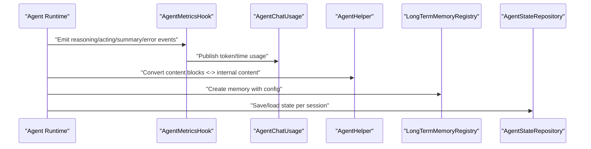

**Diagram sources**
- [AgentMetricsHook.java:44-114](file://backend_java/core/src/main/java/com/aliyun/tam/x/tron/core/utils/AgentMetricsHook.java#L44-L114)
- [AgentChatUsage.java:26-31](file://backend_java/core/src/main/java/com/aliyun/tam/x/tron/core/agents/AgentChatUsage.java#L26-L31)
- [AgentHelper.java:46-141](file://backend_java/core/src/main/java/com/aliyun/tam/x/tron/core/utils/AgentHelper.java#L46-L141)
- [LongTermMemoryRegistry.java:92-126](file://backend_java/core/src/main/java/com/aliyun/tam/x/tron/core/mem/LongTermMemoryRegistry.java#L92-L126)
- [AgentStateRepository.java:28-36](file://backend_java/core/src/main/java/com/aliyun/tam/x/tron/core/domain/repository/AgentStateRepository.java#L28-L36)

## Detailed Component Analysis

### AgentChatUsage: Cost Monitoring and Analytics
AgentChatUsage aggregates:
- Invocation count
- Latency in milliseconds
- Prompt and completion tokens

It increments counters based on ChatUsage inputs, enabling downstream analytics and cost attribution.

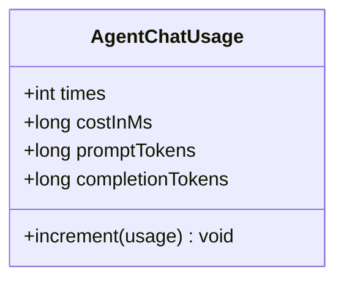

**Diagram sources**
- [AgentChatUsage.java:14-31](file://backend_java/core/src/main/java/com/aliyun/tam/x/tron/core/agents/AgentChatUsage.java#L14-L31)

**Section sources**
- [AgentChatUsage.java:14-31](file://backend_java/core/src/main/java/com/aliyun/tam/x/tron/core/agents/AgentChatUsage.java#L14-L31)

### AgentResult: Action, Task, and Performance Tracking
AgentResult encapsulates:
- Response text
- Timing metrics (first-token delay, first-response-token delay)
- Total cost
- Usage aggregation (AgentChatUsage)
- Lists of actions and tasks with identifiers, names, and success flags

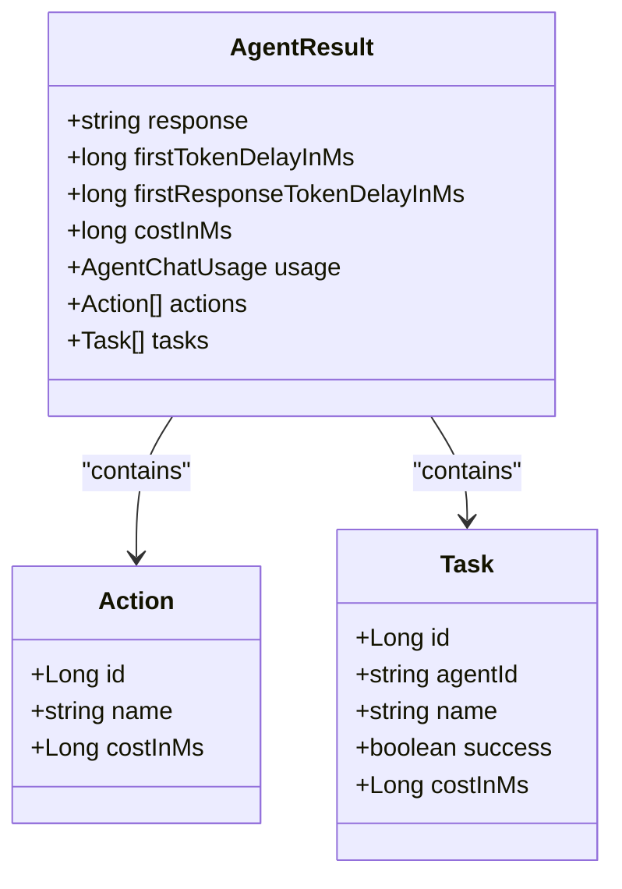

**Diagram sources**
- [AgentResult.java:36-82](file://backend_java/core/src/main/java/com/aliyun/tam/x/tron/core/agents/AgentResult.java#L36-L82)

**Section sources**
- [AgentResult.java:36-82](file://backend_java/core/src/main/java/com/aliyun/tam/x/tron/core/agents/AgentResult.java#L36-L82)

### AgentHelper: State and Content Conversion Utilities
AgentHelper provides bidirectional conversion between external message blocks and internal content models:
- Converts from blocks to content lists and vice versa
- Handles text, thinking, and media content (image/video/audio) with URL or Base64 sources
- Supports async-style processing patterns via reactive types

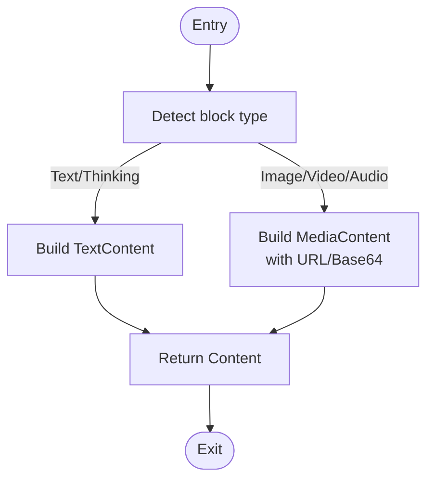

**Diagram sources**
- [AgentHelper.java:46-141](file://backend_java/core/src/main/java/com/aliyun/tam/x/tron/core/utils/AgentHelper.java#L46-L141)

**Section sources**
- [AgentHelper.java:46-141](file://backend_java/core/src/main/java/com/aliyun/tam/x/tron/core/utils/AgentHelper.java#L46-L141)

### AgentMetricsHook: Performance Monitoring
AgentMetricsHook registers as a system hook and emits:
- Reasoning, acting, summary, and error counters
- Token input/output histograms and latency distributions
- Tool-use duration summaries keyed by agent and tool

Concurrency-safe with a concurrent map tracking ongoing tool use timestamps.

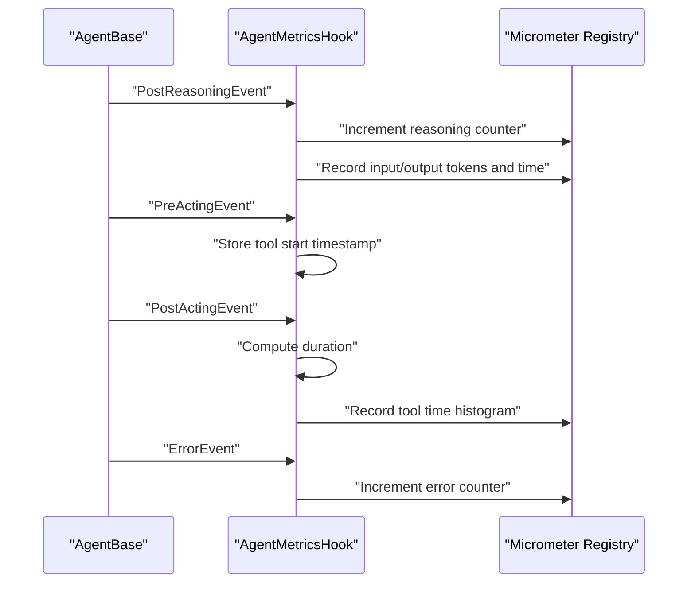

**Diagram sources**
- [AgentMetricsHook.java:44-114](file://backend_java/core/src/main/java/com/aliyun/tam/x/tron/core/utils/AgentMetricsHook.java#L44-L114)

**Section sources**
- [AgentMetricsHook.java:44-114](file://backend_java/core/src/main/java/com/aliyun/tam/x/tron/core/utils/AgentMetricsHook.java#L44-L114)

### Long-Term Memory: Provider Resolution and Remote Operations
LongTermMemoryRegistry:
- Merges configuration from builders and database repositories
- Creates provider instances based on configuration type (e.g., Bailian)
- Performs asynchronous record and retrieve operations against remote APIs

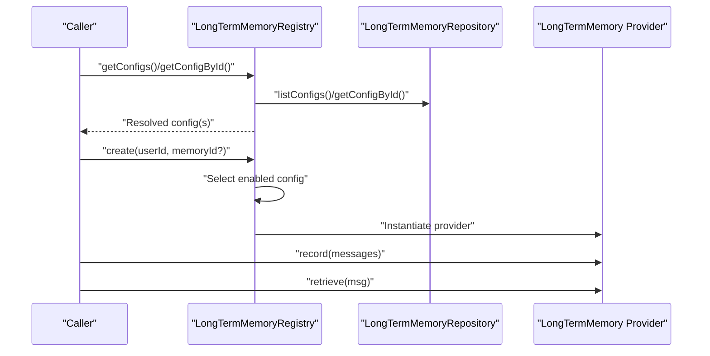

**Diagram sources**
- [LongTermMemoryRegistry.java:59-126](file://backend_java/core/src/main/java/com/aliyun/tam/x/tron/core/mem/LongTermMemoryRegistry.java#L59-L126)
- [LongTermMemoryConfigBuilder.java:22-26](file://backend_java/core/src/main/java/com/aliyun/tam/x/tron/core/mem/LongTermMemoryConfigBuilder.java#L22-L26)
- [BailianLongTermMemoryConfig.java:31-45](file://backend_java/core/src/main/java/com/aliyun/tam/x/tron/core/config/BailianLongTermMemoryConfig.java#L31-L45)

**Section sources**
- [LongTermMemoryRegistry.java:59-126](file://backend_java/core/src/main/java/com/aliyun/tam/x/tron/core/mem/LongTermMemoryRegistry.java#L59-L126)
- [LongTermMemoryConfigBuilder.java:22-26](file://backend_java/core/src/main/java/com/aliyun/tam/x/tron/core/mem/LongTermMemoryConfigBuilder.java#L22-L26)
- [BailianLongTermMemoryConfig.java:31-45](file://backend_java/core/src/main/java/com/aliyun/tam/x/tron/core/config/BailianLongTermMemoryConfig.java#L31-L45)

### State Persistence and Session Continuity
AgentStateRepository and MysqlAgentStateRepository:
- Provide a session abstraction with save/get/list/existence/delete operations
- Serialize state data to JSON and persist per session
- Support transactional reads/writes and list operations

SessionRepository and MysqlSessionRepository:
- Manage session creation, listing, retrieval, deletion, renaming, and last-applied event ID updates
- Enforce concurrency-safe creation and atomic cascading deletes

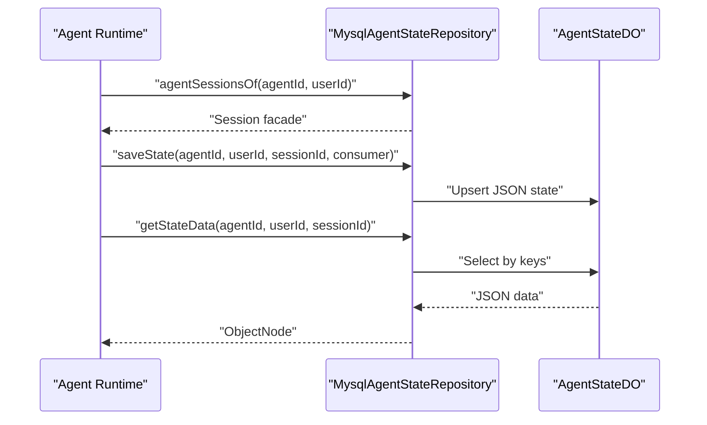

**Diagram sources**
- [MysqlAgentStateRepository.java:127-203](file://backend_java/core/src/main/java/com/aliyun/tam/x/tron/core/domain/repository/mysql/MysqlAgentStateRepository.java#L127-L203)
- [AgentStateRepository.java:28-36](file://backend_java/core/src/main/java/com/aliyun/tam/x/tron/core/domain/repository/AgentStateRepository.java#L28-L36)
- [MysqlSessionRepository.java:59-159](file://backend_java/core/src/main/java/com/aliyun/tam/x/tron/core/domain/repository/mysql/MysqlSessionRepository.java#L59-L159)
- [SessionRepository.java:25-35](file://backend_java/core/src/main/java/com/aliyun/tam/x/tron/core/domain/repository/SessionRepository.java#L25-L35)

**Section sources**
- [MysqlAgentStateRepository.java:127-203](file://backend_java/core/src/main/java/com/aliyun/tam/x/tron/core/domain/repository/mysql/MysqlAgentStateRepository.java#L127-L203)
- [AgentStateRepository.java:26-37](file://backend_java/core/src/main/java/com/aliyun/tam/x/tron/core/domain/repository/AgentStateRepository.java#L26-L37)
- [MysqlSessionRepository.java:59-159](file://backend_java/core/src/main/java/com/aliyun/tam/x/tron/core/domain/repository/mysql/MysqlSessionRepository.java#L59-L159)
- [SessionRepository.java:23-36](file://backend_java/core/src/main/java/com/aliyun/tam/x/tron/core/domain/repository/SessionRepository.java#L23-L36)

### Content Models: Serialization, Merging, and Hierarchical Structure
Content defines a polymorphic content hierarchy with Jackson annotations for type-aware deserialization. ActionContent and TaskContent embed lists of child contents and support merging logic to avoid duplication and preserve modification timestamps.

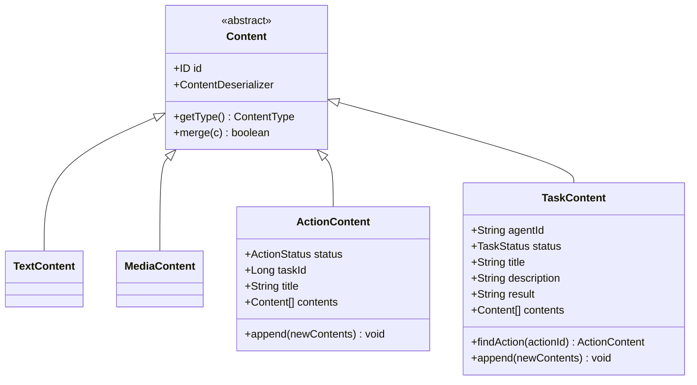

**Diagram sources**
- [Content.java:45-146](file://backend_java/core/src/main/java/com/aliyun/tam/x/tron/core/domain/models/contents/Content.java#L45-L146)
- [ActionContent.java:39-77](file://backend_java/core/src/main/java/com/aliyun/tam/x/tron/core/domain/models/contents/ActionContent.java#L39-L77)
- [TaskContent.java:34-90](file://backend_java/core/src/main/java/com/aliyun/tam/x/tron/core/domain/models/contents/TaskContent.java#L34-L90)

**Section sources**
- [Content.java:45-146](file://backend_java/core/src/main/java/com/aliyun/tam/x/tron/core/domain/models/contents/Content.java#L45-L146)
- [ActionContent.java:39-77](file://backend_java/core/src/main/java/com/aliyun/tam/x/tron/core/domain/models/contents/ActionContent.java#L39-L77)
- [TaskContent.java:34-90](file://backend_java/core/src/main/java/com/aliyun/tam/x/tron/core/domain/models/contents/TaskContent.java#L34-L90)

### Conceptual Overview
The following conceptual diagram illustrates how metrics, content, and memory integrate with persistence and sessions to form a cohesive state management pipeline.

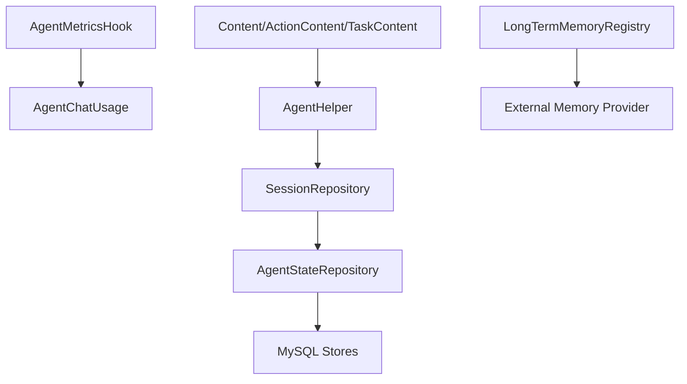

[No sources needed since this diagram shows conceptual workflow, not actual code structure]

## Dependency Analysis
- AgentMetricsHook depends on Micrometer and AgentBase hooks to emit metrics.
- LongTermMemoryRegistry depends on configuration builders and repositories to resolve provider configurations and on a REST client for remote operations.
- State and session repositories depend on DAOs and mappers for persistence.
- Content models rely on Jackson for polymorphic serialization/deserialization.

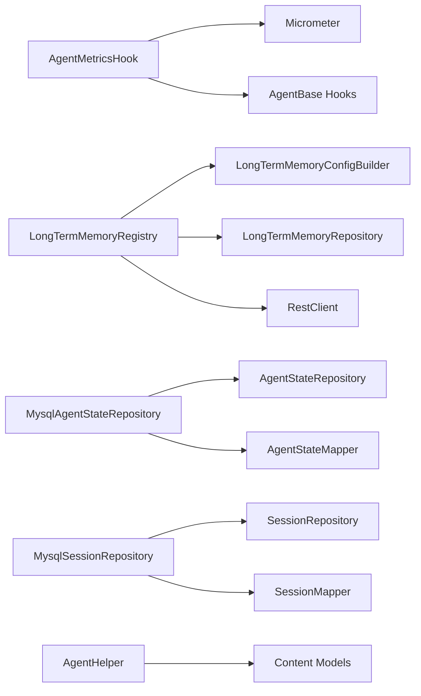

**Diagram sources**
- [AgentMetricsHook.java:34-89](file://backend_java/core/src/main/java/com/aliyun/tam/x/tron/core/utils/AgentMetricsHook.java#L34-L89)
- [LongTermMemoryRegistry.java:44-57](file://backend_java/core/src/main/java/com/aliyun/tam/x/tron/core/mem/LongTermMemoryRegistry.java#L44-L57)
- [MysqlAgentStateRepository.java:120-124](file://backend_java/core/src/main/java/com/aliyun/tam/x/tron/core/domain/repository/mysql/MysqlAgentStateRepository.java#L120-L124)
- [MysqlSessionRepository.java:47-57](file://backend_java/core/src/main/java/com/aliyun/tam/x/tron/core/domain/repository/mysql/MysqlSessionRepository.java#L47-L57)
- [AgentHelper.java:21-38](file://backend_java/core/src/main/java/com/aliyun/tam/x/tron/core/utils/AgentHelper.java#L21-L38)

**Section sources**
- [AgentMetricsHook.java:34-89](file://backend_java/core/src/main/java/com/aliyun/tam/x/tron/core/utils/AgentMetricsHook.java#L34-L89)
- [LongTermMemoryRegistry.java:44-57](file://backend_java/core/src/main/java/com/aliyun/tam/x/tron/core/mem/LongTermMemoryRegistry.java#L44-L57)
- [MysqlAgentStateRepository.java:120-124](file://backend_java/core/src/main/java/com/aliyun/tam/x/tron/core/domain/repository/mysql/MysqlAgentStateRepository.java#L120-L124)
- [MysqlSessionRepository.java:47-57](file://backend_java/core/src/main/java/com/aliyun/tam/x/tron/core/domain/repository/mysql/MysqlSessionRepository.java#L47-L57)
- [AgentHelper.java:21-38](file://backend_java/core/src/main/java/com/aliyun/tam/x/tron/core/utils/AgentHelper.java#L21-L38)

## Performance Considerations
- Metrics emission is lightweight and asynchronous via reactive patterns; ensure appropriate histogram buckets for latency and token distributions.
- State persistence uses transactional writes and JSON parsing; batch updates and minimize unnecessary writes to reduce contention.
- Long-term memory operations are network-bound; apply timeouts, retries, and circuit breaker patterns externally if needed.
- Content merging avoids redundant entries and updates timestamps efficiently.

[No sources needed since this section provides general guidance]

## Troubleshooting Guide
Common issues and remedies:
- State parsing failures: Verify JSON structure and handle exceptions during ObjectNode reads.
  - Reference: [MysqlAgentStateRepository.java:144-148](file://backend_java/core/src/main/java/com/aliyun/tam/x/tron/core/domain/repository/mysql/MysqlAgentStateRepository.java#L144-L148)
- Duplicate session creation: Expect warnings and idempotent behavior during concurrent creation.
  - Reference: [MysqlSessionRepository.java:72-79](file://backend_java/core/src/main/java/com/aliyun/tam/x/tron/core/domain/repository/mysql/MysqlSessionRepository.java#L72-L79)
- Missing long-term memory configuration: Fallback to a no-op memory provider when disabled or not found.
  - Reference: [LongTermMemoryRegistry.java:111-124](file://backend_java/core/src/main/java/com/aliyun/tam/x/tron/core/mem/LongTermMemoryRegistry.java#L111-L124)
- Content deserialization errors: Ensure subtype types and field names match the serialized payload.
  - Reference: [Content.java:108-124](file://backend_java/core/src/main/java/com/aliyun/tam/x/tron/core/domain/models/contents/Content.java#L108-L124)

**Section sources**
- [MysqlAgentStateRepository.java:144-148](file://backend_java/core/src/main/java/com/aliyun/tam/x/tron/core/domain/repository/mysql/MysqlAgentStateRepository.java#L144-L148)
- [MysqlSessionRepository.java:72-79](file://backend_java/core/src/main/java/com/aliyun/tam/x/tron/core/domain/repository/mysql/MysqlSessionRepository.java#L72-L79)
- [LongTermMemoryRegistry.java:111-124](file://backend_java/core/src/main/java/com/aliyun/tam/x/tron/core/mem/LongTermMemoryRegistry.java#L111-L124)
- [Content.java:108-124](file://backend_java/core/src/main/java/com/aliyun/tam/x/tron/core/domain/models/contents/Content.java#L108-L124)

## Conclusion
The memory and state management system combines robust metrics instrumentation, flexible content modeling, and persistent session/state stores. It supports long-term memory integration, efficient serialization/deserialization, and resilient concurrency handling. By leveraging these components, developers can implement cost-aware agents, track detailed performance, and maintain continuity across restarts while optimizing memory usage and preventing leaks.

[No sources needed since this section summarizes without analyzing specific files]

## Appendices

### Memory Optimization Techniques
- Prefer incremental state updates and merge semantics to minimize storage overhead.
  - Reference: [ActionContent.java:57-71](file://backend_java/core/src/main/java/com/aliyun/tam/x/tron/core/domain/models/contents/ActionContent.java#L57-L71), [TaskContent.java:70-84](file://backend_java/core/src/main/java/com/aliyun/tam/x/tron/core/domain/models/contents/TaskContent.java#L70-L84)
- Use tool-use duration histograms to identify slow tools and optimize accordingly.
  - Reference: [AgentMetricsHook.java:67-73](file://backend_java/core/src/main/java/com/aliyun/tam/x/tron/core/utils/AgentMetricsHook.java#L67-L73)
- Limit long-term memory payloads to essential context to reduce network costs.
  - Reference: [LongTermMemoryRegistry.java:169-214](file://backend_java/core/src/main/java/com/aliyun/tam/x/tron/core/mem/LongTermMemoryRegistry.java#L169-L214)

**Section sources**
- [ActionContent.java:57-71](file://backend_java/core/src/main/java/com/aliyun/tam/x/tron/core/domain/models/contents/ActionContent.java#L57-L71)
- [TaskContent.java:70-84](file://backend_java/core/src/main/java/com/aliyun/tam/x/tron/core/domain/models/contents/TaskContent.java#L70-L84)
- [AgentMetricsHook.java:67-73](file://backend_java/core/src/main/java/com/aliyun/tam/x/tron/core/utils/AgentMetricsHook.java#L67-L73)
- [LongTermMemoryRegistry.java:169-214](file://backend_java/core/src/main/java/com/aliyun/tam/x/tron/core/mem/LongTermMemoryRegistry.java#L169-L214)

### State Checkpointing and Recovery Mechanisms
- Periodically persist agent state using the session facade to enable recovery after restarts.
  - Reference: [MysqlAgentStateRepository.java:60-109](file://backend_java/core/src/main/java/com/aliyun/tam/x/tron/core/domain/repository/mysql/MysqlAgentStateRepository.java#L60-L109)
- Maintain separate session IDs per user and agent to isolate state and enable targeted recovery.
  - Reference: [MysqlAgentStateRepository.java:112-117](file://backend_java/core/src/main/java/com/aliyun/tam/x/tron/core/domain/repository/mysql/MysqlAgentStateRepository.java#L112-L117)
- Use last-applied event IDs to reconcile session state across replicas or partitions.
  - Reference: [MysqlSessionRepository.java:150-159](file://backend_java/core/src/main/java/com/aliyun/tam/x/tron/core/domain/repository/mysql/MysqlSessionRepository.java#L150-L159)

**Section sources**
- [MysqlAgentStateRepository.java:60-109](file://backend_java/core/src/main/java/com/aliyun/tam/x/tron/core/domain/repository/mysql/MysqlAgentStateRepository.java#L60-L109)
- [MysqlAgentStateRepository.java:112-117](file://backend_java/core/src/main/java/com/aliyun/tam/x/tron/core/domain/repository/mysql/MysqlAgentStateRepository.java#L112-L117)
- [MysqlSessionRepository.java:150-159](file://backend_java/core/src/main/java/com/aliyun/tam/x/tron/core/domain/repository/mysql/MysqlSessionRepository.java#L150-L159)

### Concurrent Access Patterns and Leak Prevention
- Use concurrent maps for ephemeral tracking (e.g., tool-use timestamps) and ensure proper cleanup.
  - Reference: [AgentMetricsHook.java:42](file://backend_java/core/src/main/java/com/aliyun/tam/x/tron/core/utils/AgentMetricsHook.java#L42)
- Employ transactional boundaries around state writes to prevent partial updates.
  - Reference: [MysqlAgentStateRepository.java:133-203](file://backend_java/core/src/main/java/com/aliyun/tam/x/tron/core/domain/repository/mysql/MysqlAgentStateRepository.java#L133-L203)
- Avoid retaining large content lists; prune or summarize as needed to prevent memory bloat.
  - Reference: [Content.java:67-69](file://backend_java/core/src/main/java/com/aliyun/tam/x/tron/core/domain/models/contents/Content.java#L67-L69)

**Section sources**
- [AgentMetricsHook.java:42](file://backend_java/core/src/main/java/com/aliyun/tam/x/tron/core/utils/AgentMetricsHook.java#L42)
- [MysqlAgentStateRepository.java:133-203](file://backend_java/core/src/main/java/com/aliyun/tam/x/tron/core/domain/repository/mysql/MysqlAgentStateRepository.java#L133-L203)
- [Content.java:67-69](file://backend_java/core/src/main/java/com/aliyun/tam/x/tron/core/domain/models/contents/Content.java#L67-L69)

### Debugging Tools for State Inspection
- Inspect serialized state JSON payloads and validate content lists via deserialization.
  - Reference: [MysqlAgentStateRepository.java:144-148](file://backend_java/core/src/main/java/com/aliyun/tam/x/tron/core/domain/repository/mysql/MysqlAgentStateRepository.java#L144-L148), [Content.java:108-124](file://backend_java/core/src/main/java/com/aliyun/tam/x/tron/core/domain/models/contents/Content.java#L108-L124)
- Monitor metrics dashboards for reasoning/acting/summary rates and token/time distributions.
  - Reference: [AgentMetricsHook.java:91-114](file://backend_java/core/src/main/java/com/aliyun/tam/x/tron/core/utils/AgentMetricsHook.java#L91-L114)

**Section sources**
- [MysqlAgentStateRepository.java:144-148](file://backend_java/core/src/main/java/com/aliyun/tam/x/tron/core/domain/repository/mysql/MysqlAgentStateRepository.java#L144-L148)
- [Content.java:108-124](file://backend_java/core/src/main/java/com/aliyun/tam/x/tron/core/domain/models/contents/Content.java#L108-L124)
- [AgentMetricsHook.java:91-114](file://backend_java/core/src/main/java/com/aliyun/tam/x/tron/core/utils/AgentMetricsHook.java#L91-L114)

### Implementing Custom Memory Providers
Steps:
- Define a configuration builder implementing LongTermMemoryConfigBuilder to supply provider-specific settings.
  - Reference: [LongTermMemoryConfigBuilder.java:22-26](file://backend_java/core/src/main/java/com/aliyun/tam/x/tron/core/mem/LongTermMemoryConfigBuilder.java#L22-L26)
- Extend configuration classes (e.g., mirror BailianLongTermMemoryConfig) with encrypted credentials and provider parameters.
  - Reference: [BailianLongTermMemoryConfig.java:31-45](file://backend_java/core/src/main/java/com/aliyun/tam/x/tron/core/config/BailianLongTermMemoryConfig.java#L31-L45)
- Implement provider creation logic in LongTermMemoryRegistry.createMemory and wire remote endpoints.
  - Reference: [LongTermMemoryRegistry.java:128-133](file://backend_java/core/src/main/java/com/aliyun/tam/x/tron/core/mem/LongTermMemoryRegistry.java#L128-L133), [LongTermMemoryRegistry.java:135-167](file://backend_java/core/src/main/java/com/aliyun/tam/x/tron/core/mem/LongTermMemoryRegistry.java#L135-L167)

**Section sources**
- [LongTermMemoryConfigBuilder.java:22-26](file://backend_java/core/src/main/java/com/aliyun/tam/x/tron/core/mem/LongTermMemoryConfigBuilder.java#L22-L26)
- [BailianLongTermMemoryConfig.java:31-45](file://backend_java/core/src/main/java/com/aliyun/tam/x/tron/core/config/BailianLongTermMemoryConfig.java#L31-L45)
- [LongTermMemoryRegistry.java:128-133](file://backend_java/core/src/main/java/com/aliyun/tam/x/tron/core/mem/LongTermMemoryRegistry.java#L128-L133)
- [LongTermMemoryRegistry.java:135-167](file://backend_java/core/src/main/java/com/aliyun/tam/x/tron/core/mem/LongTermMemoryRegistry.java#L135-L167)

### Extending State Management Capabilities
- Add new state keys via the session facade and ensure JSON serialization compatibility.
  - Reference: [MysqlAgentStateRepository.java:60-109](file://backend_java/core/src/main/java/com/aliyun/tam/x/tron/core/domain/repository/mysql/MysqlAgentStateRepository.java#L60-L109)
- Introduce new content types by extending Content and registering subtype handlers in the deserializer.
  - Reference: [Content.java:45-55](file://backend_java/core/src/main/java/com/aliyun/tam/x/tron/core/domain/models/contents/Content.java#L45-L55), [Content.java:116-124](file://backend_java/core/src/main/java/com/aliyun/tam/x/tron/core/domain/models/contents/Content.java#L116-L124)
- Enhance metrics coverage by adding new hook events and corresponding counters/histograms.
  - Reference: [AgentMetricsHook.java:44-89](file://backend_java/core/src/main/java/com/aliyun/tam/x/tron/core/utils/AgentMetricsHook.java#L44-L89)

**Section sources**
- [MysqlAgentStateRepository.java:60-109](file://backend_java/core/src/main/java/com/aliyun/tam/x/tron/core/domain/repository/mysql/MysqlAgentStateRepository.java#L60-L109)
- [Content.java:45-55](file://backend_java/core/src/main/java/com/aliyun/tam/x/tron/core/domain/models/contents/Content.java#L45-L55)
- [Content.java:116-124](file://backend_java/core/src/main/java/com/aliyun/tam/x/tron/core/domain/models/contents/Content.java#L116-L124)
- [AgentMetricsHook.java:44-89](file://backend_java/core/src/main/java/com/aliyun/tam/x/tron/core/utils/AgentMetricsHook.java#L44-L89)