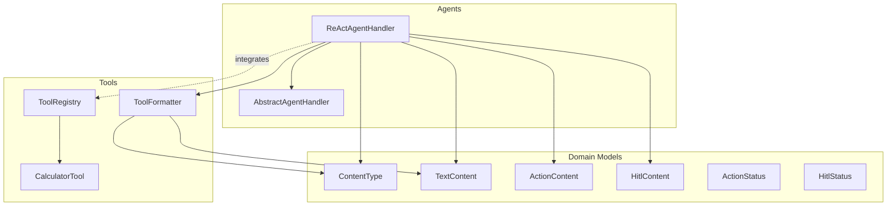
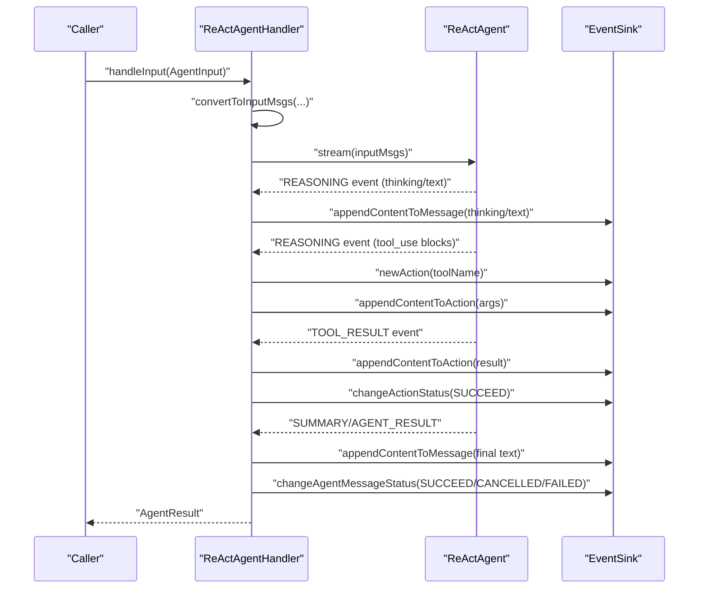
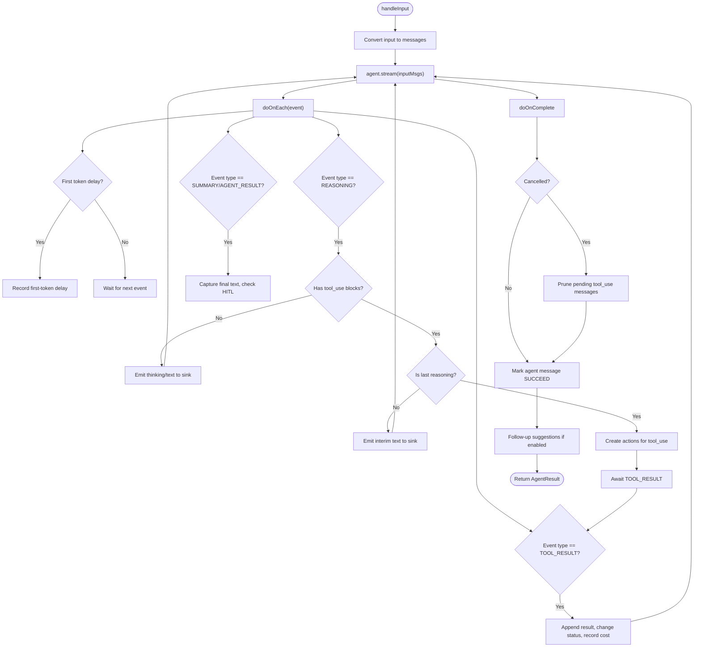
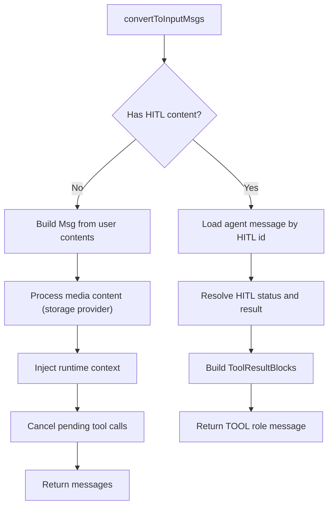
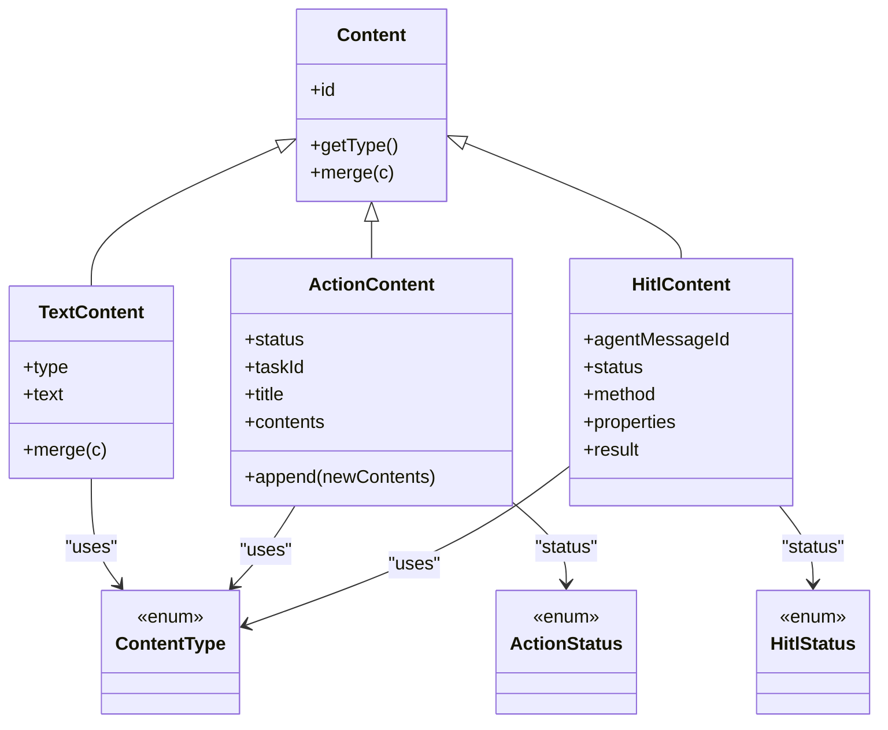
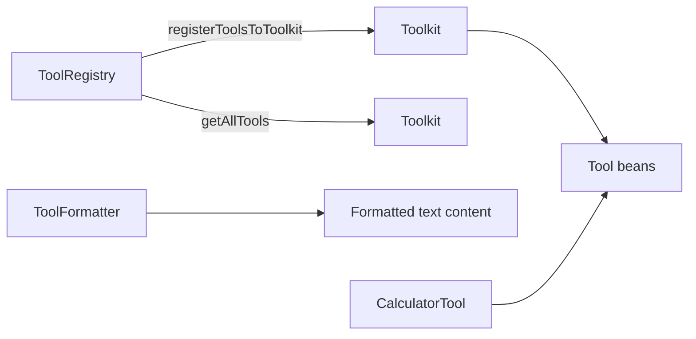
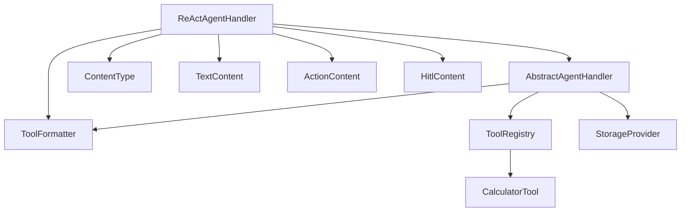

# ReAct Agent Architecture

<cite>
**Referenced Files in This Document**
- [ReActAgentHandler.java](file://backend_java/core/src/main/java/com/aliyun/tam/x/tron/core/agents/ReActAgentHandler.java)
- [AbstractAgentHandler.java](file://backend_java/core/src/main/java/com/aliyun/tam/x/tron/core/agents/AbstractAgentHandler.java)
- [AgentHandler.java](file://backend_java/core/src/main/java/com/aliyun/tam/x/tron/core/agents/AgentHandler.java)
- [Content.java](file://backend_java/core/src/main/java/com/aliyun/tam/x/tron/core/domain/models/contents/Content.java)
- [TextContent.java](file://backend_java/core/src/main/java/com/aliyun/tam/x/tron/core/domain/models/contents/TextContent.java)
- [ActionContent.java](file://backend_java/core/src/main/java/com/aliyun/tam/x/tron/core/domain/models/contents/ActionContent.java)
- [HitlContent.java](file://backend_java/core/src/main/java/com/aliyun/tam/x/tron/core/domain/models/contents/HitlContent.java)
- [ContentType.java](file://backend_java/core/src/main/java/com/aliyun/tam/x/tron/core/domain/models/contents/ContentType.java)
- [ActionStatus.java](file://backend_java/core/src/main/java/com/aliyun/tam/x/tron/core/domain/models/contents/ActionStatus.java)
- [HitlStatus.java](file://backend_java/core/src/main/java/com/aliyun/tam/x/tron/core/domain/models/contents/HitlStatus.java)
- [ToolFormatter.java](file://backend_java/core/src/main/java/com/aliyun/tam/x/tron/core/tools/ToolFormatter.java)
- [CalculatorTool.java](file://backend_java/core/src/main/java/com/aliyun/tam/x/tron/core/tools/CalculatorTool.java)
- [ToolRegistry.java](file://backend_java/core/src/main/java/com/aliyun/tam/x/tron/core/tools/ToolRegistry.java)
</cite>

## Table of Contents
1. [Introduction](#introduction)
2. [Project Structure](#project-structure)
3. [Core Components](#core-components)
4. [Architecture Overview](#architecture-overview)
5. [Detailed Component Analysis](#detailed-component-analysis)
6. [Dependency Analysis](#dependency-analysis)
7. [Performance Considerations](#performance-considerations)
8. [Troubleshooting Guide](#troubleshooting-guide)
9. [Conclusion](#conclusion)

## Introduction
This document explains the ReAct (Reasoning-Act) agent architecture implemented in the backend Java module. It focuses on how the ReAct pattern is realized via an event-driven, stream-based processing pipeline that alternates between a reasoning phase (thinking and planning) and an action phase (tool execution). The document also covers the integration with AgentScope’s ReActAgent framework, the event streaming mechanism, performance metrics collection, cancellation handling, and debugging techniques for understanding agent decision-making.

## Project Structure
The ReAct implementation centers around a small set of cohesive components:
- An agent handler that orchestrates the ReAct loop and streams events to an event sink
- A base handler that converts user input into a structured message stream and manages HITL and media content
- Domain content models that represent thinking, text, actions, and human-in-the-loop interactions
- Tool formatting and registration utilities that translate tool calls and results into user-visible content

**Diagram sources**
- [ReActAgentHandler.java:41-256](file://backend_java/core/src/main/java/com/aliyun/tam/x/tron/core/agents/ReActAgentHandler.java#L41-L256)
- [AbstractAgentHandler.java:54-431](file://backend_java/core/src/main/java/com/aliyun/tam/x/tron/core/agents/AbstractAgentHandler.java#L54-L431)
- [Content.java:38-148](file://backend_java/core/src/main/java/com/aliyun/tam/x/tron/core/domain/models/contents/Content.java#L38-L148)
- [TextContent.java:26-46](file://backend_java/core/src/main/java/com/aliyun/tam/x/tron/core/domain/models/contents/TextContent.java#L26-L46)
- [ActionContent.java:34-78](file://backend_java/core/src/main/java/com/aliyun/tam/x/tron/core/domain/models/contents/ActionContent.java#L34-L78)
- [HitlContent.java:16-38](file://backend_java/core/src/main/java/com/aliyun/tam/x/tron/core/domain/models/contents/HitlContent.java#L16-L38)
- [ContentType.java:26-57](file://backend_java/core/src/main/java/com/aliyun/tam/x/tron/core/domain/models/contents/ContentType.java#L26-L57)
- [ActionStatus.java:26-52](file://backend_java/core/src/main/java/com/aliyun/tam/x/tron/core/domain/models/contents/ActionStatus.java#L26-L52)
- [HitlStatus.java:6-31](file://backend_java/core/src/main/java/com/aliyun/tam/x/tron/core/domain/models/contents/HitlStatus.java#L6-L31)
- [ToolFormatter.java:41-149](file://backend_java/core/src/main/java/com/aliyun/tam/x/tron/core/tools/ToolFormatter.java#L41-L149)
- [ToolRegistry.java:35-77](file://backend_java/core/src/main/java/com/aliyun/tam/x/tron/core/tools/ToolRegistry.java#L35-L77)
- [CalculatorTool.java:30-50](file://backend_java/core/src/main/java/com/aliyun/tam/x/tron/core/tools/CalculatorTool.java#L30-L50)

**Section sources**
- [ReActAgentHandler.java:41-256](file://backend_java/core/src/main/java/com/aliyun/tam/x/tron/core/agents/ReActAgentHandler.java#L41-L256)
- [AbstractAgentHandler.java:54-431](file://backend_java/core/src/main/java/com/aliyun/tam/x/tron/core/agents/AbstractAgentHandler.java#L54-L431)
- [Content.java:38-148](file://backend_java/core/src/main/java/com/aliyun/tam/x/tron/core/domain/models/contents/Content.java#L38-L148)

## Core Components
- ReActAgentHandler: Implements the ReAct loop over AgentScope’s ReActAgent. Streams events, updates metrics, handles cancellation, and emits content blocks to the event sink.
- AbstractAgentHandler: Converts user input into message blocks, supports HITL flows, renames sessions, appends follow-up suggestions, and injects runtime context.
- Content models: Define the semantic types for text, thinking, actions, and HITL interactions.
- ToolFormatter: Translates tool names, arguments, and results into user-friendly text content.
- ToolRegistry and CalculatorTool: Register and expose tools to the ReAct agent.

**Section sources**
- [ReActAgentHandler.java:41-256](file://backend_java/core/src/main/java/com/aliyun/tam/x/tron/core/agents/ReActAgentHandler.java#L41-L256)
- [AbstractAgentHandler.java:54-431](file://backend_java/core/src/main/java/com/aliyun/tam/x/tron/core/agents/AbstractAgentHandler.java#L54-L431)
- [ToolFormatter.java:41-149](file://backend_java/core/src/main/java/com/aliyun/tam/x/tron/core/tools/ToolFormatter.java#L41-L149)
- [ToolRegistry.java:35-77](file://backend_java/core/src/main/java/com/aliyun/tam/x/tron/core/tools/ToolRegistry.java#L35-L77)
- [CalculatorTool.java:30-50](file://backend_java/core/src/main/java/com/aliyun/tam/x/tron/core/tools/CalculatorTool.java#L30-L50)

## Architecture Overview
The ReAct loop is event-driven and stream-based:
- The handler initiates a stream from the ReAct agent with the prepared input messages.
- Events are categorized into reasoning, tool use, and tool result phases.
- Thinking and text content are streamed to the event sink as the agent reasons.
- Tool use blocks trigger action creation and argument logging; tool result blocks finalize actions and record costs.
- Cancellation interrupts the agent and cleans up pending tool calls.
- Metrics are collected for first-token delay, first-response-token delay, and total end-to-end latency.

**Diagram sources**
- [ReActAgentHandler.java:64-239](file://backend_java/core/src/main/java/com/aliyun/tam/x/tron/core/agents/ReActAgentHandler.java#L64-L239)
- [AbstractAgentHandler.java:191-278](file://backend_java/core/src/main/java/com/aliyun/tam/x/tron/core/agents/AbstractAgentHandler.java#L191-L278)

## Detailed Component Analysis

### ReActAgentHandler: Stream-Based Reasoning-Act Loop
- Initialization: Stores a reference to the AgentScope ReActAgent and registers a question tool if enabled.
- Input conversion: Delegates to AbstractAgentHandler to transform user input into a message stream, including runtime context injection and media content normalization.
- Streaming: Subscribes to the agent’s event stream and reacts to:
  - REASONING events: Emits thinking blocks and interim text; when tool_use blocks appear, transitions to action phase.
  - TOOL_RESULT events: Completes actions by appending results and marking status succeeded.
  - SUMMARY/AGENT_RESULT events: Captures final response text and checks for HITL presence.
- Metrics: Records first-token delay and first-response-token delay upon receiving initial tokens and subsequent text respectively.
- Cancellation: Interrupts the agent and prunes assistant messages containing tool_use blocks; marks the agent message as cancelled.
- Completion: Updates agent message status to succeed or failed, triggers follow-up suggestions when appropriate.

**Diagram sources**
- [ReActAgentHandler.java:64-239](file://backend_java/core/src/main/java/com/aliyun/tam/x/tron/core/agents/ReActAgentHandler.java#L64-L239)

**Section sources**
- [ReActAgentHandler.java:47-256](file://backend_java/core/src/main/java/com/aliyun/tam/x/tron/core/agents/ReActAgentHandler.java#L47-L256)

### AbstractAgentHandler: Input Conversion and HITL Support
- Question tool registration: Adds a “question” tool schema to the agent toolkit when enabled.
- Input conversion: Builds a message from user content, processes media content via storage provider, injects runtime context, and cancels pending tool calls left by prior interrupted turns.
- HITL handling: Resolves user-provided HITL responses into tool result blocks and replays them to the agent.
- Session renaming and suggestions: Optionally renames the session and suggests follow-ups after successful completion.

**Diagram sources**
- [AbstractAgentHandler.java:191-278](file://backend_java/core/src/main/java/com/aliyun/tam/x/tron/core/agents/AbstractAgentHandler.java#L191-L278)

**Section sources**
- [AbstractAgentHandler.java:167-172](file://backend_java/core/src/main/java/com/aliyun/tam/x/tron/core/agents/AbstractAgentHandler.java#L167-L172)
- [AbstractAgentHandler.java:191-278](file://backend_java/core/src/main/java/com/aliyun/tam/x/tron/core/agents/AbstractAgentHandler.java#L191-L278)

### Content Models: Thinking, Actions, and HITL
- ContentType: Enumerates TEXT, THINKING, IMAGE, VIDEO, AUDIO, HITL, TASK, ACTION.
- TextContent: Represents textual content with merge semantics for incremental streaming.
- ActionContent: Represents a single tool invocation with nested contents and lifecycle timestamps.
- HitlContent: Represents a human-in-the-loop interaction with status and properties.
- ActionStatus and HitlStatus: Enumerated statuses for actions and HITL items.

**Diagram sources**
- [Content.java:38-148](file://backend_java/core/src/main/java/com/aliyun/tam/x/tron/core/domain/models/contents/Content.java#L38-L148)
- [TextContent.java:26-46](file://backend_java/core/src/main/java/com/aliyun/tam/x/tron/core/domain/models/contents/TextContent.java#L26-L46)
- [ActionContent.java:34-78](file://backend_java/core/src/main/java/com/aliyun/tam/x/tron/core/domain/models/contents/ActionContent.java#L34-L78)
- [HitlContent.java:16-38](file://backend_java/core/src/main/java/com/aliyun/tam/x/tron/core/domain/models/contents/HitlContent.java#L16-L38)
- [ContentType.java:26-57](file://backend_java/core/src/main/java/com/aliyun/tam/x/tron/core/domain/models/contents/ContentType.java#L26-L57)
- [ActionStatus.java:26-52](file://backend_java/core/src/main/java/com/aliyun/tam/x/tron/core/domain/models/contents/ActionStatus.java#L26-L52)
- [HitlStatus.java:6-31](file://backend_java/core/src/main/java/com/aliyun/tam/x/tron/core/domain/models/contents/HitlStatus.java#L6-L31)

**Section sources**
- [ContentType.java:26-57](file://backend_java/core/src/main/java/com/aliyun/tam/x/tron/core/domain/models/contents/ContentType.java#L26-L57)
- [TextContent.java:26-46](file://backend_java/core/src/main/java/com/aliyun/tam/x/tron/core/domain/models/contents/TextContent.java#L26-L46)
- [ActionContent.java:34-78](file://backend_java/core/src/main/java/com/aliyun/tam/x/tron/core/domain/models/contents/ActionContent.java#L34-L78)
- [HitlContent.java:16-38](file://backend_java/core/src/main/java/com/aliyun/tam/x/tron/core/domain/models/contents/HitlContent.java#L16-L38)

### Tool Formatting and Registration
- ToolFormatter: Provides localized names for tools, formats arguments for readability, and formats tool results into user-facing text blocks.
- ToolRegistry: Scans beans for @Tool annotations and registers selected tools into the agent toolkit.
- CalculatorTool: Demonstrates a simple tool annotated for use by the ReAct agent.

**Diagram sources**
- [ToolRegistry.java:52-77](file://backend_java/core/src/main/java/com/aliyun/tam/x/tron/core/tools/ToolRegistry.java#L52-L77)
- [ToolFormatter.java:53-147](file://backend_java/core/src/main/java/com/aliyun/tam/x/tron/core/tools/ToolFormatter.java#L53-L147)
- [CalculatorTool.java:30-50](file://backend_java/core/src/main/java/com/aliyun/tam/x/tron/core/tools/CalculatorTool.java#L30-L50)

**Section sources**
- [ToolFormatter.java:41-149](file://backend_java/core/src/main/java/com/aliyun/tam/x/tron/core/tools/ToolFormatter.java#L41-L149)
- [ToolRegistry.java:35-77](file://backend_java/core/src/main/java/com/aliyun/tam/x/tron/core/tools/ToolRegistry.java#L35-L77)
- [CalculatorTool.java:30-50](file://backend_java/core/src/main/java/com/aliyun/tam/x/tron/core/tools/CalculatorTool.java#L30-L50)

## Dependency Analysis
- ReActAgentHandler depends on:
  - AgentScope ReActAgent for streaming events
  - AbstractAgentHandler for input conversion and HITL handling
  - ToolFormatter for formatting tool names, arguments, and results
  - Content models for representing thinking, text, actions, and HITL
- AbstractAgentHandler depends on:
  - ToolRegistry and ToolFormatter for tool integration
  - Renaming and suggestion services for UX enhancements
  - Storage provider for media content normalization
- ToolRegistry depends on Spring bean scanning and AgentScope toolkit.

**Diagram sources**
- [ReActAgentHandler.java:41-256](file://backend_java/core/src/main/java/com/aliyun/tam/x/tron/core/agents/ReActAgentHandler.java#L41-L256)
- [AbstractAgentHandler.java:54-431](file://backend_java/core/src/main/java/com/aliyun/tam/x/tron/core/agents/AbstractAgentHandler.java#L54-L431)
- [ToolRegistry.java:35-77](file://backend_java/core/src/main/java/com/aliyun/tam/x/tron/core/tools/ToolRegistry.java#L35-L77)
- [CalculatorTool.java:30-50](file://backend_java/core/src/main/java/com/aliyun/tam/x/tron/core/tools/CalculatorTool.java#L30-L50)

**Section sources**
- [ReActAgentHandler.java:41-256](file://backend_java/core/src/main/java/com/aliyun/tam/x/tron/core/agents/ReActAgentHandler.java#L41-L256)
- [AbstractAgentHandler.java:54-431](file://backend_java/core/src/main/java/com/aliyun/tam/x/tron/core/agents/AbstractAgentHandler.java#L54-L431)
- [ToolRegistry.java:35-77](file://backend_java/core/src/main/java/com/aliyun/tam/x/tron/core/tools/ToolRegistry.java#L35-L77)

## Performance Considerations
- Metrics collection:
  - First-Token Time (TTFT): recorded when the first reasoning token arrives.
  - First-Response-Token Time (response TTFT): recorded when the first response token arrives.
  - End-to-End Latency: measured via a Micrometer timer wrapper around the handler.
- Observability:
  - OpenTelemetry tracing is attached to the handler invocation.
  - Metrics are tagged with agent identifiers for per-agent profiling.
- Recommendations:
  - Prefer streaming responses to reduce perceived latency.
  - Minimize tool execution overhead by batching and caching where appropriate.
  - Monitor action durations to identify slow tools.

**Section sources**
- [AgentHandler.java:81-149](file://backend_java/core/src/main/java/com/aliyun/tam/x/tron/core/agents/AgentHandler.java#L81-L149)
- [ReActAgentHandler.java:76-239](file://backend_java/core/src/main/java/com/aliyun/tam/x/tron/core/agents/ReActAgentHandler.java#L76-L239)

## Troubleshooting Guide
- Understanding the reasoning loop:
  - Inspect thinking blocks emitted during REASONING events to see the agent’s internal thought process.
  - Confirm interim text emissions for partial responses.
- Action tracking:
  - Verify action creation when tool_use blocks are present.
  - Ensure TOOL_RESULT events are received to complete actions and update status.
- Cancellation:
  - If a user cancels, confirm that pending tool_use messages are pruned and the agent message status is set to cancelled.
- HITL flows:
  - Validate that HITL content is properly resolved into tool result blocks and replayed to the agent.
- Tool formatting:
  - Confirm tool names and arguments are formatted correctly for readability.
  - Ensure tool results are transformed into user-facing text content.

**Section sources**
- [ReActAgentHandler.java:112-204](file://backend_java/core/src/main/java/com/aliyun/tam/x/tron/core/agents/ReActAgentHandler.java#L112-L204)
- [AbstractAgentHandler.java:240-277](file://backend_java/core/src/main/java/com/aliyun/tam/x/tron/core/agents/AbstractAgentHandler.java#L240-L277)
- [ToolFormatter.java:53-147](file://backend_java/core/src/main/java/com/aliyun/tam/x/tron/core/tools/ToolFormatter.java#L53-L147)

## Conclusion
The ReAct agent architecture in this codebase cleanly separates concerns between input preparation, event streaming, and content emission. The stream-based design enables real-time reasoning and action execution, while the event sink provides a robust mechanism for incremental updates. With built-in metrics, cancellation handling, and HITL support, the system offers a production-ready foundation for reasoning agents that alternate between thinking and acting.