# Admin Management System

<cite>
**Referenced Files in This Document**
- [AdminController.java](file://backend_java/api/src/main/java/com/aliyun/tam/x/tron/api/AdminController.java)
- [AdminService.java](file://backend_java/core/src/main/java/com/aliyun/tam/x/tron/core/domain/service/AdminService.java)
- [AdminRepository.java](file://backend_java/core/src/main/java/com/aliyun/tam/x/tron/core/domain/repository/AdminRepository.java)
- [MysqlAdminRepository.java](file://backend_java/core/src/main/java/com/aliyun/tam/x/tron/core/domain/repository/mysql/MysqlAdminRepository.java)
- [AdminUserDO.java](file://backend_java/infra/src/main/java/com/aliyun/tam/x/tron/infra/dal/dataobject/AdminUserDO.java)
- [AdminUserMapper.java](file://backend_java/infra/src/main/java/com/aliyun/tam/x/tron/infra/dal/mapper/AdminUserMapper.java)
- [AdminDTO.java](file://backend_java/api/src/main/java/com/aliyun/tam/x/tron/api/dto/AdminDTO.java)
- [CreateAdminRequest.java](file://backend_java/api/src/main/java/com/aliyun/tam/x/tron/api/request/CreateAdminRequest.java)
- [UpdateAdminRequest.java](file://backend_java/api/src/main/java/com/aliyun/tam/x/tron/api/request/UpdateAdminRequest.java)
- [AuthController.java](file://backend_java/api/src/main/java/com/aliyun/tam/x/tron/api/AuthController.java)
- [JwtAuthInterceptor.java](file://backend_java/api/src/main/java/com/aliyun/tam/x/tron/api/auth/JwtAuthInterceptor.java)
- [JwtUtils.java](file://backend_java/api/src/main/java/com/aliyun/tam/x/tron/api/auth/JwtUtils.java)
- [LoginRequest.java](file://backend_java/api/src/main/java/com/aliyun/tam/x/tron/api/request/LoginRequest.java)
- [EncryptUtils.java](file://backend_java/utils/src/main/java/com/aliyun/tam/x/tron/utils/encrypt/EncryptUtils.java)
- [AdminAuthApiTest.java](file://backend_java/bootstrap/src/test/java/com/aliyun/tam/x/tron/api/AdminAuthApiTest.java)
- [BaseApiTest.java](file://backend_java/bootstrap/src/test/java/com/aliyun/tam/x/tron/api/BaseApiTest.java)
- [BaseFuncTest.java](file://backend_java/bootstrap/src/test/java/com/aliyun/tam/x/tron/BaseFuncTest.java)
- [TestApplication.java](file://backend_java/bootstrap/src/test/java/com/aliyun/tam/x/tron/TestApplication.java)
- [application.yaml](file://backend_java/bootstrap/src/main/resources/application.yaml)
- [init.sql](file://backend_java/bootstrap/src/main/resources/schema/init.sql)
</cite>

## Update Summary
**Changes Made**
- Enhanced API authentication testing with comprehensive JWT token generation and validation
- Improved database initialization process with embedded MariaDB testing framework
- Streamlined admin user management workflows with automated setup procedures
- Added comprehensive test coverage for authentication flows and authorization middleware
- Implemented structured error handling and validation for authentication endpoints

## Table of Contents
1. [Introduction](#introduction)
2. [System Architecture](#system-architecture)
3. [Core Components](#core-components)
4. [Authentication and Authorization](#authentication-and-authorization)
5. [Testing Framework](#testing-framework)
6. [Data Model](#data-model)
7. [API Endpoints](#api-endpoints)
8. [Security Implementation](#security-implementation)
9. [Initialization Process](#initialization-process)
10. [Error Handling](#error-handling)
11. [Configuration Management](#configuration-management)
12. [Troubleshooting Guide](#troubleshooting-guide)
13. [Conclusion](#conclusion)

## Introduction

The Admin Management System is a comprehensive administrative interface built for the Tron One Agent platform. This system provides centralized management capabilities for administrative users, including user creation, authentication, password management, and system administration functions. The system follows modern Spring Boot architecture patterns with clear separation of concerns across presentation, business logic, and data access layers.

The platform supports secure JWT-based authentication, AES encryption for sensitive data, and provides RESTful APIs for administrative operations. It integrates seamlessly with the broader Tron One Agent ecosystem while maintaining strict security boundaries for administrative functions. Recent enhancements include comprehensive API authentication testing with JWT token generation and improved database initialization processes.

## System Architecture

The Admin Management System follows a layered architecture pattern with clear separation between presentation, business logic, and data persistence layers:

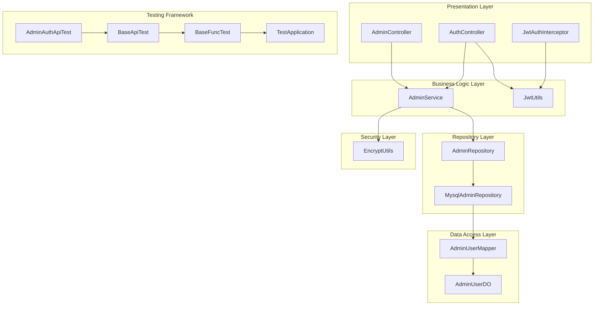

**Diagram sources**
- [AdminController.java:34-87](file://backend_java/api/src/main/java/com/aliyun/tam/x/tron/api/AdminController.java#L34-L87)
- [AdminService.java:31-98](file://backend_java/core/src/main/java/com/aliyun/tam/x/tron/core/domain/service/AdminService.java#L31-L98)
- [MysqlAdminRepository.java:32-77](file://backend_java/core/src/main/java/com/aliyun/tam/x/tron/core/domain/repository/mysql/MysqlAdminRepository.java#L32-L77)
- [AdminAuthApiTest.java:34-227](file://backend_java/bootstrap/src/test/java/com/aliyun/tam/x/tron/api/AdminAuthApiTest.java#L34-L227)
- [BaseApiTest.java:33-79](file://backend_java/bootstrap/src/test/java/com/aliyun/tam/x/tron/api/BaseApiTest.java#L33-L79)
- [BaseFuncTest.java:56-226](file://backend_java/bootstrap/src/test/java/com/aliyun/tam/x/tron/BaseFuncTest.java#L56-L226)

The architecture demonstrates clean separation of concerns with the controller layer handling HTTP requests, the service layer implementing business logic, and the repository layer managing data persistence through MyBatis-Plus. The testing framework provides comprehensive coverage for authentication flows and authorization middleware.

**Section sources**
- [AdminController.java:34-87](file://backend_java/api/src/main/java/com/aliyun/tam/x/tron/api/AdminController.java#L34-L87)
- [AdminService.java:31-98](file://backend_java/core/src/main/java/com/aliyun/tam/x/tron/core/domain/service/AdminService.java#L31-L98)

## Core Components

### Admin Controller

The Admin Controller serves as the primary interface for administrative operations, providing RESTful endpoints for managing admin users:

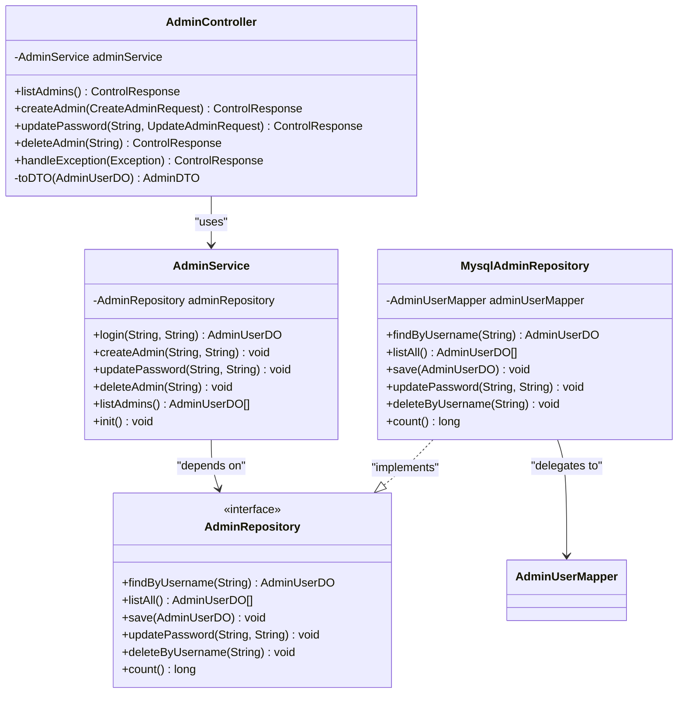

**Diagram sources**
- [AdminController.java:39-86](file://backend_java/api/src/main/java/com/aliyun/tam/x/tron/api/AdminController.java#L39-L86)
- [AdminService.java:35-98](file://backend_java/core/src/main/java/com/aliyun/tam/x/tron/core/domain/service/AdminService.java#L35-L98)
- [AdminRepository.java:24-37](file://backend_java/core/src/main/java/com/aliyun/tam/x/tron/core/domain/repository/AdminRepository.java#L24-L37)
- [MysqlAdminRepository.java:35-77](file://backend_java/core/src/main/java/com/aliyun/tam/x/tron/core/domain/repository/mysql/MysqlAdminRepository.java#L35-L77)

The controller implements CRUD operations for admin users with comprehensive validation and error handling mechanisms.

**Section sources**
- [AdminController.java:39-86](file://backend_java/api/src/main/java/com/aliyun/tam/x/tron/api/AdminController.java#L39-L86)
- [AdminService.java:35-98](file://backend_java/core/src/main/java/com/aliyun/tam/x/tron/core/domain/service/AdminService.java#L35-L98)

### Authentication Controller

The authentication system provides secure login and user information retrieval capabilities:

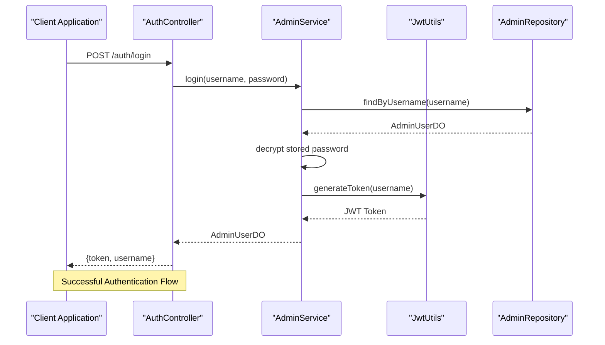

**Diagram sources**
- [AuthController.java:61-66](file://backend_java/api/src/main/java/com/aliyun/tam/x/tron/api/AuthController.java#L61-L66)
- [AdminService.java:53-63](file://backend_java/core/src/main/java/com/aliyun/tam/x/tron/core/domain/service/AdminService.java#L53-L63)
- [JwtUtils.java:51-60](file://backend_java/api/src/main/java/com/aliyun/tam/x/tron/api/auth/JwtUtils.java#L51-L60)

**Section sources**
- [AuthController.java:40-73](file://backend_java/api/src/main/java/com/aliyun/tam/x/tron/api/AuthController.java#L40-L73)
- [JwtAuthInterceptor.java:35-62](file://backend_java/api/src/main/java/com/aliyun/tam/x/tron/api/auth/JwtAuthInterceptor.java#L35-L62)

## Authentication and Authorization

### JWT Token Management

The system implements robust JWT-based authentication with configurable expiration and secure key management:

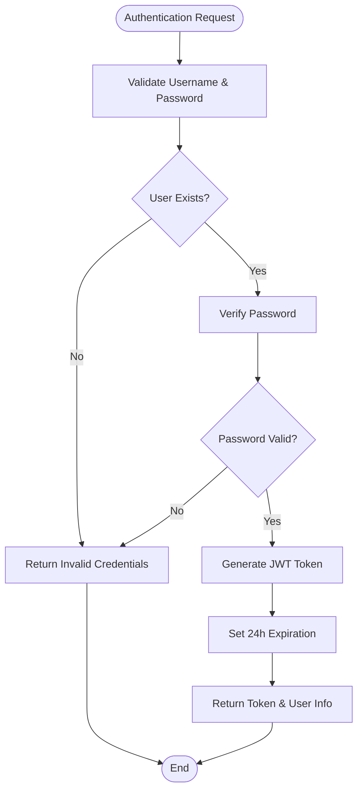

**Diagram sources**
- [AdminService.java:53-63](file://backend_java/core/src/main/java/com/aliyun/tam/x/tron/core/domain/service/AdminService.java#L53-L63)
- [JwtUtils.java:51-60](file://backend_java/api/src/main/java/com/aliyun/tam/x/tron/api/auth/JwtUtils.java#L51-L60)

The authentication system includes automatic initialization of default admin credentials and comprehensive error handling for invalid operations.

**Section sources**
- [JwtUtils.java:35-75](file://backend_java/api/src/main/java/com/aliyun/tam/x/tron/api/auth/JwtUtils.java#L35-L75)
- [JwtAuthInterceptor.java:35-62](file://backend_java/api/src/main/java/com/aliyun/tam/x/tron/api/auth/JwtAuthInterceptor.java#L35-L62)

### Authorization Middleware

The JWT authentication interceptor provides seamless authorization for protected endpoints:

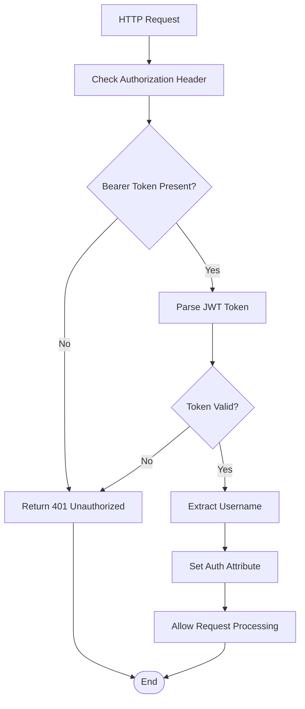

**Diagram sources**
- [JwtAuthInterceptor.java:44-61](file://backend_java/api/src/main/java/com/aliyun/tam/x/tron/api/auth/JwtAuthInterceptor.java#L44-L61)

**Section sources**
- [JwtAuthInterceptor.java:35-62](file://backend_java/api/src/main/java/com/aliyun/tam/x/tron/api/auth/JwtAuthInterceptor.java#L35-L62)

## Testing Framework

### Comprehensive API Authentication Testing

The system includes a sophisticated testing framework that validates JWT token generation and authentication flows:

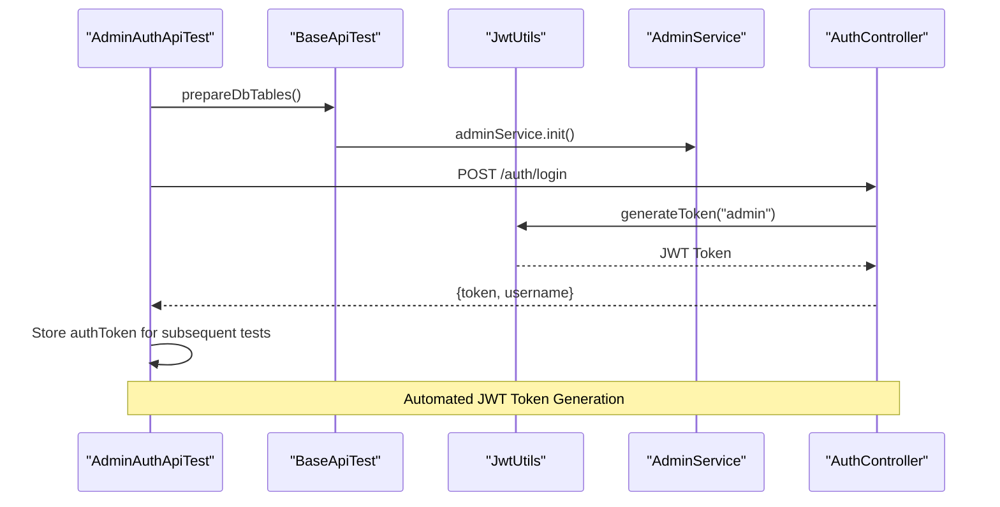

**Diagram sources**
- [AdminAuthApiTest.java:41-65](file://backend_java/bootstrap/src/test/java/com/aliyun/tam/x/tron/api/AdminAuthApiTest.java#L41-L65)
- [BaseApiTest.java:41-61](file://backend_java/bootstrap/src/test/java/com/aliyun/tam/x/tron/api/BaseApiTest.java#L41-L61)
- [AdminService.java:41-51](file://backend_java/core/src/main/java/com/aliyun/tam/x/tron/core/domain/service/AdminService.java#L41-L51)

The testing framework provides comprehensive coverage for authentication flows, authorization middleware, and admin user management operations.

**Section sources**
- [AdminAuthApiTest.java:34-227](file://backend_java/bootstrap/src/test/java/com/aliyun/tam/x/tron/api/AdminAuthApiTest.java#L34-L227)
- [BaseApiTest.java:33-79](file://backend_java/bootstrap/src/test/java/com/aliyun/tam/x/tron/api/BaseApiTest.java#L33-L79)

### Embedded Database Testing Infrastructure

The testing framework utilizes an embedded MariaDB instance for reliable database initialization:

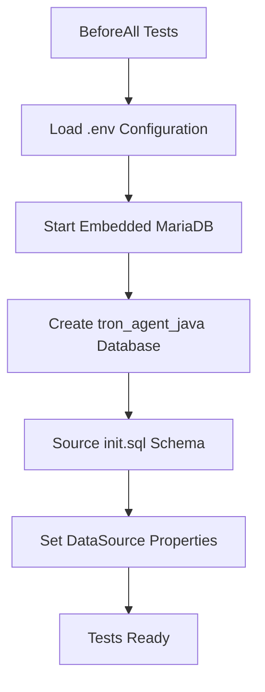

**Diagram sources**
- [BaseFuncTest.java:58-86](file://backend_java/bootstrap/src/test/java/com/aliyun/tam/x/tron/BaseFuncTest.java#L58-L86)
- [init.sql:207-219](file://backend_java/bootstrap/src/main/resources/schema/init.sql#L207-L219)

**Section sources**
- [BaseFuncTest.java:56-226](file://backend_java/bootstrap/src/test/java/com/aliyun/tam/x/tron/BaseFuncTest.java#L56-L226)
- [init.sql:1-219](file://backend_java/bootstrap/src/main/resources/schema/init.sql#L1-L219)

## Data Model

### Admin User Entity

The Admin User entity represents the core data structure for administrative accounts:

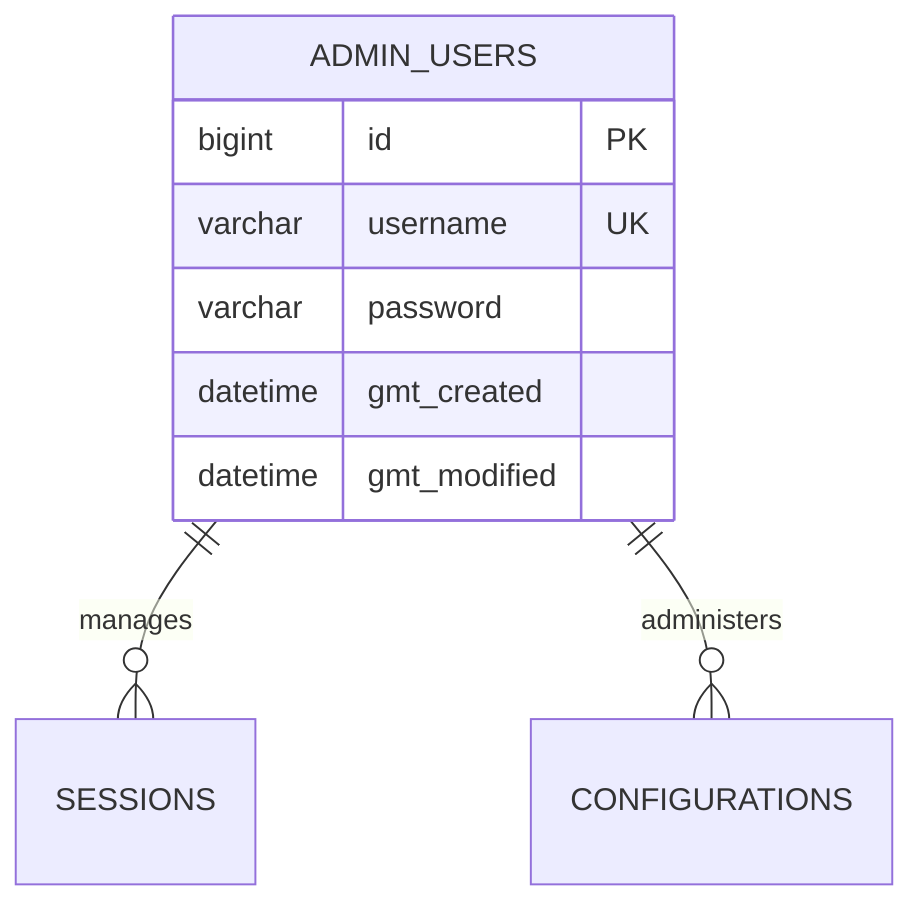

**Diagram sources**
- [AdminUserDO.java:27-43](file://backend_java/infra/src/main/java/com/aliyun/tam/x/tron/infra/dal/dataobject/AdminUserDO.java#L27-L43)

The data model follows MyBatis-Plus conventions with automatic timestamp management and proper indexing for the username field.

**Section sources**
- [AdminUserDO.java:18-43](file://backend_java/infra/src/main/java/com/aliyun/tam/x/tron/infra/dal/dataobject/AdminUserDO.java#L18-L43)

## API Endpoints

### Administrative Operations

The system provides comprehensive RESTful endpoints for administrative management:

| Endpoint | Method | Description | Authentication Required |
|----------|--------|-------------|------------------------|
| `/control/admins` | GET | List all admin users | Yes |
| `/control/admins` | POST | Create new admin user | Yes |
| `/control/admins/{username}` | PUT | Update admin password | Yes |
| `/control/admins/{username}` | DELETE | Delete admin user | Yes |
| `/auth/login` | POST | Authenticate admin user | No |
| `/auth/me` | GET | Get current user info | Yes |

### Request Validation

Each endpoint includes comprehensive request validation:

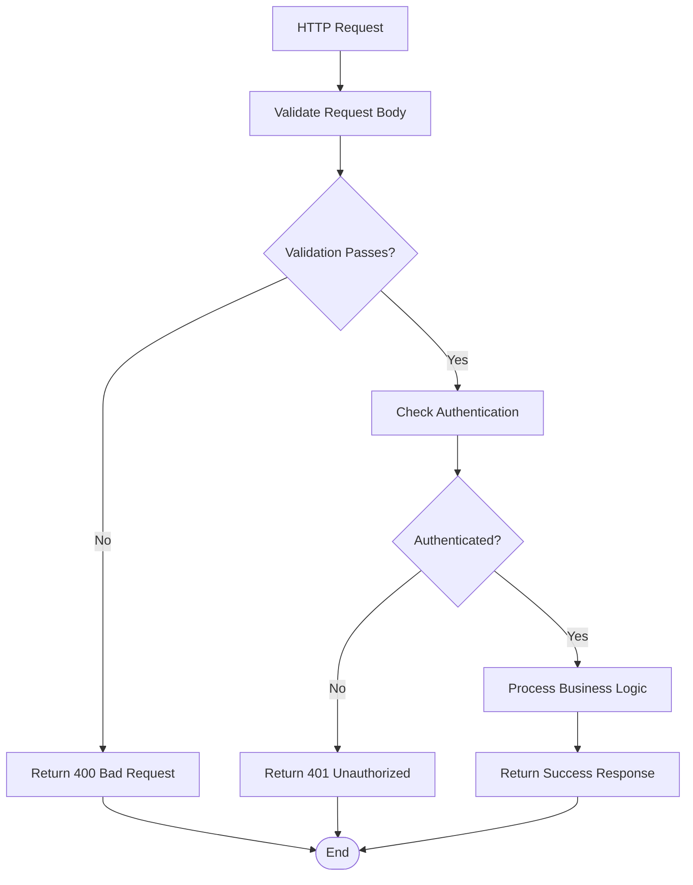

**Diagram sources**
- [CreateAdminRequest.java:25-33](file://backend_java/api/src/main/java/com/aliyun/tam/x/tron/api/request/CreateAdminRequest.java#L25-L33)
- [UpdateAdminRequest.java:24-28](file://backend_java/api/src/main/java/com/aliyun/tam/x/tron/api/request/UpdateAdminRequest.java#L24-L28)
- [LoginRequest.java:24-31](file://backend_java/api/src/main/java/com/aliyun/tam/x/tron/api/request/LoginRequest.java#L24-L31)

**Section sources**
- [AdminController.java:52-78](file://backend_java/api/src/main/java/com/aliyun/tam/x/tron/api/AdminController.java#L52-L78)
- [AuthController.java:61-72](file://backend_java/api/src/main/java/com/aliyun/tam/x/tron/api/AuthController.java#L61-L72)

## Security Implementation

### Encryption Framework

The system implements AES encryption for sensitive data storage with configurable encryption keys:

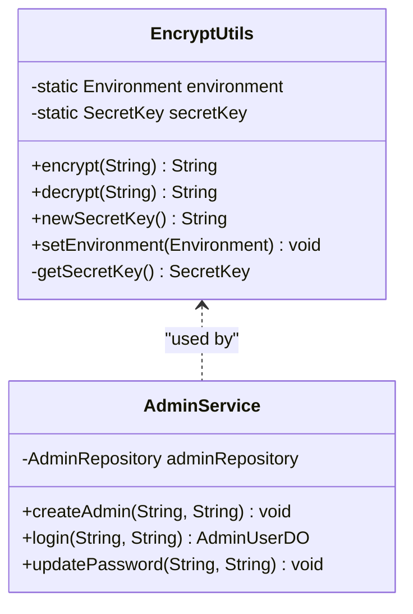

**Diagram sources**
- [EncryptUtils.java:31-90](file://backend_java/utils/src/main/java/com/aliyun/tam/x/tron/utils/encrypt/EncryptUtils.java#L31-L90)
- [AdminService.java:22-74](file://backend_java/core/src/main/java/com/aliyun/tam/x/tron/core/domain/service/AdminService.java#L22-L74)

The encryption system supports dynamic key generation and secure key management through environment configuration.

**Section sources**
- [EncryptUtils.java:31-90](file://backend_java/utils/src/main/java/com/aliyun/tam/x/tron/utils/encrypt/EncryptUtils.java#L31-L90)
- [AdminService.java:41-51](file://backend_java/core/src/main/java/com/aliyun/tam/x/tron/core/domain/service/AdminService.java#L41-L51)

### Default Administrator Setup

The system automatically initializes with a default administrator account for initial setup:

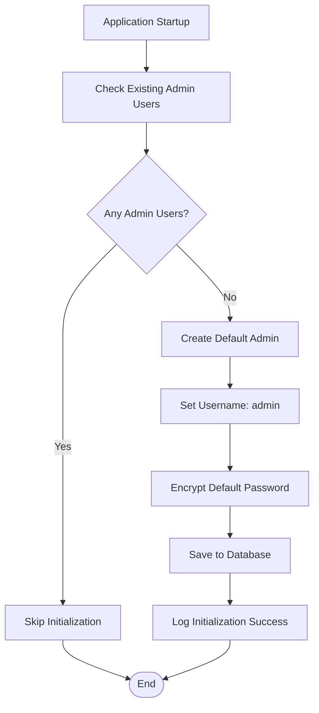

**Diagram sources**
- [AdminService.java:41-51](file://backend_java/core/src/main/java/com/aliyun/tam/x/tron/core/domain/service/AdminService.java#L41-L51)

**Section sources**
- [AdminService.java:37-51](file://backend_java/core/src/main/java/com/aliyun/tam/x/tron/core/domain/service/AdminService.java#L37-L51)

## Initialization Process

### System Bootstrap

The admin management system initializes through a structured bootstrap process:

1. **Database Connection**: Establishes connection to MySQL database using configured credentials
2. **Entity Registration**: Registers AdminUserDO entity with MyBatis-Plus
3. **Encryption Setup**: Initializes AES encryption with environment-provided key
4. **Default Admin Creation**: Creates default admin user if none exists
5. **API Endpoint Registration**: Registers all administrative REST endpoints

The initialization process ensures system readiness and provides fallback mechanisms for disaster recovery scenarios.

**Section sources**
- [AdminService.java:41-51](file://backend_java/core/src/main/java/com/aliyun/tam/x/tron/core/domain/service/AdminService.java#L41-L51)
- [application.yaml:9-13](file://backend_java/bootstrap/src/main/resources/application.yaml#L9-L13)

### Test Database Initialization

The testing framework provides streamlined database initialization:

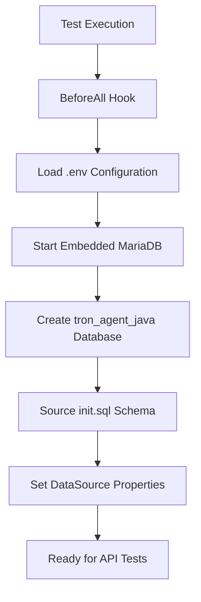

**Diagram sources**
- [BaseFuncTest.java:58-86](file://backend_java/bootstrap/src/test/java/com/aliyun/tam/x/tron/BaseFuncTest.java#L58-L86)
- [init.sql:207-219](file://backend_java/bootstrap/src/main/resources/schema/init.sql#L207-L219)

**Section sources**
- [BaseFuncTest.java:56-226](file://backend_java/bootstrap/src/test/java/com/aliyun/tam/x/tron/BaseFuncTest.java#L56-L226)
- [init.sql:1-219](file://backend_java/bootstrap/src/main/resources/schema/init.sql#L1-L219)

## Error Handling

### Comprehensive Error Management

The system implements structured error handling across all layers:

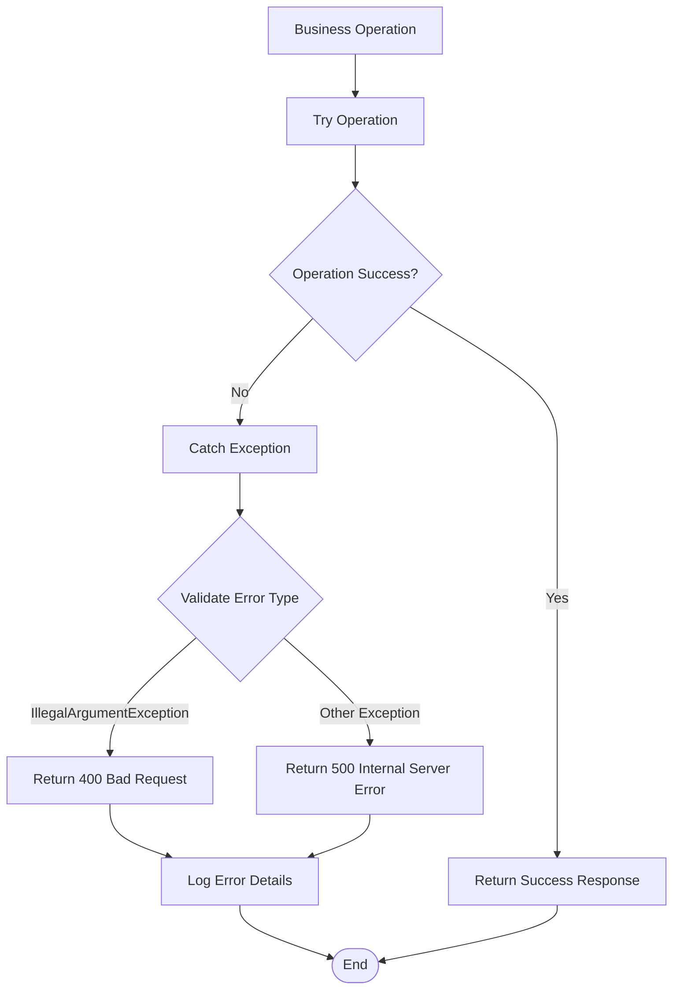

**Diagram sources**
- [AdminController.java:43-50](file://backend_java/api/src/main/java/com/aliyun/tam/x/tron/api/AdminController.java#L43-L50)
- [AuthController.java:52-59](file://backend_java/api/src/main/java/com/aliyun/tam/x/tron/api/AuthController.java#L52-L59)

**Section sources**
- [AdminController.java:43-50](file://backend_java/api/src/main/java/com/aliyun/tam/x/tron/api/AdminController.java#L43-L50)
- [AuthController.java:52-59](file://backend_java/api/src/main/java/com/aliyun/tam/x/tron/api/AuthController.java#L52-L59)

## Configuration Management

### Environment-Based Configuration

The system supports flexible configuration through environment variables:

| Configuration Key | Description | Default Value |
|-------------------|-------------|---------------|
| `DB_HOST` | Database hostname | localhost |
| `DB_PORT` | Database port | 3306 |
| `DB_NAME` | Database name | tron_agent_java |
| `DB_USER` | Database username | root |
| `TRON_ENCRYPT_KEY` | AES encryption key | Generated automatically |
| `DASHSCOPE_API_KEY` | AI service API key | Empty |
| `OSS_ENDPOINT` | Object storage endpoint | Empty |

**Section sources**
- [application.yaml:9-51](file://backend_java/bootstrap/src/main/resources/application.yaml#L9-L51)

## Troubleshooting Guide

### Common Issues and Solutions

**Authentication Failures**
- Verify JWT token format and expiration
- Check encryption key configuration
- Confirm admin user credentials exist in database

**Database Connection Problems**
- Validate MySQL server availability
- Check network connectivity to database host
- Verify database credentials and permissions

**Encryption Issues**
- Ensure TRON_ENCRYPT_KEY environment variable is properly set
- Verify AES key length and format
- Check for proper key encoding

**API Endpoint Errors**
- Confirm proper HTTP method usage
- Validate request payload structure
- Check authentication header format

**Test Framework Issues**
- Verify embedded MariaDB is running on available port
- Check .env file loading and configuration
- Ensure init.sql schema is properly sourced

**Section sources**
- [JwtAuthInterceptor.java:44-61](file://backend_java/api/src/main/java/com/aliyun/tam/x/tron/api/auth/JwtAuthInterceptor.java#L44-L61)
- [EncryptUtils.java:42-51](file://backend_java/utils/src/main/java/com/aliyun/tam/x/tron/utils/encrypt/EncryptUtils.java#L42-L51)

## Conclusion

The Admin Management System provides a robust, secure, and scalable foundation for administrative operations within the Tron One Agent platform. The system's architecture emphasizes security, maintainability, and extensibility while providing comprehensive administrative capabilities.

Recent enhancements include comprehensive API authentication testing with JWT token generation, improved database initialization processes with embedded MariaDB testing infrastructure, and streamlined admin user management workflows with automated setup procedures. These improvements ensure reliable testing, secure authentication, and efficient development workflows.

Key strengths include:
- **Security-First Design**: AES encryption, JWT authentication, and comprehensive validation
- **Clean Architecture**: Clear separation of concerns across multiple layers
- **RESTful API Design**: Consistent and predictable endpoint behavior
- **Automatic Initialization**: Zero-configuration setup with sensible defaults
- **Comprehensive Error Handling**: Structured error management across all layers
- **Robust Testing Framework**: Comprehensive authentication testing with JWT token generation
- **Embedded Database Testing**: Reliable test environment with automated schema initialization

The system is well-positioned for production deployment and can be extended to support additional administrative features as requirements evolve.