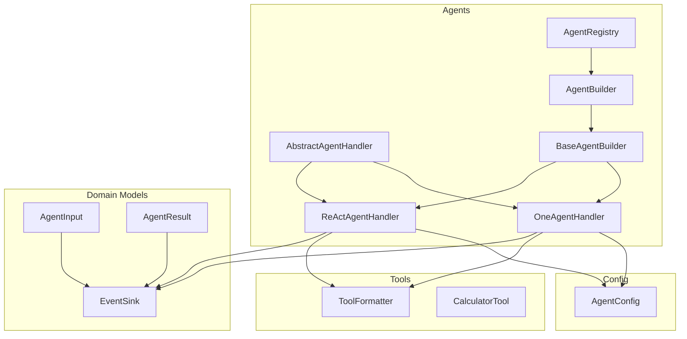
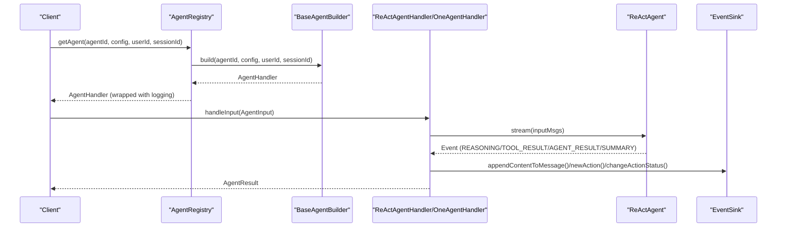
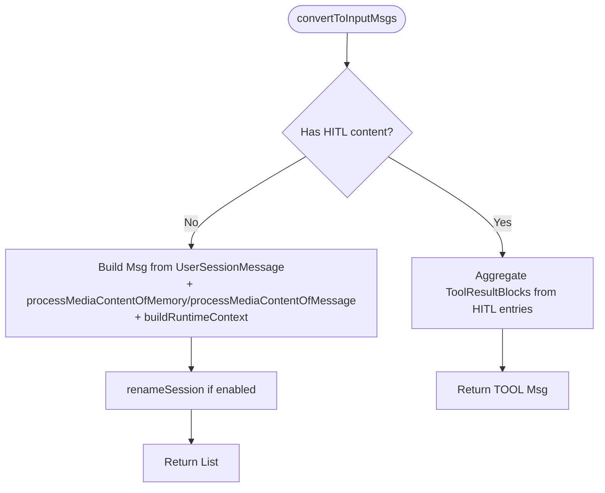
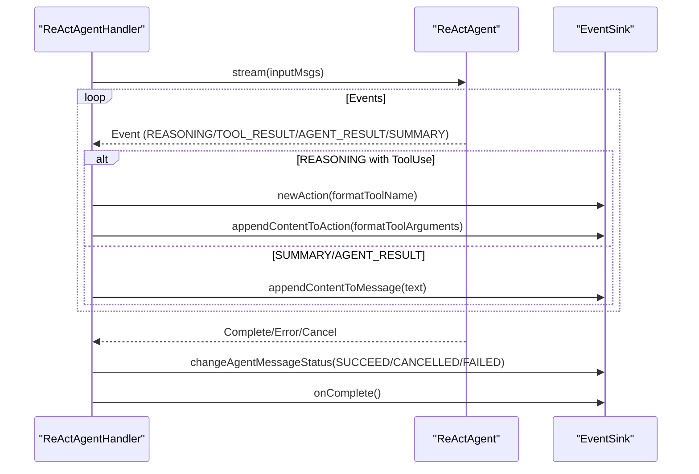
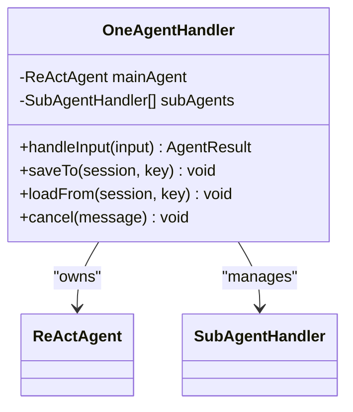
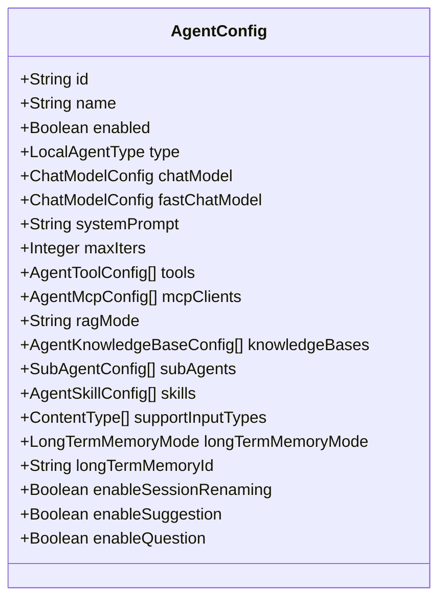
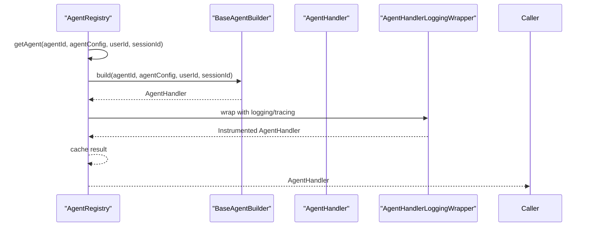
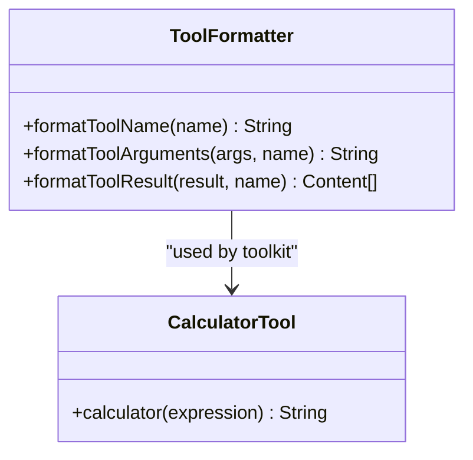
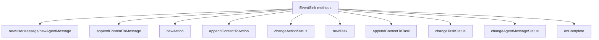
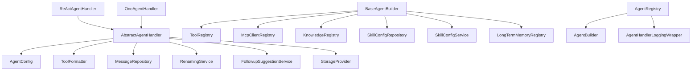

# AgentScope Integration

<cite>
**Referenced Files in This Document**
- [AbstractAgentHandler.java](file://backend_java/core/src/main/java/com/aliyun/tam/x/tron/core/agents/AbstractAgentHandler.java)
- [ReActAgentHandler.java](file://backend_java/core/src/main/java/com/aliyun/tam/x/tron/core/agents/ReActAgentHandler.java)
- [OneAgentHandler.java](file://backend_java/core/src/main/java/com/aliyun/tam/x/tron/core/agents/one/OneAgentHandler.java)
- [AgentHandler.java](file://backend_java/core/src/main/java/com/aliyun/tam/x/tron/core/agents/AgentHandler.java)
- [AgentBuilder.java](file://backend_java/core/src/main/java/com/aliyun/tam/x/tron/core/agents/AgentBuilder.java)
- [BaseAgentBuilder.java](file://backend_java/core/src/main/java/com/aliyun/tam/x/tron/core/agents/BaseAgentBuilder.java)
- [AgentRegistry.java](file://backend_java/core/src/main/java/com/aliyun/tam/x/tron/core/agents/AgentRegistry.java)
- [AgentConfig.java](file://backend_java/core/src/main/java/com/aliyun/tam/x/tron/core/config/AgentConfig.java)
- [ToolFormatter.java](file://backend_java/core/src/main/java/com/aliyun/tam/x/tron/core/tools/ToolFormatter.java)
- [CalculatorTool.java](file://backend_java/core/src/main/java/com/aliyun/tam/x/tron/core/tools/CalculatorTool.java)
- [EventSink.java](file://backend_java/core/src/main/java/com/aliyun/tam/x/tron/core/domain/models/events/EventSink.java)
- [AgentInput.java](file://backend_java/core/src/main/java/com/aliyun/tam/x/tron/core/agents/AgentInput.java)
- [AgentResult.java](file://backend_java/core/src/main/java/com/aliyun/tam/x/tron/core/agents/AgentResult.java)
- [SimpleAgentBuilder.java](file://backend_java/core/src/main/java/com/aliyun/tam/x/tron/core/agents/examples/SimpleAgentBuilder.java)
- [OneAgentBuilder.java](file://backend_java/core/src/main/java/com/aliyun/tam/x/tron/core/agents/examples/OneAgentBuilder.java)
</cite>

## Table of Contents
1. [Introduction](#introduction)
2. [Project Structure](#project-structure)
3. [Core Components](#core-components)
4. [Architecture Overview](#architecture-overview)
5. [Detailed Component Analysis](#detailed-component-analysis)
6. [Dependency Analysis](#dependency-analysis)
7. [Performance Considerations](#performance-considerations)
8. [Troubleshooting Guide](#troubleshooting-guide)
9. [Conclusion](#conclusion)
10. [Appendices](#appendices)

## Introduction
This document explains how the Alibaba AgentScope Java framework integrates with the Tron OneAgent backend to enable ReAct agent capabilities and reasoning-action loops. It documents the AgentHandler inheritance hierarchy, base functionality in AbstractAgentHandler, and specialized handlers ReActAgentHandler and OneAgentHandler. It also covers the AgentConfig system for configuring agent behavior, memory settings, and tool integration, along with lifecycle management, state persistence, and event processing. Practical examples and integration patterns with external tools and services are included, alongside performance considerations and best practices for working with the AgentScope framework in the Tron platform.

## Project Structure
The AgentScope integration resides primarily under the core module’s agents, config, tools, and domain models packages. The key areas are:
- Agents: Handler interfaces and implementations, builders, and registry
- Config: Agent configuration and model/tool/memory/knowledge settings
- Tools: Tool registration and formatting utilities
- Domain models: Event sinks and message/event abstractions
- Examples: Ready-to-use builders for ReAct and OneAgent

**Diagram sources**
- [AbstractAgentHandler.java:54-431](file://backend_java/core/src/main/java/com/aliyun/tam/x/tron/core/agents/AbstractAgentHandler.java#L54-L431)
- [ReActAgentHandler.java:41-256](file://backend_java/core/src/main/java/com/aliyun/tam/x/tron/core/agents/ReActAgentHandler.java#L41-L256)
- [OneAgentHandler.java:47-289](file://backend_java/core/src/main/java/com/aliyun/tam/x/tron/core/agents/one/OneAgentHandler.java#L47-L289)
- [AgentBuilder.java:23-34](file://backend_java/core/src/main/java/com/aliyun/tam/x/tron/core/agents/AgentBuilder.java#L23-L34)
- [BaseAgentBuilder.java:74-414](file://backend_java/core/src/main/java/com/aliyun/tam/x/tron/core/agents/BaseAgentBuilder.java#L74-L414)
- [AgentRegistry.java:39-99](file://backend_java/core/src/main/java/com/aliyun/tam/x/tron/core/agents/AgentRegistry.java#L39-L99)
- [AgentConfig.java:39-133](file://backend_java/core/src/main/java/com/aliyun/tam/x/tron/core/config/AgentConfig.java#L39-L133)
- [ToolFormatter.java:41-149](file://backend_java/core/src/main/java/com/aliyun/tam/x/tron/core/tools/ToolFormatter.java#L41-L149)
- [CalculatorTool.java:29-50](file://backend_java/core/src/main/java/com/aliyun/tam/x/tron/core/tools/CalculatorTool.java#L29-L50)
- [EventSink.java:42-266](file://backend_java/core/src/main/java/com/aliyun/tam/x/tron/core/domain/models/events/EventSink.java#L42-L266)
- [AgentInput.java:16-30](file://backend_java/core/src/main/java/com/aliyun/tam/x/tron/core/agents/AgentInput.java#L16-L30)
- [AgentResult.java:36-84](file://backend_java/core/src/main/java/com/aliyun/tam/x/tron/core/agents/AgentResult.java#L36-L84)

**Section sources**
- [AbstractAgentHandler.java:54-431](file://backend_java/core/src/main/java/com/aliyun/tam/x/tron/core/agents/AbstractAgentHandler.java#L54-L431)
- [AgentRegistry.java:39-99](file://backend_java/core/src/main/java/com/aliyun/tam/x/tron/core/agents/AgentRegistry.java#L39-L99)

## Core Components
- AbstractAgentHandler: Provides shared ReAct agent infrastructure, including input conversion, media content processing, runtime context injection, question tool registration, session renaming, follow-up suggestions, and fast chat model access.
- ReActAgentHandler: Specialized handler for single ReAct agent with streaming event processing, tool invocation tracking, HITL (Human-in-the-loop) question handling, and cancellation support.
- OneAgentHandler: Orchestrates a main ReAct agent with optional sub-agents, aggregates tool usage and tasks, and manages lifecycle and status updates.
- AgentConfig: Central configuration for agent identity, type, models, tools, MCP clients, knowledge bases, RAG mode, long-term memory, input support, and feature toggles.
- BaseAgentBuilder: Constructs ReActAgent instances with configured models, toolkits, skills, knowledge bases, and optional long-term memory; builds OneAgent with sub-agents.
- AgentRegistry: Caches and instantiates agent handlers per user/session with logging wrapper instrumentation.
- ToolFormatter: Normalizes tool names and formats arguments/results for UI presentation.
- EventSink: Publishes session events for messages, actions, tasks, and statuses; coordinates persistence and UI updates.

**Section sources**
- [AbstractAgentHandler.java:54-431](file://backend_java/core/src/main/java/com/aliyun/tam/x/tron/core/agents/AbstractAgentHandler.java#L54-L431)
- [ReActAgentHandler.java:41-256](file://backend_java/core/src/main/java/com/aliyun/tam/x/tron/core/agents/ReActAgentHandler.java#L41-L256)
- [OneAgentHandler.java:47-289](file://backend_java/core/src/main/java/com/aliyun/tam/x/tron/core/agents/one/OneAgentHandler.java#L47-L289)
- [AgentConfig.java:39-133](file://backend_java/core/src/main/java/com/aliyun/tam/x/tron/core/config/AgentConfig.java#L39-L133)
- [BaseAgentBuilder.java:74-414](file://backend_java/core/src/main/java/com/aliyun/tam/x/tron/core/agents/BaseAgentBuilder.java#L74-L414)
- [AgentRegistry.java:39-99](file://backend_java/core/src/main/java/com/aliyun/tam/x/tron/core/agents/AgentRegistry.java#L39-L99)
- [ToolFormatter.java:41-149](file://backend_java/core/src/main/java/com/aliyun/tam/x/tron/core/tools/ToolFormatter.java#L41-L149)
- [EventSink.java:42-266](file://backend_java/core/src/main/java/com/aliyun/tam/x/tron/core/domain/models/events/EventSink.java#L42-L266)

## Architecture Overview
The AgentScope integration follows a layered architecture:
- Builder layer constructs ReAct agents with models, toolkits, skills, and knowledge.
- Handler layer encapsulates agent execution, streaming events, and state transitions.
- Registry layer manages agent instantiation and caching.
- Tools and formatters bridge AgentScope tool schemas to Tron’s UI and storage.
- EventSink publishes structured events for message/action/task updates.

**Diagram sources**
- [AgentRegistry.java:74-93](file://backend_java/core/src/main/java/com/aliyun/tam/x/tron/core/agents/AgentRegistry.java#L74-L93)
- [BaseAgentBuilder.java:194-302](file://backend_java/core/src/main/java/com/aliyun/tam/x/tron/core/agents/BaseAgentBuilder.java#L194-L302)
- [ReActAgentHandler.java:64-239](file://backend_java/core/src/main/java/com/aliyun/tam/x/tron/core/agents/ReActAgentHandler.java#L64-L239)
- [OneAgentHandler.java:74-272](file://backend_java/core/src/main/java/com/aliyun/tam/x/tron/core/agents/one/OneAgentHandler.java#L74-L272)
- [EventSink.java:101-130](file://backend_java/core/src/main/java/com/aliyun/tam/x/tron/core/domain/models/events/EventSink.java#L101-L130)

## Detailed Component Analysis

### AbstractAgentHandler: Base Functionality
- Input conversion: Converts user messages to AgentScope messages, processes media content via storage provider, injects runtime context, and supports Human-in-the-loop (HITL) scenarios.
- Question tool: Registers a schema for interactive questions when enabled.
- Session services: Renames sessions and suggests follow-ups using dedicated services.
- Model access: Provides a fast chat model fallback for low-latency operations.

**Diagram sources**
- [AbstractAgentHandler.java:191-278](file://backend_java/core/src/main/java/com/aliyun/tam/x/tron/core/agents/AbstractAgentHandler.java#L191-L278)

**Section sources**
- [AbstractAgentHandler.java:54-431](file://backend_java/core/src/main/java/com/aliyun/tam/x/tron/core/agents/AbstractAgentHandler.java#L54-L431)

### ReActAgentHandler: Single-Agent Reasoning-Action Loop
- Streams AgentScope events and translates them into Tron UI updates via EventSink.
- Tracks tool usage, formats tool arguments/results, and records action costs.
- Supports HITL by emitting pending questions and updating statuses accordingly.
- Handles cancellation by interrupting the agent and trimming residual assistant messages.

**Diagram sources**
- [ReActAgentHandler.java:64-239](file://backend_java/core/src/main/java/com/aliyun/tam/x/tron/core/agents/ReActAgentHandler.java#L64-L239)
- [ToolFormatter.java:53-100](file://backend_java/core/src/main/java/com/aliyun/tam/x/tron/core/tools/ToolFormatter.java#L53-L100)
- [EventSink.java:202-256](file://backend_java/core/src/main/java/com/aliyun/tam/x/tron/core/domain/models/events/EventSink.java#L202-L256)

**Section sources**
- [ReActAgentHandler.java:41-256](file://backend_java/core/src/main/java/com/aliyun/tam/x/tron/core/agents/ReActAgentHandler.java#L41-L256)

### OneAgentHandler: Multi-Agent Orchestration
- Builds a main ReAct agent and registers sub-agents (local or A2A) with shared toolkits.
- Aggregates executed tasks from sub-agents and merges them into the result.
- Applies similar event processing and status management as ReActAgentHandler.

**Diagram sources**
- [OneAgentHandler.java:47-289](file://backend_java/core/src/main/java/com/aliyun/tam/x/tron/core/agents/one/OneAgentHandler.java#L47-L289)

**Section sources**
- [OneAgentHandler.java:47-289](file://backend_java/core/src/main/java/com/aliyun/tam/x/tron/core/agents/one/OneAgentHandler.java#L47-L289)

### AgentConfig: Agent Behavior and Integration Settings
- Identity and type: id, name, enabled flag, and local agent type (ReAct/One).
- Models: primary and fast chat models with provider-specific configurations.
- Prompting: system prompt and iteration limits.
- Tools and MCP: tool schemas and MCP client registrations.
- Knowledge and RAG: knowledge base configs and RAG mode selection.
- Long-term memory: memory mode and identifier.
- Input support and toggles: supported input types, session renaming, suggestions, and question tool enablement.

**Diagram sources**
- [AgentConfig.java:39-133](file://backend_java/core/src/main/java/com/aliyun/tam/x/tron/core/config/AgentConfig.java#L39-L133)

**Section sources**
- [AgentConfig.java:39-133](file://backend_java/core/src/main/java/com/aliyun/tam/x/tron/core/config/AgentConfig.java#L39-L133)

### BaseAgentBuilder and AgentRegistry: Lifecycle and State Persistence
- BaseAgentBuilder:
  - Creates chat models from configuration.
  - Builds toolkits from tools and MCP clients.
  - Assembles skill boxes from configured skills and synchronizes resources.
  - Constructs ReAct agents with memory, RAG, and long-term memory.
  - Builds OneAgent with sub-agents resolved from registry or A2A cards.
- AgentRegistry:
  - Caches agent handlers per agentConfig/userId/sessionId.
  - Wraps handlers with logging and tracing instrumentation.
  - Exposes configuration retrieval and builder discovery.

**Diagram sources**
- [BaseAgentBuilder.java:194-302](file://backend_java/core/src/main/java/com/aliyun/tam/x/tron/core/agents/BaseAgentBuilder.java#L194-L302)
- [AgentRegistry.java:74-93](file://backend_java/core/src/main/java/com/aliyun/tam/x/tron/core/agents/AgentRegistry.java#L74-L93)
- [AgentHandler.java:48-149](file://backend_java/core/src/main/java/com/aliyun/tam/x/tron/core/agents/AgentHandler.java#L48-L149)

**Section sources**
- [BaseAgentBuilder.java:74-414](file://backend_java/core/src/main/java/com/aliyun/tam/x/tron/core/agents/BaseAgentBuilder.java#L74-L414)
- [AgentRegistry.java:39-99](file://backend_java/core/src/main/java/com/aliyun/tam/x/tron/core/agents/AgentRegistry.java#L39-L99)
- [AgentHandler.java:35-149](file://backend_java/core/src/main/java/com/aliyun/tam/x/tron/core/agents/AgentHandler.java#L35-L149)

### Tool Integration and Formatting
- ToolFormatter normalizes tool names and formats arguments/results for UI rendering, with special handling for web search, knowledge retrieval, shell commands, and file operations.
- CalculatorTool demonstrates a Spring-annotated tool compatible with AgentScope toolkits.

**Diagram sources**
- [ToolFormatter.java:41-149](file://backend_java/core/src/main/java/com/aliyun/tam/x/tron/core/tools/ToolFormatter.java#L41-L149)
- [CalculatorTool.java:29-50](file://backend_java/core/src/main/java/com/aliyun/tam/x/tron/core/tools/CalculatorTool.java#L29-L50)

**Section sources**
- [ToolFormatter.java:41-149](file://backend_java/core/src/main/java/com/aliyun/tam/x/tron/core/tools/ToolFormatter.java#L41-L149)
- [CalculatorTool.java:29-50](file://backend_java/core/src/main/java/com/aliyun/tam/x/tron/core/tools/CalculatorTool.java#L29-L50)

### Event Processing and State Management
- EventSink defines methods to create messages, actions, tasks, and update statuses; it emits structured events for persistence and UI.
- Handlers update message status and content, track tool usage, and record usage metrics.

**Diagram sources**
- [EventSink.java:67-265](file://backend_java/core/src/main/java/com/aliyun/tam/x/tron/core/domain/models/events/EventSink.java#L67-L265)

**Section sources**
- [EventSink.java:42-266](file://backend_java/core/src/main/java/com/aliyun/tam/x/tron/core/domain/models/events/EventSink.java#L42-L266)

## Dependency Analysis
- AbstractAgentHandler depends on:
  - AgentConfig for behavior and feature toggles
  - ToolFormatter for UI-friendly tool names and arguments
  - MessageRepository and Renaming/Followup services for session management
  - StorageProvider for media content URL transformation
- ReActAgentHandler and OneAgentHandler depend on AbstractAgentHandler and share:
  - EventSink for publishing updates
  - ToolFormatter for consistent tool presentation
  - AgentScope ReActAgent for reasoning and tool execution
- BaseAgentBuilder depends on:
  - ToolRegistry and McpClientRegistry for tool integration
  - KnowledgeRegistry for RAG knowledge bases
  - SkillConfigRepository and SkillConfigService for skill provisioning
  - LongTermMemoryRegistry for persistent memory
- AgentRegistry depends on:
  - AgentBuilder implementations
  - Tracer for observability

**Diagram sources**
- [AbstractAgentHandler.java:130-144](file://backend_java/core/src/main/java/com/aliyun/tam/x/tron/core/agents/AbstractAgentHandler.java#L130-L144)
- [ReActAgentHandler.java:41-51](file://backend_java/core/src/main/java/com/aliyun/tam/x/tron/core/agents/ReActAgentHandler.java#L41-L51)
- [OneAgentHandler.java:47-61](file://backend_java/core/src/main/java/com/aliyun/tam/x/tron/core/agents/one/OneAgentHandler.java#L47-L61)
- [BaseAgentBuilder.java:146-177](file://backend_java/core/src/main/java/com/aliyun/tam/x/tron/core/agents/BaseAgentBuilder.java#L146-L177)
- [AgentRegistry.java:49-51](file://backend_java/core/src/main/java/com/aliyun/tam/x/tron/core/agents/AgentRegistry.java#L49-L51)

**Section sources**
- [AbstractAgentHandler.java:130-144](file://backend_java/core/src/main/java/com/aliyun/tam/x/tron/core/agents/AbstractAgentHandler.java#L130-L144)
- [BaseAgentBuilder.java:146-177](file://backend_java/core/src/main/java/com/aliyun/tam/x/tron/core/agents/BaseAgentBuilder.java#L146-L177)
- [AgentRegistry.java:49-51](file://backend_java/core/src/main/java/com/aliyun/tam/x/tron/core/agents/AgentRegistry.java#L49-L51)

## Performance Considerations
- Streaming latency metrics:
  - First-token delay and first-response-token delay are recorded and exposed as metrics for end-to-end and response TTFT.
- Cancellation:
  - Handlers interrupt the underlying ReActAgent and trim residual assistant messages to avoid stale tool calls.
- Memory and long-term memory:
  - In-memory and optional long-term memory modes can be selected; long-term memory mode influences persistence behavior.
- Tool formatting overhead:
  - ToolFormatter adds minimal JSON parsing/formatting; keep argument/result sizes reasonable for UI rendering.
- Observability:
  - Logging wrapper instruments spans and timers for end-to-end latency and error tagging.

[No sources needed since this section provides general guidance]

## Troubleshooting Guide
- Agent not enabled:
  - Ensure AgentConfig.enabled is true; otherwise, builders return null.
- Unsupported agent type:
  - Only ReAct and One agent types are supported; other types cause exceptions.
- Tool not found:
  - Verify tool registration via ToolRegistry and AgentToolConfig; ensure MCP clients are registered when needed.
- Skill synchronization failures:
  - Skill provisioning errors are logged; check skill checksums and repository availability.
- Media content URLs:
  - StorageProvider transforms private URLs to public ones; confirm provider configuration.
- Cancellation not taking effect:
  - Ensure cancel(message) is invoked with a valid message; handlers interrupt the agent and trim residual messages.

**Section sources**
- [BaseAgentBuilder.java:202-302](file://backend_java/core/src/main/java/com/aliyun/tam/x/tron/core/agents/BaseAgentBuilder.java#L202-L302)
- [ReActAgentHandler.java:242-254](file://backend_java/core/src/main/java/com/aliyun/tam/x/tron/core/agents/ReActAgentHandler.java#L242-L254)
- [OneAgentHandler.java:275-287](file://backend_java/core/src/main/java/com/aliyun/tam/x/tron/core/agents/one/OneAgentHandler.java#L275-L287)

## Conclusion
The AgentScope integration in Tron OneAgent provides a robust foundation for ReAct-style reasoning-action loops with strong tooling, memory, and orchestration capabilities. AbstractAgentHandler centralizes cross-cutting concerns, while ReActAgentHandler and OneAgentHandler deliver specialized execution semantics. AgentConfig governs behavior and integrations, and BaseAgentBuilder composes the agent stack. AgentRegistry and EventSink ensure lifecycle management and observable event-driven updates. With proper configuration, tool registration, and observability, teams can build scalable, maintainable agents tailored to Tron’s needs.

[No sources needed since this section summarizes without analyzing specific files]

## Appendices

### Practical Examples

- Configure a ReAct agent with tools and MCP:
  - Define AgentConfig with tools and MCP clients; BaseAgentBuilder registers them into the toolkit and builds a ReAct agent.
  - Reference: [SimpleAgentBuilder.java:68-102](file://backend_java/core/src/main/java/com/aliyun/tam/x/tron/core/agents/examples/SimpleAgentBuilder.java#L68-L102), [BaseAgentBuilder.java:214-246](file://backend_java/core/src/main/java/com/aliyun/tam/x/tron/core/agents/BaseAgentBuilder.java#L214-L246)

- Build a OneAgent with sub-agents:
  - Use AgentConfig.subAgents to define local and A2A sub-agents; BaseAgentBuilder resolves and wires them into OneAgentHandler.
  - Reference: [OneAgentBuilder.java:62-71](file://backend_java/core/src/main/java/com/aliyun/tam/x/tron/core/agents/examples/OneAgentBuilder.java#L62-L71), [BaseAgentBuilder.java:278-296](file://backend_java/core/src/main/java/com/aliyun/tam/x/tron/core/agents/BaseAgentBuilder.java#L278-L296)

- Custom tool development:
  - Annotate tools with @Tool and register them via ToolRegistry; use ToolFormatter to normalize names and format outputs.
  - Reference: [CalculatorTool.java:29-50](file://backend_java/core/src/main/java/com/aliyun/tam/x/tron/core/tools/CalculatorTool.java#L29-L50), [ToolFormatter.java:53-76](file://backend_java/core/src/main/java/com/aliyun/tam/x/tron/core/tools/ToolFormatter.java#L53-L76)

- Event-driven UI updates:
  - Handlers emit content, actions, and status changes through EventSink; downstream systems persist and render these events.
  - Reference: [ReActAgentHandler.java:100-204](file://backend_java/core/src/main/java/com/aliyun/tam/x/tron/core/agents/ReActAgentHandler.java#L100-L204), [EventSink.java:101-256](file://backend_java/core/src/main/java/com/aliyun/tam/x/tron/core/domain/models/events/EventSink.java#L101-L256)

### Best Practices
- Prefer fastChatModel for low-latency operations when appropriate.
- Keep system prompts concise and scoped to reduce token usage.
- Enable long-term memory judiciously to balance persistence and performance.
- Use HITL sparingly; ensure question tool parameters are well-defined for clarity.
- Monitor metrics for first-token delays and end-to-end latency; investigate spikes promptly.
- Cache and reuse agent handlers per user/session to reduce cold-start overhead.

[No sources needed since this section provides general guidance]