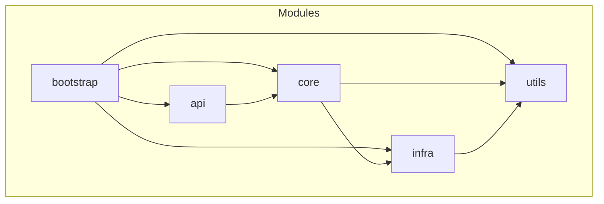
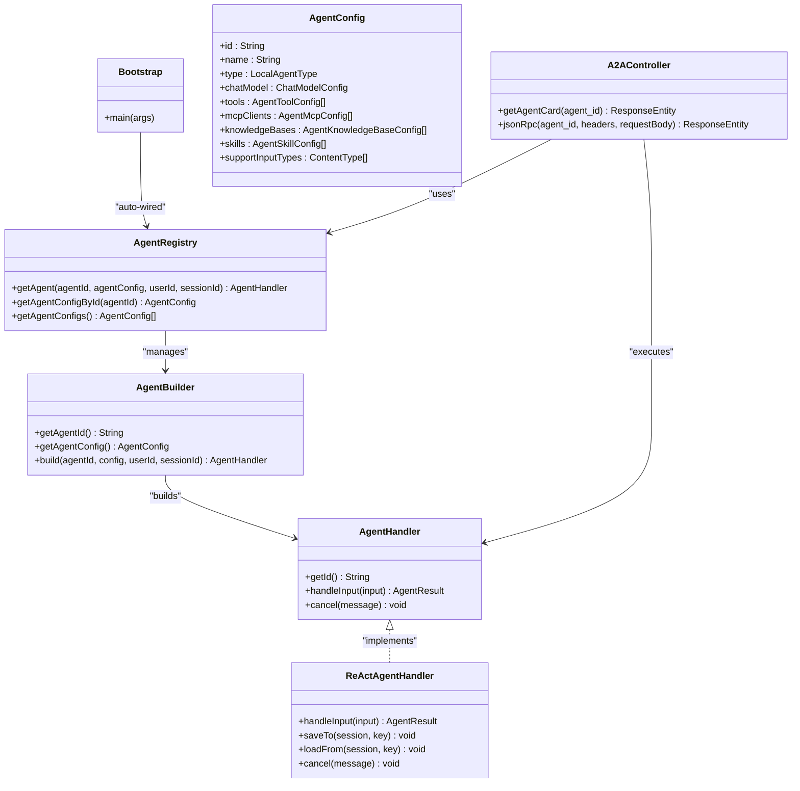
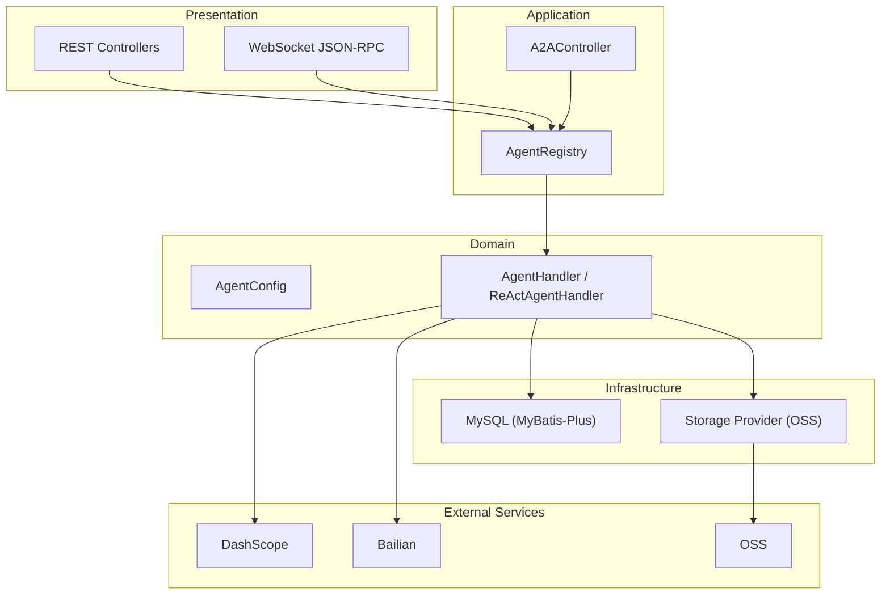
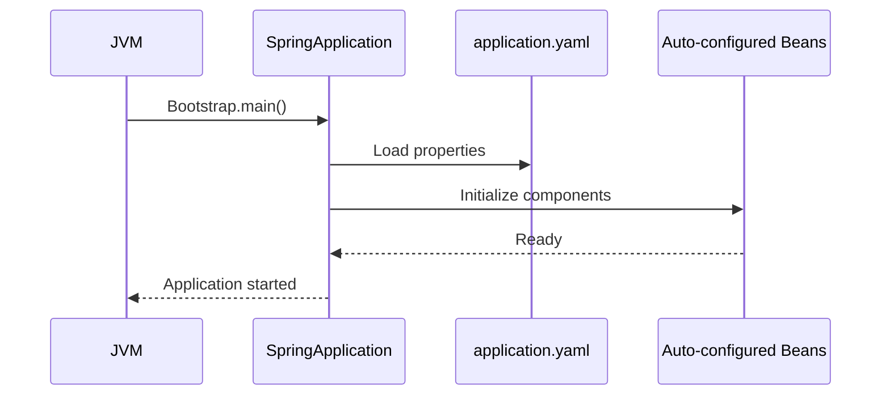
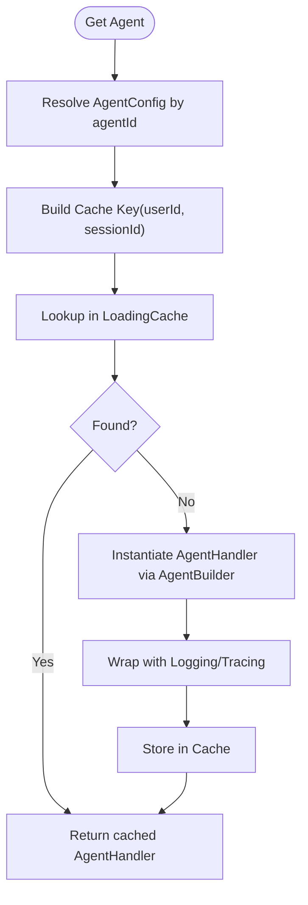
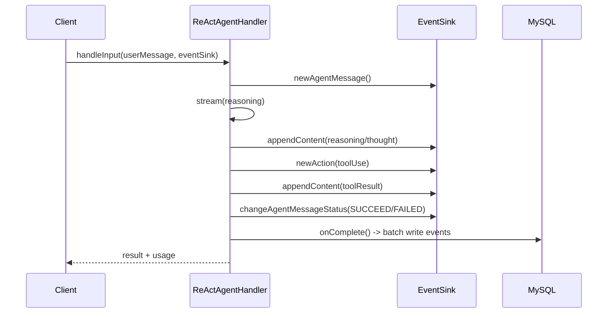
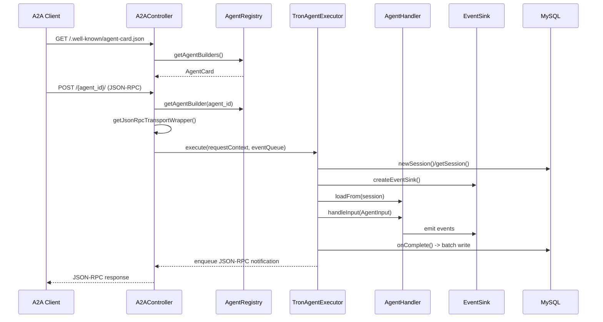
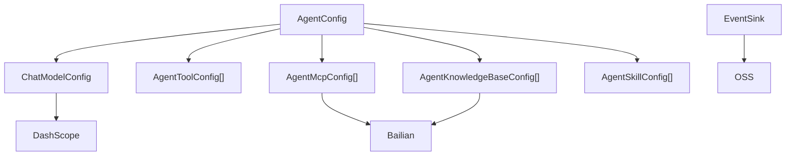
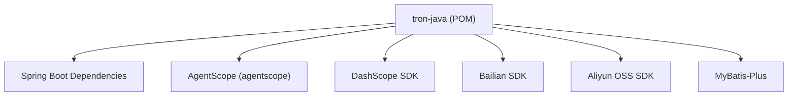
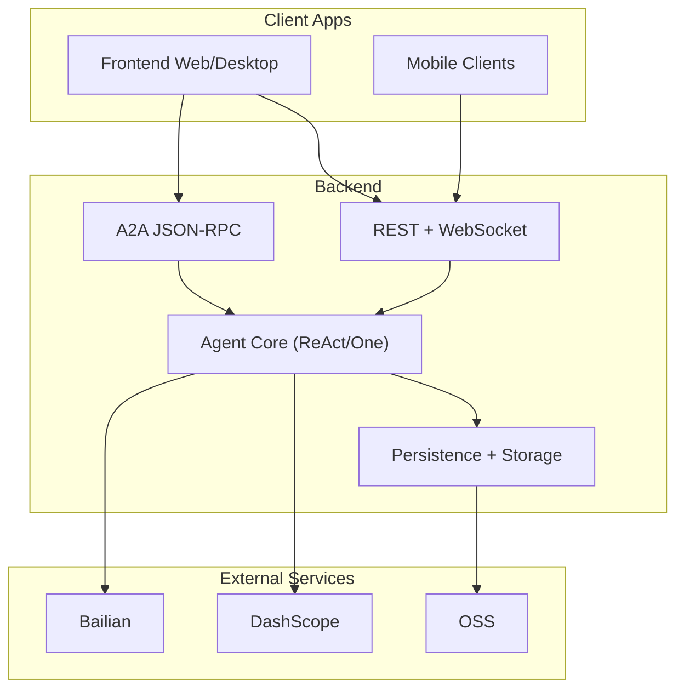

# Backend Architecture

<cite>
**Referenced Files in This Document**
- [Bootstrap.java](file://backend_java/bootstrap/src/main/java/com/aliyun/tam/x/tron/Bootstrap.java)
- [application.yaml](file://backend_java/bootstrap/src/main/resources/application.yaml)
- [pom.xml](file://backend_java/pom.xml)
- [AgentRegistry.java](file://backend_java/core/src/main/java/com/aliyun/tam/x/tron/core/agents/AgentRegistry.java)
- [AgentBuilder.java](file://backend_java/core/src/main/java/com/aliyun/tam/x/tron/core/agents/AgentBuilder.java)
- [AgentHandler.java](file://backend_java/core/src/main/java/com/aliyun/tam/x/tron/core/agents/AgentHandler.java)
- [ReActAgentHandler.java](file://backend_java/core/src/main/java/com/aliyun/tam/x/tron/core/agents/ReActAgentHandler.java)
- [AgentConfig.java](file://backend_java/core/src/main/java/com/aliyun/tam/x/tron/core/config/AgentConfig.java)
- [A2AController.java](file://backend_java/api/src/main/java/com/aliyun/tam/x/tron/api/A2AController.java)
- [README.MD](file://backend_java/README.MD)
- [develop_guide.md](file://docs/en/develop_guide.md)
</cite>

## Table of Contents
1. [Introduction](#introduction)
2. [Project Structure](#project-structure)
3. [Core Components](#core-components)
4. [Architecture Overview](#architecture-overview)
5. [Detailed Component Analysis](#detailed-component-analysis)
6. [Dependency Analysis](#dependency-analysis)
7. [Performance Considerations](#performance-considerations)
8. [Troubleshooting Guide](#troubleshooting-guide)
9. [Conclusion](#conclusion)
10. [Appendices](#appendices)

## Introduction
This document describes the backend architecture of the Tron OneAgent system, a Spring Boot 3.5.9-based AI agent platform. The system is designed around a modular structure with clear separation of concerns across API, core, infrastructure, and utility layers. It integrates Alibaba AgentScope Java framework to enable ReAct agent capabilities and supports dynamic configuration, event sourcing, streaming protocols, and real-time communication. The backend interacts with external services including DashScope, Bailian, and OSS, and is designed for scalability and observability.

## Project Structure
The backend is organized as a Maven multi-module project with the following modules:
- bootstrap: Spring Boot application entrypoint and configuration
- api: REST and WebSocket endpoints for sessions, configuration, debugging, and A2A integration
- core: Agent lifecycle, builders, handlers, configuration, domain models, repositories, tools, RAG, MCP, and utilities
- infra: persistence layer (MyBatis-Plus), data access objects, storage providers, and tracing helpers
- utils: shared utilities (encryption, JSON helpers)

**Diagram sources**
- [pom.xml:11-16](file://backend_java/pom.xml#L11-L16)

**Section sources**
- [pom.xml:11-16](file://backend_java/pom.xml#L11-L16)
- [README.MD:40-52](file://backend_java/README.MD#L40-L52)

## Core Components
This section outlines the primary building blocks of the backend and their responsibilities:
- Bootstrap: Application entrypoint enabling async and scheduling, wiring the Spring Boot application
- AgentRegistry: Central registry for agent builders and cached agent handlers
- AgentBuilder: Contract for constructing agent configurations and handlers
- AgentHandler: Interface for handling user input, emitting events, and managing state
- ReActAgentHandler: Implementation of ReAct agent with streaming, tool use, and HITL support
- AgentConfig: Dynamic configuration model for agents, tools, MCP clients, knowledge bases, and skills
- A2AController: JSON-RPC transport and orchestration for Agent-to-Agent communication

**Diagram sources**
- [Bootstrap.java:25-32](file://backend_java/bootstrap/src/main/java/com/aliyun/tam/x/tron/Bootstrap.java#L25-L32)
- [AgentRegistry.java:39-98](file://backend_java/core/src/main/java/com/aliyun/tam/x/tron/core/agents/AgentRegistry.java#L39-L98)
- [AgentBuilder.java:23-33](file://backend_java/core/src/main/java/com/aliyun/tam/x/tron/core/agents/AgentBuilder.java#L23-L33)
- [AgentHandler.java:35-46](file://backend_java/core/src/main/java/com/aliyun/tam/x/tron/core/agents/AgentHandler.java#L35-L46)
- [ReActAgentHandler.java:41-51](file://backend_java/core/src/main/java/com/aliyun/tam/x/tron/core/agents/ReActAgentHandler.java#L41-L51)
- [AgentConfig.java:39-132](file://backend_java/core/src/main/java/com/aliyun/tam/x/tron/core/config/AgentConfig.java#L39-L132)
- [A2AController.java:67-240](file://backend_java/api/src/main/java/com/aliyun/tam/x/tron/api/A2AController.java#L67-240)

**Section sources**
- [Bootstrap.java:25-32](file://backend_java/bootstrap/src/main/java/com/aliyun/tam/x/tron/Bootstrap.java#L25-L32)
- [AgentRegistry.java:39-98](file://backend_java/core/src/main/java/com/aliyun/tam/x/tron/core/agents/AgentRegistry.java#L39-L98)
- [AgentBuilder.java:23-33](file://backend_java/core/src/main/java/com/aliyun/tam/x/tron/core/agents/AgentBuilder.java#L23-L33)
- [AgentHandler.java:35-46](file://backend_java/core/src/main/java/com/aliyun/tam/x/tron/core/agents/AgentHandler.java#L35-L46)
- [ReActAgentHandler.java:41-51](file://backend_java/core/src/main/java/com/aliyun/tam/x/tron/core/agents/ReActAgentHandler.java#L41-L51)
- [AgentConfig.java:39-132](file://backend_java/core/src/main/java/com/aliyun/tam/x/tron/core/config/AgentConfig.java#L39-L132)
- [A2AController.java:67-240](file://backend_java/api/src/main/java/com/aliyun/tam/x/tron/api/A2AController.java#L67-240)

## Architecture Overview
The backend follows a layered architecture:
- Presentation Layer: REST endpoints and WebSocket JSON-RPC handlers
- Application Layer: Controllers and orchestrators (e.g., A2AController)
- Domain Layer: Agent lifecycle, configuration, and event-driven models
- Infrastructure Layer: Persistence, storage, and external service integrations

**Diagram sources**
- [A2AController.java:67-240](file://backend_java/api/src/main/java/com/aliyun/tam/x/tron/api/A2AController.java#L67-240)
- [AgentRegistry.java:39-98](file://backend_java/core/src/main/java/com/aliyun/tam/x/tron/core/agents/AgentRegistry.java#L39-L98)
- [AgentHandler.java:35-46](file://backend_java/core/src/main/java/com/aliyun/tam/x/tron/core/agents/AgentHandler.java#L35-L46)
- [application.yaml:33-49](file://backend_java/bootstrap/src/main/resources/application.yaml#L33-L49)

**Section sources**
- [README.MD:54-87](file://backend_java/README.MD#L54-L87)
- [develop_guide.md:82-126](file://docs/en/develop_guide.md#L82-L126)
- [application.yaml:33-49](file://backend_java/bootstrap/src/main/resources/application.yaml#L33-L49)

## Detailed Component Analysis

### Bootstrap Application
- Purpose: Initializes the Spring Boot application with async and scheduling enabled
- Responsibilities: Application startup, auto-configuration, and module wiring
- Configuration: Port, context path, datasource, Jackson, multipart limits, and management endpoints

**Diagram sources**
- [Bootstrap.java:25-32](file://backend_java/bootstrap/src/main/java/com/aliyun/tam/x/tron/Bootstrap.java#L25-L32)
- [application.yaml:1-63](file://backend_java/bootstrap/src/main/resources/application.yaml#L1-L63)

**Section sources**
- [Bootstrap.java:25-32](file://backend_java/bootstrap/src/main/java/com/aliyun/tam/x/tron/Bootstrap.java#L25-L32)
- [application.yaml:1-63](file://backend_java/bootstrap/src/main/resources/application.yaml#L1-L63)

### AgentRegistry and AgentBuilder
- AgentRegistry: Manages agent builders, caches agent handlers keyed by agent config, user ID, and session ID, and wraps handlers with logging and tracing
- AgentBuilder: Defines the contract for building agent configurations and handlers; A2A publishing capability exposed via AgentCard

**Diagram sources**
- [AgentRegistry.java:74-93](file://backend_java/core/src/main/java/com/aliyun/tam/x/tron/core/agents/AgentRegistry.java#L74-L93)
- [AgentBuilder.java:23-33](file://backend_java/core/src/main/java/com/aliyun/tam/x/tron/core/agents/AgentBuilder.java#L23-L33)

**Section sources**
- [AgentRegistry.java:39-98](file://backend_java/core/src/main/java/com/aliyun/tam/x/tron/core/agents/AgentRegistry.java#L39-L98)
- [AgentBuilder.java:23-33](file://backend_java/core/src/main/java/com/aliyun/tam/x/tron/core/agents/AgentBuilder.java#L23-L33)

### AgentHandler and ReActAgentHandler
- AgentHandler: Interface for handling inputs, supporting input type checks, cancellation, and state persistence via AgentScope’s Session mechanism
- ReActAgentHandler: Implements ReAct loop with streaming, tool use, reasoning, observation, and HITL; emits structured events to EventSink; tracks usage and timings

**Diagram sources**
- [AgentHandler.java:35-46](file://backend_java/core/src/main/java/com/aliyun/tam/x/tron/core/agents/AgentHandler.java#L35-L46)
- [ReActAgentHandler.java:64-239](file://backend_java/core/src/main/java/com/aliyun/tam/x/tron/core/agents/ReActAgentHandler.java#L64-239)

**Section sources**
- [AgentHandler.java:35-46](file://backend_java/core/src/main/java/com/aliyun/tam/x/tron/core/agents/AgentHandler.java#L35-L46)
- [ReActAgentHandler.java:41-256](file://backend_java/core/src/main/java/com/aliyun/tam/x/tron/core/agents/ReActAgentHandler.java#L41-L256)

### A2AController and Agent-to-Agent Integration
- A2AController: Exposes A2A endpoints, resolves AgentBuilder, constructs JsonRpcTransportWrapper, and executes requests via TronAgentExecutor
- TronAgentExecutor: Builds sessions/messages, creates EventSink, loads agent state, invokes AgentHandler, and enqueues JSON-RPC notifications

**Diagram sources**
- [A2AController.java:67-240](file://backend_java/api/src/main/java/com/aliyun/tam/x/tron/api/A2AController.java#L67-240)
- [AgentRegistry.java:74-93](file://backend_java/core/src/main/java/com/aliyun/tam/x/tron/core/agents/AgentRegistry.java#L74-L93)

**Section sources**
- [A2AController.java:67-240](file://backend_java/api/src/main/java/com/aliyun/tam/x/tron/api/A2AController.java#L67-240)
- [AgentRegistry.java:74-93](file://backend_java/core/src/main/java/com/aliyun/tam/x/tron/core/agents/AgentRegistry.java#L74-L93)

### Configuration and External Integrations
- AgentConfig: Centralized configuration for models, tools, MCP clients, knowledge bases, skills, and input types
- External services: DashScope API key, Bailian credentials, OSS bucket/region/endpoint, and encryption key configured via application.yaml

**Diagram sources**
- [AgentConfig.java:39-132](file://backend_java/core/src/main/java/com/aliyun/tam/x/tron/core/config/AgentConfig.java#L39-L132)
- [application.yaml:33-49](file://backend_java/bootstrap/src/main/resources/application.yaml#L33-L49)

**Section sources**
- [AgentConfig.java:39-132](file://backend_java/core/src/main/java/com/aliyun/tam/x/tron/core/config/AgentConfig.java#L39-L132)
- [application.yaml:33-49](file://backend_java/bootstrap/src/main/resources/application.yaml#L33-L49)

## Dependency Analysis
The backend leverages Spring Boot 3.5.9 and AgentScope for agent orchestration, with external SDKs for DashScope, Bailian, and OSS. Dependencies are managed centrally in the root POM.

**Diagram sources**
- [pom.xml:35-191](file://backend_java/pom.xml#L35-L191)

**Section sources**
- [pom.xml:19-33](file://backend_java/pom.xml#L19-L33)
- [pom.xml:35-191](file://backend_java/pom.xml#L35-L191)

## Performance Considerations
- Streaming and latency: ReActAgentHandler streams reasoning, tool use, and observations; WebSocket mode offers lower latency and richer events compared to SSE
- Metrics and tracing: AgentHandlerLoggingWrapper records timers and distributions for end-to-end latency and time-to-first-token metrics; OpenTelemetry tracing is integrated
- Concurrency: A2AController uses a bounded thread pool executor for JSON-RPC request handling
- Persistence batching: EventSink performs transactional batch writes to reduce DB overhead

[No sources needed since this section provides general guidance]

## Troubleshooting Guide
- Missing agent card or 404: Verify AgentBuilder.publishAsA2AAgent returns a valid AgentCard and agent_id matches registered builders
- JSON-RPC errors: Inspect A2AController’s request handling and TronAgentExecutor for invalid requests or missing sessions
- SSE vs WebSocket: SSE does not support active cancellation or follow-up suggestions; use WebSocket for interactive features
- Environment variables: Ensure DB credentials, DashScope API key, Bailian keys, OSS bucket/region/endpoint, and encryption key are set

**Section sources**
- [A2AController.java:91-128](file://backend_java/api/src/main/java/com/aliyun/tam/x/tron/api/A2AController.java#L91-128)
- [develop_guide.md:645-754](file://docs/en/develop_guide.md#L645-L754)
- [application.yaml:33-51](file://backend_java/bootstrap/src/main/resources/application.yaml#L33-L51)

## Conclusion
The Tron OneAgent backend is a modular, event-sourced, and streaming-first system built on Spring Boot and AgentScope. It provides robust ReAct agent capabilities, dynamic configuration, and real-time communication via WebSocket while integrating external services like DashScope, Bailian, and OSS. The architecture emphasizes observability, scalability, and extensibility, enabling production-grade AI agent applications.

[No sources needed since this section summarizes without analyzing specific files]

## Appendices

### System Context Diagram

**Diagram sources**
- [develop_guide.md:300-355](file://docs/en/develop_guide.md#L300-L355)
- [application.yaml:33-49](file://backend_java/bootstrap/src/main/resources/application.yaml#L33-L49)

### Data Flow and Event Sourcing
- Event sourcing captures user input, agent messages, content append, status changes, tasks, and actions
- SSE and WebSocket modes support real-time delivery; batch writes persist events and update message snapshots

**Section sources**
- [README.MD:54-87](file://backend_java/README.MD#L54-L87)
- [develop_guide.md:170-298](file://docs/en/develop_guide.md#L170-L298)