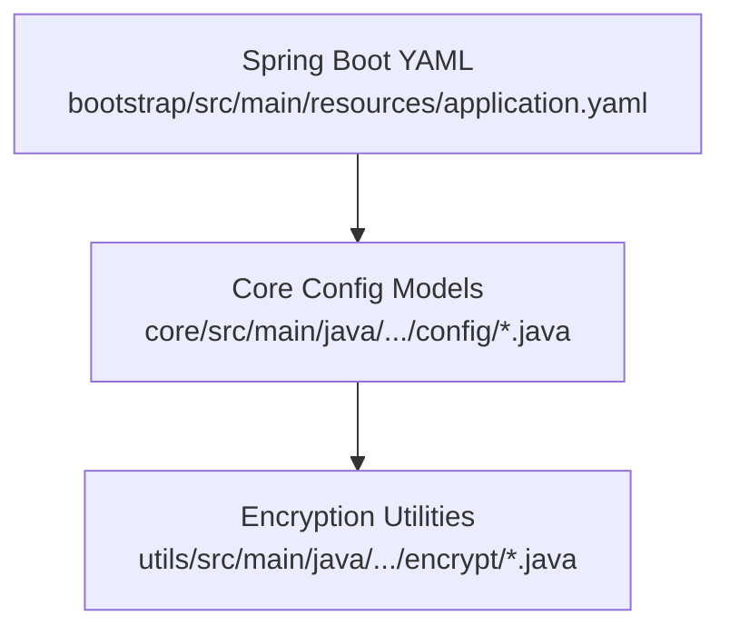
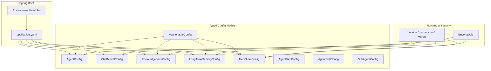
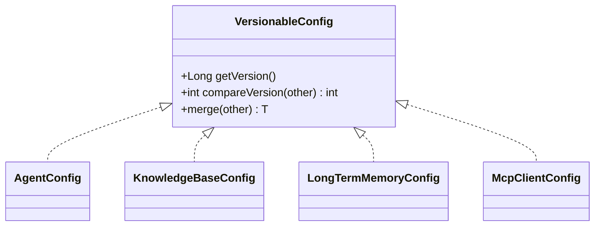
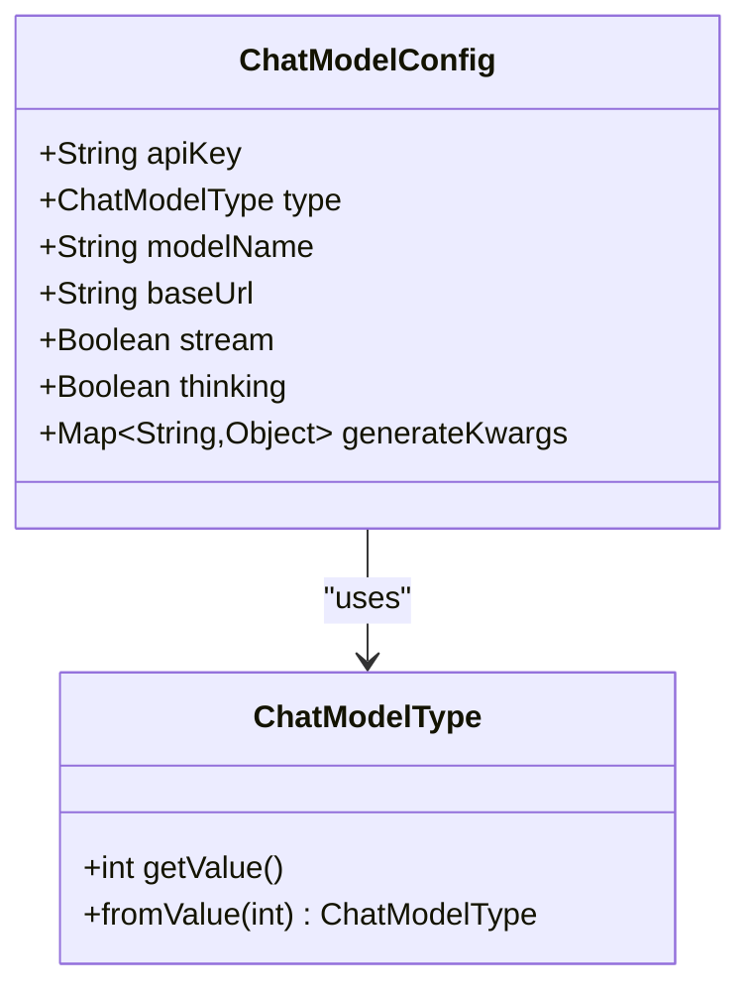
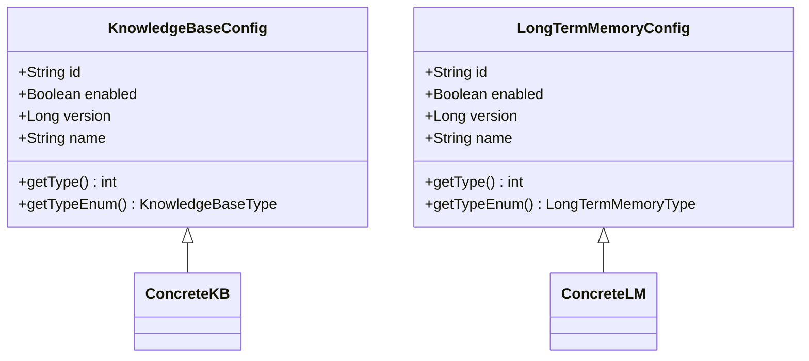
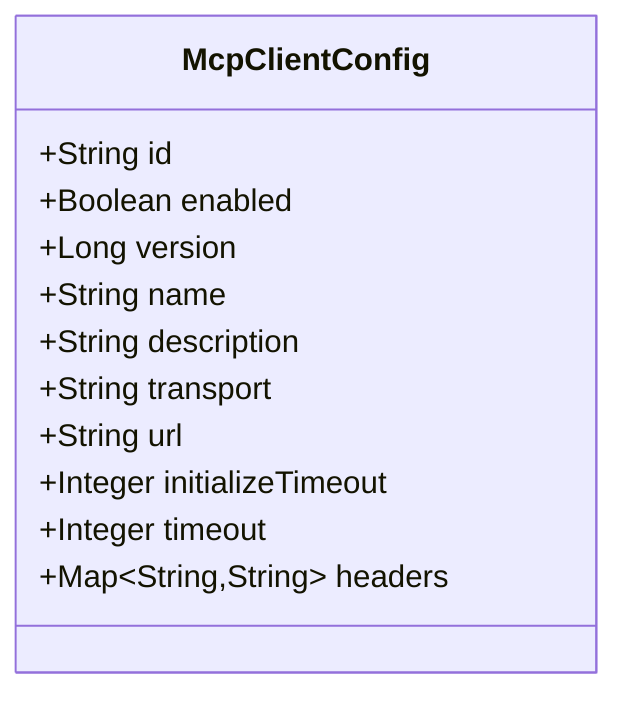
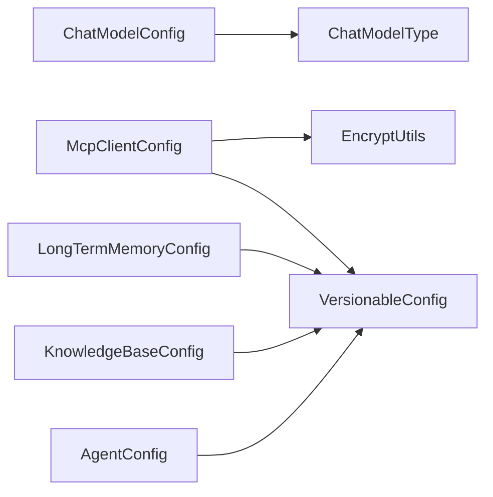
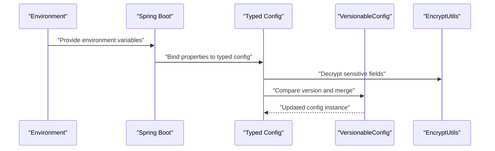

# Configuration Management

<cite>
**Referenced Files in This Document**
- [application.yaml](file://backend_java/bootstrap/src/main/resources/application.yaml)
- [application.yaml (test)](file://backend_java/bootstrap/src/test/resources/application.yaml)
- [VersionableConfig.java](file://backend_java/core/src/main/java/com/aliyun/tam/x/tron/core/config/VersionableConfig.java)
- [AgentConfig.java](file://backend_java/core/src/main/java/com/aliyun/tam/x/tron/core/config/AgentConfig.java)
- [ChatModelConfig.java](file://backend_java/core/src/main/java/com/aliyun/tam/x/tron/core/config/ChatModelConfig.java)
- [ChatModelType.java](file://backend_java/core/src/main/java/com/aliyun/tam/x/tron/core/config/ChatModelType.java)
- [KnowledgeBaseConfig.java](file://backend_java/core/src/main/java/com/aliyun/tam/x/tron/core/config/KnowledgeBaseConfig.java)
- [KnowledgeBaseType.java](file://backend_java/core/src/main/java/com/aliyun/tam/x/tron/core/config/KnowledgeBaseType.java)
- [LongTermMemoryConfig.java](file://backend_java/core/src/main/java/com/aliyun/tam/x/tron/core/config/LongTermMemoryConfig.java)
- [McpClientConfig.java](file://backend_java/core/src/main/java/com/aliyun/tam/x/tron/core/config/McpClientConfig.java)
- [AgentToolConfig.java](file://backend_java/core/src/main/java/com/aliyun/tam/x/tron/core/config/AgentToolConfig.java)
- [AgentSkillConfig.java](file://backend_java/core/src/main/java/com/aliyun/tam/x/tron/core/config/AgentSkillConfig.java)
- [SubAgentConfig.java](file://backend_java/core/src/main/java/com/aliyun/tam/x/tron/core/config/SubAgentConfig.java)
- [EncryptUtils.java](file://backend_java/utils/src/main/java/com/aliyun/tam/x/tron/utils/encrypt/EncryptUtils.java)
</cite>

## Table of Contents
1. [Introduction](#introduction)
2. [Project Structure](#project-structure)
3. [Core Components](#core-components)
4. [Architecture Overview](#architecture-overview)
5. [Detailed Component Analysis](#detailed-component-analysis)
6. [Dependency Analysis](#dependency-analysis)
7. [Performance Considerations](#performance-considerations)
8. [Troubleshooting Guide](#troubleshooting-guide)
9. [Conclusion](#conclusion)
10. [Appendices](#appendices)

## Introduction
This document describes the backend configuration management system for the Spring Boot application. It explains the YAML configuration structure, environment-specific settings, and property binding mechanisms. It documents the VersionableConfig base contract enabling dynamic configuration updates without service restarts, and details configuration types for agents, chat models, tools, knowledge bases, memory systems, and MCP clients. It also covers configuration validation, defaults, environment variable overrides, loading and runtime change processes, best practices for sensitive data, encryption, and versioning strategies.

## Project Structure
The configuration system spans three primary areas:
- Spring Boot configuration files define application-wide settings, database connections, and feature toggles.
- Core configuration models encapsulate typed configuration objects bound to YAML.
- Encryption utilities provide secure handling of sensitive values.

**Diagram sources**
- [application.yaml:1-63](file://backend_java/bootstrap/src/main/resources/application.yaml#L1-L63)
- [VersionableConfig.java:23-75](file://backend_java/core/src/main/java/com/aliyun/tam/x/tron/core/config/VersionableConfig.java#L23-L75)
- [EncryptUtils.java:30-90](file://backend_java/utils/src/main/java/com/aliyun/tam/x/tron/utils/encrypt/EncryptUtils.java#L30-L90)

**Section sources**
- [application.yaml:1-63](file://backend_java/bootstrap/src/main/resources/application.yaml#L1-L63)
- [application.yaml (test):1-24](file://backend_java/bootstrap/src/test/resources/application.yaml#L1-L24)

## Core Components
- VersionableConfig: A generic interface enabling version-aware merging and comparison of configuration instances. It supports comparing versions, merging with null-field propagation, and converting to/from JSON maps.
- AgentConfig: Top-level agent configuration aggregating model, tools, knowledge bases, sub-agents, skills, and memory settings with versioning.
- ChatModelConfig: LLM integration configuration supporting multiple providers via ChatModelType, with optional streaming and thinking modes.
- KnowledgeBaseConfig and LongTermMemoryConfig: Polymorphic base classes for pluggable knowledge and memory backends with versioning and type metadata.
- McpClientConfig: MCP client configuration supporting transport protocols and encrypted headers.
- AgentToolConfig, AgentSkillConfig, SubAgentConfig: Supporting configuration types for tools, skills, and sub-agent composition.
- EncryptUtils: AES-based encryption/decryption utilities driven by a configurable key from application properties.

**Section sources**
- [VersionableConfig.java:23-75](file://backend_java/core/src/main/java/com/aliyun/tam/x/tron/core/config/VersionableConfig.java#L23-L75)
- [AgentConfig.java:39-132](file://backend_java/core/src/main/java/com/aliyun/tam/x/tron/core/config/AgentConfig.java#L39-L132)
- [ChatModelConfig.java:35-54](file://backend_java/core/src/main/java/com/aliyun/tam/x/tron/core/config/ChatModelConfig.java#L35-L54)
- [KnowledgeBaseConfig.java:41-69](file://backend_java/core/src/main/java/com/aliyun/tam/x/tron/core/config/KnowledgeBaseConfig.java#L41-L69)
- [LongTermMemoryConfig.java:37-54](file://backend_java/core/src/main/java/com/aliyun/tam/x/tron/core/config/LongTermMemoryConfig.java#L37-L54)
- [McpClientConfig.java:35-93](file://backend_java/core/src/main/java/com/aliyun/tam/x/tron/core/config/McpClientConfig.java#L35-L93)
- [AgentToolConfig.java:32-43](file://backend_java/core/src/main/java/com/aliyun/tam/x/tron/core/config/AgentToolConfig.java#L32-L43)
- [AgentSkillConfig.java:32-43](file://backend_java/core/src/main/java/com/aliyun/tam/x/tron/core/config/AgentSkillConfig.java#L32-L43)
- [SubAgentConfig.java:40-54](file://backend_java/core/src/main/java/com/aliyun/tam/x/tron/core/config/SubAgentConfig.java#L40-L54)
- [EncryptUtils.java:30-90](file://backend_java/utils/src/main/java/com/aliyun/tam/x/tron/utils/encrypt/EncryptUtils.java#L30-L90)

## Architecture Overview
The configuration architecture combines Spring Boot’s externalized configuration with typed Java models and a versioning contract for safe runtime updates.

**Diagram sources**
- [application.yaml:1-63](file://backend_java/bootstrap/src/main/resources/application.yaml#L1-L63)
- [VersionableConfig.java:23-75](file://backend_java/core/src/main/java/com/aliyun/tam/x/tron/core/config/VersionableConfig.java#L23-L75)
- [AgentConfig.java:39-132](file://backend_java/core/src/main/java/com/aliyun/tam/x/tron/core/config/AgentConfig.java#L39-L132)
- [ChatModelConfig.java:35-54](file://backend_java/core/src/main/java/com/aliyun/tam/x/tron/core/config/ChatModelConfig.java#L35-L54)
- [KnowledgeBaseConfig.java:41-69](file://backend_java/core/src/main/java/com/aliyun/tam/x/tron/core/config/KnowledgeBaseConfig.java#L41-L69)
- [LongTermMemoryConfig.java:37-54](file://backend_java/core/src/main/java/com/aliyun/tam/x/tron/core/config/LongTermMemoryConfig.java#L37-L54)
- [McpClientConfig.java:35-93](file://backend_java/core/src/main/java/com/aliyun/tam/x/tron/core/config/McpClientConfig.java#L35-L93)
- [EncryptUtils.java:30-90](file://backend_java/utils/src/main/java/com/aliyun/tam/x/tron/utils/encrypt/EncryptUtils.java#L30-L90)

## Detailed Component Analysis

### VersionableConfig Contract
VersionableConfig defines a version-aware contract for configuration objects:
- Version retrieval and comparison semantics.
- Merge operation that propagates null fields from another instance and reconstructs the target type from a merged map.

**Diagram sources**
- [VersionableConfig.java:23-75](file://backend_java/core/src/main/java/com/aliyun/tam/x/tron/core/config/VersionableConfig.java#L23-L75)
- [AgentConfig.java:39-132](file://backend_java/core/src/main/java/com/aliyun/tam/x/tron/core/config/AgentConfig.java#L39-L132)
- [KnowledgeBaseConfig.java:41-69](file://backend_java/core/src/main/java/com/aliyun/tam/x/tron/core/config/KnowledgeBaseConfig.java#L41-L69)
- [LongTermMemoryConfig.java:37-54](file://backend_java/core/src/main/java/com/aliyun/tam/x/tron/core/config/LongTermMemoryConfig.java#L37-L54)
- [McpClientConfig.java:35-93](file://backend_java/core/src/main/java/com/aliyun/tam/x/tron/core/config/McpClientConfig.java#L35-L93)

**Section sources**
- [VersionableConfig.java:23-75](file://backend_java/core/src/main/java/com/aliyun/tam/x/tron/core/config/VersionableConfig.java#L23-L75)

### AgentConfig: Agent Behavior Configuration
AgentConfig aggregates:
- Identity and lifecycle (id, name, enabled).
- Versioning (version).
- Model selection (chatModel, fastChatModel) and system prompt.
- Execution limits (maxIters).
- Composition (tools, mcpClients, knowledgeBases, subAgents, skills).
- Input/output capabilities (supportInputTypes).
- Memory mode and identifiers (longTermMemoryMode, longTermMemoryId).
- UX toggles (enableSessionRenaming, enableSuggestion, enableQuestion).

Defaults are provided via builder annotations for lists and booleans, ensuring predictable initialization.

**Section sources**
- [AgentConfig.java:39-132](file://backend_java/core/src/main/java/com/aliyun/tam/x/tron/core/config/AgentConfig.java#L39-L132)

### ChatModelConfig: LLM Integration
ChatModelConfig encapsulates:
- Provider credentials and endpoint (apiKey, baseUrl).
- Model identity (modelName).
- Type enumeration (ChatModelType).
- Streaming and thinking modes.
- Additional generation arguments (generateKwargs).

Sensitive fields like apiKey are annotated for encryption handling.

**Diagram sources**
- [ChatModelConfig.java:35-54](file://backend_java/core/src/main/java/com/aliyun/tam/x/tron/core/config/ChatModelConfig.java#L35-L54)
- [ChatModelType.java:26-58](file://backend_java/core/src/main/java/com/aliyun/tam/x/tron/core/config/ChatModelType.java#L26-L58)

**Section sources**
- [ChatModelConfig.java:35-54](file://backend_java/core/src/main/java/com/aliyun/tam/x/tron/core/config/ChatModelConfig.java#L35-L54)
- [ChatModelType.java:26-58](file://backend_java/core/src/main/java/com/aliyun/tam/x/tron/core/config/ChatModelType.java#L26-L58)

### Knowledge Base and Memory Configurations
- KnowledgeBaseConfig: Abstract polymorphic base for knowledge backends with versioning and type metadata. Supported types are declared via Jackson annotations.
- LongTermMemoryConfig: Abstract polymorphic base for memory backends with similar pattern.

**Diagram sources**
- [KnowledgeBaseConfig.java:41-69](file://backend_java/core/src/main/java/com/aliyun/tam/x/tron/core/config/KnowledgeBaseConfig.java#L41-L69)
- [LongTermMemoryConfig.java:37-54](file://backend_java/core/src/main/java/com/aliyun/tam/x/tron/core/config/LongTermMemoryConfig.java#L37-L54)

**Section sources**
- [KnowledgeBaseConfig.java:41-69](file://backend_java/core/src/main/java/com/aliyun/tam/x/tron/core/config/KnowledgeBaseConfig.java#L41-L69)
- [LongTermMemoryConfig.java:37-54](file://backend_java/core/src/main/java/com/aliyun/tam/x/tron/core/config/LongTermMemoryConfig.java#L37-L54)

### MCP Client Configuration
McpClientConfig supports:
- Identity and lifecycle (id, name, description, enabled).
- Transport protocol selection (transport).
- Endpoint and timeouts (url, initializeTimeout, timeout).
- Encrypted headers (headers) for secure authentication.

**Diagram sources**
- [McpClientConfig.java:35-93](file://backend_java/core/src/main/java/com/aliyun/tam/x/tron/core/config/McpClientConfig.java#L35-L93)

**Section sources**
- [McpClientConfig.java:35-93](file://backend_java/core/src/main/java/com/aliyun/tam/x/tron/core/config/McpClientConfig.java#L35-L93)

### Supporting Types
- AgentToolConfig: Minimal tool configuration with enabled flag and name.
- AgentSkillConfig: Minimal skill configuration with enabled flag and name.
- SubAgentConfig: Polymorphic base for sub-agent composition with type metadata.

**Section sources**
- [AgentToolConfig.java:32-43](file://backend_java/core/src/main/java/com/aliyun/tam/x/tron/core/config/AgentToolConfig.java#L32-L43)
- [AgentSkillConfig.java:32-43](file://backend_java/core/src/main/java/com/aliyun/tam/x/tron/core/config/AgentSkillConfig.java#L32-L43)
- [SubAgentConfig.java:40-54](file://backend_java/core/src/main/java/com/aliyun/tam/x/tron/core/config/SubAgentConfig.java#L40-L54)

## Dependency Analysis
Configuration dependencies and relationships:
- Typed configs depend on enums for type safety (ChatModelType, KnowledgeBaseType).
- Encryption utilities are leveraged by configs containing sensitive fields (ChatModelConfig.apiKey, McpClientConfig.headers).
- VersionableConfig is implemented by multiple config classes to enable runtime merges and comparisons.

**Diagram sources**
- [ChatModelConfig.java:35-54](file://backend_java/core/src/main/java/com/aliyun/tam/x/tron/core/config/ChatModelConfig.java#L35-L54)
- [ChatModelType.java:26-58](file://backend_java/core/src/main/java/com/aliyun/tam/x/tron/core/config/ChatModelType.java#L26-L58)
- [McpClientConfig.java:35-93](file://backend_java/core/src/main/java/com/aliyun/tam/x/tron/core/config/McpClientConfig.java#L35-L93)
- [EncryptUtils.java:30-90](file://backend_java/utils/src/main/java/com/aliyun/tam/x/tron/utils/encrypt/EncryptUtils.java#L30-L90)
- [AgentConfig.java:39-132](file://backend_java/core/src/main/java/com/aliyun/tam/x/tron/core/config/AgentConfig.java#L39-L132)
- [KnowledgeBaseConfig.java:41-69](file://backend_java/core/src/main/java/com/aliyun/tam/x/tron/core/config/KnowledgeBaseConfig.java#L41-L69)
- [LongTermMemoryConfig.java:37-54](file://backend_java/core/src/main/java/com/aliyun/tam/x/tron/core/config/LongTermMemoryConfig.java#L37-L54)
- [VersionableConfig.java:23-75](file://backend_java/core/src/main/java/com/aliyun/tam/x/tron/core/config/VersionableConfig.java#L23-L75)

**Section sources**
- [ChatModelConfig.java:35-54](file://backend_java/core/src/main/java/com/aliyun/tam/x/tron/core/config/ChatModelConfig.java#L35-L54)
- [McpClientConfig.java:35-93](file://backend_java/core/src/main/java/com/aliyun/tam/x/tron/core/config/McpClientConfig.java#L35-L93)
- [VersionableConfig.java:23-75](file://backend_java/core/src/main/java/com/aliyun/tam/x/tron/core/config/VersionableConfig.java#L23-L75)

## Performance Considerations
- Version comparison and merge operations rely on JSON conversion and recursive null-field propagation. Keep configuration trees shallow and avoid excessively large nested maps to minimize overhead during runtime updates.
- Prefer incremental updates and targeted merges to reduce unnecessary conversions.
- Limit the frequency of runtime reconfiguration to balance responsiveness with performance.

## Troubleshooting Guide
Common configuration issues and resolutions:
- Environment variable overrides not applied:
  - Verify environment variable names match placeholders in YAML and are exported before startup.
  - Confirm property precedence and that environment variables are loaded by Spring Boot.
- Sensitive values appear unencrypted:
  - Ensure encryption key is configured and EncryptUtils can derive the AES key.
  - Confirm annotated fields are processed by the encryption pipeline during deserialization.
- Version conflicts during runtime updates:
  - Use compareVersion to ensure newer versions supersede older ones.
  - Merge only null fields to preserve explicit user overrides.
- Type mismatches in polymorphic configs:
  - Ensure type metadata (e.g., type field) matches registered subtypes.
  - Validate enum values align with declared mappings.

**Section sources**
- [application.yaml:1-63](file://backend_java/bootstrap/src/main/resources/application.yaml#L1-L63)
- [EncryptUtils.java:30-90](file://backend_java/utils/src/main/java/com/aliyun/tam/x/tron/utils/encrypt/EncryptUtils.java#L30-L90)
- [VersionableConfig.java:27-57](file://backend_java/core/src/main/java/com/aliyun/tam/x/tron/core/config/VersionableConfig.java#L27-L57)
- [KnowledgeBaseConfig.java:36-40](file://backend_java/core/src/main/java/com/aliyun/tam/x/tron/core/config/KnowledgeBaseConfig.java#L36-L40)
- [LongTermMemoryConfig.java:33-36](file://backend_java/core/src/main/java/com/aliyun/tam/x/tron/core/config/LongTermMemoryConfig.java#L33-L36)

## Conclusion
The configuration management system integrates Spring Boot externalized configuration with strongly typed models and a version-aware merge contract. It supports environment-specific settings, sensible defaults, and secure handling of sensitive data. By leveraging VersionableConfig, the system enables dynamic updates without restarts while maintaining type safety and extensibility.

## Appendices

### Configuration Loading and Runtime Changes
- Loading process:
  - Spring Boot loads application.yaml and binds properties to configuration classes.
  - Environment variables override YAML placeholders at runtime.
- Runtime changes:
  - Compare versions and merge null fields to apply incremental updates.
  - Persist updated configurations and propagate changes to dependent services.

**Diagram sources**
- [application.yaml:1-63](file://backend_java/bootstrap/src/main/resources/application.yaml#L1-L63)
- [VersionableConfig.java:27-57](file://backend_java/core/src/main/java/com/aliyun/tam/x/tron/core/config/VersionableConfig.java#L27-L57)
- [EncryptUtils.java:30-90](file://backend_java/utils/src/main/java/com/aliyun/tam/x/tron/utils/encrypt/EncryptUtils.java#L30-L90)

### Best Practices for Sensitive Configuration
- Store encryption keys in environment variables and rotate periodically.
- Annotate sensitive fields and ensure decryption occurs during deserialization.
- Avoid logging decrypted values; mask or redact sensitive outputs.
- Restrict access to configuration files and secrets management systems.

**Section sources**
- [application.yaml:50-51](file://backend_java/bootstrap/src/main/resources/application.yaml#L50-L51)
- [EncryptUtils.java:30-90](file://backend_java/utils/src/main/java/com/aliyun/tam/x/tron/utils/encrypt/EncryptUtils.java#L30-L90)
- [ChatModelConfig.java:37-38](file://backend_java/core/src/main/java/com/aliyun/tam/x/tron/core/config/ChatModelConfig.java#L37-L38)
- [McpClientConfig.java:91-92](file://backend_java/core/src/main/java/com/aliyun/tam/x/tron/core/config/McpClientConfig.java#L91-L92)

### Configuration Validation and Defaults
- Validation:
  - Use enum types for constrained values (e.g., ChatModelType, KnowledgeBaseType).
  - Validate presence of required fields (e.g., apiKey, baseUrl) before use.
- Defaults:
  - Builder-defaulted fields provide safe initial values.
  - Environment placeholders supply fallbacks when variables are unset.

**Section sources**
- [ChatModelType.java:26-58](file://backend_java/core/src/main/java/com/aliyun/tam/x/tron/core/config/ChatModelType.java#L26-L58)
- [KnowledgeBaseType.java:26-54](file://backend_java/core/src/main/java/com/aliyun/tam/x/tron/core/config/KnowledgeBaseType.java#L26-L54)
- [application.yaml:33-49](file://backend_java/bootstrap/src/main/resources/application.yaml#L33-L49)

### Environment Variable Overrides
- Database connection:
  - DB_HOST, DB_PORT, DB_NAME, DB_USER, DB_PASS.
- Cloud providers:
  - DASHSCOPE_API_KEY, ALIBABA_CLOUD_ACCESS_KEY_ID, ALIBABA_CLOUD_ACCESS_KEY_SECRET.
- File storage:
  - FILE_SERVER_BASE_URL, OSS_BUCKET, OSS_REGION, OSS_ENDPOINT.
- Encryption:
  - TRON_ENCRYPT_KEY.

**Section sources**
- [application.yaml:11-13](file://backend_java/bootstrap/src/main/resources/application.yaml#L11-L13)
- [application.yaml:34-49](file://backend_java/bootstrap/src/main/resources/application.yaml#L34-L49)
- [application.yaml:50-51](file://backend_java/bootstrap/src/main/resources/application.yaml#L50-L51)

### Configuration Versioning Strategies
- Assign monotonically increasing version numbers to configuration snapshots.
- Use compareVersion to determine precedence during merges.
- Merge only null fields to preserve explicit overrides and avoid accidental resets.

**Section sources**
- [VersionableConfig.java:27-57](file://backend_java/core/src/main/java/com/aliyun/tam/x/tron/core/config/VersionableConfig.java#L27-L57)
- [AgentConfig.java:58-58](file://backend_java/core/src/main/java/com/aliyun/tam/x/tron/core/config/AgentConfig.java#L58-L58)
- [KnowledgeBaseConfig.java:56-56](file://backend_java/core/src/main/java/com/aliyun/tam/x/tron/core/config/KnowledgeBaseConfig.java#L56-L56)
- [LongTermMemoryConfig.java:44-44](file://backend_java/core/src/main/java/com/aliyun/tam/x/tron/core/config/LongTermMemoryConfig.java#L44-L44)
- [McpClientConfig.java:53-53](file://backend_java/core/src/main/java/com/aliyun/tam/x/tron/core/config/McpClientConfig.java#L53-L53)