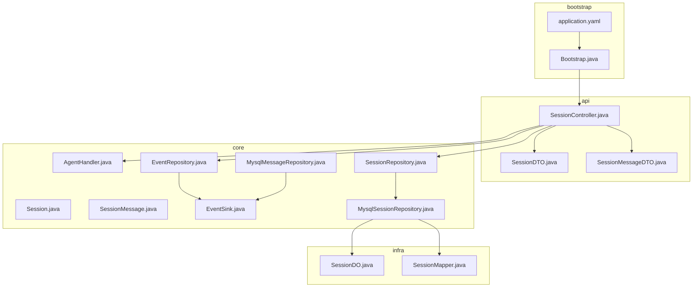
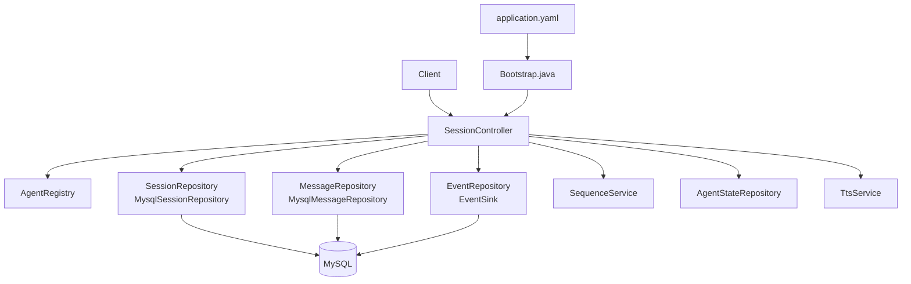
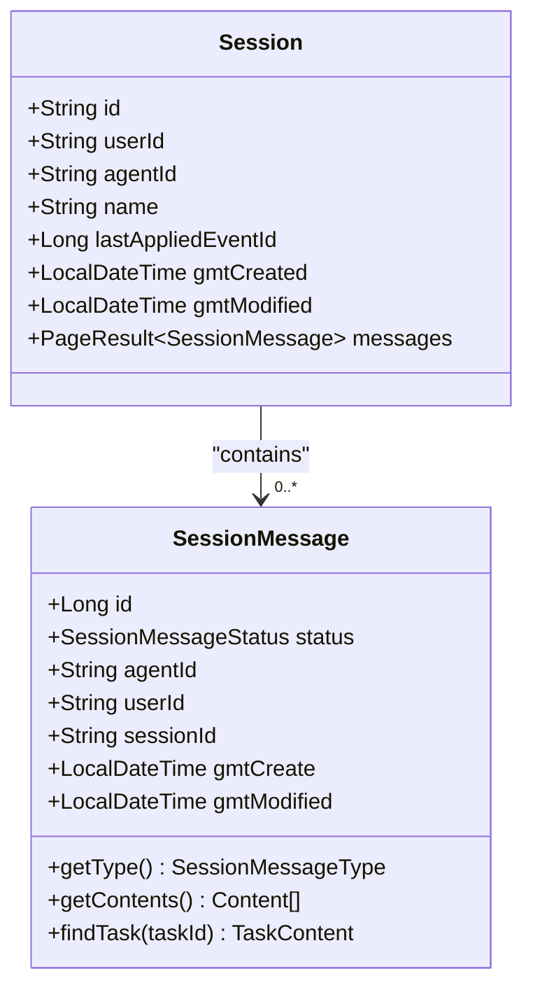
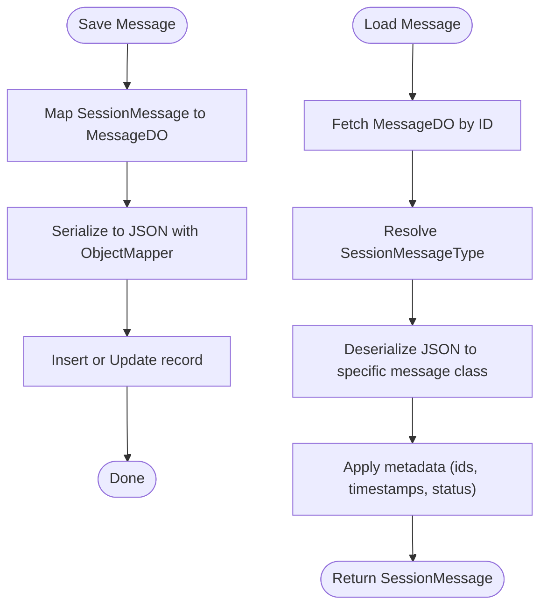
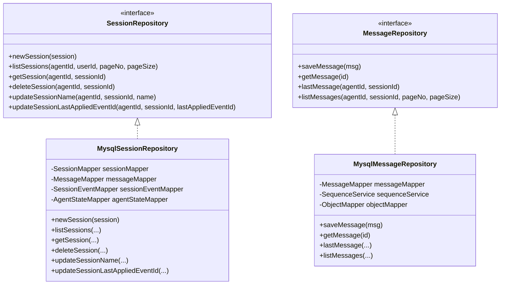
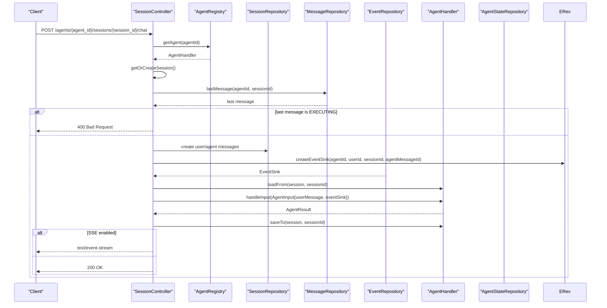
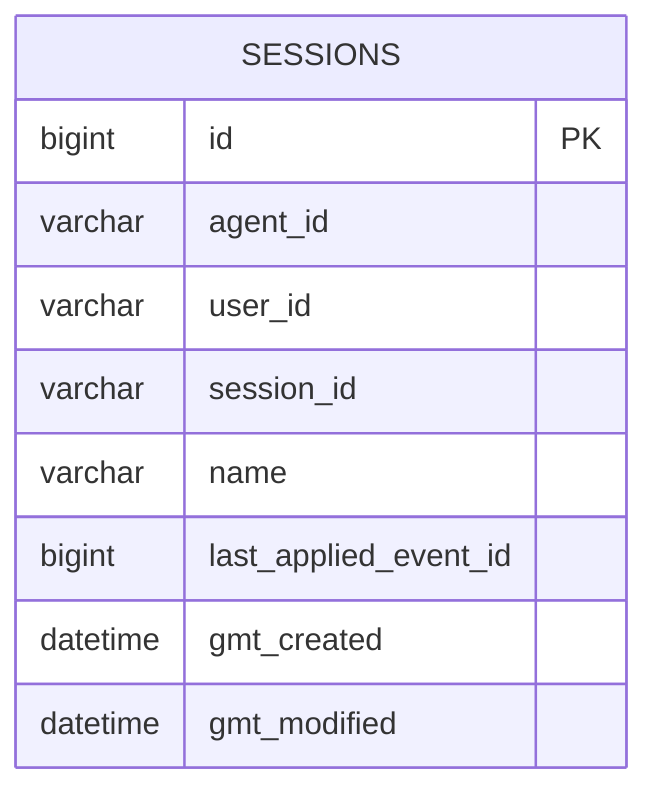
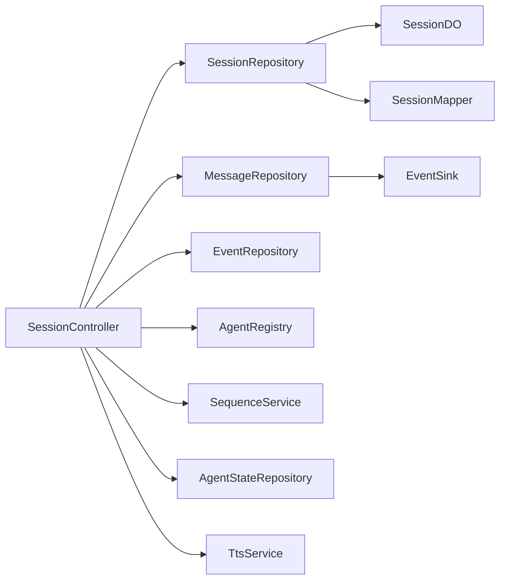

# Data Flow and Processing

<cite>
**Referenced Files in This Document**
- [Bootstrap.java](file://backend_java/bootstrap/src/main/java/com/aliyun/tam/x/tron/Bootstrap.java)
- [application.yaml](file://backend_java/bootstrap/src/main/resources/application.yaml)
- [SessionController.java](file://backend_java/api/src/main/java/com/aliyun/tam/x/tron/api/SessionController.java)
- [SessionDTO.java](file://backend_java/api/src/main/java/com/aliyun/tam/x/tron/api/dto/SessionDTO.java)
- [SessionMessageDTO.java](file://backend_java/api/src/main/java/com/aliyun/tam/x/tron/api/dto/SessionMessageDTO.java)
- [Session.java](file://backend_java/core/src/main/java/com/aliyun/tam/x/tron/core/domain/models/Session.java)
- [SessionMessage.java](file://backend_java/core/src/main/java/com/aliyun/tam/x/tron/core/domain/models/messages/SessionMessage.java)
- [EventSink.java](file://backend_java/core/src/main/java/com/aliyun/tam/x/tron/core/domain/models/events/EventSink.java)
- [AgentHandler.java](file://backend_java/core/src/main/java/com/aliyun/tam/x/tron/core/agents/AgentHandler.java)
- [SessionRepository.java](file://backend_java/core/src/main/java/com/aliyun/tam/x/tron/core/domain/repository/SessionRepository.java)
- [EventRepository.java](file://backend_java/core/src/main/java/com/aliyun/tam/x/tron/core/domain/repository/EventRepository.java)
- [MysqlSessionRepository.java](file://backend_java/core/src/main/java/com/aliyun/tam/x/tron/core/domain/repository/mysql/MysqlSessionRepository.java)
- [MysqlMessageRepository.java](file://backend_java/core/src/main/java/com/aliyun/tam/x/tron/core/domain/repository/mysql/MysqlMessageRepository.java)
- [SessionDO.java](file://backend_java/infra/src/main/java/com/aliyun/tam/x/tron/infra/dal/dataobject/SessionDO.java)
- [SessionMapper.java](file://backend_java/infra/src/main/java/com/aliyun/tam/x/tron/infra/dal/mapper/SessionMapper.java)
</cite>

## Table of Contents
1. [Introduction](#introduction)
2. [Project Structure](#project-structure)
3. [Core Components](#core-components)
4. [Architecture Overview](#architecture-overview)
5. [Detailed Component Analysis](#detailed-component-analysis)
6. [Dependency Analysis](#dependency-analysis)
7. [Performance Considerations](#performance-considerations)
8. [Troubleshooting Guide](#troubleshooting-guide)
9. [Conclusion](#conclusion)

## Introduction
This document explains the backend data flow and processing architecture for the agent session lifecycle. It covers the end-to-end journey from HTTP requests through session management, message handling, event streaming, and persistence. It also documents the Session model and SessionMessage system, the repository pattern implementation, request processing pipeline, validation, response generation, serialization/deserialization, error handling, and performance optimization strategies.

## Project Structure
The backend is organized into layered modules:
- bootstrap: Spring Boot application entrypoint and configuration
- api: REST controllers exposing session and chat endpoints
- core: Domain models, repositories, agent handlers, and event systems
- infra: Data Access Layer (MyBatis-Plus) with DOs and Mappers
- utils: Utilities for encryption and JSON helpers

**Diagram sources**
- [Bootstrap.java:25-32](file://backend_java/bootstrap/src/main/java/com/aliyun/tam/x/tron/Bootstrap.java#L25-L32)
- [application.yaml:1-63](file://backend_java/bootstrap/src/main/resources/application.yaml#L1-L63)
- [SessionController.java:80-84](file://backend_java/api/src/main/java/com/aliyun/tam/x/tron/api/SessionController.java#L80-L84)
- [SessionDTO.java:34-76](file://backend_java/api/src/main/java/com/aliyun/tam/x/tron/api/dto/SessionDTO.java#L34-L76)
- [SessionMessageDTO.java:38-101](file://backend_java/api/src/main/java/com/aliyun/tam/x/tron/api/dto/SessionMessageDTO.java#L38-L101)
- [Session.java:35-77](file://backend_java/core/src/main/java/com/aliyun/tam/x/tron/core/domain/models/Session.java#L35-L77)
- [SessionMessage.java:37-60](file://backend_java/core/src/main/java/com/aliyun/tam/x/tron/core/domain/models/messages/SessionMessage.java#L37-L60)
- [EventSink.java:42-265](file://backend_java/core/src/main/java/com/aliyun/tam/x/tron/core/domain/models/events/EventSink.java#L42-L265)
- [AgentHandler.java:35-46](file://backend_java/core/src/main/java/com/aliyun/tam/x/tron/core/agents/AgentHandler.java#L35-L46)
- [SessionRepository.java:23-36](file://backend_java/core/src/main/java/com/aliyun/tam/x/tron/core/domain/repository/SessionRepository.java#L23-L36)
- [EventRepository.java:25-30](file://backend_java/core/src/main/java/com/aliyun/tam/x/tron/core/domain/repository/EventRepository.java#L25-L30)
- [MysqlSessionRepository.java:45-172](file://backend_java/core/src/main/java/com/aliyun/tam/x/tron/core/domain/repository/mysql/MysqlSessionRepository.java#L45-L172)
- [MysqlMessageRepository.java:37-146](file://backend_java/core/src/main/java/com/aliyun/tam/x/tron/core/domain/repository/mysql/MysqlMessageRepository.java#L37-L146)
- [SessionDO.java:28-79](file://backend_java/infra/src/main/java/com/aliyun/tam/x/tron/infra/dal/dataobject/SessionDO.java#L28-L79)
- [SessionMapper.java:27-29](file://backend_java/infra/src/main/java/com/aliyun/tam/x/tron/infra/dal/mapper/SessionMapper.java#L27-L29)

**Section sources**
- [Bootstrap.java:25-32](file://backend_java/bootstrap/src/main/java/com/aliyun/tam/x/tron/Bootstrap.java#L25-L32)
- [application.yaml:1-63](file://backend_java/bootstrap/src/main/resources/application.yaml#L1-L63)

## Core Components
- Session model: Represents a conversation context with metadata and optional embedded message page result.
- SessionMessage hierarchy: Abstract base for user and agent messages, carrying typed content and status.
- EventSink: Central event bus abstraction for generating and propagating session events (user input, agent messages, tasks, actions).
- Repositories: Abstractions for sessions, messages, and events; implemented with MySQL via MyBatis-Plus.
- Controllers: Expose REST endpoints for session lifecycle and chat with SSE streaming support.

Key responsibilities:
- SessionController orchestrates request validation, session/message creation, agent invocation, and SSE emission.
- MysqlSessionRepository persists sessions and maintains referential cleanup across related tables.
- MysqlMessageRepository serializes/deserializes messages to/from JSON and persists them as records.
- EventSink constructs domain events and delegates persistence and streaming.

**Section sources**
- [Session.java:35-77](file://backend_java/core/src/main/java/com/aliyun/tam/x/tron/core/domain/models/Session.java#L35-L77)
- [SessionMessage.java:37-60](file://backend_java/core/src/main/java/com/aliyun/tam/x/tron/core/domain/models/messages/SessionMessage.java#L37-L60)
- [EventSink.java:42-265](file://backend_java/core/src/main/java/com/aliyun/tam/x/tron/core/domain/models/events/EventSink.java#L42-L265)
- [SessionRepository.java:23-36](file://backend_java/core/src/main/java/com/aliyun/tam/x/tron/core/domain/repository/SessionRepository.java#L23-L36)
- [EventRepository.java:25-30](file://backend_java/core/src/main/java/com/aliyun/tam/x/tron/core/domain/repository/EventRepository.java#L25-L30)
- [MysqlSessionRepository.java:45-172](file://backend_java/core/src/main/java/com/aliyun/tam/x/tron/core/domain/repository/mysql/MysqlSessionRepository.java#L45-L172)
- [MysqlMessageRepository.java:37-146](file://backend_java/core/src/main/java/com/aliyun/tam/x/tron/core/domain/repository/mysql/MysqlMessageRepository.java#L37-L146)

## Architecture Overview
The system follows a layered architecture:
- Presentation: REST endpoints in SessionController
- Application: Orchestration of validation, session/message creation, agent invocation, and SSE
- Domain: Models, repositories, and event system
- Infrastructure: MyBatis-Plus mappers and DOs for persistence

**Diagram sources**
- [application.yaml:1-63](file://backend_java/bootstrap/src/main/resources/application.yaml#L1-L63)
- [Bootstrap.java:25-32](file://backend_java/bootstrap/src/main/java/com/aliyun/tam/x/tron/Bootstrap.java#L25-L32)
- [SessionController.java:80-114](file://backend_java/api/src/main/java/com/aliyun/tam/x/tron/api/SessionController.java#L80-L114)
- [MysqlSessionRepository.java:45-172](file://backend_java/core/src/main/java/com/aliyun/tam/x/tron/core/domain/repository/mysql/MysqlSessionRepository.java#L45-L172)
- [MysqlMessageRepository.java:37-146](file://backend_java/core/src/main/java/com/aliyun/tam/x/tron/core/domain/repository/mysql/MysqlMessageRepository.java#L37-L146)

## Detailed Component Analysis

### Session Model and Conversation State
The Session model encapsulates:
- Identity: id, agentId, userId
- Metadata: name, lastAppliedEventId, timestamps
- Embedded pagination: messages as PageResult<SessionMessage>

It is used to represent a conversation context and is persisted via MysqlSessionRepository.

**Diagram sources**
- [Session.java:35-77](file://backend_java/core/src/main/java/com/aliyun/tam/x/tron/core/domain/models/Session.java#L35-L77)
- [SessionMessage.java:37-60](file://backend_java/core/src/main/java/com/aliyun/tam/x/tron/core/domain/models/messages/SessionMessage.java#L37-L60)

**Section sources**
- [Session.java:35-77](file://backend_java/core/src/main/java/com/aliyun/tam/x/tron/core/domain/models/Session.java#L35-L77)

### SessionMessage System and Serialization
SessionMessage is an abstract base for typed messages. Concrete implementations include user and agent messages. Messages are serialized to JSON for persistence and deserialized upon retrieval.

Key behaviors:
- Serialization: MysqlMessageRepository writes message JSON using ObjectMapper.
- Deserialization: Reads JSON and maps to specific message types based on type discriminator.
- Status and timestamps: Managed per message record.

**Diagram sources**
- [MysqlMessageRepository.java:49-73](file://backend_java/core/src/main/java/com/aliyun/tam/x/tron/core/domain/repository/mysql/MysqlMessageRepository.java#L49-L73)
- [MysqlMessageRepository.java:115-144](file://backend_java/core/src/main/java/com/aliyun/tam/x/tron/core/domain/repository/mysql/MysqlMessageRepository.java#L115-L144)

**Section sources**
- [SessionMessage.java:37-60](file://backend_java/core/src/main/java/com/aliyun/tam/x/tron/core/domain/models/messages/SessionMessage.java#L37-L60)
- [MysqlMessageRepository.java:49-73](file://backend_java/core/src/main/java/com/aliyun/tam/x/tron/core/domain/repository/mysql/MysqlMessageRepository.java#L49-L73)
- [MysqlMessageRepository.java:115-144](file://backend_java/core/src/main/java/com/aliyun/tam/x/tron/core/domain/repository/mysql/MysqlMessageRepository.java#L115-L144)

### Repository Pattern Implementation
Repositories define the contract; MySQL implementations translate domain models to DOs and persist via MyBatis-Plus.

- SessionRepository: new/list/get/delete/update
- MessageRepository: save/get/list/last
- EventRepository: pullEvents and createEventSink

**Diagram sources**
- [SessionRepository.java:23-36](file://backend_java/core/src/main/java/com/aliyun/tam/x/tron/core/domain/repository/SessionRepository.java#L23-L36)
- [MysqlSessionRepository.java:45-172](file://backend_java/core/src/main/java/com/aliyun/tam/x/tron/core/domain/repository/mysql/MysqlSessionRepository.java#L45-L172)
- [MysqlMessageRepository.java:37-146](file://backend_java/core/src/main/java/com/aliyun/tam/x/tron/core/domain/repository/mysql/MysqlMessageRepository.java#L37-L146)

**Section sources**
- [SessionRepository.java:23-36](file://backend_java/core/src/main/java/com/aliyun/tam/x/tron/core/domain/repository/SessionRepository.java#L23-L36)
- [MysqlSessionRepository.java:45-172](file://backend_java/core/src/main/java/com/aliyun/tam/x/tron/core/domain/repository/mysql/MysqlSessionRepository.java#L45-L172)
- [MysqlMessageRepository.java:37-146](file://backend_java/core/src/main/java/com/aliyun/tam/x/tron/core/domain/repository/mysql/MysqlMessageRepository.java#L37-L146)

### Request Processing Pipeline and Chat Flow
The chat endpoint coordinates:
- Validation: Path and query parameters validated via annotations.
- Session resolution: Ensures session exists or creates it.
- Concurrency guard: Prevents overlapping EXECUTING agent messages.
- Streaming: SSE mode emits events in real-time; otherwise returns success immediately.
- Agent orchestration: Builds user and agent messages, wraps EventSink for persistence and streaming, invokes agent handler, and manages session state.

**Diagram sources**
- [SessionController.java:308-409](file://backend_java/api/src/main/java/com/aliyun/tam/x/tron/api/SessionController.java#L308-L409)
- [SessionController.java:411-535](file://backend_java/api/src/main/java/com/aliyun/tam/x/tron/api/SessionController.java#L411-L535)
- [AgentHandler.java:35-46](file://backend_java/core/src/main/java/com/aliyun/tam/x/tron/core/agents/AgentHandler.java#L35-L46)

**Section sources**
- [SessionController.java:308-409](file://backend_java/api/src/main/java/com/aliyun/tam/x/tron/api/SessionController.java#L308-L409)
- [SessionController.java:411-535](file://backend_java/api/src/main/java/com/aliyun/tam/x/tron/api/SessionController.java#L411-L535)
- [AgentHandler.java:35-46](file://backend_java/core/src/main/java/com/aliyun/tam/x/tron/core/agents/AgentHandler.java#L35-L46)

### DTOs and Data Transformation
- SessionDTO: Presents session metadata and nested PageResultDTO of messages.
- SessionMessageDTO: Converts SessionMessage to transport form, mapping type/status and contents; includes agent-specific fields like usage and finish time.

Transformation highlights:
- Type/status mapping via enumerations.
- Contents conversion via ContentDTO.
- Conditional fields for agent messages (usage, finish time).

**Section sources**
- [SessionDTO.java:34-76](file://backend_java/api/src/main/java/com/aliyun/tam/x/tron/api/dto/SessionDTO.java#L34-L76)
- [SessionMessageDTO.java:38-101](file://backend_java/api/src/main/java/com/aliyun/tam/x/tron/api/dto/SessionMessageDTO.java#L38-L101)

### Persistence Schema and Mapping
- SessionDO: Maps to sessions table with auto-increment primary key and logical keys for agent_id, user_id, session_id.
- SessionMapper: MyBatis-Plus mapper for SessionDO.
- MysqlSessionRepository: Uses SessionMapper and others to maintain referential integrity and concurrency-safe creation.

**Diagram sources**
- [SessionDO.java:28-79](file://backend_java/infra/src/main/java/com/aliyun/tam/x/tron/infra/dal/dataobject/SessionDO.java#L28-L79)
- [SessionMapper.java:27-29](file://backend_java/infra/src/main/java/com/aliyun/tam/x/tron/infra/dal/mapper/SessionMapper.java#L27-L29)

**Section sources**
- [SessionDO.java:28-79](file://backend_java/infra/src/main/java/com/aliyun/tam/x/tron/infra/dal/dataobject/SessionDO.java#L28-L79)
- [SessionMapper.java:27-29](file://backend_java/infra/src/main/java/com/aliyun/tam/x/tron/infra/dal/mapper/SessionMapper.java#L27-L29)
- [MysqlSessionRepository.java:45-172](file://backend_java/core/src/main/java/com/aliyun/tam/x/tron/core/domain/repository/mysql/MysqlSessionRepository.java#L45-L172)

## Dependency Analysis
- Controllers depend on repositories, registries, sequence service, and TTS service.
- Repositories depend on MyBatis-Plus mappers and DOs.
- EventSink is created by EventRepository and used by controllers and agent handlers.
- AgentHandler is invoked by controllers and manages tracing and metrics.

**Diagram sources**
- [SessionController.java:80-114](file://backend_java/api/src/main/java/com/aliyun/tam/x/tron/api/SessionController.java#L80-L114)
- [MysqlSessionRepository.java:45-172](file://backend_java/core/src/main/java/com/aliyun/tam/x/tron/core/domain/repository/mysql/MysqlSessionRepository.java#L45-L172)
- [MysqlMessageRepository.java:37-146](file://backend_java/core/src/main/java/com/aliyun/tam/x/tron/core/domain/repository/mysql/MysqlMessageRepository.java#L37-L146)
- [EventSink.java:42-265](file://backend_java/core/src/main/java/com/aliyun/tam/x/tron/core/domain/models/events/EventSink.java#L42-L265)

**Section sources**
- [SessionController.java:80-114](file://backend_java/api/src/main/java/com/aliyun/tam/x/tron/api/SessionController.java#L80-L114)
- [MysqlSessionRepository.java:45-172](file://backend_java/core/src/main/java/com/aliyun/tam/x/tron/core/domain/repository/mysql/MysqlSessionRepository.java#L45-L172)
- [MysqlMessageRepository.java:37-146](file://backend_java/core/src/main/java/com/aliyun/tam/x/tron/core/domain/repository/mysql/MysqlMessageRepository.java#L37-L146)
- [EventSink.java:42-265](file://backend_java/core/src/main/java/com/aliyun/tam/x/tron/core/domain/models/events/EventSink.java#L42-L265)

## Performance Considerations
- Concurrency control: Prevents overlapping EXECUTING agent messages to avoid inconsistent state.
- Asynchronous processing: Chat requests are submitted to a bounded thread pool to keep the HTTP thread free.
- SSE streaming: Emits events incrementally to reduce perceived latency and enable early termination.
- Metrics and tracing: AgentHandler logging wrapper records timers and summaries for end-to-end latency and time-to-first-token.
- Pagination: Repository queries use MyBatis-Plus pagination to limit payload sizes.
- Serialization overhead: ObjectMapper is reused; consider compact JSON and avoid unnecessary conversions.

[No sources needed since this section provides general guidance]

## Troubleshooting Guide
Common issues and handling:
- Validation failures: Path/query parameters are validated; BAD REQUEST responses are returned with error messages.
- SSE timeouts: AsyncRequestTimeoutException is handled with a timeout response.
- Internal errors: Unhandled exceptions return 500 with a generic message; logs include stack traces.
- Duplicate session creation: MySQL constraint handling ensures idempotent creation with warnings.
- Message serialization errors: Failures during JSON serialization/deserialization are wrapped and surfaced as runtime exceptions.

Operational checks:
- Verify database connectivity and credentials in application.yaml.
- Confirm agent availability via AgentRegistry and configuration enablement.
- Monitor SSE emitter state and completion to detect premature closure.

**Section sources**
- [SessionController.java:116-130](file://backend_java/api/src/main/java/com/aliyun/tam/x/tron/api/SessionController.java#L116-L130)
- [MysqlSessionRepository.java:70-79](file://backend_java/core/src/main/java/com/aliyun/tam/x/tron/core/domain/repository/mysql/MysqlSessionRepository.java#L70-L79)
- [MysqlMessageRepository.java:58-62](file://backend_java/core/src/main/java/com/aliyun/tam/x/tron/core/domain/repository/mysql/MysqlMessageRepository.java#L58-L62)
- [MysqlMessageRepository.java:141-143](file://backend_java/core/src/main/java/com/aliyun/tam/x/tron/core/domain/repository/mysql/MysqlMessageRepository.java#L141-L143)

## Conclusion
The backend implements a robust, layered architecture for managing agent conversations. Requests traverse controllers, repositories, and the event system, with messages serialized to persistent storage and streamed to clients. The Session and SessionMessage models, combined with the EventSink abstraction, provide a clear separation of concerns and strong guarantees around state and event ordering. Performance is addressed through concurrency guards, asynchronous processing, SSE streaming, and metrics/tracing. Persistence is handled via MyBatis-Plus with explicit referential cleanup and idempotent creation semantics.