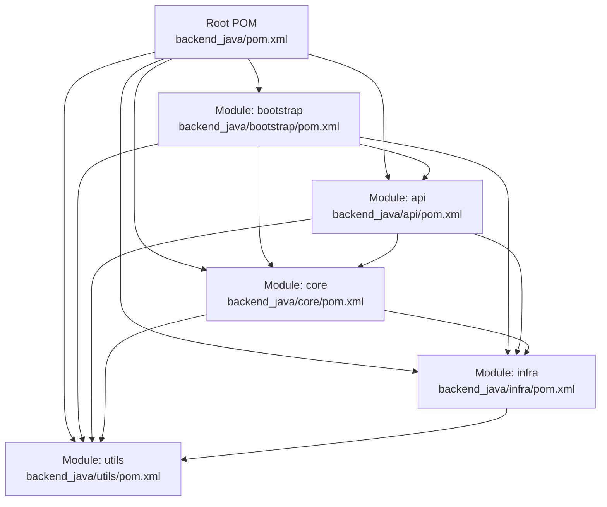
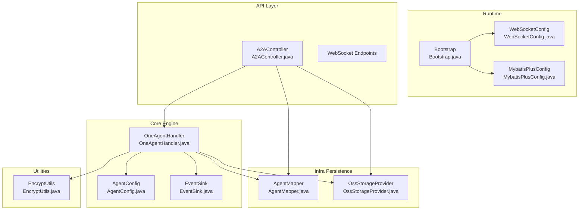
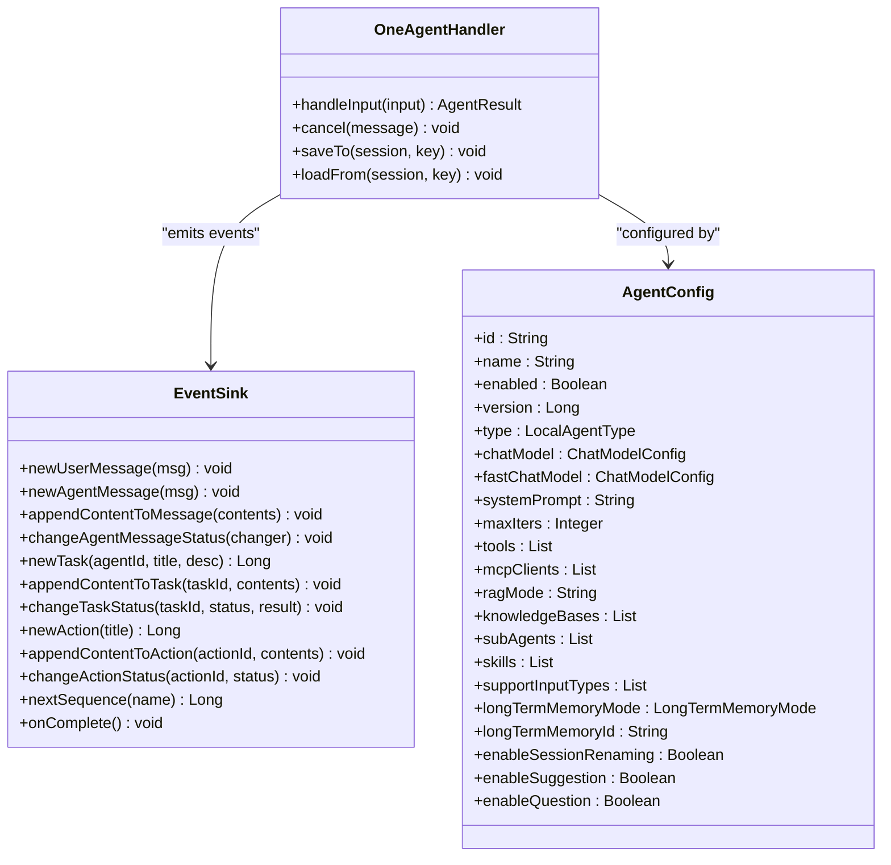
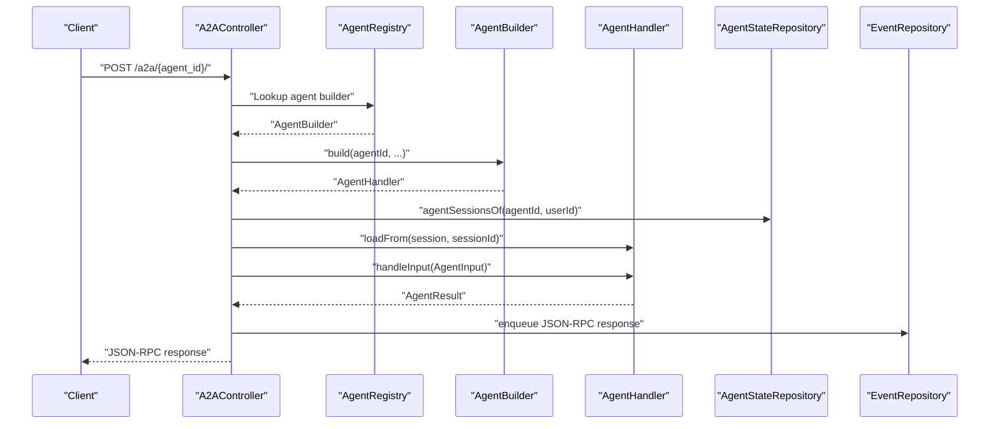
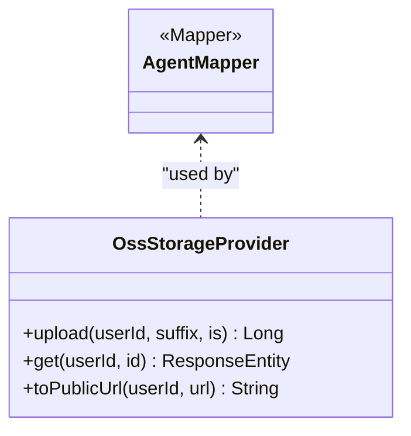
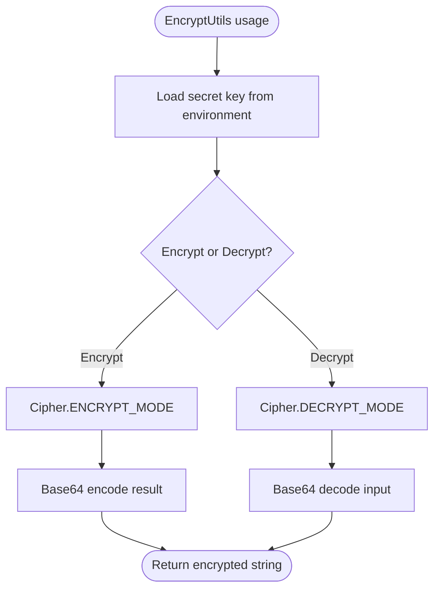
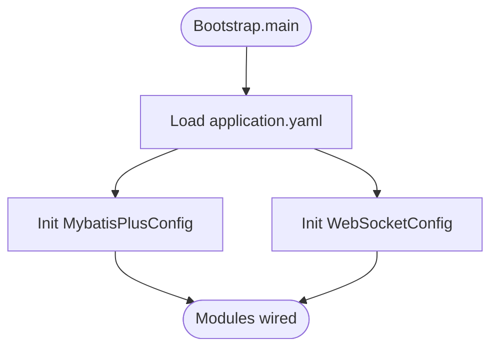
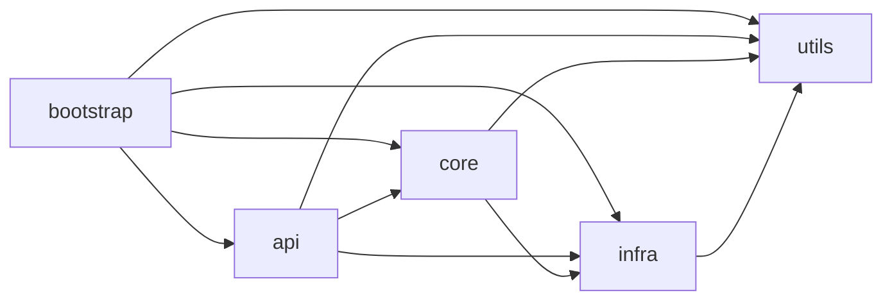

# Module Structure and Dependencies

<cite>
**Referenced Files in This Document**
- [pom.xml](file://backend_java/pom.xml)
- [bootstrap/pom.xml](file://backend_java/bootstrap/pom.xml)
- [core/pom.xml](file://backend_java/core/pom.xml)
- [api/pom.xml](file://backend_java/api/pom.xml)
- [infra/pom.xml](file://backend_java/infra/pom.xml)
- [utils/pom.xml](file://backend_java/utils/pom.xml)
- [Bootstrap.java](file://backend_java/bootstrap/src/main/java/com/aliyun/tam/x/tron/Bootstrap.java)
- [application.yaml](file://backend_java/bootstrap/src/main/resources/application.yaml)
- [WebSocketConfig.java](file://backend_java/bootstrap/src/main/java/com/aliyun/tam/x/tron/config/WebSocketConfig.java)
- [MybatisPlusConfig.java](file://backend_java/bootstrap/src/main/java/com/aliyun/tam/x/tron/config/MybatisPlusConfig.java)
- [OneAgentHandler.java](file://backend_java/core/src/main/java/com/aliyun/tam/x/tron/core/agents/one/OneAgentHandler.java)
- [EventSink.java](file://backend_java/core/src/main/java/com/aliyun/tam/x/tron/core/domain/models/events/EventSink.java)
- [AgentConfig.java](file://backend_java/core/src/main/java/com/aliyun/tam/x/tron/core/config/AgentConfig.java)
- [A2AController.java](file://backend_java/api/src/main/java/com/aliyun/tam/x/tron/api/A2AController.java)
- [AgentMapper.java](file://backend_java/infra/src/main/java/com/aliyun/tam/x/tron/infra/dal/mapper/AgentMapper.java)
- [OssStorageProvider.java](file://backend_java/infra/src/main/java/com/aliyun/tam/x/tron/infra/storage/OssStorageProvider.java)
- [EncryptUtils.java](file://backend_java/utils/src/main/java/com/aliyun/tam/x/tron/utils/encrypt/EncryptUtils.java)
</cite>

## Table of Contents
1. [Introduction](#introduction)
2. [Project Structure](#project-structure)
3. [Core Components](#core-components)
4. [Architecture Overview](#architecture-overview)
5. [Detailed Component Analysis](#detailed-component-analysis)
6. [Dependency Analysis](#dependency-analysis)
7. [Performance Considerations](#performance-considerations)
8. [Troubleshooting Guide](#troubleshooting-guide)
9. [Conclusion](#conclusion)

## Introduction
This document describes the backend module structure and dependency management for the Tron One Agent Java project. It explains the Maven multi-module architecture composed of api, core, infra, utils, and bootstrap modules. It details inter-module dependencies, data flow, and each module’s contribution to the overall system. It also covers the core module responsibilities (agent engine, event sourcing, and business logic), the API module’s REST and WebSocket exposure, the infrastructure module’s data access and persistence, and the utility module’s helper functions and encryption services. Finally, it addresses dependency injection patterns, configuration management, module initialization sequences, module boundaries, and communication through well-defined interfaces.

## Project Structure
The backend is organized as a Maven multi-module project with five primary modules:
- api: Exposes REST endpoints and WebSocket endpoints for client interaction.
- core: Implements the agent engine, orchestration, event sourcing, and business logic.
- infra: Provides the data access layer (MyBatis-Plus), persistence, storage providers, and tracing utilities.
- utils: Offers shared utilities such as encryption helpers and JSON utilities.
- bootstrap: Bootstraps the Spring Boot application, wires configurations, and packages the executable artifact.

**Diagram sources**
- [pom.xml:11-17](file://backend_java/pom.xml#L11-L17)
- [bootstrap/pom.xml:14-44](file://backend_java/bootstrap/pom.xml#L14-L44)
- [api/pom.xml:14-28](file://backend_java/api/pom.xml#L14-L28)
- [core/pom.xml:14-23](file://backend_java/core/pom.xml#L14-L23)
- [infra/pom.xml:14-18](file://backend_java/infra/pom.xml#L14-L18)
- [utils/pom.xml:14-18](file://backend_java/utils/pom.xml#L14-L18)

**Section sources**
- [pom.xml:11-17](file://backend_java/pom.xml#L11-L17)

## Core Components
This section outlines the responsibilities and key components of each module and how they collaborate.

- api module
  - Exposes REST endpoints and WebSocket endpoints.
  - Integrates with the core module to process agent requests and streams responses.
  - Manages JSON-RPC transport for A2A agent execution.
  - Depends on core, infra, and utils.

- core module
  - Contains the agent engine, orchestrator, and business logic.
  - Defines configuration models and event sourcing abstractions.
  - Coordinates tool usage, sub-agent handlers, and streaming updates.
  - Persists session state and emits domain events.

- infra module
  - Provides MyBatis-Plus mappers and repositories for MySQL persistence.
  - Implements storage provider for OSS-backed file handling.
  - Offers sequence generation and tracing utilities.
  - Depends on utils.

- utils module
  - Provides encryption utilities and JSON utilities.
  - Supports configuration-driven encryption keys and AES operations.
  - Supplies shared Spring-managed components.

- bootstrap module
  - Serves as the Spring Boot entrypoint.
  - Registers WebSocket endpoints and MyBatis-Plus interceptors.
  - Loads application configuration and exposes actuator endpoints.

**Section sources**
- [api/pom.xml:14-28](file://backend_java/api/pom.xml#L14-L28)
- [core/pom.xml:14-23](file://backend_java/core/pom.xml#L14-L23)
- [infra/pom.xml:14-18](file://backend_java/infra/pom.xml#L14-L18)
- [utils/pom.xml:14-18](file://backend_java/utils/pom.xml#L14-L18)
- [bootstrap/pom.xml:14-44](file://backend_java/bootstrap/pom.xml#L14-L44)

## Architecture Overview
The system follows a layered, modular architecture:
- api depends on core and infra to serve requests and manage sessions.
- core orchestrates agent execution and emits domain events handled by infra.
- infra persists data and provides storage services.
- utils supplies cross-cutting utilities.
- bootstrap initializes the runtime environment and wiring.

**Diagram sources**
- [Bootstrap.java:25-32](file://backend_java/bootstrap/src/main/java/com/aliyun/tam/x/tron/Bootstrap.java#L25-L32)
- [WebSocketConfig.java:24-36](file://backend_java/bootstrap/src/main/java/com/aliyun/tam/x/tron/config/WebSocketConfig.java#L24-L36)
- [MybatisPlusConfig.java:27-37](file://backend_java/bootstrap/src/main/java/com/aliyun/tam/x/tron/config/MybatisPlusConfig.java#L27-L37)
- [A2AController.java:63-105](file://backend_java/api/src/main/java/com/aliyun/tam/x/tron/api/A2AController.java#L63-L105)
- [OneAgentHandler.java:47-61](file://backend_java/core/src/main/java/com/aliyun/tam/x/tron/core/agents/one/OneAgentHandler.java#L47-L61)
- [AgentConfig.java:35-132](file://backend_java/core/src/main/java/com/aliyun/tam/x/tron/core/config/AgentConfig.java#L35-L132)
- [EventSink.java:38-265](file://backend_java/core/src/main/java/com/aliyun/tam/x/tron/core/domain/models/events/EventSink.java#L38-L265)
- [AgentMapper.java:18-30](file://backend_java/infra/src/main/java/com/aliyun/tam/x/tron/infra/dal/mapper/AgentMapper.java#L18-L30)
- [OssStorageProvider.java:53-200](file://backend_java/infra/src/main/java/com/aliyun/tam/x/tron/infra/storage/OssStorageProvider.java#L53-L200)
- [EncryptUtils.java:18-91](file://backend_java/utils/src/main/java/com/aliyun/tam/x/tron/utils/encrypt/EncryptUtils.java#L18-L91)

## Detailed Component Analysis

### Core Module Responsibilities
The core module is the heart of the agent engine and event-driven orchestration:
- Agent engine and orchestration
  - OneAgentHandler coordinates the main ReAct agent and sub-agent handlers, manages streaming lifecycle, and aggregates usage metrics.
  - Handles cancellation, HITL signaling, and tool invocation tracking.
- Event sourcing and messaging
  - EventSink defines a contract for emitting and persisting session events, tasks, and actions.
  - Supports appending content, changing statuses, and completing messages.
- Business logic and configuration
  - AgentConfig centralizes agent behavior, tools, MCP clients, knowledge bases, and LTM mode.
- Data access boundary
  - Core interacts with infra repositories via interfaces (e.g., SessionRepository, EventRepository) to keep persistence decoupled.

**Diagram sources**
- [OneAgentHandler.java:47-289](file://backend_java/core/src/main/java/com/aliyun/tam/x/tron/core/agents/one/OneAgentHandler.java#L47-L289)
- [EventSink.java:38-265](file://backend_java/core/src/main/java/com/aliyun/tam/x/tron/core/domain/models/events/EventSink.java#L38-L265)
- [AgentConfig.java:35-132](file://backend_java/core/src/main/java/com/aliyun/tam/x/tron/core/config/AgentConfig.java#L35-L132)

**Section sources**
- [OneAgentHandler.java:74-272](file://backend_java/core/src/main/java/com/aliyun/tam/x/tron/core/agents/one/OneAgentHandler.java#L74-L272)
- [EventSink.java:60-264](file://backend_java/core/src/main/java/com/aliyun/tam/x/tron/core/domain/models/events/EventSink.java#L60-L264)
- [AgentConfig.java:35-132](file://backend_java/core/src/main/java/com/aliyun/tam/x/tron/core/config/AgentConfig.java#L35-L132)

### API Module: REST and WebSocket Exposure
The API module exposes:
- REST endpoints for health, configuration, file operations, and debugging.
- A2A JSON-RPC transport for external agent execution.
- WebSocket endpoints for real-time communication.

Key integration points:
- A2AController integrates with AgentRegistry, SessionRepository, EventRepository, AgentStateRepository, and SequenceService to orchestrate agent execution and stream results.
- WebSocketConfig registers the ServerEndpointExporter for WebSocket support.

**Diagram sources**
- [A2AController.java:107-128](file://backend_java/api/src/main/java/com/aliyun/tam/x/tron/api/A2AController.java#L107-L128)
- [A2AController.java:130-222](file://backend_java/api/src/main/java/com/aliyun/tam/x/tron/api/A2AController.java#L130-L222)
- [A2AController.java:224-240](file://backend_java/api/src/main/java/com/aliyun/tam/x/tron/api/A2AController.java#L224-L240)

**Section sources**
- [A2AController.java:63-105](file://backend_java/api/src/main/java/com/aliyun/tam/x/tron/api/A2AController.java#L63-L105)
- [WebSocketConfig.java:24-36](file://backend_java/bootstrap/src/main/java/com/aliyun/tam/x/tron/config/WebSocketConfig.java#L24-L36)

### Infrastructure Module: Data Access and Persistence
The infra module provides:
- MyBatis-Plus mappers and repositories for MySQL persistence.
- OSS-backed storage provider for file uploads and signed URLs.
- Sequence generation for identifiers.

**Diagram sources**
- [AgentMapper.java:18-30](file://backend_java/infra/src/main/java/com/aliyun/tam/x/tron/infra/dal/mapper/AgentMapper.java#L18-L30)
- [OssStorageProvider.java:53-200](file://backend_java/infra/src/main/java/com/aliyun/tam/x/tron/infra/storage/OssStorageProvider.java#L53-L200)

**Section sources**
- [AgentMapper.java:18-30](file://backend_java/infra/src/main/java/com/aliyun/tam/x/tron/infra/dal/mapper/AgentMapper.java#L18-L30)
- [OssStorageProvider.java:90-134](file://backend_java/infra/src/main/java/com/aliyun/tam/x/tron/infra/storage/OssStorageProvider.java#L90-L134)

### Utility Module: Encryption and Helpers
The utils module provides:
- Encryption utilities supporting AES encryption/decryption and key management.
- JSON utilities for serialization/deserialization.

**Diagram sources**
- [EncryptUtils.java:30-91](file://backend_java/utils/src/main/java/com/aliyun/tam/x/tron/utils/encrypt/EncryptUtils.java#L30-L91)

**Section sources**
- [EncryptUtils.java:30-91](file://backend_java/utils/src/main/java/com/aliyun/tam/x/tron/utils/encrypt/EncryptUtils.java#L30-L91)

### Configuration Management and Initialization
Configuration is managed centrally:
- application.yaml defines server port, context path, datasource, Jackson settings, multipart limits, MyBatis-Plus global config, A2A server toggles, provider credentials, file server base URL, OSS settings, encryption key, and actuator endpoints.
- MybatisPlusConfig registers pagination interceptor and mapper scanning.
- WebSocketConfig conditionally exposes ServerEndpointExporter for Servlet environments.

**Diagram sources**
- [Bootstrap.java:25-32](file://backend_java/bootstrap/src/main/java/com/aliyun/tam/x/tron/Bootstrap.java#L25-L32)
- [application.yaml:1-63](file://backend_java/bootstrap/src/main/resources/application.yaml#L1-L63)
- [MybatisPlusConfig.java:27-37](file://backend_java/bootstrap/src/main/java/com/aliyun/tam/x/tron/config/MybatisPlusConfig.java#L27-L37)
- [WebSocketConfig.java:24-36](file://backend_java/bootstrap/src/main/java/com/aliyun/tam/x/tron/config/WebSocketConfig.java#L24-L36)

**Section sources**
- [application.yaml:1-63](file://backend_java/bootstrap/src/main/resources/application.yaml#L1-L63)
- [MybatisPlusConfig.java:27-37](file://backend_java/bootstrap/src/main/java/com/aliyun/tam/x/tron/config/MybatisPlusConfig.java#L27-L37)
- [WebSocketConfig.java:24-36](file://backend_java/bootstrap/src/main/java/com/aliyun/tam/x/tron/config/WebSocketConfig.java#L24-L36)

## Dependency Analysis
Inter-module dependencies are declared in each module’s POM. The bootstrap module aggregates all modules and serves as the packaging unit. The api module depends on core, infra, and utils. The core module depends on infra and utils. The infra module depends on utils.

**Diagram sources**
- [bootstrap/pom.xml:14-44](file://backend_java/bootstrap/pom.xml#L14-L44)
- [api/pom.xml:14-28](file://backend_java/api/pom.xml#L14-L28)
- [core/pom.xml:14-23](file://backend_java/core/pom.xml#L14-L23)
- [infra/pom.xml:14-18](file://backend_java/infra/pom.xml#L14-L18)
- [utils/pom.xml:14-18](file://backend_java/utils/pom.xml#L14-L18)

**Section sources**
- [bootstrap/pom.xml:14-44](file://backend_java/bootstrap/pom.xml#L14-L44)
- [api/pom.xml:14-28](file://backend_java/api/pom.xml#L14-L28)
- [core/pom.xml:14-23](file://backend_java/core/pom.xml#L14-L23)
- [infra/pom.xml:14-18](file://backend_java/infra/pom.xml#L14-L18)
- [utils/pom.xml:14-18](file://backend_java/utils/pom.xml#L14-L18)

## Performance Considerations
- Streaming and asynchronous processing
  - OneAgentHandler uses reactive streaming to emit incremental tokens and tool results, reducing perceived latency.
- Concurrency and throughput
  - A2AController employs a bounded thread pool for JSON-RPC request handling to prevent resource exhaustion.
- Persistence efficiency
  - MyBatis-Plus pagination interceptor reduces result set sizes for large datasets.
- Caching
  - OSS signed URL caching minimizes repeated signature computations for file retrieval.

[No sources needed since this section provides general guidance]

## Troubleshooting Guide
Common areas to inspect:
- Configuration
  - Verify database connectivity and credentials in application.yaml.
  - Confirm actuator endpoints and metrics exposure.
- Encryption
  - Ensure TRON_ENCRYPT_KEY is set appropriately; otherwise, a default key is used.
- Storage
  - Validate OSS bucket, region, endpoint, and credentials when using OSS file provider.
- WebSocket
  - Confirm WebSocketConfig is loaded only in Servlet environments.

**Section sources**
- [application.yaml:9-51](file://backend_java/bootstrap/src/main/resources/application.yaml#L9-L51)
- [EncryptUtils.java:30-51](file://backend_java/utils/src/main/java/com/aliyun/tam/x/tron/utils/encrypt/EncryptUtils.java#L30-L51)
- [OssStorageProvider.java:58-198](file://backend_java/infra/src/main/java/com/aliyun/tam/x/tron/infra/storage/OssStorageProvider.java#L58-L198)
- [WebSocketConfig.java:24-36](file://backend_java/bootstrap/src/main/java/com/aliyun/tam/x/tron/config/WebSocketConfig.java#L24-L36)

## Conclusion
The backend employs a clean, modular architecture with well-defined boundaries:
- api focuses on transport and presentation.
- core encapsulates agent orchestration and event sourcing.
- infra handles persistence and storage.
- utils provides reusable utilities.
- bootstrap initializes the runtime and wiring.

Dependencies are explicit and managed via Maven, enabling maintainability and testability. The design supports extensibility through interfaces (e.g., EventSink, StorageProvider) and configuration-driven behavior (e.g., AgentConfig, application.yaml).