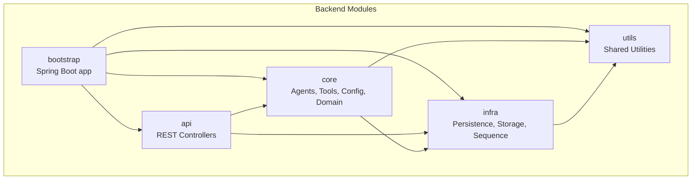
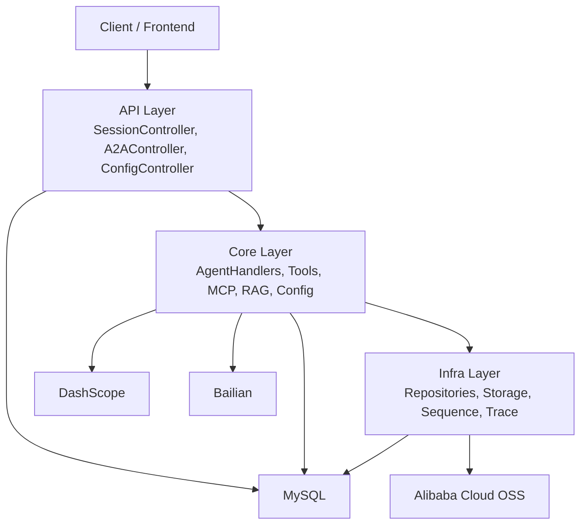
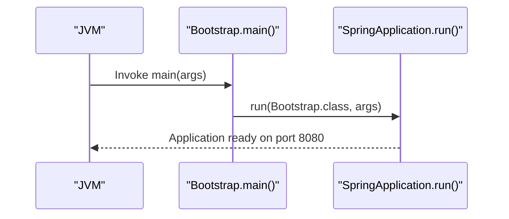
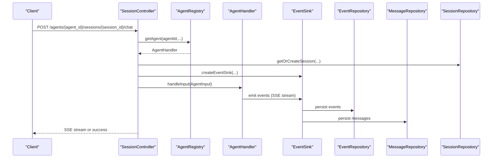
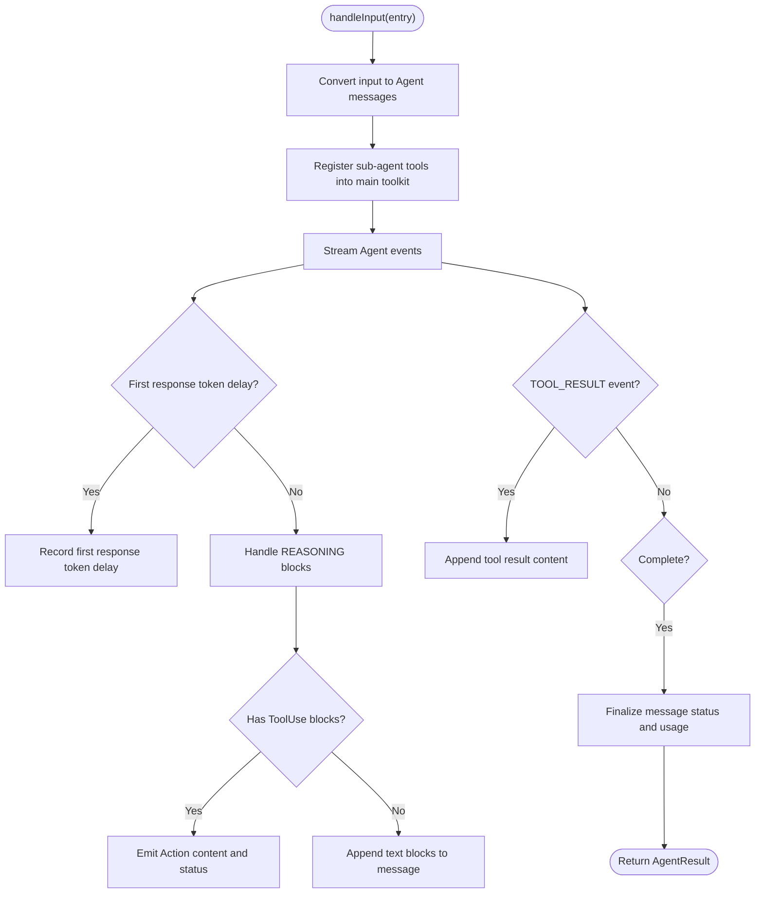
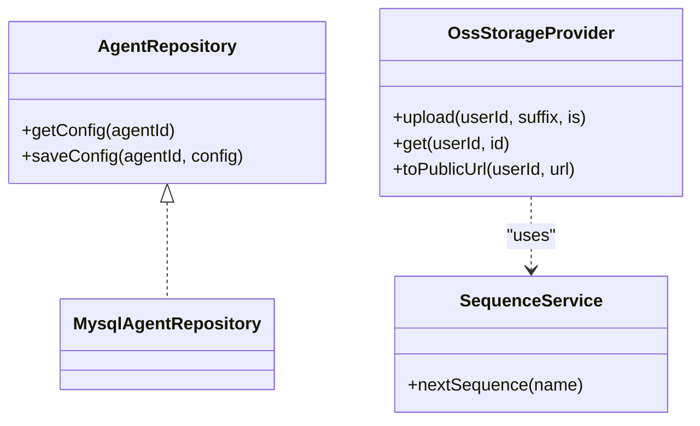
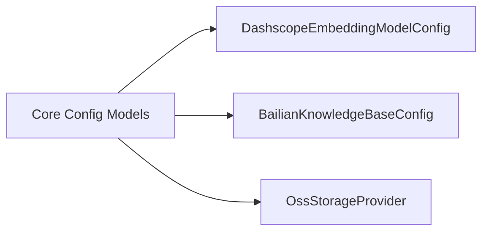
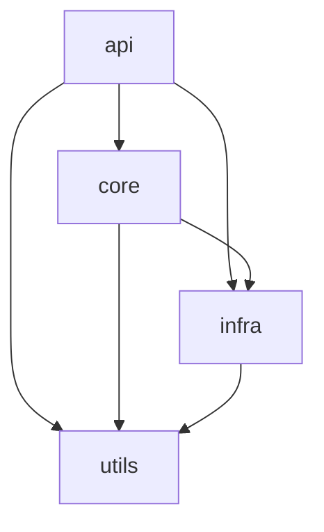

# System Overview

<cite>
**Referenced Files in This Document**
- [Bootstrap.java](file://backend_java/bootstrap/src/main/java/com/aliyun/tam/x/tron/Bootstrap.java)
- [application.yaml](file://backend_java/bootstrap/src/main/resources/application.yaml)
- [init.sql](file://backend_java/bootstrap/src/main/resources/schema/init.sql)
- [pom.xml](file://backend_java/pom.xml)
- [README.MD](file://backend_java/README.MD)
- [SessionController.java](file://backend_java/api/src/main/java/com/aliyun/tam/x/tron/api/SessionController.java)
- [A2AController.java](file://backend_java/api/src/main/java/com/aliyun/tam/x/tron/api/A2AController.java)
- [ConfigController.java](file://backend_java/api/src/main/java/com/aliyun/tam/x/tron/api/ConfigController.java)
- [OneAgentHandler.java](file://backend_java/core/src/main/java/com/aliyun/tam/x/tron/core/agents/one/OneAgentHandler.java)
- [AgentRepository.java](file://backend_java/core/src/main/java/com/aliyun/tam/x/tron/core/domain/repository/AgentRepository.java)
- [OssStorageProvider.java](file://backend_java/infra/src/main/java/com/aliyun/tam/x/tron/infra/storage/OssStorageProvider.java)
- [DashscopeEmbeddingModelConfig.java](file://backend_java/core/src/main/java/com/aliyun/tam/x/tron/core/config/DashscopeEmbeddingModelConfig.java)
- [BailianKnowledgeBaseConfig.java](file://backend_java/core/src/main/java/com/aliyun/tam/x/tron/core/config/BailianKnowledgeBaseConfig.java)
- [WebSocketConfig.java](file://backend_java/bootstrap/src/main/java/com/aliyun/tam/x/tron/config/WebSocketConfig.java)
- [api/pom.xml](file://backend_java/api/pom.xml)
- [core/pom.xml](file://backend_java/core/pom.xml)
- [infra/pom.xml](file://backend_java/infra/pom.xml)
- [utils/pom.xml](file://backend_java/utils/pom.xml)
</cite>

## Table of Contents
1. [Introduction](#introduction)
2. [Project Structure](#project-structure)
3. [Core Components](#core-components)
4. [Architecture Overview](#architecture-overview)
5. [Detailed Component Analysis](#detailed-component-analysis)
6. [Dependency Analysis](#dependency-analysis)
7. [Performance Considerations](#performance-considerations)
8. [Troubleshooting Guide](#troubleshooting-guide)
9. [Conclusion](#conclusion)

## Introduction
This document presents a comprehensive overview of the Tron OneAgent backend system built on Spring Boot 3.5.9. It explains the modular architecture, the role of the Bootstrap application entry point, and how the API, core, infrastructure, and utility layers collaborate to deliver an AI agent platform. It also covers integrations with Alibaba AgentScope Java framework and external services such as DashScope, Bailian, and Alibaba Cloud OSS. The goal is to help both beginners and experienced developers understand the high-level design and implementation details.

## Project Structure
The backend is organized as a multi-module Maven project with five primary modules:
- api: REST API layer exposing session, configuration, debug, and A2A endpoints
- core: business logic for agents, tools, knowledge bases, RAG, MCP clients, and domain models
- infra: persistence, storage, sequences, and tracing
- utils: shared utilities and encryption helpers
- bootstrap: Spring Boot application entry point and configuration

**Diagram sources**
- [pom.xml:11-16](file://backend_java/pom.xml#L11-L16)
- [api/pom.xml:14-28](file://backend_java/api/pom.xml#L14-L28)
- [core/pom.xml:14-23](file://backend_java/core/pom.xml#L14-L23)
- [infra/pom.xml:14-18](file://backend_java/infra/pom.xml#L14-L18)
- [utils/pom.xml:14-22](file://backend_java/utils/pom.xml#L14-L22)

**Section sources**
- [pom.xml:11-16](file://backend_java/pom.xml#L11-L16)
- [README.MD:38-52](file://backend_java/README.MD#L38-L52)

## Core Components
- Bootstrap application entry point
  - Declares Spring Boot application with async and scheduling enabled and runs the SpringApplication.
- Configuration and environment
  - Application YAML defines server port, context path, database connection, multipart limits, MyBatis-Plus settings, AgentScope A2A toggle, and platform-specific keys for DashScope, Bailian, OSS, and encryption.
- Database schema
  - Initialization SQL defines tables for agents, sessions, messages, session events, MCP clients, knowledge base configs, skill configs, files, long-term memory configs, and OSS files.

**Section sources**
- [Bootstrap.java:25-31](file://backend_java/bootstrap/src/main/java/com/aliyun/tam/x/tron/Bootstrap.java#L25-L31)
- [application.yaml:1-63](file://backend_java/bootstrap/src/main/resources/application.yaml#L1-L63)
- [init.sql:15-207](file://backend_java/bootstrap/src/main/resources/schema/init.sql#L15-L207)

## Architecture Overview
The system follows a layered architecture:
- API layer handles HTTP requests and SSE streaming, orchestrating agent execution and event emission.
- Core layer implements agent strategies (ReAct and OneAgent), toolkits, MCP clients, knowledge base integrations, and domain models.
- Infra layer manages persistence via MyBatis-Plus, file storage via OSS, sequence generation, and observability.
- Utils layer provides shared utilities and encryption support.

External integrations:
- AgentScope Java framework powers agent orchestration and A2A protocol support.
- DashScope SDK integrates with Qwen models and embeddings.
- Bailian SDK integrates with Alibaba Cloud knowledge base services.
- Alibaba Cloud OSS provides secure, signed URLs for media assets.

**Diagram sources**
- [SessionController.java:80-84](file://backend_java/api/src/main/java/com/aliyun/tam/x/tron/api/SessionController.java#L80-L84)
- [A2AController.java:67-67](file://backend_java/api/src/main/java/com/aliyun/tam/x/tron/api/A2AController.java#L67-L67)
- [ConfigController.java:54-56](file://backend_java/api/src/main/java/com/aliyun/tam/x/tron/api/ConfigController.java#L54-L56)
- [DashscopeEmbeddingModelConfig.java:26-59](file://backend_java/core/src/main/java/com/aliyun/tam/x/tron/core/config/DashscopeEmbeddingModelConfig.java#L26-L59)
- [BailianKnowledgeBaseConfig.java:25-75](file://backend_java/core/src/main/java/com/aliyun/tam/x/tron/core/config/BailianKnowledgeBaseConfig.java#L25-L75)
- [OssStorageProvider.java:53-58](file://backend_java/infra/src/main/java/com/aliyun/tam/x/tron/infra/storage/OssStorageProvider.java#L53-L58)

## Detailed Component Analysis

### Bootstrap Application Entry Point
- Purpose: Initializes the Spring Boot application and enables async/scheduling capabilities.
- Behavior: Extends SpringApplication and delegates to run with the Bootstrap class as the primary source.

**Diagram sources**
- [Bootstrap.java:25-31](file://backend_java/bootstrap/src/main/java/com/aliyun/tam/x/tron/Bootstrap.java#L25-L31)

**Section sources**
- [Bootstrap.java:25-31](file://backend_java/bootstrap/src/main/java/com/aliyun/tam/x/tron/Bootstrap.java#L25-L31)

### API Layer: Session, A2A, and Config Controllers
- SessionController
  - Manages session lifecycle, chat initiation, and event streaming via SSE.
  - Uses repositories to persist messages and events, and wraps the EventSink for real-time updates.
- A2AController
  - Exposes A2A agent card discovery and JSON-RPC execution endpoint.
  - Bridges remote agents to local execution using AgentExecutor and wraps transport via JsonRpcTransportWrapper.
- ConfigController
  - Provides dynamic runtime configuration management for agents, tools, MCP clients, knowledge bases, skills, and long-term memory.

**Diagram sources**
- [SessionController.java:308-346](file://backend_java/api/src/main/java/com/aliyun/tam/x/tron/api/SessionController.java#L308-L346)
- [SessionController.java:348-409](file://backend_java/api/src/main/java/com/aliyun/tam/x/tron/api/SessionController.java#L348-L409)
- [A2AController.java:107-128](file://backend_java/api/src/main/java/com/aliyun/tam/x/tron/api/A2AController.java#L107-L128)
- [A2AController.java:130-222](file://backend_java/api/src/main/java/com/aliyun/tam/x/tron/api/A2AController.java#L130-L222)

**Section sources**
- [SessionController.java:80-564](file://backend_java/api/src/main/java/com/aliyun/tam/x/tron/api/SessionController.java#L80-L564)
- [A2AController.java:67-241](file://backend_java/api/src/main/java/com/aliyun/tam/x/tron/api/A2AController.java#L67-L241)
- [ConfigController.java:54-483](file://backend_java/api/src/main/java/com/aliyun/tam/x/tron/api/ConfigController.java#L54-L483)

### Core Layer: Agent Execution and Event Sourcing
- OneAgentHandler
  - Orchestrates reasoning, tool use, and sub-agent tasks.
  - Emits structured events for content append, status changes, and action/tool results.
  - Integrates with AgentScope’s ReActAgent and maintains usage metrics and cancellation semantics.

**Diagram sources**
- [OneAgentHandler.java:74-272](file://backend_java/core/src/main/java/com/aliyun/tam/x/tron/core/agents/one/OneAgentHandler.java#L74-L272)

**Section sources**
- [OneAgentHandler.java:47-289](file://backend_java/core/src/main/java/com/aliyun/tam/x/tron/core/agents/one/OneAgentHandler.java#L47-L289)

### Infrastructure Layer: Persistence, Storage, and Sequences
- Repositories and DAL
  - Interfaces define contract for agent, session, message, event, and file repositories.
- Storage Provider
  - OSS-backed provider uploads files, generates pre-signed URLs, and caches public URLs for efficient retrieval.
- Sequence Service
  - Centralized sequence generation for message IDs and file IDs.

**Diagram sources**
- [AgentRepository.java:22-27](file://backend_java/core/src/main/java/com/aliyun/tam/x/tron/core/domain/repository/AgentRepository.java#L22-L27)
- [OssStorageProvider.java:58-109](file://backend_java/infra/src/main/java/com/aliyun/tam/x/tron/infra/storage/OssStorageProvider.java#L58-L109)

**Section sources**
- [AgentRepository.java:22-27](file://backend_java/core/src/main/java/com/aliyun/tam/x/tron/core/domain/repository/AgentRepository.java#L22-L27)
- [OssStorageProvider.java:58-200](file://backend_java/infra/src/main/java/com/aliyun/tam/x/tron/infra/storage/OssStorageProvider.java#L58-L200)

### External Integrations: DashScope, Bailian, and OSS
- DashScope
  - Embedding model configuration supports API key, base URL, model name, and dimensions.
- Bailian
  - Knowledge base configuration supports workspace and index IDs, rewrite/rerank toggles, and model parameters.
- OSS
  - Secure pre-signed URL generation with caching and host normalization.

**Diagram sources**
- [DashscopeEmbeddingModelConfig.java:26-59](file://backend_java/core/src/main/java/com/aliyun/tam/x/tron/core/config/DashscopeEmbeddingModelConfig.java#L26-L59)
- [BailianKnowledgeBaseConfig.java:25-75](file://backend_java/core/src/main/java/com/aliyun/tam/x/tron/core/config/BailianKnowledgeBaseConfig.java#L25-L75)
- [OssStorageProvider.java:58-175](file://backend_java/infra/src/main/java/com/aliyun/tam/x/tron/infra/storage/OssStorageProvider.java#L58-L175)

**Section sources**
- [DashscopeEmbeddingModelConfig.java:26-61](file://backend_java/core/src/main/java/com/aliyun/tam/x/tron/core/config/DashscopeEmbeddingModelConfig.java#L26-L61)
- [BailianKnowledgeBaseConfig.java:25-76](file://backend_java/core/src/main/java/com/aliyun/tam/x/tron/core/config/BailianKnowledgeBaseConfig.java#L25-L76)
- [OssStorageProvider.java:58-200](file://backend_java/infra/src/main/java/com/aliyun/tam/x/tron/infra/storage/OssStorageProvider.java#L58-L200)

## Dependency Analysis
Module-level dependencies:
- api depends on core, infra, and utils
- core depends on infra and utils, plus external frameworks (AgentScope, DashScope, Bailian, A2A SDKs)
- infra depends on utils and persistence/observability libraries
- utils depends on Spring context and Jackson

**Diagram sources**
- [api/pom.xml:14-28](file://backend_java/api/pom.xml#L14-L28)
- [core/pom.xml:14-23](file://backend_java/core/pom.xml#L14-L23)
- [infra/pom.xml:14-18](file://backend_java/infra/pom.xml#L14-L18)
- [utils/pom.xml:14-22](file://backend_java/utils/pom.xml#L14-L22)

**Section sources**
- [api/pom.xml:14-54](file://backend_java/api/pom.xml#L14-L54)
- [core/pom.xml:14-87](file://backend_java/core/pom.xml#L14-L87)
- [infra/pom.xml:14-71](file://backend_java/infra/pom.xml#L14-L71)
- [utils/pom.xml:14-23](file://backend_java/utils/pom.xml#L14-L23)

## Performance Considerations
- Concurrency and threading
  - Controllers use dedicated thread pools for SSE and chat execution to avoid blocking the main request threads.
- Streaming and SSE
  - SSE streaming is used for real-time event delivery; ensure client-side consumption to prevent memory buildup.
- Storage and caching
  - OSS pre-signed URL caching reduces signature generation overhead for repeated access.
- Database throughput
  - Event sourcing writes events and aggregates messages; ensure proper indexing on session_id and agent_id for fast lookups.

[No sources needed since this section provides general guidance]

## Troubleshooting Guide
- Environment variables
  - Ensure DB credentials, DashScope API key, and Alibaba Cloud OSS keys are set according to application YAML placeholders.
- Database initialization
  - Run the provided initialization script against the configured database to create required tables.
- WebSocket availability
  - Confirm WebSocket configuration is loaded in servlet environments for WebSocket endpoints.
- A2A agent card and execution
  - Verify agent card endpoint returns a valid AgentCard and that the A2A executor can resolve the agent builder.

**Section sources**
- [application.yaml:9-51](file://backend_java/bootstrap/src/main/resources/application.yaml#L9-L51)
- [init.sql:15-207](file://backend_java/bootstrap/src/main/resources/schema/init.sql#L15-L207)
- [WebSocketConfig.java:24-36](file://backend_java/bootstrap/src/main/java/com/aliyun/tam/x/tron/config/WebSocketConfig.java#L24-L36)
- [A2AController.java:91-105](file://backend_java/api/src/main/java/com/aliyun/tam/x/tron/api/A2AController.java#L91-L105)

## Conclusion
The Tron OneAgent backend is a modular, event-driven Spring Boot application that integrates Alibaba AgentScope with external providers (DashScope, Bailian, OSS) to deliver a production-ready AI agent platform. The Bootstrap entry point initializes the application, while the API, Core, Infra, and Utils modules collaborate to manage sessions, agent orchestration, persistence, and storage. The architecture supports dynamic configuration, real-time streaming, and extensible integrations, enabling rapid development of enterprise-grade AI applications.