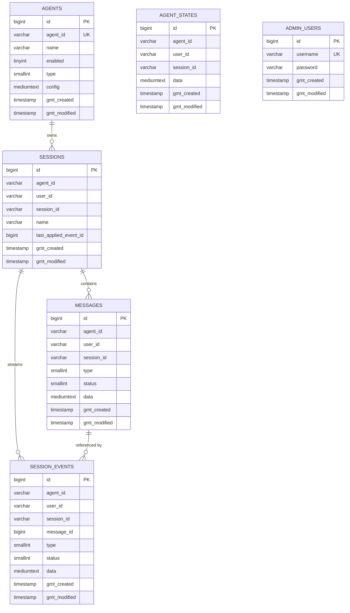
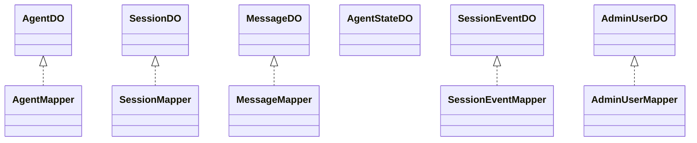
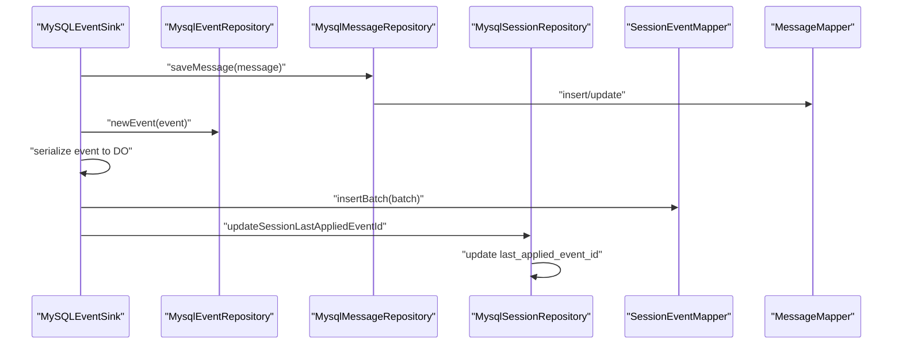
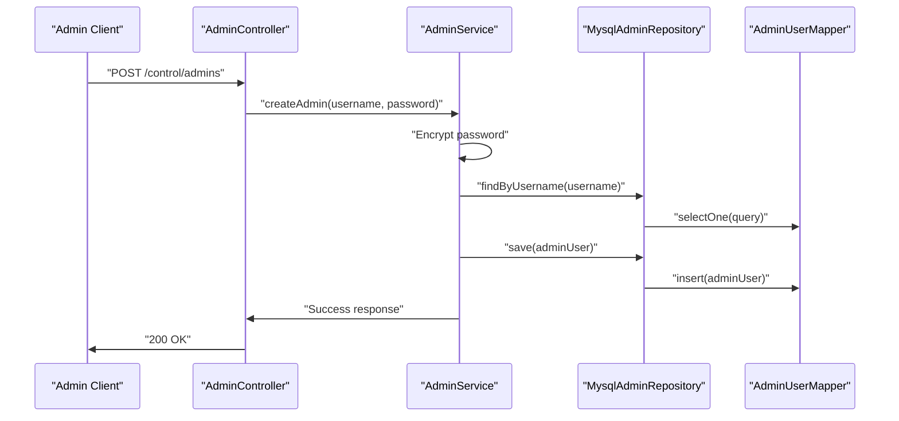
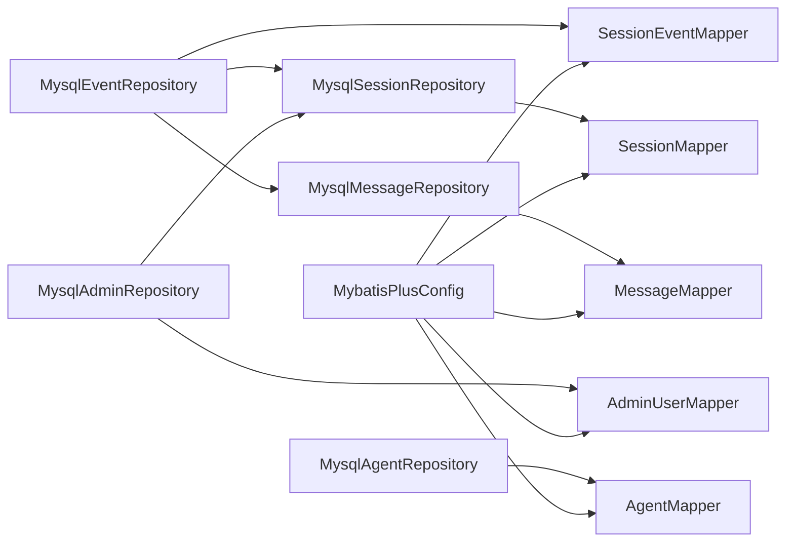

# Database Schema and Data Models

<cite>
**Referenced Files in This Document**
- [init.sql](file://backend_java/bootstrap/src/main/resources/schema/init.sql)
- [AgentDO.java](file://backend_java/infra/src/main/java/com/aliyun/tam/x/tron/infra/dal/dataobject/AgentDO.java)
- [SessionDO.java](file://backend_java/infra/src/main/java/com/aliyun/tam/x/tron/infra/dal/dataobject/SessionDO.java)
- [MessageDO.java](file://backend_java/infra/src/main/java/com/aliyun/tam/x/tron/infra/dal/dataobject/MessageDO.java)
- [AgentStateDO.java](file://backend_java/infra/src/main/java/com/aliyun/tam/x/tron/infra/dal/dataobject/AgentStateDO.java)
- [SessionEventDO.java](file://backend_java/infra/src/main/java/com/aliyun/tam/x/tron/infra/dal/dataobject/SessionEventDO.java)
- [AdminUserDO.java](file://backend_java/infra/src/main/java/com/aliyun/tam/x/tron/infra/dal/dataobject/AdminUserDO.java)
- [AgentMapper.java](file://backend_java/infra/src/main/java/com/aliyun/tam/x/tron/infra/dal/mapper/AgentMapper.java)
- [SessionMapper.java](file://backend_java/infra/src/main/java/com/aliyun/tam/x/tron/infra/dal/mapper/SessionMapper.java)
- [MessageMapper.java](file://backend_java/infra/src/main/java/com/aliyun/tam/x/tron/infra/dal/mapper/MessageMapper.java)
- [SessionEventMapper.java](file://backend_java/infra/src/main/java/com/aliyun/tam/x/tron/infra/dal/mapper/SessionEventMapper.java)
- [AdminUserMapper.java](file://backend_java/infra/src/main/java/com/aliyun/tam/x/tron/infra/dal/mapper/AdminUserMapper.java)
- [MybatisPlusConfig.java](file://backend_java/bootstrap/src/main/java/com/aliyun/tam/x/tron/config/MybatisPlusConfig.java)
- [MysqlAgentRepository.java](file://backend_java/core/src/main/java/com/aliyun/tam/x/tron/core/domain/repository/mysql/MysqlAgentRepository.java)
- [MysqlSessionRepository.java](file://backend_java/core/src/main/java/com/aliyun/tam/x/tron/core/domain/repository/mysql/MysqlSessionRepository.java)
- [MysqlMessageRepository.java](file://backend_java/core/src/main/java/com/aliyun/tam/x/tron/core/domain/repository/mysql/MysqlMessageRepository.java)
- [MysqlEventRepository.java](file://backend_java/core/src/main/java/com/aliyun/tam/x/tron/core/domain/repository/mysql/MysqlEventRepository.java)
- [MysqlAdminRepository.java](file://backend_java/core/src/main/java/com/aliyun/tam/x/tron/core/domain/repository/mysql/MysqlAdminRepository.java)
- [AdminRepository.java](file://backend_java/core/src/main/java/com/aliyun/tam/x/tron/core/domain/repository/AdminRepository.java)
- [AdminController.java](file://backend_java/api/src/main/java/com/aliyun/tam/x/tron/api/AdminController.java)
- [AdminService.java](file://backend_java/core/src/main/java/com/aliyun/tam/x/tron/core/domain/service/AdminService.java)
- [AdminDTO.java](file://backend_java/api/src/main/java/com/aliyun/tam/x/tron/api/dto/AdminDTO.java)
- [CreateAdminRequest.java](file://backend_java/api/src/main/java/com/aliyun/tam/x/tron/api/request/CreateAdminRequest.java)
- [UpdateAdminRequest.java](file://backend_java/api/src/main/java/com/aliyun/tam/x/tron/api/request/UpdateAdminRequest.java)
</cite>

## Update Summary
**Changes Made**
- Added new Admin Management System section documenting admin_users table and related components
- Updated Core Components section to include AdminUserDO entity
- Enhanced Architecture Overview with admin user relationships
- Added Admin Management API endpoints and data flow diagrams
- Updated Schema Reference with admin_users table constraints
- Added Admin Service and Repository implementation details

## Table of Contents
1. [Introduction](#introduction)
2. [Project Structure](#project-structure)
3. [Core Components](#core-components)
4. [Architecture Overview](#architecture-overview)
5. [Detailed Component Analysis](#detailed-component-analysis)
6. [Admin Management System](#admin-management-system)
7. [Dependency Analysis](#dependency-analysis)
8. [Performance Considerations](#performance-considerations)
9. [Troubleshooting Guide](#troubleshooting-guide)
10. [Conclusion](#conclusion)
11. [Appendices](#appendices)

## Introduction
This document describes the database schema and data models used by Tron OneAgent's backend Java module. It focuses on the event-sourced design centered around Agents, Sessions, Messages, Agent States, Session Events, and the newly added Admin Management System. The document details table structures, constraints, indexes, and relationships, and explains how the system persists immutable event streams and maintains audit trails. It also covers MyBatis-Plus access patterns, batching strategies, and operational considerations such as indexing, partitioning, retention, migrations, backups, and disaster recovery.

## Project Structure
The database schema is initialized via a single SQL script and mapped to Java entities and MyBatis-Plus mappers. Repositories encapsulate CRUD and transactional operations, while a specialized event sink batches and persists events atomically. The admin management system adds a new layer of administrative capabilities with dedicated entities, mappers, repositories, and API controllers.

```mermaid
graph TB
subgraph "Schema Initialization"
INIT["init.sql"]
END
subgraph "Core Domain Entities"
AG["AgentDO"]
SESS["SessionDO"]
MSG["MessageDO"]
AST["AgentStateDO"]
EVT["SessionEventDO"]
END
subgraph "Admin Management Entities"
ADM["AdminUserDO"]
END
subgraph "MyBatis-Plus Layer"
MAP_A["AgentMapper"]
MAP_S["SessionMapper"]
MAP_M["MessageMapper"]
MAP_EVT["SessionEventMapper"]
MAP_ADM["AdminUserMapper"]
END
subgraph "Core Repositories"
REPO_AG["MysqlAgentRepository"]
REPO_SESS["MysqlSessionRepository"]
REPO_MSG["MysqlMessageRepository"]
REPO_EVT["MysqlEventRepository"]
END
subgraph "Admin Repositories"
REPO_ADM["MysqlAdminRepository"]
REPO_ADM_INTF["AdminRepository"]
END
subgraph "API Layer"
CTRL_ADM["AdminController"]
SERV_ADM["AdminService"]
DTO_ADM["AdminDTO"]
REQ_ADM["CreateAdminRequest/UpdateAdminRequest"]
END
INIT --> AG
INIT --> SESS
INIT --> MSG
INIT --> AST
INIT --> EVT
INIT --> ADM
AG --> MAP_A
SESS --> MAP_S
MSG --> MAP_M
EVT --> MAP_EVT
ADM --> MAP_ADM
MAP_A --> REPO_AG
MAP_S --> REPO_SESS
MAP_M --> REPO_MSG
MAP_EVT --> REPO_EVT
MAP_ADM --> REPO_ADM
REPO_ADM_INTF --> REPO_ADM
CTRL_ADM --> SERV_ADM
SERV_ADM --> REPO_ADM
```

**Diagram sources**
- [init.sql](file://backend_java/bootstrap/src/main/resources/schema/init.sql)
- [AgentDO.java](file://backend_java/infra/src/main/java/com/aliyun/tam/x/tron/infra/dal/dataobject/AgentDO.java)
- [SessionDO.java](file://backend_java/infra/src/main/java/com/aliyun/tam/x/tron/infra/dal/dataobject/SessionDO.java)
- [MessageDO.java](file://backend_java/infra/src/main/java/com/aliyun/tam/x/tron/infra/dal/dataobject/MessageDO.java)
- [AgentStateDO.java](file://backend_java/infra/src/main/java/com/aliyun/tam/x/tron/infra/dal/dataobject/AgentStateDO.java)
- [SessionEventDO.java](file://backend_java/infra/src/main/java/com/aliyun/tam/x/tron/infra/dal/dataobject/SessionEventDO.java)
- [AdminUserDO.java](file://backend_java/infra/src/main/java/com/aliyun/tam/x/tron/infra/dal/dataobject/AdminUserDO.java)
- [AgentMapper.java](file://backend_java/infra/src/main/java/com/aliyun/tam/x/tron/infra/dal/mapper/AgentMapper.java)
- [SessionMapper.java](file://backend_java/infra/src/main/java/com/aliyun/tam/x/tron/infra/dal/mapper/SessionMapper.java)
- [MessageMapper.java](file://backend_java/infra/src/main/java/com/aliyun/tam/x/tron/infra/dal/mapper/MessageMapper.java)
- [SessionEventMapper.java](file://backend_java/infra/src/main/java/com/aliyun/tam/x/tron/infra/dal/mapper/SessionEventMapper.java)
- [AdminUserMapper.java](file://backend_java/infra/src/main/java/com/aliyun/tam/x/tron/infra/dal/mapper/AdminUserMapper.java)
- [MysqlAgentRepository.java](file://backend_java/core/src/main/java/com/aliyun/tam/x/tron/core/domain/repository/mysql/MysqlAgentRepository.java)
- [MysqlSessionRepository.java](file://backend_java/core/src/main/java/com/aliyun/tam/x/tron/core/domain/repository/mysql/MysqlSessionRepository.java)
- [MysqlMessageRepository.java](file://backend_java/core/src/main/java/com/aliyun/tam/x/tron/core/domain/repository/mysql/MysqlMessageRepository.java)
- [MysqlEventRepository.java](file://backend_java/core/src/main/java/com/aliyun/tam/x/tron/core/domain/repository/mysql/MysqlEventRepository.java)
- [MysqlAdminRepository.java](file://backend_java/core/src/main/java/com/aliyun/tam/x/tron/core/domain/repository/mysql/MysqlAdminRepository.java)
- [AdminRepository.java](file://backend_java/core/src/main/java/com/aliyun/tam/x/tron/core/domain/repository/AdminRepository.java)
- [AdminController.java](file://backend_java/api/src/main/java/com/aliyun/tam/x/tron/api/AdminController.java)
- [AdminService.java](file://backend_java/core/src/main/java/com/aliyun/tam/x/tron/core/domain/service/AdminService.java)
- [AdminDTO.java](file://backend_java/api/src/main/java/com/aliyun/tam/x/tron/api/dto/AdminDTO.java)
- [CreateAdminRequest.java](file://backend_java/api/src/main/java/com/aliyun/tam/x/tron/api/request/CreateAdminRequest.java)
- [UpdateAdminRequest.java](file://backend_java/api/src/main/java/com/aliyun/tam/x/tron/api/request/UpdateAdminRequest.java)

**Section sources**
- [init.sql](file://backend_java/bootstrap/src/main/resources/schema/init.sql)
- [MybatisPlusConfig.java](file://backend_java/bootstrap/src/main/java/com/aliyun/tam/x/tron/config/MybatisPlusConfig.java)

## Core Components
This section documents the six core relational tables and their roles in the event-sourced model, including the new admin management system.

- Agents
  - Purpose: Stores agent metadata and configuration.
  - Primary keys: id (auto-increment), agent_id (unique).
  - Notable constraints: unique index on agent_id.
  - Typical fields: agent_id, name, enabled, type, config, timestamps.

- Sessions
  - Purpose: Tracks conversational sessions scoped by agent and user.
  - Primary keys: id (auto-increment), composite unique key (session_id, agent_id).
  - Indexes: idx_agent_user(agent_id, user_id).
  - Fields: agent_id, user_id, session_id, name, last_applied_event_id, timestamps.

- Messages
  - Purpose: Stores immutable message records with typed payloads.
  - Primary keys: id (message primary key), indexes on (session_id, agent_id).
  - Fields: id, agent_id, user_id, session_id, type, status, data, timestamps.

- AgentState
  - Purpose: Stores per-session agent state snapshots.
  - Primary keys: id (auto-increment), unique constraint (session_id, agent_id).
  - Fields: agent_id, user_id, session_id, data, timestamps.

- SessionEvents
  - Purpose: Immutable event stream backing audit trail and replay.
  - Primary keys: id (event primary key), indexes on (session_id, agent_id).
  - Fields: id, agent_id, user_id, session_id, message_id (optional), type, status (optional), data, timestamps.

- AdminUsers
  - Purpose: Stores administrative user credentials and metadata.
  - Primary keys: id (auto-increment), username (unique).
  - Notable constraints: unique index on username.
  - Fields: id, username, password, timestamps.
  - **New** Added admin management functionality for system administration.

**Section sources**
- [init.sql](file://backend_java/bootstrap/src/main/resources/schema/init.sql)
- [AgentDO.java](file://backend_java/infra/src/main/java/com/aliyun/tam/x/tron/infra/dal/dataobject/AgentDO.java)
- [SessionDO.java](file://backend_java/infra/src/main/java/com/aliyun/tam/x/tron/infra/dal/dataobject/SessionDO.java)
- [MessageDO.java](file://backend_java/infra/src/main/java/com/aliyun/tam/x/tron/infra/dal/dataobject/MessageDO.java)
- [AgentStateDO.java](file://backend_java/infra/src/main/java/com/aliyun/tam/x/tron/infra/dal/dataobject/AgentStateDO.java)
- [SessionEventDO.java](file://backend_java/infra/src/main/java/com/aliyun/tam/x/tron/infra/dal/dataobject/SessionEventDO.java)
- [AdminUserDO.java](file://backend_java/infra/src/main/java/com/aliyun/tam/x/tron/infra/dal/dataobject/AdminUserDO.java)

## Architecture Overview
The system follows an event-sourcing pattern with enhanced admin management capabilities:
- Events are appended to session_events with monotonically increasing ids.
- Messages are persisted as immutable records with typed payloads.
- Sessions track last_applied_event_id to support incremental reads.
- Admin users are managed separately with dedicated authentication and authorization flows.
- Repositories orchestrate transactions and batch writes for performance.



**Diagram sources**
- [init.sql](file://backend_java/bootstrap/src/main/resources/schema/init.sql)

## Detailed Component Analysis

### Data Access with MyBatis-Plus
- Mapper interfaces extend BaseMapper to inherit standard CRUD operations.
- Pagination is enabled globally via MybatisPlusInterceptor with MySQL dialect.
- Batch insertion for events is implemented via a custom @Insert with foreach batching.
- AdminUserMapper provides standard CRUD operations for administrative users.



**Diagram sources**
- [AgentDO.java](file://backend_java/infra/src/main/java/com/aliyun/tam/x/tron/infra/dal/dataobject/AgentDO.java)
- [SessionDO.java](file://backend_java/infra/src/main/java/com/aliyun/tam/x/tron/infra/dal/dataobject/SessionDO.java)
- [MessageDO.java](file://backend_java/infra/src/main/java/com/aliyun/tam/x/tron/infra/dal/dataobject/MessageDO.java)
- [AgentStateDO.java](file://backend_java/infra/src/main/java/com/aliyun/tam/x/tron/infra/dal/dataobject/AgentStateDO.java)
- [SessionEventDO.java](file://backend_java/infra/src/main/java/com/aliyun/tam/x/tron/infra/dal/dataobject/SessionEventDO.java)
- [AdminUserDO.java](file://backend_java/infra/src/main/java/com/aliyun/tam/x/tron/infra/dal/dataobject/AdminUserDO.java)
- [AgentMapper.java](file://backend_java/infra/src/main/java/com/aliyun/tam/x/tron/infra/dal/mapper/AgentMapper.java)
- [SessionMapper.java](file://backend_java/infra/src/main/java/com/aliyun/tam/x/tron/infra/dal/mapper/SessionMapper.java)
- [MessageMapper.java](file://backend_java/infra/src/main/java/com/aliyun/tam/x/tron/infra/dal/mapper/MessageMapper.java)
- [SessionEventMapper.java](file://backend_java/infra/src/main/java/com/aliyun/tam/x/tron/infra/dal/mapper/SessionEventMapper.java)
- [AdminUserMapper.java](file://backend_java/infra/src/main/java/com/aliyun/tam/x/tron/infra/dal/mapper/AdminUserMapper.java)

**Section sources**
- [MybatisPlusConfig.java](file://backend_java/bootstrap/src/main/java/com/aliyun/tam/x/tron/config/MybatisPlusConfig.java)
- [AgentMapper.java](file://backend_java/infra/src/main/java/com/aliyun/tam/x/tron/infra/dal/mapper/AgentMapper.java)
- [SessionMapper.java](file://backend_java/infra/src/main/java/com/aliyun/tam/x/tron/infra/dal/mapper/SessionMapper.java)
- [MessageMapper.java](file://backend_java/infra/src/main/java/com/aliyun/tam/x/tron/infra/dal/mapper/MessageMapper.java)
- [SessionEventMapper.java](file://backend_java/infra/src/main/java/com/aliyun/tam/x/tron/infra/dal/mapper/SessionEventMapper.java)
- [AdminUserMapper.java](file://backend_java/infra/src/main/java/com/aliyun/tam/x/tron/infra/dal/mapper/AdminUserMapper.java)

### Event Sourcing Workflow
The event sink aggregates events and messages, serializes them, and persists them in batches within a transaction. After each flush, it updates the session's last_applied_event_id.



**Diagram sources**
- [MysqlEventRepository.java](file://backend_java/core/src/main/java/com/aliyun/tam/x/tron/core/domain/repository/mysql/MysqlEventRepository.java)
- [MysqlMessageRepository.java](file://backend_java/core/src/main/java/com/aliyun/tam/x/tron/core/domain/repository/mysql/MysqlMessageRepository.java)
- [MysqlSessionRepository.java](file://backend_java/core/src/main/java/com/aliyun/tam/x/tron/core/domain/repository/mysql/MysqlSessionRepository.java)
- [SessionEventMapper.java](file://backend_java/infra/src/main/java/com/aliyun/tam/x/tron/infra/dal/mapper/SessionEventMapper.java)
- [MessageMapper.java](file://backend_java/infra/src/main/java/com/aliyun/tam/x/tron/infra/dal/mapper/MessageMapper.java)

**Section sources**
- [MysqlEventRepository.java](file://backend_java/core/src/main/java/com/aliyun/tam/x/tron/core/domain/repository/mysql/MysqlEventRepository.java)
- [SessionEventMapper.java](file://backend_java/infra/src/main/java/com/aliyun/tam/x/tron/infra/dal/mapper/SessionEventMapper.java)

### Pulling Events with Offset and Limit
The repository fetches events after a given offset, ordered by id, and limits the number returned.


**Diagram sources**
- [MysqlEventRepository.java](file://backend_java/core/src/main/java/com/aliyun/tam/x/tron/core/domain/repository/mysql/MysqlEventRepository.java)

**Section sources**
- [MysqlEventRepository.java](file://backend_java/core/src/main/java/com/aliyun/tam/x/tron/core/domain/repository/mysql/MysqlEventRepository.java)

## Admin Management System

### Admin User Data Model
The admin management system introduces a new administrative layer with dedicated entities and operations:

- AdminUserDO
  - Purpose: Represents administrative users with authentication credentials.
  - Primary keys: id (auto-increment), unique username.
  - Fields: id, username, password, timestamps.
  - Security: Passwords are stored as encrypted hashes using EncryptUtils.
  - Default initialization: Creates default admin user on first startup.

- AdminRepository Interface
  - Methods: findByUsername, listAll, save, updatePassword, deleteByUsername, count.
  - Provides abstraction for admin user operations.

- MysqlAdminRepository Implementation
  - Implements AdminRepository using MyBatis-Plus.
  - Handles timestamp management and query construction.
  - Supports all CRUD operations with proper validation.

### Admin API Endpoints
The system exposes REST endpoints for administrative operations:

- GET `/control/admins` - List all admin users
- POST `/control/admins` - Create new admin user
- PUT `/control/admins/{username}` - Update admin password
- DELETE `/control/admins/{username}` - Delete admin user

### Admin Service Operations
AdminService provides business logic for administrative operations:

- Automatic default admin creation during initialization
- Secure password encryption and verification
- Username uniqueness validation
- Administrative privilege enforcement (cannot delete default admin)



**Diagram sources**
- [AdminController.java](file://backend_java/api/src/main/java/com/aliyun/tam/x/tron/api/AdminController.java)
- [AdminService.java](file://backend_java/core/src/main/java/com/aliyun/tam/x/tron/core/domain/service/AdminService.java)
- [MysqlAdminRepository.java](file://backend_java/core/src/main/java/com/aliyun/tam/x/tron/core/domain/repository/mysql/MysqlAdminRepository.java)
- [AdminUserMapper.java](file://backend_java/infra/src/main/java/com/aliyun/tam/x/tron/infra/dal/mapper/AdminUserMapper.java)

**Section sources**
- [AdminUserDO.java](file://backend_java/infra/src/main/java/com/aliyun/tam/x/tron/infra/dal/dataobject/AdminUserDO.java)
- [AdminRepository.java](file://backend_java/core/src/main/java/com/aliyun/tam/x/tron/core/domain/repository/AdminRepository.java)
- [MysqlAdminRepository.java](file://backend_java/core/src/main/java/com/aliyun/tam/x/tron/core/domain/repository/mysql/MysqlAdminRepository.java)
- [AdminController.java](file://backend_java/api/src/main/java/com/aliyun/tam/x/tron/api/AdminController.java)
- [AdminService.java](file://backend_java/core/src/main/java/com/aliyun/tam/x/tron/core/domain/service/AdminService.java)
- [AdminDTO.java](file://backend_java/api/src/main/java/com/aliyun/tam/x/tron/api/dto/AdminDTO.java)
- [CreateAdminRequest.java](file://backend_java/api/src/main/java/com/aliyun/tam/x/tron/api/request/CreateAdminRequest.java)
- [UpdateAdminRequest.java](file://backend_java/api/src/main/java/com/aliyun/tam/x/tron/api/request/UpdateAdminRequest.java)

## Dependency Analysis
- Repositories depend on mappers for persistence.
- Event sink coordinates message and event persistence and updates session offsets.
- Admin repositories provide separate management layer for administrative users.
- Global pagination interceptor is configured centrally.



**Diagram sources**
- [MysqlAgentRepository.java](file://backend_java/core/src/main/java/com/aliyun/tam/x/tron/core/domain/repository/mysql/MysqlAgentRepository.java)
- [MysqlSessionRepository.java](file://backend_java/core/src/main/java/com/aliyun/tam/x/tron/core/domain/repository/mysql/MysqlSessionRepository.java)
- [MysqlMessageRepository.java](file://backend_java/core/src/main/java/com/aliyun/tam/x/tron/core/domain/repository/mysql/MysqlMessageRepository.java)
- [MysqlEventRepository.java](file://backend_java/core/src/main/java/com/aliyun/tam/x/tron/core/domain/repository/mysql/MysqlEventRepository.java)
- [MysqlAdminRepository.java](file://backend_java/core/src/main/java/com/aliyun/tam/x/tron/core/domain/repository/mysql/MysqlAdminRepository.java)
- [MybatisPlusConfig.java](file://backend_java/bootstrap/src/main/java/com/aliyun/tam/x/tron/config/MybatisPlusConfig.java)

**Section sources**
- [MybatisPlusConfig.java](file://backend_java/bootstrap/src/main/java/com/aliyun/tam/x/tron/config/MybatisPlusConfig.java)

## Performance Considerations
- Indexing
  - sessions.idx_agent_user(agent_id, user_id) supports listing sessions by agent and user.
  - messages.idx_session_id(session_id, agent_id) and session_events.idx_session_id(session_id, agent_id) optimize per-session queries.
  - admin_users.uk_username(username) optimizes admin user lookups.
- Batching
  - SessionEventMapper.insertBatch performs bulk inserts for event rows.
  - MysqlEventRepository flushes in partitions of 64 events to reduce overhead.
  - AdminUserMapper inherits standard batch operations from BaseMapper.
- Pagination
  - Global pagination interceptor configured for MySQL improves query performance for list APIs.
- Write patterns
  - Event sink coalesces writes and flushes periodically to minimize round-trips.
  - Admin repository operations are lightweight and don't require batching.
- Data types
  - Use of BIGINT for primary keys and foreign references ensures scalability.
  - MEDIUMTEXT accommodates JSON payloads for messages and events.
  - VARCHAR(64) for usernames and passwords provides sufficient length for security.

## Troubleshooting Guide
- Duplicate session creation
  - Sessions are created with a unique constraint on (session_id, agent_id). Concurrent creation may cause duplicate key exceptions; repositories handle idempotent retries and logging.
- Event serialization failures
  - Event sink catches serialization errors and throws runtime exceptions; inspect event payload and type mapping.
- Message deserialization failures
  - Message repository converts stored JSON back to typed messages; malformed data leads to runtime exceptions.
- Transaction boundaries
  - Event sink wraps message saves, event inserts, and session offset updates in a single transaction to maintain consistency.
- Admin user conflicts
  - AdminService validates username uniqueness and prevents deletion of default admin user.
  - Password encryption/decryption handled automatically by EncryptUtils.
- Authentication failures
  - AdminService throws IllegalArgumentException for invalid credentials or non-existent users.

**Section sources**
- [MysqlSessionRepository.java](file://backend_java/core/src/main/java/com/aliyun/tam/x/tron/core/domain/repository/mysql/MysqlSessionRepository.java)
- [MysqlEventRepository.java](file://backend_java/core/src/main/java/com/aliyun/tam/x/tron/core/domain/repository/mysql/MysqlEventRepository.java)
- [MysqlMessageRepository.java](file://backend_java/core/src/main/java/com/aliyun/tam/x/tron/core/domain/repository/mysql/MysqlMessageRepository.java)
- [AdminService.java](file://backend_java/core/src/main/java/com/aliyun/tam/x/tron/core/domain/service/AdminService.java)

## Conclusion
The Tron OneAgent database model is designed for event-sourcing with immutable event streams and auditability. The schema emphasizes per-session scoping, efficient indexing, and batched writes to sustain high-throughput ingestion. The addition of admin management capabilities provides a secure administrative layer with proper authentication, authorization, and audit trails. Repositories encapsulate transactional consistency and pagination, while MyBatis-Plus provides straightforward mapping and global pagination support.

## Appendices

### Schema and Constraints Reference
- agents
  - Unique keys: uk_agent(agent_id)
  - Auto-increment: id
- agent_states
  - Unique keys: uk_session_agent(session_id, agent_id)
  - Auto-increment: id
- sessions
  - Unique keys: uk_session(session_id, agent_id)
  - Indexes: idx_agent_user(agent_id, user_id)
  - Auto-increment: id
- messages
  - Primary keys: id
  - Indexes: idx_session_id(session_id, agent_id)
- session_events
  - Primary keys: id
  - Indexes: idx_session_id(session_id, agent_id)
- admin_users
  - Unique keys: uk_username(username)
  - Auto-increment: id
  - **New** Administrative user table for system management

**Section sources**
- [init.sql](file://backend_java/bootstrap/src/main/resources/schema/init.sql)

### Sample Data Examples
- Agent
  - agent_id: "agent_abc123"
  - name: "Weather Assistant"
  - enabled: 1
  - type: 1
  - config: JSON string
- Session
  - session_id: "sess_xyz789"
  - agent_id: "agent_abc123"
  - user_id: "user_alice"
  - name: "Trip Planning"
  - last_applied_event_id: 12345
- Message
  - id: 987654321
  - session_id: "sess_xyz789"
  - agent_id: "agent_abc123"
  - user_id: "user_alice"
  - type: 1 (USER or AGENT)
  - status: 1 (INIT, IN_PROGRESS, DONE, FAILED)
  - data: JSON string
- AgentState
  - session_id: "sess_xyz789"
  - agent_id: "agent_abc123"
  - user_id: "user_alice"
  - data: JSON string
- SessionEvent
  - id: 12345
  - session_id: "sess_xyz789"
  - agent_id: "agent_abc123"
  - user_id: "user_alice"
  - message_id: 987654321
  - type: 1 (NEW_USER_INPUT, NEW_AGENT_MESSAGE, etc.)
  - status: 1 (optional)
  - data: JSON string
- AdminUser
  - id: 1
  - username: "admin"
  - password: "encrypted_hash"
  - gmt_created: "2026-01-01 00:00:00"
  - gmt_modified: "2026-01-01 00:00:00"
  - **New** Administrative user example

**Section sources**
- [AgentDO.java](file://backend_java/infra/src/main/java/com/aliyun/tam/x/tron/infra/dal/dataobject/AgentDO.java)
- [SessionDO.java](file://backend_java/infra/src/main/java/com/aliyun/tam/x/tron/infra/dal/dataobject/SessionDO.java)
- [MessageDO.java](file://backend_java/infra/src/main/java/com/aliyun/tam/x/tron/infra/dal/dataobject/MessageDO.java)
- [AgentStateDO.java](file://backend_java/infra/src/main/java/com/aliyun/tam/x/tron/infra/dal/dataobject/AgentStateDO.java)
- [SessionEventDO.java](file://backend_java/infra/src/main/java/com/aliyun/tam/x/tron/infra/dal/dataobject/SessionEventDO.java)
- [AdminUserDO.java](file://backend_java/infra/src/main/java/com/aliyun/tam/x/tron/infra/dal/dataobject/AdminUserDO.java)

### Data Lifecycle Management
- Retention
  - No explicit retention policy is defined in the schema or repositories. Implement application-level retention by purging old sessions/messages/events after configurable periods.
  - Admin user data typically doesn't require retention policies unless compliance mandates.
- Partitioning
  - Consider table partitioning by date or agent_id for very large deployments to improve query performance and maintenance.
  - Admin user data is relatively small and may not require partitioning.
- Backups
  - Use logical backups (mysqldump) for point-in-time recovery. Ensure consistent backups by coordinating with application shutdown or using read-replicas.
  - Include admin_users table in regular backup schedules.
- Disaster Recovery
  - Maintain hot standby replicas and automate failover. Validate restore procedures regularly and keep binary logs enabled for incremental recovery.
  - Ensure admin user credentials are recoverable through backup restoration.

### Migration Procedures
- Schema changes
  - Apply DDL changes to init.sql and propagate to environments via deployment pipelines.
  - For data migrations, write idempotent scripts and execute within transactions.
  - Admin user table was added as part of initial schema setup.
- Versioning
  - Track schema versions and apply migrations in order. Use checksums or metadata tables to prevent re-execution.
- Admin user initialization
  - Default admin user is automatically created if none exists during application startup.
  - Manual intervention required only for custom admin user creation.

### Admin Management API Reference
- List Admin Users
  - Method: GET `/control/admins`
  - Response: Array of AdminDTO objects
  - Authentication: Requires admin privileges

- Create Admin User
  - Method: POST `/control/admins`
  - Request: CreateAdminRequest (username, password)
  - Response: Success indicator
  - Validation: Username must be unique, not empty

- Update Admin Password
  - Method: PUT `/control/admins/{username}`
  - Path: username (string)
  - Request: UpdateAdminRequest (password)
  - Response: Success indicator
  - Validation: Username must exist, password not empty

- Delete Admin User
  - Method: DELETE `/control/admins/{username}`
  - Path: username (string)
  - Response: Success indicator
  - Validation: Cannot delete default admin user

**Section sources**
- [AdminController.java](file://backend_java/api/src/main/java/com/aliyun/tam/x/tron/api/AdminController.java)
- [AdminService.java](file://backend_java/core/src/main/java/com/aliyun/tam/x/tron/core/domain/service/AdminService.java)
- [AdminDTO.java](file://backend_java/api/src/main/java/com/aliyun/tam/x/tron/api/dto/AdminDTO.java)
- [CreateAdminRequest.java](file://backend_java/api/src/main/java/com/aliyun/tam/x/tron/api/request/CreateAdminRequest.java)
- [UpdateAdminRequest.java](file://backend_java/api/src/main/java/com/aliyun/tam/x/tron/api/request/UpdateAdminRequest.java)