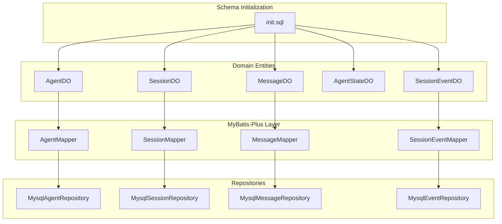
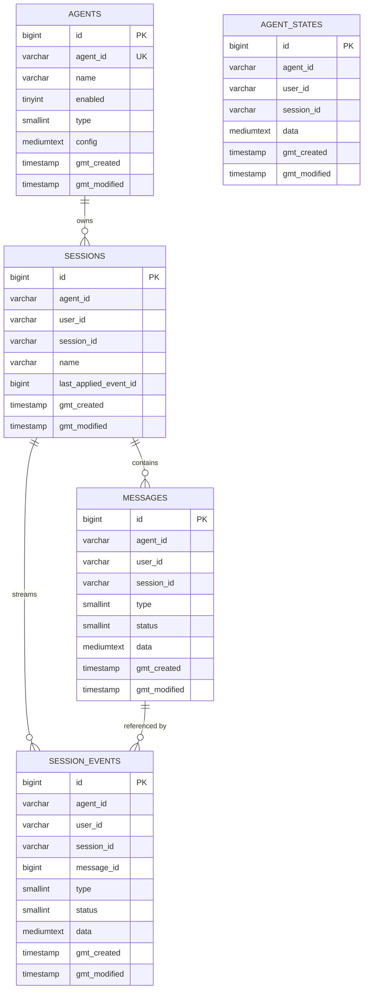
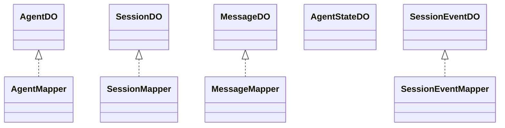
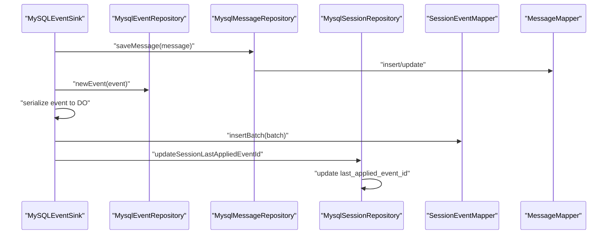
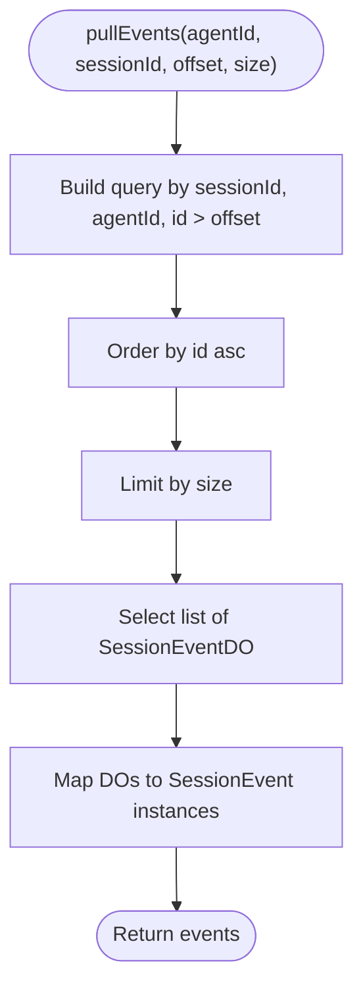
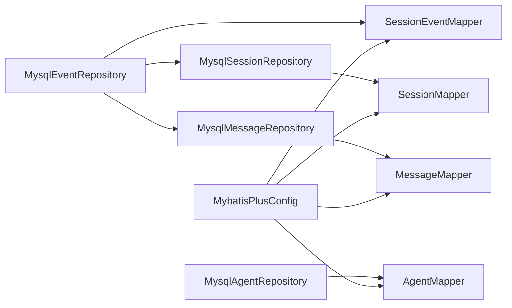

# Database Schema and Data Models

<cite>
**Referenced Files in This Document**
- [init.sql](file://backend_java/bootstrap/src/main/resources/schema/init.sql)
- [AgentDO.java](file://backend_java/infra/src/main/java/com/aliyun/tam/x/tron/infra/dal/dataobject/AgentDO.java)
- [SessionDO.java](file://backend_java/infra/src/main/java/com/aliyun/tam/x/tron/infra/dal/dataobject/SessionDO.java)
- [MessageDO.java](file://backend_java/infra/src/main/java/com/aliyun/tam/x/tron/infra/dal/dataobject/MessageDO.java)
- [AgentStateDO.java](file://backend_java/infra/src/main/java/com/aliyun/tam/x/tron/infra/dal/dataobject/AgentStateDO.java)
- [SessionEventDO.java](file://backend_java/infra/src/main/java/com/aliyun/tam/x/tron/infra/dal/dataobject/SessionEventDO.java)
- [AgentMapper.java](file://backend_java/infra/src/main/java/com/aliyun/tam/x/tron/infra/dal/mapper/AgentMapper.java)
- [SessionMapper.java](file://backend_java/infra/src/main/java/com/aliyun/tam/x/tron/infra/dal/mapper/SessionMapper.java)
- [MessageMapper.java](file://backend_java/infra/src/main/java/com/aliyun/tam/x/tron/infra/dal/mapper/MessageMapper.java)
- [SessionEventMapper.java](file://backend_java/infra/src/main/java/com/aliyun/tam/x/tron/infra/dal/mapper/SessionEventMapper.java)
- [MybatisPlusConfig.java](file://backend_java/bootstrap/src/main/java/com/aliyun/tam/x/tron/config/MybatisPlusConfig.java)
- [MysqlAgentRepository.java](file://backend_java/core/src/main/java/com/aliyun/tam/x/tron/core/domain/repository/mysql/MysqlAgentRepository.java)
- [MysqlSessionRepository.java](file://backend_java/core/src/main/java/com/aliyun/tam/x/tron/core/domain/repository/mysql/MysqlSessionRepository.java)
- [MysqlMessageRepository.java](file://backend_java/core/src/main/java/com/aliyun/tam/x/tron/core/domain/repository/mysql/MysqlMessageRepository.java)
- [MysqlEventRepository.java](file://backend_java/core/src/main/java/com/aliyun/tam/x/tron/core/domain/repository/mysql/MysqlEventRepository.java)
</cite>

## Table of Contents
1. [Introduction](#introduction)
2. [Project Structure](#project-structure)
3. [Core Components](#core-components)
4. [Architecture Overview](#architecture-overview)
5. [Detailed Component Analysis](#detailed-component-analysis)
6. [Dependency Analysis](#dependency-analysis)
7. [Performance Considerations](#performance-considerations)
8. [Troubleshooting Guide](#troubleshooting-guide)
9. [Conclusion](#conclusion)
10. [Appendices](#appendices)

## Introduction
This document describes the database schema and data models used by Tron OneAgent’s backend Java module. It focuses on the event-sourced design centered around Agents, Sessions, Messages, Agent States, and Session Events. The document details table structures, constraints, indexes, and relationships, and explains how the system persists immutable event streams and maintains audit trails. It also covers MyBatis-Plus access patterns, batching strategies, and operational considerations such as indexing, partitioning, retention, migrations, backups, and disaster recovery.

## Project Structure
The database schema is initialized via a single SQL script and mapped to Java entities and MyBatis-Plus mappers. Repositories encapsulate CRUD and transactional operations, while a specialized event sink batches and persists events atomically.

**Diagram sources**
- [init.sql](file://backend_java/bootstrap/src/main/resources/schema/init.sql)
- [AgentDO.java](file://backend_java/infra/src/main/java/com/aliyun/tam/x/tron/infra/dal/dataobject/AgentDO.java)
- [SessionDO.java](file://backend_java/infra/src/main/java/com/aliyun/tam/x/tron/infra/dal/dataobject/SessionDO.java)
- [MessageDO.java](file://backend_java/infra/src/main/java/com/aliyun/tam/x/tron/infra/dal/dataobject/MessageDO.java)
- [AgentStateDO.java](file://backend_java/infra/src/main/java/com/aliyun/tam/x/tron/infra/dal/dataobject/AgentStateDO.java)
- [SessionEventDO.java](file://backend_java/infra/src/main/java/com/aliyun/tam/x/tron/infra/dal/dataobject/SessionEventDO.java)
- [AgentMapper.java](file://backend_java/infra/src/main/java/com/aliyun/tam/x/tron/infra/dal/mapper/AgentMapper.java)
- [SessionMapper.java](file://backend_java/infra/src/main/java/com/aliyun/tam/x/tron/infra/dal/mapper/SessionMapper.java)
- [MessageMapper.java](file://backend_java/infra/src/main/java/com/aliyun/tam/x/tron/infra/dal/mapper/MessageMapper.java)
- [SessionEventMapper.java](file://backend_java/infra/src/main/java/com/aliyun/tam/x/tron/infra/dal/mapper/SessionEventMapper.java)
- [MysqlAgentRepository.java](file://backend_java/core/src/main/java/com/aliyun/tam/x/tron/core/domain/repository/mysql/MysqlAgentRepository.java)
- [MysqlSessionRepository.java](file://backend_java/core/src/main/java/com/aliyun/tam/x/tron/core/domain/repository/mysql/MysqlSessionRepository.java)
- [MysqlMessageRepository.java](file://backend_java/core/src/main/java/com/aliyun/tam/x/tron/core/domain/repository/mysql/MysqlMessageRepository.java)
- [MysqlEventRepository.java](file://backend_java/core/src/main/java/com/aliyun/tam/x/tron/core/domain/repository/mysql/MysqlEventRepository.java)

**Section sources**
- [init.sql](file://backend_java/bootstrap/src/main/resources/schema/init.sql)
- [MybatisPlusConfig.java](file://backend_java/bootstrap/src/main/java/com/aliyun/tam/x/tron/config/MybatisPlusConfig.java)

## Core Components
This section documents the five core relational tables and their roles in the event-sourced model.

- Agents
  - Purpose: Stores agent metadata and configuration.
  - Primary keys: id (auto-increment), agent_id (unique).
  - Notable constraints: unique index on agent_id.
  - Typical fields: agent_id, name, enabled, type, config, timestamps.

- Sessions
  - Purpose: Tracks conversational sessions scoped by agent and user.
  - Primary keys: id (auto-increment), composite unique key (session_id, agent_id).
  - Indexes: idx_agent_user(agent_id, user_id).
  - Fields: agent_id, user_id, session_id, name, last_applied_event_id, timestamps.

- Messages
  - Purpose: Stores immutable message records with typed payloads.
  - Primary keys: id (message primary key), indexes on (session_id, agent_id).
  - Fields: id, agent_id, user_id, session_id, type, status, data, timestamps.

- AgentState
  - Purpose: Stores per-session agent state snapshots.
  - Primary keys: id (auto-increment), unique constraint (session_id, agent_id).
  - Fields: agent_id, user_id, session_id, data, timestamps.

- SessionEvents
  - Purpose: Immutable event stream backing audit trail and replay.
  - Primary keys: id (event primary key), indexes on (session_id, agent_id).
  - Fields: id, agent_id, user_id, session_id, message_id (optional), type, status (optional), data, timestamps.

**Section sources**
- [init.sql](file://backend_java/bootstrap/src/main/resources/schema/init.sql)
- [AgentDO.java](file://backend_java/infra/src/main/java/com/aliyun/tam/x/tron/infra/dal/dataobject/AgentDO.java)
- [SessionDO.java](file://backend_java/infra/src/main/java/com/aliyun/tam/x/tron/infra/dal/dataobject/SessionDO.java)
- [MessageDO.java](file://backend_java/infra/src/main/java/com/aliyun/tam/x/tron/infra/dal/dataobject/MessageDO.java)
- [AgentStateDO.java](file://backend_java/infra/src/main/java/com/aliyun/tam/x/tron/infra/dal/dataobject/AgentStateDO.java)
- [SessionEventDO.java](file://backend_java/infra/src/main/java/com/aliyun/tam/x/tron/infra/dal/dataobject/SessionEventDO.java)

## Architecture Overview
The system follows an event-sourcing pattern:
- Events are appended to session_events with monotonically increasing ids.
- Messages are persisted as immutable records with typed payloads.
- Sessions track last_applied_event_id to support incremental reads.
- Repositories orchestrate transactions and batch writes for performance.

**Diagram sources**
- [init.sql](file://backend_java/bootstrap/src/main/resources/schema/init.sql)

## Detailed Component Analysis

### Data Access with MyBatis-Plus
- Mapper interfaces extend BaseMapper to inherit standard CRUD operations.
- Pagination is enabled globally via MybatisPlusInterceptor with MySQL dialect.
- Batch insertion for events is implemented via a custom @Insert with foreach batching.

**Diagram sources**
- [AgentDO.java](file://backend_java/infra/src/main/java/com/aliyun/tam/x/tron/infra/dal/dataobject/AgentDO.java)
- [SessionDO.java](file://backend_java/infra/src/main/java/com/aliyun/tam/x/tron/infra/dal/dataobject/SessionDO.java)
- [MessageDO.java](file://backend_java/infra/src/main/java/com/aliyun/tam/x/tron/infra/dal/dataobject/MessageDO.java)
- [AgentStateDO.java](file://backend_java/infra/src/main/java/com/aliyun/tam/x/tron/infra/dal/dataobject/AgentStateDO.java)
- [SessionEventDO.java](file://backend_java/infra/src/main/java/com/aliyun/tam/x/tron/infra/dal/dataobject/SessionEventDO.java)
- [AgentMapper.java](file://backend_java/infra/src/main/java/com/aliyun/tam/x/tron/infra/dal/mapper/AgentMapper.java)
- [SessionMapper.java](file://backend_java/infra/src/main/java/com/aliyun/tam/x/tron/infra/dal/mapper/SessionMapper.java)
- [MessageMapper.java](file://backend_java/infra/src/main/java/com/aliyun/tam/x/tron/infra/dal/mapper/MessageMapper.java)
- [SessionEventMapper.java](file://backend_java/infra/src/main/java/com/aliyun/tam/x/tron/infra/dal/mapper/SessionEventMapper.java)

**Section sources**
- [MybatisPlusConfig.java](file://backend_java/bootstrap/src/main/java/com/aliyun/tam/x/tron/config/MybatisPlusConfig.java)
- [AgentMapper.java](file://backend_java/infra/src/main/java/com/aliyun/tam/x/tron/infra/dal/mapper/AgentMapper.java)
- [SessionMapper.java](file://backend_java/infra/src/main/java/com/aliyun/tam/x/tron/infra/dal/mapper/SessionMapper.java)
- [MessageMapper.java](file://backend_java/infra/src/main/java/com/aliyun/tam/x/tron/infra/dal/mapper/MessageMapper.java)
- [SessionEventMapper.java](file://backend_java/infra/src/main/java/com/aliyun/tam/x/tron/infra/dal/mapper/SessionEventMapper.java)

### Event Sourcing Workflow
The event sink aggregates events and messages, serializes them, and persists them in batches within a transaction. After each flush, it updates the session’s last_applied_event_id.

**Diagram sources**
- [MysqlEventRepository.java](file://backend_java/core/src/main/java/com/aliyun/tam/x/tron/core/domain/repository/mysql/MysqlEventRepository.java)
- [MysqlMessageRepository.java](file://backend_java/core/src/main/java/com/aliyun/tam/x/tron/core/domain/repository/mysql/MysqlMessageRepository.java)
- [MysqlSessionRepository.java](file://backend_java/core/src/main/java/com/aliyun/tam/x/tron/core/domain/repository/mysql/MysqlSessionRepository.java)
- [SessionEventMapper.java](file://backend_java/infra/src/main/java/com/aliyun/tam/x/tron/infra/dal/mapper/SessionEventMapper.java)
- [MessageMapper.java](file://backend_java/infra/src/main/java/com/aliyun/tam/x/tron/infra/dal/mapper/MessageMapper.java)

**Section sources**
- [MysqlEventRepository.java](file://backend_java/core/src/main/java/com/aliyun/tam/x/tron/core/domain/repository/mysql/MysqlEventRepository.java)
- [SessionEventMapper.java](file://backend_java/infra/src/main/java/com/aliyun/tam/x/tron/infra/dal/mapper/SessionEventMapper.java)

### Pulling Events with Offset and Limit
The repository fetches events after a given offset, ordered by id, and limits the number returned.

**Diagram sources**
- [MysqlEventRepository.java](file://backend_java/core/src/main/java/com/aliyun/tam/x/tron/core/domain/repository/mysql/MysqlEventRepository.java)

**Section sources**
- [MysqlEventRepository.java](file://backend_java/core/src/main/java/com/aliyun/tam/x/tron/core/domain/repository/mysql/MysqlEventRepository.java)

## Dependency Analysis
- Repositories depend on mappers for persistence.
- Event sink coordinates message and event persistence and updates session offsets.
- Global pagination interceptor is configured centrally.

**Diagram sources**
- [MysqlAgentRepository.java](file://backend_java/core/src/main/java/com/aliyun/tam/x/tron/core/domain/repository/mysql/MysqlAgentRepository.java)
- [MysqlSessionRepository.java](file://backend_java/core/src/main/java/com/aliyun/tam/x/tron/core/domain/repository/mysql/MysqlSessionRepository.java)
- [MysqlMessageRepository.java](file://backend_java/core/src/main/java/com/aliyun/tam/x/tron/core/domain/repository/mysql/MysqlMessageRepository.java)
- [MysqlEventRepository.java](file://backend_java/core/src/main/java/com/aliyun/tam/x/tron/core/domain/repository/mysql/MysqlEventRepository.java)
- [MybatisPlusConfig.java](file://backend_java/bootstrap/src/main/java/com/aliyun/tam/x/tron/config/MybatisPlusConfig.java)

**Section sources**
- [MybatisPlusConfig.java](file://backend_java/bootstrap/src/main/java/com/aliyun/tam/x/tron/config/MybatisPlusConfig.java)

## Performance Considerations
- Indexing
  - sessions.idx_agent_user(agent_id, user_id) supports listing sessions by agent and user.
  - messages.idx_session_id(session_id, agent_id) and session_events.idx_session_id(session_id, agent_id) optimize per-session queries.
- Batching
  - SessionEventMapper.insertBatch performs bulk inserts for event rows.
  - MysqlEventRepository flushes in partitions of 64 events to reduce overhead.
- Pagination
  - Global pagination interceptor configured for MySQL improves query performance for list APIs.
- Write patterns
  - Event sink coalesces writes and flushes periodically to minimize round-trips.
- Data types
  - Use of BIGINT for primary keys and foreign references ensures scalability.
  - MEDIUMTEXT accommodates JSON payloads for messages and events.

[No sources needed since this section provides general guidance]

## Troubleshooting Guide
- Duplicate session creation
  - Sessions are created with a unique constraint on (session_id, agent_id). Concurrent creation may cause duplicate key exceptions; repositories handle idempotent retries and logging.
- Event serialization failures
  - Event sink catches serialization errors and throws runtime exceptions; inspect event payload and type mapping.
- Message deserialization failures
  - Message repository converts stored JSON back to typed messages; malformed data leads to runtime exceptions.
- Transaction boundaries
  - Event sink wraps message saves, event inserts, and session offset updates in a single transaction to maintain consistency.

**Section sources**
- [MysqlSessionRepository.java](file://backend_java/core/src/main/java/com/aliyun/tam/x/tron/core/domain/repository/mysql/MysqlSessionRepository.java)
- [MysqlEventRepository.java](file://backend_java/core/src/main/java/com/aliyun/tam/x/tron/core/domain/repository/mysql/MysqlEventRepository.java)
- [MysqlMessageRepository.java](file://backend_java/core/src/main/java/com/aliyun/tam/x/tron/core/domain/repository/mysql/MysqlMessageRepository.java)

## Conclusion
The Tron OneAgent database model is designed for event-sourcing with immutable event streams and auditability. The schema emphasizes per-session scoping, efficient indexing, and batched writes to sustain high-throughput ingestion. Repositories encapsulate transactional consistency and pagination, while MyBatis-Plus provides straightforward mapping and global pagination support.

[No sources needed since this section summarizes without analyzing specific files]

## Appendices

### Schema and Constraints Reference
- agents
  - Unique keys: uk_agent(agent_id)
  - Auto-increment: id
- agent_states
  - Unique keys: uk_session_agent(session_id, agent_id)
  - Auto-increment: id
- sessions
  - Unique keys: uk_session(session_id, agent_id)
  - Indexes: idx_agent_user(agent_id, user_id)
  - Auto-increment: id
- messages
  - Primary keys: id
  - Indexes: idx_session_id(session_id, agent_id)
- session_events
  - Primary keys: id
  - Indexes: idx_session_id(session_id, agent_id)

**Section sources**
- [init.sql](file://backend_java/bootstrap/src/main/resources/schema/init.sql)

### Sample Data Examples
- Agent
  - agent_id: "agent_abc123"
  - name: "Weather Assistant"
  - enabled: 1
  - type: 1
  - config: JSON string
- Session
  - session_id: "sess_xyz789"
  - agent_id: "agent_abc123"
  - user_id: "user_alice"
  - name: "Trip Planning"
  - last_applied_event_id: 12345
- Message
  - id: 987654321
  - session_id: "sess_xyz789"
  - agent_id: "agent_abc123"
  - user_id: "user_alice"
  - type: 1 (USER or AGENT)
  - status: 1 (INIT, IN_PROGRESS, DONE, FAILED)
  - data: JSON string
- AgentState
  - session_id: "sess_xyz789"
  - agent_id: "agent_abc123"
  - user_id: "user_alice"
  - data: JSON string
- SessionEvent
  - id: 12345
  - session_id: "sess_xyz789"
  - agent_id: "agent_abc123"
  - user_id: "user_alice"
  - message_id: 987654321
  - type: 1 (NEW_USER_INPUT, NEW_AGENT_MESSAGE, etc.)
  - status: 1 (optional)
  - data: JSON string

**Section sources**
- [AgentDO.java](file://backend_java/infra/src/main/java/com/aliyun/tam/x/tron/infra/dal/dataobject/AgentDO.java)
- [SessionDO.java](file://backend_java/infra/src/main/java/com/aliyun/tam/x/tron/infra/dal/dataobject/SessionDO.java)
- [MessageDO.java](file://backend_java/infra/src/main/java/com/aliyun/tam/x/tron/infra/dal/dataobject/MessageDO.java)
- [AgentStateDO.java](file://backend_java/infra/src/main/java/com/aliyun/tam/x/tron/infra/dal/dataobject/AgentStateDO.java)
- [SessionEventDO.java](file://backend_java/infra/src/main/java/com/aliyun/tam/x/tron/infra/dal/dataobject/SessionEventDO.java)

### Data Lifecycle Management
- Retention
  - No explicit retention policy is defined in the schema or repositories. Implement application-level retention by purging old sessions/messages/events after configurable periods.
- Partitioning
  - Consider table partitioning by date or agent_id for very large deployments to improve query performance and maintenance.
- Backups
  - Use logical backups (mysqldump) for point-in-time recovery. Ensure consistent backups by coordinating with application shutdown or using read-replicas.
- Disaster Recovery
  - Maintain hot standby replicas and automate failover. Validate restore procedures regularly and keep binary logs enabled for incremental recovery.

[No sources needed since this section provides general guidance]

### Migration Procedures
- Schema changes
  - Apply DDL changes to init.sql and propagate to environments via deployment pipelines.
  - For data migrations, write idempotent scripts and execute within transactions.
- Versioning
  - Track schema versions and apply migrations in order. Use checksums or metadata tables to prevent re-execution.

[No sources needed since this section provides general guidance]