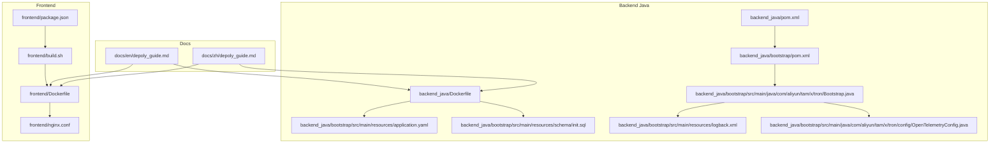
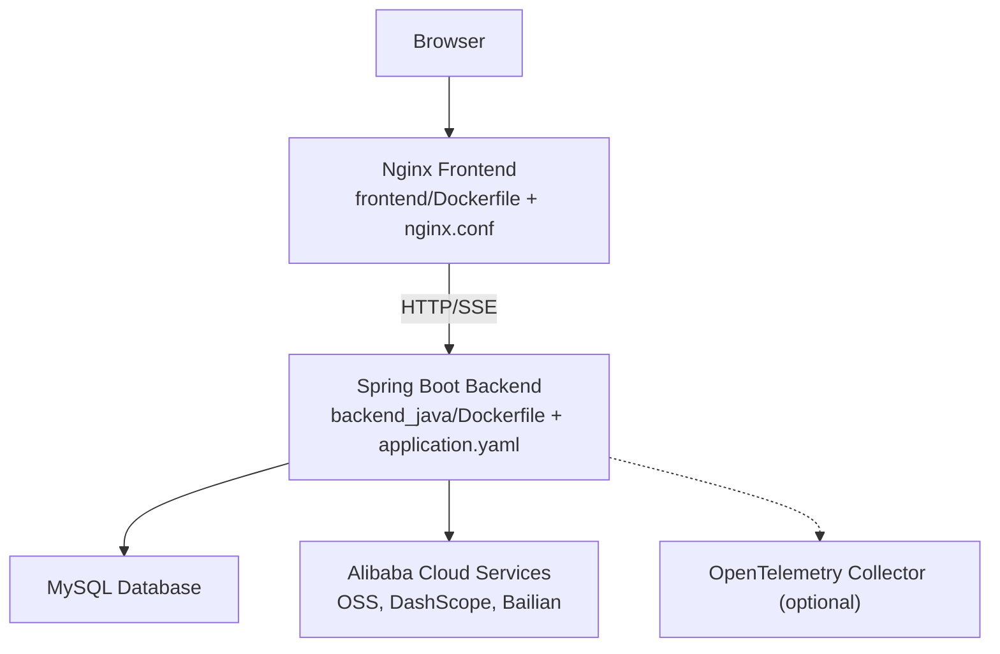
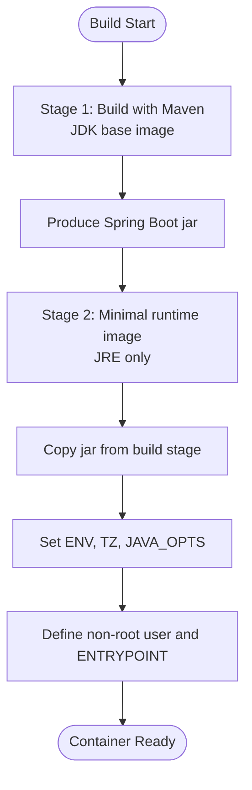
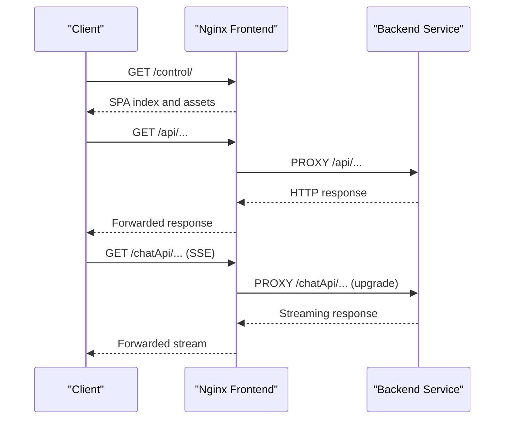
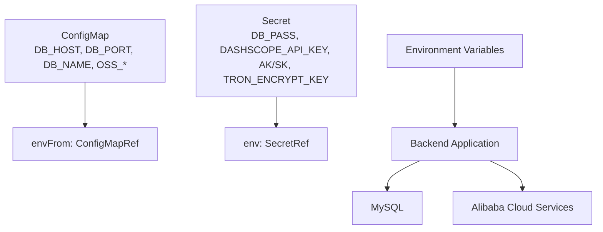
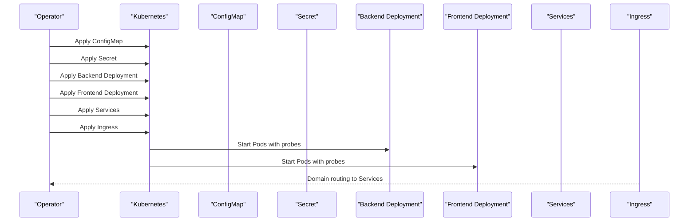
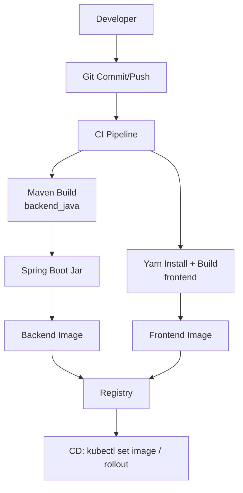
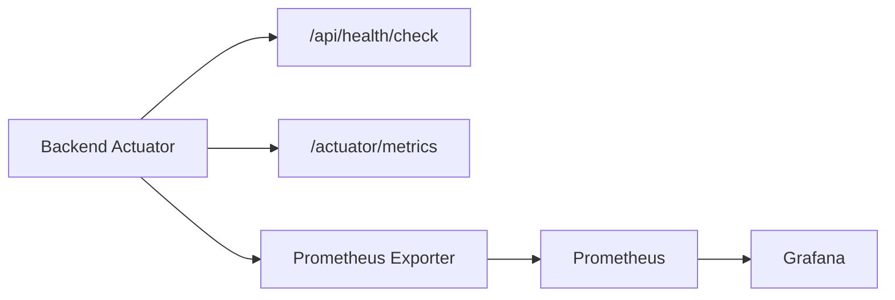
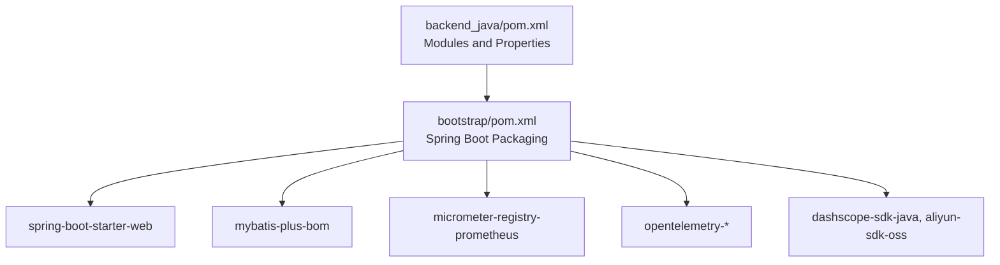

# Deployment and Operations

<cite>
**Referenced Files in This Document**
- [Dockerfile](file://backend_java/Dockerfile)
- [Dockerfile](file://frontend/Dockerfile)
- [application.yaml](file://backend_java/bootstrap/src/main/resources/application.yaml)
- [init.sql](file://backend_java/bootstrap/src/main/resources/schema/init.sql)
- [build.sh](file://frontend/build.sh)
- [package.json](file://frontend/package.json)
- [pom.xml](file://backend_java/pom.xml)
- [pom.xml](file://backend_java/bootstrap/pom.xml)
- [Bootstrap.java](file://backend_java/bootstrap/src/main/java/com/aliyun/tam/x/tron/Bootstrap.java)
- [logback.xml](file://backend_java/bootstrap/src/main/resources/logback.xml)
- [OpenTelemetryConfig.java](file://backend_java/bootstrap/src/main/java/com/aliyun/tam/x/tron/config/OpenTelemetryConfig.java)
- [McpClientConfig.java](file://backend_java/core/src/main/java/com/aliyun/tam/x/tron/core/config/McpClientConfig.java)
- [McpClientConfig.java](file://backend_java/api/src/main/java/com/aliyun/tam/x/tron/api/request/PatchMcpClientConfigRequest.java)
- [AgentEndpointConfigurator.java](file://backend_java/api/src/main/java/com/aliyun/tam/x/tron/ws/AgentEndpointConfigurator.java)
- [AgentWsEndpoint.java](file://backend_java/api/src/main/java/com/aliyun/tam/x/tron/ws/AgentWsEndpoint.java)
- [nginx.conf](file://frontend/nginx.conf)
- [depoly_guide.md](file://docs/en/depoly_guide.md)
- [depoly_guide.md](file://docs/zh/depoly_guide.md)
</cite>

## Table of Contents
1. [Introduction](#introduction)
2. [Project Structure](#project-structure)
3. [Core Components](#core-components)
4. [Architecture Overview](#architecture-overview)
5. [Detailed Component Analysis](#detailed-component-analysis)
6. [Dependency Analysis](#dependency-analysis)
7. [Performance Considerations](#performance-considerations)
8. [Troubleshooting Guide](#troubleshooting-guide)
9. [Conclusion](#conclusion)
10. [Appendices](#appendices)

## Introduction
This document provides comprehensive deployment and operations guidance for Tron OneAgent. It covers containerization strategies for backend and frontend services, environment configuration and secrets handling, production deployment patterns on Kubernetes, scaling and high availability, CI/CD and release management, production hardening and security, monitoring and alerting, backup and disaster recovery, and operational runbooks for common maintenance tasks. The content is grounded in the repository’s Dockerfiles, configuration files, build scripts, and deployment guides.

## Project Structure
The repository is organized into:
- backend_java: Spring Boot-based backend service with Maven modules, Docker packaging, and Kubernetes deployment artifacts.
- frontend: Nginx-based static frontend with build automation and Docker packaging.
- docs: English and Chinese deployment guides for Kubernetes.

**Diagram sources**
- [Dockerfile:1-18](file://backend_java/Dockerfile#L1-L18)
- [application.yaml:1-63](file://backend_java/bootstrap/src/main/resources/application.yaml#L1-L63)
- [init.sql:1-207](file://backend_java/bootstrap/src/main/resources/schema/init.sql#L1-L207)
- [pom.xml:1-252](file://backend_java/pom.xml#L1-L252)
- [pom.xml:1-159](file://backend_java/bootstrap/pom.xml#L1-L159)
- [Bootstrap.java:1-33](file://backend_java/bootstrap/src/main/java/com/aliyun/tam/x/tron/Bootstrap.java#L1-L33)
- [logback.xml:1-38](file://backend_java/bootstrap/src/main/resources/logback.xml#L1-L38)
- [OpenTelemetryConfig.java:60-103](file://backend_java/bootstrap/src/main/java/com/aliyun/tam/x/tron/config/OpenTelemetryConfig.java#L60-L103)
- [Dockerfile:1-15](file://frontend/Dockerfile#L1-L15)
- [nginx.conf:1-78](file://frontend/nginx.conf#L1-L78)
- [build.sh:1-80](file://frontend/build.sh#L1-L80)
- [package.json:1-12](file://frontend/package.json#L1-L12)
- [depoly_guide.md:1-465](file://docs/en/depoly_guide.md#L1-L465)
- [depoly_guide.md:1-465](file://docs/zh/depoly_guide.md#L1-L465)

**Section sources**
- [Dockerfile:1-18](file://backend_java/Dockerfile#L1-L18)
- [Dockerfile:1-15](file://frontend/Dockerfile#L1-L15)
- [application.yaml:1-63](file://backend_java/bootstrap/src/main/resources/application.yaml#L1-L63)
- [init.sql:1-207](file://backend_java/bootstrap/src/main/resources/schema/init.sql#L1-L207)
- [build.sh:1-80](file://frontend/build.sh#L1-L80)
- [package.json:1-12](file://frontend/package.json#L1-L12)
- [pom.xml:1-252](file://backend_java/pom.xml#L1-L252)
- [pom.xml:1-159](file://backend_java/bootstrap/pom.xml#L1-L159)
- [Bootstrap.java:1-33](file://backend_java/bootstrap/src/main/java/com/aliyun/tam/x/tron/Bootstrap.java#L1-L33)
- [logback.xml:1-38](file://backend_java/bootstrap/src/main/resources/logback.xml#L1-L38)
- [OpenTelemetryConfig.java:60-103](file://backend_java/bootstrap/src/main/java/com/aliyun/tam/x/tron/config/OpenTelemetryConfig.java#L60-L103)
- [depoly_guide.md:1-465](file://docs/en/depoly_guide.md#L1-L465)
- [depoly_guide.md:1-465](file://docs/zh/depoly_guide.md#L1-L465)

## Core Components
- Backend service
  - Spring Boot application packaged as a single jar via Maven and Dockerized with a minimal Linux base image.
  - Configuration via environment variables (database, cloud credentials, file storage, encryption key).
  - Actuator endpoints exposed for health and metrics.
  - Logging configured with rolling file appender and console output.
  - Optional OpenTelemetry tracing support.

- Frontend service
  - Static assets served by Nginx with environment injection at runtime.
  - Build script automates dependency installation, build, and Docker image creation.
  - Nginx configuration proxies API and SSE endpoints to the backend.

- Database
  - MySQL schema initialization script included for table creation and indexing.

**Section sources**
- [Dockerfile:1-18](file://backend_java/Dockerfile#L1-L18)
- [application.yaml:1-63](file://backend_java/bootstrap/src/main/resources/application.yaml#L1-L63)
- [logback.xml:1-38](file://backend_java/bootstrap/src/main/resources/logback.xml#L1-L38)
- [OpenTelemetryConfig.java:60-103](file://backend_java/bootstrap/src/main/java/com/aliyun/tam/x/tron/config/OpenTelemetryConfig.java#L60-L103)
- [Dockerfile:1-15](file://frontend/Dockerfile#L1-L15)
- [build.sh:1-80](file://frontend/build.sh#L1-L80)
- [nginx.conf:1-78](file://frontend/nginx.conf#L1-L78)
- [init.sql:1-207](file://backend_java/bootstrap/src/main/resources/schema/init.sql#L1-L207)

## Architecture Overview
The system consists of:
- Frontend Nginx container serving static assets and proxying API and SSE traffic to the backend.
- Backend Spring Boot container exposing REST APIs, WebSocket endpoints, and actuator endpoints.
- External dependencies: MySQL database, Alibaba Cloud services (OSS, DashScope, Bailian), and optional OpenTelemetry collector.

**Diagram sources**
- [Dockerfile:1-15](file://frontend/Dockerfile#L1-L15)
- [nginx.conf:1-78](file://frontend/nginx.conf#L1-L78)
- [Dockerfile:1-18](file://backend_java/Dockerfile#L1-L18)
- [application.yaml:1-63](file://backend_java/bootstrap/src/main/resources/application.yaml#L1-L63)
- [OpenTelemetryConfig.java:60-103](file://backend_java/bootstrap/src/main/java/com/aliyun/tam/x/tron/config/OpenTelemetryConfig.java#L60-L103)

## Detailed Component Analysis

### Backend Containerization and Multi-Stage Builds
- Current backend Dockerfile uses a minimal Linux base image, installs Java 17, copies the Spring Boot fat jar, and sets environment variables and entrypoint.
- The Maven build produces a Spring Boot executable jar via the spring-boot-maven-plugin in the bootstrap module.
- Recommendations for multi-stage builds:
  - Stage 1: Build with Maven inside a JDK base image.
  - Stage 2: Copy only the produced jar into a minimal runtime image (e.g., distroless or alpine with JRE).
  - Add non-root user, health check, and resource limits.
  - Keep secrets out of the image; pass via environment variables or mounted secrets.

**Diagram sources**
- [pom.xml:133-157](file://backend_java/bootstrap/pom.xml#L133-L157)
- [Dockerfile:1-18](file://backend_java/Dockerfile#L1-L18)

**Section sources**
- [Dockerfile:1-18](file://backend_java/Dockerfile#L1-L18)
- [pom.xml:133-157](file://backend_java/bootstrap/pom.xml#L133-L157)

### Frontend Containerization and Nginx Configuration
- The frontend Dockerfile:
  - Uses a specific Nginx base image.
  - Copies built control application assets.
  - Injects environment variables at startup using envsubst from a template.
  - Exposes port 80 and runs Nginx in the foreground.
- Nginx configuration:
  - Proxies /api/ to the backend service.
  - Proxies /chatApi/ (SSE) to the backend with streaming support and appropriate timeouts.
  - Serves SPA routes via alias and index fallback.
  - Includes gzip, client_max_body_size, and keepalive tuning.

**Diagram sources**
- [Dockerfile:1-15](file://frontend/Dockerfile#L1-L15)
- [nginx.conf:42-76](file://frontend/nginx.conf#L42-L76)

**Section sources**
- [Dockerfile:1-15](file://frontend/Dockerfile#L1-L15)
- [nginx.conf:1-78](file://frontend/nginx.conf#L1-L78)
- [build.sh:1-80](file://frontend/build.sh#L1-L80)
- [package.json:1-12](file://frontend/package.json#L1-L12)

### Environment Configuration Management and Secrets Handling
- Backend configuration:
  - Database connection via JDBC URL constructed from DB_HOST, DB_PORT, DB_NAME, DB_USER, DB_PASS.
  - Cloud integrations via DASHSCOPE_API_KEY, ALIBABA_CLOUD_ACCESS_KEY_ID, ALIBABA_CLOUD_ACCESS_KEY_SECRET.
  - File storage and OSS settings via FILE_SERVER_BASE_URL, OSS_BUCKET, OSS_REGION, OSS_ENDPOINT.
  - Encryption key via TRON_ENCRYPT_KEY.
  - Actuator endpoints exposed for health, metrics, and Prometheus scraping.
- Frontend configuration:
  - END_POINT injected at runtime via envsubst to point to the backend service.
- Kubernetes pattern:
  - Non-sensitive values in ConfigMap; sensitive values in Secret.
  - Mount via envFrom (ConfigMap) and env (Secret) or volume mounts.

**Diagram sources**
- [application.yaml:9-51](file://backend_java/bootstrap/src/main/resources/application.yaml#L9-L51)
- [depoly_guide.md:159-210](file://docs/en/depoly_guide.md#L159-L210)

**Section sources**
- [application.yaml:1-63](file://backend_java/bootstrap/src/main/resources/application.yaml#L1-L63)
- [depoly_guide.md:38-65](file://docs/en/depoly_guide.md#L38-L65)
- [depoly_guide.md:38-65](file://docs/zh/depoly_guide.md#L38-L65)

### Production Deployment Patterns (Kubernetes)
- Prerequisites: Kubernetes cluster, image registry, MySQL instance, Alibaba Cloud credentials.
- Steps:
  - Initialize database using the provided SQL script.
  - Create ConfigMap and Secret.
  - Deploy backend and frontend with probes and resource requests/limits.
  - Expose via Services and front with an Ingress (ALB/API Gateway recommended).
- Rolling updates and rollbacks supported via kubectl set image and rollout undo.

**Diagram sources**
- [depoly_guide.md:148-354](file://docs/en/depoly_guide.md#L148-L354)
- [init.sql:1-207](file://backend_java/bootstrap/src/main/resources/schema/init.sql#L1-L207)

**Section sources**
- [depoly_guide.md:23-35](file://docs/en/depoly_guide.md#L23-L35)
- [depoly_guide.md:148-354](file://docs/en/depoly_guide.md#L148-L354)
- [depoly_guide.md:23-35](file://docs/zh/depoly_guide.md#L23-L35)
- [depoly_guide.md:148-354](file://docs/zh/depoly_guide.md#L148-L354)

### Scaling, Load Balancing, and High Availability
- Horizontal scaling:
  - Backend and frontend deployments configured with replica counts.
  - Use ClusterIP Services and Ingress for external access.
- Load balancing:
  - Ingress ALB/API Gateway recommended for path-based routing (/control and /api).
- High availability:
  - Multiple replicas per tier.
  - Liveness and readiness probes to ensure healthy endpoints.
  - Persistent storage considerations for file uploads and logs (see logging section).

**Section sources**
- [depoly_guide.md:212-354](file://docs/en/depoly_guide.md#L212-L354)
- [depoly_guide.md:212-354](file://docs/zh/depoly_guide.md#L212-L354)

### CI/CD Pipeline Setup, Automated Testing, and Release Management
- Backend build:
  - Maven build and package steps produce the Spring Boot jar.
  - Docker build using the backend Dockerfile.
- Frontend build:
  - Script automates yarn install, build:control, and Docker image tagging.
  - Image tagging strategy based on package.json version.
- Release management:
  - Tag images with semantic versions and push to registry.
  - Zero-downtime upgrades via rolling updates; rollback supported by Kubernetes rollouts.

**Diagram sources**
- [pom.xml:1-252](file://backend_java/pom.xml#L1-L252)
- [pom.xml:133-157](file://backend_java/bootstrap/pom.xml#L133-L157)
- [build.sh:62-79](file://frontend/build.sh#L62-L79)
- [package.json:1-12](file://frontend/package.json#L1-L12)
- [depoly_guide.md:67-146](file://docs/en/depoly_guide.md#L67-L146)

**Section sources**
- [pom.xml:1-252](file://backend_java/pom.xml#L1-L252)
- [pom.xml:133-157](file://backend_java/bootstrap/pom.xml#L133-L157)
- [build.sh:1-80](file://frontend/build.sh#L1-L80)
- [package.json:1-12](file://frontend/package.json#L1-L12)
- [depoly_guide.md:67-146](file://docs/en/depoly_guide.md#L67-L146)

### Security and Production Hardening
- Secrets management:
  - Store database passwords, API keys, and encryption keys in Kubernetes Secrets; mount via env or volumes.
- Network policies:
  - Restrict ingress/egress; allow only necessary ports and paths.
- TLS and HTTPS:
  - Terminate TLS at Ingress (ALB/API Gateway) with managed certificates.
- Container hardening:
  - Run as non-root user; minimize base image; disable unnecessary capabilities.
- Encryption:
  - TRON_ENCRYPT_KEY enables encrypted configuration fields for sensitive headers.

**Section sources**
- [application.yaml:50-51](file://backend_java/bootstrap/src/main/resources/application.yaml#L50-L51)
- [McpClientConfig.java:89-92](file://backend_java/core/src/main/java/com/aliyun/tam/x/tron/core/config/McpClientConfig.java#L89-L92)
- [McpClientConfig.java:75-77](file://backend_java/api/src/main/java/com/aliyun/tam/x/tron/api/request/PatchMcpClientConfigRequest.java#L75-L77)
- [depoly_guide.md:185-210](file://docs/en/depoly_guide.md#L185-L210)

### Monitoring and Alerting
- Backend exposes:
  - Health endpoint at /api/health/check.
  - Metrics and Prometheus endpoint via Actuator.
- Recommended:
  - Deploy Prometheus and Grafana; scrape backend metrics.
  - Centralized logging with filebeat/fluent-bit and persistent storage.
  - OpenTelemetry exporter configuration for distributed tracing.

**Diagram sources**
- [application.yaml:53-62](file://backend_java/bootstrap/src/main/resources/application.yaml#L53-L62)
- [OpenTelemetryConfig.java:60-103](file://backend_java/bootstrap/src/main/java/com/aliyun/tam/x/tron/config/OpenTelemetryConfig.java#L60-L103)

**Section sources**
- [application.yaml:53-62](file://backend_java/bootstrap/src/main/resources/application.yaml#L53-L62)
- [OpenTelemetryConfig.java:60-103](file://backend_java/bootstrap/src/main/java/com/aliyun/tam/x/tron/config/OpenTelemetryConfig.java#L60-L103)

### Backup and Disaster Recovery
- Database:
  - Use managed MySQL (e.g., RDS) with automated backups and point-in-time recovery.
- Artifacts:
  - Back up Docker images in the registry; maintain image digests for reproducibility.
- Configuration:
  - Store ConfigMaps and Secrets in version control or declarative manifests for quick restoration.

**Section sources**
- [depoly_guide.md:23-32](file://docs/en/depoly_guide.md#L23-L32)
- [init.sql:1-207](file://backend_java/bootstrap/src/main/resources/schema/init.sql#L1-L207)

### Operational Runbooks
- Routine maintenance:
  - Review logs and metrics weekly; rotate logs and manage disk usage.
  - Update images via rolling upgrades; monitor pod restarts.
- Incident response:
  - Verify Ingress routing and backend connectivity.
  - Inspect SSE proxy buffering and timeouts.
  - Confirm database connectivity and schema initialization.

**Section sources**
- [logback.xml:16-29](file://backend_java/bootstrap/src/main/resources/logback.xml#L16-L29)
- [nginx.conf:54-69](file://frontend/nginx.conf#L54-L69)
- [depoly_guide.md:398-464](file://docs/en/depoly_guide.md#L398-L464)

## Dependency Analysis
- Backend dependencies:
  - Spring Boot starter web, MyBatis-Plus, Micrometer Prometheus, OpenTelemetry instrumentation, Alibaba Cloud SDKs.
- Build dependencies:
  - Maven compiler plugin, Surefire, Spring Boot Maven Plugin for packaging.
- Frontend dependencies:
  - Workspace control app built via Yarn; Nginx image for runtime.

**Diagram sources**
- [pom.xml:1-252](file://backend_java/pom.xml#L1-L252)
- [pom.xml:1-159](file://backend_java/bootstrap/pom.xml#L1-L159)

**Section sources**
- [pom.xml:1-252](file://backend_java/pom.xml#L1-L252)
- [pom.xml:1-159](file://backend_java/bootstrap/pom.xml#L1-L159)

## Performance Considerations
- Backend:
  - Tune JVM heap via JAVA_OPTS; configure thread pools for async and scheduling.
  - Use connection pooling for MySQL; adjust timeouts for cloud services.
- Frontend:
  - Enable gzip and keepalive; limit upload sizes; tune proxy buffer and read timeouts for SSE.
- Observability:
  - Enable Prometheus metrics and OpenTelemetry traces; set up dashboards for latency and saturation.

[No sources needed since this section provides general guidance]

## Troubleshooting Guide
Common issues and resolutions:
- Pod failed to start:
  - Check container logs; verify image tag and environment variables.
- Database connection failure:
  - Confirm host/port/name/user/password; ensure schema initialization.
- Frontend cannot connect to backend:
  - Validate END_POINT; check network policies and backend service status.
- SSE connection dropped:
  - Ensure proxy_buffering off and proper read timeouts; verify backend supports long connections.

**Section sources**
- [depoly_guide.md:398-423](file://docs/en/depoly_guide.md#L398-L423)
- [depoly_guide.md:398-423](file://docs/zh/depoly_guide.md#L398-L423)
- [nginx.conf:54-69](file://frontend/nginx.conf#L54-L69)

## Conclusion
Tron OneAgent provides a clear separation between a lightweight Nginx frontend and a Spring Boot backend, with environment-driven configuration and Kubernetes-friendly deployment patterns. By adopting multi-stage container builds, robust secrets management, observability tooling, and standardized CI/CD practices, teams can operate the system reliably at scale with high availability and strong security controls.

[No sources needed since this section summarizes without analyzing specific files]

## Appendices

### Backend Configuration Reference
- Database: DB_HOST, DB_PORT, DB_NAME, DB_USER, DB_PASS
- Cloud: DASHSCOPE_API_KEY, ALIBABA_CLOUD_ACCESS_KEY_ID, ALIBABA_CLOUD_ACCESS_KEY_SECRET
- File/OSS: FILE_SERVER_BASE_URL, OSS_BUCKET, OSS_REGION, OSS_ENDPOINT
- Encryption: TRON_ENCRYPT_KEY
- Actuator: management.server.port, endpoints exposure, metrics tags

**Section sources**
- [application.yaml:9-51](file://backend_java/bootstrap/src/main/resources/application.yaml#L9-L51)
- [application.yaml:53-62](file://backend_java/bootstrap/src/main/resources/application.yaml#L53-L62)

### Frontend Configuration Reference
- END_POINT: backend service address (host:port)
- Nginx proxy rules for /api/ and /chatApi/ streams

**Section sources**
- [depoly_guide.md:58-65](file://docs/en/depoly_guide.md#L58-L65)
- [nginx.conf:42-76](file://frontend/nginx.conf#L42-L76)

### WebSocket and SSE Handling
- Backend WebSocket configuration and endpoint configurator capture headers and parameters for downstream use.
- Frontend Nginx disables proxy buffering for SSE to support streaming.

**Section sources**
- [AgentEndpointConfigurator.java:33-56](file://backend_java/api/src/main/java/com/aliyun/tam/x/tron/ws/AgentEndpointConfigurator.java#L33-L56)
- [AgentWsEndpoint.java:483-505](file://backend_java/api/src/main/java/com/aliyun/tam/x/tron/ws/AgentWsEndpoint.java#L483-L505)
- [nginx.conf:54-69](file://frontend/nginx.conf#L54-L69)