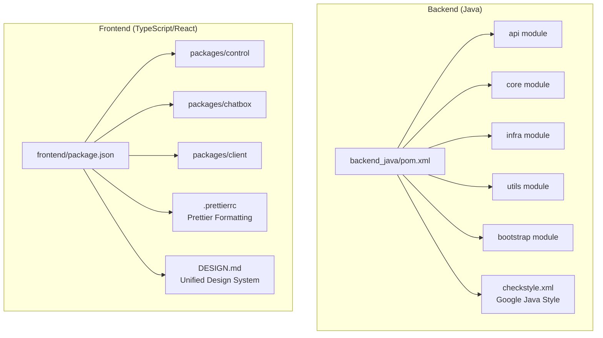
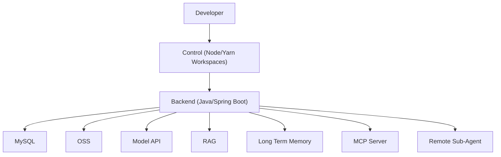
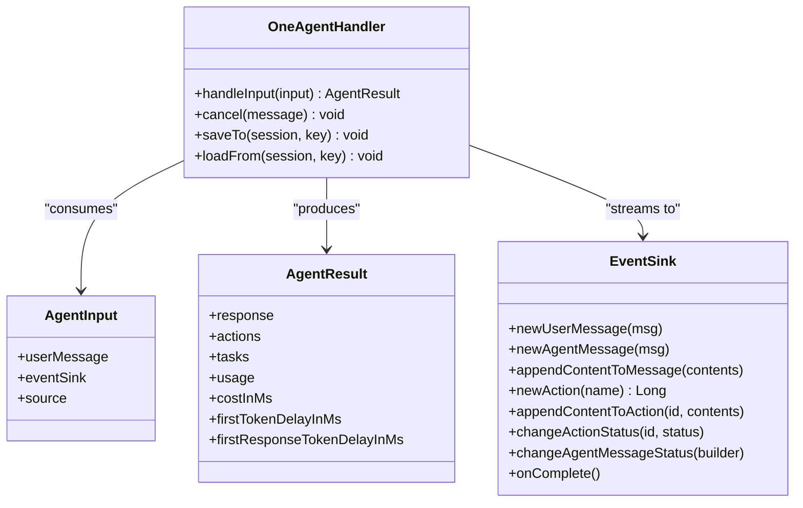
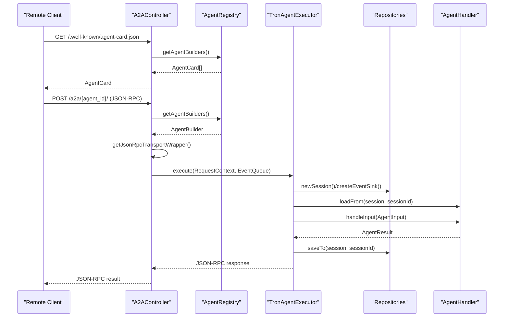
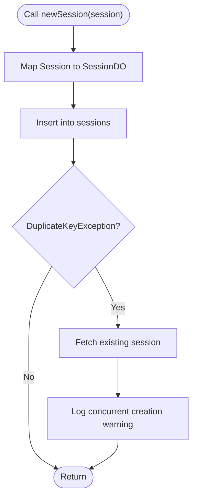
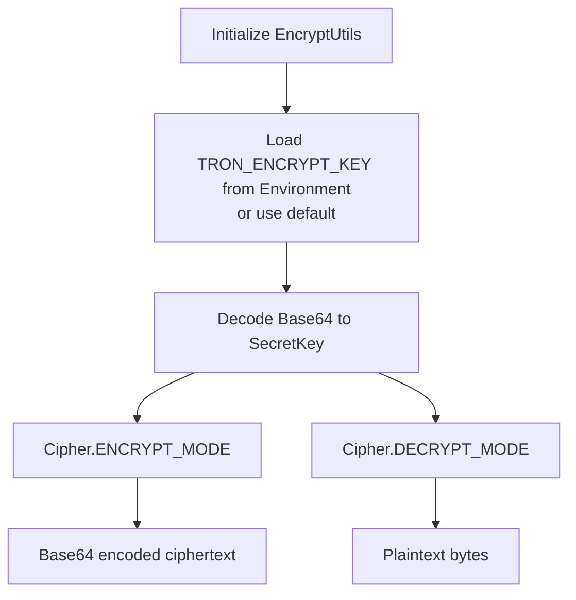
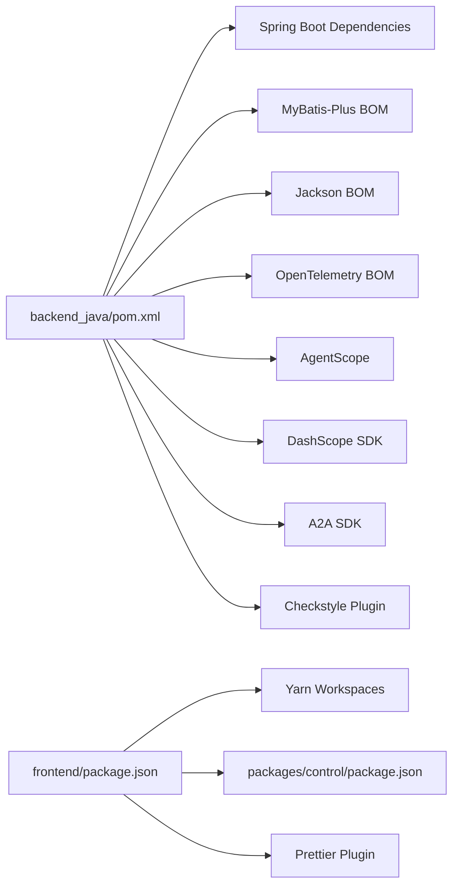

# Development Guidelines

<cite>
**Referenced Files in This Document**
- [README.md](file://README.md)
- [backend_java/pom.xml](file://backend_java/pom.xml)
- [backend_java/bootstrap/src/main/resources/application.yaml](file://backend_java/bootstrap/src/main/resources/application.yaml)
- [backend_java/bootstrap/src/main/resources/logback.xml](file://backend_java/bootstrap/src/main/resources/logback.xml)
- [backend_java/bootstrap/src/test/java/com/aliyun/tam/x/tron/TestApplication.java](file://backend_java/bootstrap/src/test/java/com/aliyun/tam/x/tron/TestApplication.java)
- [backend_java/bootstrap/src/test/java/com/aliyun/tam/x/tron/BaseFuncTest.java](file://backend_java/bootstrap/src/test/java/com/aliyun/tam/x/tron/BaseFuncTest.java)
- [backend_java/bootstrap/src/test/resources/datasets/test-one-agent-v1.json](file://backend_java/bootstrap/src/test/resources/datasets/test-one-agent-v1.json)
- [backend_java/api/src/main/java/com/aliyun/tam/x/tron/api/A2AController.java](file://backend_java/api/src/main/java/com/aliyun/tam/x/tron/api/A2AController.java)
- [backend_java/core/src/main/java/com/aliyun/tam/x/tron/core/agents/one/OneAgentHandler.java](file://backend_java/core/src/main/java/com/aliyun/tam/x/tron/core/agents/one/OneAgentHandler.java)
- [backend_java/core/src/main/java/com/aliyun/tam/x/tron/core/domain/repository/mysql/MysqlSessionRepository.java](file://backend_java/core/src/main/java/com/aliyun/tam/x/tron/core/domain/repository/mysql/MysqlSessionRepository.java)
- [backend_java/utils/src/main/java/com/aliyun/tam/x/tron/utils/encrypt/EncryptUtils.java](file://backend_java/utils/src/main/java/com/aliyun/tam/x/tron/utils/encrypt/EncryptUtils.java)
- [backend_java/utils/src/main/java/com/aliyun/tam/x/tron/utils/JsonUtils.java](file://backend_java/utils/src/main/java/com/aliyun/tam/x/tron/utils/JsonUtils.java)
- [backend_java/checkstyle.xml](file://backend_java/checkstyle.xml)
- [frontend/package.json](file://frontend/package.json)
- [frontend/packages/control/package.json](file://frontend/packages/control/package.json)
- [frontend/.prettierrc](file://frontend/.prettierrc)
- [frontend/DESIGN.md](file://frontend/DESIGN.md)
- [LICENSE.txt](file://LICENSE.txt)
- [AGENTS.md](file://AGENTS.md)
</cite>

## Update Summary
**Changes Made**
- Added comprehensive backend coding standards with Google Java Style checkstyle configuration
- Integrated Prettier code formatting standards for frontend development
- Established unified design system guidelines from DESIGN.md
- Added licensing requirements and Apache 2.0 compliance
- Enhanced development workflow with automated code quality tools

## Table of Contents
1. [Introduction](#introduction)
2. [Project Structure](#project-structure)
3. [Core Components](#core-components)
4. [Architecture Overview](#architecture-overview)
5. [Detailed Component Analysis](#detailed-component-analysis)
6. [Development Standards and Code Quality](#development-standards-and-code-quality)
7. [Dependency Analysis](#dependency-analysis)
8. [Performance Considerations](#performance-considerations)
9. [Troubleshooting Guide](#troubleshooting-guide)
10. [Contribution Workflow and Community Guidelines](#contribution-workflow-and-community-guidelines)
11. [Appendices](#appendices)

## Introduction
This document provides comprehensive development guidelines for contributing to Tron OneAgent. It covers code standards and conventions for Java backend, TypeScript/React frontend, and Python skill implementation; testing strategies (unit, integration, and functional testing); debugging techniques and local development workflows; encryption utilities and security best practices; performance optimization and profiling; and the contribution workflow and community guidelines. The goal is to help contributors implement new features, extend existing functionality, and maintain high-quality code consistently.

**Updated** Added comprehensive development standards including Google Java Style checkstyle configuration, Prettier code formatting, and unified design system guidelines.

## Project Structure
Tron OneAgent follows a multi-module Maven layout for the Java backend and a monorepo-style Yarn workspaces layout for the frontend. The backend is organized into modules for API, core business logic, infrastructure, utilities, and bootstrapping. The frontend uses a workspace with multiple packages (e.g., control, chatbox, client).

**Diagram sources**
- [backend_java/pom.xml:11-16](file://backend_java/pom.xml#L11-L16)
- [frontend/package.json:4-6](file://frontend/package.json#L4-L6)
- [backend_java/checkstyle.xml:6](file://backend_java/checkstyle.xml#L6)
- [frontend/.prettierrc:1-8](file://frontend/.prettierrc#L1-L8)
- [frontend/DESIGN.md:1-314](file://frontend/DESIGN.md#L1-L314)

**Section sources**
- [README.md:109-156](file://README.md#L109-L156)
- [backend_java/pom.xml:11-16](file://backend_java/pom.xml#L11-L16)
- [frontend/package.json:4-6](file://frontend/package.json#L4-L6)

## Core Components
- Java backend modules:
  - API: REST controllers and transport handlers (e.g., A2A JSON-RPC).
  - Core: Agent orchestration, configuration, repositories, services, and utilities.
  - Infra: DAL, mappers, storage providers, tracing utilities.
  - Utils: Shared utilities (JSON, encryption).
  - Bootstrap: Spring Boot application entrypoint and configuration.
- Frontend packages:
  - Control: Main control panel and UI shell.
  - Chatbox: Chat UI components.
  - Client: Frontend client libraries and integrations.

Key runtime configuration and logging are centralized in the bootstrap module's YAML and Logback files.

**Section sources**
- [backend_java/pom.xml:11-16](file://backend_java/pom.xml#L11-L16)
- [backend_java/bootstrap/src/main/resources/application.yaml:1-63](file://backend_java/bootstrap/src/main/resources/application.yaml#L1-L63)
- [backend_java/bootstrap/src/main/resources/logback.xml:1-38](file://backend_java/bootstrap/src/main/resources/logback.xml#L1-L38)

## Architecture Overview
The system integrates a Java backend (Spring Boot) with a modern React-based frontend. The backend supports dual protocols (SSE and WebSocket) and asynchronous streaming, with dynamic configuration, HITL (Human-in-the-loop), and optional MCP and RAG integrations. Encryption utilities and secure configuration are provided for sensitive data.

**Diagram sources**
- [README.md:58-93](file://README.md#L58-L93)

## Detailed Component Analysis

### Java Backend: Agent Orchestration and Streaming
The OneAgentHandler orchestrates ReAct agent execution, manages tool invocation, and streams content via an event sink. It tracks timing metrics, handles cancellation, and integrates with sub-agents and HITL prompts.

**Diagram sources**
- [backend_java/core/src/main/java/com/aliyun/tam/x/tron/core/agents/one/OneAgentHandler.java:47-289](file://backend_java/core/src/main/java/com/aliyun/tam/x/tron/core/agents/one/OneAgentHandler.java#L47-L289)

**Section sources**
- [backend_java/core/src/main/java/com/aliyun/tam/x/tron/core/agents/one/OneAgentHandler.java:74-272](file://backend_java/core/src/main/java/com/aliyun/tam/x/tron/core/agents/one/OneAgentHandler.java#L74-L272)

### Java Backend: A2A JSON-RPC Transport
The A2AController exposes an Agent Card discovery endpoint and a JSON-RPC handler for remote agent execution. It creates sessions, wires event sinks, and executes agent tasks on a bounded thread pool.

**Diagram sources**
- [backend_java/api/src/main/java/com/aliyun/tam/x/tron/api/A2AController.java:91-240](file://backend_java/api/src/main/java/com/aliyun/tam/x/tron/api/A2AController.java#L91-L240)

**Section sources**
- [backend_java/api/src/main/java/com/aliyun/tam/x/tron/api/A2AController.java:107-128](file://backend_java/api/src/main/java/com/aliyun/tam/x/tron/api/A2AController.java#L107-L128)
- [backend_java/api/src/main/java/com/aliyun/tam/x/tron/api/A2AController.java:130-222](file://backend_java/api/src/main/java/com/aliyun/tam/x/tron/api/A2AController.java#L130-L222)

### Java Backend: Session Persistence (MySQL)
The MysqlSessionRepository implements CRUD operations for sessions with transactional safety and pagination support. It ensures consistent updates to session metadata and cascades deletions across related entities.

**Diagram sources**
- [backend_java/core/src/main/java/com/aliyun/tam/x/tron/core/domain/repository/mysql/MysqlSessionRepository.java:61-80](file://backend_java/core/src/main/java/com/aliyun/tam/x/tron/core/domain/repository/mysql/MysqlSessionRepository.java#L61-L80)

**Section sources**
- [backend_java/core/src/main/java/com/aliyun/tam/x/tron/core/domain/repository/mysql/MysqlSessionRepository.java:59-102](file://backend_java/core/src/main/java/com/aliyun/tam/x/tron/core/domain/repository/mysql/MysqlSessionRepository.java#L59-L102)

### Java Backend: Encryption Utilities
Encryption utilities provide AES encryption/decryption with a configurable key and a helper to generate new keys. The key is loaded from a Spring environment property with a default fallback.

**Diagram sources**
- [backend_java/utils/src/main/java/com/aliyun/tam/x/tron/utils/encrypt/EncryptUtils.java:32-80](file://backend_java/utils/src/main/java/com/aliyun/tam/x/tron/utils/encrypt/EncryptUtils.java#L32-L80)

**Section sources**
- [backend_java/utils/src/main/java/com/aliyun/tam/x/tron/utils/encrypt/EncryptUtils.java:53-80](file://backend_java/utils/src/main/java/com/aliyun/tam/x/tron/utils/encrypt/EncryptUtils.java#L53-L80)
- [backend_java/bootstrap/src/main/resources/application.yaml:50-51](file://backend_java/bootstrap/src/main/resources/application.yaml#L50-L51)

### Frontend: TypeScript/React Setup
The frontend uses Yarn workspaces to manage multiple packages. The control package defines development and build scripts, along with ESLint and TypeScript configurations. The package.json demonstrates the workspace structure and scripts for dev/build.

**Section sources**
- [frontend/package.json:4-11](file://frontend/package.json#L4-L11)
- [frontend/packages/control/package.json:5-58](file://frontend/packages/control/package.json#L5-L58)

### Python Skills
Skills are implemented as Python scripts under the skills directory. A minimal skill example is provided for weather-related functionality.

**Section sources**
- [backend_java/skills/weather/scripts/weather.py](file://backend_java/skills/weather/scripts/weather.py)
- [backend_java/skills/weather/SKILL.md](file://backend_java/skills/weather/SKILL.md)

## Development Standards and Code Quality

### Backend Coding Standards with Google Java Style

The backend enforces comprehensive code quality through Google Java Style checkstyle configuration with project-specific relaxations for modern development practices.

#### Checkstyle Configuration
The project uses a customized Google Java Style configuration that maintains consistency while accommodating modern Java features:

- **Naming Conventions**: Package names, type names, method names, constant names, local variable names, member names, and parameter names follow Google's strict conventions
- **Import Management**: Unused imports are flagged, star imports are restricted except for static members
- **Coding Standards**: Boolean expressions are simplified, string equality checks are enforced, and single statement per line enforcement maintains readability
- **Design Principles**: One top-level class per file promotes modularity
- **Whitespace Rules**: Generic whitespace, method parameter padding, and parentheses padding are standardized

#### Project-Specific Relaxations
The configuration includes relaxations for contemporary development tools:
- **Lombok Support**: Annotations like `@Data`, `@Builder`, `@Slf4j`, and `@RequiredArgsConstructor` are fully supported
- **MapStruct Compatibility**: Integration with MapStruct for object mapping is accommodated

#### Integration with Build Process
The checkstyle configuration integrates seamlessly with the Maven build process:
- Run `mvn checkstyle:check -q` for fast compilation checks
- Configuration severity is set to warning level for development flexibility

**Section sources**
- [backend_java/checkstyle.xml:6](file://backend_java/checkstyle.xml#L6)
- [backend_java/checkstyle.xml:11-46](file://backend_java/checkstyle.xml#L11-L46)
- [AGENTS.md:25](file://AGENTS.md#L25)

### Frontend Formatting Standards with Prettier

The frontend enforces consistent code formatting through Prettier configuration, ensuring uniform styling across TypeScript, JavaScript, and CSS files.

#### Prettier Configuration
The project uses the following formatting standards:
- **Semicolons**: Required for consistency
- **Single Quotes**: Preferred over double quotes for JSX and strings
- **Trailing Commas**: Applied to all multi-line lists and objects
- **Print Width**: Set to 100 characters for optimal readability
- **Tab Width**: 2 spaces for indentation consistency

#### Integration with Development Workflow
Prettier integrates with the existing development tools:
- Works alongside ESLint for comprehensive code quality
- Ensures consistent formatting across team contributions
- Supports automatic formatting in pre-commit hooks

**Section sources**
- [frontend/.prettierrc:1-8](file://frontend/.prettierrc#L1-L8)

### Unified Design System Guidelines

The frontend follows a comprehensive design system defined in DESIGN.md, ensuring visual consistency and maintainable UI development.

#### Design System Architecture
The design system provides a single source of truth for all visual elements:

**Color System**
- **Primary Brand**: Cloud Blue `#1677ff` as the exclusive interactive color
- **Gradient System**: Cloud Gradient (`linear-gradient(135deg, #e6f0ff, #f0e6ff)`) as the signature visual element
- **Feature Card Colors**: Purple, Blue, Teal, and Dark variants for domain categorization
- **Surface Colors**: White, Cool Parchment, Deep Navy Tiles, and Pure Black for different contexts

**Typography System**
- **Font Stack**: PingFang SC, Microsoft YaHei, Helvetica Neue, system-ui, sans-serif
- **Hierarchy**: Hero display (56px), Display (40px), Lead (24px), Body (14px) with zero letter-spacing
- **Weights**: 300, 400, 500, 600, 700 for consistent typographic scale

**Layout and Spacing**
- **Base Unit**: 8px with tokens for xxs (4px), xs (8px), sm (12px), md (16px), lg (24px), xl (32px), xxl (48px)
- **Section Padding**: 80px vertical padding for product tiles
- **Card Spacing**: 24px internal padding with 20-24px gaps between cards

#### Component Library Standards
Components follow specific patterns:
- **Buttons**: Primary (Cloud Blue), Secondary Outline, Dark Utility, Pearl Capsule, Store Hero, Icon Circular
- **Cards**: Product Tiles (Light, Parchment, Dark variants), Feature Cards (Domain-specific colors)
- **Inputs**: Search Input with 44px height and proper spacing
- **Navigation**: Global Nav (Black), Sub-nav Frosted with backdrop-filter blur

#### Implementation Requirements
All frontend UI must follow these rules:
- Use only Cloud Blue `#1677ff` for interactive elements
- Feature card colors must signal domain (purple=AI, blue=compute, teal=data, dark=premium)
- Body text at 14px with PingFang SC/Microsoft YaHei at weight 600
- CSS Modules + Less variables should reference DESIGN.md tokens
- Never inline hex values directly in components

**Section sources**
- [frontend/DESIGN.md:1-314](file://frontend/DESIGN.md#L1-L314)
- [frontend/DESIGN.md:414-470](file://frontend/DESIGN.md#L414-L470)
- [frontend/DESIGN.md:570-593](file://frontend/DESIGN.md#L570-L593)

### Licensing Requirements

All source files must include the Apache 2.0 license header, ensuring legal compliance and proper attribution.

#### License Header Requirements
Every newly created source file (`.java`, `.ts`, `.tsx`, `.js`, `.jsx`, `.less`, `.css`) must begin with the Apache 2.0 license header wrapped in a `/* ... */` block comment. The canonical header text is defined in `LICENSE.txt` at the repository root.

#### Automated Enforcement
A PostToolUse hook validates license headers on every write operation, ensuring compliance across the entire codebase.

**Section sources**
- [LICENSE.txt:1-14](file://LICENSE.txt#L1-L14)
- [AGENTS.md:80-83](file://AGENTS.md#L80-L83)

## Dependency Analysis
The backend uses Maven with dependency management for Spring Boot, MyBatis-Plus, Jackson BOM, OpenTelemetry, AgentScope, DashScope, and A2A SDKs. The frontend uses Yarn workspaces and Webpack for building.

**Diagram sources**
- [backend_java/pom.xml:35-192](file://backend_java/pom.xml#L35-L192)
- [frontend/package.json:4-11](file://frontend/package.json#L4-L11)
- [frontend/packages/control/package.json:10-58](file://frontend/packages/control/package.json#L10-L58)

**Section sources**
- [backend_java/pom.xml:35-192](file://backend_java/pom.xml#L35-L192)
- [frontend/package.json:4-11](file://frontend/package.json#L4-L11)

## Performance Considerations
- Asynchronous streaming: The agent handler streams content via event sinks and tracks first-token and first-response delays to measure latency.
- Concurrency: A2A JSON-RPC uses a bounded thread pool executor to control concurrency and prevent overload.
- Persistence: Transactional session operations ensure data consistency and reduce contention.
- Logging: Structured logging with rolling file appender and trace span ID conversion aids performance diagnostics.
- Observability: Management endpoints expose health, metrics, and Prometheus for monitoring.

Practical tips:
- Monitor first-token delay and total cost to identify slow model calls or tool invocations.
- Tune thread pool sizes and queue depths for A2A workloads.
- Use pagination and efficient queries in repositories to avoid heavy scans.

**Section sources**
- [backend_java/core/src/main/java/com/aliyun/tam/x/tron/core/agents/one/OneAgentHandler.java:78-128](file://backend_java/core/src/main/java/com/aliyun/tam/x/tron/core/agents/one/OneAgentHandler.java#L78-L128)
- [backend_java/api/src/main/java/com/aliyun/tam/x/tron/api/A2AController.java:78-89](file://backend_java/api/src/main/java/com/aliyun/tam/x/tron/api/A2AController.java#L78-L89)
- [backend_java/bootstrap/src/main/resources/logback.xml:4-37](file://backend_java/bootstrap/src/main/resources/logback.xml#L4-L37)
- [backend_java/bootstrap/src/main/resources/application.yaml:53-63](file://backend_java/bootstrap/src/main/resources/application.yaml#L53-L63)

## Troubleshooting Guide
Common areas to check:
- Database initialization and connectivity: Ensure schema is applied and environment variables are set.
- Encryption key configuration: Verify TRON_ENCRYPT_KEY is set or defaults are acceptable.
- Logging configuration: Confirm logback pattern and rolling policy are active.
- Functional tests: Use embedded MariaDB via BaseFuncTest to validate end-to-end flows.

Debugging steps:
- Enable INFO logs for the com.aliyun.tam.x.tron package.
- Inspect management endpoints for health and metrics.
- Validate A2A JSON-RPC payloads and agent card discovery.

**Section sources**
- [backend_java/bootstrap/src/main/resources/application.yaml:9-13](file://backend_java/bootstrap/src/main/resources/application.yaml#L9-L13)
- [backend_java/utils/src/main/java/com/aliyun/tam/x/tron/utils/encrypt/EncryptUtils.java:42-51](file://backend_java/utils/src/main/java/com/aliyun/tam/x/tron/utils/encrypt/EncryptUtils.java#L42-L51)
- [backend_java/bootstrap/src/main/resources/logback.xml:31-37](file://backend_java/bootstrap/src/main/resources/logback.xml#L31-L37)
- [backend_java/bootstrap/src/test/java/com/aliyun/tam/x/tron/BaseFuncTest.java:57-69](file://backend_java/bootstrap/src/test/java/com/aliyun/tam/x/tron/BaseFuncTest.java#L57-L69)

## Contribution Workflow and Community Guidelines
- Fork and branch: Create feature branches from the latest main.
- Commit messages: Use imperative mood and concise descriptions.
- Testing: Add unit and integration tests; functional tests should validate end-to-end flows.
- Code review: Submit pull requests and address reviewer feedback promptly.
- Documentation: Update README or dedicated docs when changing APIs or behavior.
- Issues: Use templates to report bugs and request features with reproducible steps.

Local development quickstart:
- Backend: Initialize MySQL, apply schema, set environment variables, build and run the Spring Boot jar.
- Frontend: Install dependencies with Yarn and run dev scripts.

**Section sources**
- [README.md:109-156](file://README.md#L109-L156)

## Appendices

### Java Backend Coding Standards
- Style: Use Lombok annotations judiciously; favor immutability and builder patterns for DTOs.
- Exceptions: Wrap parsing/formatting exceptions into runtime exceptions for internal utilities.
- Logging: Use structured logging with trace span IDs; keep log levels appropriate for environments.
- Configuration: Externalize secrets and keys via environment variables; avoid hardcoding.

**Section sources**
- [backend_java/utils/src/main/java/com/aliyun/tam/x/tron/utils/JsonUtils.java:11-33](file://backend_java/utils/src/main/java/com/aliyun/tam/x/tron/utils/JsonUtils.java#L11-L33)
- [backend_java/bootstrap/src/main/resources/logback.xml:4-6](file://backend_java/bootstrap/src/main/resources/logback.xml#L4-L6)
- [backend_java/bootstrap/src/main/resources/application.yaml:50-51](file://backend_java/bootstrap/src/main/resources/application.yaml#L50-L51)

### Testing Strategies
- Unit tests: Validate utilities (e.g., JSON and encryption helpers).
- Integration tests: Use BaseFuncTest to spin up an embedded database and execute agent flows.
- Functional tests: Use dataset JSON to drive example-based scenarios.

**Section sources**
- [backend_java/bootstrap/src/test/java/com/aliyun/tam/x/tron/BaseFuncTest.java:53-204](file://backend_java/bootstrap/src/test/java/com/aliyun/tam/x/tron/BaseFuncTest.java#L53-L204)
- [backend_java/bootstrap/src/test/resources/datasets/test-one-agent-v1.json:1-13](file://backend_java/bootstrap/src/test/resources/datasets/test-one-agent-v1.json#L1-L13)

### Security Best Practices
- Encryption: Configure TRON_ENCRYPT_KEY via environment variables; rotate keys periodically.
- Secrets: Avoid committing credentials; rely on environment injection.
- Transport: Prefer HTTPS in production; validate TLS certificates.
- Access control: Enforce authentication and authorization at API gateways and controllers.

**Section sources**
- [backend_java/utils/src/main/java/com/aliyun/tam/x/tron/utils/encrypt/EncryptUtils.java:42-51](file://backend_java/utils/src/main/java/com/aliyun/tam/x/tron/utils/encrypt/EncryptUtils.java#L42-L51)
- [backend_java/bootstrap/src/main/resources/application.yaml:32-51](file://backend_java/bootstrap/src/main/resources/application.yaml#L32-L51)

### Practical Examples

- Implementing a new skill (Python):
  - Place the script under skills/<skill>/scripts/.
  - Document capabilities in skills/<skill>/SKILL.md.
  - Reference the weather skill as a template.

  **Section sources**
- Extending the OneAgentHandler:
  - Register new tools via the toolkit and integrate with the event sink to stream content and actions.
  - Track usage and timing metrics for observability.

  **Section sources**
  - [backend_java/core/src/main/java/com/aliyun/tam/x/tron/core/agents/one/OneAgentHandler.java:82-271](file://backend_java/core/src/main/java/com/aliyun/tam/x/tron/core/agents/one/OneAgentHandler.java#L82-L271)

- Adding a new repository method:
  - Follow the existing pattern in MysqlSessionRepository for transactions, pagination, and error handling.

  **Section sources**
  - [backend_java/core/src/main/java/com/aliyun/tam/x/tron/core/domain/repository/mysql/MysqlSessionRepository.java:59-102](file://backend_java/core/src/main/java/com/aliyun/tam/x/tron/core/domain/repository/mysql/MysqlSessionRepository.java#L59-L102)

- Frontend development:
  - Use the control package scripts to run dev and build; configure ESLint and TypeScript as needed.

  **Section sources**
  - [frontend/package.json:7-10](file://frontend/package.json#L7-L10)
  - [frontend/packages/control/package.json:5-58](file://frontend/packages/control/package.json#L5-L58)

### Development Standards Compliance

#### Backend Development Checklist
- [ ] Follow Google Java Style with checkstyle configuration
- [ ] Use Lombok annotations appropriately
- [ ] Include Apache 2.0 license header in all new files
- [ ] Run `mvn checkstyle:check -q` before committing
- [ ] Maintain consistent import ordering and naming conventions

#### Frontend Development Checklist
- [ ] Follow DESIGN.md design system guidelines
- [ ] Use Prettier for consistent formatting
- [ ] Implement CSS Modules with Less variables
- [ ] Reference DESIGN.md tokens instead of inline hex values
- [ ] Use TypeScript strict mode with unused locals disabled

#### Code Quality Tools
- **Backend**: Checkstyle plugin integrated into Maven build
- **Frontend**: Prettier configuration with automatic formatting
- **Shared**: License header validation through PostToolUse hook

**Section sources**
- [backend_java/checkstyle.xml:6](file://backend_java/checkstyle.xml#L6)
- [frontend/.prettierrc:1-8](file://frontend/.prettierrc#L1-L8)
- [frontend/DESIGN.md:1-314](file://frontend/DESIGN.md#L1-L314)
- [LICENSE.txt:1-14](file://LICENSE.txt#L1-L14)