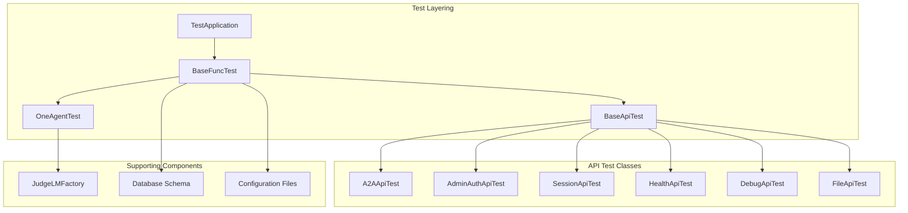
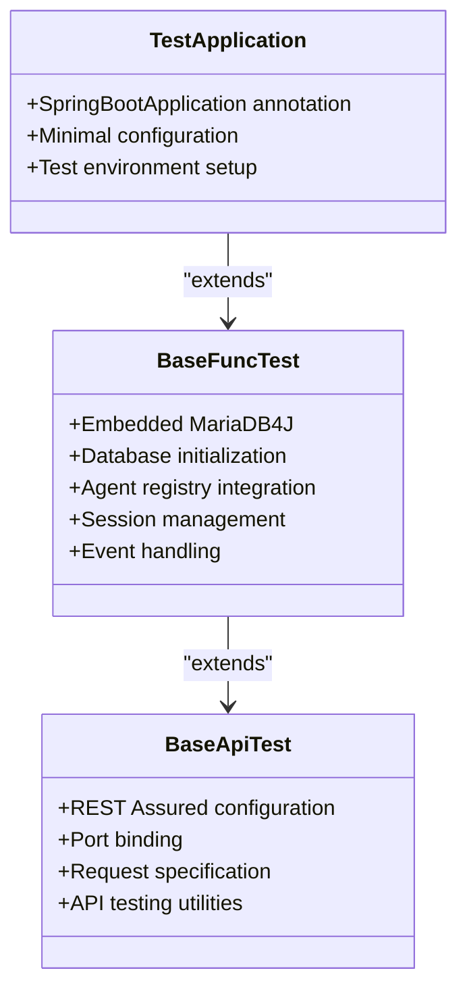
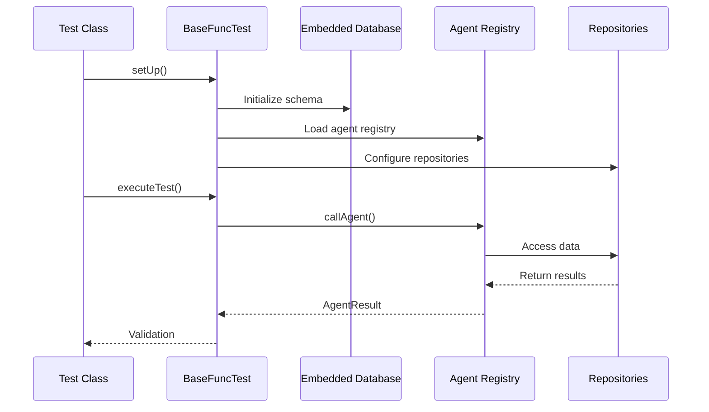
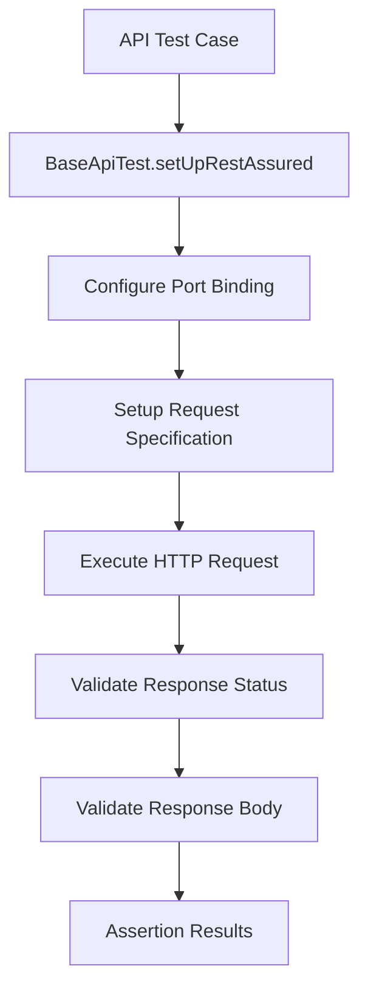
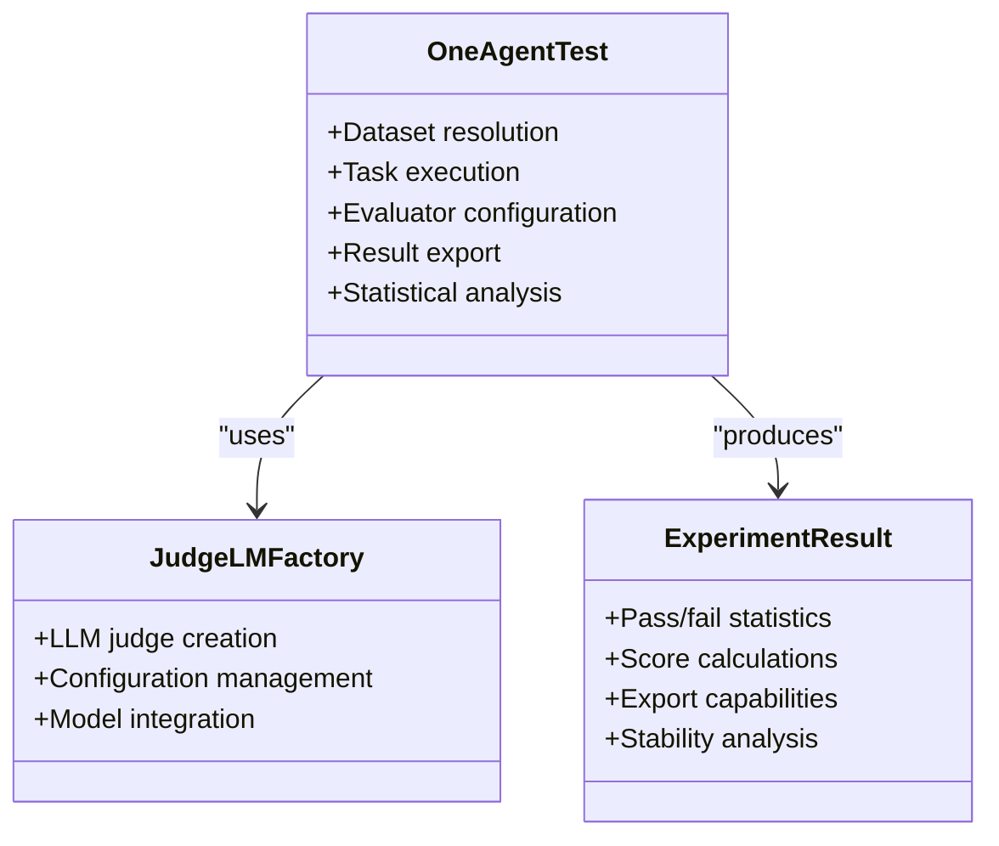
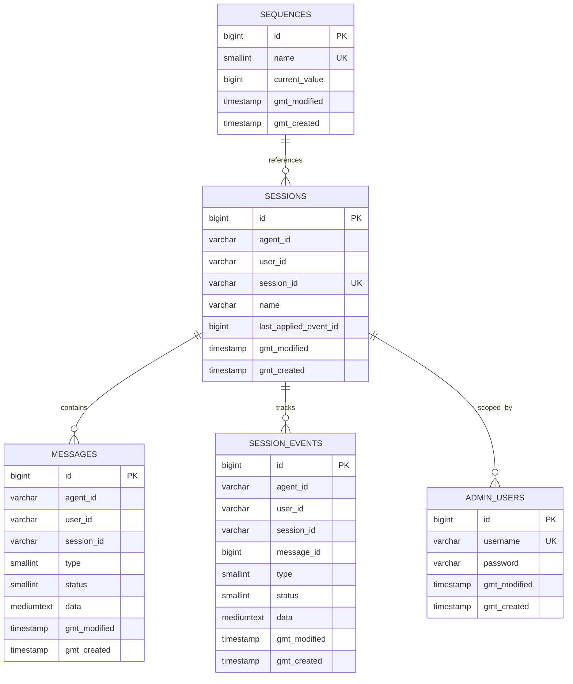
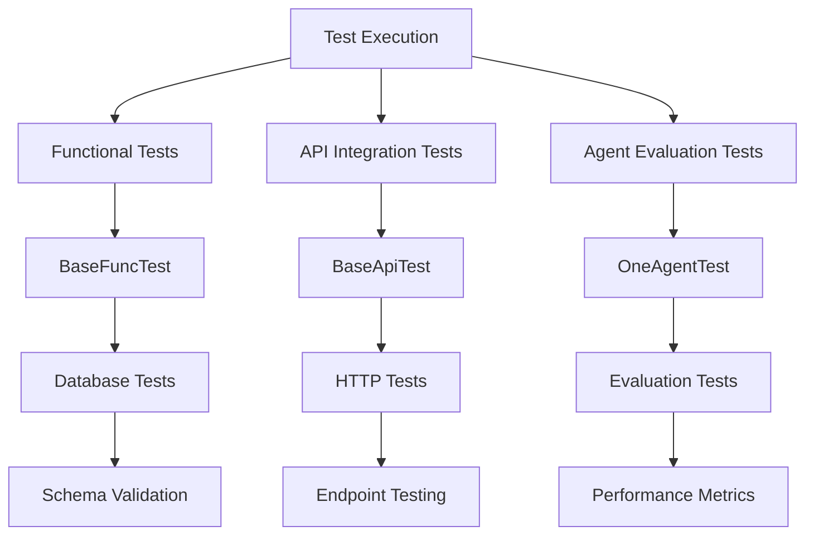

# Comprehensive Testing Framework

<cite>
**Referenced Files in This Document**
- [TestApplication.java](file://backend_java/bootstrap/src/test/java/com/aliyun/tam/x/tron/TestApplication.java)
- [BaseFuncTest.java](file://backend_java/bootstrap/src/test/java/com/aliyun/tam/x/tron/BaseFuncTest.java)
- [BaseApiTest.java](file://backend_java/bootstrap/src/test/java/com/aliyun/tam/x/tron/api/BaseApiTest.java)
- [OneAgentTest.java](file://backend_java/bootstrap/src/test/java/com/aliyun/tam/x/tron/core/OneAgentTest.java)
- [A2AApiTest.java](file://backend_java/bootstrap/src/test/java/com/aliyun/tam/x/tron/api/A2AApiTest.java)
- [AdminAuthApiTest.java](file://backend_java/bootstrap/src/test/java/com/aliyun/tam/x/tron/api/AdminAuthApiTest.java)
- [SessionApiTest.java](file://backend_java/bootstrap/src/test/java/com/aliyun/tam/x/tron/api/SessionApiTest.java)
- [HealthApiTest.java](file://backend_java/bootstrap/src/test/java/com/aliyun/tam/x/tron/api/HealthApiTest.java)
- [DebugApiTest.java](file://backend_java/bootstrap/src/test/java/com/aliyun/tam/x/tron/api/DebugApiTest.java)
- [FileApiTest.java](file://backend_java/bootstrap/src/test/java/com/aliyun/tam/x/tron/api/FileApiTest.java)
- [JudgeLMFactory.java](file://backend_java/bootstrap/src/test/java/com/aliyun/tam/x/tron/JudgeLMFactory.java)
- [application.yaml](file://backend_java/bootstrap/src/test/resources/application.yaml)
- [init.sql](file://backend_java/bootstrap/src/main/resources/schema/init.sql)
- [test-one-agent-v1.json](file://backend_java/bootstrap/src/test/resources/datasets/test-one-agent-v1.json)
- [pom.xml](file://backend_java/bootstrap/pom.xml)
</cite>

## Table of Contents
1. [Introduction](#introduction)
2. [Testing Architecture Overview](#testing-architecture-overview)
3. [Core Testing Infrastructure](#core-testing-infrastructure)
4. [Functional Testing Framework](#functional-testing-framework)
5. [API Testing Suite](#api-testing-suite)
6. [Agent Evaluation Framework](#agent-evaluation-framework)
7. [Database Testing Strategy](#database-testing-strategy)
8. [Test Configuration and Environment](#test-configuration-and-environment)
9. [Test Execution and Reporting](#test-execution-and-reporting)
10. [Best Practices and Guidelines](#best-practices-and-guidelines)

## Introduction

The Tron One Agent project implements a comprehensive testing framework that ensures reliability, maintainability, and quality assurance across all components. This testing framework encompasses functional testing, API integration testing, agent evaluation, and automated quality assessment using advanced evaluation metrics.

The testing infrastructure leverages modern Java testing technologies including JUnit 5, Spring Boot Test, REST Assured for API testing, and specialized evaluation frameworks for agent performance assessment. The framework supports both unit-level and integration-level testing with sophisticated database management and environment configuration.

## Testing Architecture Overview

The testing framework follows a layered architecture with clear separation of concerns:

**Diagram sources**
- [TestApplication.java:22-24](file://backend_java/bootstrap/src/test/java/com/aliyun/tam/x/tron/TestApplication.java#L22-L24)
- [BaseFuncTest.java:53-55](file://backend_java/bootstrap/src/test/java/com/aliyun/tam/x/tron/BaseFuncTest.java#L53-L55)
- [BaseApiTest.java:31-31](file://backend_java/bootstrap/src/test/java/com/aliyun/tam/x/tron/api/BaseApiTest.java#L31-L31)

The architecture consists of three primary layers:

1. **Foundation Layer**: TestApplication and Base classes providing common infrastructure
2. **Specialized Testing Layer**: API-specific test classes for different endpoint groups
3. **Evaluation Layer**: Advanced testing capabilities for agent performance assessment

## Core Testing Infrastructure

### Test Application Configuration

The foundation of the testing framework is established through the TestApplication class, which bootstraps the Spring Boot test environment:

**Diagram sources**
- [TestApplication.java:22-24](file://backend_java/bootstrap/src/test/java/com/aliyun/tam/x/tron/TestApplication.java#L22-L24)
- [BaseFuncTest.java:55-55](file://backend_java/bootstrap/src/test/java/com/aliyun/tam/x/tron/BaseFuncTest.java#L55-L55)
- [BaseApiTest.java:31-31](file://backend_java/bootstrap/src/test/java/com/aliyun/tam/x/tron/api/BaseApiTest.java#L31-L31)

### Embedded Database Management

The testing framework utilizes an embedded MariaDB4J instance for isolated database testing:

**Section sources**
- [BaseFuncTest.java:75-85](file://backend_java/bootstrap/src/test/java/com/aliyun/tam/x/tron/BaseFuncTest.java#L75-L85)
- [init.sql:15-219](file://backend_java/bootstrap/src/main/resources/schema/init.sql#L15-L219)

The database initialization process includes:
- Automatic port allocation for isolation
- Schema creation from SQL scripts
- Test data preparation
- Connection property configuration

## Functional Testing Framework

### Base Functional Test Class

The BaseFuncTest class serves as the foundation for all functional tests, providing essential infrastructure for agent testing:

**Diagram sources**
- [BaseFuncTest.java:160-219](file://backend_java/bootstrap/src/test/java/com/aliyun/tam/x/tron/BaseFuncTest.java#L160-L219)

**Section sources**
- [BaseFuncTest.java:57-85](file://backend_java/bootstrap/src/test/java/com/aliyun/tam/x/tron/BaseFuncTest.java#L57-L85)
- [BaseFuncTest.java:111-158](file://backend_java/bootstrap/src/test/java/com/aliyun/tam/x/tron/BaseFuncTest.java#L111-L158)

### Agent Call Execution

The framework provides a standardized method for executing agent interactions:

The callAgent method handles:
- Session creation and management
- User message processing
- Agent handler invocation
- Event sink creation
- Result validation

## API Testing Suite

### REST Assured Integration

The BaseApiTest class extends the functional testing foundation with REST Assured for comprehensive API testing:

**Diagram sources**
- [BaseApiTest.java:45-75](file://backend_java/bootstrap/src/test/java/com/aliyun/tam/x/tron/api/BaseApiTest.java#L45-L75)

### API Test Categories

The testing suite covers multiple API endpoint categories:

#### Authentication and Authorization Tests
- JWT token validation
- Admin user management
- Cross-user authorization enforcement
- Endpoint protection verification

#### Session Management Tests
- Session lifecycle management
- Message retrieval and pagination
- Event tracking and monitoring
- Cross-user session isolation

#### Agent Communication Tests
- A2A (Agent-to-Agent) protocol implementation
- JSON-RPC message handling
- Task execution and subscription
- Error handling and validation

**Section sources**
- [AdminAuthApiTest.java:38-231](file://backend_java/bootstrap/src/test/java/com/aliyun/tam/x/tron/api/AdminAuthApiTest.java#L38-L231)
- [SessionApiTest.java:36-669](file://backend_java/bootstrap/src/test/java/com/aliyun/tam/x/tron/api/SessionApiTest.java#L36-L669)
- [A2AApiTest.java:29-212](file://backend_java/bootstrap/src/test/java/com/aliyun/tam/x/tron/api/A2AApiTest.java#L29-L212)

## Agent Evaluation Framework

### Advanced Evaluation System

The OneAgentTest class implements a sophisticated evaluation framework using the dokimos-junit library:

**Diagram sources**
- [OneAgentTest.java:40-138](file://backend_java/bootstrap/src/test/java/com/aliyun/tam/x/tron/core/OneAgentTest.java#L40-L138)
- [JudgeLMFactory.java:38-106](file://backend_java/bootstrap/src/test/java/com/aliyun/tam/x/tron/JudgeLMFactory.java#L38-L106)

### Evaluation Metrics and Criteria

The evaluation framework implements multiple assessment criteria:

**Section sources**
- [OneAgentTest.java:64-85](file://backend_java/bootstrap/src/test/java/com/aliyun/tam/x/tron/core/OneAgentTest.java#L64-L85)
- [test-one-agent-v1.json:1-13](file://backend_java/bootstrap/src/test/resources/datasets/test-one-agent-v1.json#L1-L13)

The evaluation system includes:
- **Relevance Assessment**: Measures answer relevance to questions
- **Quality Evaluation**: Assesses helpfulness and completeness
- **Statistical Analysis**: Provides pass rates and standard deviations
- **Export Functionality**: Generates comprehensive test reports

## Database Testing Strategy

### Schema Management and Initialization

The testing framework employs a comprehensive database schema management system:

**Diagram sources**
- [init.sql:17-219](file://backend_java/bootstrap/src/main/resources/schema/init.sql#L17-L219)

### Test Data Management

The framework implements sophisticated test data management:

**Section sources**
- [BaseFuncTest.java:116-158](file://backend_java/bootstrap/src/test/java/com/aliyun/tam/x/tron/BaseFuncTest.java#L116-L158)
- [application.yaml:1-24](file://backend_java/bootstrap/src/test/resources/application.yaml#L1-24)

Key features include:
- Automated schema initialization
- Test data isolation
- Transaction management
- Cleanup procedures

## Test Configuration and Environment

### Environment Setup

The testing framework utilizes dotenv configuration for flexible environment management:

**Section sources**
- [BaseFuncTest.java:57-85](file://backend_java/bootstrap/src/test/java/com/aliyun/tam/x/tron/BaseFuncTest.java#L57-L85)
- [application.yaml:13-24](file://backend_java/bootstrap/src/test/resources/application.yaml#L13-L24)

The configuration system supports:
- API key management for external services
- Database connection parameters
- Feature flag configuration
- Environment-specific settings

### Dependency Management

The testing dependencies are carefully managed through Maven configuration:

**Section sources**
- [pom.xml:117-147](file://backend_java/bootstrap/pom.xml#L117-L147)

Key testing dependencies include:
- **JUnit 5**: Core testing framework
- **REST Assured**: HTTP API testing
- **MariaDB4J**: Embedded database
- **Dokimos**: Advanced evaluation metrics
- **Spring Boot Test**: Framework integration

## Test Execution and Reporting

### Execution Strategy

The testing framework implements a multi-layered execution strategy:

### Reporting and Export

The framework provides comprehensive reporting capabilities:

**Section sources**
- [OneAgentTest.java:121-128](file://backend_java/bootstrap/src/test/java/com/aliyun/tam/x/tron/core/OneAgentTest.java#L121-L128)

Report formats include:
- **JSON Exports**: Machine-readable test results
- **HTML Reports**: Human-readable summaries
- **Markdown Documents**: Documentation-friendly format
- **Statistical Analysis**: Pass rates and performance metrics

## Best Practices and Guidelines

### Test Organization Principles

The testing framework follows established best practices:

1. **Layered Architecture**: Clear separation between test types
2. **Shared Infrastructure**: Common base classes for consistency
3. **Isolated Environments**: Database and environment isolation
4. **Comprehensive Coverage**: Multi-dimensional testing approach

### Test Design Patterns

The framework implements several design patterns:

**Section sources**
- [BaseApiTest.java:40-43](file://backend_java/bootstrap/src/test/java/com/aliyun/tam/x/tron/api/BaseApiTest.java#L40-L43)
- [BaseFuncTest.java:160-219](file://backend_java/bootstrap/src/test/java/com/aliyun/tam/x/tron/BaseFuncTest.java#L160-L219)

Key patterns include:
- **Template Method Pattern**: Base classes define test structure
- **Factory Pattern**: JudgeLMFactory creates evaluation components
- **Strategy Pattern**: Different test execution strategies
- **Observer Pattern**: Event-driven testing infrastructure

### Quality Assurance Standards

The framework maintains high standards for test quality:

- **Deterministic Behavior**: Consistent test execution
- **Clear Assertions**: Explicit validation criteria
- **Comprehensive Logging**: Detailed execution traces
- **Performance Monitoring**: Timing and resource usage tracking

The testing framework represents a mature, enterprise-grade solution that ensures comprehensive quality assurance across all aspects of the Tron One Agent system. Its layered architecture, sophisticated evaluation capabilities, and robust infrastructure provide reliable testing foundations for continuous development and deployment.