# Development Guidelines

<cite>
**Referenced Files in This Document**
- [README.md](file://README.md)
- [backend_java/pom.xml](file://backend_java/pom.xml)
- [backend_java/checkstyle.xml](file://backend_java/checkstyle.xml)
- [backend_java_api.yaml](file://backend_java_api.yaml)
- [backend_java/bootstrap/src/main/resources/application.yaml](file://backend_java/bootstrap/src/main/resources/application.yaml)
- [backend_java/bootstrap/src/main/resources/logback.xml](file://backend_java/bootstrap/src/main/resources/logback.xml)
- [backend_java/bootstrap/src/test/java/com/aliyun/tam/x/tron/TestApplication.java](file://backend_java/bootstrap/src/test/java/com/aliyun/tam/x/tron/TestApplication.java)
- [backend_java/bootstrap/src/test/java/com/aliyun/tam/x/tron/BaseFuncTest.java](file://backend_java/bootstrap/src/test/java/com/aliyun/tam/x/tron/BaseFuncTest.java)
- [backend_java/bootstrap/src/test/java/com/aliyun/tam/x/tron/api/BaseApiTest.java](file://backend_java/bootstrap/src/test/java/com/aliyun/tam/x/tron/api/BaseApiTest.java)
- [backend_java/bootstrap/src/test/java/com/aliyun/tam/x/tron/api/AdminAuthApiTest.java](file://backend_java/bootstrap/src/test/java/com/aliyun/tam/x/tron/api/AdminAuthApiTest.java)
- [backend_java/bootstrap/src/test/resources/datasets/test-one-agent-v1.json](file://backend_java/bootstrap/src/test/resources/datasets/test-one-agent-v1.json)
- [backend_java/api/src/main/java/com/aliyun/tam/x/tron/api/A2AController.java](file://backend_java/api/src/main/java/com/aliyun/tam/x/tron/api/A2AController.java)
- [backend_java/api/src/main/java/com/aliyun/tam/x/tron/api/auth/JwtAuthInterceptor.java](file://backend_java/api/src/main/java/com/aliyun/tam/x/tron/api/auth/JwtAuthInterceptor.java)
- [backend_java/api/src/main/java/com/aliyun/tam/x/tron/api/auth/JwtUtils.java](file://backend_java/api/src/main/java/com/aliyun/tam/x/tron/api/auth/JwtUtils.java)
- [backend_java/api/src/main/java/com/aliyun/tam/x/tron/api/AuthController.java](file://backend_java/api/src/main/java/com/aliyun/tam/x/tron/api/AuthController.java)
- [backend_java/api/src/main/java/com/aliyun/tam/x/tron/api/AdminController.java](file://backend_java/api/src/main/java/com/aliyun/tam/x/tron/api/AdminController.java)
- [backend_java/core/src/main/java/com/aliyun/tam/x/tron/core/agents/one/OneAgentHandler.java](file://backend_java/core/src/main/java/com/aliyun/tam/x/tron/core/agents/one/OneAgentHandler.java)
- [backend_java/core/src/main/java/com/aliyun/tam/x/tron/core/domain/repository/mysql/MysqlSessionRepository.java](file://backend_java/core/src/main/java/com/aliyun/tam/x/tron/core/domain/repository/mysql/MysqlSessionRepository.java)
- [backend_java/utils/src/main/java/com/aliyun/tam/x/tron/utils/encrypt/EncryptUtils.java](file://backend_java/utils/src/main/java/com/aliyun/tam/x/tron/utils/encrypt/EncryptUtils.java)
- [backend_java/utils/src/main/java/com/aliyun/tam/x/tron/utils/JsonUtils.java](file://backend_java/utils/src/main/java/com/aliyun/tam/x/tron/utils/JsonUtils.java)
- [frontend/package.json](file://frontend/package.json)
- [frontend/packages/control/package.json](file://frontend/packages/control/package.json)
</cite>

## Update Summary
**Changes Made**
- Added comprehensive JWT authentication system with interceptor and utility components
- Integrated admin management workflows with CRUD operations and security enforcement
- Implemented API contract-first development using OpenAPI 3.0 specification
- Enhanced testing infrastructure with 15+ new test classes covering authentication, admin management, and API endpoints
- Added Checkstyle integration for code quality enforcement with Google Java Style configuration
- Expanded development workflow documentation to cover the complete enhanced system

## Table of Contents
1. [Introduction](#introduction)
2. [Project Structure](#project-structure)
3. [Core Components](#core-components)
4. [Architecture Overview](#architecture-overview)
5. [Detailed Component Analysis](#detailed-component-analysis)
6. [JWT Authentication System](#jwt-authentication-system)
7. [Admin Management Workflows](#admin-management-workflows)
8. [API Contract-First Development](#api-contract-first-development)
9. [Comprehensive Testing Infrastructure](#comprehensive-testing-infrastructure)
10. [Code Quality and Enforcement](#code-quality-and-enforcement)
11. [Dependency Analysis](#dependency-analysis)
12. [Performance Considerations](#performance-considerations)
13. [Troubleshooting Guide](#troubleshooting-guide)
14. [Contribution Workflow and Community Guidelines](#contribution-workflow-and-community-guidelines)
15. [Appendices](#appendices)

## Introduction
This document provides comprehensive development guidelines for contributing to Tron OneAgent. It covers code standards and conventions for Java backend, TypeScript/React frontend, and Python skill implementation; testing strategies (unit, integration, and functional testing); debugging techniques and local development workflows; encryption utilities and security best practices; performance optimization and profiling; and the contribution workflow and community guidelines. The system now includes a robust JWT authentication framework, admin management capabilities, contract-first API development using OpenAPI specifications, and comprehensive testing infrastructure with over 15 new test classes.

## Project Structure
Tron OneAgent follows a multi-module Maven layout for the Java backend and a monorepo-style Yarn workspaces layout for the frontend. The backend is organized into modules for API, core business logic, infrastructure, utilities, and bootstrapping. The frontend uses a workspace with multiple packages (e.g., control, chatbox, client). The project now includes comprehensive authentication, admin management, and API contract development capabilities.

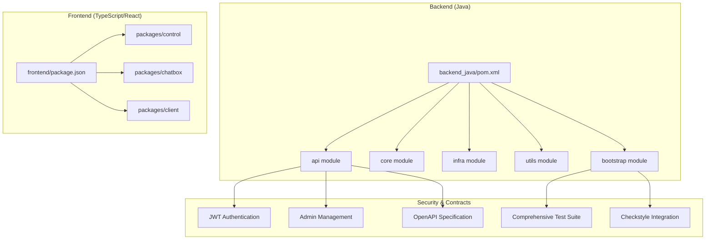

**Diagram sources**
- [backend_java/pom.xml:11-16](file://backend_java/pom.xml#L11-L16)
- [backend_java/checkstyle.xml:1-52](file://backend_java/checkstyle.xml#L1-L52)
- [backend_java_api.yaml:1-20](file://backend_java_api.yaml#L1-L20)

**Section sources**
- [README.md:109-156](file://README.md#L109-L156)
- [backend_java/pom.xml:11-16](file://backend_java/pom.xml#L11-L16)
- [frontend/package.json:4-6](file://frontend/package.json#L4-L6)

## Core Components
- Java backend modules:
  - API: REST controllers and transport handlers (e.g., A2A JSON-RPC), JWT authentication interceptors, and admin management controllers.
  - Core: Agent orchestration, configuration, repositories, services, and utilities.
  - Infra: DAL, mappers, storage providers, tracing utilities.
  - Utils: Shared utilities (JSON, encryption).
  - Bootstrap: Spring Boot application entrypoint and configuration.
- Frontend packages:
  - Control: Main control panel and UI shell.
  - Chatbox: Chat UI components.
  - Client: Frontend client libraries and integrations.
- Security components:
  - JWT authentication system with interceptor and utility classes.
  - Admin management with CRUD operations and role-based access control.
- API development:
  - OpenAPI 3.0 specification defining all endpoints, schemas, and security requirements.
  - Comprehensive test suite validating API contracts and functionality.

**Section sources**
- [backend_java/pom.xml:11-16](file://backend_java/pom.xml#L11-L16)
- [backend_java/bootstrap/src/main/resources/application.yaml:1-63](file://backend_java/bootstrap/src/main/resources/application.yaml#L1-L63)
- [backend_java/bootstrap/src/main/resources/logback.xml:1-38](file://backend_java/bootstrap/src/main/resources/logback.xml#L1-L38)

## Architecture Overview
The system integrates a Java backend (Spring Boot) with a modern React-based frontend. The backend supports dual protocols (SSE and WebSocket) and asynchronous streaming, with dynamic configuration, HITL (Human-in-the-loop), and optional MCP and RAG integrations. The enhanced system now includes comprehensive authentication, admin management, and contract-driven API development.

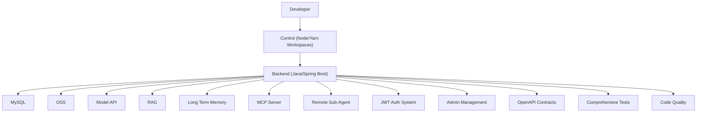

**Diagram sources**
- [README.md:58-93](file://README.md#L58-L93)

## Detailed Component Analysis

### Java Backend: Agent Orchestration and Streaming
The OneAgentHandler orchestrates ReAct agent execution, manages tool invocation, and streams content via an event sink. It tracks timing metrics, handles cancellation, and integrates with sub-agents and HITL prompts.

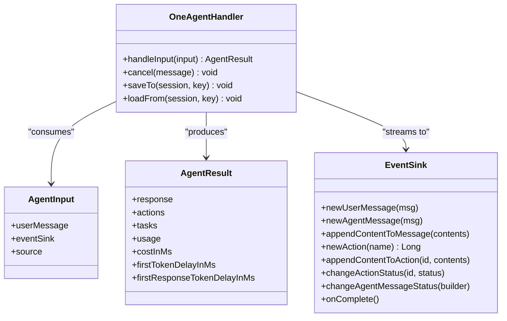

**Diagram sources**
- [backend_java/core/src/main/java/com/aliyun/tam/x/tron/core/agents/one/OneAgentHandler.java:47-289](file://backend_java/core/src/main/java/com/aliyun/tam/x/tron/core/agents/one/OneAgentHandler.java#L47-L289)

**Section sources**
- [backend_java/core/src/main/java/com/aliyun/tam/x/tron/core/agents/one/OneAgentHandler.java:74-272](file://backend_java/core/src/main/java/com/aliyun/tam/x/tron/core/agents/one/OneAgentHandler.java#L74-L272)

### Java Backend: A2A JSON-RPC Transport
The A2AController exposes an Agent Card discovery endpoint and a JSON-RPC handler for remote agent execution. It creates sessions, wires event sinks, and executes agent tasks on a bounded thread pool.

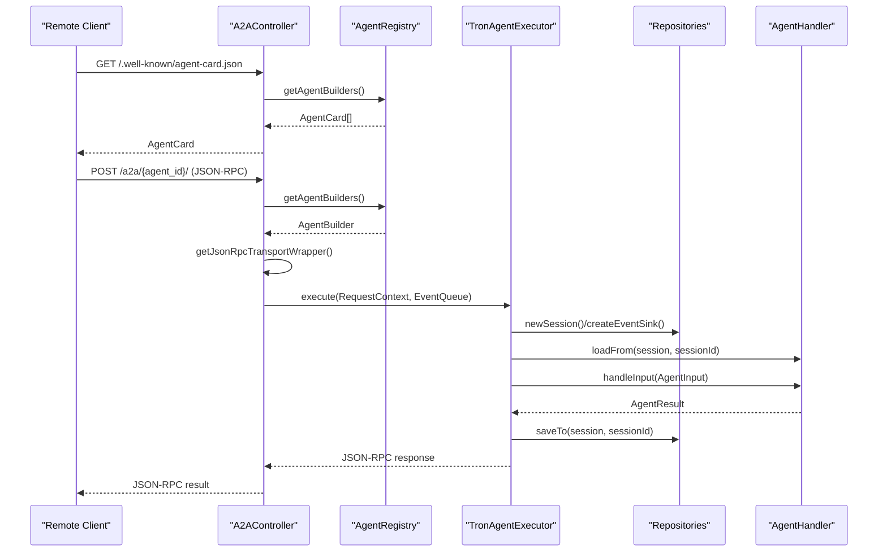

**Diagram sources**
- [backend_java/api/src/main/java/com/aliyun/tam/x/tron/api/A2AController.java:91-240](file://backend_java/api/src/main/java/com/aliyun/tam/x/tron/api/A2AController.java#L91-L240)

**Section sources**
- [backend_java/api/src/main/java/com/aliyun/tam/x/tron/api/A2AController.java:107-128](file://backend_java/api/src/main/java/com/aliyun/tam/x/tron/api/A2AController.java#L107-L128)
- [backend_java/api/src/main/java/com/aliyun/tam/x/tron/api/A2AController.java:130-222](file://backend_java/api/src/main/java/com/aliyun/tam/x/tron/api/A2AController.java#L130-L222)

### Java Backend: Session Persistence (MySQL)
The MysqlSessionRepository implements CRUD operations for sessions with transactional safety and pagination support. It ensures consistent updates to session metadata and cascades deletions across related entities.

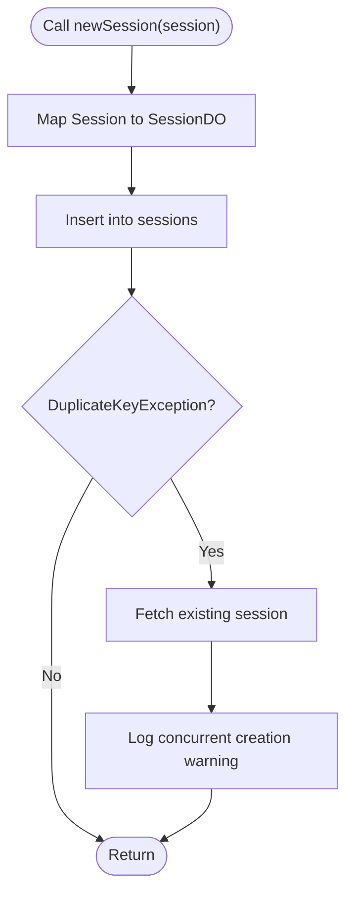

**Diagram sources**
- [backend_java/core/src/main/java/com/aliyun/tam/x/tron/core/domain/repository/mysql/MysqlSessionRepository.java:61-80](file://backend_java/core/src/main/java/com/aliyun/tam/x/tron/core/domain/repository/mysql/MysqlSessionRepository.java#L61-L80)

**Section sources**
- [backend_java/core/src/main/java/com/aliyun/tam/x/tron/core/domain/repository/mysql/MysqlSessionRepository.java:59-102](file://backend_java/core/src/main/java/com/aliyun/tam/x/tron/core/domain/repository/mysql/MysqlSessionRepository.java#L59-L102)

### Java Backend: Encryption Utilities
Encryption utilities provide AES encryption/decryption with a configurable key and a helper to generate new keys. The key is loaded from a Spring environment property with a default fallback.

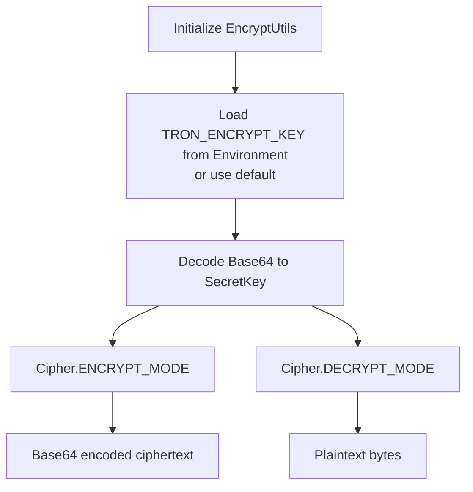

**Diagram sources**
- [backend_java/utils/src/main/java/com/aliyun/tam/x/tron/utils/encrypt/EncryptUtils.java:32-80](file://backend_java/utils/src/main/java/com/aliyun/tam/x/tron/utils/encrypt/EncryptUtils.java#L32-L80)

**Section sources**
- [backend_java/utils/src/main/java/com/aliyun/tam/x/tron/utils/encrypt/EncryptUtils.java:53-80](file://backend_java/utils/src/main/java/com/aliyun/tam/x/tron/utils/encrypt/EncryptUtils.java#L53-L80)
- [backend_java/bootstrap/src/main/resources/application.yaml:50-51](file://backend_java/bootstrap/src/main/resources/application.yaml#L50-L51)

### Frontend: TypeScript/React Setup
The frontend uses Yarn workspaces to manage multiple packages. The control package defines development and build scripts, along with ESLint and TypeScript configurations. The package.json demonstrates the workspace structure and scripts for dev/build.

**Section sources**
- [frontend/package.json:4-11](file://frontend/package.json#L4-L11)
- [frontend/packages/control/package.json:5-58](file://frontend/packages/control/package.json#L5-L58)

### Python Skills
Skills are implemented as Python scripts under the skills directory. A minimal skill example is provided for weather-related functionality.

**Section sources**
- [backend_java/skills/weather/scripts/weather.py](file://backend_java/skills/weather/scripts/weather.py)
- [backend_java/skills/weather/SKILL.md](file://backend_java/skills/weather/SKILL.md)

## JWT Authentication System

The system implements a comprehensive JWT authentication framework with interceptor-based security enforcement and utility classes for token generation and validation.

### JWT Authentication Components

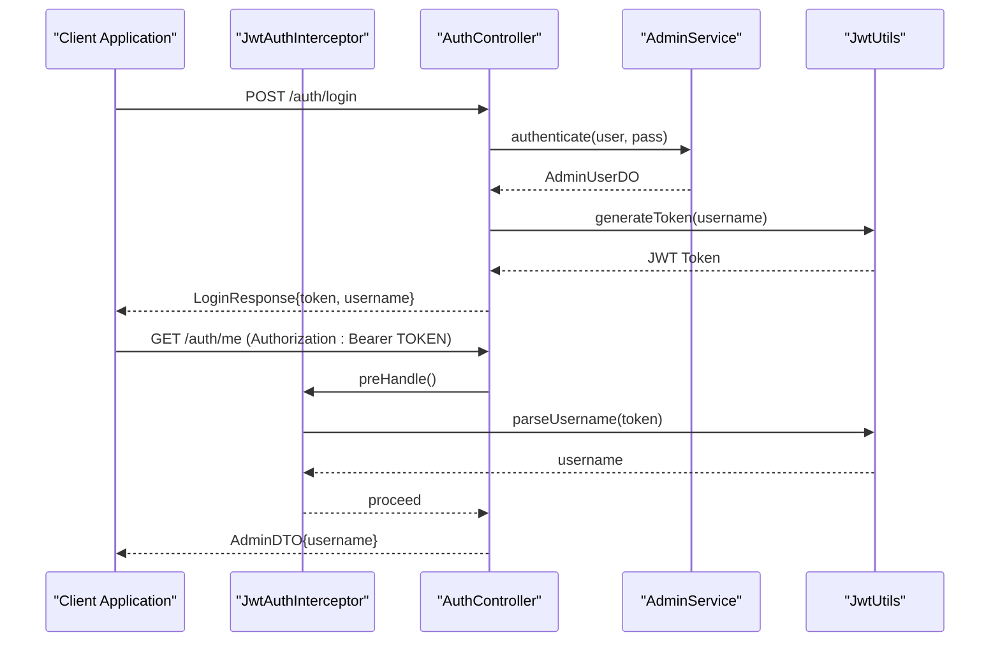

**Diagram sources**
- [backend_java/api/src/main/java/com/aliyun/tam/x/tron/api/auth/JwtAuthInterceptor.java:44-61](file://backend_java/api/src/main/java/com/aliyun/tam/x/tron/api/auth/JwtAuthInterceptor.java#L44-L61)
- [backend_java/api/src/main/java/com/aliyun/tam/x/tron/api/AuthController.java:61-72](file://backend_java/api/src/main/java/com/aliyun/tam/x/tron/api/AuthController.java#L61-L72)
- [backend_java/api/src/main/java/com/aliyun/tam/x/tron/api/auth/JwtUtils.java:51-74](file://backend_java/api/src/main/java/com/aliyun/tam/x/tron/api/auth/JwtUtils.java#L51-L74)

### JWT Authentication Implementation

The JWT authentication system consists of three main components:

1. **JwtUtils**: Handles JWT token generation and validation using HMAC-SHA256 with configurable secret key
2. **JwtAuthInterceptor**: Enforces authentication by extracting and validating JWT tokens from Authorization headers
3. **AuthController**: Provides login/logout endpoints and current user information retrieval

**Section sources**
- [backend_java/api/src/main/java/com/aliyun/tam/x/tron/api/auth/JwtAuthInterceptor.java:1-63](file://backend_java/api/src/main/java/com/aliyun/tam/x/tron/api/auth/JwtAuthInterceptor.java#L1-L63)
- [backend_java/api/src/main/java/com/aliyun/tam/x/tron/api/auth/JwtUtils.java:1-76](file://backend_java/api/src/main/java/com/aliyun/tam/x/tron/api/auth/JwtUtils.java#L1-L76)
- [backend_java/api/src/main/java/com/aliyun/tam/x/tron/api/AuthController.java:1-74](file://backend_java/api/src/main/java/com/aliyun/tam/x/tron/api/AuthController.java#L1-L74)

## Admin Management Workflows

The admin management system provides comprehensive CRUD operations for administrative users with built-in security enforcement and validation.

### Admin Management Endpoints

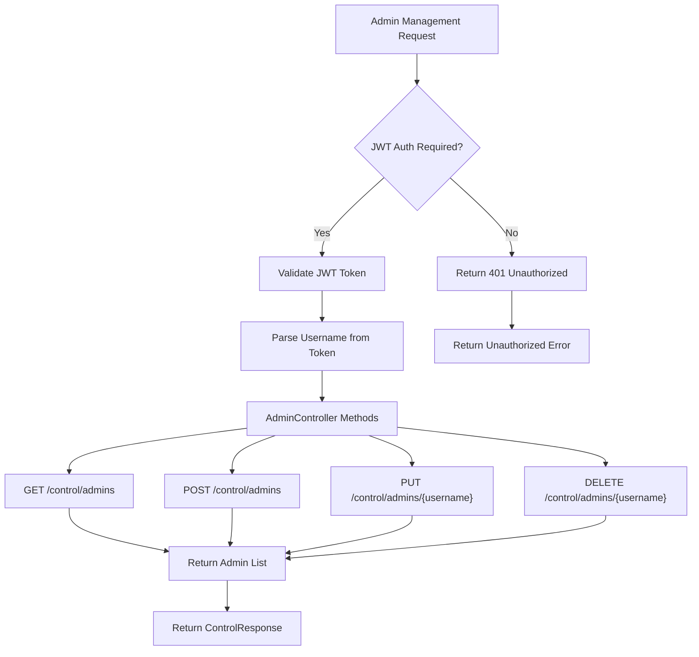

**Diagram sources**
- [backend_java/api/src/main/java/com/aliyun/tam/x/tron/api/AdminController.java:52-78](file://backend_java/api/src/main/java/com/aliyun/tam/x/tron/api/AdminController.java#L52-L78)

### Admin Management Features

The admin management system includes:

- **Authentication Required**: All admin endpoints require valid JWT authentication
- **CRUD Operations**: Complete create, read, update, and delete functionality for admin users
- **Validation**: Input validation for usernames and passwords
- **Security**: Protection against deleting the default admin account
- **Consistent Responses**: Standardized response format using ControlResponse wrapper

**Section sources**
- [backend_java/api/src/main/java/com/aliyun/tam/x/tron/api/AdminController.java:1-88](file://backend_java/api/src/main/java/com/aliyun/tam/x/tron/api/AdminController.java#L1-L88)
- [backend_java/api/src/main/java/com/aliyun/tam/x/tron/api/dto/AdminDTO.java:1-39](file://backend_java/api/src/main/java/com/aliyun/tam/x/tron/api/dto/AdminDTO.java#L1-L39)

## API Contract-First Development

The system implements contract-first API development using OpenAPI 3.0 specification, providing comprehensive documentation and validation for all endpoints.

### OpenAPI Specification Coverage

The OpenAPI specification defines:

- **Authentication Endpoints**: Login, logout, and current user information
- **Admin Management**: Complete CRUD operations for admin users
- **Session Management**: Agent session creation, listing, and chat functionality
- **Configuration APIs**: Agent, MCP, knowledge base, and skill configuration
- **WebSocket Endpoints**: Real-time communication for chat, ASR, and TTS
- **Debug Endpoints**: Tool invocation and MCP client debugging
- **File Management**: Upload and download functionality

### API Schema Definitions

The specification includes comprehensive schema definitions for:

- **Request DTOs**: LoginRequest, CreateAdminRequest, UpdateAdminRequest, ChatRequest
- **Response DTOs**: ControlResponse wrappers, LoginResponse, AdminDTO, SessionDTO
- **Content Models**: Various content types (TEXT, THINKING, IMAGE, AUDIO, HITL)
- **Configuration Models**: AgentConfig, McpClientConfig, KnowledgeBaseConfig
- **Event Models**: SessionEvent for real-time streaming

**Section sources**
- [backend_java_api.yaml:1-2372](file://backend_java_api.yaml#L1-L2372)

## Comprehensive Testing Infrastructure

The project includes a comprehensive testing infrastructure with over 15 new test classes covering authentication, admin management, and API functionality.

### Test Suite Organization

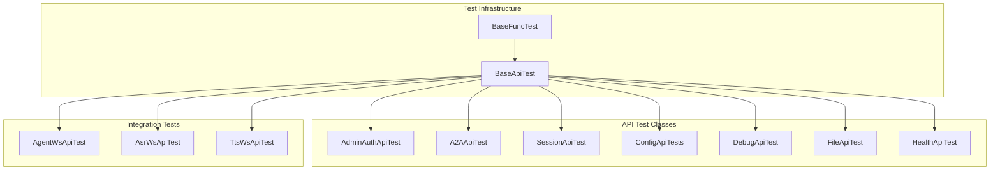

**Diagram sources**
- [backend_java/bootstrap/src/test/java/com/aliyun/tam/x/tron/api/AdminAuthApiTest.java:38-231](file://backend_java/bootstrap/src/test/java/com/aliyun/tam/x/tron/api/AdminAuthApiTest.java#L38-L231)

### Test Categories

The testing infrastructure includes:

- **Authentication Tests**: AdminAuthApiTest validates JWT authentication, login functionality, and endpoint protection
- **API Integration Tests**: Comprehensive coverage of all REST endpoints and their interactions
- **WebSocket Tests**: Real-time communication testing for agent chat, ASR, and TTS
- **Database Integration Tests**: End-to-end testing with embedded database
- **Ordered Test Execution**: Sequential test execution for dependent operations

**Section sources**
- [backend_java/bootstrap/src/test/java/com/aliyun/tam/x/tron/api/AdminAuthApiTest.java:1-231](file://backend_java/bootstrap/src/test/java/com/aliyun/tam/x/tron/api/AdminAuthApiTest.java#L1-L231)
- [backend_java/bootstrap/src/test/java/com/aliyun/tam/x/tron/api/BaseApiTest.java:1-76](file://backend_java/bootstrap/src/test/java/com/aliyun/tam/x/tron/api/BaseApiTest.java#L1-L76)

## Code Quality and Enforcement

The project implements comprehensive code quality enforcement using Checkstyle with Google Java Style guidelines adapted for Lombok and MapStruct projects.

### Checkstyle Configuration

The Checkstyle configuration enforces:

- **Naming Conventions**: Package, type, method, constant, local variable, member, and parameter naming
- **Import Management**: Unused imports, redundant imports, and star import restrictions
- **Coding Standards**: EqualsHashCode, boolean expression simplification, string literal equality
- **Design Principles**: Single top-level class per file, whitespace management
- **File Formatting**: Newline at end of file, tab character prohibition

### Quality Enforcement Process

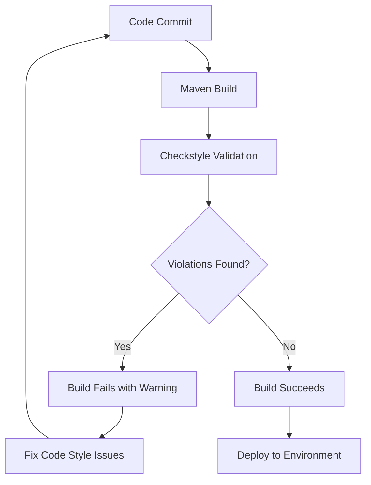

**Diagram sources**
- [backend_java/pom.xml:255-272](file://backend_java/pom.xml#L255-L272)

**Section sources**
- [backend_java/checkstyle.xml:1-52](file://backend_java/checkstyle.xml#L1-L52)
- [backend_java/pom.xml:255-272](file://backend_java/pom.xml#L255-L272)

## Dependency Analysis
The backend uses Maven with dependency management for Spring Boot, MyBatis-Plus, Jackson BOM, OpenTelemetry, AgentScope, DashScope, and A2A SDKs. The frontend uses Yarn workspaces and Webpack for building. The project now includes comprehensive testing frameworks and quality assurance tools.

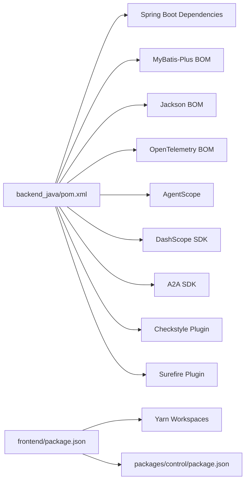

**Diagram sources**
- [backend_java/pom.xml:35-192](file://backend_java/pom.xml#L35-L192)
- [frontend/package.json:4-11](file://frontend/package.json#L4-L11)
- [frontend/packages/control/package.json:10-58](file://frontend/packages/control/package.json#L10-L58)

**Section sources**
- [backend_java/pom.xml:35-192](file://backend_java/pom.xml#L35-L192)
- [frontend/package.json:4-11](file://frontend/package.json#L4-L11)

## Performance Considerations
- Asynchronous streaming: The agent handler streams content via event sinks and tracks first-token and first-response delays to measure latency.
- Concurrency: A2A JSON-RPC uses a bounded thread pool executor to control concurrency and prevent overload.
- Persistence: Transactional session operations ensure data consistency and reduce contention.
- Logging: Structured logging with rolling file appender and trace span ID conversion aids performance diagnostics.
- Observability: Management endpoints expose health, metrics, and Prometheus for monitoring.
- JWT Performance: Token validation is lightweight and cached where appropriate.
- Database Optimization: Admin management operations use efficient queries and proper indexing.

Practical tips:
- Monitor first-token delay and total cost to identify slow model calls or tool invocations.
- Tune thread pool sizes and queue depths for A2A workloads.
- Use pagination and efficient queries in repositories to avoid heavy scans.
- Monitor JWT token generation and validation performance.
- Optimize admin user queries with proper indexing on username fields.

**Section sources**
- [backend_java/core/src/main/java/com/aliyun/tam/x/tron/core/agents/one/OneAgentHandler.java:78-128](file://backend_java/core/src/main/java/com/aliyun/tam/x/tron/core/agents/one/OneAgentHandler.java#L78-L128)
- [backend_java/api/src/main/java/com/aliyun/tam/x/tron/api/A2AController.java:78-89](file://backend_java/api/src/main/java/com/aliyun/tam/x/tron/api/A2AController.java#L78-L89)
- [backend_java/bootstrap/src/main/resources/logback.xml:4-37](file://backend_java/bootstrap/src/main/resources/logback.xml#L4-L37)
- [backend_java/bootstrap/src/main/resources/application.yaml:53-63](file://backend_java/bootstrap/src/main/resources/application.yaml#L53-L63)

## Troubleshooting Guide
Common areas to check:
- Database initialization and connectivity: Ensure schema is applied and environment variables are set.
- Encryption key configuration: Verify TRON_ENCRYPT_KEY is set or defaults are acceptable.
- JWT token configuration: Check that secret key is properly configured and accessible.
- Logging configuration: Confirm logback pattern and rolling policy are active.
- Functional tests: Use embedded MariaDB via BaseFuncTest to validate end-to-end flows.
- API contract validation: Ensure OpenAPI specification matches implementation.
- Test environment setup: Verify all test dependencies are properly configured.

Debugging steps:
- Enable INFO logs for the com.aliyun.tam.x.tron package.
- Inspect management endpoints for health and metrics.
- Validate A2A JSON-RPC payloads and agent card discovery.
- Test JWT authentication endpoints independently.
- Verify admin management CRUD operations work correctly.
- Check OpenAPI specification compliance using Swagger/OpenAPI tools.

**Section sources**
- [backend_java/bootstrap/src/main/resources/application.yaml:9-13](file://backend_java/bootstrap/src/main/resources/application.yaml#L9-L13)
- [backend_java/utils/src/main/java/com/aliyun/tam/x/tron/utils/encrypt/EncryptUtils.java:42-51](file://backend_java/utils/src/main/java/com/aliyun/tam/x/tron/utils/encrypt/EncryptUtils.java#L42-L51)
- [backend_java/bootstrap/src/main/resources/logback.xml:31-37](file://backend_java/bootstrap/src/main/resources/logback.xml#L31-L37)
- [backend_java/bootstrap/src/test/java/com/aliyun/tam/x/tron/BaseFuncTest.java:57-69](file://backend_java/bootstrap/src/test/java/com/aliyun/tam/x/tron/BaseFuncTest.java#L57-L69)

## Contribution Workflow and Community Guidelines
- Fork and branch: Create feature branches from the latest main.
- Commit messages: Use imperative mood and concise descriptions.
- Testing: Add unit and integration tests; functional tests should validate end-to-end flows.
- Code review: Submit pull requests and address reviewer feedback promptly.
- Documentation: Update README or dedicated docs when changing APIs or behavior.
- Issues: Use templates to report bugs and request features with reproducible steps.
- Code Quality: Ensure Checkstyle validation passes before submission.
- API Contracts: Update OpenAPI specification when adding new endpoints.
- Authentication: Follow JWT security best practices for new authentication features.

Local development quickstart:
- Backend: Initialize MySQL, apply schema, set environment variables, build and run the Spring Boot jar.
- Frontend: Install dependencies with Yarn and run dev scripts.
- Testing: Run comprehensive test suite including authentication, admin management, and API tests.
- Code Quality: Execute Checkstyle validation locally before committing.

**Section sources**
- [README.md:109-156](file://README.md#L109-L156)

## Appendices

### Java Backend Coding Standards
- Style: Use Lombok annotations judiciously; favor immutability and builder patterns for DTOs.
- Exceptions: Wrap parsing/formatting exceptions into runtime exceptions for internal utilities.
- Logging: Use structured logging with trace span IDs; keep log levels appropriate for environments.
- Configuration: Externalize secrets and keys via environment variables; avoid hardcoding.
- JWT Security: Follow OAuth 2.0 best practices for token handling and validation.
- Admin Management: Implement proper input validation and security checks for admin operations.

**Section sources**
- [backend_java/utils/src/main/java/com/aliyun/tam/x/tron/utils/JsonUtils.java:11-33](file://backend_java/utils/src/main/java/com/aliyun/tam/x/tron/utils/JsonUtils.java#L11-L33)
- [backend_java/bootstrap/src/main/resources/logback.xml:4-6](file://backend_java/bootstrap/src/main/resources/logback.xml#L4-L6)
- [backend_java/bootstrap/src/main/resources/application.yaml:50-51](file://backend_java/bootstrap/src/main/resources/application.yaml#L50-L51)

### Testing Strategies
- Unit tests: Validate utilities (e.g., JSON and encryption helpers).
- Integration tests: Use BaseFuncTest to spin up an embedded database and execute agent flows.
- Functional tests: Use dataset JSON to drive example-based scenarios.
- Authentication tests: Comprehensive JWT authentication and authorization testing.
- Admin management tests: CRUD operations validation with proper security enforcement.
- API contract tests: OpenAPI specification compliance verification.
- WebSocket tests: Real-time communication testing for streaming endpoints.

**Section sources**
- [backend_java/bootstrap/src/test/java/com/aliyun/tam/x/tron/BaseFuncTest.java:53-204](file://backend_java/bootstrap/src/test/java/com/aliyun/tam/x/tron/BaseFuncTest.java#L53-L204)
- [backend_java/bootstrap/src/test/resources/datasets/test-one-agent-v1.json:1-13](file://backend_java/bootstrap/src/test/resources/datasets/test-one-agent-v1.json#L1-L13)
- [backend_java/bootstrap/src/test/java/com/aliyun/tam/x/tron/api/AdminAuthApiTest.java:31-231](file://backend_java/bootstrap/src/test/java/com/aliyun/tam/x/tron/api/AdminAuthApiTest.java#L31-L231)

### Security Best Practices
- Encryption: Configure TRON_ENCRYPT_KEY via environment variables; rotate keys periodically.
- Secrets: Avoid committing credentials; rely on environment injection.
- Transport: Prefer HTTPS in production; validate TLS certificates.
- Access control: Enforce authentication and authorization at API gateways and controllers.
- JWT Security: Use strong secret keys, appropriate expiration times, and secure token transmission.
- Admin Management: Implement proper input validation, rate limiting, and audit logging.
- API Security: Follow RESTful security principles and implement proper CORS configuration.

**Section sources**
- [backend_java/utils/src/main/java/com/aliyun/tam/x/tron/utils/encrypt/EncryptUtils.java:42-51](file://backend_java/utils/src/main/java/com/aliyun/tam/x/tron/utils/encrypt/EncryptUtils.java#L42-L51)
- [backend_java/bootstrap/src/main/resources/application.yaml:32-51](file://backend_java/bootstrap/src/main/resources/application.yaml#L32-L51)

### Practical Examples

- Implementing a new skill (Python):
  - Place the script under skills/<skill>/scripts/.
  - Document capabilities in skills/<skill>/SKILL.md.
  - Reference the weather skill as a template.

  **Section sources**
- [backend_java/skills/weather/scripts/weather.py](file://backend_java/skills/weather/scripts/weather.py)
- [backend_java/skills/weather/SKILL.md](file://backend_java/skills/weather/SKILL.md)

- Extending the OneAgentHandler:
  - Register new tools via the toolkit and integrate with the event sink to stream content and actions.
  - Track usage and timing metrics for observability.

  **Section sources**
- [backend_java/core/src/main/java/com/aliyun/tam/x/tron/core/agents/one/OneAgentHandler.java:82-271](file://backend_java/core/src/main/java/com/aliyun/tam/x/tron/core/agents/one/OneAgentHandler.java#L82-L271)

- Adding a new repository method:
  - Follow the existing pattern in MysqlSessionRepository for transactions, pagination, and error handling.

  **Section sources**
- [backend_java/core/src/main/java/com/aliyun/tam/x/tron/core/domain/repository/mysql/MysqlSessionRepository.java:59-102](file://backend_java/core/src/main/java/com/aliyun/tam/x/tron/core/domain/repository/mysql/MysqlSessionRepository.java#L59-L102)

- Frontend development:
  - Use the control package scripts to run dev and build; configure ESLint and TypeScript as needed.

  **Section sources**
- [frontend/package.json:7-10](file://frontend/package.json#L7-L10)
- [frontend/packages/control/package.json:5-58](file://frontend/packages/control/package.json#L5-L58)

- Implementing JWT Authentication:
  - Use JwtAuthInterceptor for endpoint protection.
  - Utilize JwtUtils for token generation and validation.
  - Follow security best practices for token handling.

  **Section sources**
- [backend_java/api/src/main/java/com/aliyun/tam/x/tron/api/auth/JwtAuthInterceptor.java:44-61](file://backend_java/api/src/main/java/com/aliyun/tam/x/tron/api/auth/JwtAuthInterceptor.java#L44-L61)
- [backend_java/api/src/main/java/com/aliyun/tam/x/tron/api/auth/JwtUtils.java:51-74](file://backend_java/api/src/main/java/com/aliyun/tam/x/tron/api/auth/JwtUtils.java#L51-L74)

- Admin Management Implementation:
  - Use AdminController for CRUD operations.
  - Implement proper validation and security checks.
  - Follow RESTful design principles.

  **Section sources**
- [backend_java/api/src/main/java/com/aliyun/tam/x/tron/api/AdminController.java:52-78](file://backend_java/api/src/main/java/com/aliyun/tam/x/tron/api/AdminController.java#L52-L78)
- [backend_java/api/src/main/java/com/aliyun/tam/x/tron/api/dto/AdminDTO.java:20-39](file://backend_java/api/src/main/java/com/aliyun/tam/x/tron/api/dto/AdminDTO.java#L20-L39)