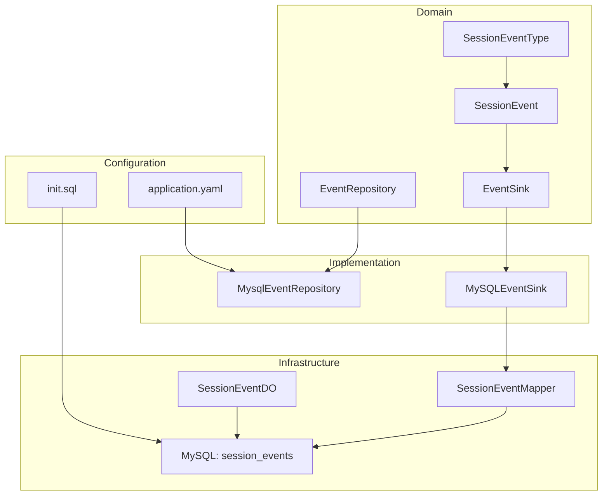
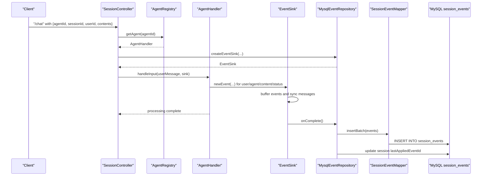
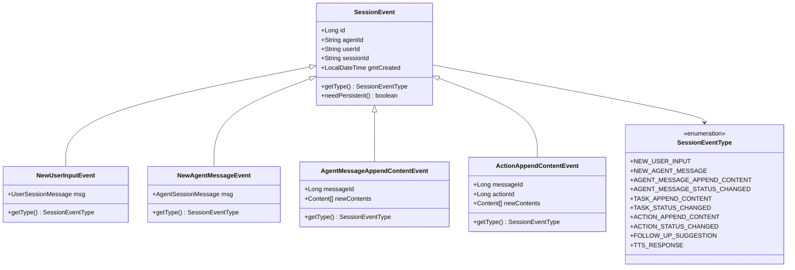
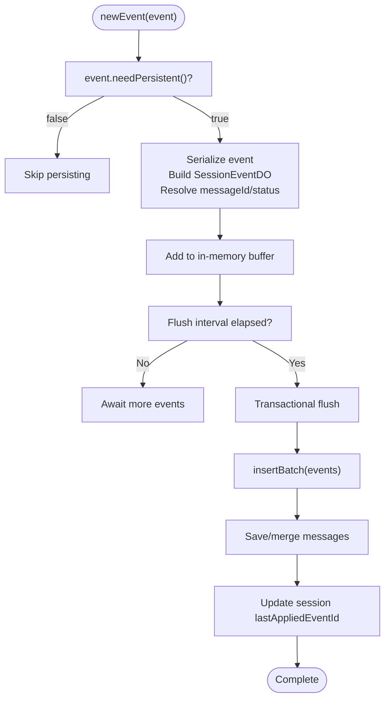
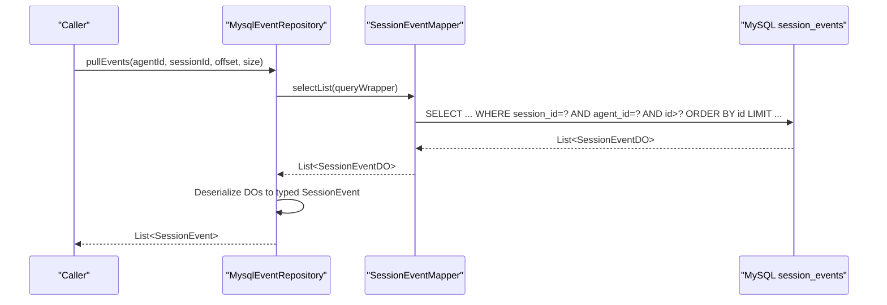
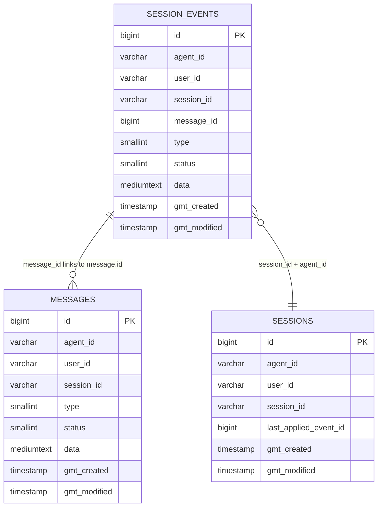
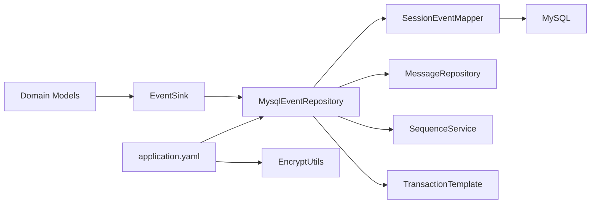

# Audit Trail and Compliance

<cite>
**Referenced Files in This Document**
- [SessionEvent.java](file://backend_java/core/src/main/java/com/aliyun/tam/x/tron/core/domain/models/events/SessionEvent.java)
- [SessionEventType.java](file://backend_java/core/src/main/java/com/aliyun/tam/x/tron/core/domain/models/events/SessionEventType.java)
- [EventSink.java](file://backend_java/core/src/main/java/com/aliyun/tam/x/tron/core/domain/models/events/EventSink.java)
- [NewUserInputEvent.java](file://backend_java/core/src/main/java/com/aliyun/tam/x/tron/core/domain/models/events/NewUserInputEvent.java)
- [NewAgentMessageEvent.java](file://backend_java/core/src/main/java/com/aliyun/tam/x/tron/core/domain/models/events/NewAgentMessageEvent.java)
- [AgentMessageAppendContentEvent.java](file://backend_java/core/src/main/java/com/aliyun/tam/x/tron/core/domain/models/events/AgentMessageAppendContentEvent.java)
- [ActionAppendContentEvent.java](file://backend_java/core/src/main/java/com/aliyun/tam/x/tron/core/domain/models/events/ActionAppendContentEvent.java)
- [EventRepository.java](file://backend_java/core/src/main/java/com/aliyun/tam/x/tron/core/domain/repository/EventRepository.java)
- [MysqlEventRepository.java](file://backend_java/core/src/main/java/com/aliyun/tam/x/tron/core/domain/repository/mysql/MysqlEventRepository.java)
- [SessionEventMapper.java](file://backend_java/infra/src/main/java/com/aliyun/tam/x/tron/infra/dal/mapper/SessionEventMapper.java)
- [SessionEventDO.java](file://backend_java/infra/src/main/java/com/aliyun/tam/x/tron/infra/dal/dataobject/SessionEventDO.java)
- [init.sql](file://backend_java/bootstrap/src/main/resources/schema/init.sql)
- [application.yaml](file://backend_java/bootstrap/src/main/resources/application.yaml)
- [EncryptUtils.java](file://backend_java/utils/src/main/java/com/aliyun/tam/x/tron/utils/encrypt/EncryptUtils.java)
- [develop_guide.md](file://docs/en/develop_guide.md)
</cite>

## Table of Contents
1. [Introduction](#introduction)
2. [Project Structure](#project-structure)
3. [Core Components](#core-components)
4. [Architecture Overview](#architecture-overview)
5. [Detailed Component Analysis](#detailed-component-analysis)
6. [Dependency Analysis](#dependency-analysis)
7. [Performance Considerations](#performance-considerations)
8. [Troubleshooting Guide](#troubleshooting-guide)
9. [Conclusion](#conclusion)
10. [Appendices](#appendices)

## Introduction
This document explains the audit trail and compliance features built on the event sourcing architecture. The system records all meaningful interactions and state changes as immutable events stored in a dedicated event table. This design ensures complete auditability for conversations, agent actions, and system operations, enabling compliance reporting, traceability, and regulatory alignment.

Key compliance benefits:
- Immutable event streams provide tamper-evident logs for audits.
- Rich metadata (agentId, userId, sessionId, messageId, timestamps) supports temporal queries and user activity tracking.
- Centralized event persistence and message synchronization enable robust analytics and reporting.
- Optional encryption utilities support privacy-preserving processing of sensitive content.

## Project Structure
The audit and compliance features span the domain models, repositories, infrastructure persistence, and configuration:

- Domain models define the event types and base event structure.
- Event sink aggregates and persists events in batches.
- Repository layer abstracts event persistence and retrieval.
- Infrastructure layer maps events to relational tables and provides batch insertion.
- Database schema defines the immutable event table and supporting indices.
- Application configuration exposes encryption keys and environment-specific settings.

**Diagram sources**
- [SessionEvent.java:34-50](file://backend_java/core/src/main/java/com/aliyun/tam/x/tron/core/domain/models/events/SessionEvent.java#L34-L50)
- [SessionEventType.java:26-67](file://backend_java/core/src/main/java/com/aliyun/tam/x/tron/core/domain/models/events/SessionEventType.java#L26-L67)
- [EventSink.java:42-82](file://backend_java/core/src/main/java/com/aliyun/tam/x/tron/core/domain/models/events/EventSink.java#L42-L82)
- [EventRepository.java:25-30](file://backend_java/core/src/main/java/com/aliyun/tam/x/tron/core/domain/repository/EventRepository.java#L25-L30)
- [MysqlEventRepository.java:55-141](file://backend_java/core/src/main/java/com/aliyun/tam/x/tron/core/domain/repository/mysql/MysqlEventRepository.java#L55-L141)
- [SessionEventMapper.java:31-41](file://backend_java/infra/src/main/java/com/aliyun/tam/x/tron/infra/dal/mapper/SessionEventMapper.java#L31-L41)
- [SessionEventDO.java:30-91](file://backend_java/infra/src/main/java/com/aliyun/tam/x/tron/infra/dal/dataobject/SessionEventDO.java#L30-L91)
- [application.yaml:50-51](file://backend_java/bootstrap/src/main/resources/application.yaml#L50-L51)
- [init.sql:95-110](file://backend_java/bootstrap/src/main/resources/schema/init.sql#L95-L110)

**Section sources**
- [SessionEvent.java:34-50](file://backend_java/core/src/main/java/com/aliyun/tam/x/tron/core/domain/models/events/SessionEvent.java#L34-L50)
- [EventRepository.java:25-30](file://backend_java/core/src/main/java/com/aliyun/tam/x/tron/core/domain/repository/EventRepository.java#L25-L30)
- [MysqlEventRepository.java:55-141](file://backend_java/core/src/main/java/com/aliyun/tam/x/tron/core/domain/repository/mysql/MysqlEventRepository.java#L55-L141)
- [SessionEventMapper.java:31-41](file://backend_java/infra/src/main/java/com/aliyun/tam/x/tron/infra/dal/mapper/SessionEventMapper.java#L31-L41)
- [SessionEventDO.java:30-91](file://backend_java/infra/src/main/java/com/aliyun/tam/x/tron/infra/dal/dataobject/SessionEventDO.java#L30-L91)
- [init.sql:95-110](file://backend_java/bootstrap/src/main/resources/schema/init.sql#L95-L110)
- [application.yaml:50-51](file://backend_java/bootstrap/src/main/resources/application.yaml#L50-L51)

## Core Components
- SessionEvent: Base event model carrying agentId, userId, sessionId, messageId, creation timestamp, and type. It declares immutability via persistent flag and provides typed dispatch.
- SessionEventType: Enumerates event categories (user input, agent messages, content append, status change, tasks, actions, follow-ups, TTS).
- EventSink: Abstract sink for producing events and synchronizing associated messages. Provides newEventId generation and user/agent message event creation helpers.
- EventRepository: Defines contract for pulling events and creating sinks.
- MysqlEventRepository: Implements event persistence, deserialization, and message synchronization. Manages batching, transactions, and last-applied event tracking.
- SessionEventMapper and SessionEventDO: Map events to relational rows with indices for efficient querying.
- Encryption utilities: Provide AES encryption/decryption and key management for privacy-preserving processing.

**Section sources**
- [SessionEvent.java:34-50](file://backend_java/core/src/main/java/com/aliyun/tam/x/tron/core/domain/models/events/SessionEvent.java#L34-L50)
- [SessionEventType.java:26-67](file://backend_java/core/src/main/java/com/aliyun/tam/x/tron/core/domain/models/events/SessionEventType.java#L26-L67)
- [EventSink.java:42-82](file://backend_java/core/src/main/java/com/aliyun/tam/x/tron/core/domain/models/events/EventSink.java#L42-L82)
- [EventRepository.java:25-30](file://backend_java/core/src/main/java/com/aliyun/tam/x/tron/core/domain/repository/EventRepository.java#L25-L30)
- [MysqlEventRepository.java:75-141](file://backend_java/core/src/main/java/com/aliyun/tam/x/tron/core/domain/repository/mysql/MysqlEventRepository.java#L75-L141)
- [SessionEventMapper.java:31-41](file://backend_java/infra/src/main/java/com/aliyun/tam/x/tron/infra/dal/mapper/SessionEventMapper.java#L31-L41)
- [SessionEventDO.java:30-91](file://backend_java/infra/src/main/java/com/aliyun/tam/x/tron/infra/dal/dataobject/SessionEventDO.java#L30-L91)
- [EncryptUtils.java:30-91](file://backend_java/utils/src/main/java/com/aliyun/tam/x/tron/utils/encrypt/EncryptUtils.java#L30-L91)

## Architecture Overview
The event sourcing architecture captures all state transitions as immutable events. The flow below illustrates how a chat session produces auditable events and maintains synchronized message state.

**Diagram sources**
- [MysqlEventRepository.java:138-141](file://backend_java/core/src/main/java/com/aliyun/tam/x/tron/core/domain/repository/mysql/MysqlEventRepository.java#L138-L141)
- [MysqlEventRepository.java:165-199](file://backend_java/core/src/main/java/com/aliyun/tam/x/tron/core/domain/repository/mysql/MysqlEventRepository.java#L165-L199)
- [SessionEventMapper.java:34-40](file://backend_java/infra/src/main/java/com/aliyun/tam/x/tron/infra/dal/mapper/SessionEventMapper.java#L34-L40)
- [init.sql:95-110](file://backend_java/bootstrap/src/main/resources/schema/init.sql#L95-L110)

## Detailed Component Analysis

### Event Model and Types
The event model encapsulates identity, context, and type. Concrete event types cover user input, agent messages, content append, status changes, tasks, actions, follow-ups, and TTS updates.

**Diagram sources**
- [SessionEvent.java:34-50](file://backend_java/core/src/main/java/com/aliyun/tam/x/tron/core/domain/models/events/SessionEvent.java#L34-L50)
- [SessionEventType.java:26-67](file://backend_java/core/src/main/java/com/aliyun/tam/x/tron/core/domain/models/events/SessionEventType.java#L26-L67)
- [NewUserInputEvent.java:35-42](file://backend_java/core/src/main/java/com/aliyun/tam/x/tron/core/domain/models/events/NewUserInputEvent.java#L35-L42)
- [NewAgentMessageEvent.java:35-42](file://backend_java/core/src/main/java/com/aliyun/tam/x/tron/core/domain/models/events/NewAgentMessageEvent.java#L35-L42)
- [AgentMessageAppendContentEvent.java:38-48](file://backend_java/core/src/main/java/com/aliyun/tam/x/tron/core/domain/models/events/AgentMessageAppendContentEvent.java#L38-L48)
- [ActionAppendContentEvent.java:36-46](file://backend_java/core/src/main/java/com/aliyun/tam/x/tron/core/domain/models/events/ActionAppendContentEvent.java#L36-L46)

**Section sources**
- [SessionEvent.java:34-50](file://backend_java/core/src/main/java/com/aliyun/tam/x/tron/core/domain/models/events/SessionEvent.java#L34-L50)
- [SessionEventType.java:26-67](file://backend_java/core/src/main/java/com/aliyun/tam/x/tron/core/domain/models/events/SessionEventType.java#L26-L67)
- [NewUserInputEvent.java:35-42](file://backend_java/core/src/main/java/com/aliyun/tam/x/tron/core/domain/models/events/NewUserInputEvent.java#L35-L42)
- [NewAgentMessageEvent.java:35-42](file://backend_java/core/src/main/java/com/aliyun/tam/x/tron/core/domain/models/events/NewAgentMessageEvent.java#L35-L42)
- [AgentMessageAppendContentEvent.java:38-48](file://backend_java/core/src/main/java/com/aliyun/tam/x/tron/core/domain/models/events/AgentMessageAppendContentEvent.java#L38-L48)
- [ActionAppendContentEvent.java:36-46](file://backend_java/core/src/main/java/com/aliyun/tam/x/tron/core/domain/models/events/ActionAppendContentEvent.java#L36-L46)

### Event Sink and Persistence Pipeline
The event sink buffers events and synchronizes message state. On completion, it performs transactional batch writes to the event table and updates session metadata.

**Diagram sources**
- [EventSink.java:54-82](file://backend_java/core/src/main/java/com/aliyun/tam/x/tron/core/domain/models/events/EventSink.java#L54-L82)
- [MysqlEventRepository.java:165-199](file://backend_java/core/src/main/java/com/aliyun/tam/x/tron/core/domain/repository/mysql/MysqlEventRepository.java#L165-L199)
- [SessionEventMapper.java:34-40](file://backend_java/infra/src/main/java/com/aliyun/tam/x/tron/infra/dal/mapper/SessionEventMapper.java#L34-L40)

**Section sources**
- [EventSink.java:54-82](file://backend_java/core/src/main/java/com/aliyun/tam/x/tron/core/domain/models/events/EventSink.java#L54-L82)
- [MysqlEventRepository.java:165-199](file://backend_java/core/src/main/java/com/aliyun/tam/x/tron/core/domain/repository/mysql/MysqlEventRepository.java#L165-L199)
- [SessionEventMapper.java:34-40](file://backend_java/infra/src/main/java/com/aliyun/tam/x/tron/infra/dal/mapper/SessionEventMapper.java#L34-L40)

### Event Retrieval and Querying
The repository pulls events for a session ordered by event id, enabling temporal queries and replay.

**Diagram sources**
- [MysqlEventRepository.java:87-136](file://backend_java/core/src/main/java/com/aliyun/tam/x/tron/core/domain/repository/mysql/MysqlEventRepository.java#L87-L136)
- [SessionEventMapper.java:31-41](file://backend_java/infra/src/main/java/com/aliyun/tam/x/tron/infra/dal/mapper/SessionEventMapper.java#L31-L41)
- [init.sql:95-110](file://backend_java/bootstrap/src/main/resources/schema/init.sql#L95-L110)

**Section sources**
- [MysqlEventRepository.java:87-136](file://backend_java/core/src/main/java/com/aliyun/tam/x/tron/core/domain/repository/mysql/MysqlEventRepository.java#L87-L136)
- [SessionEventMapper.java:31-41](file://backend_java/infra/src/main/java/com/aliyun/tam/x/tron/infra/dal/mapper/SessionEventMapper.java#L31-L41)
- [init.sql:95-110](file://backend_java/bootstrap/src/main/resources/schema/init.sql#L95-L110)

### Data Model for Events
The relational schema stores immutable events with indices optimized for session-based queries.

**Diagram sources**
- [SessionEventDO.java:30-91](file://backend_java/infra/src/main/java/com/aliyun/tam/x/tron/infra/dal/dataobject/SessionEventDO.java#L30-L91)
- [init.sql:95-110](file://backend_java/bootstrap/src/main/resources/schema/init.sql#L95-L110)
- [init.sql:61-92](file://backend_java/bootstrap/src/main/resources/schema/init.sql#L61-L92)

**Section sources**
- [SessionEventDO.java:30-91](file://backend_java/infra/src/main/java/com/aliyun/tam/x/tron/infra/dal/dataobject/SessionEventDO.java#L30-L91)
- [init.sql:95-110](file://backend_java/bootstrap/src/main/resources/schema/init.sql#L95-L110)
- [init.sql:61-92](file://backend_java/bootstrap/src/main/resources/schema/init.sql#L61-L92)

### Security and Privacy Considerations
- Encryption utilities: AES-based encryption/decryption with configurable keys for protecting sensitive content in transit or at rest.
- Configuration: TRON_ENCRYPT_KEY environment variable enables key customization.
- Privacy-preserving processing: Events can be encrypted before persistence; downstream consumers can decrypt when authorized.

**Section sources**
- [EncryptUtils.java:30-91](file://backend_java/utils/src/main/java/com/aliyun/tam/x/tron/utils/encrypt/EncryptUtils.java#L30-L91)
- [application.yaml:50-51](file://backend_java/bootstrap/src/main/resources/application.yaml#L50-L51)

## Dependency Analysis
The event pipeline exhibits clear separation of concerns:
- Domain models depend on Jackson for serialization and Lombok for builders.
- Event sink depends on sequence generation, message repositories, and transaction templates.
- Repository depends on mapper and DOs for persistence.
- Mapper depends on MyBatis for SQL execution.
- Configuration ties encryption and database credentials.

**Diagram sources**
- [MysqlEventRepository.java:55-74](file://backend_java/core/src/main/java/com/aliyun/tam/x/tron/core/domain/repository/mysql/MysqlEventRepository.java#L55-L74)
- [SessionEventMapper.java:31-41](file://backend_java/infra/src/main/java/com/aliyun/tam/x/tron/infra/dal/mapper/SessionEventMapper.java#L31-L41)
- [application.yaml:50-51](file://backend_java/bootstrap/src/main/resources/application.yaml#L50-L51)
- [EncryptUtils.java:30-91](file://backend_java/utils/src/main/java/com/aliyun/tam/x/tron/utils/encrypt/EncryptUtils.java#L30-L91)

**Section sources**
- [MysqlEventRepository.java:55-74](file://backend_java/core/src/main/java/com/aliyun/tam/x/tron/core/domain/repository/mysql/MysqlEventRepository.java#L55-L74)
- [SessionEventMapper.java:31-41](file://backend_java/infra/src/main/java/com/aliyun/tam/x/tron/infra/dal/mapper/SessionEventMapper.java#L31-L41)
- [application.yaml:50-51](file://backend_java/bootstrap/src/main/resources/application.yaml#L50-L51)
- [EncryptUtils.java:30-91](file://backend_java/utils/src/main/java/com/aliyun/tam/x/tron/utils/encrypt/EncryptUtils.java#L30-L91)

## Performance Considerations
- Batching: Events are inserted in batches (partition size 64) to reduce round-trips and improve throughput.
- Transactional flush: Ensures atomicity of event writes and message updates.
- Indexes: Queries leverage session_id and agent_id indices for fast retrieval.
- Memory buffering: In-memory lists minimize disk I/O until flush threshold or interval elapses.
- Serialization cost: JSON serialization occurs per event; consider compression or schema evolution if data volume grows.

[No sources needed since this section provides general guidance]

## Troubleshooting Guide
Common issues and remedies:
- Event deserialization failures: Verify event type-to-class mapping and ensure serialized data matches expected shape.
- Missing message linkage: Confirm messageId resolution for content append/status change events.
- Integrity errors: Handle constraint violations during batch inserts; the implementation logs exceptions and continues.
- Flush timing: Adjust flush intervals or force flush on completion to avoid stale reads.

**Section sources**
- [MysqlEventRepository.java:107-133](file://backend_java/core/src/main/java/com/aliyun/tam/x/tron/core/domain/repository/mysql/MysqlEventRepository.java#L107-L133)
- [MysqlEventRepository.java:182-188](file://backend_java/core/src/main/java/com/aliyun/tam/x/tron/core/domain/repository/mysql/MysqlEventRepository.java#L182-L188)

## Conclusion
The event sourcing architecture delivers a robust, immutable audit trail for conversations and agent interactions. With structured event types, centralized persistence, and rich metadata, the system supports compliance reporting, temporal queries, and traceability. Optional encryption utilities further strengthen privacy controls. Together, these features form a solid foundation for regulatory compliance and operational auditing.

[No sources needed since this section summarizes without analyzing specific files]

## Appendices

### Compliance Reporting and Query Capabilities
- Temporal queries: Use pullEvents with offset and size to paginate and replay sessions chronologically.
- User activity tracking: Filter by userId and agentId to produce user-centric audit logs.
- Conversation analytics: Aggregate event counts by type, compute durations from timestamps, and derive session insights.
- Retention and lifecycle: Enforce retention by archiving or truncating old sessions and events based on policy.

[No sources needed since this section provides general guidance]

### Practical Compliance Workflows
- Audit report generation: Export session events for a given period and user, then enrich with message state snapshots.
- Data subject requests: Locate and redact or delete events/messages for a user/session per policy; maintain immutable event logs with deletion markers if required.
- Access control: Restrict event retrieval to authorized users and roles; enforce row-level security on session_id and agent_id.

[No sources needed since this section provides general guidance]

### Regulatory Alignment Notes
- GDPR-style traceability: Immutable logs and user-scoped filtering support right-to-access and right-to-erasure.
- SOX/financial controls: Tamper-evident event streams and audit trails meet change management and approval requirements.
- HIPAA/PIPEDA: Apply encryption utilities to protect PHI/PII in events and messages.

[No sources needed since this section provides general guidance]