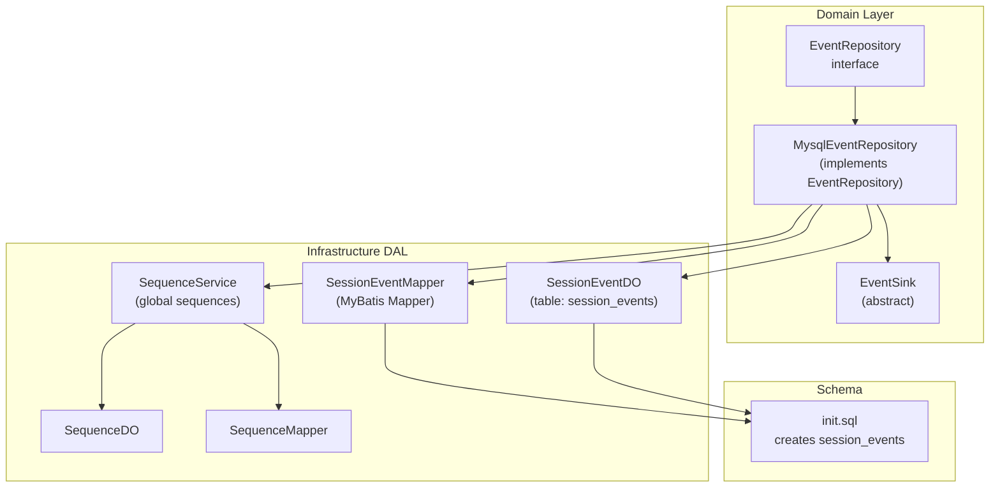
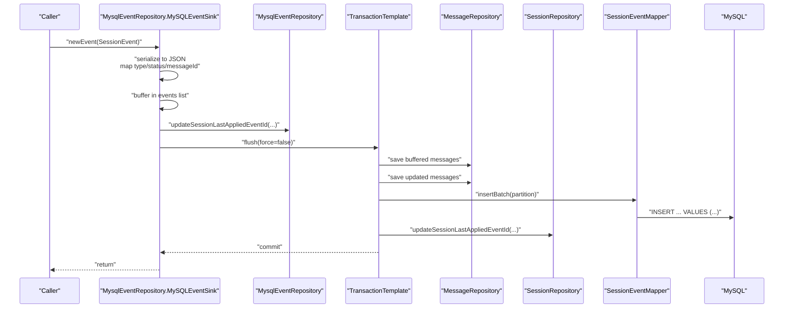
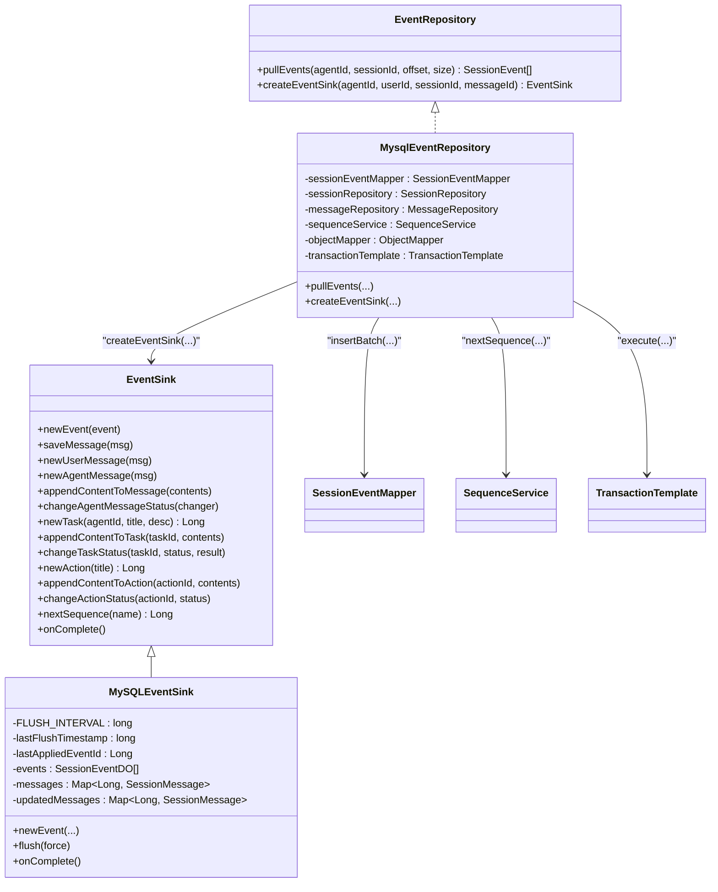
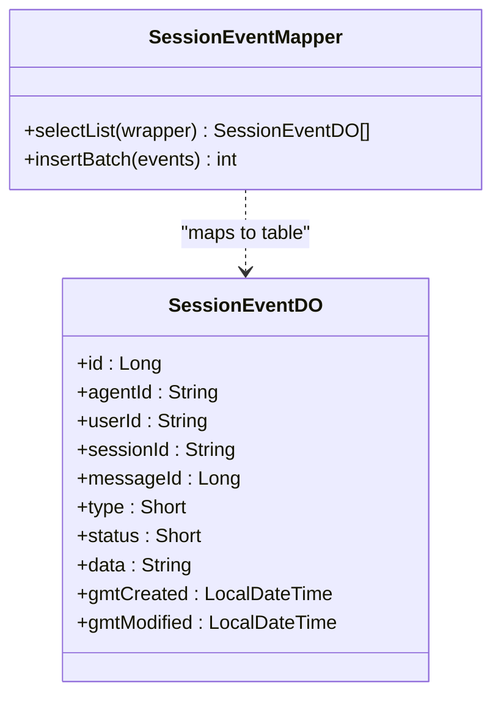
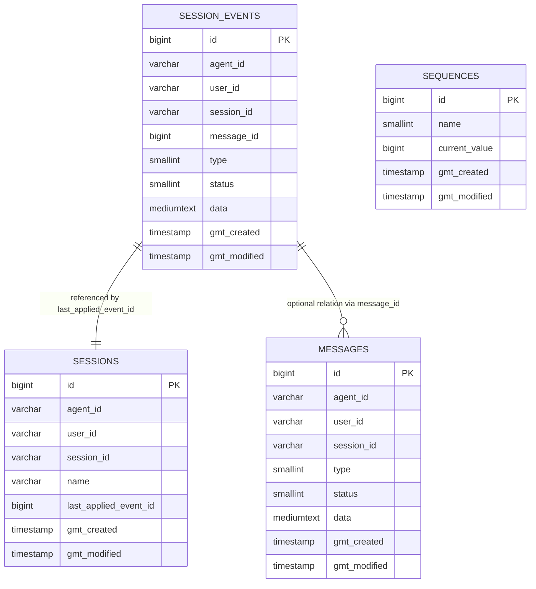
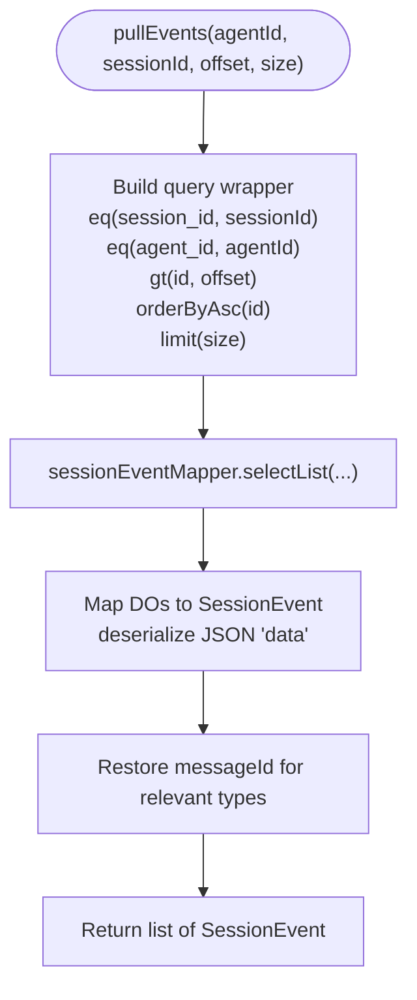
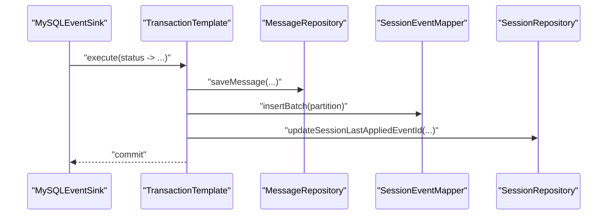
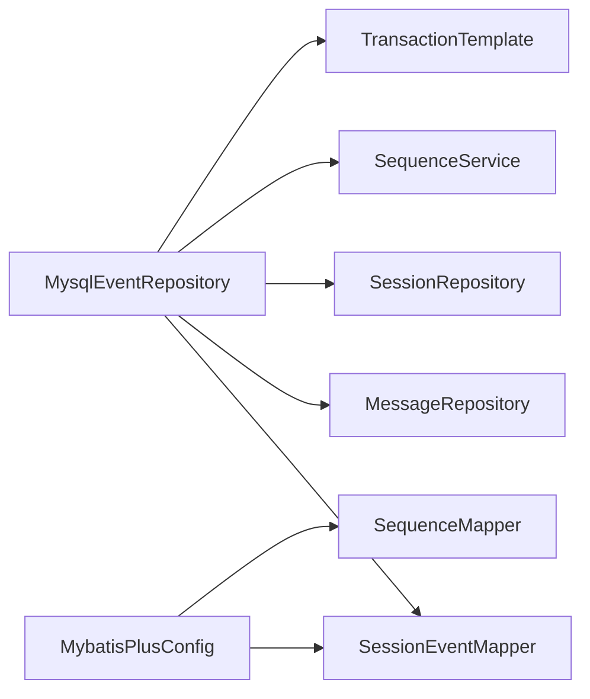

# Event Persistence and Storage

<cite>
**Referenced Files in This Document**
- [MysqlEventRepository.java](file://backend_java/core/src/main/java/com/aliyun/tam/x/tron/core/domain/repository/mysql/MysqlEventRepository.java)
- [SessionEventDO.java](file://backend_java/infra/src/main/java/com/aliyun/tam/x/tron/infra/dal/dataobject/SessionEventDO.java)
- [SessionEventMapper.java](file://backend_java/infra/src/main/java/com/aliyun/tam/x/tron/infra/dal/mapper/SessionEventMapper.java)
- [init.sql](file://backend_java/bootstrap/src/main/resources/schema/init.sql)
- [EventRepository.java](file://backend_java/core/src/main/java/com/aliyun/tam/x/tron/core/domain/repository/EventRepository.java)
- [EventSink.java](file://backend_java/core/src/main/java/com/aliyun/tam/x/tron/core/domain/models/events/EventSink.java)
- [MybatisPlusConfig.java](file://backend_java/bootstrap/src/main/java/com/aliyun/tam/x/tron/config/MybatisPlusConfig.java)
- [SequenceService.java](file://backend_java/infra/src/main/java/com/aliyun/tam/x/tron/infra/sequence/SequenceService.java)
- [SequenceDO.java](file://backend_java/infra/src/main/java/com/aliyun/tam/x/tron/infra/dal/dataobject/SequenceDO.java)
- [SequenceMapper.java](file://backend_java/infra/src/main/java/com/aliyun/tam/x/tron/infra/dal/mapper/SequenceMapper.java)
</cite>

## Table of Contents
1. [Introduction](#introduction)
2. [Project Structure](#project-structure)
3. [Core Components](#core-components)
4. [Architecture Overview](#architecture-overview)
5. [Detailed Component Analysis](#detailed-component-analysis)
6. [Dependency Analysis](#dependency-analysis)
7. [Performance Considerations](#performance-considerations)
8. [Troubleshooting Guide](#troubleshooting-guide)
9. [Conclusion](#conclusion)
10. [Appendices](#appendices)

## Introduction
This document explains the event persistence layer in Tron OneAgent with a focus on MySQL-based storage. It covers the MysqlEventRepository implementation, the SessionEventDO data object mapping, the database schema for event storage, indexing strategies, and transaction management. It also documents the event lifecycle from creation to storage, including batching, flushing, and consistency guarantees. Finally, it outlines SQL optimization techniques, query patterns, bulk loading strategies, schema migration approaches, and operational considerations such as backups and disaster recovery.

## Project Structure
The event persistence layer spans three layers:
- Domain repository layer: MysqlEventRepository implements EventRepository and orchestrates event creation, serialization, and batch insertion.
- Infrastructure DAL layer: SessionEventDO defines the table mapping, SessionEventMapper provides the MyBatis mapper and a custom batch insert, and SequenceService/SequenceDO/SequenceMapper support global sequence allocation.
- Schema initialization: init.sql defines the session_events table and supporting indexes.

**Diagram sources**
- [MysqlEventRepository.java:55-421](file://backend_java/core/src/main/java/com/aliyun/tam/x/tron/core/domain/repository/mysql/MysqlEventRepository.java#L55-L421)
- [EventRepository.java:25-31](file://backend_java/core/src/main/java/com/aliyun/tam/x/tron/core/domain/repository/EventRepository.java#L25-L31)
- [EventSink.java:42-266](file://backend_java/core/src/main/java/com/aliyun/tam/x/tron/core/domain/models/events/EventSink.java#L42-L266)
- [SessionEventDO.java:28-92](file://backend_java/infra/src/main/java/com/aliyun/tam/x/tron/infra/dal/dataobject/SessionEventDO.java#L28-L92)
- [SessionEventMapper.java:28-42](file://backend_java/infra/src/main/java/com/aliyun/tam/x/tron/infra/dal/mapper/SessionEventMapper.java#L28-L42)
- [SequenceService.java:38-178](file://backend_java/infra/src/main/java/com/aliyun/tam/x/tron/infra/sequence/SequenceService.java#L38-L178)
- [SequenceDO.java:28-62](file://backend_java/infra/src/main/java/com/aliyun/tam/x/tron/infra/dal/dataobject/SequenceDO.java#L28-L62)
- [SequenceMapper.java:24-30](file://backend_java/infra/src/main/java/com/aliyun/tam/x/tron/infra/dal/mapper/SequenceMapper.java#L24-L30)
- [init.sql:95-111](file://backend_java/bootstrap/src/main/resources/schema/init.sql#L95-L111)

**Section sources**
- [MysqlEventRepository.java:55-421](file://backend_java/core/src/main/java/com/aliyun/tam/x/tron/core/domain/repository/mysql/MysqlEventRepository.java#L55-L421)
- [SessionEventDO.java:28-92](file://backend_java/infra/src/main/java/com/aliyun/tam/x/tron/infra/dal/dataobject/SessionEventDO.java#L28-L92)
- [SessionEventMapper.java:28-42](file://backend_java/infra/src/main/java/com/aliyun/tam/x/tron/infra/dal/mapper/SessionEventMapper.java#L28-L42)
- [init.sql:95-111](file://backend_java/bootstrap/src/main/resources/schema/init.sql#L95-L111)

## Core Components
- MysqlEventRepository: Implements EventRepository, manages event ingestion via EventSink, serializes events to JSON, batches writes, and coordinates message updates and session last-applied event ID updates within transactions.
- SessionEventDO: MyBatis entity mapped to the session_events table with fields for identifiers, type/status, JSON payload, and timestamps.
- SessionEventMapper: MyBatis mapper extending BaseMapper with a custom batch insert statement for bulk writes.
- SequenceService: Provides globally formatted sequence numbers for event IDs and other entities, backed by a sequences table and FOR UPDATE locking.
- Schema: session_events table with primary key on id and index on (session_id, agent_id) for efficient retrieval.

Key responsibilities:
- Event creation and serialization to JSON.
- Batching and transactional persistence.
- Message synchronization alongside event writes.
- Retrieval via offset-based pagination with ordering by id.

**Section sources**
- [MysqlEventRepository.java:55-421](file://backend_java/core/src/main/java/com/aliyun/tam/x/tron/core/domain/repository/mysql/MysqlEventRepository.java#L55-L421)
- [SessionEventDO.java:28-92](file://backend_java/infra/src/main/java/com/aliyun/tam/x/tron/infra/dal/dataobject/SessionEventDO.java#L28-L92)
- [SessionEventMapper.java:28-42](file://backend_java/infra/src/main/java/com/aliyun/tam/x/tron/infra/dal/mapper/SessionEventMapper.java#L28-L42)
- [SequenceService.java:38-178](file://backend_java/infra/src/main/java/com/aliyun/tam/x/tron/infra/sequence/SequenceService.java#L38-L178)
- [init.sql:95-111](file://backend_java/bootstrap/src/main/resources/schema/init.sql#L95-L111)

## Architecture Overview
The event persistence workflow integrates event generation, buffering, batching, and transactional writes. It also synchronizes message state and updates the session’s last applied event ID atomically with event writes.

**Diagram sources**
- [MysqlEventRepository.java:165-199](file://backend_java/core/src/main/java/com/aliyun/tam/x/tron/core/domain/repository/mysql/MysqlEventRepository.java#L165-L199)
- [SessionEventMapper.java:34-40](file://backend_java/infra/src/main/java/com/aliyun/tam/x/tron/infra/dal/mapper/SessionEventMapper.java#L34-L40)

## Detailed Component Analysis

### MysqlEventRepository and MySQLEventSink
- EventSink lifecycle:
  - newEvent: Serializes the event to JSON, maps type/status/messageId, buffers the SessionEventDO, and triggers message synchronization for certain events.
  - flush: Executes within a transaction, persists buffered messages, batches and inserts events, clears buffers, and updates the session’s last applied event ID.
  - onComplete: Forces a flush to persist remaining state.
- Batching:
  - Events are partitioned into chunks of 64 before batch insertion to balance throughput and memory footprint.
- Message synchronization:
  - New or updated messages are tracked in-memory and persisted before or during flush to keep message state consistent with events.
- Consistency:
  - TransactionTemplate ensures atomicity across message saves, event batch inserts, and session last-applied ID updates.

**Diagram sources**
- [EventRepository.java:25-31](file://backend_java/core/src/main/java/com/aliyun/tam/x/tron/core/domain/repository/EventRepository.java#L25-L31)
- [MysqlEventRepository.java:55-421](file://backend_java/core/src/main/java/com/aliyun/tam/x/tron/core/domain/repository/mysql/MysqlEventRepository.java#L55-L421)
- [EventSink.java:42-266](file://backend_java/core/src/main/java/com/aliyun/tam/x/tron/core/domain/models/events/EventSink.java#L42-L266)

**Section sources**
- [MysqlEventRepository.java:143-421](file://backend_java/core/src/main/java/com/aliyun/tam/x/tron/core/domain/repository/mysql/MysqlEventRepository.java#L143-L421)
- [EventSink.java:42-266](file://backend_java/core/src/main/java/com/aliyun/tam/x/tron/core/domain/models/events/EventSink.java#L42-L266)

### SessionEventDO and MyBatis Mapping
- SessionEventDO maps to session_events with:
  - id (primary key)
  - agent_id, user_id, session_id
  - message_id (nullable)
  - type, status (nullable)
  - data (JSON payload)
  - gmt_created, gmt_modified (auto-managed)
- MyBatis mapper:
  - Extends BaseMapper for standard CRUD.
  - Provides a custom batch insert using foreach to insert multiple rows efficiently.

**Diagram sources**
- [SessionEventDO.java:28-92](file://backend_java/infra/src/main/java/com/aliyun/tam/x/tron/infra/dal/dataobject/SessionEventDO.java#L28-L92)
- [SessionEventMapper.java:28-42](file://backend_java/infra/src/main/java/com/aliyun/tam/x/tron/infra/dal/mapper/SessionEventMapper.java#L28-L42)

**Section sources**
- [SessionEventDO.java:28-92](file://backend_java/infra/src/main/java/com/aliyun/tam/x/tron/infra/dal/dataobject/SessionEventDO.java#L28-L92)
- [SessionEventMapper.java:28-42](file://backend_java/infra/src/main/java/com/aliyun/tam/x/tron/infra/dal/mapper/SessionEventMapper.java#L28-L42)

### Database Schema Design and Indexing
- session_events table:
  - Primary key: id
  - Index: idx_session_id on (session_id, agent_id) to optimize retrieval by session and agent
- Supporting tables (for context):
  - sessions: stores last_applied_event_id per session
  - messages: stores message state with index on (session_id, agent_id)
  - sequences: supports global sequence allocation

**Diagram sources**
- [init.sql:95-111](file://backend_java/bootstrap/src/main/resources/schema/init.sql#L95-L111)
- [init.sql:61-92](file://backend_java/bootstrap/src/main/resources/schema/init.sql#L61-L92)
- [init.sql:78-92](file://backend_java/bootstrap/src/main/resources/schema/init.sql#L78-L92)
- [init.sql:17-28](file://backend_java/bootstrap/src/main/resources/schema/init.sql#L17-L28)

**Section sources**
- [init.sql:95-111](file://backend_java/bootstrap/src/main/resources/schema/init.sql#L95-L111)

### Event Retrieval Workflow
- pullEvents:
  - Filters by sessionId and agentId
  - Uses id > offset with ascending order
  - Limits results to requested size
  - Deserializes JSON payload into strongly typed SessionEvent instances
  - Restores messageId for specific event types and sets timestamps

**Diagram sources**
- [MysqlEventRepository.java:87-136](file://backend_java/core/src/main/java/com/aliyun/tam/x/tron/core/domain/repository/mysql/MysqlEventRepository.java#L87-L136)

**Section sources**
- [MysqlEventRepository.java:87-136](file://backend_java/core/src/main/java/com/aliyun/tam/x/tron/core/domain/repository/mysql/MysqlEventRepository.java#L87-L136)

### Transaction Management and Consistency Guarantees
- TransactionTemplate wraps flush operations to ensure:
  - Atomicity: All message saves, event batch inserts, and session last-applied ID updates occur in a single transaction.
  - Isolation: FOR UPDATE locking in SequenceService prevents race conditions on sequence allocation.
  - Durability: Batch inserts commit as part of the transaction boundary.

**Diagram sources**
- [MysqlEventRepository.java:170-197](file://backend_java/core/src/main/java/com/aliyun/tam/x/tron/core/domain/repository/mysql/MysqlEventRepository.java#L170-L197)
- [SequenceService.java:141-163](file://backend_java/infra/src/main/java/com/aliyun/tam/x/tron/infra/sequence/SequenceService.java#L141-L163)

**Section sources**
- [MysqlEventRepository.java:165-199](file://backend_java/core/src/main/java/com/aliyun/tam/x/tron/core/domain/repository/mysql/MysqlEventRepository.java#L165-L199)
- [SequenceService.java:141-163](file://backend_java/infra/src/main/java/com/aliyun/tam/x/tron/infra/sequence/SequenceService.java#L141-L163)

### MyBatis Configuration and SQL Optimization
- MyBatis Plus configuration:
  - Mapper scanning for infra.dal.mapper
  - Pagination inner interceptor configured for MySQL
- SQL optimization techniques:
  - Custom batch insert using foreach to reduce round-trips.
  - Index on (session_id, agent_id) for efficient retrieval.
  - JSON payload stored as mediumtext to accommodate complex event structures.
  - Minimal projections in selectList for pullEvents to limit payload size.

**Section sources**
- [MybatisPlusConfig.java:27-37](file://backend_java/bootstrap/src/main/java/com/aliyun/tam/x/tron/config/MybatisPlusConfig.java#L27-L37)
- [SessionEventMapper.java:34-40](file://backend_java/infra/src/main/java/com/aliyun/tam/x/tron/infra/dal/mapper/SessionEventMapper.java#L34-L40)
- [init.sql:109-110](file://backend_java/bootstrap/src/main/resources/schema/init.sql#L109-L110)

### Bulk Loading Strategies
- Partitioning:
  - Events are split into chunks of 64 before batch insertion to balance throughput and memory usage.
- Batch insert:
  - Single INSERT statement with multiple VALUE tuples reduces network overhead.
- Flush policy:
  - Periodic flush (every 1 second) with force flush on completion to ensure timely persistence.

**Section sources**
- [MysqlEventRepository.java:182-188](file://backend_java/core/src/main/java/com/aliyun/tam/x/tron/core/domain/repository/mysql/MysqlEventRepository.java#L182-L188)

### Migration Approaches for Schema Changes
- Add indexes carefully:
  - Use ALTER TABLE ... ADD INDEX to avoid table rebuilds where possible.
  - Prefer covering indexes for frequent queries.
- Alter column types:
  - Use online DDL where supported to minimize downtime.
  - Validate backward compatibility of JSON payload deserialization.
- Versioned payloads:
  - Maintain backward-compatible JSON schema to prevent deserialization failures during rolling upgrades.
- Rollback strategy:
  - Keep a reversible migration script and test against staging data.

[No sources needed since this section provides general guidance]

## Dependency Analysis
- MysqlEventRepository depends on:
  - SessionEventMapper for batch inserts
  - MessageRepository and SessionRepository for message/state synchronization and session tracking
  - SequenceService for event IDs
  - TransactionTemplate for ACID guarantees
- MyBatis configuration:
  - Mapper scanning enabled for the DAL package
  - Pagination interceptor configured for MySQL

**Diagram sources**
- [MysqlEventRepository.java:57-73](file://backend_java/core/src/main/java/com/aliyun/tam/x/tron/core/domain/repository/mysql/MysqlEventRepository.java#L57-L73)
- [MybatisPlusConfig.java:27-37](file://backend_java/bootstrap/src/main/java/com/aliyun/tam/x/tron/config/MybatisPlusConfig.java#L27-L37)

**Section sources**
- [MysqlEventRepository.java:57-73](file://backend_java/core/src/main/java/com/aliyun/tam/x/tron/core/domain/repository/mysql/MysqlEventRepository.java#L57-L73)
- [MybatisPlusConfig.java:27-37](file://backend_java/bootstrap/src/main/java/com/aliyun/tam/x/tron/config/MybatisPlusConfig.java#L27-L37)

## Performance Considerations
- Throughput:
  - Batch insert with 64-event partitions balances memory and speed.
  - JSON serialization cost scales with event size; consider event shaping to minimize payload.
- Latency:
  - Flush interval of 1 second amortizes write overhead; adjust based on workload.
  - Index on (session_id, agent_id) optimizes retrieval; ensure appropriate cardinality.
- Memory:
  - In-memory buffering of events and messages; monitor sizes and tune chunking.
- Concurrency:
  - SequenceService uses FOR UPDATE to prevent contention; ensure adequate isolation level.
- Monitoring:
  - Track transaction durations, batch sizes, and error rates for flush operations.

[No sources needed since this section provides general guidance]

## Troubleshooting Guide
- Serialization errors:
  - If event JSON serialization fails, a runtime exception is thrown during newEvent. Verify event model compatibility and Jackson configuration.
- Duplicate key errors:
  - If id conflicts occur, ensure SequenceService is used to generate unique ids and that the sequences table is healthy.
- Batch insert exceptions:
  - Exceptions during insertBatch are logged; check for constraint violations or connection issues.
- Retrieval anomalies:
  - If pullEvents returns fewer items than expected, verify offset semantics and index coverage.

**Section sources**
- [MysqlEventRepository.java:262-264](file://backend_java/core/src/main/java/com/aliyun/tam/x/tron/core/domain/repository/mysql/MysqlEventRepository.java#L262-L264)
- [MysqlEventRepository.java:184-187](file://backend_java/core/src/main/java/com/aliyun/tam/x/tron/core/domain/repository/mysql/MysqlEventRepository.java#L184-L187)
- [SequenceService.java:141-163](file://backend_java/infra/src/main/java/com/aliyun/tam/x/tron/infra/sequence/SequenceService.java#L141-L163)

## Conclusion
The event persistence layer in Tron OneAgent leverages a robust combination of MyBatis batch inserts, transactional boundaries, and in-memory buffering to achieve high-throughput, consistent event storage. The session_events schema, with targeted indexing, enables efficient retrieval, while the SequenceService ensures globally unique identifiers. Operational practices around batching, monitoring, and migrations help maintain reliability and scalability.

[No sources needed since this section summarizes without analyzing specific files]

## Appendices

### Practical Examples of Event Storage Operations
- Creating a new user message event:
  - Use EventSink.newUserMessage to enqueue a NewUserInputEvent; it is persisted atomically with related message state during flush.
- Appending content to an agent message:
  - Use EventSink.appendContentToMessage to enqueue an AgentMessageAppendContentEvent; the underlying message is updated concurrently.
- Changing task/action status:
  - Use EventSink.changeTaskStatus or EventSink.changeActionStatus to emit status change events; related message state is updated accordingly.

**Section sources**
- [EventSink.java:70-130](file://backend_java/core/src/main/java/com/aliyun/tam/x/tron/core/domain/models/events/EventSink.java#L70-L130)
- [EventSink.java:166-195](file://backend_java/core/src/main/java/com/aliyun/tam/x/tron/core/domain/models/events/EventSink.java#L166-L195)
- [EventSink.java:228-256](file://backend_java/core/src/main/java/com/aliyun/tam/x/tron/core/domain/models/events/EventSink.java#L228-L256)

### Backup and Disaster Recovery Procedures
- Backups:
  - Perform regular logical backups of the tron_agent_java database, focusing on session_events, sessions, messages, and sequences tables.
  - Validate backup integrity and restore procedures periodically.
- Recovery:
  - Restore to a point-in-time snapshot; re-bootstrap sequence values if necessary.
  - Rebuild offsets by replaying session_events from last_applied_event_id forward to reconcile message state.

[No sources needed since this section provides general guidance]