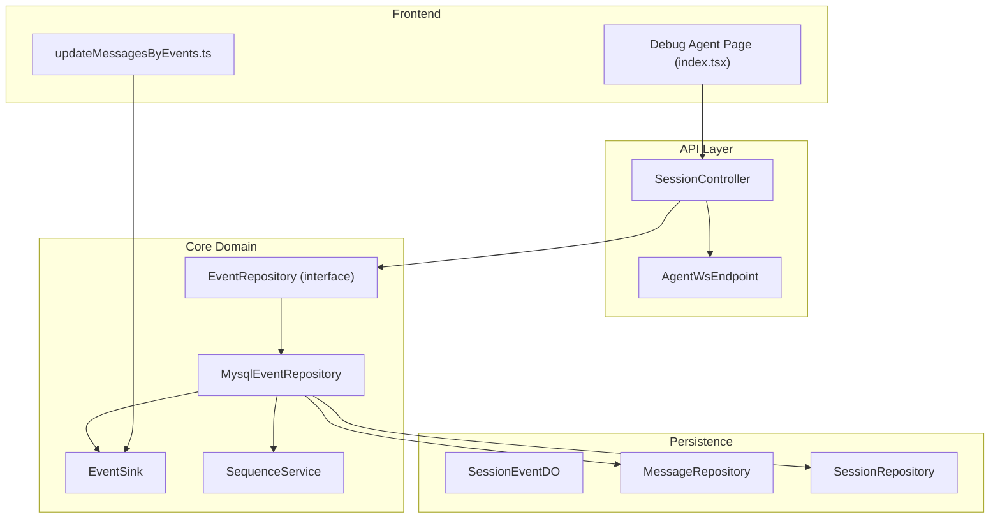
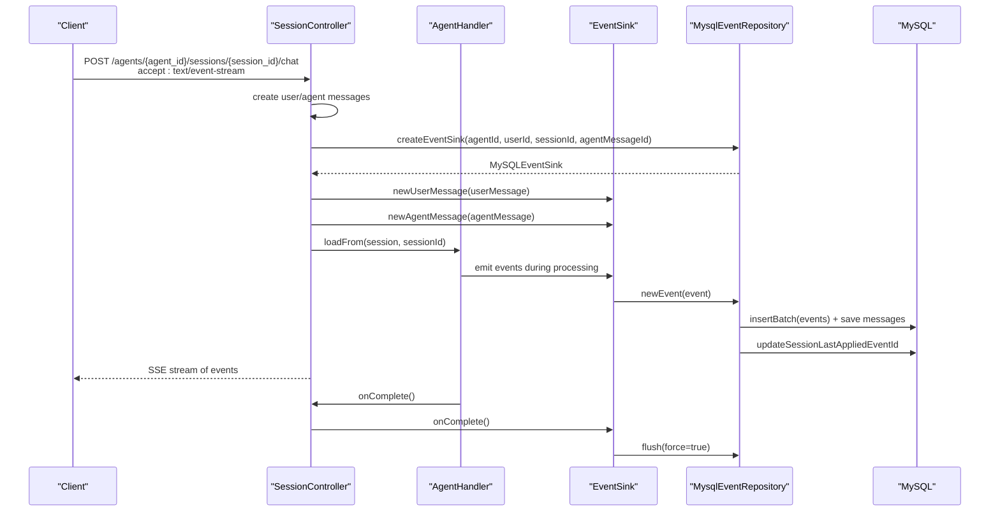
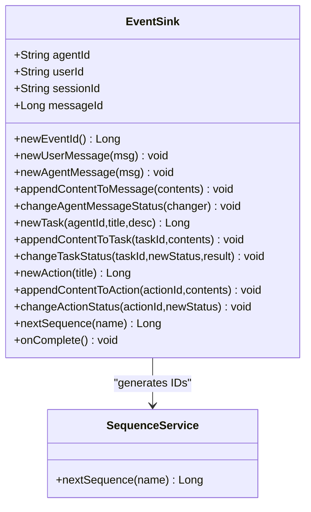
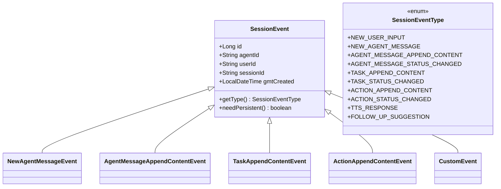
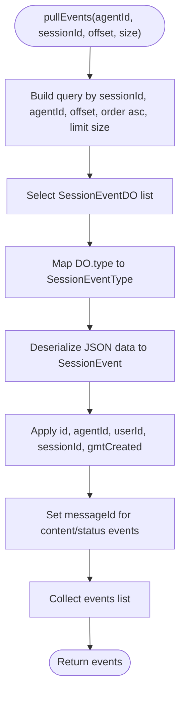
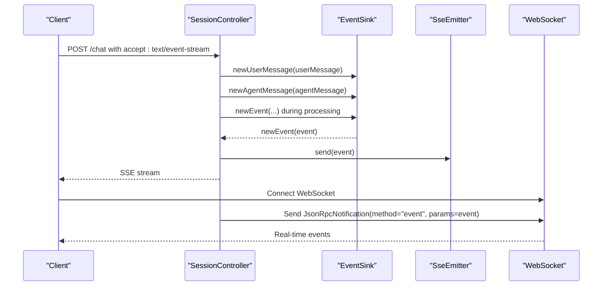
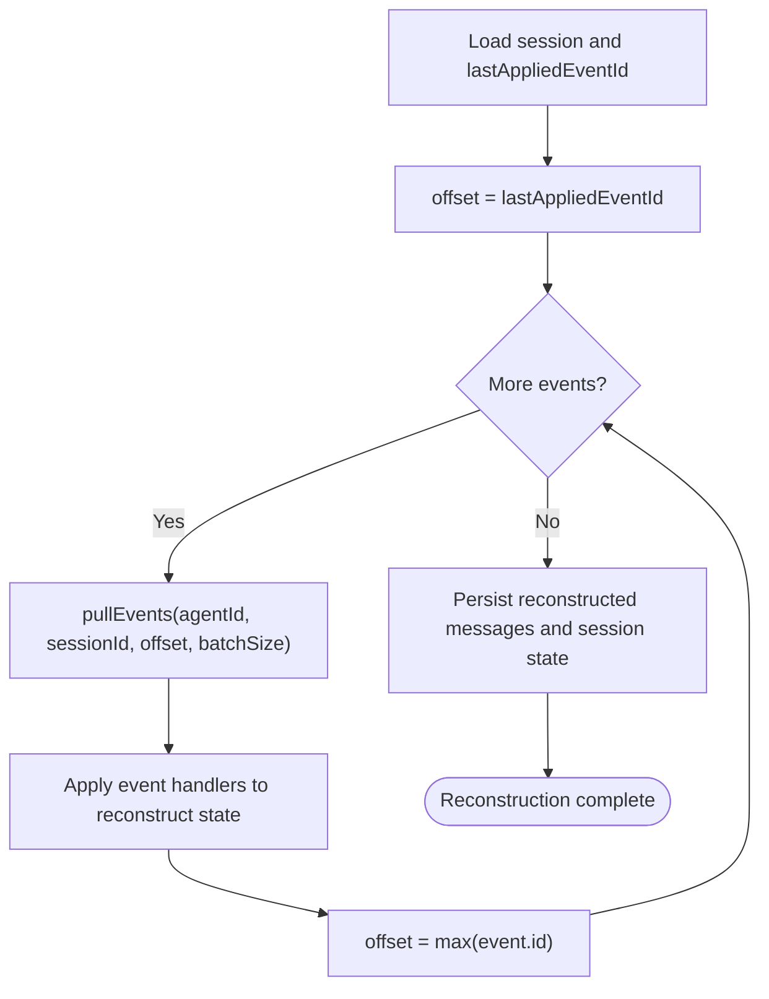
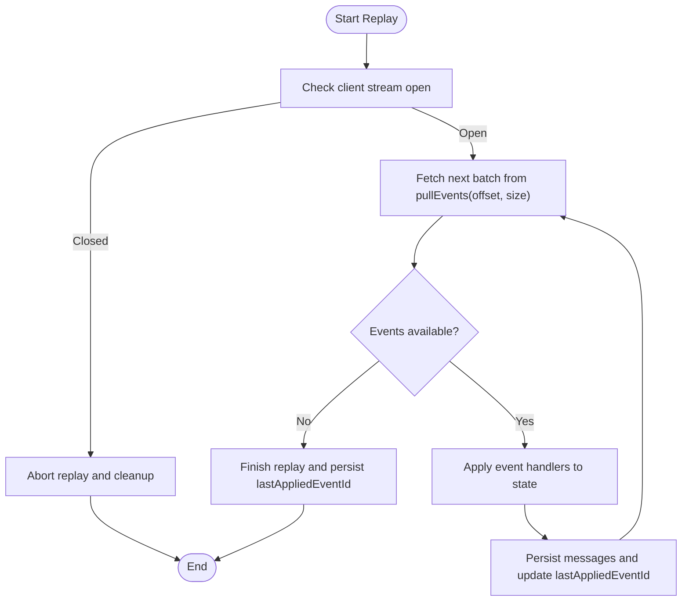
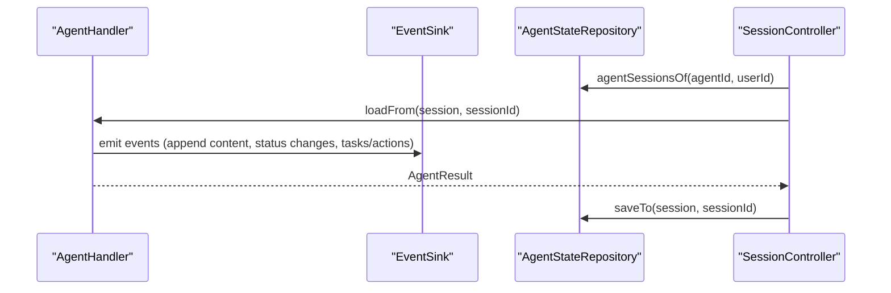
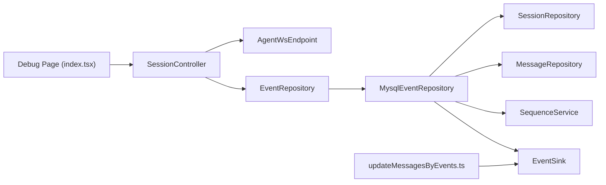

# Event Replay and State Reconstruction

<cite>
**Referenced Files in This Document**
- [EventSink.java](file://backend_java/core/src/main/java/com/aliyun/tam/x/tron/core/domain/models/events/EventSink.java)
- [SessionEvent.java](file://backend_java/core/src/main/java/com/aliyun/tam/x/tron/core/domain/models/events/SessionEvent.java)
- [SessionEventType.java](file://backend_java/core/src/main/java/com/aliyun/tam/x/tron/core/domain/models/events/SessionEventType.java)
- [NewAgentMessageEvent.java](file://backend_java/core/src/main/java/com/aliyun/tam/x/tron/core/domain/models/events/NewAgentMessageEvent.java)
- [AgentMessageAppendContentEvent.java](file://backend_java/core/src/main/java/com/aliyun/tam/x/tron/core/domain/models/events/AgentMessageAppendContentEvent.java)
- [TaskAppendContentEvent.java](file://backend_java/core/src/main/java/com/aliyun/tam/x/tron/core/domain/models/events/TaskAppendContentEvent.java)
- [ActionAppendContentEvent.java](file://backend_java/core/src/main/java/com/aliyun/tam/x/tron/core/domain/models/events/ActionAppendContentEvent.java)
- [CustomEvent.java](file://backend_java/core/src/main/java/com/aliyun/tam/x/tron/core/domain/models/events/CustomEvent.java)
- [EventRepository.java](file://backend_java/core/src/main/java/com/aliyun/tam/x/tron/core/domain/repository/EventRepository.java)
- [MysqlEventRepository.java](file://backend_java/core/src/main/java/com/aliyun/tam/x/tron/core/domain/repository/mysql/MysqlEventRepository.java)
- [SequenceService.java](file://backend_java/infra/src/main/java/com/aliyun/tam/x/tron/infra/sequence/SequenceService.java)
- [SessionController.java](file://backend_java/api/src/main/java/com/aliyun/tam/x/tron/api/SessionController.java)
- [AgentWsEndpoint.java](file://backend_java/api/src/main/java/com/aliyun/tam/x/tron/ws/AgentWsEndpoint.java)
- [ReActAgentHandler.java](file://backend_java/core/src/main/java/com/aliyun/tam/x/tron/core/agents/ReActAgentHandler.java)
- [AgentStateRepository.java](file://backend_java/core/src/main/java/com/aliyun/tam/x/tron/core/domain/repository/AgentStateRepository.java)
- [develop_guide.md](file://docs/en/develop_guide.md)
- [updateMessagesByEvents.ts](file://frontend/packages/chatbox/utils/updateMessagesByEvents.ts)
- [index.tsx](file://frontend/packages/control/src/pages/Debug/Agent/index.tsx)
</cite>

## Table of Contents
1. [Introduction](#introduction)
2. [Project Structure](#project-structure)
3. [Core Components](#core-components)
4. [Architecture Overview](#architecture-overview)
5. [Detailed Component Analysis](#detailed-component-analysis)
6. [Dependency Analysis](#dependency-analysis)
7. [Performance Considerations](#performance-considerations)
8. [Troubleshooting Guide](#troubleshooting-guide)
9. [Conclusion](#conclusion)
10. [Appendices](#appendices)

## Introduction
This document explains the event replay mechanisms and state reconstruction capabilities in Tron OneAgent. It focuses on the EventSink pattern that streams real-time updates to subscribers, the persistence and retrieval of session events, and the reconstruction of conversation state, agent configurations, and system context from event sequences. It also covers replay workflows, error handling, partial replay scenarios, and practical guidance for integrating custom event sinks, handling interruptions, and optimizing replay performance for large histories. Use cases for debugging, analytics, and compliance reporting are addressed through replay-driven insights.

## Project Structure
The event replay and state reconstruction system spans several layers:
- API layer: HTTP/SSE/WebSocket endpoints orchestrate sessions, messages, and event streaming.
- Core domain: Event types, base event model, and the EventSink abstraction define the event model and streaming contract.
- Persistence: MySQL-backed event repository stores and retrieves events, while message and session repositories maintain conversation state.
- Infrastructure: Sequence service generates globally ordered identifiers for deterministic replay.
- Frontend: Utilities reconstruct UI state from events and integrate with debug pages.

**Diagram sources**
- [SessionController.java:308-409](file://backend_java/api/src/main/java/com/aliyun/tam/x/tron/api/SessionController.java#L308-L409)
- [MysqlEventRepository.java:138-141](file://backend_java/core/src/main/java/com/aliyun/tam/x/tron/core/domain/repository/mysql/MysqlEventRepository.java#L138-L141)
- [EventSink.java:42-265](file://backend_java/core/src/main/java/com/aliyun/tam/x/tron/core/domain/models/events/EventSink.java#L42-L265)
- [SequenceService.java:40-177](file://backend_java/infra/src/main/java/com/aliyun/tam/x/tron/infra/sequence/SequenceService.java#L40-L177)
- [updateMessagesByEvents.ts:107-153](file://frontend/packages/chatbox/utils/updateMessagesByEvents.ts#L107-L153)
- [index.tsx:287-403](file://frontend/packages/control/src/pages/Debug/Agent/index.tsx#L287-L403)

**Section sources**
- [SessionController.java:308-409](file://backend_java/api/src/main/java/com/aliyun/tam/x/tron/api/SessionController.java#L308-L409)
- [MysqlEventRepository.java:138-141](file://backend_java/core/src/main/java/com/aliyun/tam/x/tron/core/domain/repository/mysql/MysqlEventRepository.java#L138-L141)
- [EventSink.java:42-265](file://backend_java/core/src/main/java/com/aliyun/tam/x/tron/core/domain/models/events/EventSink.java#L42-L265)
- [SequenceService.java:40-177](file://backend_java/infra/src/main/java/com/aliyun/tam/x/tron/infra/sequence/SequenceService.java#L40-L177)
- [updateMessagesByEvents.ts:107-153](file://frontend/packages/chatbox/utils/updateMessagesByEvents.ts#L107-L153)
- [index.tsx:287-403](file://frontend/packages/control/src/pages/Debug/Agent/index.tsx#L287-L403)

## Core Components
- Event types and base model: Define the event taxonomy and metadata for persistence and reconstruction.
- EventSink: Abstract streaming/persistence sink that emits events and updates in-memory state for real-time subscribers.
- EventRepository and MysqlEventRepository: Provide event retrieval and batch persistence with transactional guarantees.
- SequenceService: Generates monotonic identifiers to support deterministic replay ordering.
- API orchestration: SessionController creates sessions, messages, and event sinks; wraps sinks for SSE/WS streaming; integrates TTS callbacks.
- Frontend utilities: Reconstruct UI state from events and integrate with debug pages.

**Section sources**
- [SessionEvent.java:34-50](file://backend_java/core/src/main/java/com/aliyun/tam/x/tron/core/domain/models/events/SessionEvent.java#L34-L50)
- [SessionEventType.java:26-67](file://backend_java/core/src/main/java/com/aliyun/tam/x/tron/core/domain/models/events/SessionEventType.java#L26-L67)
- [EventSink.java:42-265](file://backend_java/core/src/main/java/com/aliyun/tam/x/tron/core/domain/models/events/EventSink.java#L42-L265)
- [EventRepository.java:25-30](file://backend_java/core/src/main/java/com/aliyun/tam/x/tron/core/domain/repository/EventRepository.java#L25-L30)
- [MysqlEventRepository.java:87-136](file://backend_java/core/src/main/java/com/aliyun/tam/x/tron/core/domain/repository/mysql/MysqlEventRepository.java#L87-L136)
- [SequenceService.java:40-177](file://backend_java/infra/src/main/java/com/aliyun/tam/x/tron/infra/sequence/SequenceService.java#L40-L177)
- [SessionController.java:308-409](file://backend_java/api/src/main/java/com/aliyun/tam/x/tron/api/SessionController.java#L308-L409)
- [updateMessagesByEvents.ts:107-153](file://frontend/packages/chatbox/utils/updateMessagesByEvents.ts#L107-L153)

## Architecture Overview
The system streams events from agent handlers to subscribers via EventSink, persists them to the database, and supports replay for state reconstruction.

**Diagram sources**
- [SessionController.java:308-409](file://backend_java/api/src/main/java/com/aliyun/tam/x/tron/api/SessionController.java#L308-L409)
- [MysqlEventRepository.java:143-204](file://backend_java/core/src/main/java/com/aliyun/tam/x/tron/core/domain/repository/mysql/MysqlEventRepository.java#L143-L204)
- [EventSink.java:61-130](file://backend_java/core/src/main/java/com/aliyun/tam/x/tron/core/domain/models/events/EventSink.java#L61-L130)

## Detailed Component Analysis

### EventSink Pattern and Real-Time Streaming
EventSink defines a unified contract for emitting events and updating messages. It encapsulates:
- Event emission helpers for user input, agent messages, content append, status changes, tasks, actions, and custom events.
- Sequence generation via SequenceService.
- In-memory state caching for messages and incremental flushing to the database.
- Completion hook for batch writes.

**Diagram sources**
- [EventSink.java:42-265](file://backend_java/core/src/main/java/com/aliyun/tam/x/tron/core/domain/models/events/EventSink.java#L42-L265)
- [SequenceService.java:130-132](file://backend_java/infra/src/main/java/com/aliyun/tam/x/tron/infra/sequence/SequenceService.java#L130-L132)

**Section sources**
- [EventSink.java:42-265](file://backend_java/core/src/main/java/com/aliyun/tam/x/tron/core/domain/models/events/EventSink.java#L42-L265)
- [SequenceService.java:130-132](file://backend_java/infra/src/main/java/com/aliyun/tam/x/tron/infra/sequence/SequenceService.java#L130-L132)

### Event Types and Persistence Model
Core event types include user input, agent message lifecycle, content append, status changes, and task/action updates. The persistence layer maps event types to concrete classes and serializes/deserializes event payloads.

**Diagram sources**
- [SessionEvent.java:34-50](file://backend_java/core/src/main/java/com/aliyun/tam/x/tron/core/domain/models/events/SessionEvent.java#L34-L50)
- [SessionEventType.java:26-67](file://backend_java/core/src/main/java/com/aliyun/tam/x/tron/core/domain/models/events/SessionEventType.java#L26-L67)
- [NewAgentMessageEvent.java:35-42](file://backend_java/core/src/main/java/com/aliyun/tam/x/tron/core/domain/models/events/NewAgentMessageEvent.java#L35-L42)
- [AgentMessageAppendContentEvent.java:38-48](file://backend_java/core/src/main/java/com/aliyun/tam/x/tron/core/domain/models/events/AgentMessageAppendContentEvent.java#L38-L48)
- [TaskAppendContentEvent.java:38-48](file://backend_java/core/src/main/java/com/aliyun/tam/x/tron/core/domain/models/events/TaskAppendContentEvent.java#L38-L48)
- [ActionAppendContentEvent.java:36-46](file://backend_java/core/src/main/java/com/aliyun/tam/x/tron/core/domain/models/events/ActionAppendContentEvent.java#L36-L46)
- [CustomEvent.java:28-43](file://backend_java/core/src/main/java/com/aliyun/tam/x/tron/core/domain/models/events/CustomEvent.java#L28-L43)

**Section sources**
- [SessionEvent.java:34-50](file://backend_java/core/src/main/java/com/aliyun/tam/x/tron/core/domain/models/events/SessionEvent.java#L34-L50)
- [SessionEventType.java:26-67](file://backend_java/core/src/main/java/com/aliyun/tam/x/tron/core/domain/models/events/SessionEventType.java#L26-L67)
- [NewAgentMessageEvent.java:35-42](file://backend_java/core/src/main/java/com/aliyun/tam/x/tron/core/domain/models/events/NewAgentMessageEvent.java#L35-L42)
- [AgentMessageAppendContentEvent.java:38-48](file://backend_java/core/src/main/java/com/aliyun/tam/x/tron/core/domain/models/events/AgentMessageAppendContentEvent.java#L38-L48)
- [TaskAppendContentEvent.java:38-48](file://backend_java/core/src/main/java/com/aliyun/tam/x/tron/core/domain/models/events/TaskAppendContentEvent.java#L38-L48)
- [ActionAppendContentEvent.java:36-46](file://backend_java/core/src/main/java/com/aliyun/tam/x/tron/core/domain/models/events/ActionAppendContentEvent.java#L36-L46)
- [CustomEvent.java:28-43](file://backend_java/core/src/main/java/com/aliyun/tam/x/tron/core/domain/models/events/CustomEvent.java#L28-L43)

### Event Persistence and Streaming Integration
MysqlEventRepository implements the EventRepository interface, providing:
- pullEvents: fetches ordered events for a session starting after a given offset.
- createEventSink: returns a MySQLEventSink that buffers events in memory and flushes them to the database in batches.
- In-memory message cache and incremental updates to ensure real-time subscribers receive consistent state.

**Diagram sources**
- [MysqlEventRepository.java:87-136](file://backend_java/core/src/main/java/com/aliyun/tam/x/tron/core/domain/repository/mysql/MysqlEventRepository.java#L87-L136)

**Section sources**
- [MysqlEventRepository.java:87-136](file://backend_java/core/src/main/java/com/aliyun/tam/x/tron/core/domain/repository/mysql/MysqlEventRepository.java#L87-L136)
- [EventRepository.java:25-30](file://backend_java/core/src/main/java/com/aliyun/tam/x/tron/core/domain/repository/EventRepository.java#L25-L30)

### Real-Time Streaming to Subscribers
SessionController wraps the raw EventSink to stream events to clients:
- SSE mode: Sends events via SseEmitter; handles completion and errors.
- WebSocket mode: Wraps events into JSON-RPC notifications and sends over WebSocket; closes session on send failures.
- Optional TTS wrapper: Interleaves TTS responses as CustomEvent with needPersistent=false.

**Diagram sources**
- [SessionController.java:411-535](file://backend_java/api/src/main/java/com/aliyun/tam/x/tron/api/SessionController.java#L411-L535)
- [AgentWsEndpoint.java:342-378](file://backend_java/api/src/main/java/com/aliyun/tam/x/tron/ws/AgentWsEndpoint.java#L342-L378)

**Section sources**
- [SessionController.java:411-535](file://backend_java/api/src/main/java/com/aliyun/tam/x/tron/api/SessionController.java#L411-L535)
- [AgentWsEndpoint.java:342-378](file://backend_java/api/src/main/java/com/aliyun/tam/x/tron/ws/AgentWsEndpoint.java#L342-L378)

### State Reconstruction from Events
State reconstruction involves:
- Loading session metadata and last applied event ID.
- Pulling events from offset=lastAppliedEventId with pagination.
- Applying event handlers to rebuild messages, tasks, actions, and statuses.
- Saving reconstructed state back to session and message repositories.

**Diagram sources**
- [MysqlEventRepository.java:87-136](file://backend_java/core/src/main/java/com/aliyun/tam/x/tron/core/domain/repository/mysql/MysqlEventRepository.java#L87-L136)
- [SessionController.java:280-306](file://backend_java/api/src/main/java/com/aliyun/tam/x/tron/api/SessionController.java#L280-L306)

**Section sources**
- [MysqlEventRepository.java:87-136](file://backend_java/core/src/main/java/com/aliyun/tam/x/tron/core/domain/repository/mysql/MysqlEventRepository.java#L87-L136)
- [SessionController.java:280-306](file://backend_java/api/src/main/java/com/aliyun/tam/x/tron/api/SessionController.java#L280-L306)

### Replay Workflow and Partial Scenarios
- Full replay: Start from offset=0 or last known stable checkpoint; apply all events in ascending order.
- Incremental replay: Resume from lastAppliedEventId to catch up on missed events.
- Partial replay: Limit batch size and stop on client disconnect or error; resume later.
- Error handling: On deserialization or persistence exceptions, skip problematic events and log; surface errors to clients via SSE/WS; cancel processing when streams close.

**Diagram sources**
- [MysqlEventRepository.java:87-136](file://backend_java/core/src/main/java/com/aliyun/tam/x/tron/core/domain/repository/mysql/MysqlEventRepository.java#L87-L136)
- [SessionController.java:411-535](file://backend_java/api/src/main/java/com/aliyun/tam/x/tron/api/SessionController.java#L411-L535)

**Section sources**
- [MysqlEventRepository.java:87-136](file://backend_java/core/src/main/java/com/aliyun/tam/x/tron/core/domain/repository/mysql/MysqlEventRepository.java#L87-L136)
- [SessionController.java:411-535](file://backend_java/api/src/main/java/com/aliyun/tam/x/tron/api/SessionController.java#L411-L535)

### Integration Between Event Sinks and Agent Handlers
Agent handlers load session state, process inputs, and emit events through EventSink. The controller coordinates:
- Creating user and agent messages.
- Wrapping EventSink for SSE/WS streaming.
- Integrating TTS callbacks as CustomEvent for non-persistent streaming data.
- Saving agent state to session repositories after completion.

**Diagram sources**
- [SessionController.java:396-408](file://backend_java/api/src/main/java/com/aliyun/tam/x/tron/api/SessionController.java#L396-L408)
- [ReActAgentHandler.java:54-61](file://backend_java/core/src/main/java/com/aliyun/tam/x/tron/core/agents/ReActAgentHandler.java#L54-L61)
- [AgentStateRepository.java:26-37](file://backend_java/core/src/main/java/com/aliyun/tam/x/tron/core/domain/repository/AgentStateRepository.java#L26-L37)

**Section sources**
- [SessionController.java:396-408](file://backend_java/api/src/main/java/com/aliyun/tam/x/tron/api/SessionController.java#L396-L408)
- [ReActAgentHandler.java:54-61](file://backend_java/core/src/main/java/com/aliyun/tam/x/tron/core/agents/ReActAgentHandler.java#L54-L61)
- [AgentStateRepository.java:26-37](file://backend_java/core/src/main/java/com/aliyun/tam/x/tron/core/domain/repository/AgentStateRepository.java#L26-L37)

### Practical Examples

#### Implementing a Custom Event Sink
- Extend EventSink and override newEvent, saveMessage, nextSequence, and onComplete.
- Use SequenceService.SequenceName for generating IDs.
- Buffer events and flush periodically or on demand.
- Optionally wrap with SSE/WS streaming similar to SessionController’s wrapping logic.

**Section sources**
- [EventSink.java:42-265](file://backend_java/core/src/main/java/com/aliyun/tam/x/tron/core/domain/models/events/EventSink.java#L42-L265)
- [SequenceService.java:130-132](file://backend_java/infra/src/main/java/com/aliyun/tam/x/tron/infra/sequence/SequenceService.java#L130-L132)
- [SessionController.java:411-535](file://backend_java/api/src/main/java/com/aliyun/tam/x/tron/api/SessionController.java#L411-L535)

#### Handling Replay Interruptions
- Track lastAppliedEventId and resume from that offset.
- On stream closure or client disconnect, mark replay as interrupted and persist progress.
- Retry with exponential backoff; skip irrecoverable events; notify downstream systems.

**Section sources**
- [MysqlEventRepository.java:414-418](file://backend_java/core/src/main/java/com/aliyun/tam/x/tron/core/domain/repository/mysql/MysqlEventRepository.java#L414-L418)
- [SessionController.java:426-436](file://backend_java/api/src/main/java/com/aliyun/tam/x/tron/api/SessionController.java#L426-L436)

#### Optimizing Replay Performance for Large Histories
- Tune batch size for insertBatch to balance throughput and latency.
- Use efficient event handlers that avoid unnecessary allocations.
- Leverage in-memory message cache to minimize round trips.
- Consider indexing on SessionEventDO (sessionId, agentId, id) for fast range queries.

**Section sources**
- [MysqlEventRepository.java:182-188](file://backend_java/core/src/main/java/com/aliyun/tam/x/tron/core/domain/repository/mysql/MysqlEventRepository.java#L182-L188)

### Use Cases for Debugging, Analytics, and Compliance
- Debugging: Replay a session from a known checkpoint to reproduce issues; inspect intermediate states and event sequences.
- Analytics: Aggregate metrics from event streams (message counts, task/action durations, status transitions).
- Compliance: Maintain immutable event logs; support audit trails by replaying sequences and exporting event timelines.

**Section sources**
- [develop_guide.md:300-355](file://docs/en/develop_guide.md#L300-L355)
- [SessionController.java:280-306](file://backend_java/api/src/main/java/com/aliyun/tam/x/tron/api/SessionController.java#L280-L306)

## Dependency Analysis
The following diagram highlights key dependencies among components involved in event replay and state reconstruction.

**Diagram sources**
- [SessionController.java:308-409](file://backend_java/api/src/main/java/com/aliyun/tam/x/tron/api/SessionController.java#L308-L409)
- [MysqlEventRepository.java:138-141](file://backend_java/core/src/main/java/com/aliyun/tam/x/tron/core/domain/repository/mysql/MysqlEventRepository.java#L138-L141)
- [EventSink.java:42-265](file://backend_java/core/src/main/java/com/aliyun/tam/x/tron/core/domain/models/events/EventSink.java#L42-L265)
- [SequenceService.java:130-132](file://backend_java/infra/src/main/java/com/aliyun/tam/x/tron/infra/sequence/SequenceService.java#L130-L132)
- [AgentWsEndpoint.java:342-378](file://backend_java/api/src/main/java/com/aliyun/tam/x/tron/ws/AgentWsEndpoint.java#L342-L378)
- [updateMessagesByEvents.ts:107-153](file://frontend/packages/chatbox/utils/updateMessagesByEvents.ts#L107-L153)
- [index.tsx:287-403](file://frontend/packages/control/src/pages/Debug/Agent/index.tsx#L287-L403)

**Section sources**
- [SessionController.java:308-409](file://backend_java/api/src/main/java/com/aliyun/tam/x/tron/api/SessionController.java#L308-L409)
- [MysqlEventRepository.java:138-141](file://backend_java/core/src/main/java/com/aliyun/tam/x/tron/core/domain/repository/mysql/MysqlEventRepository.java#L138-L141)
- [EventSink.java:42-265](file://backend_java/core/src/main/java/com/aliyun/tam/x/tron/core/domain/models/events/EventSink.java#L42-L265)
- [SequenceService.java:130-132](file://backend_java/infra/src/main/java/com/aliyun/tam/x/tron/infra/sequence/SequenceService.java#L130-L132)
- [AgentWsEndpoint.java:342-378](file://backend_java/api/src/main/java/com/aliyun/tam/x/tron/ws/AgentWsEndpoint.java#L342-L378)
- [updateMessagesByEvents.ts:107-153](file://frontend/packages/chatbox/utils/updateMessagesByEvents.ts#L107-L153)
- [index.tsx:287-403](file://frontend/packages/control/src/pages/Debug/Agent/index.tsx#L287-L403)

## Performance Considerations
- Batch writes: Use partitioned batch inserts to reduce transaction overhead.
- Flush strategy: Balance flush intervals with memory pressure; force flush on significant state changes.
- Serialization: Keep event payloads compact; avoid heavy nested structures.
- Indexing: Ensure database indexes support efficient range scans by (sessionId, agentId, id).
- Concurrency: Use thread-safe collections and synchronized flush to prevent race conditions.

[No sources needed since this section provides general guidance]

## Troubleshooting Guide
Common issues and remedies:
- SSE/WS stream closure: Detect via IllegalState or completion errors; cancel agent processing and persist progress.
- Persistence failures: Log and skip malformed events; retry batches; monitor insert errors.
- Out-of-order events: Ensure monotonic offsets and reapply events in order; validate event IDs against lastAppliedEventId.
- Memory pressure: Reduce flush interval or batch size; clear caches periodically.

**Section sources**
- [SessionController.java:426-436](file://backend_java/api/src/main/java/com/aliyun/tam/x/tron/api/SessionController.java#L426-L436)
- [MysqlEventRepository.java:182-188](file://backend_java/core/src/main/java/com/aliyun/tam/x/tron/core/domain/repository/mysql/MysqlEventRepository.java#L182-L188)

## Conclusion
Tron OneAgent’s event replay and state reconstruction system leverages a robust EventSink pattern, typed event models, and MySQL-backed persistence to enable real-time streaming and deterministic replay. By combining ordered event sequences, in-memory state caching, and transactional batch writes, the system supports debugging, analytics, and compliance use cases. Extending the EventSink abstraction and optimizing replay workflows allows scalable handling of large histories with resilient error handling.

[No sources needed since this section summarizes without analyzing specific files]

## Appendices

### Appendix A: Frontend State Reconstruction from Events
Frontend utilities update message lists by applying event handlers for supported event types, enabling real-time UI updates and replay-driven state restoration.

**Section sources**
- [updateMessagesByEvents.ts:107-153](file://frontend/packages/chatbox/utils/updateMessagesByEvents.ts#L107-L153)
- [index.tsx:321-334](file://frontend/packages/control/src/pages/Debug/Agent/index.tsx#L321-L334)