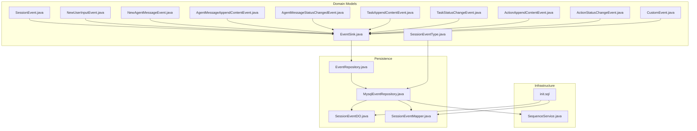
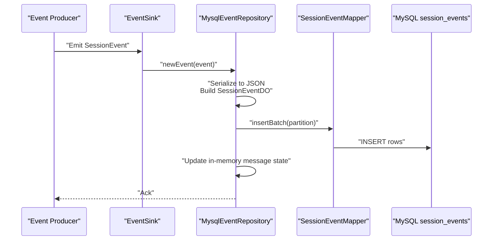
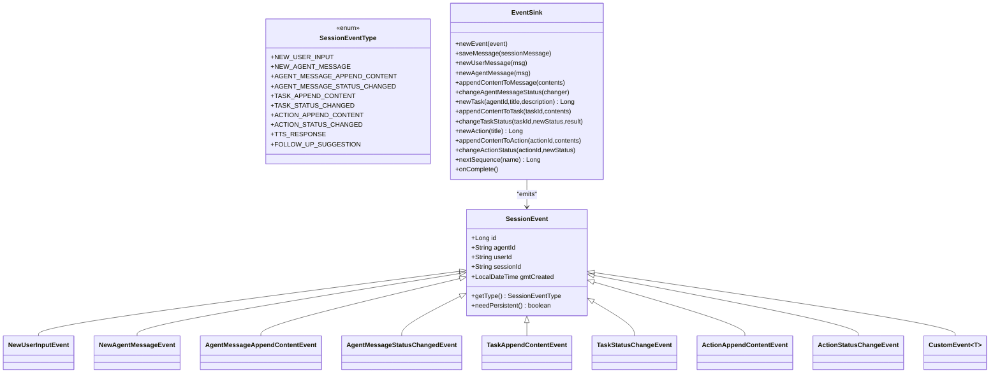
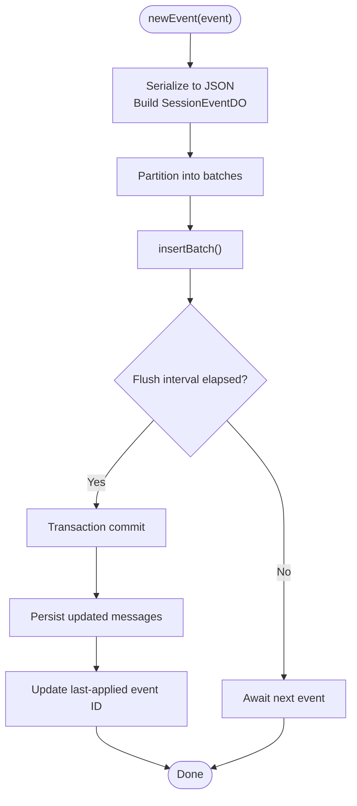
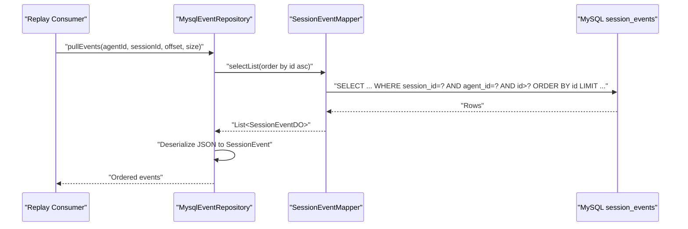
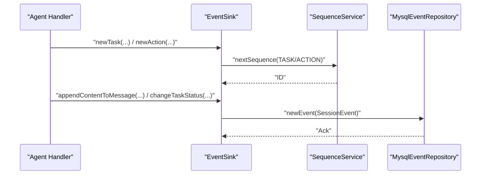
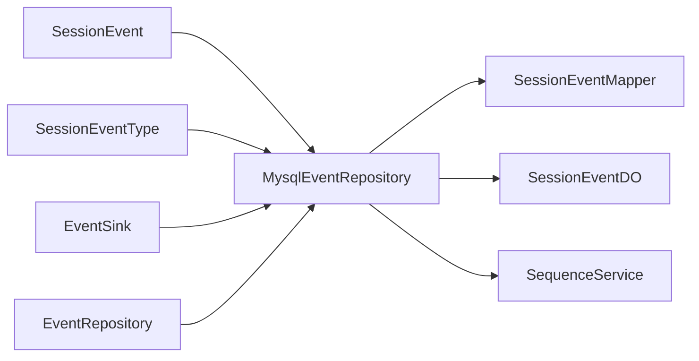

# Event Sourcing and Audit Trail

<cite>
**Referenced Files in This Document**
- [SessionEvent.java](file://backend_java/core/src/main/java/com/aliyun/tam/x/tron/core/domain/models/events/SessionEvent.java)
- [SessionEventType.java](file://backend_java/core/src/main/java/com/aliyun/tam/x/tron/core/domain/models/events/SessionEventType.java)
- [EventSink.java](file://backend_java/core/src/main/java/com/aliyun/tam/x/tron/core/domain/models/events/EventSink.java)
- [NewUserInputEvent.java](file://backend_java/core/src/main/java/com/aliyun/tam/x/tron/core/domain/models/events/NewUserInputEvent.java)
- [NewAgentMessageEvent.java](file://backend_java/core/src/main/java/com/aliyun/tam/x/tron/core/domain/models/events/NewAgentMessageEvent.java)
- [AgentMessageAppendContentEvent.java](file://backend_java/core/src/main/java/com/aliyun/tam/x/tron/core/domain/models/events/AgentMessageAppendContentEvent.java)
- [AgentMessageStatusChangedEvent.java](file://backend_java/core/src/main/java/com/aliyun/tam/x/tron/core/domain/models/events/AgentMessageStatusChangedEvent.java)
- [TaskAppendContentEvent.java](file://backend_java/core/src/main/java/com/aliyun/tam/x/tron/core/domain/models/events/TaskAppendContentEvent.java)
- [TaskStatusChangeEvent.java](file://backend_java/core/src/main/java/com/aliyun/tam/x/tron/core/domain/models/events/TaskStatusChangeEvent.java)
- [ActionAppendContentEvent.java](file://backend_java/core/src/main/java/com/aliyun/tam/x/tron/core/domain/models/events/ActionAppendContentEvent.java)
- [ActionStatusChangeEvent.java](file://backend_java/core/src/main/java/com/aliyun/tam/x/tron/core/domain/models/events/ActionStatusChangeEvent.java)
- [CustomEvent.java](file://backend_java/core/src/main/java/com/aliyun/tam/x/tron/core/domain/models/events/CustomEvent.java)
- [EventRepository.java](file://backend_java/core/src/main/java/com/aliyun/tam/x/tron/core/domain/repository/EventRepository.java)
- [MysqlEventRepository.java](file://backend_java/core/src/main/java/com/aliyun/tam/x/tron/core/domain/repository/mysql/MysqlEventRepository.java)
- [SessionEventDO.java](file://backend_java/infra/src/main/java/com/aliyun/tam/x/tron/infra/dal/dataobject/SessionEventDO.java)
- [SessionEventMapper.java](file://backend_java/infra/src/main/java/com/aliyun/tam/x/tron/infra/dal/mapper/SessionEventMapper.java)
- [init.sql](file://backend_java/bootstrap/src/main/resources/schema/init.sql)
- [SequenceService.java](file://backend_java/infra/src/main/java/com/aliyun/tam/x/tron/infra/sequence/SequenceService.java)
</cite>

## Table of Contents
1. [Introduction](#introduction)
2. [Project Structure](#project-structure)
3. [Core Components](#core-components)
4. [Architecture Overview](#architecture-overview)
5. [Detailed Component Analysis](#detailed-component-analysis)
6. [Dependency Analysis](#dependency-analysis)
7. [Performance Considerations](#performance-considerations)
8. [Troubleshooting Guide](#troubleshooting-guide)
9. [Conclusion](#conclusion)
10. [Appendices](#appendices)

## Introduction
This document explains the event sourcing architecture and audit trail system in Tron OneAgent. It focuses on the immutable event stream that enables complete auditability and conversation replay, the comprehensive event type system, the MySQL-based persistence strategy, event replay mechanisms, and the EventSink pattern for real-time event delivery. It also documents the database schema, indexing strategies, migration approaches for schema changes, and practical guidance for implementing custom events, ensuring ordering guarantees, and optimizing event processing performance. Use cases covered include conversation analytics, debugging, and compliance.

## Project Structure
The event sourcing and audit trail system spans three layers:
- Domain models: event definitions, base classes, and enumerations
- Persistence: MySQL-backed repository and mapper
- Infrastructure: sequence generation and schema initialization

**Diagram sources**
- [SessionEvent.java:34-50](file://backend_java/core/src/main/java/com/aliyun/tam/x/tron/core/domain/models/events/SessionEvent.java#L34-L50)
- [SessionEventType.java:26-67](file://backend_java/core/src/main/java/com/aliyun/tam/x/tron/core/domain/models/events/SessionEventType.java#L26-L67)
- [EventSink.java:42-265](file://backend_java/core/src/main/java/com/aliyun/tam/x/tron/core/domain/models/events/EventSink.java#L42-L265)
- [NewUserInputEvent.java:35-42](file://backend_java/core/src/main/java/com/aliyun/tam/x/tron/core/domain/models/events/NewUserInputEvent.java#L35-L42)
- [NewAgentMessageEvent.java:35-42](file://backend_java/core/src/main/java/com/aliyun/tam/x/tron/core/domain/models/events/NewAgentMessageEvent.java#L35-L42)
- [AgentMessageAppendContentEvent.java:38-48](file://backend_java/core/src/main/java/com/aliyun/tam/x/tron/core/domain/models/events/AgentMessageAppendContentEvent.java#L38-L48)
- [AgentMessageStatusChangedEvent.java:39-54](file://backend_java/core/src/main/java/com/aliyun/tam/x/tron/core/domain/models/events/AgentMessageStatusChangedEvent.java#L39-L54)
- [TaskAppendContentEvent.java:38-48](file://backend_java/core/src/main/java/com/aliyun/tam/x/tron/core/domain/models/events/TaskAppendContentEvent.java#L38-L48)
- [TaskStatusChangeEvent.java:37-48](file://backend_java/core/src/main/java/com/aliyun/tam/x/tron/core/domain/models/events/TaskStatusChangeEvent.java#L37-L48)
- [ActionAppendContentEvent.java:36-46](file://backend_java/core/src/main/java/com/aliyun/tam/x/tron/core/domain/models/events/ActionAppendContentEvent.java#L36-L46)
- [ActionStatusChangeEvent.java:37-47](file://backend_java/core/src/main/java/com/aliyun/tam/x/tron/core/domain/models/events/ActionStatusChangeEvent.java#L37-L47)
- [CustomEvent.java:28-43](file://backend_java/core/src/main/java/com/aliyun/tam/x/tron/core/domain/models/events/CustomEvent.java#L28-L43)
- [EventRepository.java:25-30](file://backend_java/core/src/main/java/com/aliyun/tam/x/tron/core/domain/repository/EventRepository.java#L25-L30)
- [MysqlEventRepository.java:55-421](file://backend_java/core/src/main/java/com/aliyun/tam/x/tron/core/domain/repository/mysql/MysqlEventRepository.java#L55-L421)
- [SessionEventDO.java:30-91](file://backend_java/infra/src/main/java/com/aliyun/tam/x/tron/infra/dal/dataobject/SessionEventDO.java#L30-L91)
- [SessionEventMapper.java:32-41](file://backend_java/infra/src/main/java/com/aliyun/tam/x/tron/infra/dal/mapper/SessionEventMapper.java#L32-L41)
- [SequenceService.java:40-177](file://backend_java/infra/src/main/java/com/aliyun/tam/x/tron/infra/sequence/SequenceService.java#L40-L177)
- [init.sql:95-110](file://backend_java/bootstrap/src/main/resources/schema/init.sql#L95-L110)

**Section sources**
- [SessionEvent.java:34-50](file://backend_java/core/src/main/java/com/aliyun/tam/x/tron/core/domain/models/events/SessionEvent.java#L34-L50)
- [SessionEventType.java:26-67](file://backend_java/core/src/main/java/com/aliyun/tam/x/tron/core/domain/models/events/SessionEventType.java#L26-L67)
- [EventSink.java:42-265](file://backend_java/core/src/main/java/com/aliyun/tam/x/tron/core/domain/models/events/EventSink.java#L42-L265)
- [MysqlEventRepository.java:55-421](file://backend_java/core/src/main/java/com/aliyun/tam/x/tron/core/domain/repository/mysql/MysqlEventRepository.java#L55-L421)
- [SessionEventDO.java:30-91](file://backend_java/infra/src/main/java/com/aliyun/tam/x/tron/infra/dal/dataobject/SessionEventDO.java#L30-L91)
- [SessionEventMapper.java:32-41](file://backend_java/infra/src/main/java/com/aliyun/tam/x/tron/infra/dal/mapper/SessionEventMapper.java#L32-L41)
- [init.sql:95-110](file://backend_java/bootstrap/src/main/resources/schema/init.sql#L95-L110)
- [SequenceService.java:40-177](file://backend_java/infra/src/main/java/com/aliyun/tam/x/tron/infra/sequence/SequenceService.java#L40-L177)

## Core Components
- SessionEvent: Base class for all session-scoped events, carrying identifiers and timestamps, with a polymorphic type discriminator.
- SessionEventType: Enumerates supported event types with integer values for compact storage and fast lookup.
- EventSink: Abstract sink that generates event IDs, exposes convenience methods to emit user input, agent messages, content appends, status changes, tasks, and actions, and delegates persistence to the underlying repository.
- Concrete Events: NewUserInputEvent, NewAgentMessageEvent, AgentMessageAppendContentEvent, AgentMessageStatusChangedEvent, TaskAppendContentEvent, TaskStatusChangeEvent, ActionAppendContentEvent, ActionStatusChangeEvent, plus CustomEvent for extensibility.
- EventRepository and MysqlEventRepository: Defines the contract for pulling events and provides a MySQL-backed implementation that persists events and maintains message state in-memory for immediate consistency.
- SessionEventDO and SessionEventMapper: Data object and MyBatis mapper for the session_events table, enabling batch inserts and JSON serialization of event payloads.
- SequenceService: Generates monotonic, globally formatted sequence numbers for events, messages, tasks, and actions.

**Section sources**
- [SessionEvent.java:34-50](file://backend_java/core/src/main/java/com/aliyun/tam/x/tron/core/domain/models/events/SessionEvent.java#L34-L50)
- [SessionEventType.java:26-67](file://backend_java/core/src/main/java/com/aliyun/tam/x/tron/core/domain/models/events/SessionEventType.java#L26-L67)
- [EventSink.java:42-265](file://backend_java/core/src/main/java/com/aliyun/tam/x/tron/core/domain/models/events/EventSink.java#L42-L265)
- [NewUserInputEvent.java:35-42](file://backend_java/core/src/main/java/com/aliyun/tam/x/tron/core/domain/models/events/NewUserInputEvent.java#L35-L42)
- [NewAgentMessageEvent.java:35-42](file://backend_java/core/src/main/java/com/aliyun/tam/x/tron/core/domain/models/events/NewAgentMessageEvent.java#L35-L42)
- [AgentMessageAppendContentEvent.java:38-48](file://backend_java/core/src/main/java/com/aliyun/tam/x/tron/core/domain/models/events/AgentMessageAppendContentEvent.java#L38-L48)
- [AgentMessageStatusChangedEvent.java:39-54](file://backend_java/core/src/main/java/com/aliyun/tam/x/tron/core/domain/models/events/AgentMessageStatusChangedEvent.java#L39-L54)
- [TaskAppendContentEvent.java:38-48](file://backend_java/core/src/main/java/com/aliyun/tam/x/tron/core/domain/models/events/TaskAppendContentEvent.java#L38-L48)
- [TaskStatusChangeEvent.java:37-48](file://backend_java/core/src/main/java/com/aliyun/tam/x/tron/core/domain/models/events/TaskStatusChangeEvent.java#L37-L48)
- [ActionAppendContentEvent.java:36-46](file://backend_java/core/src/main/java/com/aliyun/tam/x/tron/core/domain/models/events/ActionAppendContentEvent.java#L36-L46)
- [ActionStatusChangeEvent.java:37-47](file://backend_java/core/src/main/java/com/aliyun/tam/x/tron/core/domain/models/events/ActionStatusChangeEvent.java#L37-L47)
- [CustomEvent.java:28-43](file://backend_java/core/src/main/java/com/aliyun/tam/x/tron/core/domain/models/events/CustomEvent.java#L28-L43)
- [EventRepository.java:25-30](file://backend_java/core/src/main/java/com/aliyun/tam/x/tron/core/domain/repository/EventRepository.java#L25-L30)
- [MysqlEventRepository.java:55-421](file://backend_java/core/src/main/java/com/aliyun/tam/x/tron/core/domain/repository/mysql/MysqlEventRepository.java#L55-L421)
- [SessionEventDO.java:30-91](file://backend_java/infra/src/main/java/com/aliyun/tam/x/tron/infra/dal/dataobject/SessionEventDO.java#L30-L91)
- [SessionEventMapper.java:32-41](file://backend_java/infra/src/main/java/com/aliyun/tam/x/tron/infra/dal/mapper/SessionEventMapper.java#L32-L41)
- [SequenceService.java:40-177](file://backend_java/infra/src/main/java/com/aliyun/tam/x/tron/infra/sequence/SequenceService.java#L40-L177)

## Architecture Overview
The system follows an event-centric architecture:
- Event producers (agents and handlers) emit SessionEvent instances via EventSink.
- MysqlEventRepository serializes events to JSON, writes them to session_events, and updates message state in-memory for immediate consistency.
- Replay consumers pull events by offset and reconstruct state by applying events in order.
- SequenceService ensures monotonic IDs across event, message, task, and action lifecycles.

**Diagram sources**
- [EventSink.java:206-287](file://backend_java/core/src/main/java/com/aliyun/tam/x/tron/core/domain/models/events/EventSink.java#L206-L287)
- [MysqlEventRepository.java:206-287](file://backend_java/core/src/main/java/com/aliyun/tam/x/tron/core/domain/repository/mysql/MysqlEventRepository.java#L206-L287)
- [SessionEventMapper.java:34-40](file://backend_java/infra/src/main/java/com/aliyun/tam/x/tron/infra/dal/mapper/SessionEventMapper.java#L34-L40)
- [SessionEventDO.java:30-91](file://backend_java/infra/src/main/java/com/aliyun/tam/x/tron/infra/dal/dataobject/SessionEventDO.java#L30-L91)

## Detailed Component Analysis

### Event Model and Type System
The event model centers around a polymorphic base with a type discriminator and shared identifiers. Concrete events represent distinct lifecycle transitions and content mutations.

**Diagram sources**
- [SessionEvent.java:34-50](file://backend_java/core/src/main/java/com/aliyun/tam/x/tron/core/domain/models/events/SessionEvent.java#L34-L50)
- [SessionEventType.java:26-67](file://backend_java/core/src/main/java/com/aliyun/tam/x/tron/core/domain/models/events/SessionEventType.java#L26-L67)
- [EventSink.java:42-265](file://backend_java/core/src/main/java/com/aliyun/tam/x/tron/core/domain/models/events/EventSink.java#L42-L265)
- [NewUserInputEvent.java:35-42](file://backend_java/core/src/main/java/com/aliyun/tam/x/tron/core/domain/models/events/NewUserInputEvent.java#L35-L42)
- [NewAgentMessageEvent.java:35-42](file://backend_java/core/src/main/java/com/aliyun/tam/x/tron/core/domain/models/events/NewAgentMessageEvent.java#L35-L42)
- [AgentMessageAppendContentEvent.java:38-48](file://backend_java/core/src/main/java/com/aliyun/tam/x/tron/core/domain/models/events/AgentMessageAppendContentEvent.java#L38-L48)
- [AgentMessageStatusChangedEvent.java:39-54](file://backend_java/core/src/main/java/com/aliyun/tam/x/tron/core/domain/models/events/AgentMessageStatusChangedEvent.java#L39-L54)
- [TaskAppendContentEvent.java:38-48](file://backend_java/core/src/main/java/com/aliyun/tam/x/tron/core/domain/models/events/TaskAppendContentEvent.java#L38-L48)
- [TaskStatusChangeEvent.java:37-48](file://backend_java/core/src/main/java/com/aliyun/tam/x/tron/core/domain/models/events/TaskStatusChangeEvent.java#L37-L48)
- [ActionAppendContentEvent.java:36-46](file://backend_java/core/src/main/java/com/aliyun/tam/x/tron/core/domain/models/events/ActionAppendContentEvent.java#L36-L46)
- [ActionStatusChangeEvent.java:37-47](file://backend_java/core/src/main/java/com/aliyun/tam/x/tron/core/domain/models/events/ActionStatusChangeEvent.java#L37-L47)
- [CustomEvent.java:28-43](file://backend_java/core/src/main/java/com/aliyun/tam/x/tron/core/domain/models/events/CustomEvent.java#L28-L43)

**Section sources**
- [SessionEvent.java:34-50](file://backend_java/core/src/main/java/com/aliyun/tam/x/tron/core/domain/models/events/SessionEvent.java#L34-L50)
- [SessionEventType.java:26-67](file://backend_java/core/src/main/java/com/aliyun/tam/x/tron/core/domain/models/events/SessionEventType.java#L26-L67)
- [EventSink.java:42-265](file://backend_java/core/src/main/java/com/aliyun/tam/x/tron/core/domain/models/events/EventSink.java#L42-L265)
- [CustomEvent.java:28-43](file://backend_java/core/src/main/java/com/aliyun/tam/x/tron/core/domain/models/events/CustomEvent.java#L28-L43)

### Event Persistence and Replay
MysqlEventRepository persists events and maintains message state:
- Serialization: Events are serialized to JSON and stored in the data column.
- Batch Insertion: Uses a custom MyBatis insertBatch to efficiently persist partitions of events.
- In-memory Message State: Tracks messages and updated messages to ensure immediate consistency for downstream consumers.
- Ordering Guarantees: Events are persisted in ascending id order and applied in sequence; the sink’s flush mechanism batches writes and updates last-applied event IDs.

**Diagram sources**
- [MysqlEventRepository.java:165-199](file://backend_java/core/src/main/java/com/aliyun/tam/x/tron/core/domain/repository/mysql/MysqlEventRepository.java#L165-L199)
- [SessionEventMapper.java:34-40](file://backend_java/infra/src/main/java/com/aliyun/tam/x/tron/infra/dal/mapper/SessionEventMapper.java#L34-L40)
- [SessionEventDO.java:30-91](file://backend_java/infra/src/main/java/com/aliyun/tam/x/tron/infra/dal/dataobject/SessionEventDO.java#L30-L91)

**Section sources**
- [MysqlEventRepository.java:87-136](file://backend_java/core/src/main/java/com/aliyun/tam/x/tron/core/domain/repository/mysql/MysqlEventRepository.java#L87-L136)
- [MysqlEventRepository.java:165-199](file://backend_java/core/src/main/java/com/aliyun/tam/x/tron/core/domain/repository/mysql/MysqlEventRepository.java#L165-L199)
- [SessionEventMapper.java:34-40](file://backend_java/infra/src/main/java/com/aliyun/tam/x/tron/infra/dal/mapper/SessionEventMapper.java#L34-L40)
- [SessionEventDO.java:30-91](file://backend_java/infra/src/main/java/com/aliyun/tam/x/tron/infra/dal/dataobject/SessionEventDO.java#L30-L91)

### Event Replay Mechanism
Replay is achieved by pulling events in id order:
- Pull API: pullEvents(agentId, sessionId, offset, size) returns ordered events for a session.
- Deserialization: The repository deserializes stored JSON into strongly typed SessionEvent instances using a type-to-class mapping.
- Message Reconstruction: Handlers reconstruct message state by applying relevant events (e.g., append content, status changes).

**Diagram sources**
- [EventRepository.java:27-28](file://backend_java/core/src/main/java/com/aliyun/tam/x/tron/core/domain/repository/EventRepository.java#L27-L28)
- [MysqlEventRepository.java:87-136](file://backend_java/core/src/main/java/com/aliyun/tam/x/tron/core/domain/repository/mysql/MysqlEventRepository.java#L87-L136)
- [SessionEventMapper.java:32-41](file://backend_java/infra/src/main/java/com/aliyun/tam/x/tron/infra/dal/mapper/SessionEventMapper.java#L32-L41)

**Section sources**
- [EventRepository.java:27-28](file://backend_java/core/src/main/java/com/aliyun/tam/x/tron/core/domain/repository/EventRepository.java#L27-L28)
- [MysqlEventRepository.java:87-136](file://backend_java/core/src/main/java/com/aliyun/tam/x/tron/core/domain/repository/mysql/MysqlEventRepository.java#L87-L136)

### EventSink Pattern for Real-time Delivery
EventSink encapsulates:
- Event ID generation via SequenceService.
- Convenience methods to emit user input, agent messages, content appends, and status changes.
- Immediate message persistence and flushing to maintain low-latency visibility.
- Support for task and action creation and updates.

**Diagram sources**
- [EventSink.java:137-161](file://backend_java/core/src/main/java/com/aliyun/tam/x/tron/core/domain/models/events/EventSink.java#L137-L161)
- [EventSink.java:206-287](file://backend_java/core/src/main/java/com/aliyun/tam/x/tron/core/domain/models/events/EventSink.java#L206-L287)
- [SequenceService.java:130-132](file://backend_java/infra/src/main/java/com/aliyun/tam/x/tron/infra/sequence/SequenceService.java#L130-L132)
- [MysqlEventRepository.java:206-287](file://backend_java/core/src/main/java/com/aliyun/tam/x/tron/core/domain/repository/mysql/MysqlEventRepository.java#L206-L287)

**Section sources**
- [EventSink.java:42-265](file://backend_java/core/src/main/java/com/aliyun/tam/x/tron/core/domain/models/events/EventSink.java#L42-L265)
- [SequenceService.java:104-132](file://backend_java/infra/src/main/java/com/aliyun/tam/x/tron/infra/sequence/SequenceService.java#L104-L132)
- [MysqlEventRepository.java:165-199](file://backend_java/core/src/main/java/com/aliyun/tam/x/tron/core/domain/repository/mysql/MysqlEventRepository.java#L165-L199)

### Database Schema and Indexing
The schema supports immutable event storage and efficient querying:
- session_events: Stores event id, agent_id, user_id, session_id, optional message_id, type, status, JSON payload, and timestamps.
- sessions: Tracks last_applied_event_id per session for efficient replay.
- messages: Stores message state with indexes on session_id and agent_id for fast retrieval.

Indexing strategies:
- session_events: Composite index on (session_id, agent_id) to accelerate pullEvents queries.
- sessions: Composite index on (agent_id, user_id) to support user-scoped session queries.
- messages: Index on (session_id, agent_id) to speed up message lookups during event application.

Migration approaches:
- Add columns with defaults for backward compatibility.
- Use explicit ALTER TABLE statements and validate with schema init script.
- For type changes, introduce new columns, populate data, then drop old ones in controlled rollouts.

**Section sources**
- [init.sql:95-110](file://backend_java/bootstrap/src/main/resources/schema/init.sql#L95-L110)
- [init.sql:61-76](file://backend_java/bootstrap/src/main/resources/schema/init.sql#L61-L76)
- [init.sql:78-92](file://backend_java/bootstrap/src/main/resources/schema/init.sql#L78-L92)
- [SessionEventDO.java:30-91](file://backend_java/infra/src/main/java/com/aliyun/tam/x/tron/infra/dal/dataobject/SessionEventDO.java#L30-L91)

### Implementing Custom Events
To add a new event type:
1. Define a new subclass of SessionEvent with a unique SessionEventType value.
2. Extend the type-to-class mapping in MysqlEventRepository if automatic deserialization is desired.
3. Emit the event via EventSink.newEvent(...) and ensure needPersistent() aligns with your needs.
4. If the event affects message state, implement a handler in MySQLEventSink similar to existing handlers.

Guidelines:
- Keep payloads immutable and JSON-serializable.
- Use SequenceService for IDs when emitting from sinks.
- Apply ordering guarantees by relying on ascending id sequencing.

**Section sources**
- [CustomEvent.java:28-43](file://backend_java/core/src/main/java/com/aliyun/tam/x/tron/core/domain/models/events/CustomEvent.java#L28-L43)
- [SessionEventType.java:26-67](file://backend_java/core/src/main/java/com/aliyun/tam/x/tron/core/domain/models/events/SessionEventType.java#L26-L67)
- [MysqlEventRepository.java:75-85](file://backend_java/core/src/main/java/com/aliyun/tam/x/tron/core/domain/repository/mysql/MysqlEventRepository.java#L75-L85)
- [EventSink.java:206-287](file://backend_java/core/src/main/java/com/aliyun/tam/x/tron/core/domain/models/events/EventSink.java#L206-L287)

### Conversation Analytics, Debugging, and Compliance
- Analytics: Replay events to compute metrics (e.g., task completion rates, latency distributions) and visualize conversation flows.
- Debugging: Use event offsets and message state to reproduce user sessions and pinpoint failures.
- Compliance: The immutable event log provides an auditable record of all actions, status changes, and content mutations.

[No sources needed since this section provides general guidance]

## Dependency Analysis
The following diagram highlights key dependencies among event components and persistence:

**Diagram sources**
- [SessionEvent.java:34-50](file://backend_java/core/src/main/java/com/aliyun/tam/x/tron/core/domain/models/events/SessionEvent.java#L34-L50)
- [SessionEventType.java:26-67](file://backend_java/core/src/main/java/com/aliyun/tam/x/tron/core/domain/models/events/SessionEventType.java#L26-L67)
- [EventSink.java:42-265](file://backend_java/core/src/main/java/com/aliyun/tam/x/tron/core/domain/models/events/EventSink.java#L42-L265)
- [MysqlEventRepository.java:55-421](file://backend_java/core/src/main/java/com/aliyun/tam/x/tron/core/domain/repository/mysql/MysqlEventRepository.java#L55-L421)
- [SessionEventMapper.java:32-41](file://backend_java/infra/src/main/java/com/aliyun/tam/x/tron/infra/dal/mapper/SessionEventMapper.java#L32-L41)
- [SessionEventDO.java:30-91](file://backend_java/infra/src/main/java/com/aliyun/tam/x/tron/infra/dal/dataobject/SessionEventDO.java#L30-L91)
- [SequenceService.java:40-177](file://backend_java/infra/src/main/java/com/aliyun/tam/x/tron/infra/sequence/SequenceService.java#L40-L177)
- [EventRepository.java:25-30](file://backend_java/core/src/main/java/com/aliyun/tam/x/tron/core/domain/repository/EventRepository.java#L25-L30)

**Section sources**
- [MysqlEventRepository.java:75-85](file://backend_java/core/src/main/java/com/aliyun/tam/x/tron/core/domain/repository/mysql/MysqlEventRepository.java#L75-L85)
- [EventSink.java:206-287](file://backend_java/core/src/main/java/com/aliyun/tam/x/tron/core/domain/models/events/EventSink.java#L206-L287)

## Performance Considerations
- Batch Writes: MysqlEventRepository partitions events and uses insertBatch to minimize round-trips.
- Flush Strategy: Controlled flushing reduces write frequency while maintaining responsiveness.
- JSON Serialization: Efficient serialization minimizes CPU overhead; avoid large payloads.
- Indexing: Proper indexes on session_id and agent_id enable fast replay and session-scoped queries.
- Concurrency: In-memory message maps are thread-safe; batching and transactions protect consistency.

[No sources needed since this section provides general guidance]

## Troubleshooting Guide
Common issues and resolutions:
- Serialization Failures: Ensure event payloads are JSON-serializable and avoid cyclic references.
- Missing Type Mapping: Add new SessionEventType to the mapping in MysqlEventRepository for automatic deserialization.
- Duplicate Keys: SequenceService and primary keys prevent duplicates; verify unique constraints.
- Replay Gaps: Use last_applied_event_id to detect missing events and re-run replay from the gap.

**Section sources**
- [MysqlEventRepository.java:100-135](file://backend_java/core/src/main/java/com/aliyun/tam/x/tron/core/domain/repository/mysql/MysqlEventRepository.java#L100-L135)
- [SessionEventMapper.java:34-40](file://backend_java/infra/src/main/java/com/aliyun/tam/x/tron/infra/dal/mapper/SessionEventMapper.java#L34-L40)
- [init.sql:95-110](file://backend_java/bootstrap/src/main/resources/schema/init.sql#L95-L110)

## Conclusion
Tron OneAgent’s event sourcing architecture establishes an immutable, auditable, and replayable foundation for conversations. The EventSink pattern enables real-time event emission, while MySQL-backed persistence and careful indexing support efficient replay and analytics. The comprehensive event type system, combined with sequence generation and robust replay mechanisms, meets debugging and compliance needs and provides a strong foundation for advanced use cases.

[No sources needed since this section summarizes without analyzing specific files]

## Appendices

### Practical Examples
- Implementing a Custom Event: Define a new SessionEvent subclass, register its type, and emit via EventSink. Reference: [CustomEvent.java:28-43](file://backend_java/core/src/main/java/com/aliyun/tam/x/tron/core/domain/models/events/CustomEvent.java#L28-L43), [SessionEventType.java:26-67](file://backend_java/core/src/main/java/com/aliyun/tam/x/tron/core/domain/models/events/SessionEventType.java#L26-L67), [EventSink.java:206-287](file://backend_java/core/src/main/java/com/aliyun/tam/x/tron/core/domain/models/events/EventSink.java#L206-L287).
- Ensuring Ordering Guarantees: Rely on ascending id sequencing and flush intervals; avoid out-of-order writes. Reference: [MysqlEventRepository.java:165-199](file://backend_java/core/src/main/java/com/aliyun/tam/x/tron/core/domain/repository/mysql/MysqlEventRepository.java#L165-L199).
- Optimizing Performance: Use batch inserts, appropriate indexes, and controlled flushing. Reference: [SessionEventMapper.java:34-40](file://backend_java/infra/src/main/java/com/aliyun/tam/x/tron/infra/dal/mapper/SessionEventMapper.java#L34-L40), [init.sql:95-110](file://backend_java/bootstrap/src/main/resources/schema/init.sql#L95-L110).

[No sources needed since this section provides general guidance]