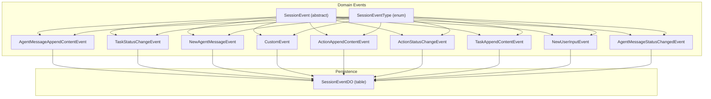
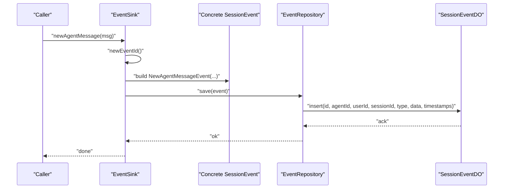
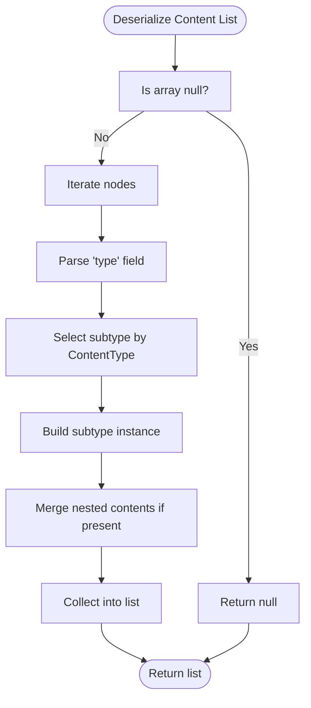
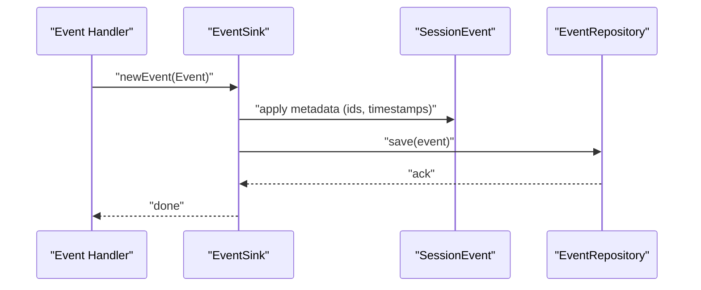
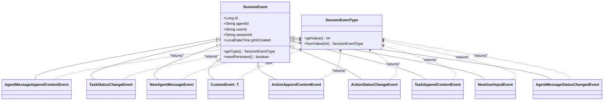

# Event Types and Definitions

<cite>
**Referenced Files in This Document**
- [SessionEvent.java](file://backend_java/core/src/main/java/com/aliyun/tam/x/tron/core/domain/models/events/SessionEvent.java)
- [SessionEventType.java](file://backend_java/core/src/main/java/com/aliyun/tam/x/tron/core/domain/models/events/SessionEventType.java)
- [AgentMessageAppendContentEvent.java](file://backend_java/core/src/main/java/com/aliyun/tam/x/tron/core/domain/models/events/AgentMessageAppendContentEvent.java)
- [TaskStatusChangeEvent.java](file://backend_java/core/src/main/java/com/aliyun/tam/x/tron/core/domain/models/events/TaskStatusChangeEvent.java)
- [NewAgentMessageEvent.java](file://backend_java/core/src/main/java/com/aliyun/tam/x/tron/core/domain/models/events/NewAgentMessageEvent.java)
- [CustomEvent.java](file://backend_java/core/src/main/java/com/aliyun/tam/x/tron/core/domain/models/events/CustomEvent.java)
- [ActionAppendContentEvent.java](file://backend_java/core/src/main/java/com/aliyun/tam/x/tron/core/domain/models/events/ActionAppendContentEvent.java)
- [ActionStatusChangeEvent.java](file://backend_java/core/src/main/java/com/aliyun/tam/x/tron/core/domain/models/events/ActionStatusChangeEvent.java)
- [TaskAppendContentEvent.java](file://backend_java/core/src/main/java/com/aliyun/tam/x/tron/core/domain/models/events/TaskAppendContentEvent.java)
- [EventSink.java](file://backend_java/core/src/main/java/com/aliyun/tam/x/tron/core/domain/models/events/EventSink.java)
- [NewUserInputEvent.java](file://backend_java/core/src/main/java/com/aliyun/tam/x/tron/core/domain/models/events/NewUserInputEvent.java)
- [AgentMessageStatusChangedEvent.java](file://backend_java/core/src/main/java/com/aliyun/tam/x/tron/core/domain/models/events/AgentMessageStatusChangedEvent.java)
- [SessionEventDO.java](file://backend_java/infra/src/main/java/com/aliyun/tam/x/tron/infra/dal/dataobject/SessionEventDO.java)
- [Content.java](file://backend_java/core/src/main/java/com/aliyun/tam/x/tron/core/domain/models/contents/Content.java)
- [ContentType.java](file://backend_java/core/src/main/java/com/aliyun/tam/x/tron/core/domain/models/contents/ContentType.java)
</cite>

## Table of Contents
1. [Introduction](#introduction)
2. [Project Structure](#project-structure)
3. [Core Components](#core-components)
4. [Architecture Overview](#architecture-overview)
5. [Detailed Component Analysis](#detailed-component-analysis)
6. [Dependency Analysis](#dependency-analysis)
7. [Performance Considerations](#performance-considerations)
8. [Troubleshooting Guide](#troubleshooting-guide)
9. [Conclusion](#conclusion)

## Introduction
This document describes the event type system used by Tron OneAgent’s session event sourcing architecture. It focuses on the abstract SessionEvent base class and its concrete implementations, the SessionEventType enumeration, and the polymorphic behavior that enables extensibility. It also covers how events are persisted, serialized/deserialized, and evolved over time while maintaining backward compatibility. Practical guidance is included for creating custom event types, implementing event handlers, and ensuring ordering and uniqueness guarantees.

## Project Structure
The event system spans the core domain models and the infrastructure persistence layer:
- Domain models define the event hierarchy, types, and content models.
- The EventSink orchestrates event creation and dispatch.
- The persistence layer stores events in a normalized relational schema.

**Diagram sources**
- [SessionEvent.java:34-50](file://backend_java/core/src/main/java/com/aliyun/tam/x/tron/core/domain/models/events/SessionEvent.java#L34-L50)
- [SessionEventType.java:26-66](file://backend_java/core/src/main/java/com/aliyun/tam/x/tron/core/domain/models/events/SessionEventType.java#L26-L66)
- [AgentMessageAppendContentEvent.java:38-47](file://backend_java/core/src/main/java/com/aliyun/tam/x/tron/core/domain/models/events/AgentMessageAppendContentEvent.java#L38-L47)
- [TaskStatusChangeEvent.java:37-47](file://backend_java/core/src/main/java/com/aliyun/tam/x/tron/core/domain/models/events/TaskStatusChangeEvent.java#L37-L47)
- [NewAgentMessageEvent.java:35-41](file://backend_java/core/src/main/java/com/aliyun/tam/x/tron/core/domain/models/events/NewAgentMessageEvent.java#L35-L41)
- [CustomEvent.java:28-42](file://backend_java/core/src/main/java/com/aliyun/tam/x/tron/core/domain/models/events/CustomEvent.java#L28-L42)
- [ActionAppendContentEvent.java:36-45](file://backend_java/core/src/main/java/com/aliyun/tam/x/tron/core/domain/models/events/ActionAppendContentEvent.java#L36-L45)
- [ActionStatusChangeEvent.java:37-46](file://backend_java/core/src/main/java/com/aliyun/tam/x/tron/core/domain/models/events/ActionStatusChangeEvent.java#L37-L46)
- [TaskAppendContentEvent.java:38-47](file://backend_java/core/src/main/java/com/aliyun/tam/x/tron/core/domain/models/events/TaskAppendContentEvent.java#L38-L47)
- [NewUserInputEvent.java:35-41](file://backend_java/core/src/main/java/com/aliyun/tam/x/tron/core/domain/models/events/NewUserInputEvent.java#L35-L41)
- [AgentMessageStatusChangedEvent.java:39-53](file://backend_java/core/src/main/java/com/aliyun/tam/x/tron/core/domain/models/events/AgentMessageStatusChangedEvent.java#L39-L53)
- [SessionEventDO.java:28-91](file://backend_java/infra/src/main/java/com/aliyun/tam/x/tron/infra/dal/dataobject/SessionEventDO.java#L28-L91)

**Section sources**
- [SessionEvent.java:27-50](file://backend_java/core/src/main/java/com/aliyun/tam/x/tron/core/domain/models/events/SessionEvent.java#L27-L50)
- [SessionEventType.java:23-66](file://backend_java/core/src/main/java/com/aliyun/tam/x/tron/core/domain/models/events/SessionEventType.java#L23-L66)
- [SessionEventDO.java:25-91](file://backend_java/infra/src/main/java/com/aliyun/tam/x/tron/infra/dal/dataobject/SessionEventDO.java#L25-L91)

## Core Components
- SessionEvent: Abstract base class for all session events. Provides shared fields (identity, agent/user/session identifiers, timestamps) and declares the event type via an abstract method. Includes a persistence flag with a default to persist.
- SessionEventType: Enumerates supported event types with integer values and Jackson annotations for JSON serialization/deserialization.
- Concrete events: Specialized event classes that override the type method and carry domain-specific payloads.
- EventSink: Orchestrator that generates event IDs, builds standard events, and delegates handling to downstream systems.
- Persistence model: SessionEventDO maps event records to relational columns, including type and data fields.

Key responsibilities and behaviors:
- Polymorphism: Each concrete event returns a specific SessionEventType from its getType method.
- Serialization: Events are persisted as structured data; content lists leverage a specialized deserializer.
- Extensibility: CustomEvent<T> allows registering and handling arbitrary event types with typed payloads.

**Section sources**
- [SessionEvent.java:34-50](file://backend_java/core/src/main/java/com/aliyun/tam/x/tron/core/domain/models/events/SessionEvent.java#L34-L50)
- [SessionEventType.java:26-66](file://backend_java/core/src/main/java/com/aliyun/tam/x/tron/core/domain/models/events/SessionEventType.java#L26-L66)
- [EventSink.java:42-265](file://backend_java/core/src/main/java/com/aliyun/tam/x/tron/core/domain/models/events/EventSink.java#L42-L265)
- [SessionEventDO.java:28-91](file://backend_java/infra/src/main/java/com/aliyun/tam/x/tron/infra/dal/dataobject/SessionEventDO.java#L28-L91)

## Architecture Overview
The event sourcing architecture centers on the SessionEvent hierarchy and the EventSink factory methods. Events are created with unique IDs, populated with contextual metadata, and dispatched for persistence and processing.

**Diagram sources**
- [EventSink.java:87-96](file://backend_java/core/src/main/java/com/aliyun/tam/x/tron/core/domain/models/events/EventSink.java#L87-L96)
- [NewAgentMessageEvent.java:35-41](file://backend_java/core/src/main/java/com/aliyun/tam/x/tron/core/domain/models/events/NewAgentMessageEvent.java#L35-L41)
- [SessionEventDO.java:28-91](file://backend_java/infra/src/main/java/com/aliyun/tam/x/tron/infra/dal/dataobject/SessionEventDO.java#L28-L91)

## Detailed Component Analysis

### Abstract Base: SessionEvent
- Purpose: Defines the common shape for all session events.
- Fields: Identity, agent/user/session identifiers, and creation timestamp.
- Methods:
  - getType(): Abstract; concrete events must specify their SessionEventType.
  - needPersistent(): Default true; can be overridden per event.

Validation and constraints:
- Enforced by construction via builders and setters; concrete events add domain-specific validations where applicable.

**Section sources**
- [SessionEvent.java:34-50](file://backend_java/core/src/main/java/com/aliyun/tam/x/tron/core/domain/models/events/SessionEvent.java#L34-L50)

### Enumeration: SessionEventType
- Values: Covers user input, agent message lifecycle, task and action lifecycle, and auxiliary types.
- JSON handling: Uses @JsonValue and @JsonCreator to serialize/deserialize integer codes safely.

Extensibility:
- New event types can be added by extending the enum with a new integer value and updating any consumers that rely on the enum.

**Section sources**
- [SessionEventType.java:26-66](file://backend_java/core/src/main/java/com/aliyun/tam/x/tron/core/domain/models/events/SessionEventType.java#L26-L66)

### Concrete Event Implementations

#### NewAgentMessageEvent
- Payload: AgentSessionMessage.
- Type: NEW_AGENT_MESSAGE.
- Persistence: Inherits default persistence behavior.

Validation rules:
- Depends on the validity of the embedded message object.

**Section sources**
- [NewAgentMessageEvent.java:35-41](file://backend_java/core/src/main/java/com/aliyun/tam/x/tron/core/domain/models/events/NewAgentMessageEvent.java#L35-L41)

#### AgentMessageAppendContentEvent
- Payload: messageId and a list of Content<?> items.
- Type: AGENT_MESSAGE_APPEND_CONTENT.
- Serialization: Uses Content.ContentDeserializer for robust polymorphic deserialization of content arrays.

Validation rules:
- Ensures the list of content is properly deserialized; empty or malformed arrays are handled gracefully by the deserializer.

**Section sources**
- [AgentMessageAppendContentEvent.java:38-47](file://backend_java/core/src/main/java/com/aliyun/tam/x/tron/core/domain/models/events/AgentMessageAppendContentEvent.java#L38-L47)
- [Content.java:71-146](file://backend_java/core/src/main/java/com/aliyun/tam/x/tron/core/domain/models/contents/Content.java#L71-L146)

#### TaskStatusChangeEvent
- Payload: messageId, taskId, newStatus, optional result, and completion timestamp.
- Type: TASK_STATUS_CHANGED.
- Persistence: Inherits default persistence behavior.

Validation rules:
- Completion timestamp is set conditionally based on the terminal status.

**Section sources**
- [TaskStatusChangeEvent.java:37-47](file://backend_java/core/src/main/java/com/aliyun/tam/x/tron/core/domain/models/events/TaskStatusChangeEvent.java#L37-L47)

#### TaskAppendContentEvent
- Payload: messageId, taskId, and a list of Content<?> items.
- Type: TASK_APPEND_CONTENT.

Validation rules:
- Content list deserialization follows the same polymorphic pattern as agent message content.

**Section sources**
- [TaskAppendContentEvent.java:38-47](file://backend_java/core/src/main/java/com/aliyun/tam/x/tron/core/domain/models/events/TaskAppendContentEvent.java#L38-L47)
- [Content.java:71-146](file://backend_java/core/src/main/java/com/aliyun/tam/x/tron/core/domain/models/contents/Content.java#L71-L146)

#### ActionAppendContentEvent
- Payload: messageId, actionId, and a list of Content<?> items.
- Type: ACTION_APPEND_CONTENT.

Validation rules:
- Content list deserialization follows the same polymorphic pattern.

**Section sources**
- [ActionAppendContentEvent.java:36-45](file://backend_java/core/src/main/java/com/aliyun/tam/x/tron/core/domain/models/events/ActionAppendContentEvent.java#L36-L45)
- [Content.java:71-146](file://backend_java/core/src/main/java/com/aliyun/tam/x/tron/core/domain/models/contents/Content.java#L71-L146)

#### ActionStatusChangeEvent
- Payload: messageId, actionId, newStatus, and optional completion timestamp.
- Type: ACTION_STATUS_CHANGED.

Validation rules:
- Completion timestamp is set conditionally based on non-executing statuses.

**Section sources**
- [ActionStatusChangeEvent.java:37-46](file://backend_java/core/src/main/java/com/aliyun/tam/x/tron/core/domain/models/events/ActionStatusChangeEvent.java#L37-L46)

#### NewUserInputEvent
- Payload: UserSessionMessage.
- Type: NEW_USER_INPUT.

Validation rules:
- Depends on the validity of the user message object.

**Section sources**
- [NewUserInputEvent.java:35-41](file://backend_java/core/src/main/java/com/aliyun/tam/x/tron/core/domain/models/events/NewUserInputEvent.java#L35-L41)

#### AgentMessageStatusChangedEvent
- Payload: messageId, newStatus, optional completion timestamp, error message, and usage metrics.
- Type: AGENT_MESSAGE_STATUS_CHANGED.

Validation rules:
- Completion timestamp is set conditionally based on terminal states.

**Section sources**
- [AgentMessageStatusChangedEvent.java:39-53](file://backend_java/core/src/main/java/com/aliyun/tam/x/tron/core/domain/models/events/AgentMessageStatusChangedEvent.java#L39-L53)

#### CustomEvent<T>
- Purpose: Generic container for custom event types.
- Fields: type (SessionEventType), data (typed payload), and needPersistent flag.
- Behavior: Overrides needPersistent to control persistence per instance.

Use cases:
- Introduce new event categories without modifying the core hierarchy.
- Maintain backward compatibility by registering new types in SessionEventType and handling them in downstream processors.

**Section sources**
- [CustomEvent.java:28-42](file://backend_java/core/src/main/java/com/aliyun/tam/x/tron/core/domain/models/events/CustomEvent.java#L28-L42)

### Event Ordering Guarantees and Uniqueness
- Ordering: EventSink generates monotonically increasing event IDs using a sequence service, ensuring strict ordering per session.
- Uniqueness: Event IDs are unique per sequence namespace, preventing duplicates.
- Dispatch: EventSink.newEvent(...) centralizes event emission, enabling consistent ordering and validation before persistence.

**Section sources**
- [EventSink.java:54-56](file://backend_java/core/src/main/java/com/aliyun/tam/x/tron/core/domain/models/events/EventSink.java#L54-L56)
- [EventSink.java](file://backend_java/core/src/main/java/com/aliyun/tam/x/tron/core/domain/models/events/EventSink.java#L61)

### Serialization, Deserialization, and Versioning Strategies
- Event serialization: Events are persisted with a type discriminator and a data field containing serialized JSON.
- Content polymorphism: Content lists are deserialized using a custom deserializer that selects the appropriate subtype based on a type field, supporting nested content aggregation.
- Versioning:
  - Enum-based type codes enable controlled evolution of event types.
  - Unknown type codes produce explicit errors, aiding detection of incompatible upgrades.
  - CustomEvent<T> supports evolving event semantics by introducing new types and payloads without altering existing event classes.

**Diagram sources**
- [Content.java:71-146](file://backend_java/core/src/main/java/com/aliyun/tam/x/tron/core/domain/models/contents/Content.java#L71-L146)
- [ContentType.java:26-55](file://backend_java/core/src/main/java/com/aliyun/tam/x/tron/core/domain/models/contents/ContentType.java#L26-L55)

**Section sources**
- [SessionEventDO.java:28-91](file://backend_java/infra/src/main/java/com/aliyun/tam/x/tron/infra/dal/dataobject/SessionEventDO.java#L28-L91)
- [Content.java:45-55](file://backend_java/core/src/main/java/com/aliyun/tam/x/tron/core/domain/models/contents/Content.java#L45-L55)
- [ContentType.java:26-55](file://backend_java/core/src/main/java/com/aliyun/tam/x/tron/core/domain/models/contents/ContentType.java#L26-L55)

### Creating Custom Event Types
Steps:
1. Define a new SessionEventType value and update any JSON converters.
2. Create a new concrete event class extending SessionEvent and override getType().
3. Optionally, introduce a dedicated payload class and use CustomEvent<T> for generic handling.
4. Ensure the event is constructed and emitted via EventSink methods or custom sinks.
5. Update persistence and processing logic to handle the new type.

Backward compatibility:
- Keep existing type codes unchanged.
- Add new type codes after existing ones to avoid conflicts.
- Use CustomEvent<T> to decouple new event categories from core classes.

**Section sources**
- [SessionEventType.java:26-66](file://backend_java/core/src/main/java/com/aliyun/tam/x/tron/core/domain/models/events/SessionEventType.java#L26-L66)
- [CustomEvent.java:28-42](file://backend_java/core/src/main/java/com/aliyun/tam/x/tron/core/domain/models/events/CustomEvent.java#L28-L42)
- [EventSink.java](file://backend_java/core/src/main/java/com/aliyun/tam/x/tron/core/domain/models/events/EventSink.java#L61)

### Implementing Event Handlers
- Centralized dispatch: EventSink.newEvent(...) is the primary entry point for emitting events.
- Factory methods: Use EventSink helpers to construct and emit standard events consistently.
- Persistence: Downstream repositories persist events to SessionEventDO with type and data fields.

**Diagram sources**
- [EventSink.java](file://backend_java/core/src/main/java/com/aliyun/tam/x/tron/core/domain/models/events/EventSink.java#L61)
- [SessionEventDO.java:28-91](file://backend_java/infra/src/main/java/com/aliyun/tam/x/tron/infra/dal/dataobject/SessionEventDO.java#L28-L91)

**Section sources**
- [EventSink.java:61-265](file://backend_java/core/src/main/java/com/aliyun/tam/x/tron/core/domain/models/events/EventSink.java#L61-L265)

### Validation Rules by Event Type
- NewAgentMessageEvent: Validate the embedded message object before emission.
- AgentMessageAppendContentEvent: Validate content list deserialization; ensure non-null messageId.
- TaskStatusChangeEvent: Validate taskId presence and terminal status transitions.
- TaskAppendContentEvent: Validate content list deserialization; ensure non-null taskId.
- ActionAppendContentEvent: Validate content list deserialization; ensure non-null actionId.
- ActionStatusChangeEvent: Validate actionId presence and status transitions.
- NewUserInputEvent: Validate the user message object before emission.
- AgentMessageStatusChangedEvent: Validate status transitions and optional completion timestamps.

**Section sources**
- [NewAgentMessageEvent.java:35-41](file://backend_java/core/src/main/java/com/aliyun/tam/x/tron/core/domain/models/events/NewAgentMessageEvent.java#L35-L41)
- [AgentMessageAppendContentEvent.java:38-47](file://backend_java/core/src/main/java/com/aliyun/tam/x/tron/core/domain/models/events/AgentMessageAppendContentEvent.java#L38-L47)
- [TaskStatusChangeEvent.java:37-47](file://backend_java/core/src/main/java/com/aliyun/tam/x/tron/core/domain/models/events/TaskStatusChangeEvent.java#L37-L47)
- [TaskAppendContentEvent.java:38-47](file://backend_java/core/src/main/java/com/aliyun/tam/x/tron/core/domain/models/events/TaskAppendContentEvent.java#L38-L47)
- [ActionAppendContentEvent.java:36-45](file://backend_java/core/src/main/java/com/aliyun/tam/x/tron/core/domain/models/events/ActionAppendContentEvent.java#L36-L45)
- [ActionStatusChangeEvent.java:37-46](file://backend_java/core/src/main/java/com/aliyun/tam/x/tron/core/domain/models/events/ActionStatusChangeEvent.java#L37-L46)
- [NewUserInputEvent.java:35-41](file://backend_java/core/src/main/java/com/aliyun/tam/x/tron/core/domain/models/events/NewUserInputEvent.java#L35-L41)
- [AgentMessageStatusChangedEvent.java:39-53](file://backend_java/core/src/main/java/com/aliyun/tam/x/tron/core/domain/models/events/AgentMessageStatusChangedEvent.java#L39-L53)

## Dependency Analysis
The event system exhibits clear separation of concerns:
- Domain events depend on the base SessionEvent and SessionEventType.
- Content polymorphism depends on ContentType and Content.ContentDeserializer.
- Persistence depends on SessionEventDO mapping and sequence generation.

**Diagram sources**
- [SessionEvent.java:34-50](file://backend_java/core/src/main/java/com/aliyun/tam/x/tron/core/domain/models/events/SessionEvent.java#L34-L50)
- [SessionEventType.java:26-66](file://backend_java/core/src/main/java/com/aliyun/tam/x/tron/core/domain/models/events/SessionEventType.java#L26-L66)
- [AgentMessageAppendContentEvent.java:38-47](file://backend_java/core/src/main/java/com/aliyun/tam/x/tron/core/domain/models/events/AgentMessageAppendContentEvent.java#L38-L47)
- [TaskStatusChangeEvent.java:37-47](file://backend_java/core/src/main/java/com/aliyun/tam/x/tron/core/domain/models/events/TaskStatusChangeEvent.java#L37-L47)
- [NewAgentMessageEvent.java:35-41](file://backend_java/core/src/main/java/com/aliyun/tam/x/tron/core/domain/models/events/NewAgentMessageEvent.java#L35-L41)
- [CustomEvent.java:28-42](file://backend_java/core/src/main/java/com/aliyun/tam/x/tron/core/domain/models/events/CustomEvent.java#L28-L42)
- [ActionAppendContentEvent.java:36-45](file://backend_java/core/src/main/java/com/aliyun/tam/x/tron/core/domain/models/events/ActionAppendContentEvent.java#L36-L45)
- [ActionStatusChangeEvent.java:37-46](file://backend_java/core/src/main/java/com/aliyun/tam/x/tron/core/domain/models/events/ActionStatusChangeEvent.java#L37-L46)
- [TaskAppendContentEvent.java:38-47](file://backend_java/core/src/main/java/com/aliyun/tam/x/tron/core/domain/models/events/TaskAppendContentEvent.java#L38-L47)
- [NewUserInputEvent.java:35-41](file://backend_java/core/src/main/java/com/aliyun/tam/x/tron/core/domain/models/events/NewUserInputEvent.java#L35-L41)
- [AgentMessageStatusChangedEvent.java:39-53](file://backend_java/core/src/main/java/com/aliyun/tam/x/tron/core/domain/models/events/AgentMessageStatusChangedEvent.java#L39-L53)

**Section sources**
- [SessionEvent.java:34-50](file://backend_java/core/src/main/java/com/aliyun/tam/x/tron/core/domain/models/events/SessionEvent.java#L34-L50)
- [SessionEventType.java:26-66](file://backend_java/core/src/main/java/com/aliyun/tam/x/tron/core/domain/models/events/SessionEventType.java#L26-L66)

## Performance Considerations
- Event creation: Builders minimize object churn; reuse of immutable fields reduces overhead.
- Serialization: Content.ContentDeserializer pre-configures ObjectMapper for predictable performance and safe unknown property handling.
- Persistence: Single-table schema with indexed columns supports efficient writes and queries.

[No sources needed since this section provides general guidance]

## Troubleshooting Guide
Common issues and resolutions:
- Unknown event type during deserialization: Indicates a mismatch between deployed enum values and stored type codes. Verify SessionEventType values and migration steps.
- Content list deserialization failures: Ensure the content array conforms to expected structure and includes a valid type field.
- Missing or invalid IDs: Confirm EventSink.nextSequence(...) is invoked to generate unique IDs before saving.

**Section sources**
- [SessionEventType.java:58-66](file://backend_java/core/src/main/java/com/aliyun/tam/x/tron/core/domain/models/events/SessionEventType.java#L58-L66)
- [Content.java:86-106](file://backend_java/core/src/main/java/com/aliyun/tam/x/tron/core/domain/models/contents/Content.java#L86-L106)
- [EventSink.java:54-56](file://backend_java/core/src/main/java/com/aliyun/tam/x/tron/core/domain/models/events/EventSink.java#L54-L56)

## Conclusion
The event type system in Tron OneAgent provides a robust, extensible foundation for session event sourcing. The abstract SessionEvent base class, the SessionEventType enumeration, and concrete event implementations form a clear hierarchy that supports polymorphic dispatch and persistence. EventSink centralizes event creation and ensures ordering and uniqueness. Serialization strategies and the CustomEvent<T> abstraction enable safe evolution of the event model over time while preserving backward compatibility.