# File Repository Layer

<cite>
**Referenced Files in This Document**
- [FileRepository.java](file://backend_java/core/src/main/java/com/aliyun/tam/x/tron/core/domain/repository/FileRepository.java)
- [MysqlFileRepository.java](file://backend_java/core/src/main/java/com/aliyun/tam/x/tron/core/domain/repository/mysql/MysqlFileRepository.java)
- [FileDO.java](file://backend_java/infra/src/main/java/com/aliyun/tam/x/tron/infra/dal/dataobject/FileDO.java)
- [FileMapper.java](file://backend_java/infra/src/main/java/com/aliyun/tam/x/tron/infra/dal/mapper/FileMapper.java)
- [OssFileDO.java](file://backend_java/infra/src/main/java/com/aliyun/tam/x/tron/infra/dal/dataobject/OssFileDO.java)
- [OssFileMapper.java](file://backend_java/infra/src/main/java/com/aliyun/tam/x/tron/infra/dal/mapper/OssFileMapper.java)
- [StorageProvider.java](file://backend_java/infra/src/main/java/com/aliyun/tam/x/tron/infra/storage/StorageProvider.java)
- [OssStorageProvider.java](file://backend_java/infra/src/main/java/com/aliyun/tam/x/tron/infra/storage/OssStorageProvider.java)
- [SequenceService.java](file://backend_java/infra/src/main/java/com/aliyun/tam/x/tron/infra/sequence/SequenceService.java)
- [MybatisPlusConfig.java](file://backend_java/bootstrap/src/main/java/com/aliyun/tam/x/tron/config/MybatisPlusConfig.java)
- [init.sql](file://backend_java/bootstrap/src/main/resources/schema/init.sql)
- [application.yaml](file://backend_java/bootstrap/src/main/resources/application.yaml)
- [FileController.java](file://backend_java/api/src/main/java/com/aliyun/tam/x/tron/api/FileController.java)
</cite>

## Table of Contents
1. [Introduction](#introduction)
2. [Project Structure](#project-structure)
3. [Core Components](#core-components)
4. [Architecture Overview](#architecture-overview)
5. [Detailed Component Analysis](#detailed-component-analysis)
6. [Dependency Analysis](#dependency-analysis)
7. [Performance Considerations](#performance-considerations)
8. [Troubleshooting Guide](#troubleshooting-guide)
9. [Conclusion](#conclusion)

## Introduction
This document explains the file repository layer and persistence implementation in the Tron One Agent Java backend. It focuses on:
- The FileRepository interface role in abstracting file metadata storage and retrieval
- The MyBatis-Plus-backed implementation for local file storage
- The FileDO data object structure and its mapping to the files table
- The FileMapper interface and SQL patterns used for database operations
- File lifecycle management: creation, metadata updates, and cleanup
- Search operations, pagination support, and bulk operations
- Database schema design, indexing strategies, and performance optimization
- Transaction management for file operations and consistency guarantees

## Project Structure
The file repository layer spans three layers:
- Domain repository interface and MySQL implementation
- Infrastructure DOs and Mappers for MyBatis-Plus
- Storage provider abstraction and OSS implementation for cloud storage

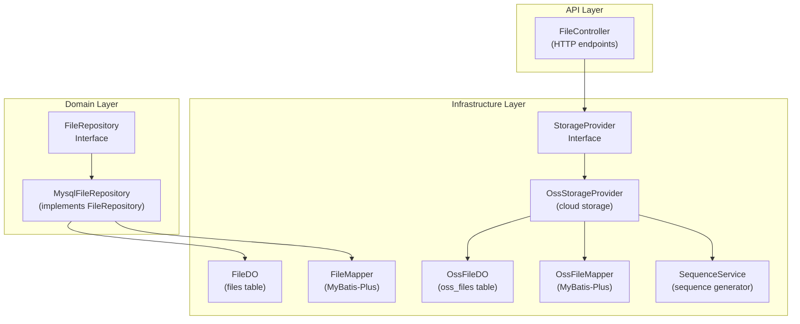

**Diagram sources**
- [FileRepository.java:26-48](file://backend_java/core/src/main/java/com/aliyun/tam/x/tron/core/domain/repository/FileRepository.java#L26-L48)
- [MysqlFileRepository.java:31-58](file://backend_java/core/src/main/java/com/aliyun/tam/x/tron/core/domain/repository/mysql/MysqlFileRepository.java#L31-L58)
- [FileDO.java:30-69](file://backend_java/infra/src/main/java/com/aliyun/tam/x/tron/infra/dal/dataobject/FileDO.java#L30-L69)
- [FileMapper.java:24-29](file://backend_java/infra/src/main/java/com/aliyun/tam/x/tron/infra/dal/mapper/FileMapper.java#L24-L29)
- [OssFileDO.java:29-75](file://backend_java/infra/src/main/java/com/aliyun/tam/x/tron/infra/dal/dataobject/OssFileDO.java#L29-L75)
- [OssFileMapper.java:24-29](file://backend_java/infra/src/main/java/com/aliyun/tam/x/tron/infra/dal/mapper/OssFileMapper.java#L24-L29)
- [StorageProvider.java:25-33](file://backend_java/infra/src/main/java/com/aliyun/tam/x/tron/infra/storage/StorageProvider.java#L25-L33)
- [OssStorageProvider.java:58-134](file://backend_java/infra/src/main/java/com/aliyun/tam/x/tron/infra/storage/OssStorageProvider.java#L58-L134)
- [SequenceService.java:40-177](file://backend_java/infra/src/main/java/com/aliyun/tam/x/tron/infra/sequence/SequenceService.java#L40-L177)
- [FileController.java:41-112](file://backend_java/api/src/main/java/com/aliyun/tam/x/tron/api/FileController.java#L41-L112)

**Section sources**
- [FileRepository.java:26-48](file://backend_java/core/src/main/java/com/aliyun/tam/x/tron/core/domain/repository/FileRepository.java#L26-L48)
- [MysqlFileRepository.java:31-58](file://backend_java/core/src/main/java/com/aliyun/tam/x/tron/core/domain/repository/mysql/MysqlFileRepository.java#L31-L58)
- [FileDO.java:30-69](file://backend_java/infra/src/main/java/com/aliyun/tam/x/tron/infra/dal/dataobject/FileDO.java#L30-L69)
- [FileMapper.java:24-29](file://backend_java/infra/src/main/java/com/aliyun/tam/x/tron/infra/dal/mapper/FileMapper.java#L24-L29)
- [OssFileDO.java:29-75](file://backend_java/infra/src/main/java/com/aliyun/tam/x/tron/infra/dal/dataobject/OssFileDO.java#L29-L75)
- [OssFileMapper.java:24-29](file://backend_java/infra/src/main/java/com/aliyun/tam/x/tron/infra/dal/mapper/OssFileMapper.java#L24-L29)
- [StorageProvider.java:25-33](file://backend_java/infra/src/main/java/com/aliyun/tam/x/tron/infra/storage/StorageProvider.java#L25-L33)
- [OssStorageProvider.java:58-134](file://backend_java/infra/src/main/java/com/aliyun/tam/x/tron/infra/storage/OssStorageProvider.java#L58-L134)
- [SequenceService.java:40-177](file://backend_java/infra/src/main/java/com/aliyun/tam/x/tron/infra/sequence/SequenceService.java#L40-L177)
- [FileController.java:41-112](file://backend_java/api/src/main/java/com/aliyun/tam/x/tron/api/FileController.java#L41-L112)

## Core Components
- FileRepository: Defines the contract for file upload and download, with convenience overloads for streams, files, and paths.
- MysqlFileRepository: Implements FileRepository using FileMapper and FileDO for local storage mode.
- FileDO: MyBatis-Plus mapped entity for the files table, including id, name, size, content stream, and timestamps.
- FileMapper: MyBatis-Plus Mapper interface extending BaseMapper<FileDO>.
- OssFileDO and OssFileMapper: Entities and Mappers for cloud storage metadata in oss_files.
- StorageProvider and OssStorageProvider: Abstraction and implementation for cloud storage with pre-signed URLs and caching.
- SequenceService: Generates globally unique file IDs for cloud storage.
- MybatisPlusConfig: Enables pagination interceptor for MyBatis-Plus.
- Database schema: files and oss_files tables with appropriate indexes.

**Section sources**
- [FileRepository.java:26-48](file://backend_java/core/src/main/java/com/aliyun/tam/x/tron/core/domain/repository/FileRepository.java#L26-L48)
- [MysqlFileRepository.java:31-58](file://backend_java/core/src/main/java/com/aliyun/tam/x/tron/core/domain/repository/mysql/MysqlFileRepository.java#L31-L58)
- [FileDO.java:30-69](file://backend_java/infra/src/main/java/com/aliyun/tam/x/tron/infra/dal/dataobject/FileDO.java#L30-L69)
- [FileMapper.java:24-29](file://backend_java/infra/src/main/java/com/aliyun/tam/x/tron/infra/dal/mapper/FileMapper.java#L24-L29)
- [OssFileDO.java:29-75](file://backend_java/infra/src/main/java/com/aliyun/tam/x/tron/infra/dal/dataobject/OssFileDO.java#L29-L75)
- [OssFileMapper.java:24-29](file://backend_java/infra/src/main/java/com/aliyun/tam/x/tron/infra/dal/mapper/OssFileMapper.java#L24-L29)
- [StorageProvider.java:25-33](file://backend_java/infra/src/main/java/com/aliyun/tam/x/tron/infra/storage/StorageProvider.java#L25-L33)
- [OssStorageProvider.java:58-134](file://backend_java/infra/src/main/java/com/aliyun/tam/x/tron/infra/storage/OssStorageProvider.java#L58-L134)
- [SequenceService.java:40-177](file://backend_java/infra/src/main/java/com/aliyun/tam/x/tron/infra/sequence/SequenceService.java#L40-L177)
- [MybatisPlusConfig.java:27-37](file://backend_java/bootstrap/src/main/java/com/aliyun/tam/x/tron/config/MybatisPlusConfig.java#L27-L37)
- [init.sql:162-205](file://backend_java/bootstrap/src/main/resources/schema/init.sql#L162-L205)

## Architecture Overview
The file repository layer supports two modes:
- Local storage mode: FileRepository uploads/download via FileMapper/FileDO to the files table.
- Cloud storage mode: StorageProvider uploads to OSS and records metadata in oss_files via OssStorageProvider and OssFileMapper.

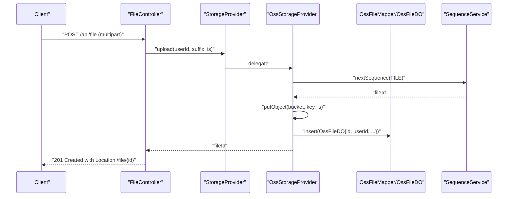

**Diagram sources**
- [FileController.java:51-99](file://backend_java/api/src/main/java/com/aliyun/tam/x/tron/api/FileController.java#L51-L99)
- [StorageProvider.java:25-33](file://backend_java/infra/src/main/java/com/aliyun/tam/x/tron/infra/storage/StorageProvider.java#L25-L33)
- [OssStorageProvider.java:90-109](file://backend_java/infra/src/main/java/com/aliyun/tam/x/tron/infra/storage/OssStorageProvider.java#L90-L109)
- [OssFileMapper.java:24-29](file://backend_java/infra/src/main/java/com/aliyun/tam/x/tron/infra/dal/mapper/OssFileMapper.java#L24-L29)
- [OssFileDO.java:29-75](file://backend_java/infra/src/main/java/com/aliyun/tam/x/tron/infra/dal/dataobject/OssFileDO.java#L29-L75)
- [SequenceService.java:130-132](file://backend_java/infra/src/main/java/com/aliyun/tam/x/tron/infra/sequence/SequenceService.java#L130-L132)

## Detailed Component Analysis

### FileRepository Interface
- Purpose: Abstracts file upload and download operations with InputStream/Path overloads.
- Methods:
  - upload(fileName, inputStream, size)
  - upload(fileName, path)
  - download(id) returning InputStream
  - download(id, outputStream) and download(id, path) defaults

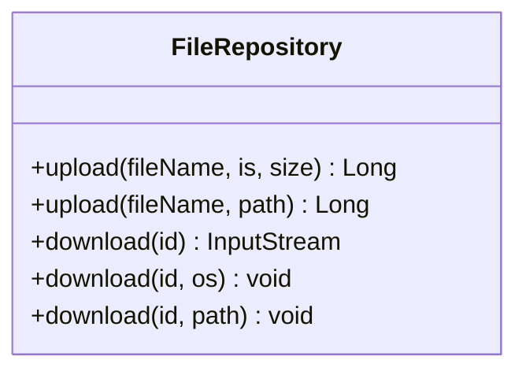

**Diagram sources**
- [FileRepository.java:26-48](file://backend_java/core/src/main/java/com/aliyun/tam/x/tron/core/domain/repository/FileRepository.java#L26-L48)

**Section sources**
- [FileRepository.java:26-48](file://backend_java/core/src/main/java/com/aliyun/tam/x/tron/core/domain/repository/FileRepository.java#L26-L48)

### MysqlFileRepository Implementation
- Responsibilities:
  - Upload: builds FileDO with name, content stream, size, timestamps, inserts via FileMapper, returns generated id.
  - Download: selects by id, throws FileNotFoundException if not found, returns content stream.
- Notes:
  - Uses LocalDateTime.now() for timestamps.
  - Does not expose update or delete operations in this implementation.

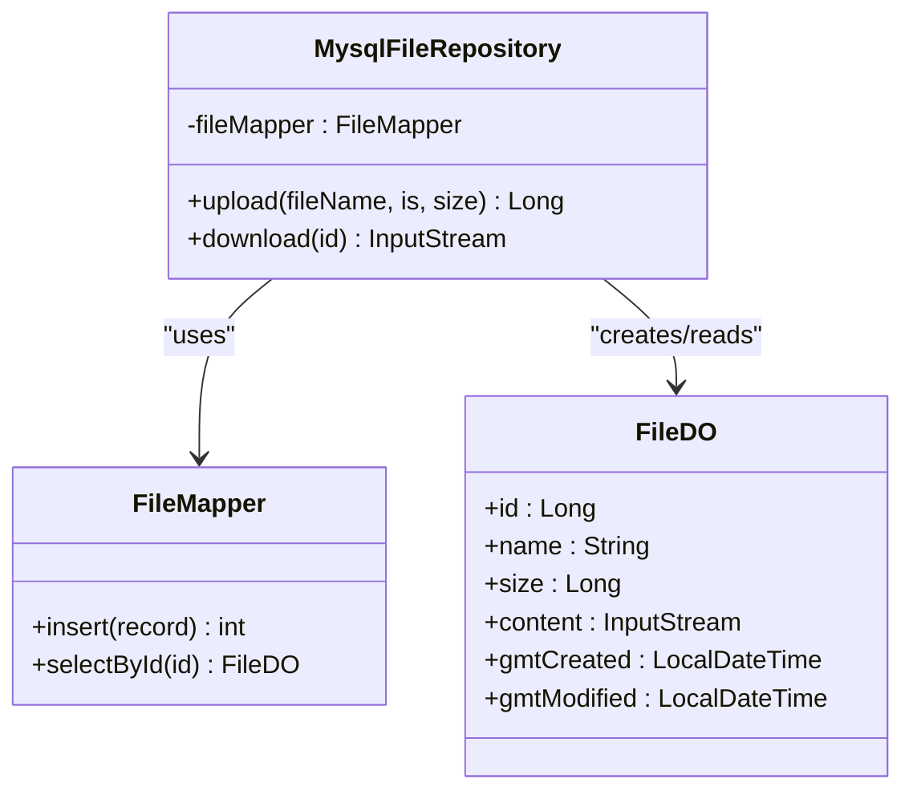

**Diagram sources**
- [MysqlFileRepository.java:31-58](file://backend_java/core/src/main/java/com/aliyun/tam/x/tron/core/domain/repository/mysql/MysqlFileRepository.java#L31-L58)
- [FileMapper.java:24-29](file://backend_java/infra/src/main/java/com/aliyun/tam/x/tron/infra/dal/mapper/FileMapper.java#L24-L29)
- [FileDO.java:30-69](file://backend_java/infra/src/main/java/com/aliyun/tam/x/tron/infra/dal/dataobject/FileDO.java#L30-L69)

**Section sources**
- [MysqlFileRepository.java:31-58](file://backend_java/core/src/main/java/com/aliyun/tam/x/tron/core/domain/repository/mysql/MysqlFileRepository.java#L31-L58)
- [FileMapper.java:24-29](file://backend_java/infra/src/main/java/com/aliyun/tam/x/tron/infra/dal/mapper/FileMapper.java#L24-L29)
- [FileDO.java:30-69](file://backend_java/infra/src/main/java/com/aliyun/tam/x/tron/infra/dal/dataobject/FileDO.java#L30-L69)

### FileDO Data Object
- Fields:
  - id: auto-increment primary key
  - name: file name
  - content: InputStream for stored content
  - size: file size in bytes
  - gmt_created/gmt_modified: timestamps managed by MyBatis-Plus field fillers

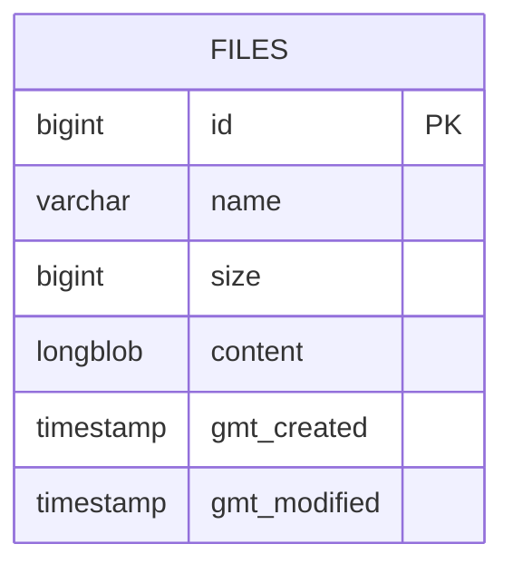

**Diagram sources**
- [FileDO.java:30-69](file://backend_java/infra/src/main/java/com/aliyun/tam/x/tron/infra/dal/dataobject/FileDO.java#L30-L69)
- [init.sql:162-174](file://backend_java/bootstrap/src/main/resources/schema/init.sql#L162-L174)

**Section sources**
- [FileDO.java:30-69](file://backend_java/infra/src/main/java/com/aliyun/tam/x/tron/infra/dal/dataobject/FileDO.java#L30-L69)
- [init.sql:162-174](file://backend_java/bootstrap/src/main/resources/schema/init.sql#L162-L174)

### FileMapper Interface and SQL Patterns
- Extends MyBatis-Plus BaseMapper<FileDO>, inheriting common CRUD operations.
- Generated SQL patterns:
  - Insert: INSERT INTO files (name, size, content, gmt_created, gmt_modified)
  - Select by id: SELECT * FROM files WHERE id = ?
- Pagination: Enabled via MybatisPlusConfig with PaginationInnerInterceptor.

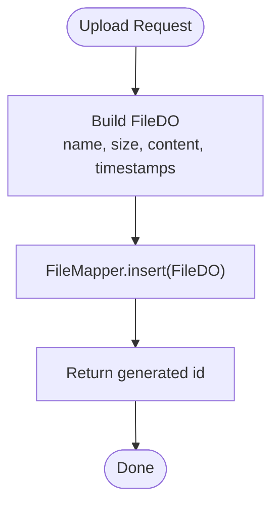

**Diagram sources**
- [MysqlFileRepository.java:37-48](file://backend_java/core/src/main/java/com/aliyun/tam/x/tron/core/domain/repository/mysql/MysqlFileRepository.java#L37-L48)
- [FileMapper.java:24-29](file://backend_java/infra/src/main/java/com/aliyun/tam/x/tron/infra/dal/mapper/FileMapper.java#L24-L29)
- [MybatisPlusConfig.java:31-36](file://backend_java/bootstrap/src/main/java/com/aliyun/tam/x/tron/config/MybatisPlusConfig.java#L31-L36)

**Section sources**
- [FileMapper.java:24-29](file://backend_java/infra/src/main/java/com/aliyun/tam/x/tron/infra/dal/mapper/FileMapper.java#L24-L29)
- [MybatisPlusConfig.java:31-36](file://backend_java/bootstrap/src/main/java/com/aliyun/tam/x/tron/config/MybatisPlusConfig.java#L31-L36)

### Cloud Storage Mode: StorageProvider and OssStorageProvider
- StorageProvider defines:
  - upload(userId, suffix, is) -> fileId
  - get(userId, id) -> ResponseEntity (redirect to pre-signed URL)
- OssStorageProvider:
  - Generates fileId via SequenceService
  - Puts object into OSS bucket with key pattern tron/{userId}/{fileId}.{suffix}
  - Inserts OssFileDO with id, user_id, region, bucket, file_key
  - Returns pre-signed GET URL via GeneratePresignedUrlRequest
  - Caches pre-signed URLs for 60 minutes

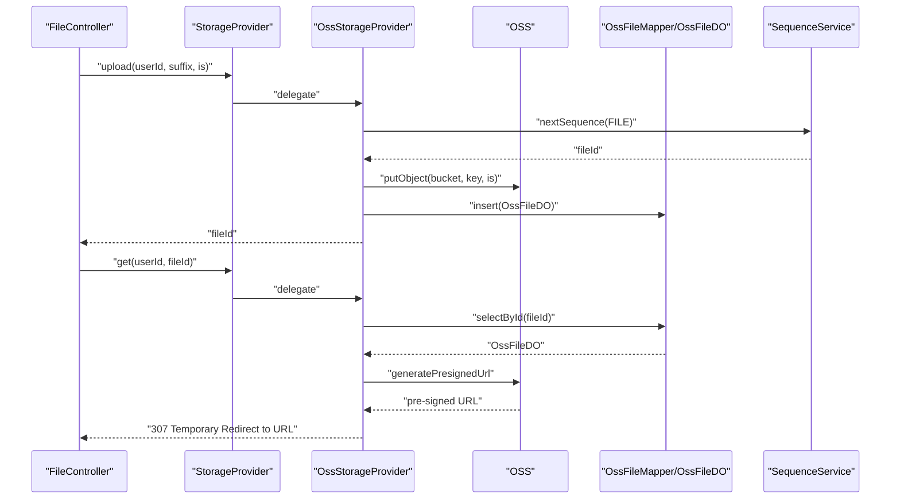

**Diagram sources**
- [StorageProvider.java:25-33](file://backend_java/infra/src/main/java/com/aliyun/tam/x/tron/infra/storage/StorageProvider.java#L25-L33)
- [OssStorageProvider.java:90-134](file://backend_java/infra/src/main/java/com/aliyun/tam/x/tron/infra/storage/OssStorageProvider.java#L90-L134)
- [OssFileMapper.java:24-29](file://backend_java/infra/src/main/java/com/aliyun/tam/x/tron/infra/dal/mapper/OssFileMapper.java#L24-L29)
- [OssFileDO.java:29-75](file://backend_java/infra/src/main/java/com/aliyun/tam/x/tron/infra/dal/dataobject/OssFileDO.java#L29-L75)
- [SequenceService.java:130-132](file://backend_java/infra/src/main/java/com/aliyun/tam/x/tron/infra/sequence/SequenceService.java#L130-L132)

**Section sources**
- [StorageProvider.java:25-33](file://backend_java/infra/src/main/java/com/aliyun/tam/x/tron/infra/storage/StorageProvider.java#L25-L33)
- [OssStorageProvider.java:58-134](file://backend_java/infra/src/main/java/com/aliyun/tam/x/tron/infra/storage/OssStorageProvider.java#L58-L134)
- [OssFileDO.java:29-75](file://backend_java/infra/src/main/java/com/aliyun/tam/x/tron/infra/dal/dataobject/OssFileDO.java#L29-L75)
- [OssFileMapper.java:24-29](file://backend_java/infra/src/main/java/com/aliyun/tam/x/tron/infra/dal/mapper/OssFileMapper.java#L24-L29)
- [SequenceService.java:130-132](file://backend_java/infra/src/main/java/com/aliyun/tam/x/tron/infra/sequence/SequenceService.java#L130-L132)

### SequenceService for Unique File IDs
- Provides globally unique file IDs for cloud storage.
- Allocates sequence segments transactionally with FOR UPDATE.
- Formats IDs combining timestamp and counter portion.

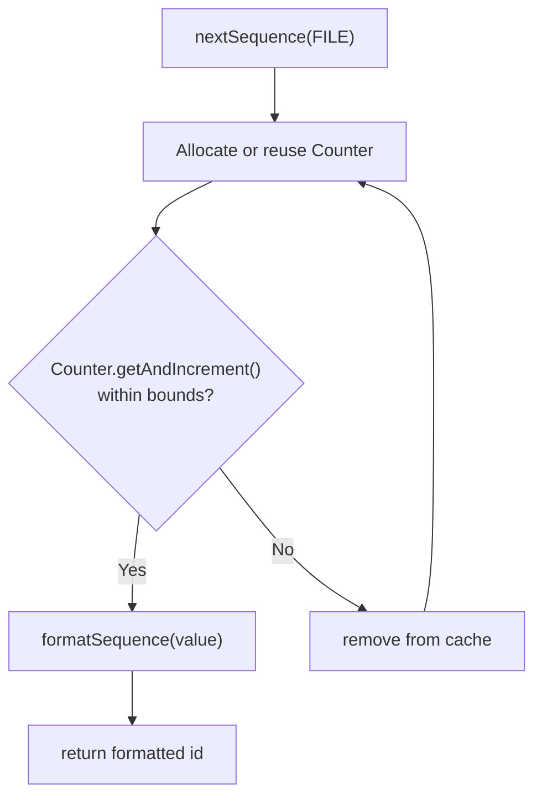

**Diagram sources**
- [SequenceService.java:104-132](file://backend_java/infra/src/main/java/com/aliyun/tam/x/tron/infra/sequence/SequenceService.java#L104-L132)
- [SequenceService.java:141-163](file://backend_java/infra/src/main/java/com/aliyun/tam/x/tron/infra/sequence/SequenceService.java#L141-L163)
- [SequenceService.java:172-176](file://backend_java/infra/src/main/java/com/aliyun/tam/x/tron/infra/sequence/SequenceService.java#L172-L176)

**Section sources**
- [SequenceService.java:40-177](file://backend_java/infra/src/main/java/com/aliyun/tam/x/tron/infra/sequence/SequenceService.java#L40-L177)

### File Lifecycle Management
- Creation:
  - Local mode: upload writes FileDO and returns id.
  - Cloud mode: upload stores content in OSS and inserts OssFileDO.
- Metadata updates:
  - FileDO supports gmt_created/gmt_modified updates via MyBatis-Plus field fillers.
  - OssFileDO similarly tracks timestamps.
- Cleanup:
  - No explicit delete/update methods in MysqlFileRepository.
  - Cloud mode relies on external retention policies for OSS objects.

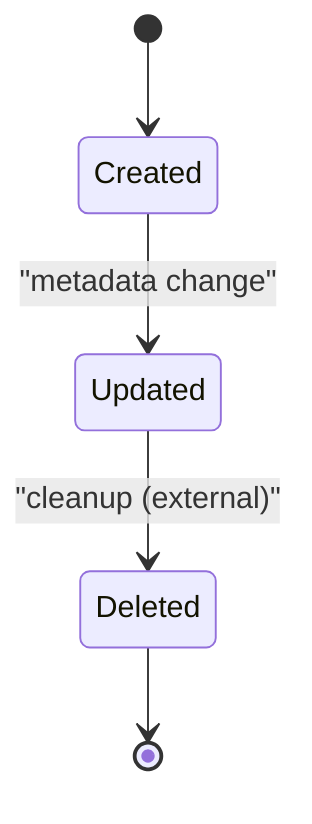

**Diagram sources**
- [FileDO.java:61-68](file://backend_java/infra/src/main/java/com/aliyun/tam/x/tron/infra/dal/dataobject/FileDO.java#L61-L68)
- [OssFileDO.java:67-74](file://backend_java/infra/src/main/java/com/aliyun/tam/x/tron/infra/dal/dataobject/OssFileDO.java#L67-L74)

**Section sources**
- [MysqlFileRepository.java:37-57](file://backend_java/core/src/main/java/com/aliyun/tam/x/tron/core/domain/repository/mysql/MysqlFileRepository.java#L37-L57)
- [FileDO.java:61-68](file://backend_java/infra/src/main/java/com/aliyun/tam/x/tron/infra/dal/dataobject/FileDO.java#L61-L68)
- [OssFileDO.java:67-74](file://backend_java/infra/src/main/java/com/aliyun/tam/x/tron/infra/dal/dataobject/OssFileDO.java#L67-L74)

### File Search Operations, Pagination, and Bulk Operations
- Search:
  - Local files: name is indexed; queries can filter by name prefix/suffix using LIKE patterns.
  - Cloud files: userId indexed; queries can filter by user_id.
- Pagination:
  - Enabled via MybatisPlusInterceptor with PaginationInnerInterceptor(MYSQL).
  - Apply Page<T> wrapper around queries to limit results.
- Bulk operations:
  - MyBatis-Plus supports batch insert/update/delete via BaseMapper methods.
  - Example usage shown in other repositories for batch inserts.

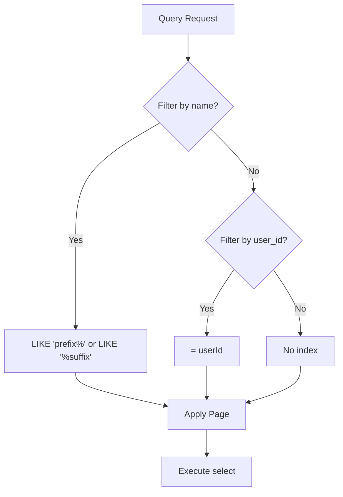

**Diagram sources**
- [init.sql:172-173](file://backend_java/bootstrap/src/main/resources/schema/init.sql#L172-L173)
- [init.sql:202-203](file://backend_java/bootstrap/src/main/resources/schema/init.sql#L202-L203)
- [MybatisPlusConfig.java:31-36](file://backend_java/bootstrap/src/main/java/com/aliyun/tam/x/tron/config/MybatisPlusConfig.java#L31-L36)

**Section sources**
- [init.sql:172-173](file://backend_java/bootstrap/src/main/resources/schema/init.sql#L172-L173)
- [init.sql:202-203](file://backend_java/bootstrap/src/main/resources/schema/init.sql#L202-L203)
- [MybatisPlusConfig.java:31-36](file://backend_java/bootstrap/src/main/java/com/aliyun/tam/x/tron/config/MybatisPlusConfig.java#L31-L36)

### Database Schema Design and Indexing Strategies
- files table:
  - Columns: id, name, size, content, gmt_created, gmt_modified
  - Index: idx_name(name(512)) to accelerate name-based queries
- oss_files table:
  - Columns: id, user_id, oss_region, oss_bucket, oss_file_key, gmt_created, gmt_modified
  - Index: idx_user(user_id) for user-scoped lookups
  - Unique: uk_oss_bucket_file_key(region, bucket, file_key(256)) to prevent duplicates

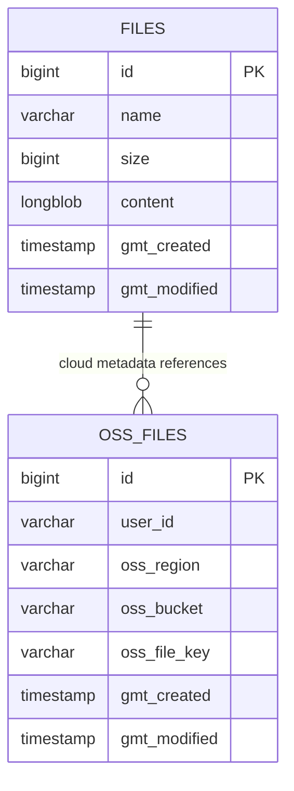

**Diagram sources**
- [init.sql:162-174](file://backend_java/bootstrap/src/main/resources/schema/init.sql#L162-L174)
- [init.sql:191-205](file://backend_java/bootstrap/src/main/resources/schema/init.sql#L191-L205)

**Section sources**
- [init.sql:162-174](file://backend_java/bootstrap/src/main/resources/schema/init.sql#L162-L174)
- [init.sql:191-205](file://backend_java/bootstrap/src/main/resources/schema/init.sql#L191-L205)

### Transaction Management and Consistency Guarantees
- Local mode:
  - MysqlFileRepository.upload performs a single insert; no explicit transaction boundary is declared in the method.
  - If used within a Spring-managed service with @Transactional, the insert participates in that transaction.
- Cloud mode:
  - OssStorageProvider.upload stores content in OSS and inserts OssFileDO in a single logical operation.
  - SequenceService.allocateSequence is transactional with FOR UPDATE to guarantee uniqueness.
  - Consistency: If OSS putObject succeeds but metadata insert fails, the file remains unreferenced in oss_files; clients should handle retries accordingly.

**Section sources**
- [MysqlFileRepository.java:37-48](file://backend_java/core/src/main/java/com/aliyun/tam/x/tron/core/domain/repository/mysql/MysqlFileRepository.java#L37-L48)
- [OssStorageProvider.java:90-109](file://backend_java/infra/src/main/java/com/aliyun/tam/x/tron/infra/storage/OssStorageProvider.java#L90-L109)
- [SequenceService.java:141-163](file://backend_java/infra/src/main/java/com/aliyun/tam/x/tron/infra/sequence/SequenceService.java#L141-L163)

## Dependency Analysis
- FileRepository depends on FileMapper and FileDO for local storage.
- MysqlFileRepository composes FileMapper and constructs FileDO.
- OssStorageProvider composes OssFileMapper, SequenceService, and OSS client.
- MybatisPlusConfig enables pagination for all mappers under the configured package.
- FileController delegates upload/get to StorageProvider, enabling cloud storage mode.

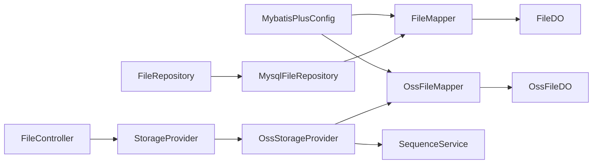

**Diagram sources**
- [FileRepository.java:26-48](file://backend_java/core/src/main/java/com/aliyun/tam/x/tron/core/domain/repository/FileRepository.java#L26-L48)
- [MysqlFileRepository.java:31-58](file://backend_java/core/src/main/java/com/aliyun/tam/x/tron/core/domain/repository/mysql/MysqlFileRepository.java#L31-L58)
- [FileMapper.java:24-29](file://backend_java/infra/src/main/java/com/aliyun/tam/x/tron/infra/dal/mapper/FileMapper.java#L24-L29)
- [FileDO.java:30-69](file://backend_java/infra/src/main/java/com/aliyun/tam/x/tron/infra/dal/dataobject/FileDO.java#L30-L69)
- [StorageProvider.java:25-33](file://backend_java/infra/src/main/java/com/aliyun/tam/x/tron/infra/storage/StorageProvider.java#L25-L33)
- [OssStorageProvider.java:58-134](file://backend_java/infra/src/main/java/com/aliyun/tam/x/tron/infra/storage/OssStorageProvider.java#L58-L134)
- [OssFileMapper.java:24-29](file://backend_java/infra/src/main/java/com/aliyun/tam/x/tron/infra/dal/mapper/OssFileMapper.java#L24-L29)
- [OssFileDO.java:29-75](file://backend_java/infra/src/main/java/com/aliyun/tam/x/tron/infra/dal/dataobject/OssFileDO.java#L29-L75)
- [SequenceService.java:141-163](file://backend_java/infra/src/main/java/com/aliyun/tam/x/tron/infra/sequence/SequenceService.java#L141-L163)
- [MybatisPlusConfig.java:27-37](file://backend_java/bootstrap/src/main/java/com/aliyun/tam/x/tron/config/MybatisPlusConfig.java#L27-L37)
- [FileController.java:41-112](file://backend_java/api/src/main/java/com/aliyun/tam/x/tron/api/FileController.java#L41-L112)

**Section sources**
- [FileRepository.java:26-48](file://backend_java/core/src/main/java/com/aliyun/tam/x/tron/core/domain/repository/FileRepository.java#L26-L48)
- [MysqlFileRepository.java:31-58](file://backend_java/core/src/main/java/com/aliyun/tam/x/tron/core/domain/repository/mysql/MysqlFileRepository.java#L31-L58)
- [FileMapper.java:24-29](file://backend_java/infra/src/main/java/com/aliyun/tam/x/tron/infra/dal/mapper/FileMapper.java#L24-L29)
- [FileDO.java:30-69](file://backend_java/infra/src/main/java/com/aliyun/tam/x/tron/infra/dal/dataobject/FileDO.java#L30-L69)
- [StorageProvider.java:25-33](file://backend_java/infra/src/main/java/com/aliyun/tam/x/tron/infra/storage/StorageProvider.java#L25-L33)
- [OssStorageProvider.java:58-134](file://backend_java/infra/src/main/java/com/aliyun/tam/x/tron/infra/storage/OssStorageProvider.java#L58-L134)
- [OssFileMapper.java:24-29](file://backend_java/infra/src/main/java/com/aliyun/tam/x/tron/infra/dal/mapper/OssFileMapper.java#L24-L29)
- [OssFileDO.java:29-75](file://backend_java/infra/src/main/java/com/aliyun/tam/x/tron/infra/dal/dataobject/OssFileDO.java#L29-L75)
- [SequenceService.java:141-163](file://backend_java/infra/src/main/java/com/aliyun/tam/x/tron/infra/sequence/SequenceService.java#L141-L163)
- [MybatisPlusConfig.java:27-37](file://backend_java/bootstrap/src/main/java/com/aliyun/tam/x/tron/config/MybatisPlusConfig.java#L27-L37)
- [FileController.java:41-112](file://backend_java/api/src/main/java/com/aliyun/tam/x/tron/api/FileController.java#L41-L112)

## Performance Considerations
- Local storage:
  - files.content is LONGBLOB; avoid streaming large files when unnecessary.
  - Prefer cloud storage for large files to reduce DB load.
- Cloud storage:
  - Pre-signed URL caching reduces repeated signature generation overhead.
  - SequenceService caches counters per sequence name to minimize DB round-trips.
- Indexing:
  - files.idx_name(name(512)) accelerates name filtering.
  - oss_files.idx_user(user_id) accelerates user-scoped queries.
  - oss_files.uk_oss_bucket_file_key ensures referential integrity and fast deduplication.
- Pagination:
  - Enable Page<T> wrappers for list/search endpoints to bound memory and network usage.
- Concurrency:
  - Sequence allocation uses FOR UPDATE to serialize access and maintain uniqueness.

[No sources needed since this section provides general guidance]

## Troubleshooting Guide
- File not found:
  - Local download returns FileNotFoundException when FileDO is null.
  - Cloud get returns 404 Not Found when OssFileDO is null.
- Access denied:
  - Cloud get returns 403 Forbidden if userId does not match record.
- Invalid file id:
  - Cloud get handles invalid IDs with internal server error responses.
- Large file uploads:
  - Verify multipart limits in application.yaml and controller validations.
- Pre-signed URL expiration:
  - Public URL cache expires after 60 minutes; clients should refresh as needed.

**Section sources**
- [MysqlFileRepository.java:50-57](file://backend_java/core/src/main/java/com/aliyun/tam/x/tron/core/domain/repository/mysql/MysqlFileRepository.java#L50-L57)
- [OssStorageProvider.java:111-134](file://backend_java/infra/src/main/java/com/aliyun/tam/x/tron/infra/storage/OssStorageProvider.java#L111-L134)
- [application.yaml:18-22](file://backend_java/bootstrap/src/main/resources/application.yaml#L18-L22)

## Conclusion
The file repository layer cleanly separates concerns between domain abstractions and infrastructure persistence. For local deployments, FileRepository and FileMapper provide straightforward CRUD over files. For cloud deployments, StorageProvider and OssStorageProvider integrate with OSS while maintaining strong consistency via SequenceService and MyBatis-Plus. Proper indexing, pagination, and caching deliver scalable performance, while clear error handling and access controls ensure robust operation.