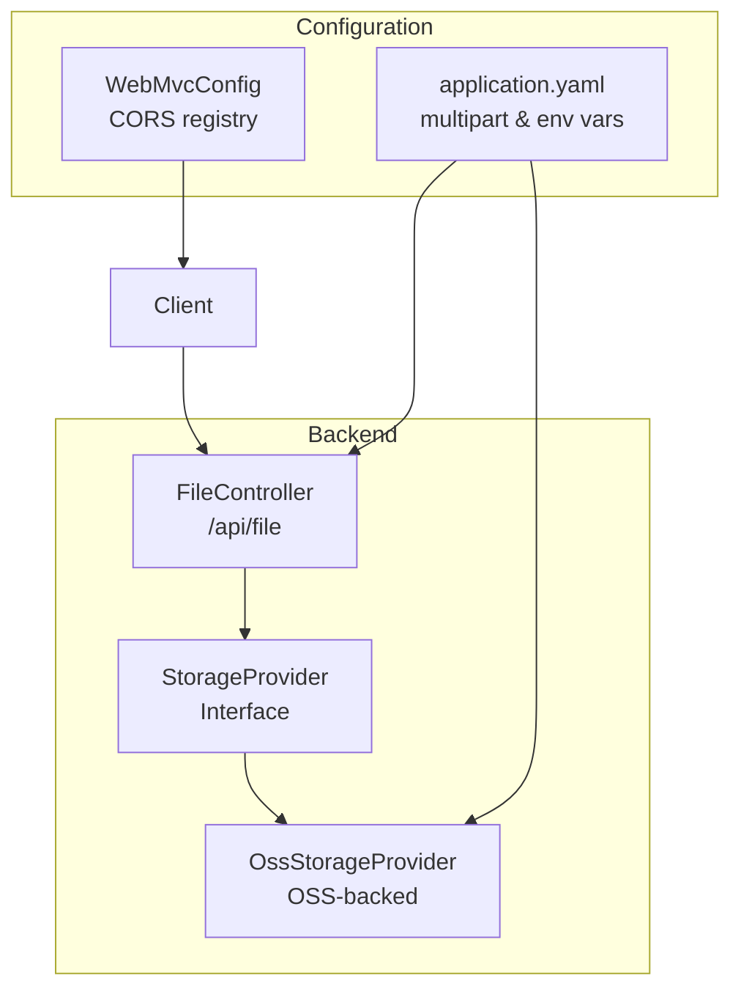
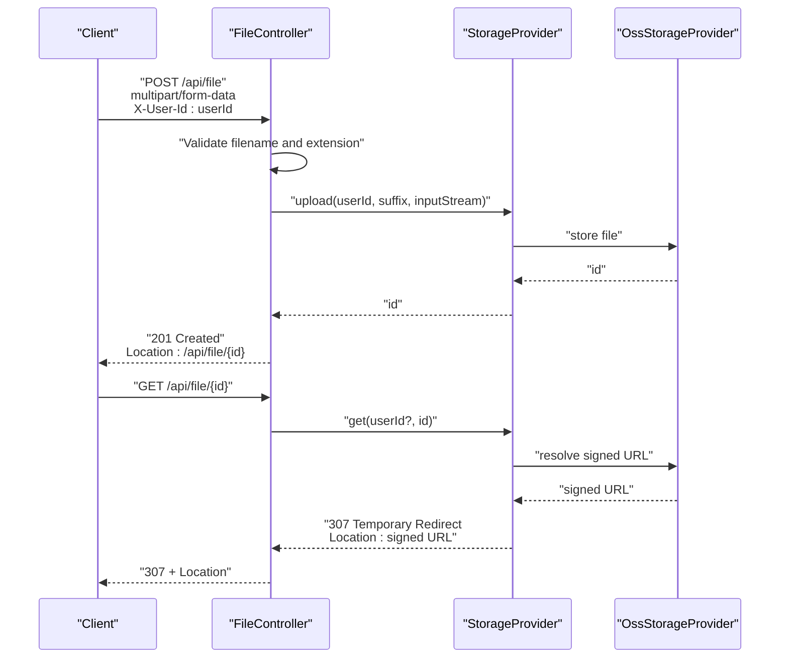
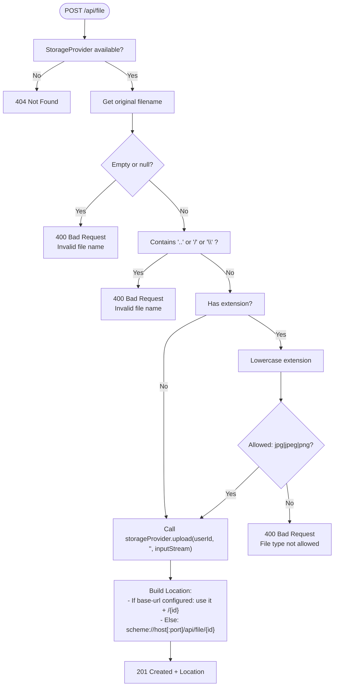
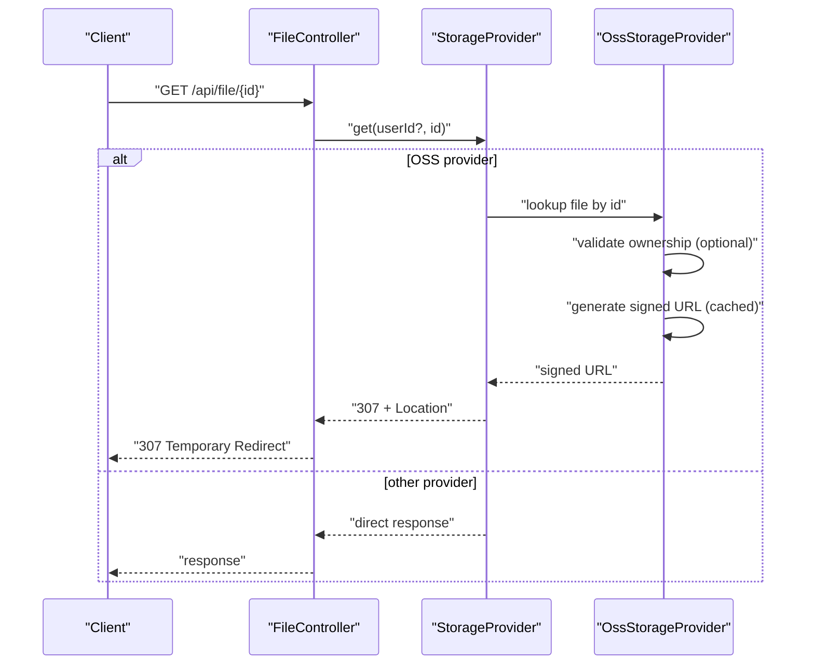
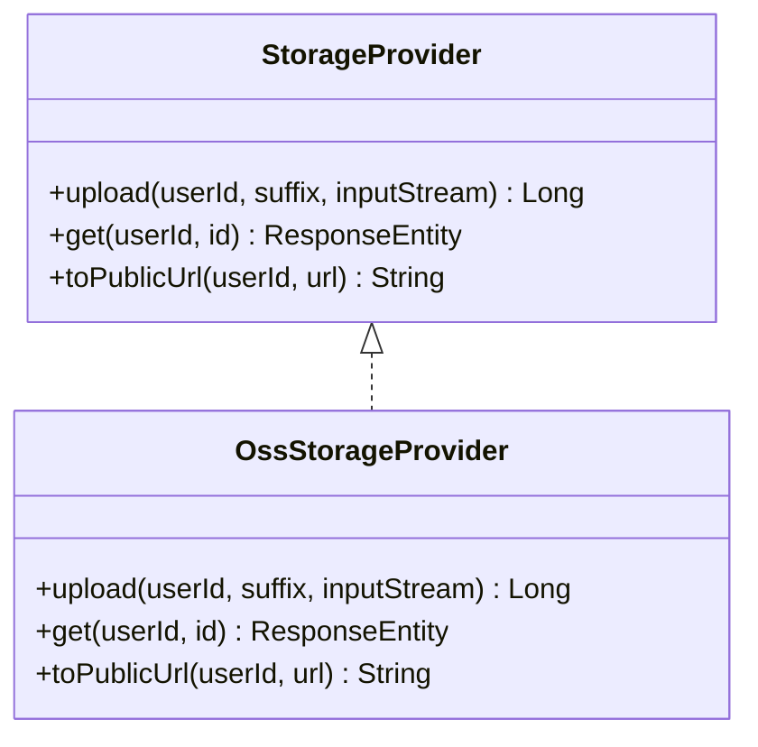
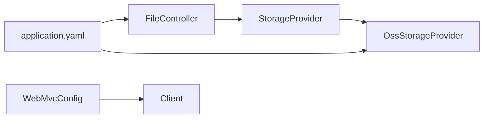

# File Upload API

<cite>
**Referenced Files in This Document**
- [FileController.java](file://backend_java/api/src/main/java/com/aliyun/tam/x/tron/api/FileController.java)
- [StorageProvider.java](file://backend_java/infra/src/main/java/com/aliyun/tam/x/tron/infra/storage/StorageProvider.java)
- [OssStorageProvider.java](file://backend_java/infra/src/main/java/com/aliyun/tam/x/tron/infra/storage/OssStorageProvider.java)
- [application.yaml](file://backend_java/bootstrap/src/main/resources/application.yaml)
- [WebMvcConfig.java](file://backend_java/bootstrap/src/main/java/com/aliyun/tam/x/tron/config/WebMvcConfig.java)
- [develop_guide.md](file://docs/en/develop_guide.md)
</cite>

## Table of Contents
1. [Introduction](#introduction)
2. [Project Structure](#project-structure)
3. [Core Components](#core-components)
4. [Architecture Overview](#architecture-overview)
5. [Detailed Component Analysis](#detailed-component-analysis)
6. [Dependency Analysis](#dependency-analysis)
7. [Performance Considerations](#performance-considerations)
8. [Troubleshooting Guide](#troubleshooting-guide)
9. [Conclusion](#conclusion)
10. [Appendices](#appendices)

## Introduction
This document provides comprehensive API documentation for the file upload and retrieval endpoints exposed by FileController. It covers:
- The multipart/form-data upload endpoint for images (jpg, jpeg, png)
- The GET endpoint for retrieving uploaded files
- Request headers, form parameters, validation rules, and security measures
- Response schemas, HTTP status codes, and error scenarios
- Practical client-side examples using JavaScript fetch API, XMLHttpRequest, and HTML forms
- Authentication requirements, CORS configuration, rate limiting considerations, file size limits, upload progress tracking, and handling concurrent uploads

## Project Structure
The file upload and retrieval functionality is implemented in the Spring Boot backend:
- FileController exposes the endpoints under /api/file
- StorageProvider abstracts storage implementations (OSS and local)
- Application configuration defines multipart limits and CORS policy
- The OSS provider integrates with Alibaba Cloud OSS for production deployments

**Diagram sources**
- [FileController.java:37-112](file://backend_java/api/src/main/java/com/aliyun/tam/x/tron/api/FileController.java#L37-L112)
- [StorageProvider.java:25-33](file://backend_java/infra/src/main/java/com/aliyun/tam/x/tron/infra/storage/StorageProvider.java#L25-L33)
- [OssStorageProvider.java:53-134](file://backend_java/infra/src/main/java/com/aliyun/tam/x/tron/infra/storage/OssStorageProvider.java#L53-L134)
- [application.yaml:18-21](file://backend_java/bootstrap/src/main/resources/application.yaml#L18-L21)
- [WebMvcConfig.java:80-88](file://backend_java/bootstrap/src/main/java/com/aliyun/tam/x/tron/config/WebMvcConfig.java#L80-L88)

**Section sources**
- [FileController.java:37-112](file://backend_java/api/src/main/java/com/aliyun/tam/x/tron/api/FileController.java#L37-L112)
- [application.yaml:18-21](file://backend_java/bootstrap/src/main/resources/application.yaml#L18-L21)
- [WebMvcConfig.java:80-88](file://backend_java/bootstrap/src/main/java/com/aliyun/tam/x/tron/config/WebMvcConfig.java#L80-L88)

## Core Components
- FileController
  - Upload endpoint: POST /api/file with multipart/form-data
  - Retrieve endpoint: GET /api/file/{id}
  - Validates filename, disallows path traversal, restricts file types to jpg, jpeg, png
  - Returns resource location via Location header or configured base URL
- StorageProvider
  - Interface defining upload(userId, suffix, inputStream) and get(userId, id)
  - OSS implementation generates signed URLs for secure retrieval
- Configuration
  - application.yaml sets multipart limits and environment-driven OSS configuration
  - WebMvcConfig enables CORS globally

**Section sources**
- [FileController.java:51-111](file://backend_java/api/src/main/java/com/aliyun/tam/x/tron/api/FileController.java#L51-L111)
- [StorageProvider.java:25-33](file://backend_java/infra/src/main/java/com/aliyun/tam/x/tron/infra/storage/StorageProvider.java#L25-L33)
- [application.yaml:18-21](file://backend_java/bootstrap/src/main/resources/application.yaml#L18-L21)
- [WebMvcConfig.java:80-88](file://backend_java/bootstrap/src/main/java/com/aliyun/tam/x/tron/config/WebMvcConfig.java#L80-L88)

## Architecture Overview
The upload flow validates the file locally and delegates persistence to the configured StorageProvider. Retrieval routes through StorageProvider to produce a redirect to a signed URL or direct response depending on the implementation.

**Diagram sources**
- [FileController.java:51-111](file://backend_java/api/src/main/java/com/aliyun/tam/x/tron/api/FileController.java#L51-L111)
- [StorageProvider.java:25-33](file://backend_java/infra/src/main/java/com/aliyun/tam/x/tron/infra/storage/StorageProvider.java#L25-L33)
- [OssStorageProvider.java:90-134](file://backend_java/infra/src/main/java/com/aliyun/tam/x/tron/infra/storage/OssStorageProvider.java#L90-L134)

## Detailed Component Analysis

### Upload Endpoint: POST /api/file
- Method: POST
- Consumes: multipart/form-data
- Path: /api/file
- Required request headers:
  - X-User-Id: string representing the user identifier
- Form parameters:
  - file: binary stream (MultipartFile)
- Validation rules:
  - Filename must be present and non-empty
  - Filename must not contain path traversal sequences (.., /, \)
  - Allowed extensions: jpg, jpeg, png (case-insensitive)
- Response:
  - 201 Created with Location header pointing to /api/file/{id}
  - If tron.file.server.base-url is configured, Location uses that base URL plus /{id}
  - On errors:
    - 400 Bad Request: invalid filename or disallowed file type
    - 404 Not Found: storage provider not available
- Security measures:
  - Rejects filenames with "..", "/", or "\" to prevent path traversal
  - Enforces strict extension whitelist

**Diagram sources**
- [FileController.java:51-100](file://backend_java/api/src/main/java/com/aliyun/tam/x/tron/api/FileController.java#L51-L100)

**Section sources**
- [FileController.java:51-100](file://backend_java/api/src/main/java/com/aliyun/tam/x/tron/api/FileController.java#L51-L100)

### Retrieve Endpoint: GET /api/file/{id}
- Method: GET
- Path: /api/file/{id}
- Path variable:
  - id: numeric identifier returned by upload
- Behavior:
  - Delegates to StorageProvider.get(userId?, id)
  - OSS provider:
    - Returns 307 Temporary Redirect with Location pointing to a signed URL
    - Enforces ownership by userId when provided
    - Caches signed URLs for performance
- Response:
  - 200 OK or 307 Temporary Redirect (with Location)
  - 404 Not Found: file not found
  - 403 Forbidden: unauthorized access (when userId mismatch)
  - 500 Internal Server Error: unexpected failure

**Diagram sources**
- [FileController.java:102-111](file://backend_java/api/src/main/java/com/aliyun/tam/x/tron/api/FileController.java#L102-L111)
- [StorageProvider.java:25-33](file://backend_java/infra/src/main/java/com/aliyun/tam/x/tron/infra/storage/StorageProvider.java#L25-L33)
- [OssStorageProvider.java:111-134](file://backend_java/infra/src/main/java/com/aliyun/tam/x/tron/infra/storage/OssStorageProvider.java#L111-L134)

**Section sources**
- [FileController.java:102-111](file://backend_java/api/src/main/java/com/aliyun/tam/x/tron/api/FileController.java#L102-L111)
- [OssStorageProvider.java:111-134](file://backend_java/infra/src/main/java/com/aliyun/tam/x/tron/infra/storage/OssStorageProvider.java#L111-L134)

### Storage Provider Interface and OSS Implementation
- StorageProvider
  - upload(userId, suffix, inputStream): returns numeric id
  - get(userId, id): returns ResponseEntity (implementation-specific)
  - toPublicUrl(userId, url): optional conversion for public URLs
- OssStorageProvider
  - Generates unique keys per user and id
  - Stores metadata in OSS and records mapping
  - Produces pre-signed URLs with expiration
  - Caches signed URLs for performance

**Diagram sources**
- [StorageProvider.java:25-33](file://backend_java/infra/src/main/java/com/aliyun/tam/x/tron/infra/storage/StorageProvider.java#L25-L33)
- [OssStorageProvider.java:53-134](file://backend_java/infra/src/main/java/com/aliyun/tam/x/tron/infra/storage/OssStorageProvider.java#L53-L134)

**Section sources**
- [StorageProvider.java:25-33](file://backend_java/infra/src/main/java/com/aliyun/tam/x/tron/infra/storage/StorageProvider.java#L25-L33)
- [OssStorageProvider.java:90-134](file://backend_java/infra/src/main/java/com/aliyun/tam/x/tron/infra/storage/OssStorageProvider.java#L90-L134)

## Dependency Analysis
- FileController depends on StorageProvider
- OssStorageProvider depends on OSS client, mapper, and sequence service
- Configuration influences multipart limits and OSS connectivity
- CORS is globally enabled for development

**Diagram sources**
- [FileController.java:37-112](file://backend_java/api/src/main/java/com/aliyun/tam/x/tron/api/FileController.java#L37-L112)
- [StorageProvider.java:25-33](file://backend_java/infra/src/main/java/com/aliyun/tam/x/tron/infra/storage/StorageProvider.java#L25-L33)
- [OssStorageProvider.java:53-134](file://backend_java/infra/src/main/java/com/aliyun/tam/x/tron/infra/storage/OssStorageProvider.java#L53-L134)
- [application.yaml:18-21](file://backend_java/bootstrap/src/main/resources/application.yaml#L18-L21)
- [WebMvcConfig.java:80-88](file://backend_java/bootstrap/src/main/java/com/aliyun/tam/x/tron/config/WebMvcConfig.java#L80-L88)

**Section sources**
- [FileController.java:37-112](file://backend_java/api/src/main/java/com/aliyun/tam/x/tron/api/FileController.java#L37-L112)
- [OssStorageProvider.java:53-134](file://backend_java/infra/src/main/java/com/aliyun/tam/x/tron/infra/storage/OssStorageProvider.java#L53-L134)
- [application.yaml:18-21](file://backend_java/bootstrap/src/main/resources/application.yaml#L18-L21)
- [WebMvcConfig.java:80-88](file://backend_java/bootstrap/src/main/java/com/aliyun/tam/x/tron/config/WebMvcConfig.java#L80-L88)

## Performance Considerations
- Signed URL caching: OssStorageProvider caches signed URLs for up to 60 minutes to reduce repeated signing overhead
- Concurrency: The OSS client is configured with connection and socket timeouts suitable for large uploads
- File size limits: Set via multipart.max-file-size and multipart.max-request-size in application.yaml
- Frontend guidance: The project’s frontend demonstrates client-side checks for 10 MB limit prior to upload

**Section sources**
- [OssStorageProvider.java:85-88](file://backend_java/infra/src/main/java/com/aliyun/tam/x/tron/infra/storage/OssStorageProvider.java#L85-L88)
- [application.yaml:18-21](file://backend_java/bootstrap/src/main/resources/application.yaml#L18-L21)
- [develop_guide.md:2082-2128](file://docs/en/develop_guide.md#L2082-L2128)

## Troubleshooting Guide
Common issues and resolutions:
- 400 Bad Request
  - Cause: missing or invalid filename, path traversal detected, or unsupported file extension
  - Resolution: ensure filename is present, avoid .., /, \; use jpg, jpeg, or png
- 404 Not Found
  - Cause: storage provider not configured or not available
  - Resolution: verify tron.file.provider.type and related environment variables
- 403 Forbidden
  - Cause: OSS provider enforces ownership; userId mismatch
  - Resolution: ensure X-User-Id matches the uploader’s identity
- 500 Internal Server Error
  - Cause: unexpected failure during retrieval or signing
  - Resolution: check OSS credentials, bucket, and region configuration

Operational checks:
- Verify multipart limits and base URL configuration
- Confirm CORS settings allow your origin
- Validate OSS credentials and endpoint reachability

**Section sources**
- [FileController.java:56-81](file://backend_java/api/src/main/java/com/aliyun/tam/x/tron/api/FileController.java#L56-L81)
- [OssStorageProvider.java:111-134](file://backend_java/infra/src/main/java/com/aliyun/tam/x/tron/infra/storage/OssStorageProvider.java#L111-L134)
- [application.yaml:18-21](file://backend_java/bootstrap/src/main/resources/application.yaml#L18-L21)
- [WebMvcConfig.java:80-88](file://backend_java/bootstrap/src/main/java/com/aliyun/tam/x/tron/config/WebMvcConfig.java#L80-L88)

## Conclusion
The FileController provides a secure and extensible file upload and retrieval API with built-in validation and redirection to signed URLs for efficient, scalable downloads. Configuration supports both local and cloud storage backends, with sensible defaults for file size limits and CORS.

## Appendices

### API Definitions

- POST /api/file
  - Headers:
    - X-User-Id: string
  - Body: multipart/form-data
    - file: binary stream
  - Responses:
    - 201 Created: Location: /api/file/{id}
    - 400 Bad Request: invalid filename or unsupported extension
    - 404 Not Found: storage provider unavailable
- GET /api/file/{id}
  - Path parameters:
    - id: number
  - Responses:
    - 307 Temporary Redirect: Location: signed URL
    - 404 Not Found: file not found
    - 403 Forbidden: unauthorized access
    - 500 Internal Server Error: server error

**Section sources**
- [FileController.java:51-111](file://backend_java/api/src/main/java/com/aliyun/tam/x/tron/api/FileController.java#L51-L111)
- [OssStorageProvider.java:111-134](file://backend_java/infra/src/main/java/com/aliyun/tam/x/tron/infra/storage/OssStorageProvider.java#L111-L134)

### Client Examples

- Using fetch API
  - Construct FormData with a single field named file
  - Set X-User-Id header
  - Handle 201 Created and Location header
  - Example snippet path: [FileController.java:51-100](file://backend_java/api/src/main/java/com/aliyun/tam/x/tron/api/FileController.java#L51-L100)

- Using XMLHttpRequest
  - Create FormData, append file blob, set X-User-Id header
  - Send POST to /api/file
  - Read Location header from response
  - Example snippet path: [FileController.java:51-100](file://backend_java/api/src/main/java/com/aliyun/tam/x/tron/api/FileController.java#L51-L100)

- Using HTML form submission
  - Use method="post" and enctype="multipart/form-data"
  - Provide hidden input or header for X-User-Id
  - Redirect to Location returned by server
  - Example snippet path: [FileController.java:51-100](file://backend_java/api/src/main/java/com/aliyun/tam/x/tron/api/FileController.java#L51-L100)

**Section sources**
- [FileController.java:51-100](file://backend_java/api/src/main/java/com/aliyun/tam/x/tron/api/FileController.java#L51-L100)

### Authentication and Authorization
- Authentication requirement:
  - X-User-Id header is mandatory for uploads
  - Ownership enforcement:
    - When retrieving via OSS provider, access is restricted by userId
- Rate limiting:
  - No explicit server-side rate limiting in the controller
  - Consider deploying an API gateway or external rate limiter for production
- CORS:
  - Globally enabled for development with allowed origins, headers, and methods
  - Adjust allowedOrigins for production environments

**Section sources**
- [FileController.java:52-54](file://backend_java/api/src/main/java/com/aliyun/tam/x/tron/api/FileController.java#L52-L54)
- [OssStorageProvider.java:111-120](file://backend_java/infra/src/main/java/com/aliyun/tam/x/tron/infra/storage/OssStorageProvider.java#L111-L120)
- [WebMvcConfig.java:80-88](file://backend_java/bootstrap/src/main/java/com/aliyun/tam/x/tron/config/WebMvcConfig.java#L80-L88)

### File Size Limits and Progress Tracking
- File size limits:
  - multipart.max-file-size: 10MB
  - multipart.max-request-size: 10MB
- Upload progress:
  - Spring MVC does not expose per-chunk progress callbacks
  - Recommended approach: implement chunked uploads or streaming with client-side progress indicators
  - Frontend example pattern: client-side pre-check for 10MB limit
  - Example snippet path: [develop_guide.md:2082-2128](file://docs/en/develop_guide.md#L2082-L2128)

**Section sources**
- [application.yaml:18-21](file://backend_java/bootstrap/src/main/resources/application.yaml#L18-L21)
- [develop_guide.md:2082-2128](file://docs/en/develop_guide.md#L2082-L2128)

### Security Measures
- Filename validation:
  - Rejects empty/null names
  - Blocks path traversal sequences
- File type restrictions:
  - Only jpg, jpeg, png are accepted
- Access control:
  - OSS provider verifies ownership when userId is supplied
- CORS:
  - Permissive configuration for development; tighten allowedOrigins for production

**Section sources**
- [FileController.java:60-81](file://backend_java/api/src/main/java/com/aliyun/tam/x/tron/api/FileController.java#L60-L81)
- [OssStorageProvider.java:111-120](file://backend_java/infra/src/main/java/com/aliyun/tam/x/tron/infra/storage/OssStorageProvider.java#L111-L120)
- [WebMvcConfig.java:80-88](file://backend_java/bootstrap/src/main/java/com/aliyun/tam/x/tron/config/WebMvcConfig.java#L80-L88)