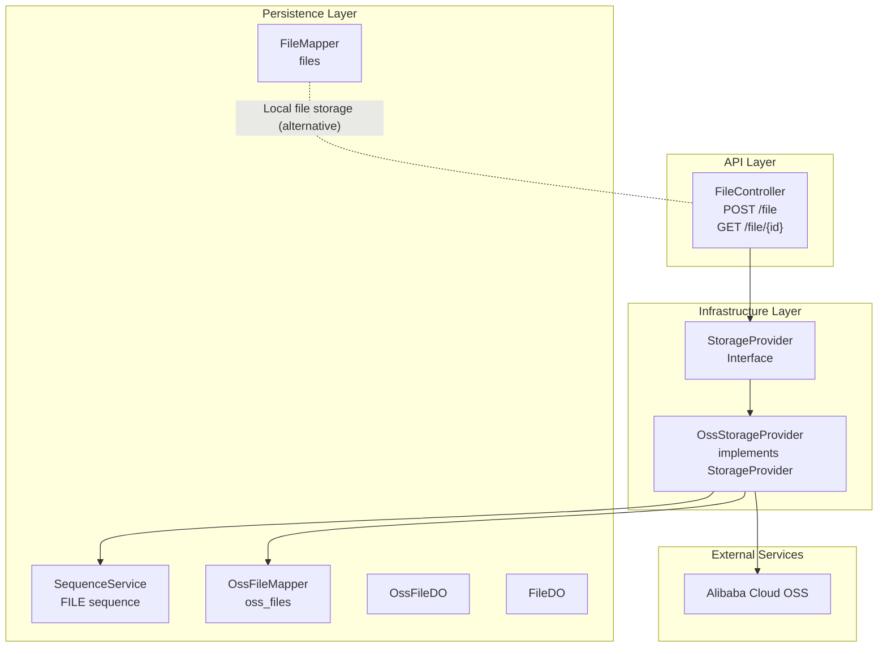
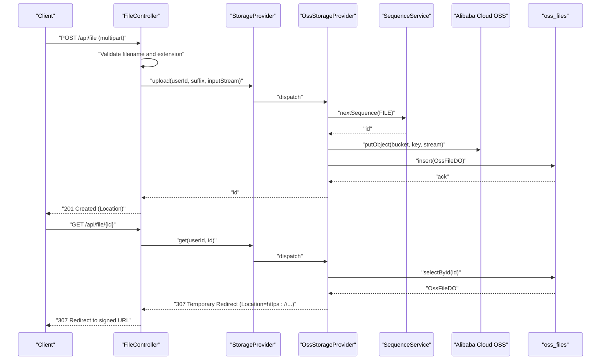
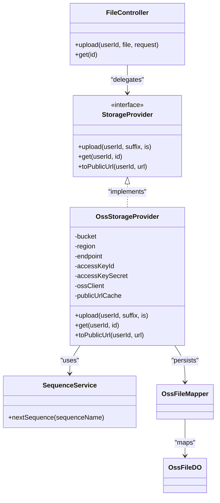
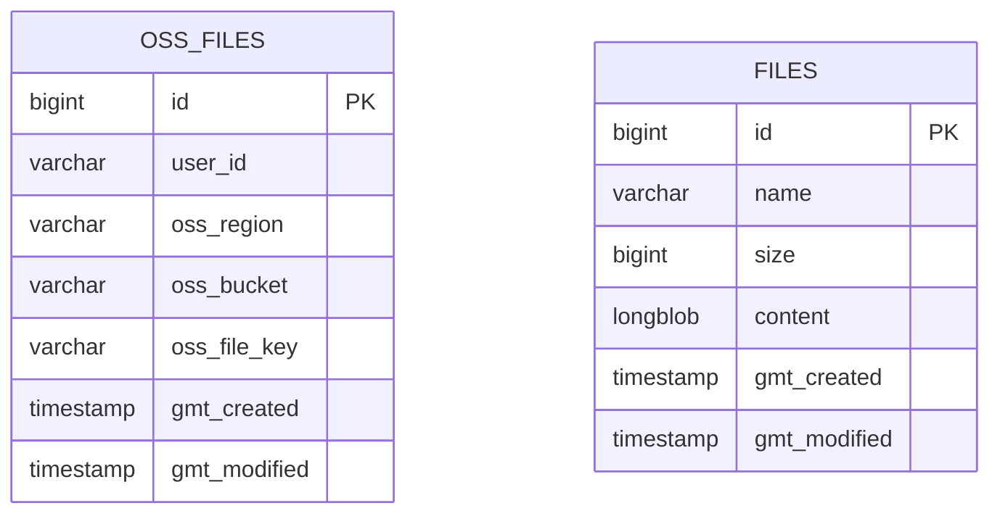

# File Upload and Storage

<cite>
**Referenced Files in This Document**
- [FileController.java](file://backend_java/api/src/main/java/com/aliyun/tam/x/tron/api/FileController.java)
- [StorageProvider.java](file://backend_java/infra/src/main/java/com/aliyun/tam/x/tron/infra/storage/StorageProvider.java)
- [OssStorageProvider.java](file://backend_java/infra/src/main/java/com/aliyun/tam/x/tron/infra/storage/OssStorageProvider.java)
- [FileRepository.java](file://backend_java/core/src/main/java/com/aliyun/tam/x/tron/core/domain/repository/FileRepository.java)
- [FileMapper.java](file://backend_java/infra/src/main/java/com/aliyun/tam/x/tron/infra/dal/mapper/FileMapper.java)
- [FileDO.java](file://backend_java/infra/src/main/java/com/aliyun/tam/x/tron/infra/dal/dataobject/FileDO.java)
- [OssFileDO.java](file://backend_java/infra/src/main/java/com/aliyun/tam/x/tron/infra/dal/dataobject/OssFileDO.java)
- [OssFileMapper.java](file://backend_java/infra/src/main/java/com/aliyun/tam/x/tron/infra/dal/mapper/OssFileMapper.java)
- [SequenceService.java](file://backend_java/infra/src/main/java/com/aliyun/tam/x/tron/infra/sequence/SequenceService.java)
- [application.yaml](file://backend_java/bootstrap/src/main/resources/application.yaml)
- [init.sql](file://backend_java/bootstrap/src/main/resources/schema/init.sql)
- [develop_guide.md](file://docs/en/develop_guide.md)
</cite>

## Table of Contents
1. [Introduction](#introduction)
2. [Project Structure](#project-structure)
3. [Core Components](#core-components)
4. [Architecture Overview](#architecture-overview)
5. [Detailed Component Analysis](#detailed-component-analysis)
6. [Dependency Analysis](#dependency-analysis)
7. [Performance Considerations](#performance-considerations)
8. [Troubleshooting Guide](#troubleshooting-guide)
9. [Conclusion](#conclusion)
10. [Appendices](#appendices)

## Introduction
This document explains the file upload and storage system in Tron OneAgent. It covers the storage provider abstraction, the Alibaba Cloud OSS integration, the upload/download workflow, validation and security controls, API endpoints, configuration, access control, and operational guidance for custom providers, large files, CDN strategies, performance optimization, and error handling.

## Project Structure
The file storage subsystem spans three layers:
- API layer: exposes HTTP endpoints for upload and retrieval.
- Infrastructure layer: defines the storage provider abstraction and the OSS provider implementation.
- Persistence layer: stores metadata for uploaded files (including OSS-specific records).

**Diagram sources**
- [FileController.java:37-112](file://backend_java/api/src/main/java/com/aliyun/tam/x/tron/api/FileController.java#L37-L112)
- [StorageProvider.java:25-33](file://backend_java/infra/src/main/java/com/aliyun/tam/x/tron/infra/storage/StorageProvider.java#L25-L33)
- [OssStorageProvider.java:58-198](file://backend_java/infra/src/main/java/com/aliyun/tam/x/tron/infra/storage/OssStorageProvider.java#L58-L198)
- [SequenceService.java:40-177](file://backend_java/infra/src/main/java/com/aliyun/tam/x/tron/infra/sequence/SequenceService.java#L40-L177)
- [OssFileMapper.java:27-29](file://backend_java/infra/src/main/java/com/aliyun/tam/x/tron/infra/dal/mapper/OssFileMapper.java#L27-L29)
- [FileMapper.java:27-29](file://backend_java/infra/src/main/java/com/aliyun/tam/x/tron/infra/dal/mapper/FileMapper.java#L27-L29)
- [OssFileDO.java:29-75](file://backend_java/infra/src/main/java/com/aliyun/tam/x/tron/infra/dal/dataobject/OssFileDO.java#L29-L75)
- [FileDO.java:30-69](file://backend_java/infra/src/main/java/com/aliyun/tam/x/tron/infra/dal/dataobject/FileDO.java#L30-L69)

**Section sources**
- [FileController.java:37-112](file://backend_java/api/src/main/java/com/aliyun/tam/x/tron/api/FileController.java#L37-L112)
- [StorageProvider.java:25-33](file://backend_java/infra/src/main/java/com/aliyun/tam/x/tron/infra/storage/StorageProvider.java#L25-L33)
- [OssStorageProvider.java:58-198](file://backend_java/infra/src/main/java/com/aliyun/tam/x/tron/infra/storage/OssStorageProvider.java#L58-L198)
- [SequenceService.java:40-177](file://backend_java/infra/src/main/java/com/aliyun/tam/x/tron/infra/sequence/SequenceService.java#L40-L177)
- [OssFileMapper.java:27-29](file://backend_java/infra/src/main/java/com/aliyun/tam/x/tron/infra/dal/mapper/OssFileMapper.java#L27-L29)
- [FileMapper.java:27-29](file://backend_java/infra/src/main/java/com/aliyun/tam/x/tron/infra/dal/mapper/FileMapper.java#L27-L29)
- [OssFileDO.java:29-75](file://backend_java/infra/src/main/java/com/aliyun/tam/x/tron/infra/dal/dataobject/OssFileDO.java#L29-L75)
- [FileDO.java:30-69](file://backend_java/infra/src/main/java/com/aliyun/tam/x/tron/infra/dal/dataobject/FileDO.java#L30-L69)

## Core Components
- FileController: Exposes upload and download endpoints, validates filenames, restricts allowed extensions, and delegates to the configured StorageProvider.
- StorageProvider: Abstraction for storage backends with upload and retrieval methods, plus optional public URL conversion.
- OssStorageProvider: Implements StorageProvider for Alibaba Cloud OSS, handles signed URLs, caching, and metadata persistence.
- SequenceService: Generates monotonic file identifiers and formats them for stable IDs.
- Data Access Objects and Mappers: Persist file metadata for OSS and local storage alternatives.

Key responsibilities:
- Validation: Rejects invalid filenames and disallowed file types.
- Security: Enforces per-user access checks for retrieval and redirects to signed URLs for downloads.
- Scalability: Uses cached pre-signed URLs and configurable OSS client settings.

**Section sources**
- [FileController.java:51-111](file://backend_java/api/src/main/java/com/aliyun/tam/x/tron/api/FileController.java#L51-L111)
- [StorageProvider.java:25-33](file://backend_java/infra/src/main/java/com/aliyun/tam/x/tron/infra/storage/StorageProvider.java#L25-L33)
- [OssStorageProvider.java:90-175](file://backend_java/infra/src/main/java/com/aliyun/tam/x/tron/infra/storage/OssStorageProvider.java#L90-L175)
- [SequenceService.java:104-132](file://backend_java/infra/src/main/java/com/aliyun/tam/x/tron/infra/sequence/SequenceService.java#L104-L132)
- [OssFileDO.java:32-75](file://backend_java/infra/src/main/java/com/aliyun/tam/x/tron/infra/dal/dataobject/OssFileDO.java#L32-L75)
- [FileDO.java:33-69](file://backend_java/infra/src/main/java/com/aliyun/tam/x/tron/infra/dal/dataobject/FileDO.java#L33-L69)

## Architecture Overview
The system routes HTTP requests through FileController to a StorageProvider implementation. For OSS, uploads write to OSS and record metadata in oss_files; downloads redirect clients to pre-signed URLs for secure, efficient retrieval.

**Diagram sources**
- [FileController.java:51-111](file://backend_java/api/src/main/java/com/aliyun/tam/x/tron/api/FileController.java#L51-L111)
- [OssStorageProvider.java:90-134](file://backend_java/infra/src/main/java/com/aliyun/tam/x/tron/infra/storage/OssStorageProvider.java#L90-L134)
- [SequenceService.java:130-132](file://backend_java/infra/src/main/java/com/aliyun/tam/x/tron/infra/sequence/SequenceService.java#L130-L132)
- [OssFileMapper.java:27-29](file://backend_java/infra/src/main/java/com/aliyun/tam/x/tron/infra/dal/mapper/OssFileMapper.java#L27-L29)

## Detailed Component Analysis

### FileController API Endpoints
- POST /api/file
  - Validates filename and extension.
  - Requires X-User-Id header.
  - Delegates upload to StorageProvider and returns a Location header pointing to the resource.
- GET /api/file/{id}
  - Retrieves file via StorageProvider; OSS provider returns a redirect to a pre-signed URL.

Security and validation highlights:
- Rejects filenames containing path traversal or separators.
- Restricts allowed extensions to a configured list.
- Returns appropriate HTTP statuses for not found, forbidden, and internal errors.

**Section sources**
- [FileController.java:51-111](file://backend_java/api/src/main/java/com/aliyun/tam/x/tron/api/FileController.java#L51-L111)
- [application.yaml:19-21](file://backend_java/bootstrap/src/main/resources/application.yaml#L19-L21)

### StorageProvider Abstraction
- Methods:
  - upload(userId, suffix, inputStream): returns a numeric file identifier.
  - get(userId, id): returns a ResponseEntity suitable for redirection or direct streaming.
  - toPublicUrl(userId, url): converts existing URLs to signed URLs when applicable.
- Conditional activation: The OSS provider activates when tron.file.provider.type=oss.

Implementation pattern:
- Implementers must handle identity scoping and access control.
- Returning pre-signed URLs enables CDN-friendly delivery and reduces server bandwidth.

**Section sources**
- [StorageProvider.java:25-33](file://backend_java/infra/src/main/java/com/aliyun/tam/x/tron/infra/storage/StorageProvider.java#L25-L33)
- [OssStorageProvider.java:54-58](file://backend_java/infra/src/main/java/com/aliyun/tam/x/tron/infra/storage/OssStorageProvider.java#L54-L58)

### OssStorageProvider Implementation
Responsibilities:
- Upload: generates a unique id via SequenceService, writes to OSS with a structured key, persists metadata to oss_files.
- Retrieve: validates ownership, generates a pre-signed URL with expiration, caches it, and returns a redirect.
- Public URL conversion: recognizes internal file paths and existing signed URLs, rewrites them to fresh signed URLs when authorized.

Configuration and tuning:
- Reads OSS credentials, region, endpoint, and bucket from application properties.
- Uses HTTPS, signature version v4, and tuned timeouts/retries.
- Caches signed URLs for 60 minutes to reduce repeated signing overhead.

Access control:
- Enforces per-user access during retrieval.
- Uses pre-signed URLs to delegate access to OSS.

**Section sources**
- [OssStorageProvider.java:62-76](file://backend_java/infra/src/main/java/com/aliyun/tam/x/tron/infra/storage/OssStorageProvider.java#L62-L76)
- [OssStorageProvider.java:90-134](file://backend_java/infra/src/main/java/com/aliyun/tam/x/tron/infra/storage/OssStorageProvider.java#L90-L134)
- [OssStorageProvider.java:136-175](file://backend_java/infra/src/main/java/com/aliyun/tam/x/tron/infra/storage/OssStorageProvider.java#L136-L175)
- [application.yaml:44-49](file://backend_java/bootstrap/src/main/resources/application.yaml#L44-L49)

### SequenceService for Stable Identifiers
- Provides monotonic sequences for file IDs with configurable step sizes and retries.
- Formats IDs combining a timestamp prefix and a small counter portion for uniqueness and approximate ordering.

Operational impact:
- Ensures stable, collision-resistant identifiers for uploaded files.
- Supports high throughput by allocating sequence blocks and caching counters.

**Section sources**
- [SequenceService.java:104-132](file://backend_java/infra/src/main/java/com/aliyun/tam/x/tron/infra/sequence/SequenceService.java#L104-L132)
- [SequenceService.java:172-176](file://backend_java/infra/src/main/java/com/aliyun/tam/x/tron/infra/sequence/SequenceService.java#L172-L176)

### Data Model and Persistence
Tables:
- oss_files: stores OSS metadata keyed by numeric id, user_id, region, bucket, and file key.
- files: legacy/local storage model with name, size, and binary content (not used by OSS provider).

Mappings:
- OssFileMapper and OssFileDO for OSS metadata.
- FileMapper and FileDO for local storage alternative.

**Section sources**
- [init.sql:191-205](file://backend_java/bootstrap/src/main/resources/schema/init.sql#L191-L205)
- [OssFileDO.java:32-75](file://backend_java/infra/src/main/java/com/aliyun/tam/x/tron/infra/dal/dataobject/OssFileDO.java#L32-L75)
- [FileDO.java:33-69](file://backend_java/infra/src/main/java/com/aliyun/tam/x/tron/infra/dal/dataobject/FileDO.java#L33-L69)
- [OssFileMapper.java:27-29](file://backend_java/infra/src/main/java/com/aliyun/tam/x/tron/infra/dal/mapper/OssFileMapper.java#L27-L29)
- [FileMapper.java:27-29](file://backend_java/infra/src/main/java/com/aliyun/tam/x/tron/infra/dal/mapper/FileMapper.java#L27-L29)

### Local File Repository Alternative
While the OSS provider is active, the system can also support a local filesystem repository via a separate FileRepository interface and mapper. This allows storing files locally when needed.

**Section sources**
- [FileRepository.java:26-48](file://backend_java/core/src/main/java/com/aliyun/tam/x/tron/core/domain/repository/FileRepository.java#L26-L48)
- [FileMapper.java:27-29](file://backend_java/infra/src/main/java/com/aliyun/tam/x/tron/infra/dal/mapper/FileMapper.java#L27-L29)
- [FileDO.java:33-69](file://backend_java/infra/src/main/java/com/aliyun/tam/x/tron/infra/dal/dataobject/FileDO.java#L33-L69)

## Dependency Analysis
- FileController depends on StorageProvider (autowired optional).
- OssStorageProvider depends on:
  - SequenceService for ids
  - OssFileMapper for metadata persistence
  - OSS SDK for object operations
  - Guava Cache for signed URL caching
- Configuration is driven by application.yaml properties.

**Diagram sources**
- [FileController.java:41-111](file://backend_java/api/src/main/java/com/aliyun/tam/x/tron/api/FileController.java#L41-L111)
- [StorageProvider.java:25-33](file://backend_java/infra/src/main/java/com/aliyun/tam/x/tron/infra/storage/StorageProvider.java#L25-L33)
- [OssStorageProvider.java:58-198](file://backend_java/infra/src/main/java/com/aliyun/tam/x/tron/infra/storage/OssStorageProvider.java#L58-L198)
- [SequenceService.java:40-177](file://backend_java/infra/src/main/java/com/aliyun/tam/x/tron/infra/sequence/SequenceService.java#L40-L177)
- [OssFileMapper.java:27-29](file://backend_java/infra/src/main/java/com/aliyun/tam/x/tron/infra/dal/mapper/OssFileMapper.java#L27-L29)
- [OssFileDO.java:29-75](file://backend_java/infra/src/main/java/com/aliyun/tam/x/tron/infra/dal/dataobject/OssFileDO.java#L29-L75)

**Section sources**
- [FileController.java:48-49](file://backend_java/api/src/main/java/com/aliyun/tam/x/tron/api/FileController.java#L48-L49)
- [OssStorageProvider.java:81-83](file://backend_java/infra/src/main/java/com/aliyun/tam/x/tron/infra/storage/OssStorageProvider.java#L81-L83)

## Performance Considerations
- Pre-signed URL caching: OssStorageProvider caches signed URLs for 60 minutes to minimize repeated signing and latency.
- Client-side CDN: Redirects to OSS-hosted URLs enable CDN acceleration and reduce origin load.
- Upload limits: Spring’s multipart limits prevent oversized single uploads; consider chunked uploads for very large files.
- Concurrency: SequenceService allocates sequence blocks to reduce database contention.

Optimization strategies:
- Use CDN with signed URL caching for global distribution.
- For large files, implement resumable uploads and server-side checksum verification.
- Tune OSS client timeouts and retries according to network conditions.

**Section sources**
- [OssStorageProvider.java:85-88](file://backend_java/infra/src/main/java/com/aliyun/tam/x/tron/infra/storage/OssStorageProvider.java#L85-L88)
- [OssStorageProvider.java:122-126](file://backend_java/infra/src/main/java/com/aliyun/tam/x/tron/infra/storage/OssStorageProvider.java#L122-L126)
- [application.yaml:19-21](file://backend_java/bootstrap/src/main/resources/application.yaml#L19-L21)

## Troubleshooting Guide
Common issues and resolutions:
- Upload fails with “Invalid file name”:
  - Occurs when filename is empty or contains path traversal characters.
  - Fix: sanitize filenames and avoid special characters.
- “File type not allowed”:
  - Returned when extension is not in the allowed list.
  - Fix: adjust allowed extensions or convert to supported formats.
- “Not Found” on upload:
  - StorageProvider not configured or disabled.
  - Fix: set tron.file.provider.type=oss and provide OSS credentials.
- “Forbidden” on download:
  - Requester does not match file owner.
  - Fix: ensure X-User-Id matches the file’s user_id.
- Internal server error on download:
  - Database lookup failure or signed URL generation error.
  - Fix: verify oss_files record exists and OSS credentials are valid.

Retry and cleanup:
- Signed URL cache refreshes automatically on subsequent requests.
- For local storage alternatives, implement idempotent uploads and cleanup of temporary files.

**Section sources**
- [FileController.java:61-81](file://backend_java/api/src/main/java/com/aliyun/tam/x/tron/api/FileController.java#L61-L81)
- [OssStorageProvider.java:112-134](file://backend_java/infra/src/main/java/com/aliyun/tam/x/tron/infra/storage/OssStorageProvider.java#L112-L134)

## Conclusion
The file upload and storage system centers on a clean StorageProvider abstraction with a robust OSS implementation. It enforces validation and access control, leverages pre-signed URLs for secure and scalable delivery, and provides hooks for customization and extension. Configuration is straightforward via application properties, and operational guidance supports performance and reliability at scale.

## Appendices

### API Endpoints Summary
- POST /api/file
  - Headers: X-User-Id (required)
  - Body: multipart/form-data with field “file”
  - Response: 201 Created with Location header; body indicates validation errors
- GET /api/file/{id}
  - Response: 307 Temporary Redirect to a pre-signed OSS URL; or 404/403/500 as appropriate

Allowed file types:
- Currently restricted to a predefined list; adjust validation logic to expand.

**Section sources**
- [FileController.java:51-111](file://backend_java/api/src/main/java/com/aliyun/tam/x/tron/api/FileController.java#L51-L111)
- [application.yaml:19-21](file://backend_java/bootstrap/src/main/resources/application.yaml#L19-L21)

### Configuration Options
- tron.file.provider.type: selects storage backend (oss or local)
- tron.file.server.base-url: overrides Location header for uploads
- tron.oss.bucket, tron.oss.region, tron.oss.endpoint, tron.oss.access-key-id, tron.oss.access-key-secret: OSS connection settings
- spring.servlet.multipart.max-file-size, spring.servlet.multipart.max-request-size: upload size limits

**Section sources**
- [application.yaml:39-49](file://backend_java/bootstrap/src/main/resources/application.yaml#L39-L49)
- [application.yaml:19-21](file://backend_java/bootstrap/src/main/resources/application.yaml#L19-L21)

### Implementing a Custom Storage Provider
Steps:
- Implement StorageProvider interface.
- Use @ConditionalOnProperty to activate conditionally.
- Provide upload and get methods; optionally implement toPublicUrl for URL normalization.
- Register provider beans and configure tron.file.provider.type accordingly.

Reference example:
- Local filesystem provider example in development guide.

**Section sources**
- [StorageProvider.java:25-33](file://backend_java/infra/src/main/java/com/aliyun/tam/x/tron/infra/storage/StorageProvider.java#L25-L33)
- [develop_guide.md:2082-2128](file://docs/en/develop_guide.md#L2082-L2128)

### Handling Large File Uploads
- Current limits: enforced by multipart settings.
- Recommended approach: implement chunked/resumable uploads and server-side verification.
- For OSS, consider multipart uploads at the client or server level to improve reliability.

**Section sources**
- [application.yaml:19-21](file://backend_java/bootstrap/src/main/resources/application.yaml#L19-L21)

### CDN Integration Strategies
- Redirects to OSS URLs enable CDN caching and edge delivery.
- Keep signed URL cache warm to reduce origin requests.
- Consider bucket policies and CDN origin configurations for optimal performance.

**Section sources**
- [OssStorageProvider.java:122-129](file://backend_java/infra/src/main/java/com/aliyun/tam/x/tron/infra/storage/OssStorageProvider.java#L122-L129)
- [OssStorageProvider.java:85-88](file://backend_java/infra/src/main/java/com/aliyun/tam/x/tron/infra/storage/OssStorageProvider.java#L85-L88)

### Data Model Reference

**Diagram sources**
- [init.sql:191-205](file://backend_java/bootstrap/src/main/resources/schema/init.sql#L191-L205)
- [init.sql:162-174](file://backend_java/bootstrap/src/main/resources/schema/init.sql#L162-L174)