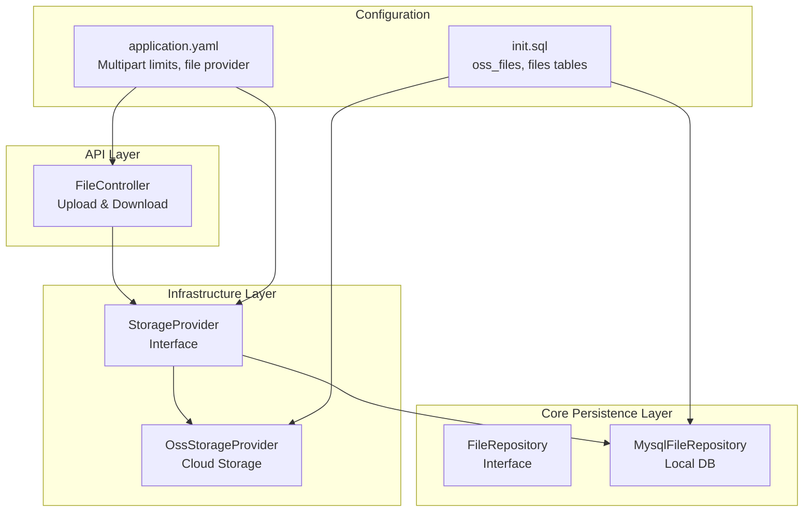
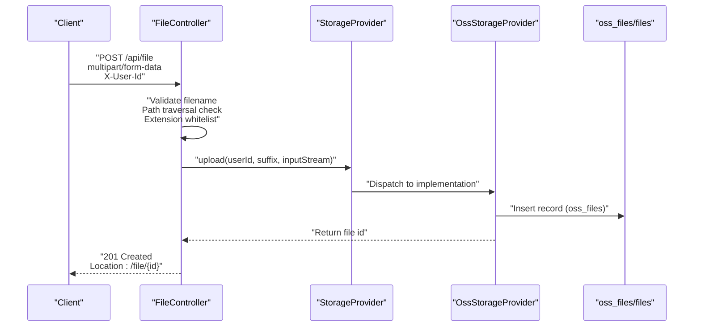
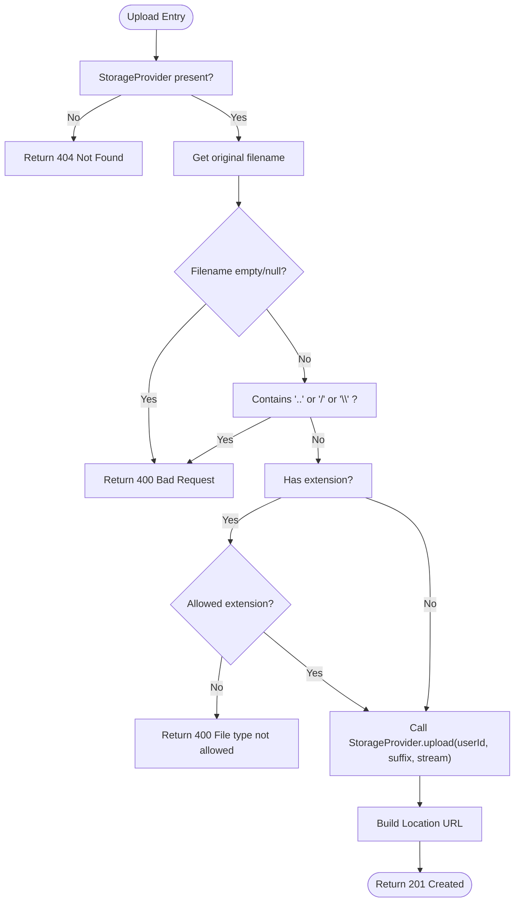
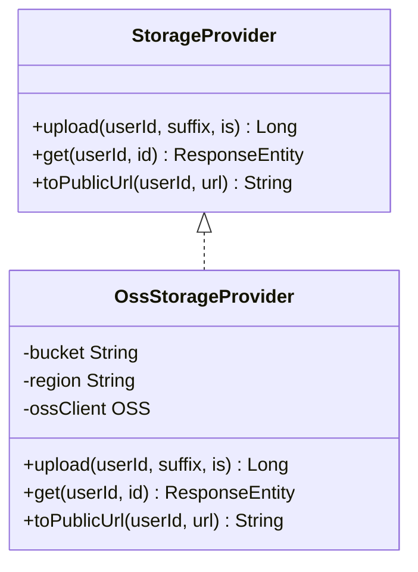
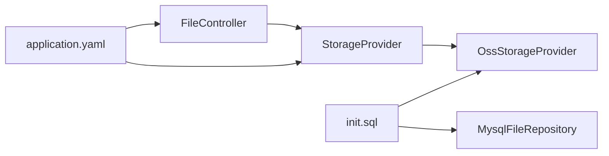

# Security and Validation

<cite>
**Referenced Files in This Document**
- [FileController.java](file://backend_java/api/src/main/java/com/aliyun/tam/x/tron/api/FileController.java)
- [StorageProvider.java](file://backend_java/infra/src/main/java/com/aliyun/tam/x/tron/infra/storage/StorageProvider.java)
- [OssStorageProvider.java](file://backend_java/infra/src/main/java/com/aliyun/tam/x/tron/infra/storage/OssStorageProvider.java)
- [application.yaml](file://backend_java/bootstrap/src/main/resources/application.yaml)
- [init.sql](file://backend_java/bootstrap/src/main/resources/schema/init.sql)
- [WebMvcConfig.java](file://backend_java/bootstrap/src/main/java/com/aliyun/tam/x/tron/config/WebMvcConfig.java)
- [MysqlFileRepository.java](file://backend_java/core/src/main/java/com/aliyun/tam/x/tron/core/domain/repository/mysql/MysqlFileRepository.java)
- [FileRepository.java](file://backend_java/core/src/main/java/com/aliyun/tam/x/tron/core/domain/repository/FileRepository.java)
- [SessionController.java](file://backend_java/api/src/main/java/com/aliyun/tam/x/tron/api/SessionController.java)
</cite>

## Table of Contents
1. [Introduction](#introduction)
2. [Project Structure](#project-structure)
3. [Core Components](#core-components)
4. [Architecture Overview](#architecture-overview)
5. [Detailed Component Analysis](#detailed-component-analysis)
6. [Dependency Analysis](#dependency-analysis)
7. [Performance Considerations](#performance-considerations)
8. [Troubleshooting Guide](#troubleshooting-guide)
9. [Conclusion](#conclusion)
10. [Appendices](#appendices)

## Introduction
This document details the file upload security measures and validation mechanisms implemented in Tron OneAgent’s backend Java module. It focuses on filename validation logic (including path traversal prevention, invalid character filtering, and extension whitelist enforcement), security headers and request validation performed by the FileController, user authentication requirements via the X-User-Id header, session-based access control, file type restrictions and MIME-type validation strategies, and mitigation approaches for XXE, malicious file uploads, and resource exhaustion attacks. It also outlines best practices for secure file handling, temporary file management, cleanup procedures, and logging/monitoring requirements for suspicious upload attempts and audit trails.

## Project Structure
The file upload feature spans three layers:
- API layer: FileController exposes endpoints for upload and retrieval.
- Infrastructure layer: StorageProvider abstraction and OssStorageProvider implementation for cloud storage.
- Core persistence layer: FileRepository and MysqlFileRepository for local storage fallback.

**Diagram sources**
- [FileController.java:37-112](file://backend_java/api/src/main/java/com/aliyun/tam/x/tron/api/FileController.java#L37-L112)
- [StorageProvider.java:25-33](file://backend_java/infra/src/main/java/com/aliyun/tam/x/tron/infra/storage/StorageProvider.java#L25-L33)
- [OssStorageProvider.java:58-134](file://backend_java/infra/src/main/java/com/aliyun/tam/x/tron/infra/storage/OssStorageProvider.java#L58-L134)
- [FileRepository.java:26-48](file://backend_java/core/src/main/java/com/aliyun/tam/x/tron/core/domain/repository/FileRepository.java#L26-L48)
- [MysqlFileRepository.java:32-58](file://backend_java/core/src/main/java/com/aliyun/tam/x/tron/core/domain/repository/mysql/MysqlFileRepository.java#L32-L58)
- [application.yaml:18-21](file://backend_java/bootstrap/src/main/resources/application.yaml#L18-L21)
- [application.yaml:39-49](file://backend_java/bootstrap/src/main/resources/application.yaml#L39-L49)
- [init.sql:162-205](file://backend_java/bootstrap/src/main/resources/schema/init.sql#L162-L205)

**Section sources**
- [FileController.java:37-112](file://backend_java/api/src/main/java/com/aliyun/tam/x/tron/api/FileController.java#L37-L112)
- [StorageProvider.java:25-33](file://backend_java/infra/src/main/java/com/aliyun/tam/x/tron/infra/storage/StorageProvider.java#L25-L33)
- [OssStorageProvider.java:58-134](file://backend_java/infra/src/main/java/com/aliyun/tam/x/tron/infra/storage/OssStorageProvider.java#L58-L134)
- [FileRepository.java:26-48](file://backend_java/core/src/main/java/com/aliyun/tam/x/tron/core/domain/repository/FileRepository.java#L26-L48)
- [MysqlFileRepository.java:32-58](file://backend_java/core/src/main/java/com/aliyun/tam/x/tron/core/domain/repository/mysql/MysqlFileRepository.java#L32-L58)
- [application.yaml:18-21](file://backend_java/bootstrap/src/main/resources/application.yaml#L18-L21)
- [application.yaml:39-49](file://backend_java/bootstrap/src/main/resources/application.yaml#L39-L49)
- [init.sql:162-205](file://backend_java/bootstrap/src/main/resources/schema/init.sql#L162-L205)

## Core Components
- FileController: Validates filename, enforces extension whitelist, extracts user identity from X-User-Id, delegates upload to StorageProvider, and constructs response URLs.
- StorageProvider: Abstraction for upload and retrieval; OssStorageProvider implements cloud storage with signed URL generation and per-user access checks.
- FileRepository and MysqlFileRepository: Local storage fallback with database-backed file blobs and metadata.
- Configuration: application.yaml sets multipart limits and selects file provider type; init.sql defines storage tables.

Key security controls observed:
- Filename validation prevents path traversal and disallows invalid characters.
- Extension whitelist restricts uploads to specific image types.
- Access control ensures only the owning user can retrieve files.
- Signed URLs limit exposure and enforce time-bound access.

**Section sources**
- [FileController.java:51-100](file://backend_java/api/src/main/java/com/aliyun/tam/x/tron/api/FileController.java#L51-L100)
- [StorageProvider.java:25-33](file://backend_java/infra/src/main/java/com/aliyun/tam/x/tron/infra/storage/StorageProvider.java#L25-L33)
- [OssStorageProvider.java:111-134](file://backend_java/infra/src/main/java/com/aliyun/tam/x/tron/infra/storage/OssStorageProvider.java#L111-L134)
- [application.yaml:18-21](file://backend_java/bootstrap/src/main/resources/application.yaml#L18-L21)
- [application.yaml:39-49](file://backend_java/bootstrap/src/main/resources/application.yaml#L39-L49)
- [init.sql:162-205](file://backend_java/bootstrap/src/main/resources/schema/init.sql#L162-L205)

## Architecture Overview
The upload flow integrates request validation, storage selection, and access control.

**Diagram sources**
- [FileController.java:51-100](file://backend_java/api/src/main/java/com/aliyun/tam/x/tron/api/FileController.java#L51-L100)
- [OssStorageProvider.java:90-109](file://backend_java/infra/src/main/java/com/aliyun/tam/x/tron/infra/storage/OssStorageProvider.java#L90-L109)
- [init.sql:191-205](file://backend_java/bootstrap/src/main/resources/schema/init.sql#L191-L205)

## Detailed Component Analysis

### FileController: Upload and Request Validation
Responsibilities:
- Enforces filename validity and path traversal prevention.
- Filters filenames containing invalid characters.
- Implements extension whitelist for allowed file types.
- Extracts user identity from X-User-Id header.
- Delegates upload to StorageProvider and constructs response URLs.

Validation logic highlights:
- Rejects empty or null filenames.
- Blocks filenames containing path traversal or OS-specific separators.
- Restricts uploads to a predefined set of extensions.
- Uses configured base URL or constructs a location based on request scheme/host/port.

Access control:
- Retrieves user ID from X-User-Id header.
- Delegates retrieval checks to StorageProvider implementation.

**Diagram sources**
- [FileController.java:51-100](file://backend_java/api/src/main/java/com/aliyun/tam/x/tron/api/FileController.java#L51-L100)

**Section sources**
- [FileController.java:51-100](file://backend_java/api/src/main/java/com/aliyun/tam/x/tron/api/FileController.java#L51-L100)

### StorageProvider and OssStorageProvider: Access Control and Retrieval
Responsibilities:
- StorageProvider defines upload and retrieval contracts.
- OssStorageProvider implements upload to OSS and retrieval via signed URLs with time-bound expiration.
- Enforces per-user access control during retrieval.

Access control specifics:
- During retrieval, compares requested user ID against stored ownership.
- Returns 403 Forbidden if mismatch.
- Generates pre-signed GET URLs with expiration to minimize exposure.

**Diagram sources**
- [StorageProvider.java:25-33](file://backend_java/infra/src/main/java/com/aliyun/tam/x/tron/infra/storage/StorageProvider.java#L25-L33)
- [OssStorageProvider.java:58-134](file://backend_java/infra/src/main/java/com/aliyun/tam/x/tron/infra/storage/OssStorageProvider.java#L58-L134)

**Section sources**
- [StorageProvider.java:25-33](file://backend_java/infra/src/main/java/com/aliyun/tam/x/tron/infra/storage/StorageProvider.java#L25-L33)
- [OssStorageProvider.java:111-134](file://backend_java/infra/src/main/java/com/aliyun/tam/x/tron/infra/storage/OssStorageProvider.java#L111-L134)

### Local File Repository: Fallback and Metadata
Responsibilities:
- Provides local storage fallback via database-backed file blobs.
- Stores filename, size, and content for retrieval.

Note: The current FileController relies on StorageProvider. Local repository is available for environments without cloud storage.

**Section sources**
- [FileRepository.java:26-48](file://backend_java/core/src/main/java/com/aliyun/tam/x/tron/core/domain/repository/FileRepository.java#L26-L48)
- [MysqlFileRepository.java:32-58](file://backend_java/core/src/main/java/com/aliyun/tam/x/tron/core/domain/repository/mysql/MysqlFileRepository.java#L32-L58)

### Configuration and Environment Controls
- Multipart limits: Max file size and request size enforced at the framework level.
- Provider selection: tron.file.provider.type determines whether OSS or local storage is used.
- Base URL override: tron.file.server.base-url allows constructing canonical file URLs.

Operational implications:
- Limits reduce risk of resource exhaustion via large payloads.
- Provider configuration enables environment-specific storage backends.

**Section sources**
- [application.yaml:18-21](file://backend_java/bootstrap/src/main/resources/application.yaml#L18-L21)
- [application.yaml:39-49](file://backend_java/bootstrap/src/main/resources/application.yaml#L39-L49)

### Database Schema for File Storage
- oss_files: Tracks uploaded files with user ownership and OSS metadata.
- files: Local storage table for file blobs and metadata.

Security relevance:
- Ownership fields enable per-user access checks.
- Indexes support efficient lookups.

**Section sources**
- [init.sql:191-205](file://backend_java/bootstrap/src/main/resources/schema/init.sql#L191-L205)
- [init.sql:162-174](file://backend_java/bootstrap/src/main/resources/schema/init.sql#L162-L174)

### Session-Based Access Control Context
While FileController validates X-User-Id for upload, session-based access control is demonstrated in SessionController for other endpoints. This pattern indicates a consistent approach to user identity verification across the API.

**Section sources**
- [SessionController.java:132-158](file://backend_java/api/src/main/java/com/aliyun/tam/x/tron/api/SessionController.java#L132-L158)
- [SessionController.java:187-203](file://backend_java/api/src/main/java/com/aliyun/tam/x/tron/api/SessionController.java#L187-L203)

## Dependency Analysis
- FileController depends on StorageProvider for upload and retrieval.
- OssStorageProvider depends on OSS client configuration and database mapping for metadata.
- application.yaml governs multipart limits and provider selection.
- init.sql defines storage tables used by providers.

**Diagram sources**
- [FileController.java:37-112](file://backend_java/api/src/main/java/com/aliyun/tam/x/tron/api/FileController.java#L37-L112)
- [StorageProvider.java:25-33](file://backend_java/infra/src/main/java/com/aliyun/tam/x/tron/infra/storage/StorageProvider.java#L25-L33)
- [OssStorageProvider.java:58-134](file://backend_java/infra/src/main/java/com/aliyun/tam/x/tron/infra/storage/OssStorageProvider.java#L58-L134)
- [application.yaml:18-21](file://backend_java/bootstrap/src/main/resources/application.yaml#L18-L21)
- [application.yaml:39-49](file://backend_java/bootstrap/src/main/resources/application.yaml#L39-L49)
- [init.sql:162-205](file://backend_java/bootstrap/src/main/resources/schema/init.sql#L162-L205)

**Section sources**
- [FileController.java:37-112](file://backend_java/api/src/main/java/com/aliyun/tam/x/tron/api/FileController.java#L37-L112)
- [OssStorageProvider.java:58-134](file://backend_java/infra/src/main/java/com/aliyun/tam/x/tron/infra/storage/OssStorageProvider.java#L58-L134)
- [application.yaml:18-21](file://backend_java/bootstrap/src/main/resources/application.yaml#L18-L21)
- [application.yaml:39-49](file://backend_java/bootstrap/src/main/resources/application.yaml#L39-L49)
- [init.sql:162-205](file://backend_java/bootstrap/src/main/resources/schema/init.sql#L162-L205)

## Performance Considerations
- Multipart limits: application.yaml caps max file/request sizes to mitigate resource exhaustion.
- Signed URL caching: OssStorageProvider caches pre-signed URLs to reduce repeated signing overhead.
- Connection timeouts: OSS client configuration includes timeouts and retry settings to improve resilience.

Recommendations:
- Monitor upload throughput and latency; adjust timeouts and cache TTL as needed.
- Consider streaming uploads to external storage to avoid holding large payloads in memory.

**Section sources**
- [application.yaml:18-21](file://backend_java/bootstrap/src/main/resources/application.yaml#L18-L21)
- [OssStorageProvider.java:85-88](file://backend_java/infra/src/main/java/com/aliyun/tam/x/tron/infra/storage/OssStorageProvider.java#L85-L88)
- [OssStorageProvider.java:178-198](file://backend_java/infra/src/main/java/com/aliyun/tam/x/tron/infra/storage/OssStorageProvider.java#L178-L198)

## Troubleshooting Guide
Common issues and mitigations:
- 400 Bad Request on upload:
  - Empty or null filename.
  - Filename contains path traversal or invalid characters.
  - Disallowed file extension.
- 404 Not Found:
  - StorageProvider not configured.
- 403 Forbidden on retrieval:
  - Requested file does not belong to the requesting user.
- CORS behavior:
  - Global CORS configuration allows all origins; ensure client-side expectations align.

Operational tips:
- Verify X-User-Id header presence and correctness.
- Confirm tron.file.provider.type matches deployment environment.
- Review logs for warnings on invalid file IDs or storage errors.

**Section sources**
- [FileController.java:56-67](file://backend_java/api/src/main/java/com/aliyun/tam/x/tron/api/FileController.java#L56-L67)
- [FileController.java:75-78](file://backend_java/api/src/main/java/com/aliyun/tam/x/tron/api/FileController.java#L75-L78)
- [OssStorageProvider.java:118-120](file://backend_java/infra/src/main/java/com/aliyun/tam/x/tron/infra/storage/OssStorageProvider.java#L118-L120)
- [WebMvcConfig.java:81-88](file://backend_java/bootstrap/src/main/java/com/aliyun/tam/x/tron/config/WebMvcConfig.java#L81-L88)

## Conclusion
Tron OneAgent implements a layered approach to secure file uploads:
- Client-side and server-side filename validation prevent path traversal and reject invalid inputs.
- An extension whitelist limits accepted file types.
- Access control ties uploads and downloads to the X-User-Id header and enforces per-user ownership.
- Cloud storage integration uses signed URLs with expiration to minimize exposure.
- Configuration supports environment-specific storage backends and resource limits.

Areas to consider for further hardening include MIME-type validation, virus scanning, and stricter CORS policies tailored to production environments.

## Appendices

### Security Headers and Request Validation Checklist
- X-User-Id header mandatory for upload.
- Filename validation: no null/empty, no path traversal, no OS separators.
- Extension whitelist enforced.
- Multipart limits configured in application.yaml.
- Signed URL retrieval with expiration.

**Section sources**
- [FileController.java:53-81](file://backend_java/api/src/main/java/com/aliyun/tam/x/tron/api/FileController.java#L53-L81)
- [application.yaml:18-21](file://backend_java/bootstrap/src/main/resources/application.yaml#L18-L21)

### MIME-Type Validation Strategy
Observed behavior:
- Frontend filters attachments by MIME type prefixes for images, video, and audio.
- Backend enforces an extension whitelist for uploads.

Recommended enhancements:
- Validate Content-Type at the API boundary.
- Normalize and canonicalize MIME types.
- Consider server-side magic-byte inspection for critical workloads.

**Section sources**
- [useAttachments.ts:49-60](file://frontend/packages/chatbox/extends/ChatBox/MessageInput/hooks/useAttachments.ts#L49-L60)

### Mitigations for Known Vulnerabilities
- XXE attacks:
  - Avoid XML parsing of untrusted uploads; if required, disable external entity loading and DTD resolution.
- Malicious file uploads:
  - Enforce strict extension whitelist and consider virus scanning.
  - Store uploads outside public web roots; serve via signed URLs.
- Resource exhaustion:
  - Keep multipart limits low; monitor upload rates and sizes.
  - Use streaming and pre-signed URLs to avoid buffering large payloads.

[No sources needed since this section provides general guidance]

### Best Practices for Secure File Handling
- Temporary file management:
  - Stream uploads directly to storage; avoid writing to disk unnecessarily.
- Cleanup procedures:
  - Implement retention policies and garbage collection for orphaned records.
- Logging and monitoring:
  - Log failed validations, blocked uploads, and access denials.
  - Track suspicious patterns (multiple failures, unusual sizes, repeated attempts).
  - Generate audit trails linking user ID, filename, IP address, and timestamps.

[No sources needed since this section provides general guidance]